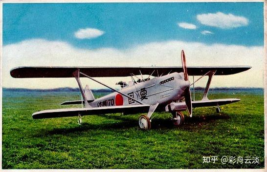
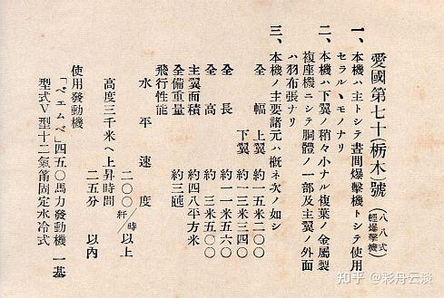

# 存在于外国网站的抗联战果

| 项目 | 内容 |
|---|---|
| 类型 | article |
| 作者 | 彩舟云淡 |
| 收藏时间 | 2026-08-06 18:30 |
| 发布时间 | - |
| 收藏夹 | 抗联 |
| 原链接 | https://zhuanlan.zhihu.com/p/2068749513783825955 |

## 正文

今天笔者在翻阅该Aviation Safety Network（航空安全网络）时，发现了一个意想不到的成果。首先先说一下这个Aviation Safety Network，该网站是专门用来收录全球航空事故的，不过遗漏了很多航空事故，并不完善，笔者经常喜欢用该网站。

 

Aviation Safety Network收录过这样一条航空事故：The Kawasaki Army Type 88 which was registered Aikoku (&#34;Patriot&#34;) No. 70 and named Tochigi was shot down by Chinese resistance militia in an island in Lake Jingpo.（注册编号为Aikoku（“爱国者”）70号并命名为栃木的川崎陆军88型被中国抵抗民兵在镜泊湖的一个岛上击落。）

 
<figure data-size="normal"></figure><figure data-size="normal"></figure>
通过中文翻译我们可以知道，一架名为“栃木”的“爱国者”70号日军88式轻爆击机在镜泊湖被东北抗日武装击落，时间发生在1935年6月8日。Aviation Safety Network引用的日方资料《陸軍愛国号献納機調査報告　その４【標記、消息、まとめ】》对此记载更加完善：“昭和10年6月 8日、在満飛行隊の長 谷川孝軍曹操縦(三原伊東喜伍長搭乗) により、満洲浜江省鏡泊湖内無名島に て匪賊を発見し、急降下爆撃中に地上 よりの銃撃を受け墜落。両名は殉職。”交代了阵亡的飞行员姓名、被击落的细节。（这些在《日本航空殉難史 昭和10年版》、《忠勇列伝 満洲上海事変之部》等资料的记载更加详细。）

 

击落这架88式轻爆击机的就是东北反日联合军第5军（东北抗日联军第5军前身）。一开始时我没有认真甄别这架飞机是谁的战果，而是笼统的划分给东北抗日义勇军。主要是我觉得抗联是在1936年才主导东北抗日的。后来 <a class="member_mention" href="https://www.zhihu.com/people/1743bdb63b6e60c0ea4605d53fde9ad5" data-hash="1743bdb63b6e60c0ea4605d53fde9ad5" data-hovercard="p$b$1743bdb63b6e60c0ea4605d53fde9ad5">@国而忘家</a> 提醒我，早在1935年6月那会义勇军已经不是东北抗战的主力，又告之镜泊湖那一带在那时是东北反日联合军第5军的活动区域。

 

这很有可能是抗联乃至整个tg抗日武装击落的第一架日军飞机，意义非常大。抗联的武器装备差，却能击落日军飞机，这简直是上帝都才能创造的奇迹啊。不过怎么耀眼的战绩在抗联的史料中竟然没有！！！我们再仔细一想，好像并不奇怪。抗联幸存下来的人少，留下来的资料也就越少，不像八路军新四军他们幸存下来的人，资料也就越多。抗联也不像八路军新四军一样，有个什么日报专门对外宣传自己打仗的事情。建国后那些幸存下来的抗联军政主官除了周保中，几乎都在那十年被打倒的差不多，抗联的史料可能也在那十年没了很多。

 

这是一场只存在于外国网站的战果，我们了解我们军队的战绩竟然要靠外国网站，我们到底什么时候才能让更多的英雄事迹重见天日。

---
导出时间: 2026-08-23 19:06