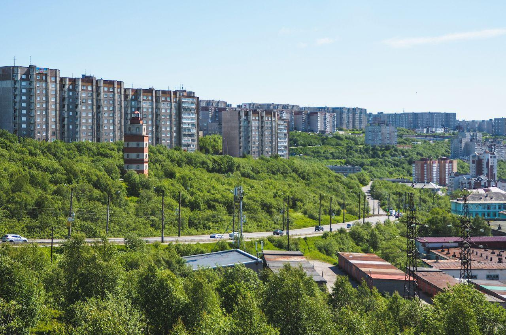

# 如果在另一个世界里，赛里斯成为了“苏联”，二战会是什么样的？

| 项目 | 内容 |
|---|---|
| 类型 | article |
| 作者 | ARC士兵CT5555 |
| 收藏时间 | 2026-07-06 19:45 |
| 发布时间 | - |
| 收藏夹 | 抗联 |
| 原链接 | https://zhuanlan.zhihu.com/p/2057533081028973768 |

## 正文

架空小说，不代指任何地区和事情，纯属娱乐。一九四一年的夏天热得人发昏，从旅顺开往沈城的火车喘着粗气在辽东大地上爬行，车窗全都敞开着，风裹着煤烟和青草的味道灌进来，车厢里坐满了人，有穿三五式军装的战士，有挎着“台湾省爱国卫生运动留念”手提包的老太太，还有几个穿着白衬衫的公务人员凑在一起低声说话。

 

陈砺志靠在硬座车厢的木头椅背上，脑袋一点一点地往下沉，眼皮像是灌了铅。他对面坐着个二十出头的姑娘，穿着浅灰色的西装套裙，头发剪得短短的，烫着齐耳的卷儿，手里捧着一本《政治经济学概论》，封面上印着一位德国大胡子的画像。

 

她是从旅顺市严复区上车的研究生，在东北财经学院当讲师，上车之后嘴巴就没停过，从联邦的五年计划一直讲到安南地区的橡胶种植园，陈砺志起初还认认真真地听着，时不时搭两句话，可火车晃了一个多钟头之后他就彻底撑不住了。他模模糊糊地听见她说什么“河内市衣帽厂的产量今年又翻了一番”，又说什么“海参崴市的农庄新上了农机站”，声音像是从很远的地方飘过来的，然后他就什么都不知道了。

 

“喂，小弟，你醒醒。”

 

一只手指头戳了戳他的肩膀，女人的声音带着浓重的旅顺口音，那口音很特别，舌头卷得厉害，“同志”说成“同记”，“醒醒”说成“醒醒儿”，“你”字后面总要带个“喃”音，软塌塌的又带着一股子说不出的利索劲儿。陈砺志猛地睁开眼，看见对面那姑娘正拿手指头戳他的胳膊，脸上带着又好气又好笑的表情。

 

“哎哟我的天老爷，你真行啊，我跟喃讲了半天话喃倒睡着了，喃说说喃这个人儿，血不够意思。”

 

陈砺志赶紧坐直了身子，抹了一把嘴角的口水，脸皮有点发烫。“对不起对不起，我这几天在旅顺收拾行李，昨晚上一宿没怎么睡，刚才实在是——”

 

“行了行了，不用解释。”女讲师摆了摆手，把书合上放在膝盖上，“喃叫什么名儿？”

 

“陈砺志，辽宁陆军学院刚毕业的。”

 

“陆军学院？”女讲师上下打量了他一眼，目光在他那身崭新的深绿色军装上停了一会儿，领章上两颗方形红宝石形状的军衔在阳光底下亮闪闪的，代表中尉军衔。

 

“我说喃怎么穿着这一身儿呢，原来是个军官。陆军学院那可是好地方，喃们这一批毕业的，是三十五式军衔恢复之后头一批正儿八经的尉官吧？”

 

陈砺志点了点头。“是，我们这一届刚好赶上三十五式授衔，运气好。”

 

“那喃可真赶上好时候了。”女讲师笑了一下，露出一排整齐的白牙，“我叫林静波，在财经学院教书，暑假回沈屯看我爹妈。喃也是去沈屯的？”

 

“对，我回家看我母亲和我姐姐，她们住在铁西区。”

 

“铁西？那地方我熟，我家在和平大街，离铁西不算远。”林静波说话的语速很快，带着一种知识分子特有的自信，“喃刚才睡着之前，我正跟喃讲美国的事儿呢，讲到一半喃就趴下了，血没礼貌。”

 

陈砺志不好意思地笑了笑。“您再讲一遍行不行？我保证不睡了。”

 

“得了吧，我都讲第三遍了。”林静波嘴上这么说，身体却往前倾了倾，胳膊肘支在小桌板上，“不过喃既然问了，我就再给喃捋一遍。事情是这样的，三二年到三四年那阵子，美国那边闹经济危机，工厂倒闭了一大片，争取美国的中立是非常重要的，我们联邦那时候正好在搞第二个五年计划，特别是英日德协约国和法意葡轴心国这两大帝国主义集团——”

 

“法意葡是？”

 

“法国，意大利，葡萄牙，喃连这个都不知道？”林静波瞪了他一眼，“爱德华八世上台之后，搞了一套新的英联邦经济政策，核心就是让澳大利亚，英属缅甸，印度自治领变成个大军营，日本那边二二六政变后，我们的压力一下子更大，鞍山钢铁厂、汉阳兵工厂、沈阳飞机厂全都要扩建，可我们自己的精密机床不够用，那时候能卖给我们的国家没几个，日本，荷兰，比利时和德国是英国的狗腿子，肯定不卖给我们，法国倒是想跟我们做生意，可他们自己在欧战之后穷得叮当响，拿不出多少像样的设备。结果你猜怎么着？美国人找上门来了。”

 

陈砺志点了点头，这个他多少知道一些。林静波见他有了兴趣，讲得更来劲了，手指头蘸了点茶杯里的水在桌板上画了起来。

 

“美国那边经济危机最严重的时候，罗斯福总统搞新政，财政往外哗哗地花钱，可美国的工厂还是有一半的机器停着。资本家要赚钱就得把东西卖出去，卖给谁？欧洲那边一团乱麻，英法德互相掐着脖子瞪眼，谁也没心思买他们的货。然后美国人就看到了我们，六亿人口的庞大市场，正在搞工业化，需要大量的机床、发动机、卡车生产线，这不就是天上掉下来的馅饼吗？三三年我们跟美国签了秘密贸易协定，用江西的钨矿、云南的茶叶、湖南的桐油，换他们的机床和军工技术。钨矿你知道吗？军事离不开那玩意儿，美国买得特别多。”

 

“美国人也不傻，他们不可能把最好的东西给我们。”

 

“那当然。”林静波端起茶缸子喝了一口水，润了润嗓子，“罗斯福精明着呢，他卖给我们的机床都是翻新的旧货，精度比不上德国货，可价格便宜，量大管够。我们也不挑，有总比没有强。就拿我们财经学院来说，会计系用的那套美国计算器，搁美国都淘汰好几年了，可在我们这儿照样是宝贝疙瘩。不过说实在的，这事儿血有争议，有人说不该跟资本主义国家走得这么近，首都燕京市的一号书记拍板说了，现阶段我们需要美国的技术，等我们把重工业底子打牢了，就不用看别人的脸色了。”

 

陈砺志听着听着，脑子里浮现出陆军学院里教官们讲的那些话。教官们对美国的态度很复杂，一边骂美帝国主义是资本家的老巢，一边又承认美国的工业技术确实厉害。三十九师有个姓刘的教官，早年间去过美国考察军工，回来之后在课堂上讲美国的福特汽车厂，说人家一条流水线一天能造几百辆卡车，底下坐着的学员全都听傻了。我们的汽车厂那时候一天撑死了能造十几辆车，还经常因为零件供应不上停工。

 

“林老师，”陈砺志想了想问道，“您刚才说美国和我们是秘密贸易，这事儿老百姓知不知道？”

 

“老百姓知道个大概，具体的肯定不能公开说。”林静波摆了摆手，“你想想看，英国人在南边天天骂我们是红色威胁，日本人蹲在朝鲜海峡对面虎视眈眈，我们大张旗鼓地跟美国人做生意，那不是给英国人递刀子吗？所以报纸上不怎么提，顶多说一句‘与美民间贸易往来正常进行’。不过这些大城市的人心里都有数，街上跑的长春牌小轿车，发动机是照着美国道奇卡车改的，老百姓也不是瞎子。”

 

火车这时候拉响了汽笛，呜呜的声音又长又闷，窗外的景色开始从连绵的绿色山丘变成零星的村庄和厂房。陈砺志往窗外看了一眼，稻田一片连着一片，远处有几台拖拉机在田里突突地冒着黑烟，穿着蓝布褂子的农民弯着腰在田埂上干活。一条土路从稻田中间穿过，路边停着一辆牛车，赶车的老汉戴着草帽叼着烟袋，慢悠悠地甩着鞭子。阳光打在稻田的水面上，亮晃晃的，像是铺了一地碎银子。

 

“快到辽阳了。”林静波也往窗外看了看，“过了辽阳再开两个钟头就到沈城。喃下了车怎么去铁西？”

 

“坐出租车吧，车站门口应该有出租车。”

 

“就是价钱不便宜，从沈阳站到铁西得跑小半个钟头，司机肯定多收你，这些出租车司机都坏透了。”林静波说着，忽然压低了声音，表情变得认真了一些，“哎，中尉，我问你个事儿，你这一趟回家待几天？”

 

“就今天一天，明天坐火车去安东，然后转车去朝鲜。”

 

“朝鲜？釜山那边？”林静波的眉毛挑了起来，“我听说那边最近不太平，日本人三天两头派飞机过来侦察，海面上日本军舰也多起来了。海参崴的我军海军基地天天都在监视联合舰队，我们学校有个同事的弟弟在朝鲜那边当兵，上个月写信回来，说釜山港特别是林森区那边外面经常能看到日本军舰的烟柱，有时候一架日本侦察机直接从头顶上飞过去，飞得特别低，连翅膀上的红膏药都看得一清二楚。”

 

“是，最近局势确实紧张。”陈砺志点了点头，表情也严肃起来，“我们学院毕业分配的时候，去朝鲜方向的名额比往年多了一倍。教官虽然没有明说，但话里话外的意思很明白，如果日本人真的动手，朝鲜自治社会主义共和国肯定是头一波挨打的地方。”

 

林静波沉默了一会儿，手指无意识地敲着桌板。“英国人那边呢？你们学院怎么分析？”

 

“英国人在马来和新加坡都增兵了，海军部估计英军远东舰队的主力舰已经增加到了六艘战列舰。南边的缅甸方向也不安宁，英国人扶持的昂山傀儡政府在暹罗集结兵力，随时可能进攻我们缅北人民共和国的革命根据地，以及我们本土——赛里斯社会主义联邦共和国。以乌拉尔山为界的高尔察克俄国和我们的盟友苏俄经常有边境冲突，现在的形势就像一堆浇了油的干柴，只要有一颗火星子掉进去，整个世界全得烧起来。”

 

“火星子。”林静波重复了一遍这个词，忽然苦笑了一下，“喃说得好，就是一颗火星子。”

 

火车进了辽阳站，速度慢了下来，月台上站着一排等车的旅客，有挑着担子的农民，有抱着小孩的妇女，还有几个穿着蓝色制服的工农民警在巡逻，腰间别着转轮手枪，领章是靛青色的。

 

一个卖冰棍的小贩推着木头车子在月台上吆喝，“冰棍儿，三分钱一根儿”，声音拉得又长又亮。陈砺志看着那个小贩，忽然想起了什么，从口袋里摸出几个铜板，探出身子朝小贩招了招手。

 

“来两根！”

 

小贩小跑着过来，从木头箱子里掏出两根用油纸包着的冰棍递上来。陈砺志把铜板塞给小贩，转身递给林静波一根。

 

“谢谢啊。”林静波接过冰棍，撕开油纸咬了一口，嘶了一声，“凉快。”

 

火车重新开动了，哐当哐当的声音又响了起来。车厢里的人比刚才少了一些，有几个旅客在辽阳下了车，上来的人不多，他们这排座位倒是一直没变。陈砺志吃着冰棍，脑子里还在转着刚才林静波说的那些话。

 

“喃想什么呢？又想睡觉了？”林静波吃完了冰棍，把冰棍棍子放在桌板上，拿出手帕擦了擦手指头。

 

“没有没有，我在想您刚才讲的那些。说实话，我们在学院里学的大多是战术和装备，对经济这块了解得不多。”

 

“那可不是什么好事儿。你们这些军官将来是要带兵打仗的，可得知道仗是拿什么打的。钢铁、石油、橡胶、粮食，这些东西才是最根本的。你看英国人为什么在南洋那么横？因为马来亚有橡胶，缅甸有石油，印度有粮食，他们把世界上最好的殖民地全占了，我们就只能在夹缝里求生存。”林静波越说越激动，声音都高了几度，“所以说我们跟美国人做买卖，不是我们喜欢资本家，是被逼的。等哪一天我们把重工业彻底搞上去了，把东南亚的帝国主义全赶走了，我们就不用看任何人的脸色。到那时候，英国人也好，日本人也好，谁来就跟谁打。”

 

旁边座位上有个穿蓝色人民装的中年男人听到她这么大声说话，扭过头来看了她一眼。林静波注意到了，脸微微红了一下，压低了声音。

 

“反正就是那个意思，喃懂的。”

 

陈砺志笑了一下，点了点头。他确实懂了，或者说他觉得自己懂了。在陆军学院的时候，教官们上课讲得最多的一句话就是“落后就要挨打”，这句话从1905年革命一直到现在，反反复复地讲，讲得每个人的耳朵都快起了茧子。可你要是仔细想想，从甲午年打赢日本到现在，四十多年过去了，从满清的烂摊子变成了如今拥有五千年历史最大版图的工农政权，靠的是什么？靠的就是一种绝不服输的劲头。打仗的时候拼命，建设的时候也拼命。

 

窗外出现了一大片厂房，灰扑扑的墙壁，高大的烟囱往外冒着滚滚白烟，厂房周围是一排排的工人住宅，红砖墙灰瓦顶，整整齐齐地排列着。一辆卡车从厂区里开出来，车厢里站满了穿着蓝色工作服的工人，头上戴着藤编的安全帽，肩膀上扛着铁锹和撬棍。

 

“辽阳的机车厂。”林静波指了指窗外，“去年刚扩建的，生产火车头。我们学校有个老师专门研究过他们的生产线，说他们引进了一套美国的水压机，能把钢板的冲压效率提高三倍多。不过那套水压机是美国一九二几年的淘汰货，运过来的时候上面的铭牌都磨得看不清了。就这，美国人还当宝贝似的跟我们讨价还价了大半年。”

 

陈砺志看着窗外飞速掠过的厂房，心里涌起一种说不清的感觉。他从小在沈阳铁西区长大，工厂烟囱和机器轰鸣是他童年记忆里最深刻的背景音，他父亲活着的时候就在炼钢厂上班，每天早出晚归，回家的时候满身满脸都是黑色的煤灰，指甲缝里永远嵌着洗不掉的铁屑。后来厂里出事故，锅炉爆炸，他爸没跑出来，连个全尸都没留下。那年陈砺志十一岁，他姐姐十四岁。

 

“喃发什么呆呢？”林静波的声音把他拉回了现实。

 

“没什么，就是想起了小时候的事情。”陈砺志收回了目光，把冰棍棍子扔进桌板下面的小垃圾桶里，“辽阳机车厂我小时候来过一次，学校组织参观，当时觉得那些机器特别大，特别吵，地上到处都是铁屑和机油。”

 

“现在应该好多了，听说去年引进了一套新设备，车间的环境改善了不少。”林静波说着，忽然打了个哈欠，然后不好意思地捂住了嘴，“哎哟，讲了半天我也困了。离沈阳还有一个多钟头，要不咱俩都眯一会儿？”

 

“行，您睡吧，我给您看着东西。”

 

林静波也不客气，把西装外套的领子竖起来，脑袋往椅背上一靠，没一会儿呼吸就变得均匀了。陈砺志坐在对面看着她，心里觉得这姑娘挺有意思的。二十出头就当上了大学讲师，说起经济政策来头头是道，口音带着一股子飒爽的劲儿，长得也不难看，瓜子脸，皮肤白净，眼睛不大但是很有神，像是随时都在琢磨什么事儿。唯一的问题就是嘴太碎了，从上车到现在嘴巴几乎没停过，怪不得她说自己讲了第三遍，照她这个讲法，一天下来嗓子不得冒烟？

 

火车继续往前开，窗外的景色从工业区又变回了农田和村庄。陈砺志靠在窗边，把帽檐往下拉了拉，但没有真的睡觉，只是半眯着眼睛看着窗外。夏天的辽东大地绿得浓烈，远处的山峦起伏连绵，山顶上飘着几朵白云，近处的农田里玉米已经长到半人高了，叶子绿油油的，风吹过去沙沙作响。一条小河从田野中间蜿蜒流过，河面上架着一座石桥，桥头立着一棵歪脖子的老槐树，树荫底下坐着几个乘凉的农民。

 

这是他的家乡，是他出生和长大的地方。他熟悉这里的每一寸土地，知道夏天的风从哪个方向吹来，知道冬天的雪会下到多厚，知道春天辽河开冻的时候冰排撞击的声音有多响亮。可现在他就要离开这里了，明天就要坐上火车一路南下，穿过安东，渡过鸭绿江，到朝鲜半岛最南端的釜山去。他从来没去过釜山，只在地图上见过那个位置，朝鲜海峡最窄的地方只有两百公里，对岸就是日本。他的教官说过，釜山要塞是整个朝鲜防线的南大门，守住了釜山，就守住了黄海和东海之间的咽喉要道。同样的，如果日本人要动手，釜山一定是他们第一个要敲掉的钉子。他不知道自己这一去什么时候才能再回来，或者说，还能不能回来。

 

火车在一个小站临时停车，月台上空荡荡的，只有一个穿蓝褂子的铁路工人举着信号旗走来走去。陈砺志往窗外看了一眼，站台上竖着一块木头牌子，上面写着“汤岗子”两个字。他知道这个地方，离沈阳已经不远了，小时候跟爸爸来过一次，是去泡温泉。那是他记忆里为数不多的跟父亲一起出游的经历，父亲那天很高兴，带着他在温泉池子里泡了一个多钟头，还给他买了一个糖葫芦。后来父亲就死了，他再也没有去过汤岗子。

 

林静波动了一下，嘴里嘟囔了一句什么大连话，陈砺志没听清，大概是在说梦话。这姑娘连睡觉都不安生，眉头皱着，手指头还攥着那本《政治经济学概论》，好像生怕别人把她的书抢走似的。

 

火车重新开动了，离沈阳越来越近，铁道两边的人烟也越来越稠密，厂房和村庄交替出现，有时候能看到一整片新建的红砖楼房，那是工人的集体公寓，外墙刷着白色的标语，字很大，隔着老远就能看清楚，“全世界无产者联合起来” “发展经济，保障供给”“工农联盟万岁”。这些标语在军校里天天见，可每次看到还是会让陈砺志心里涌起一股热流。

 

他是在红旗下长大的一代人，从记事起就戴着红领巾唱《热情者进行曲》，革命的故事从小听到大，安源大罢工，赤卫队血战清军绿营，十年内战打垮了北洋军，打跑了英国的干涉军，这些历史他倒背如流，每一个日期、每一个地名、每一个牺牲的英雄名字，都刻在他的骨头里。

 

可历史书上写的是一回事，真正坐上火车奔赴前线又是另一回事。他现在心里很复杂，既有刚毕业的工农红军指挥员的那种踌躇满志，也有一种隐隐约约的不安。他不知道自己能不能当一个合格的中尉指挥员，不知道手下那帮战士会不会服他，不知道日本人什么时候动手，不知道自己能不能活着回来。这些问题他想了一百遍，可一个答案都没有。

 

“呜——”

 

火车拉响了长长的汽笛，速度渐渐慢了下来。陈砺志坐直了身子往窗外看，一片巨大的城市扑面而来，密密麻麻的屋顶连绵起伏，工厂的大烟囱像森林一样竖立着，冒着白色和黑色的浓烟，把半个天空都遮住了。铁轨两边出现了越来越多的楼房和厂房，街道上跑着汽车和马车，路边走着穿着各种颜色衣服的人，有穿蓝工装的，有穿黑色西服的，有穿花色连衣裙的，有穿白衬衫的，还有挑着担子沿街叫卖的小贩。一辆长春牌公共汽车从铁道桥下穿过，车身刷着深绿色的油漆，车顶上绑着行李架，里面塞满了人。

 

沈阳到了。

 

林静波被汽笛声吵醒了，揉着眼睛坐起来，看了看窗外，打了个哈欠。“到了？这么快。”

 

“快到了，已经在减速了。”陈砺志站起身，从行李架上把自己的帆布背包取下来，包里装着几件换洗衣服和给家里人带的礼物。他又伸手把林静波的藤编行李箱也取了下来，递给她。

 

“谢谢喃。”林静波站起来整理了一下衣服，把西装外套的扣子扣好，用手拢了拢头发，“陈中尉，今天跟喃聊天挺高兴的，要是喃以后有机会，可以来东北财经学院找我。我在经济系的‘李燮和办公楼’二楼办公，一问林静波就行。”

 

“一定。”陈砺志客客气气地应了一声，心里却想的是自己明天就要去釜山了，这一去不知道猴年马月才能回来。他忽然有点后悔没有跟她多聊几句，至少应该问问她教什么课，东北财经学院在哪个区，这些无关紧要的问题在火车上的时候随时可以问，可他大部分时间都在睡觉。算了，萍水相逢，本来就是路上的缘分。

 

火车缓缓地驶入了沈阳站的月台，月台上人山人海，接站的、送站的、等车的、卖东西的，挤得水泄不通。一个穿蓝制服的车站工作人员举着铁皮喇叭在大声喊叫，声音被嘈杂的人声盖住了，根本听不清他在喊什么。陈砺志从窗户里看到月台上停着一排卖小吃的手推车，有卖包子的，有卖烧饼的，有卖茶叶蛋的，还有一个卖糖炒栗子的大锅，热气腾腾地冒着白烟。他深吸了一口气，闻到了煤烟、油炸食品和人体的汗味混合在一起的味道，这是沈阳特有的味道，他一闻就知道自己到家了。

 

“让一让，让一让！”林静波在前面开路，用她那副大连人特有的利索劲儿在人群中挤出一条道来。陈砺志跟在她身后，一只手提着背包，另一只手护着帽檐不被挤掉。两个人好不容易挤出车厢，站到了月台上，脚刚站稳就被身后涌过来的人流推着往前走。
<figure data-size="normal"></figure>
“喃去铁西的话，出了站往西边走，出租车都在那儿排队。”林静波回过头来冲他喊了一句，然后朝他摆了摆手，“走了啊，陈中尉，保重！”

 

“保重！”

 

林静波的身影很快就消失在人群中，浅灰色的西装被五颜六色的人流淹没了。陈砺志站在原地愣了几秒钟，然后背好背包，跟着人流往出站口走去。月台上的大喇叭正在播放联邦广播电台的午间新闻，女播音员用标准的普通话念着一条条消息，声音清脆而庄重。

 

“人民委员会本日发布通告，要求各级人民委员会加强夏季防汛工作，确保各大河流沿岸人民群众生命财产安全，广东省香港市人民委员会近日在抗洪抢险工作中……”

 

“地方新闻：鞍山钢铁联合公司第三季度生产计划圆满完成，粗钢产量较去年同期增长百分之十二点七，哈萨克自治社会主义共和国、朝鲜自治社会主义共和国以及安南自治社会主义共和国的文盲率降至百分之三以下……”

 

“西班牙战事通报：国际纵队与西班牙共和军并肩作战，于马德里南部郊区成功再次击退弗朗哥叛军第六次进攻，西班牙工人社会党主席卡瓦列罗同志亲自向我方致电……”

 

陈砺志穿过检票口，走到了车站大厅里。沈阳站的候车大厅是十年前新建的，钢筋水泥结构，高高的穹顶上挂着巨大的吊灯，墙壁上镶嵌着大理石浮雕，上面刻着工农兵的形象——工人举着锤子，农民拿着镰刀，士兵握着步枪，三个人并肩站在一起，目光坚定地望向前方。这是1915年之后修建的第一批大型公共建筑，风格宏大而严肃。

 

大厅里到处都是人，有的人坐在长椅上等车，有的人靠着墙根睡觉，有的人围着小贩讨价还价。几个穿着深绿色军装的士兵排成一队从大厅中间穿过，带队的军官领章上别着三颗方形红宝石，是个上尉。士兵们背着30式步枪，枪管上装着长长的刺刀，步伐整齐地往月台方向走去。旁边的老百姓纷纷给他们让路，有人还小声议论着，“这批兵要去哪儿？”

 

陈砺志没有多停留，快步走出了车站大厅，推开门的一瞬间，七月的热浪像一堵墙一样迎面拍了过来。他站在车站门口的台阶上眯着眼睛适应了一下光线，太阳高高地挂在天上，阳光白花花的，把地面的石板晒得滚烫，空气里的热度混合着湿气，让人浑身上下都黏糊糊的。车站广场上停满了各种车辆，有军用卡车、公共汽车、马车，还有几辆黑色的长春牌小轿车整整齐齐地排成一列等着拉客。司机们有的坐在车里抽烟，有的靠在车门上扇着草帽，还有一个扯着嗓子在跟另一个司机吵架，声音又粗又响

 

广场中央立着一座巨大的青铜雕像，雕的是李和陈并肩站立的形象，李右手握着一卷书，陈左手叉着腰，两个人的目光凝视着远方。雕像的底座上刻着一行大字：“1905—1915”。底座周围摆了一圈鲜花，有红色的月季和黄色的菊花

 

陈砺志走下台阶，朝出租车队走去。排在最前头的是一辆黑色长春牌小轿车，车身擦得锃亮，车窗上贴着深色的遮阳膜和出租车的标志。司机是个四十来岁的中年男人，胖乎乎的，穿着白衬衫和灰色裤子，领口敞着，袖子卷到手肘，嘴里叼着一根没有点火的烟卷，正在用一块抹布擦前挡风玻璃上的灰。

 

“师傅，去铁西保工街，走不走？”

 

司机上下打量了他一眼，目光在他领章上那颗红宝石上停了零点几秒。

 

“铁西保工街？走倒是走，就是那儿的路这两天在翻修，得绕一圈，比平时多跑十分钟。您给两块五行不行？”

 

“两块吧，两块差不多，保工街离这儿也不算太远。”

 

司机想了想，把抹布往车座上一扔，痛快地点了点头。“行，两块就两块，上车吧同志。”

 

长春牌小轿车的后排座位还算宽敞，座椅是人造革的，夏天坐上去黏屁股。车里的空气闷热得像蒸笼，司机把前面的两个窗户都摇了下来，发动了引擎。引擎突突突地响了一阵才打着火，整个车身都跟着抖了起来，后排座位上能感觉到一股子汽油味从脚底下冒上来。

 

“这破车，去年大修过一次还是这个德行。”司机骂骂咧咧地把档位挂上，踩了油门，车缓缓地驶出了车站广场，驶进了“必武路”。

 

“同志您是陆军那边的吧？我看您领章上那个红宝石，中尉是不是？”

 

“是，刚毕业的。”

 

“陆军学院？旅顺那个？”司机从后视镜里看了他一眼，“好地方啊，我侄子去年也考了，没考上，文化课差了两分。这小子现在在铁西的变压器厂当学徒，倒也不错，一个月能挣二十多块。您这是回家探亲？”

 

“对，回家看看，明天就走。”

 

“明天就走？那您这假也太短了。分到哪儿了？”

 

“朝鲜。”

 

司机沉默了几秒钟，嘬了嘬嘴里那根没点火的烟卷。“朝鲜啊……您去那边可得小心着点儿。”

 

“谢谢您提醒。”

 

车拐进了一条东西向的大街，这条街叫市府大路，是最宽的主干道之一，两边种着高大的杨树，树叶在夏天的风里哗啦啦地响。路两边全是新盖的楼房，四层五层高，红砖墙灰瓦顶，一楼全是铺面，有卖布匹的，有卖鞋帽的，有卖自行车零件的，还有一家照相馆，橱窗里摆着几张放大的黑白照片，有穿军装的，有穿旗袍的，有一家老小站成一排的。一个穿着蓝布衫的老太太提着一篮子鸡蛋从照相馆门口走过，差点被一辆自行车撞上，骑车的年轻人一个急刹车，回头骂了一句“长没长眼睛”，然后蹬着车子走了。

 

商店门口的墙壁上刷着大幅的宣传画，有一幅画的是人类历史上第一批跨越北极航线的我军和伊尔库茨克苏俄政府的两国飞行员们，底下写着“光荣属于雄鹰们”。宣传画画得很精细，色彩鲜艳，人物的表情坚毅而刚强，一看就是专业画师的手笔，画中的苏俄飞行员有点像他们的领导人斯维尔德洛夫。

 

“前面就是铁西了。”司机用手指了指前方，“您看那一排大烟囱，全是铁西的厂子。那边是变压器厂，那边是机床厂，再往远处那根最高的烟囱是第一炼钢厂的，当年建的时候说是全亚洲最高的工业烟囱。现在不行了，鞍山那边后来又建了根更高的，把这个给超了。”

 

铁西区的天空跟别处不一样，空气里飘着一层淡淡的灰雾，那是从十几根大烟囱里喷出来的烟尘混合在一起形成的，闻起来有一股硫磺和铁锈的味道。对于外人来说这种味道可能很难闻，但对于从小在这里长大的陈砺志来说，这就是家的味道。他小时候每天早上就是在这种味道里去上学的，放学回来的时候味道更浓，因为那时候工厂的炉子烧得最旺。他记得母亲每次晾衣服都要在屋里晾，不敢晾到阳台上，不然白衬衫挂出去一个小时就落一层灰。

 

保工街在铁西区的西边，是三十年代新修的工人住宅区，一整条街全是四层楼的红砖楼房，排列得整整齐齐，每栋楼之间的间距都一样，楼前面种着杨树和花坛，花坛里开着一片红艳艳的月季。路是新修的柏油路，黑亮亮的，路边停着几辆自行车，有几个小孩蹲在地上弹玻璃珠子，还有一个老太太坐在楼门口的小马扎上择豆角，身边放着一个小收音机，收音机里正放着评剧。

 

车在保工街十七号楼的门口停了下来。陈砺志付了两块钱，司机找了他五毛，他推开车门下了车，站在路边抬头看了看眼前这栋四层的红砖楼。楼的样子跟他三年前离开时没什么变化，墙上的红砖被雨水冲刷得有些发白，每层楼的阳台上都挂着晾晒的衣服和被褥，五颜六色的，在风里飘来荡去。

 

二楼一户人家的窗户开着，收音机里放着东北大鼓，唱的是《红娘子》的段子，声音又高又亮，整条街都能听见。

 

他提着背包走进楼道，楼道里阴凉凉的，有一股潮湿的水泥味和腌酸菜的味道混在一起，墙角堆着几辆旧自行车，车座上落了一层灰。楼梯扶手是铁的，黑漆磨掉了一大半，露出底下银灰色的金属，摸上去凉丝丝的。他一级一级地往上走，脚步在空荡荡的楼道里发出沉闷的回声。三楼拐角处的墙上有人用粉笔写了几个歪歪扭扭的字，“王小虎是王八蛋”，大概是哪家的小学生干的，字迹已经模糊了，不知道在墙上待了多久。

 

他家在三楼，门牌号是302。门是深绿色的木门，门上贴着一张已经褪了色的春联，红纸变成了粉白色，上面的字还依稀可辨，“春风送暖入家门，工农联盟万象新”，横批是“幸福生活”。

 

这是去年春节他母亲贴的，他在陆军学院回不来，学院倡导“过一个革命化的春节”，只能在部队聚餐，写了一封信寄回来，信里夹了十块钱“大团结”的票，和一张他在学院门口拍的照片。后来母亲回信说对联贴上了，照片也放在客厅的相框里了，让他别惦记家里，好好念书。

 

他站在门口吸了一口气，抬手敲了三下门。门里传来一阵急促的脚步声，然后是门锁转动的声音，门从里面推开了。站在门里的是一个五十多岁的女人，穿着一件洗得发白的蓝布短袖衫，灰色的裤子，花白的头发用夹子别在耳朵后面，脸上的皱纹比他记忆中又多了几道，但一双眼睛还是那么亮。

 

“砺志！”母亲一把拽住了他的胳膊，把他往门里拉，“你可算回来了！我还怕你火车晚点呢，饭都给你热了两遍了！快进来快进来，把鞋脱了，外面脏。”

 

陈砺志进了门，弯下腰脱鞋。玄关很小，只够一个人站，地上铺着一块用旧布条编成的垫子，旁边放着两双拖鞋，一双蓝的一双粉的。他换上蓝拖鞋，直起身子打量了一下家里的客厅。客厅不大，摆着一张木头方桌、四把椅子、一个老式的五斗柜，墙角立着一台蝴蝶牌缝纫机，缝纫机上盖着一块碎花布。

 

墙上挂着一幅镶在玻璃相框里的画像，是马导师和恩导师并肩坐着的全身像，画像下面是一张镶着黑框的小照片，照片里是他父亲，穿着炼钢厂的工作服，戴着安全帽，笑得很憨厚。五斗柜上摆着一台红星牌收音机，深棕色的木头外壳擦得干干净净，旁边放着一个玻璃花瓶，瓶里插着几朵塑料花。

 

“你姐去买酱油了，一会儿就回来。”母亲把他按在椅子上坐下，转身去厨房倒水，“你说你这个孩子，来信也不写清楚几点到，我就估摸着是中午，从十一点就开始等了。你在火车上吃饭了没有？饿不饿？”

 

“不饿，火车上吃了个烧饼。”陈砺志把背包放在脚边，看着母亲忙前忙后的背影，心里涌起一股暖意。厨房里飘出一股炖肉的香味，他闻了一下就知道是猪肉炖粉条，这是他从小最爱吃的菜，每次回家母亲都会做。炉子上的铁锅冒着热气，灶台上摆着切好的白菜和土豆，还有一小碗红艳艳的辣椒油。

 

“不饿也得吃，我都给你做好了。”母亲端着茶杯过来，把水放在他面前，然后在他对面坐下，仔细地打量着他，目光从他的脸一直看到他的领章，“这身军装真精神，比照片上还精神。这两颗红宝石是什么意思？是少尉还是中尉？”

 

“中尉。”

 

“中尉！”母亲的眼睛亮了一下，嘴角忍不住往上翘，“你爸要是还活着，不知道得多高兴。他当年在厂里的时候最羡慕人家当兵的，说当兵的威风，吃的是国家的饭，穿的是国家的衣裳。你比你爸强，他那一辈子就会炼钢，到死也没出过铁西区。你倒好，中尉了，以后还能往上升，将来说不定能当个首长。”

 

“妈，您说得也太远了，我才刚毕业。”陈砺志笑了，端起茶杯喝了一口水，水是凉白开，带着一股子淡淡的铁锈味，这是沈阳自来水特有的味道，他很熟悉。

 

“远什么远，你今年才十九，再过十年你二十九，到时候怎么着也得是个校官了。”母亲说得很认真，好像在替他规划一条他还没想过的人生路线，“你姐今年二十六了，你姐夫还在念博士，念完了出来能当大学老师，你们老陈家也算是熬出头了。”

 

正说着，门锁又响了，一个年轻女人提着酱油瓶子走了进来，身后还跟着个三四岁的小男孩，穿着一件印着卡通老虎的小背心，手里攥着一颗糖。

 

“砺志！”女人一进门就喊了一声，把酱油瓶子往桌上一放，三步两步走过来，一把抱住了他的肩膀，“你可算回来了！让姐看看，哎呀瘦了，军校吃不饱是不是？怎么比上次回来的时候还瘦了呢？”

 

“姐，我上次回来是一年半以前了。”陈砺志拍了拍姐姐的后背，又弯腰把那个躲在她腿后面的小男孩抱了起来，“小虎，叫舅舅。”

 

小男孩怯生生地看着他，嘴巴动了动，没出声，把脸埋到了他妈的裙子后面。

 

“这孩子，天天在家念叨舅舅，真见了面又不认识了。”姐姐陈砺英笑着摇了摇头，她比陈砺志大七岁，长了一张圆脸，皮肤白净，笑起来有两个酒窝，跟她妈年轻时候的照片一模一样。她穿着一件浅蓝色的碎花连衣裙，头发扎成一条马尾辫，看起来比实际年龄要年轻一些，“行了，别站着说话了，妈饭都做好了，赶紧吃吧，再不吃就凉了。”

 

一家人围坐在方桌旁边吃饭。桌子正中是一大盆猪肉炖粉条，油汪汪的，肥肉片子切得厚厚的，粉条吸饱了汤汁变得透明发亮。旁边还有一碟酸菜炒粉、一盘炒土豆丝、一碗拍黄瓜，主食是高粱米和大米混着蒸的二米饭。母亲给他盛了满满一大碗饭，又往他碗里夹了两块肥肉。

 

“多吃点，在军校肯定吃不着这么好的东西。”

 

陈砺志低下头扒了一大口饭，肥肉的油在嘴里化开，混合着高粱米饭的香味，他觉得自己从离开家到现在从来没有吃过这么好吃的东西。军校的伙食不差，每顿都有肉菜，但食堂大锅饭终究是食堂大锅饭，跟家里的味道没法比。他一连吃了两碗饭，又喝了一碗粉条汤，吃得满头大汗，母亲和姐姐看着他笑，姐夫还没有回来。

 

姐夫赵明远是东北工学院的工科博士研究生，研究的是冶金工程，最近在做一个关于合金钢的课题，整天泡在实验室里，连星期六都不怎么回家。姐姐说他今天上午打电话回来说中午可能回不来，让她们先吃。陈砺英说起丈夫的时候语气里有一种掩饰不住的自豪，毕竟能念到博士的人在全沈城也找不出几个来，东北工学院的博士更是金贵得很，毕了业之后要么去鞍钢当工程师，要么留在大学里教书，不管是哪条路都是铁饭碗，一辈子不愁吃穿。

 

唯一让陈砺英发愁的是她自己。她原本在铁西区第四小学当代课老师，教语文和算术，一个月有十八块钱的工资，后来怀了小虎就辞了职，现在小虎已经三岁半了，她想重新出去工作，可好一点的岗位都要考试，她连着考了两次都没考上，只能接一些糊纸盒的零活在家里干，一个月挣个五六块钱，勉强够买菜用。联邦虽然有育儿补贴，每个月发八块钱，可这点钱也就刚够买奶粉和尿布的。

 

“上次街道办的王主任跟我说，区里新开了一家幼儿园，招保育员，一个月二十块，还给发工作服。”陈砺英一边给小虎擦嘴一边说道，“我去报了名，笔试过了，下个星期面试。要是能考上就好了，离家就两条街，早上去晚上回来，中午还能回家看看妈。”

 

“肯定能考上，”陈砺志说，“你当年念书的时候成绩比我好多了，考个保育员还不是轻轻松松。”

 

“那可不一定，现在找工作的人太多了，每个岗位都有一大堆人抢。”陈砺英叹了口气，“我们楼下的李姐，她闺女去年从师范学校毕业，到现在还没找到正经工作，给她分配到新义州的学校，或者去安南的最南边，西贡市支教几年，回来也能提上一级，可她死活不干，说太远了，听不懂那边人说话，在家闲了一年多了。你说这大学生都找不到工作，我一个只念过师范中专的能找到什么好活儿？”

 

母亲听到这话，放下筷子，表情严肃起来。“别胡说，你当年在师范中专年年考第一，校长都说你是块当老师的好料子。辞了职是为了带小虎，又不是你能力不行。再说了，现在的政策好，女的找工作不比男的差，‘妇女能顶半边天’，你怕什么？”

 

陈砺志听着母亲和姐姐的对话，心里有些不是滋味。他姐姐确实聪明，小时候上学从来都是班里的第一名，写的一手好字，算数也快。可是家里条件不好，父亲死后母亲一个人的工资养两个孩子，供不起她上高中，她初中毕业就考了师范中专，想着早点出来工作帮家里分担。后来结了婚，生了孩子，又赶上丈夫念博士没什么收入，一家人的开销全靠母亲每月二十五块钱的退休工资加上二十块父亲的抚恤金和赵明远在学校拿的十八块助学金，日子过得紧巴巴的。

 

吃完饭，母亲和姐姐收拾碗筷，陈砺志抱着小虎坐在客厅的椅子上，从背包里拿出带回来的礼物。给母亲的是一盒雪花膏和一个棕色的小玻璃瓶，瓶子里装的是维生素片，瓶身上印着中美两国的国旗和一行英文字母，他不认识英文，但林静波在火车上告诉过他那是美国货，东北财经学院的医务室里有好几箱这种维生素片，说是能预防夜盲症。

 

母亲这两年眼睛不太好，晚上看不清东西，他听教官说维生素A对眼睛有好处，就托人在旅顺的药店买了这一小瓶，花了他将近半个月的津贴。给姐姐的是一管防晒霜，也是进口货，包装盒上印着几行英文，他看不懂，卖东西的人说这个防晒效果好，夏天擦了不晒黑。他姐姐皮肤白，最怕晒，一到夏天就戴草帽穿长袖，把自己裹得跟粽子似的。给姐夫带的是一瓶甜酒，琥珀色的液体装在透明的玻璃瓶里，瓶子用蜡封着口，是旅顺当地一个老酒坊酿的，据说配方是清末一个山东移民带过来的，味道醇厚甘甜。他姐夫平时不喝酒，但喜欢在过年过节的时候小酌两杯，这种甜酒度数不高，喝起来不辣嗓子，正合适。

 

母亲拿到雪花膏的时候眼睛都亮了，嘴上却说“你这孩子花这个钱干什么”，然后小心翼翼地把雪花膏的盖子拧开，凑到鼻子底下闻了闻，脸上的皱纹都舒展开了。姐姐拿着防晒霜翻来覆去地看了好几遍，又看了一眼包装盒上的美国国旗，表情有些复杂。

 

“砺志，你从哪儿弄的这些美国货？”

 

“旅顺有个商店，专门卖外贸商品，凭军官证可以买一部分进口货。”陈砺志解释道，“这个防晒霜是正儿八经的美国牌子，据说好莱坞的电影明星都用这个。”

 

“好莱坞。”陈砺英重复了一下这个词，脸上露出一种向往的神色。她听说过好莱坞，那是在加利福尼亚州的一个地方，专门拍电影的，拍出来的电影有好几百万人看。她曾经在电影院里看过一部美国电影，叫《摩登时代》，讲的是一个工人在工厂里被机器折磨的故事，里面那个男演员长得不高但是特别滑稽，走路的样子像鸭子，笑得她肚子疼。电影散场之后她在回家的路上想了一路。

 

陈砺志帮母亲把碗筷都洗了，姐姐哄小虎睡午觉，家里安静下来。他靠在客厅的椅子上，困意又上来了，迷迷糊糊地正要睡着的时候，楼下传来一阵嘈杂的声音，有人在喊，有人在笑，还有自行车的铃铛响。他走到窗户边往下看，楼下的小广场上几个大妈坐在小板凳上聊天，手里摇着蒲扇，旁边停着一辆卖西瓜的板车，车把式是个戴草帽的老头，正扯着嗓子吆喝“西挂——保甜的西挂——”。几个放了学的小孩围着板车眼巴巴地看着切开的红瓤西瓜，口袋里掏不出一个钢镚儿，只能使劲咽口水。

 

“砺志！”母亲在厨房里喊他，“你去楼下合作社买瓶酱油回来，家里的酱油不够了。顺便买一斤鸡蛋，晚上给你蒸鸡蛋糕吃。”

 

“哎，好嘞。”陈砺志从椅子上站起来，从母亲手里接过两块钱的钞票和几张副食票，穿上鞋子出了门。

 

铁西区保工街的工人消费合作社在街角的一栋两层小楼里，一楼卖副食品和日用品，二楼卖布匹和衣服。门口排着几条队伍，有排队买粮的，有排队买油的，还有排队买肉的。队伍里的人大多是妇女和老人，穿着蓝布衫和灰裤子，手里挎着篮子或者提着布袋，一边排队一边聊天。墙上贴着一张告示，白纸黑字写着本月的配给标准，普通劳动者是大米每人每月八斤，粗粮二十七斤，白面三斤，菜籽油一斤，五尺布票，“大生产”香烟一条、白酒一瓶、白糖一斤、水果糖零点五斤，猪肉两斤半，鸡蛋十五个，下面重体力劳动者的标准更好，但他没仔细看，告示下面盖着区人民委员会物资调配科的红色印章。

 

陈砺志走到副食柜台前排队。站在他前面的是个五十多岁的妇女，穿着素色的灰布衫，头发在脑后盘成一个髻，手里提着个竹篮子，篮子里已经装了一袋盐和一瓶醋。他看了一眼这个女人的背影，莫名觉得有点眼熟，还没等他想起来是谁，那女人正好回过头来，两个人打了个照面。

 

“哎呀，砺志！”女人惊喜地叫了一声，“什么时候回来的？”

 

陈砺志愣了一秒钟，然后认出来了——这是楼下赵家的阿姨，赵雅琴的母亲。赵雅琴是他的青梅竹马，两个人从小一起长大，小时候上学放学都一起走，两家的家长也熟得很，逢年过节互相送饺子送粽子。赵雅琴比他大两岁，今年应该是二十一了，他有一年多没见过她了。

 

“周阿姨，我今天上午刚到，回来探亲。”陈砺志笑着点了点头，“您身体挺好的？”

 

“好着呢好着呢。”周阿姨上下打量着他，目光在他的军装上停了半天，表情有些复杂，嘴角的笑纹里带着一丝他说不清的东西。

 

“你这孩子，从小我就说你以后一定有出息，果然让我说中了。这身军装穿着真威风，红领章，红帽徽，看着就精神。不像我们家，唉……”

 

她说到一半没再说下去，只是叹了口气，摆了摆手。陈砺志知道她想说什么。赵雅琴的爸爸赵伯谦以前是铁西区一家小型发电厂的老板，旧社会叫资本家。革命之后电厂被联邦收归公有，赵伯谦因为有技术，被安排到沈阳供电局当技术员，算是给了一个出路。可成分这个东西就像一块胎记，洗不掉也藏不住，在档案里跟着你一辈子。赵雅琴念书的时候成绩很好，考上了沈阳电力专科学校，毕业之后分配到供电所当技术员，算是女承父业。可成分不好的家庭，孩子找对象也难，赵雅琴今年二十一了，还没结婚，周阿姨这两年头发白了一大半，愁的。

 

“阿姨，雅琴最近还好吗？”

 

“好，好，在供电所上班，天天忙得脚不沾地。”周阿姨的表情稍微亮了一些，“她今天调休在家，我刚才出来的时候她还在屋里看书呢。你等会儿要是没事，上我们家坐坐，她见到你肯定高兴。”

 

陈砺志犹豫了一下，然后点了点头。“行，我买完东西就过去。”

 

买了酱油和鸡蛋，他把东西送回家里，跟母亲说了一声下楼去看看赵雅琴，母亲听了点点头，又从厨房里拿了一小袋红枣塞到他手里，让他带下去给周阿姨。陈砺志拎着红枣下了两层楼，站在101室的门口，抬手敲了敲门。门很快就开了，赵雅琴站在门里，穿着一件白色的短袖衬衫和深蓝色的长裤，头发剪得短短的，齐耳的长度，脸上没化妆，干干净净的，看着很清爽。她看到他的一瞬间眼睛瞪大了，嘴巴张了张，像是想说很多话，最后只说出来一句。

 

“陈砺志，你怎么来了？”

 

“我回来看我妈，在合作社碰见周阿姨了，她说你在家，让我过来坐坐。”陈砺志把红枣递过去，“我妈让我带给你们的。”

 

赵雅琴接过红枣，侧身把他让进门里。赵家的客厅比陈砺志家大了不少，装修也讲究得多。地板是深色的木地板，打了蜡，亮得能照出人影来。墙上贴的是浅黄色的暗花壁纸，不像他家那样直接就是白灰墙。客厅正中摆着一套皮质沙发，棕红色的，扶手上搭着白色的蕾丝垫巾，沙发前面是一张玻璃茶几，茶几上放着一个白瓷花瓶，瓶里插着几枝新鲜的月季花，红的粉的白的，开得正盛。靠墙立着一个紫檀木的书柜，柜子里整整齐齐地摆满了书，有线装的古籍，也有硬壳的精装书，书脊上烫着金字，看着就比寻常人家的书架值钱不少。墙上挂着一幅字画，画的是山水，远山近水云雾缭绕，落款是“赵伯谦乙亥年秋日写于奉天”。

 

“你家这房子装得真好。”陈砺志在沙发上坐下，由衷地赞叹了一句。他家的客厅是水泥地面，墙是白灰刷的，家具也只有那几样用了十几年的老物件，跟赵家一比简直像是两个世界。

 

“都是旧社会留下来的东西，不值一提。”赵雅琴给他倒了一杯茶，在他对面的单人沙发上坐下来，语气里带着一丝自嘲，“我爹从电厂被赶出来之后，就只剩下这点家当了。这几件破家具，还有那一柜子没人看的书，搬到哪儿都得带着，扔又舍不得扔，留着又占地方。我妈说这些破烂玩意儿早点处理了算了，我爹说不行，这是他祖上传下来的，死也要带走。”

 

陈砺志没接这个话茬。他知道赵雅琴的爹这几年日子不好过，从电厂老板变成了供电所的普通技术员，薪水少了一大截不说，在单位里还处处被人提防。逢年过节厂里发福利，赵伯谦的名字永远排在最后面，有时候干脆就没有他的份儿，只能靠赵雅琴和她妈的那两份副食票过日子。这种落差放在谁身上都不好受，赵伯谦还能每天按时上班、该修线路修线路、该爬电杆爬电杆，已经算是相当看得开了。

 

“你最近在供电所怎么样？”他换了个话题。

 

“还行，就是最近这一片总停电，一天能停两三回，也不知道是线路老化了还是有人在捣乱。”赵雅琴端起茶杯喝了一口，“我们所里的老师傅说铁西区的主线用了十几年了，铜芯都老化了，早该换了，可物资调配科那边一直说没预算，拖了一年又一年。昨天建设大路那边又停了一次电，变压器烧了，我跟我爹从下午三点一直修到晚上九点，回家的时候浑身都是机油味。供电所的人说最近市区好几个地方都出了类似的问题，不像是巧合，可政保局查了一圈也没查出什么来。”

 

“政保局？”陈砺志的眉毛动了一下，“这种事情怎么会惊动政保局？”

 

“你不知道，”赵雅琴压低了声音，身体往前倾了倾，“上个月东陵那边的变电站被人剪断了好几根电线，差点造成全城大停电。政保局当时就介入了，查了半个月，说是有英国间谍渗透进来了，专门破坏我们的电力系统，为了给日本人的进攻做准备。不过这事儿最后也没个定论，政保局抓了几个人，审了几天又放了，说是证据不足。所里让我们保密，别到处乱说，怕引起恐慌。”

 

陈砺志的脸色严肃了起来。如果电力系统遭到了破坏，整个辽东半岛的工业生产都会陷入瘫痪。政保局既然已经发现了间谍活动的迹象，那就说明局势比他想象的还要严峻。

 

“你们自己也要小心，尤其是你爹，天天在外面爬电杆，万一遇到什么可疑的人，第一时间报告。”

 

“知道了，小首长。”赵雅琴笑了一下，笑得有点勉强，“你放心，我爹虽然在政治上不可靠，但他在技术上是最可靠的。哪条电缆埋在哪儿、哪个变电站的变压器是什么型号，他闭着眼睛都能说出来。政保局也找过他谈过话，让他协助调查，不过态度嘛……你知道的，三句话不离‘你们这些旧社会的资本家’，我爹回来气得摔了一个茶杯。”

 

两个人正说着话，外面忽然传来一阵刺耳的警报声，呜呜呜地响了三声，然后电灯闪了一下，灭了。赵雅琴放下茶杯站起来，走到窗户边往外看了看，楼道里传来邻居们开门关门的声音，有人在走廊里大声问“又停电了？”还有一个老太太的声音在喊“我的电视机不响了”。

 

“又来，这个月第五次了。”赵雅琴叹了口气，转过身来看着陈砺志，“你先坐着别动，我给你找根蜡烛。等会儿应该能来电，所里的人这会儿肯定已经在抢修了。”

 

她从柜子里翻出两根白蜡烛和一个小烛台，点着了放在茶几上。蜡烛的火苗跳了几下，在墙上投下一片摇曳的阴影。客厅里的光线变得昏黄而温暖，照得墙上的山水画泛出一层柔和的光泽。赵雅琴坐回沙发上，双手交叠放在膝盖上，火光映在她的脸上，让她的五官看起来比平时柔和了很多。

 

“你明天就走？”她问。

 

“嗯，明天早上的火车，先去安东，再转车去釜山。”

 

“釜山。”赵雅琴念了一下这个名字，像是在咀嚼一个陌生的词汇，“远吗？”

 

“远。从沈阳到安东将近一天一夜，过了鸭绿江再往南，差不多还得一整天。”

 

赵雅琴沉默了一会儿，蜡烛的火苗在她瞳孔里跳动。她和陈砺志从小一起长大，两个人在这条保工街上从光屁股的小孩一直长到了能谈婚论嫁的年纪。小时候陈砺志每天早上在她家楼下等她一起上学，冬天雪大的时候两个人手拉着手在雪地里走，她的棉鞋湿了，他就把自己的棉手套垫在她脚下让她踩着走。后来她上了初中，他也上了初中，两个人在同一所学校，她比他高一年级，放学的时候她在校门口等他，两个人一起回家，路上买一根糖葫芦分着吃。再后来，她家的成分问题成了横在他们之间的一道看不见的墙。他考进了大学本科级别的陆军学院，而她考进了电力专科学校，两个人从那时候起就很少见面了，只有每年他回家探亲的时候才能匆匆聊上几句。

 

“你这一趟去，什么时候能回来？”

 

陈砺志张了张嘴，想说“半年”，想说“一年”，想说“等局势稳定了就回来”，但他最后什么都没说。因为他也不知道答案。

 

赵雅琴看他这个样子，笑了一下，笑容里有些东西他没看懂。她把茶几上的那碟瓜子往他面前推了推，站起身来说：“你先吃点瓜子，我去给你倒点白开水，茶凉了。”

 

她走到厨房门口的时候忽然停下来，没有回头，说了一句很轻的话，声音低得像是自言自语。

 

“小时候你说过要娶我的，你还记得吗。”

 

陈砺志的身子僵了一下。他当然记得，那是他上小学三年级的时候，赵雅琴上五年级，他写了一篇作文，题目叫《我长大以后》，里面有一句话，“我长大以后要娶赵雅琴做老婆”。那篇作文被老师当成范文在班上念了一遍，全班同学都笑他，赵雅琴知道了之后脸红了整整一个星期，从此再也不跟他一起放学回家了。后来这件事成了两家大人嘴里永远讲不腻的笑话，每到过年聚会的时候总要拿出来说一遍，说到陈砺志满脸通红才算完。

 

赵雅琴没等他回答，走进了厨房。水龙头哗哗响了一阵，然后又停了。厨房里安静了几秒钟，接着赵雅琴的声音从厨房里传出来，语气恢复了正常。

 

“砺志，你帮我把那桶豆油和那桶棉籽油提过来行不行？我本来打算下午送到我妈那儿的，现在停电了也不好出门，你帮我提到厨房放着，省得放客厅碍事。”

 

陈砺志应了一声，站起身走到门口，弯腰去拎地上那两桶油。油桶是铁皮做的，一桶豆油一桶棉籽油，每桶大概三斤重，用麻绳拴着提手。他刚把油桶拎起来，门外忽然响起一阵急促的脚步声，紧接着就是一阵猛烈的敲门声，有人在外面大喊。

 

“赵工！赵工在家吗？建设大路变电站的变压器又出问题了，整个铁西全黑了！李所长让你马上去现场！快点儿！政保局的人也到了，说怀疑有人破坏！”

 

陈砺志打开门，门口站着个二十来岁的年轻工人，穿着供电所的蓝色工作服，满脸是汗，头发湿淋淋地贴在脑门上，看起来是一路跑过来的。年轻人看到他，愣了一下，显然没想到开门的是一个穿着军装的中尉。

 

“中尉同志，赵工不在吗？”年轻人喘着气问。

 

赵雅琴从厨房里跑出来，一边擦手一边说：“我爹在单位加班呢，下午就没回来。你说哪儿出问题了？”

 

“建设大路变电站，三号变压器烧了，整条建设大路线全停了。李所长说这跟前两次的故障位置一样，不像是巧合，政保局的同志已经到了，怀疑是有人故意破坏。赵工不在的话，您能不能过去看看？您也是技术员，您看了也一样。”年轻人急得声音都变了调。

 

赵雅琴咬了咬嘴唇，回头看了陈砺志一眼。“砺志，你先回去，我得去现场看看。这事可能比我们想的严重。”

 

“我也去。”陈砺志把两桶油放在墙角，从椅子上拿起军帽扣在头上，“建设大路变电站离这儿不远吧？我陪你过去。”

 

赵雅琴犹豫了一下，然后点了点头。两个人跟着那个年轻工人快步走出楼道，外面的天光还是亮晃晃的，街上的行人似乎还不知道这场停电的严重性，该聊天的聊天，该卖菜的卖菜。可陈砺志注意到一个细节——建设大路方向的天边有一小缕黑烟正在往上升，从方向上判断，那正是变电站的位置。

 

三个人沿着保工街往北走，穿过一条巷子，拐上了建设大路。建设大路两边的商铺因为停电都放下了卷帘门，卖布匹的、卖鞋帽的、卖自行车零件的全都关了门，只有几家小饭馆还在营业，老板搬了把椅子坐在门口扇扇子，煤气灶上用明火照样炒菜。路边停着两辆黑色的政保局轿车，据说这辆车几年前经常在半夜三更的时候偷偷抓走一些不可靠的人。车门敞开着，里面没有人。
<figure data-size="normal"></figure>
 

街上站着一群看热闹的老百姓，被几个穿深蓝色制服的工农民警拦在警戒线外面，叽叽喳喳地议论着什么。

 

“听说变压器被人塞了炸药？”

 

“不是炸药，是有人往变压器上泼了汽油，点着了！”

 

“我听说政保局抓了一个人，是鬼子派来的间谍——”

 

“别瞎说，我听说是被剪断了高压线，跟前两次一样的手法。”

 

陈砺志拨开人群走到警戒线前面，一个民警伸手拦住他。“公民，前面是事故现场，不能进去。”

 

陈砺志掏出军官证递过去。“民警同志，我是红军中尉，这位是供电所的技术员，我们是过来协助抢修的。”

 

民警接过军官证看了一眼，啪地敬了个礼，然后把警戒线拉起来，让他们三个人过去。变电站的大铁门敞开着，院子里站着十几个穿着各种制服的人，有供电所的工人，有政保局的特工，还有几个穿深绿色军装的陆军士兵，戴着厚实的深绿色钢盔，手里端着30式步枪，表情警惕地守在变电站的入口处。政保局的特工穿着深黑色的人民装。其中一个特工正在跟一个供电所的中年人说话，那个中年人陈砺志认识，正是赵雅琴的父亲赵伯谦。

 

赵伯谦今年五十出头，个子不高，瘦瘦的，戴着一副黑框眼镜，穿着跟其他工人一模一样的蓝色工作服，可不知为什么，他穿上工作服的样子就是跟别人不一样，总觉得不那么合身，好像这件衣服本来不该穿在他身上似的。他正在跟政保局的特工比划着什么，脸上带着一种很复杂的表情，既想表现出配合的态度，又藏不住骨子里那种旧社会知识分子特有的倨傲。看到女儿和陈砺志走过来，他愣了一下，然后朝他们点了点头，算是打了个招呼。

 

“赵工，”政保局特工的语气很冷，“你是供电系统资格最老的技术人员，我要你给一个明确的答复。这次变压器烧毁，是人为破坏还是设备老化？你说了算，我不懂技术，但我需要向上面汇报。”

 

赵伯谦推了推眼镜，往院子里那台烧成黑炭的变压器看了一眼。三号变压器的外壳已经被烧得变了形，铜芯裸露在外面，散发出一股刺鼻的焦味。几名工人正在用水桶往变压器上浇水降温，水浇上去发出嗤嗤的响声，冒出一片白色的蒸汽。

 

“我可以肯定地告诉您，”赵伯谦转过身来，语气很平静，“是人为破坏。三号变压器上个月刚检修过，铜芯和绝缘层都是完好的，不可能在正常使用的情况下突然烧毁。刚才我检查了配电箱，发现高压端的接线端子被人用工具松动过，松动的程度很小，不仔细看根本看不出来。这个人在松动接线端子的时候还用了绝缘工具，说明他有专业的电工知识，绝对不是外行。”

 

政保局特工的眼睛眯了起来。“你的意思是，有人故意松动了接线端子，制造短路，烧毁了变压器？”

 

“是。”

 

“这个人需要具备什么级别的专业技能？”

 

赵伯谦想了想。“至少是中级电工以上的水平，熟悉高压配电操作，而且对区的电网结构非常了解。如果他不知道哪条线路接哪台变压器，不可能做到这么精准的破坏——只烧这一台变压器，不影响其他区域的供电。这个人在电力系统里至少干过五年。”

 

政保局特工的脸沉了下来。区电力系统的技术工人有好几百人，其中干过五年以上的至少占一半。如果赵伯谦的判断是正确的，那就意味着潜伏在沈阳的破坏者是一个对电网了如指掌的专业人士，这样的人如果不是从外部潜入的间谍，就只能是内部的人。无论是哪种情况，对政保局来说都是一场噩梦。

 

陈砺志站在一边听着，心里越来越沉。刚才在赵雅琴家的时候，他还只是觉得停电是一件很平常的事，可现在看来，事情远比他想的严重。有人在系统性地破坏沈阳的电力系统，而且这个人对电网的熟悉程度足以让政保局的专家感到头疼。如果这不是孤立的案件，而是英国或者日本蓄意策划的破坏行动的前奏，那么接下来可能还会有更多的事情发生——电力系统瘫痪之后，下一步就是通讯、交通、供水，然后是军事目标。

 

“爸，需要我帮忙吗？”赵雅琴走上前去问道。

 

赵伯谦摆了摆手。“不用，你在这儿也帮不上什么忙。三号变压器已经彻底报废了，只能等备用变压器运过来，我估计要弄到天黑才能恢复供电。你先回家陪你妈，顺便把放在门口的那两桶油提回去，别让人给顺走了。”

 

说到一半，他忽然又想起了什么，转过身看着陈砺志。“砺志，你今天回来探亲是吧？可惜了，好不容易回来一趟，还赶上这么个事。你明天就走？”

 

“明天一早。”

 

“那挺好，”赵伯谦的语气里带着一丝意味深长的东西，“走吧，走得越远越好。沈阳这地方现在不太平，你一个年轻军官待在部队里比待在老家安全。雅琴她妈前两天还念叨你，说你小时候在我们家蹭了多少顿饭，说你现在当了大军官也不来看看我们。我说人家现在是国家的人了，不是小时候那个满街跑的小子了。”

 

他说话的口吻就像在聊家常，可陈砺志总觉得他的话里有话，像是在暗示什么又不想明说。政保局那个特工冷着脸站在旁边，一直在盯着赵伯谦看，那目光让陈砺志觉得很不舒服。他知道政保局对这个旧社会的资本家一直有看法，在他面前赵伯谦说得越多，政保局就越觉得可疑。

 

“伯父保重，我先回去了。”陈砺志朝赵伯谦敬了个礼，然后和赵雅琴一起走出了变电站的院子。

 

回去的路上两个人都没怎么说话。太阳已经偏西了，阳光变成了金黄色，斜斜地打在街道上，把人的影子拉得很长。建设大路两边的梧桐树叶子沙沙地响，树荫底下有几个小孩子在跳房子，完全不在意这场突如其来的停电。赵雅琴走在他右边，低着头，双手插在裤兜里，踢着一颗小石子往前走。她的侧脸在夕阳下显得很柔和，可眉头是皱着的。

 

“你爹说的话，”陈砺志先开了口，“他说沈阳不太平，让你走得越远越好——他是发现了什么吗？”

 

赵雅琴摇了摇头。“我不知道。自从上个月皇姑区那次停电之后，政保局找我爹谈过好几次话，每次都问同一个问题——谁有能力破坏沈阳的电网。我爹每次都说一样的话，说这个人水平很高，对电力系统的了解程度不亚于他自己。他说完之后政保局的人就不说话了，就那么盯着他看。你知道那种感觉吗？好像他说的每一句话都是在证明他自己就是那个嫌疑人。”

 

“你爹不会是间谍。”

 

“我当然知道他不是。”赵雅琴的声音有些激动，“我爹这个人，你可以说他思想落后，可以说他是旧社会的资本家，但他绝对不会破坏自己修了一辈子的电网。他这辈子最在乎的就是这些变压器和电线杆，电厂被收归公有的时候他说过一句话，说‘厂子可以拿走，但沈阳城里的每一条线路都是我亲手设计亲手铺设的，我对它们负责’。他现在最大的痛苦就是政保局不信任他，不信任一个在电力行业干了三十年的老技术人员，因为他的成分不好，因为他以前是资本家。”

 

陈砺志沉默了。他知道赵雅琴说的是实话，可他也知道政保局的逻辑——在战争即将来临的时候，任何一个曾经属于敌对阶级的人都是潜在的威胁。这种怀疑毫无根据，但又理所当然，因为这是革命时代的运行规则，没有人能改变它。

 

两个人走到保工街十七号楼门口的时候，赵雅琴停下来，转过身看着他。“你去釜山，自己小心。打仗的事情我不懂，但我听广播里天天说日本人在海峡对面增兵，说不定哪天就打起来了。你不要逞英雄，遇到危险就往后退，命比什么都重要。”

 

“知道了。”陈砺志笑了一下，“你也是，保重。”

 

赵雅琴点了点头，转身往自己家的楼道走去。走了几步她又回过头来，嘴唇动了动，像是想说什么，最后只是朝他摆了摆手，然后消失在了楼道里。

 

陈砺志站在原地站了几秒钟，然后拎着手里的酱油瓶上了楼。母亲已经在厨房里蒸鸡蛋糕了，蒸锅冒着白气，满屋子都是鸡蛋和酱油的香味。姐姐坐在客厅里给小虎读小人书，小人书上画的是《孙悟空三打白骨精》，小虎听得眼睛圆溜溜的，嘴巴张着，口水都快流下来了。他脱下军帽挂在门后的挂钩上，坐到桌边，把刚才在建设大路看到的事情跟母亲和姐姐简单说了一下。母亲听完之后只是叹了口气，说了句“这些天杀的间谍”，然后继续去蒸她的鸡蛋糕了。

 

到了下午的时候，电来了。客厅里的灯泡亮起来的一瞬间，小虎欢呼了一声，从姐姐腿上跳下来，跑去按收音机的开关。收音机里正在播放广播电台的晚间节目，一个男播音员用字正腔圆的普通话报道着今天的新闻，第一条就是关于停电的消息。

 

“据可靠消息，今日下午发生于铁X区的局部停电事件，系电力设备老化导致的暂时性故障，相关技术人员正在全力抢修，预计今日晚间可全面恢复供电。政保局提醒广大市民，目前城区电力系统运行平稳，请勿听信和传播谣言，发现可疑人员及时向就近的民警或政保局值班室报告。”

 

“设备老化。”陈砺英重复了一遍广播里的说法，冷笑了一声，“政保局的嘴，骗人的鬼。刚才砺志不是说了吗，是有人故意破坏的。”

 

“政保局不说实话也有他们的道理，总不能公开说沈阳城里有间谍吧，那老百姓还不炸了锅。”母亲端着一盘鸡蛋糕从厨房里走出来，“行了，这些事咱们小老百姓也管不了，吃饭吃饭。”

 

傍晚六点多钟的时候，姐夫赵明远回来了。他骑着一辆自行车从工学院赶回来，车后座上绑着一摞厚厚的资料和几本硬壳精装书，车把上挂着个网兜，网兜里装着一只烤鸭，是在学校门口的熟食店买的。他进屋的时候满头大汗，白色衬衫的后背湿透了一大片，贴在身上，眼镜片也被汗水蒙了一层雾气，一进门就把眼镜摘下来用衣角擦。

 

赵明远是个典型的书生模样，个子不算高，瘦瘦的，皮肤因为常年待在实验室里显得很白，鼻梁上架着一副圆框眼镜，说话慢条斯理的，带着一股子学究气。他跟陈砺英站在一起，看着就像是从两个世界里来的人，一个身上是书本和化学试剂的味道，一个身上是肥皂和洗衣粉的味道。可两个人站在一起的时候又有一种说不上来的和谐，大概是因为赵明远每次看陈砺英的眼神里都带着一股子傻乎乎的温柔，那种温柔是装不出来的。

 

“砺志回来了！”赵明远把烤鸭放在桌上，热情地拍了拍陈砺志的肩膀，“好小子，中尉了！我就说你肯定能行，当年你考陆军学院的时候我就跟你姐说过，你这个弟弟是块当兵的好料子，眼睛里有股子不服输的劲儿。”

 

“姐夫，你这博士论文写得怎么样了？”陈砺志接过他手里的资料放在桌上。

 

“快了快了，就差最后一章了。”赵明远在桌边坐下来，接过陈砺英递过来的茶杯喝了一大口，“我们课题组做的是合金钢的耐热性研究，简单说就是怎么让枪管在连续射击的时候不变形。这个问题困扰了我们两年多，上个月终于有了突破，从美国人给的那批废钢里找到了突破口。美国人淘汰的那批货里有一种含钼的特殊合金钢，耐热性特别好，我们把它拆了重新冶炼，得到了一种新的钢材配方。如果这个项目能成功，咱们的重机枪枪管寿命能提高至少一倍。”

 

他说这话的时候眼睛亮得吓人，语速也比平时快了很多，显然是对自己的研究充满了热情。陈砺志听不太懂那些冶金术语，但他能感觉到赵明远身上那种纯粹的知识分子的骄傲，那是一种跟军人的骄傲完全不同的东西。军人的骄傲来自肩膀上红宝石的数量，来自战场上杀敌的数字，而知识分子的骄傲来自脑子里别人没有的东西，来自那些写满了公式和数据的笔记本。

 

“姐夫，你毕了业打算去哪儿？”

 

“如果不出意外的话，应该去鞍钢。”赵明远看了一眼窗外，鞍山方向的天边隐约能看到一片红彤彤的炼钢火光，那是鞍钢的高炉在日夜不停地燃烧。“鞍钢的刘总工程师上次来我们学院做讲座的时候跟我说过，他们很缺冶金方面的高级人才。我要是能去鞍钢，正好可以把我们的研究成果直接用在生产线上。现在世界局势这么紧张，军工厂对钢材的需求量翻了好几番，我们这些搞冶金的人必须加把劲。”

 

“说得好。”陈砺志由衷地说了一句。他姐姐坐在旁边看着丈夫侃侃而谈的样子，嘴角带着一丝不易察觉的微笑，那种微笑里有骄傲，也有心疼。她给赵明远的碗里夹了一块最大的肥肉，赵明远只顾着说话，差点把肥肉当成了土豆一块儿塞进嘴里。

 

吃过晚饭，天色已经暗下来了，窗外的天空从橘红色渐渐变成了深蓝色，远处的工厂烟囱上亮起了一排红色的防撞灯，像是悬在半空中的一串珠子。母亲在厨房里洗碗，水龙头哗哗地响着，夹杂着碗筷碰撞的叮当声。小虎趴在客厅的地板上玩一辆木头做的小卡车，嘴里嘟嘟嘟地学着汽车喇叭的声音。陈砺英坐在缝纫机前补一件赵明远的工作服，工作服的袖口磨破了，她用一块颜色相近的蓝布头仔细地缝上去，针脚又细又密。

 

陈砺志站在窗户边往外看，保工街上的路灯亮了起来，橘黄色的灯光在暮色中晕开一圈圈柔和的光晕。楼下的小广场上那些聊天的大妈已经散了，卖西瓜的板车也不见了，只剩下几个半大孩子在路灯底下踢毽子，毽子飞起来的时候鸡毛在灯光里闪着五颜六色的光泽。对面那栋楼的窗户里透出暖黄色的灯光，有人家在听收音机，隐隐约约能听见京剧的唱腔，唱的是《定军山》，“老黄忠，抖威风，匹马单刀取定军”。一个男人在阳台上抽烟，烟头的红点在黑暗中一明一灭。更远处，铁西区连成一片的工厂厂房像一群黑色的巨兽蹲伏在大地上，无数根烟囱吐出的烟雾在夜色中融成了一片灰蒙蒙的薄雾，被地面的灯光映得发红。

 

这是他从小看到大的景色，每一盏灯，每一根烟囱，每一条街道，他都熟悉得不能再熟悉了。可是明天他就要离开这里，到一个完全陌生的地方去

 

陈砺志出门，在赵雅琴家门口站了一会儿，手里还拎着礼品。楼道里很安静，只有从门缝里隐约传出来的座钟滴答声，那是赵家客厅里那台老式的德国座钟，他小时候每次来都听见它整点报时的铛铛声，声音浑厚悠长，跟铁西区工厂的汽笛声混在一起，构成了他对这栋楼最深刻的听觉记忆。他抬手想敲门，发现门没锁，虚掩着，露出一条两指宽的缝。

 

他轻轻推开门走进去，客厅里的蜡烛还在茶几上燃着，火苗在穿堂风里微微摇晃。沙发上坐着一个女人，不是赵雅琴。

 

那是赵雅琴的姐姐，赵雅兰。

 

赵雅兰比他大五岁，今年应该是二十四了。她靠在沙发的扶手上，一条腿搭在另一条腿上，手里夹着一根细长的女士香烟，烟雾从她涂着深红色口红的嘴唇间缓缓吐出来，在蜡烛的光里像一层薄纱。她穿着一件白色暗纹旗袍，料子是丝绸的，在烛光下泛着淡淡的珍珠光泽，旗袍的领口滚着银色的细边，旗袍的腰身收得很紧，勾勒出她结实的身材曲线，露出穿着丝袜的大腿和小腿，丝袜在脚踝处有一道细细的接缝线。

 

她的头发烫成旧上海流行的那种大波浪卷，乌黑蓬松地堆在肩头，额前一排齐眉的刘海用发胶固定成微微内扣的弧度，鬓角各留了一小绺卷发贴在耳前，衬得她那张略圆的脸上有一种不属于这个时代的艳丽。她的五官比赵雅琴更浓烈，眉毛用眉笔画过，眼角微微上挑，嘴唇饱满而轮廓分明，下巴上有一颗小小的痣，像旧小说里美人图上故意点上去的装饰。她的身架比一般女人要宽一些，肩膀和胳膊都看得出肌肉的线条，不是那种纤弱的类型，而是一种劳动锻炼出来的结实健美。

 

陈砺志站在门口，一时不知道该说什么。他跟赵雅兰不熟，小时候见过几次，那时候赵雅兰就已经是远近闻名的美人胚子，学校里追她的男生从校门口排到操场。后来她去念了美术专科学校，毕了业分配到第三小学当美术老师，平时不常回家，住在学校的单身宿舍里，陈砺志跟她碰面的次数一只手就数得过来。

 

“哟，这不是陈家的小军官嘛。”赵雅兰先开了口，声音比赵雅琴低沉一些，带着一丝慵懒的沙哑，像是刚从午睡中醒来，“站在门口干什么？”

 

陈砺志走进了客厅。近距离看赵雅兰，她脸上的妆确实画得很浓，眉毛描得又细又弯，眼窝涂了一层淡棕色的眼影，嘴唇上的口红在烛光下泛着湿润的光泽。画报上经常用这种形象来讽刺那些不肯改造的旧式太太小姐，当然，法律并没有禁止她们化浓妆。

 

“雅兰姐。”

 

赵雅兰弹了一下烟灰，烟灰落在一个玻璃烟灰缸里，烟灰缸是水晶的，切面在烛光下折射出细碎的光芒，“坐吧，别傻站着。外面那么热，你穿这一身不闷得慌？”

 

 

“你这身军装倒是挺合身的，比街上那些大头兵穿的强多了。”她把烟叼在嘴里，眯着眼睛又看了他几秒

 

“还好，习惯了。”陈砺志没有脱外套，坐得端端正正，双手放在膝盖上，“雅兰姐今天没去学校？”

 

“放暑假了，学校里一个学生都没有，我在那儿待着也是发霉，回来住几天。”赵雅兰把烟掐灭在烟灰缸里，往后靠进沙发的皮革里，翘着的腿换了个方向，“我妈去我姨家了，今天不回来，雅琴又跑出去修那个破变压器，家里就我一个人。你来得正好，陪我聊聊天。”

 

他点了点头，目光不由自主地扫了一眼客厅里的摆设。刚才跟赵雅琴坐在这里的时候，他的注意力在谈话上，没有仔细看。现在一个人面对赵雅兰，安静下来才发现赵家的奢华程度远比他记忆中更加触目惊心。水晶吊灯从天花板上垂下来，每一片水晶都擦得干干净净，烛光映在上面像是碎了一地的星星。墙角那台留声机的喇叭是一朵铜制的牵牛花形状，底座是红木的，上面刻着繁复的花纹。留声机旁边摞着一叠黑胶唱片，最上面那张封套上印着一个穿旗袍的女人侧影，底下是一行法文，他不认识。茶几上那只白瓷花瓶，他刚才以为是普通的摆设，现在看来应该是景德镇的薄胎瓷，对着烛光能看到手指的影子透过来。

 

这些东西跟普通工人家庭的陈设完全是两个世界。他家客厅里最值钱的东西就是那台红星牌收音机，还是攒了两年的工业券才买到的，外壳是普通的杨木刷棕色漆，跟赵家这台红木留声机放在一起比，就像粗瓷大碗碰上了薄胎细瓷。

 

赵雅兰注意到了他的目光，嘴角浮起一丝似笑非笑的弧度。“怎么，觉得这些东西不该出现在一个旧社会资本家的家里？政保局来查过好几次了，每次都说要没收，我爹就拿出发票和产权证明，说这些东西都是旧社会花钱买的，革命之后依法登记过，没有一样是违法私藏的。他们拿他没办法，可每次来都要翻箱倒柜折腾一遍，走的时候眼神跟刀子似的，恨不得把这些东西全都搬走。”

 

“这些东西确实很值钱。”陈砺志说了一句中规中矩的话。

 

“值钱？”赵雅兰冷笑了一声，“在旧社会，这客厅里随便一样东西都够普通工人家庭吃一年的。你知道外面那些人怎么说我们家吗？说赵伯谦是吸工人血的资本家，说他家里铺的地板都是穷人的骨头做的。然后呢，我爹从老板变成了技术员，一个月拿三十五块钱工资。”

 

她说到这里停了一下，又点燃了一支烟，深深吸了一口，烟雾从鼻孔里喷出来。

 

陈砺志没有说话。他不知道该说什么。可他不是政保局，他只是一个刚毕业的红军中尉，坐在青梅竹马家的客厅里，面对着一个抽着烟的女人，她说的话里有委屈也有道理，这两样东西拧在一起，让他无法简单地去回应。

 

“行了，不说这些扫兴的了。”赵雅兰忽然换了个语气，把烟掐灭，站起身来走到留声机旁边，弯腰翻找唱片，旗袍的下摆随着她的动作微微上提，她挑出一张唱片放在留声机上，摇了几下摇柄，把唱针轻轻放到唱片上。喇叭里传出一个女人慵懒的歌声，是英文歌，陈砺志听不懂歌词，只觉得那旋律缠绵旖旎，像是夏天午后的一个梦。

 

“你知道这是什么歌吗？”赵雅兰转过身来靠在留声机旁边，双臂交叉在胸前，“美国歌星唱的，叫《月光小夜曲》。这张唱片是美国人那边流过来的，估计找不出第二张。政保局要是知道我家有美国唱片，肯定又得审问我爹。”

 

她走回沙发边，这次没有坐到对面，而是直接坐到了陈砺志旁边那张双人沙发的另一端，离他只有不到一臂的距离。她侧过身子面对着他，翘起腿，一只手搭在沙发靠背上，手指若有若无地碰着他的肩膀。

 

她翘起二郎腿，似笑非笑地说道：“这个世界不是已经把我看死了吗？说我是腐朽的、堕落的资产阶级残余。好啊，那我就‘腐朽’给你们看。”

 

她的手若隐约现地轻轻碰到他的脖子和肩膀，她的香水味道飘过来，是一种很浓的茉莉花香，混着烟草的味道，让他有些头晕。

 

“砺志，你今年多大了？十九？”她歪着头看他，嘴角带着一丝意味不明的笑，“你小时候来我家玩的时候还是个拖着鼻涕的小屁孩呢，一转眼就长这么高了，肩膀也宽了，穿着这身军装还真有点男人样。”

 

陈砺志的身体不由自主地绷紧了。他向旁边挪了挪，不动声色地把肩膀从她手指下面移开。“雅兰姐，我等会儿还要赶火车，不能坐太久。”

 

“急什么，离火车开车还有好几个钟头呢。”赵雅兰的笑容加深了一些，露出两排整齐的牙齿。她把搭在沙发靠背上的手收回来，不紧不慢地拉了拉旗袍的下摆，那动作看起来是在整理衣服，但丝袜包裹的膝盖在烛光下微微动了一下，离他的腿只差几寸的距离，“你这一去朝鲜，不知道什么时候才能回来。雅琴跟我说过，说你要去釜山，那是前线，日本人就在对岸。你怕不怕？”

 

“当兵的不能说怕。”陈砺志的声音有些干涩。

 

“骗人。”赵雅兰咯咯笑了两声，声音里带着一种成年人对小孩的揶揄，“哪有人不怕死的。不过说实话，你这副身板，穿上军装往那儿一站，倒是挺像那么回事的。”她伸出手，用手指背在他胳膊上轻轻敲了一下，那力度轻得像是在试探一块布料的质量，“在军校练出来的？胳膊挺硬。”

 

陈砺志猛地站了起来，动作快得连他自己都有些意外。他抓起膝盖上的军帽，往后退了一步，站在茶几旁边，跟沙发保持着三步以上的距离。

 

“雅兰姐，我真得走了，回家还要收拾行李。”

 

 

“行了，不逗你了。”她从沙发上站起来，走到茶几边把蜡烛吹灭了一根，客厅里暗了几分，“你这个小伙子倒是正经。雅琴的眼光不错，可惜你们俩……算了，不说这个。”

 

她走到鞋柜边，弯腰从鞋柜下层拿出一个绒布袋子，打开来，里面是一块银色的奖牌，系着红白两色的绶带。她把奖牌放在茶几上，推到陈砺志面前。奖牌上刻着一个奔跑的人形，底下是一行小字：“二级劳卫制奖章”。

 

“你没想到吧？我这个资本家大小姐，拿了二级劳卫制。”赵雅兰的语气里带着一丝自嘲，但更多的是不服输的骄傲，“一百米短跑十三秒二，铅球九米七，跳远四米六，三项全能。去年市职工运动会，我在区代表队里拿的分数比谁都多。那些骂我臭小姐的人，跑起来没一个追得上我的。”

 

陈砺志拿起奖牌看了看，背面刻着日期，也就是去年。他确实没想到。二级劳卫制是体育锻炼标准的第二等级，普通人能拿到三级就不错了，二级需要相当好的体能基础，在学校里通常只有体育尖子生才能通过。赵雅兰一个美术老师，业余时间练出二级劳卫制的成绩，这绝不是整天坐在画架前面能办到的。

 

“您这个成绩很厉害。”他把奖牌放回茶几上，语气里多了一些由衷的佩服，“我们军校的劳卫制标准也就比这个高一点。”

 

“你什么时候走。”她说。不是问句。

 

“很快就走。”

 

“那你还等什么。”

 

这句话不是试探，是陈述句。她说完之后就那么看着他，不往前凑，也不退回去，把全部的选择权交给了他。

 

陈砺志没动。他的理智在告诉他，站起来，戴上帽子，走出这扇门，回家收拾行李。

 

但他的身体没听这些。

 

他往前倾了一下。幅度很小，可能只有三寸，小到他自己都不确定自己动了。但赵雅兰捕捉到了，她的睫毛动了一下，嘴角浮起一个极淡的弧度。

 

然后她迎了上来。

 

几秒后，她转过身去走到窗边，背对着他，白色的旗袍在窗外的天光里勾勒出一个沉默的轮廓。她的肩膀微微起伏，像是在压抑着什么情绪。

 

“你走吧，”她没有回头。

 

陈砺志站在原地犹豫了两秒钟，最终还是戴上军帽，朝她的背影敬了一个礼，然后转身走出了赵家的门。

 

他回到三楼自己家的时候，母亲正在厨房里和面，姐姐坐在客厅里给小虎喂米糊。

 

差不多的时候，母亲和姐姐帮他收拾行李，把背包里的东西拿出来重新整理了一遍。母亲往包里塞了一包酱牛肉、一罐炸肉酱、一双新织的毛线袜子。姐姐塞了一块手表，陈砺志把那些东西一一装好，他把换下来的便服叠好放在床头，换上那身崭新的深绿色呢子军装，扣好每一个扣子，系好皮带，把大檐帽端端正正地戴在头上，领章上的方形红宝石在午后的阳光里闪着温润的光。

 

临走的时候，母亲送到楼梯口就停住了，说她年纪大了，腿脚不好，不下楼了。她的眼眶红红的，但当着儿女的面没有哭，只是用手在陈砺志的胸口上拍了拍，把军装上的褶皱抚平，然后摆了摆手让他走。陈砺英抱着小虎把他送到了楼下，站在保工街十七号楼门口那棵老杨树下，阳光透过树叶的缝隙洒在她和小虎身上，斑驳的光影在她脸上晃动。小虎被太阳晒得眯着眼睛，小手攥着他妈的衣服领子，忽然朝陈砺志喊了一声“舅舅”，声音又脆又亮。那是他这趟回家听到小虎说的第一句完整的话。

 

“到了就写信。”陈砺英的眼圈也红了，但她没让眼泪掉下来，只是把弟弟的领口整了整，用手指弹掉了他肩膀上的一根头发丝，“你比姐姐有出息。等你从朝鲜回来，小虎也长大了，到时候你教他打枪。”

 

“好。”

 

陈砺志说完这个字，转身大步朝街口走去。他不敢回头，怕一回头就走不了了。他背着那个鼓鼓囊囊的背包穿过保工街，街上的一切跟他昨天回来时一模一样，梧桐树还在沙沙响，卖西瓜的板车还停在路口，那几个弹玻璃珠的小孩还蹲在墙根底下，只是他已经不是昨天那个刚从旅顺回来、满心欢喜准备回家探亲的中尉了。他的脚步比昨天快了很多，鞋底踩在柏油路面上发出坚定的响声，像是要把每一寸家乡的土地都印在脚底带走。

 

火车站的下午比早晨更热闹，候车大厅里挤满了人，广播里的女声在一遍遍地播报着列车时刻。广场上的人流在雕像脚下分作两股，一股往车站里涌，一股往车站外散，像河水遇到了礁石。陈砺志背着大包在人群中穿行，进了候车大厅取了去安东的车票。

 

候车大厅里忽然传来一阵激烈的争吵声，一个嗓门粗得像打雷，隔着半条街都听得清清楚楚。陈砺志循声望去，只见售票窗口前围了一小圈人，人群中央站着一个穿深绿色军装的高大身影，红色领章上三颗菱形红宝石在灯光下闪着暗沉的光。那是一个军级的首长，肩膀宽厚，站在那里像一堵墙，帽檐压得很低，看不清眉眼，只能看见一张紧咬着的方下巴。他身后跟着两个年轻尉官，各提着两只大号皮箱，脸上的表情像是被夹在门缝里的小狸花猫。

 

“我叫你给我部队保留票，你是聋子吗？”政委的声音震得售票窗口的玻璃嗡嗡响，“我不管你用什么办法，章程是给人定的，不是给死人定的！”

 

售票窗口里的女售票员脸色发白，嘴唇哆嗦着，手里的票夹子差点掉在地上。她身后一个穿铁路制服的值班站长匆匆跑过来，弯着腰跟政委解释着什么，声音压得很低，大概是在说暑运期间确实紧张之类的话。政委根本听不进去，一只大手啪地拍在售票窗台上，把台上的时刻表震得跳了起来。

 

“我要回家探亲，我老婆病得很重，你们讲不讲点革命人道主义了？部队保留票为什么不给我？你今天给我变也得变出一张保留票来，否则我就在这里等到你们变出来为止！”

 

陈砺志远远地看着这一幕，心里默默替那个售票员叹了口气。

 

他又在月台上等了一会儿，登上了开往朝鲜方向的列车。火车从沈阳出发的时间是下午一点二十分，开车的时候他靠在窗边看着厂房烟囱一点一点地往后退，看着那座灰蒙蒙的工业城市逐渐变小、变远，最后消失在夏日午后蒸腾的热浪里，心里像是被什么东西揪了一下又松开了，酸酸涨涨的，说不清是什么滋味。

 

陈砺志在车上睡了又醒醒了又睡，车厢里的人换了一拨又一拨，有背着背篓的朝鲜族老农，有怀里抱着鸡的大嫂，有戴着眼镜边看书边啃干馒头的大学生，有挎着步枪靠在座位上打呼噜的士兵。窗外的景色从辽东的玉米地变成了朝鲜的水稻田，从灰瓦土墙的东北村落变成了白墙翘檐的朝鲜农舍，从成片的高粱变成了漫山的松林。空气越来越潮湿，海风的味道越来越浓，当火车终于在七月二十一日的黄昏驶入釜山站的时候，陈砺志从车窗里看到了大海。

 

釜山车站建在山坡上，从月台上望出去就是蔚蓝色的朝鲜海峡。黄昏的大海被夕阳染成了一片金红，海平线上有几艘船的剪影，看不清是渔船还是军舰。海鸥在站台上空盘旋，叫声又尖又亮，跟火车汽笛的低沉轰鸣交织在一起。空气又湿又咸，贴在皮肤上黏糊糊的，跟沈阳那种干热的夏天截然不同。

 

站台上人声鼎沸。这天是星期六，休假的日子，车站里挤满了从各地来的旅客，有背着大包袱的朝鲜族农民，喝着“真露”酒的朝鲜族水兵，有来自迪化市的抱着小孩的年轻母亲，来自拉萨市的旅行团，还有一大群刚从火车上下来的士兵，穿着和陈砺志一样的深绿色军装，背着步枪和背包，背包上印着“工农红军库页岛赵云英雄团”，在月台上排着歪歪扭扭的队伍等着点名。卖冰棍的小贩推着木头车子在人群中穿梭，车后头跟着一群眼巴巴的小孩。

 

冰棍是红豆的，三分钱一根，木头车子上贴着褪了色的广告画，画上是一个戴草帽的小姑娘举着冰棍笑。排队买冰棍的人排了长长一溜，有个老太太买了三根，用手帕包着，小心翼翼地放进篮子里，大概是带回去给孙子的。一个海军水兵买了五根，两只手拿不下，就用帽子兜着，边走边滴了一路红豆汤。空气里混杂着煤烟、海腥、冰棍的甜味和人群的汗味，燥热而嘈杂，每个角落都有人在说话，在叫喊，在大笑。

 

一个背着步枪的下士跟卖冰棍的小贩讨价还价，用带着朝鲜口音的汉语说要买两根算五分钱，小贩是个大汉，操着营口话说“俺这冰棍从安东运过来的，运费都不止三分钱一根”，两个人你一句我一句，周围的人看着笑。一个穿蓝色铁路制服的工作人员举着铁皮喇叭在人群中穿梭，扯着嗓子喊“前往大邱方向的旅客请到三号月台候车”，声音被淹没在更大的嘈杂里，没人听见，也没人理会。

 

墙上到处贴着标语和告示，汉字和朝鲜文并列，内容从“汉朝一家”到“提高警惕，保卫边防”再到“本月配给标准：重体力劳动者每月二十九斤，豆油一斤”。有一张告示是新的，贴在出站口的显眼位置，上面印着政保局的红色印章，内容是“近期发现有不法分子散布谣言，谎称食盐火柴等物资即将断供，造成部分市民恐慌性抢购。现郑重声明，物资储备充足，食盐火柴等日用品供应正常，请广大市民勿信谣传谣，发现造谣者立即向就近派出所或政保局报告”。告示下面有几个路人围着看，一个戴眼镜的老头看完摇了摇头，拎着菜篮子走了，嘴里嘟囔着什么，大概是朝鲜话，语气不大高兴。

 

可是实际情况跟告示上说的不太一样。陈砺志在站前广场上看到一家杂货铺门口排着长队，从铺子门口一直排到了街角，队伍里的人大多是妇女和老人，手里拿着布袋子和空瓶子。他路过的时候听到有人在说盐昨天就卖完了，火柴也只剩最后几盒。队伍里有个中年妇女跟旁边的人咬耳朵，声音压得很低，“听说英国把海上运输线给切了”，旁边的人赶紧嘘了一声，让她别乱说。可是没过多一会儿，同样的窃窃私语又在队伍的其他角落响了起来，像风吹过麦田，一波一波地传开，压都压不住。

 

停电也成了常态。陈砺志在车站附近看到好几家商铺门口都挂着“今日停电，暂停营业”的木牌子，一家理发店的老板坐在门口扇扇子，跟隔壁卖香烟的老头抱怨说这个月已经停了七八次电了，冰箱里的肉都化了。老头说他们家那片倒是不怎么停电，但是水压不够，三楼以上的自来水龙头打开跟撒尿似的，洗澡得半夜起来接水。两个人你一言我一语地骂了半天，最后一致得出结论，“这日子没法过了”，然后继续各自扇扇子，一副早就习惯了的麻木表情。

 

城市的生活在官方的“一切正常”和民间的“暗流涌动”之间，继续以一种看似平静的方式运转着。

 

陈砺志背着包走出车站，站在站前广场的台阶上打量着这座陌生的城市。釜山比他想象的要大，也比他想象的要混杂。街道上的建筑高低错落，没有统一的风格，像是不同时代的碎片被人随手拼在一起。有联邦成立后新建的四层水泥公寓，方方正正红砖灰瓦，阳台上飘着尿布和床单。有朝鲜王朝时期留下来的木结构院落，飞檐翘角白墙青瓦，院子里探出一枝开得正盛的紫薇花。还有甲午战争之后日本人在此短暂统治期间留下的和式木屋，黑色的鱼鳞板墙壁，白色的纸拉门，屋顶铺着灰色的和瓦，屋檐下挂着褪了色的布帘，帘子上印着日文的店名，那字迹被风雨侵蚀得模糊不清，却仍然带着一股挥之不去的异国气息。

 

这些和式木屋现在大部分都被改成了中国人的住宅或商铺，有一家门口挂着“釜山港贸易商行”的木头招牌，旁边是一家朝鲜冷面馆，再旁边是一家挂着红十字标志的西药房，药房的玻璃橱窗上贴着一张褪色的宣传画，画着一个穿白大褂的护士在给一个工人打针，底下写着“预防霍乱，人人有责”。海风从港口的桅杆之间穿过来，卷起一阵带有鱼腥味的潮湿空气，吹得药房门口挂着的风铃叮铃叮铃响。

 

街上的人是真正的五方杂处。穿深绿色军装的战士三三两两地在路边走着，有的拎着刚买的日用品，有的叼着冰棍跟街边的小贩聊天。穿白色朝鲜族服装的本地人占了大多数，男人们穿着白色的短褂和肥大的裤子，女人们穿着高腰的裙子和短上衣，头上顶着包裹或者水罐，走路的时候腰背挺得笔直，头顶上的东西纹丝不动，像是从小就练出来的功夫。还有少数穿着黑色学生装的年轻人，胸口别着团员的红色徽章，大概是中学生，三五个一群地骑着自行车从街道上呼啸而过，车铃铛按得叮当响。

 

陈砺志注意到一个有趣的现象，街头卖菜和摆摊的朝鲜族摊贩说汉语都带着浓重的口音，把“同志”说成“同记”或者“同务”，跟林静波的大连口音有几分相似但又不一样，更生硬一些，卷舌音发不到位，“社会”从他们嘴里说出来变成了“社位”，听着有一种笨拙的认真。但那些穿着朝鲜族服装坐在门口择菜的老太太们彼此之间说的全是朝鲜话，音调软糯而急促，像一群燕子在屋檐下叽叽喳喳。有一个老奶奶蹲在街角卖鱿鱼干，鱿鱼干用草绳串成一串一串的挂在竹竿上，一个水兵过去买了两串，老奶奶接过钱来笑眯眯地说“高马普斯米达”，水兵听不懂，老奶奶又用生硬的汉语说了一遍“谢谢”，水兵这才摆了摆手说了句“不客气”走了。

 

二十多年下来，釜山城里的年轻一代朝鲜族人基本上都能说一口流利的汉语，朝鲜族的饮食习惯、服饰传统、婚丧嫁娶的礼节，这些深层的文化基因仍然在延续着。

 

陈砺志在站前广场上站了一会儿，目光扫过熙熙攘攘的人群和车流，然后按照孙国华之前告诉他的路线，找到了位于广场西侧的军用大巴停靠点。所谓的停靠点，就是一块空地，用白漆在地上画了几个停车位，旁边立着一根木头电线杆，上面钉着一块铁皮牌子，写着“海云台方向军用专线”。但此刻停车位上根本没有大巴的影子，只有一大群穿着军装的战士和初级指挥员挤在电线杆周围，有的坐在背包上，有的靠在墙上，有的不耐烦地看手表。太阳已经偏西了，可阳光还是毒辣辣的，晒得人头皮发麻，等车的人群里有人骂骂咧咧的，说大巴又晚点了，说釜山这边的调度就是一团浆糊，说再不来天都黑了。

 

陈砺志在人群边缘找了个稍微阴凉的地方站着，旁边是两个跟他差不多年纪的年轻军官，一个是空军少尉，一个是陆军中尉，两个人正聊得热火朝天。空军少尉个子不高，瘦瘦的，皮肤被太阳晒成了深棕色，穿着一身浅蓝色的空军制服，领章也是天蓝色的底子，金色边，上面别着一颗方形蓝宝石。他的空军帽跟陆军的不一样，帽檐更短，帽顶更软，戴在头上有点歪，看着很随意。陆军中尉则是个大块头，肩膀宽厚，脖子粗短，领章上的红宝石在阳光下反着光，面相憨厚，说话的时候喜欢用手比划，两只大手在空中划来划去。

 

“鬼子昨天又来了，三架侦察机，从对马岛那边飞过来的，飞得特别低，几乎是贴着海面过来的。我们这边的雷达站愣是没发现，直到飞机飞到釜山港外面了，巡逻的渔船看到了才报告。我跟你讲，我在机场塔台上用望远镜看得清清楚楚，翅膀上那个红膏药，直径少说一米五。”空军少尉用手指比了个圆圈，一脸愤慨，“我们的防空警报响了之后，日本人早跑了。上面还不让追击，说不能越过海峡中线，越过了就是挑衅。我当时真想开飞机追上去，哪怕不开火，就贴着他飞一圈，让他也知道知道被人在头顶上转悠的滋味。”

 

“那你为什么不追？”陆军中尉问。

 

“我倒是想追，可我的飞机在地面上。那几架日本飞机来的时候我正好在休假，等我跑回机场，人家早没影了。”空军少尉叹了口气，踢了一脚地上的石子，“不过说真的，就算我当时在座舱里，上面也不会让我起飞。你想想，这两个月鬼子来了多少回了？少说二十次。每次上面的指示都一样：跟踪监视，不许开火，不许挑衅。挑衅这个词我都听出茧子了。你说说，飞到我们头顶上拍照算不算挑衅？在朝鲜海峡搞实弹演习算不算挑衅？把军舰开到离釜山港不到一百海里的地方算不算挑衅？”

 

“上面有上面的考虑。”中尉的语气比较平和，“现在英国的东印度舰队在新加坡，日本联合舰队在佐世保，两支海军加起来比我们的东海舰队大了不止一倍。如果真的擦枪走火，我们在海上的力量还不够。”

 

“那就让人家在头顶上拉屎？”

 

“忍着呗，还能怎么办。”陆军中尉苦笑了一下，拍了拍空军少尉的肩膀，“等打起来的时候有你飞的。”

 

陈砺志在旁边听着，没插话。他知道空军少尉说的都是实话。釜山驻军所有人都知道，最近几个月日本飞机的侦察频率比以往任何时候都高，以前是一个星期来一两次，现在是隔三差五就来，有时候连续好几天都能在天上看到日本飞机的影子。驻军内部的判断是一致的：日本人正在为大规模军事行动做前期侦察准备，拍摄釜山港的军事设施、测绘海岸线的地形、标记防空火力的位置，为将来的登陆战做准备。可是上面的命令确实是“不许挑衅”，这四个字像一道紧箍咒一样套在每一个前线军官的头上。挑衅不挑衅，怎么才算挑衅，这个尺度握在谁手里，一线的人说了不算。

 

等了快一个钟头，军用大巴终于来了，是一辆深绿色的长春牌大客车，车身蒙着一层灰，挡风玻璃上全是虫子撞的痕迹，司机是个胖墩墩的志愿兵，跳下车来喊了一声“海云台方向的上来”。人群呼啦一下涌了过去，陈砺志和那两个年轻军官被人流裹挟着挤上了车。座位早就没了，过道里也站满了人，他只能挤在车厢中部，一只手抓着车顶的扶手，另一只手护着背包，身体随着大巴的颠簸左右摇晃。

 

车里的空气又闷又热，汗味、机油味和海水味混在一起，让人喘不过气。站在他旁边的是个朝鲜族士兵，看领章是个上等兵，年纪大概三十出头，脸上的皮肤粗糙得像砂纸，眼睛细长，颧骨很高，一看就是典型的朝鲜半岛本地人。上等兵背着一杆30式步枪，枪托不小心碰到了陈砺志的腿，他赶紧把枪往自己那边挪了挪，用汉语说了一声“对不起，指挥员同志”。他的汉语说得不太流利，把“指挥员”说成了“指挥员儿”，多了一个卷舌音，但态度很诚恳。

 

陈砺志摆了摆手说没事，问他是不是朝鲜本地人。上等兵点了点头，说他就是釜山人，家在釜山港旁边的影岛，走路就能回家。他在釜山要塞守备旅当了六年兵了，老婆孩子都住在岛上，平时休假就回家看看。陈砺志问他最近岛上怎么样，上等兵想了想，说别的倒没什么，就是老人的心里不太踏实，最近断电和缺盐的事情闹得家家户户都在囤东西，他妈把泡菜坛子都搬进地窖里了，怕打起仗来没东西吃。

 

“你也觉得要打仗了？”陈砺志问。

 

“这种事情我们当兵的不好说。”上等兵犹豫了一下，压低了声音，“不过我爹以前在日本人的工厂里干过活，他说日本人做事的习惯是先侦察再动手，最近飞机来得这么勤，跟甲午年开打之前一模一样。我爹说那一年也是先有日本船在港口外面转来转去，然后有一天半夜突然就开炮了。”

 

陈砺志没有再问下去。甲午年的事情他当然知道，那是1894年。

 

海云台的海边要塞在一片低矮的山丘上，营区的围墙是用大块的石头砌成的，外面刷了一层白灰，在夕阳下反射着淡金色的光。远远望去，营区背靠青山，面对大海，风景很美。营区后面是一座小山，山上长满了松树，松林深处隐约能看到几个碉堡的水泥顶盖，那是海岸防御工事的一部分，钢筋混凝土浇筑的，厚得能扛住舰炮的直接命中。营区前面就是大海，海岸线在这里拐了一个弯，形成了一个天然的小海湾，沙滩上长着几丛野生的芦苇，在海风里沙沙地摇。海面上停着几艘灰色的军舰，那是东海舰队派驻釜山的巡逻艇和驱逐舰，舰身上的油漆被海水侵蚀得有些斑驳，烟囱里冒着淡淡的黑烟，在海天交界处拉出一道细长的烟柱。

 

晚上，陈砺志和那几个在车站认识的年轻军官一起去城里找吃的。那个空军少尉叫周剑飞，哈尔滨人，去年从哈尔滨空军飞行学校毕业，飞的是海鸥型双翼战斗机，驻扎在釜山机场。陆军中尉叫马国良，山东青岛人，老家是打鱼的，说话带着一股子海蛎子味，分在釜山海岸炮兵连，管着一门口径一百五十二毫米的要塞炮。三个人加上陈砺志，都是在车站等车的时候认识的，聊了几句就熟了，约好一起进城吃顿好的。年轻的军人就是这样，离家千里，在陌生的城市里遇到同龄的同行，几句话就能聊成朋友，毕竟谁也不知道明天还能不能坐在一起吃饭。

 

釜山的夜生活跟沈阳不一样，沈阳一到晚上街上就冷清了，除了工厂区夜班的汽笛声和偶尔驶过的卡车，大部分街区都沉入一片安静。可釜山的夜是热闹的，码头上的装卸工还在挑灯干活，港口附近的小巷子里灯火通明，到处都是饭馆、酒馆、茶馆，门口挂着红色或蓝色的布帘，帘子上写着汉字和朝鲜文混合的店名。空气中弥漫着烤鱼、泡菜、酱油和煤油灯的气味，收音机里放的音乐从每家店铺的门缝里漏出来，有的是朝鲜族的民谣，有的是中国的评剧，还有的是西洋的交响乐，各种旋律在狭窄的巷子里混在一起，分不清哪段是哪家放的。

 

三个年轻军官找了一家私人开的餐厅，招牌上用汉字写着“海云台酒家”，底下是一行朝鲜文，门口挂着两盏纸灯笼，红色的，上面各画了一条金色的鲤鱼。推门进去，餐厅不大，摆了七八张方桌，桌上铺着白色的桌布，每张桌子正中央放着一小瓶插花，是野生的金达莱，粉红色的花瓣在烛光里显得格外娇嫩。墙上挂着几幅油画，画的是朝鲜的山水风景，笔触不算精湛，但颜色搭配得很舒服，看得出画画的人有美术功底。

 

最让陈砺志意外的是，餐厅角落里放着一台留声机，喇叭是铜制的牵牛花形状，比他今天在赵雅琴家看到的那台稍小一些，但音质很好，正在放的是一首交响乐，弦乐铺陈开来的时候整个房间都充满了那种优雅而略带忧伤的旋律，像是有人在用音乐讲述一个很久以前的故事。

 

“这首是德沃夏克的《自新大陆》第二乐章。”空军少尉周剑飞忽然说了一句，注意到陈砺志惊讶的目光，他不好意思地笑了一下，“我妈是哈尔滨音乐学院的老师，小时候逼我学了六年小提琴，打了我多少手板我都忘了，这些东西我倒是记得比飞行手册还清楚。”

 

他们在靠窗的位置坐下来，一个穿着白色围裙的朝鲜族服务员走过来递上菜单，菜单上的字是汉字和朝鲜文双语的。菜式以海鲜为主，有烤黄鱼、辣炒鱿鱼、海鲜豆腐汤、煎带鱼、生蚝刺身，还有朝鲜特色的冷面和石锅拌饭。主食是白米饭，议价饭店，不要粮票，但价格比军需供应贵了不少。三个人点了烤鱼、海鲜汤和几样小菜，又要了一壶朝鲜米酒。米酒是乳白色的，装在陶壶里，倒进小瓷杯里喝，味道酸甜，带着一股淡淡的发酵香气，度数不高，喝起来像饮料。

 

餐厅的老板是个五十来岁的朝鲜族男人，瘦瘦的，穿着白色的朝鲜族短褂和灰色长裤，头发梳得整整齐齐，脸上带着常年做生意的人特有的那种殷勤的笑容，但那笑容底下藏着一种小心翼翼，像是在随时察言观色。他亲自把菜端上来，又亲自给三个人倒酒，一边倒一边用熟练的汉语说：“三位长官请慢用，小店简陋，招待不周，请长官多包涵。”

 

陈砺志摆了摆手。“老板，不用叫长官，叫指挥员同志就行。”

 

老板脸上的笑容僵了一下，随即又更大了几分，连连点头称是，可改口的时候还是有些不适应，嘴唇动了动，最后说出来的依然是“长官”，说完之后自己也不好意思了，又加了句“指挥员同志长官”，把三个人都逗笑了。

 

旁边的周剑飞拍了拍桌子，笑着跟陈砺志说你别难为人家了，马国良也帮腔说对，人家从小到大叫惯了。陈砺志笑了笑没再纠正，端起米酒喝了一口。他心里明白，这不是老板一个人的习惯，是整个半岛社会文化里根深蒂固的尊卑观念在作祟，可要改变几百年来形成的人际称谓习惯，二十多年远远不够。

 

饭菜做得很地道。烤黄鱼外皮焦脆，鱼肉鲜嫩，用筷子一夹就散成蒜瓣状的肉块，蘸一点椒盐和柠檬汁，又鲜又香。海鲜豆腐汤是用小石锅端上来的，汤还在咕嘟咕嘟地沸腾，豆腐嫩得在勺子里微微颤抖，汤里放了蛤蜊、虾仁和一种当地特有的小螃蟹，鲜得能把舌头吞下去。三个人吃得满头大汗，一边吃一边聊，从部队的伙食聊到家乡的小吃，从射击训练聊到日本飞机的型号，话语夹杂着笑声在留声机的交响乐背景里此起彼伏。

 

饭吃到一半的时候，老板又端上来一碟免费赠送的辣白菜，说这是老板娘亲手腌的，用的是祖传的配方。周剑飞尝了一口，辣得直吸凉气，端起米酒猛灌了一口。陈砺志也夹了一片，确实比外面合作社卖的好吃，白菜帮子腌得又脆又入味，辣味里带着蒜香和鱼露的鲜味。他跟老板夸奖了一句，老板脸上露出真心实意的得意，躬着身子说长官过奖了，又说自己年轻时在大同江边的馆子里学过厨，那家馆子当年招待过内地来的官员，夸奖他的泡菜有平壤正宗风味。

 

吃完饭已经快十点了，三个年轻军官结了账，三个人平摊，每人花了七角钱，算是不小的开销。走出餐厅，夜晚的釜山街道安静了许多，码头的装卸工已经收工了，只剩下海浪拍打堤岸的单调节奏，海风比傍晚更大了，吹得路灯的电线轻轻摇晃。一轮接近圆满的月亮挂在天上，月光洒在港口平静的水面上，碎成了一片银白色的波光。远处港口的渔船桅杆在月色中连成一片黑色的剪影，桅杆之间的绳索在风里发出呜呜的响声，像是什么乐器在吹奏一个悲伤的调子。

 

街角停着几辆等客的马车，马是矮脚马，皮毛是深棕色的，鬃毛编成了整齐的小辫子，马头上戴着彩色布条编织的笼头。赶车的车夫们坐在车辕上打盹，有的裹着一件旧军大衣，有的披着一块麻布，在七月的夜风里缩着脖子。看到三个军官走过来，车夫们一下子精神了，纷纷扯着嗓子吆喝生意，用朝鲜语喊着什么，大概是“坐车吧长官”“便宜送您”之类的揽客话头。

 

陈砺志需要在城里买一包备用纽扣和鞋带，这是军官手册上写的驻防必备物品清单里的项目，他在沈城没来得及买。周剑飞陪他找了一家还在营业的杂货铺买了针线包和鞋带，然后两个人一起准备坐马车回各自驻地。陈砺志要回海云台的要塞，周剑飞要回釜山机场的宿舍，两个方向正好相反，于是他们在街角分开，各自叫了一辆马车。

 

“后天休息，来机场找我，我带你看看我的飞机！”周剑飞已经跳上了他那辆马车，忽然又从车板上探出半个身子，朝陈砺志喊了一句。那语气热切得像个要把心爱玩具展示给新朋友看的小孩子。

 

陈砺志笑着朝他摆了摆手，然后转向自己的马车。车夫是个六十来岁的老头，脸上的皱纹深得像刀刻的，背有些驼，头上戴着一顶旧草帽，草帽的边缘已经磨破了，露出一圈参差不齐的草茬。陈砺志上了车之后，马车沿着海边的石子路慢悠悠地走起来，马蹄踩在石子上发出清脆的哒哒声，伴着车轮的吱嘎吱嘎和海浪拍岸的节奏，在安静的夜里格外清晰。

 

月光洒在海面上，港口里的渔船随着海浪轻轻摇晃，桅杆上的灯一闪一闪的，像掉进水里的星星。远处的灯塔发出有节奏的光束，每隔几秒钟就扫过海面一次，照亮了一小片幽暗的海水。马车拐了个弯，沿着一条上坡的土路往海云台方向走，路两边是低矮的松林，松树的枝叶在夜风里沙沙地响，空气里充满了松脂和海水混合的气味。

 

马车上除了陈砺志，还有一个年轻姑娘，是车夫的侄女，也是那家海云台酒家后厨帮工的，刚才老板让她顺便搭叔叔的车回海云台的家里去。姑娘大概十八九岁，穿着素净的白色朝鲜族短衫和深蓝色的长裙，头发编成一条粗黑的大辫子垂在脑后，脸上没化妆，皮肤被海风吹得微微发红，五官清秀端正，算不上多么漂亮，但有一双很亮的黑眼睛，看人的时候带着一种乡下姑娘特有的坦率和好奇。她手里拎着一个布包袱，包袱里大概是换洗的衣服和从饭馆带回来的剩菜，她把它抱在怀里，像抱着一件值钱的东西。

 

“您是指挥员同志，”姑娘用不太流利的汉语打破了沉默，语气很恭敬，但又没有餐厅老板那种刻意讨好的卑微，“刚才在馆子里我看见您了，跟另外两位长官坐在一起吃饭的那位。老板说你们都是军官，刚从内地来的。”她说完有些紧张，偷偷看了他一眼，又很快把目光移开。

 

“对，我今天刚到。”

 

“内地是什么样子的？”姑娘问这个问题的时候眼睛亮了一下，身体不自觉地往前倾了倾，“我从小在釜山长大，还没去过内地。我叔叔去过一次沈阳，他说沈城的工厂烟囱比汉城的还高，马路上跑的全是汽车，是真的吗？”

 

“你叔叔说的差不多，”陈砺志点头，“沈城的工厂确实很多，到处都是大烟囱。不过也有很多老房子、老街道，不是所有地方都那么现代化。”

 

“我叔叔还说，内地的人都不穿我们这样的衣服了，都穿西服，女人也不穿裙子了，穿西服，都穿裤子。是真的吗？”姑娘低头看了一眼自己身上的长裙，语气里带着一丝担忧。

 

“内地城市里确实穿西服的多一些，但也不是所有人都穿。至于女人穿裤子还是裙子，没人规定，想穿什么就穿什么。夏天穿裙子的也很多。”

 

“哦。”姑娘若有所思地点了点头，沉默了一会儿，又忽然抬起头来，“我听说内地的女孩子都念大专或者高中，很多人都去考大学，工厂里还有女工程师，是真的吗？”

 

“是真的。”陈砺志认真地回答她，“你们这里不也实行一样的法律吗？不知道你们这里情况怎么样，正常来说不用交学费。我们学院有个女教官，就是工兵专业毕业的，负责教爆破课。”

 

姑娘的眼睛里闪过一丝羡慕的光芒，她低下头，手指无意识地绞着包袱的布角。“我读到中学毕业就没读了，我爸说女孩子读太多书没用，会做饭会干活就行了。可我想当护士，听说市里医院的护士要大专毕业才能考。”

 

她说完之后又沉默了，月光照在她年轻的脸上，那张脸上有一种不甘心的东西，陈砺志看得很清楚。

---
导出时间: 2026-08-23 19:06