# “石要过刀、茅要过火、人要换种”这句话有原始资料出处吗？

| 项目 | 内容 |
|---|---|
| 类型 | answer |
| 作者 | 大贴子 |
| 收藏时间 | 2026-07-02 02:18 |
| 发布时间 | - |
| 收藏夹 | 抗联 |
| 原链接 | https://www.zhihu.com/question/1951984248388027551/answer/2055837607205008706 |

## 摘要

哦，牛批，还有高赞倒栽一耙的。言外之意就是tg也干了，你不许笑话KMT。还顺便黑了一把朱德，仿佛“焦土政策”得到了朱德的赞赏 既然引用的是曾志回忆录，那咱们就看看曾志回忆录里面到底写了什么 [图片] 一、“焦土政策”真的得到朱德的认可了吗首先这位上来就直接把曾志烧城门楼子当成是湘南特委的“焦土政策”实施的结果，然而，只要翻了曾志的那本回忆录就能发现时间线不对。曾志火烧城门在前，湘南特委的“焦土政策”在后 曾志回…

## 正文

哦，牛批，还有高赞倒栽一耙的。言外之意就是tg也干了，你不许笑话KMT。还顺便黑了一把朱德，仿佛“焦土政策”得到了朱德的赞赏

既然引用的是曾志回忆录，那咱们就看看曾志回忆录里面到底写了什么
<figure data-size="normal">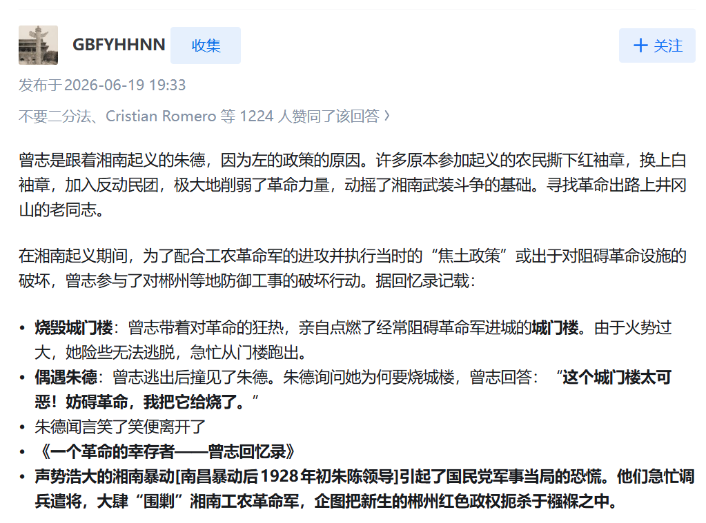</figure>
<b>一、“焦土政策”真的得到朱德的认可了吗</b>

首先这位上来就直接把曾志烧城门楼子当成是湘南特委的“焦土政策”实施的结果，然而，只要翻了曾志的那本回忆录就能发现时间线不对。曾志火烧城门在前，湘南特委的“焦土政策”在后

曾志回忆录P49，只提了自己一阵热血“冲动”，完全没提与湘南特委有关
<figure data-size="normal">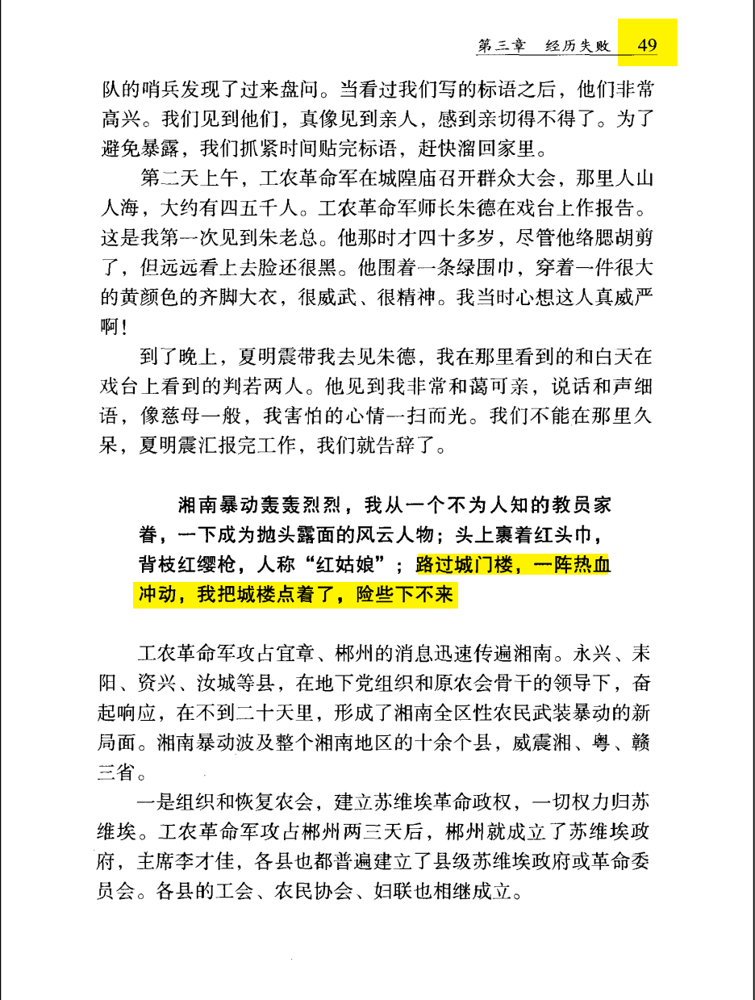</figure>
曾志回忆录P51，稍微展开讲了一下他烧城门楼子的过程，但也压根没提湘南特委的“焦土政策”
<figure data-size="normal">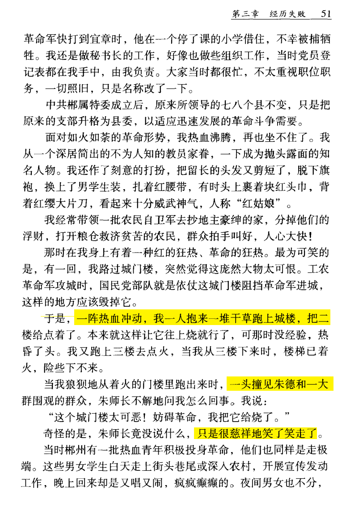</figure>
回忆录虽然没有给出具体时间，但是曾志提到了关键信息，这位女超人烧城门楼子的时候朱德在围观，也就是说朱德这个时候还在郴州。

而朱德1928年2月4日晚抵达郴州，2月10便离开了郴州。所以说曾志烧城门楼只会发生在2月4日到2月10日这段时间
<figure data-size="normal">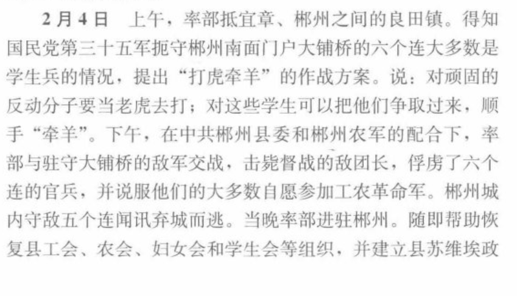</figure><figure data-size="normal">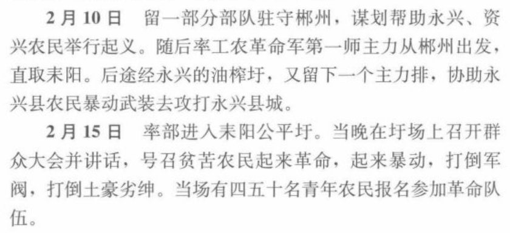</figure>
而到了3月中旬，郴州开始才开始召集群众，开动员大会，向群众宣布要烧房子。要是换成果党还会和百姓商量？管你三七二十一全直接你烧了。
<figure data-size="normal">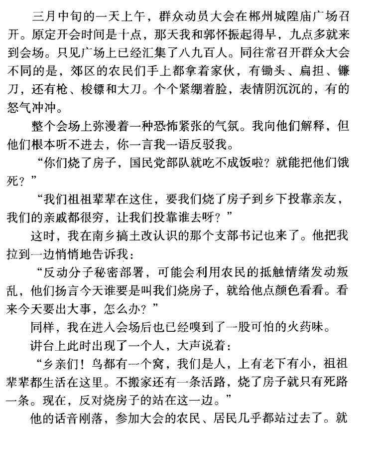</figure>
2月上旬曾志烧的城门楼子，3月中旬郴州才准备开烧。湘南特委一定是掌握了超时空大法，发送心灵电波，让曾志提前一个月烧了郴州（狗头）。哦原来湘南特委没有时间机器啊，那这就得问问内位俊福脑子里装的是什么了。
<figure data-size="normal">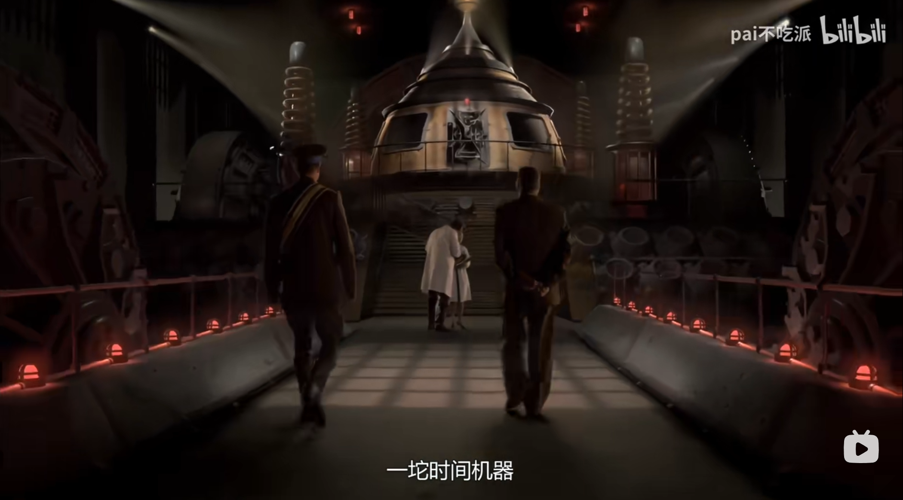</figure>
所以说，曾志烧城门楼和湘南特委的“焦土政策”没有半毛钱关系，人家曾志说的已经很明白了，完全是自己“一阵热血冲动”造成的。朱德笑了笑”也更不可能是对“焦土政策”的赞赏。给朱老总泼脏水差不多得了。

<b>二、党员干部对湘南特委“焦土政策”的看法</b>

那有人可能要说了，曾志烧城门楼，朱德“笑了笑”，烧郴州城那不得捧腹大笑？

其实湘南特委这个“焦土政策”纯属少数挠灿发癫搞出来的，一宣布就遭到了广大党员干部群众的强烈的反感。朱德与陈毅率领的部队一直保持高度冷静，充耳不闻湘南特委的乱诏，没有执行。

朱德的看法
<blockquote data-pid="z8Vz9lm6">朱德闻讯后，即派陈毅率一个营赶到郴州，平息此乱，并纠正了一此“左”的错误做法。之后，他每到一地，便告诫干部群众说：“房屋楼阁都是劳动人民造的，革命成功了都要归还人民，烧了多可惜!”“反革命分子要杀，但要分清首恶和胁从，一概皆杀，树敌过多，于革命不利。”“不分青红皂白地烧杀，势必把革命搞乱。”</blockquote><figure data-size="normal">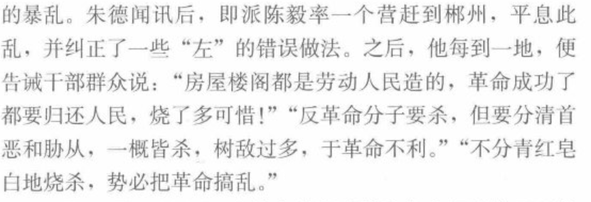</figure>
还是曾志回忆录的内容
<blockquote data-pid="UauZbEH3">于是郴属特委作出决定，坚决执行“坚壁清野”的“焦土政策”。为此，先在党内进行动员部署，然后再向群众宣传贯彻。 这一政策的执行，无疑会遇到重重阻力甚至反对。群众不相信我们的宣传，有些积极分子是半信半疑，就是各级党员干部和苏维埃政府机关工作人员也是不赞成的。而隐蔽下来以崔廷彦、</blockquote><figure data-size="normal">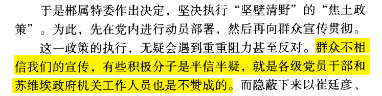</figure>
郴州县委书记夏明震的看法
<blockquote data-pid="ULMH_tLg">席克思的这番话，有如惊雷在与会人员头顶炸响，使许多人惊异得回不过神来。县委书记夏明震首先讲话了，他说了一句：“真是天大的笑话。”接着以激愤的心情，驳斥“焦土战略”，说道：“天底下哪有这么便宜的事？烧掉房子，填掉水井就能击败敌人？就算敌人在五里、十里内没地方住，总不可以把十里外所有的房屋都烧光吧？敌人没地方住，我们自己住在哪里？这么多群众住在哪里？”他自认这些道理站得住脚；还要说下去，却被席克思严厉地打断了：“明震同志，你的这种看法完全是右倾的表现！不能只看到烧掉那些房子，打烂一些坛坛罐罐，更不能迎合市民百姓的利益，破坏特委的战略意图！”席克思讲到这里，以党的纪律压下来：“县委服从特委的领导，决不允许违背党的组织原则！” 夏明震仍然不顾重压，指出特委的决定不符合革命利益，据理反驳，还有一部分干部也对夏予以支持，反对烧房子。席克思不胜恼怒，以“钦差大臣”的权威断然宣布：“鉴于县委主要领导的右倾畏难情绪，必将影响‘焦土战略’的执行。目前一个月内，特委直接接管县委！”与会的干部们大为吃惊，但谁也不可逆转大局。会议在席克思的主持下，作出了先烧郴州城，民众一律在七天内迁走的决定。散了会，席克思又要郴县团县委书记邝朱权组织人书写告示，明晨张贴出去。</blockquote><figure data-size="normal">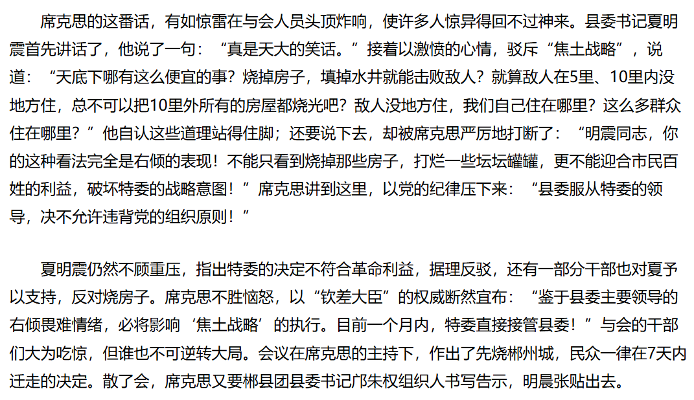</figure>
至于为什么湘南特委能搞出这么颠的政策，我们后文再谈。

<b>三、武装叛乱的起因经过</b>

郴州城中有两户“富比千乘，名盖一州”的大土豪，哥哥叫崔廷彦，老弟叫崔廷弼。他兄弟俩不单在郴州有千亩良田、当铺钱庄，就是在长沙也有商号货栈。

革命的红色狂飚卷到郴州后，崔廷彦自知不可逆潮流而动，便献出一部分田产，以开明绅士的身份混进郴县苏维埃政府，当上了委员。但在暗地里，崔氏兄弟与一帮豪绅勾连在一起，无时不在窥测方向，伺机而动。他俩得知了民众对烧屋搬迁大为不满群起反对的情形，连夜串起一帮富商劣绅，在苏仙铺古寺进行密谋。

群众大会按时在城隍庙召开。这天吃过早饭，特委秘书曾志与城区苏府主席贺益生，一道来到会场。宽阔的场子上已聚会了几百人，而且不断地有人来。曾志发现人群中夹有一些不三不四的人和豪绅富商。不久，崔氏兄弟带了许多人进来，向人们煽动着。曾志的心里划过一丝疑虑，打算去把县苏府警卫队调来，同时告诉夏明震他们做好思想上的准备。她刚走到门口，已有4个大汉把守大门，只准人进不准人出，曾志便说要上厕所，大汉们见是青年女子，就放她出去了。

就在曾志出门后，夏明震和县府秘书长陈代常、县妇委会主任何善玉、县总工会委员长黄光书等10余人，进了城隍庙。夏明震来了，见崔廷彦和一帮汉子挤上来。紧接着，瑞丰丝线铺的伙夫、牛高马大的暴徒钟天球一个箭步蹿到夏明震跟前，挥刀将夏砍死。其余的一群暴徒也大打出手，向苏维埃干部们砍杀。陈代常、何善玉等10余人尽皆遇害。

场上的许多农民和党员看见豪绅暴徒动手杀人，被激怒了，纷纷与这些暴徒搏斗。他们虽然人多，但都是赤手空拳，怎能敌得过携有各种凶器的暴徒，城隍庙内外刀光剑影，血肉横飞，惨叫声不绝于耳，地上血流汩汩。崔氏兄弟指挥暴徒们杀了百余人后，又纠集大群的人向县总工会、县少年先锋队、共青团训练班等机关团体杀去，当场被杀的党员干部和群众达200多人。
<figure data-size="normal">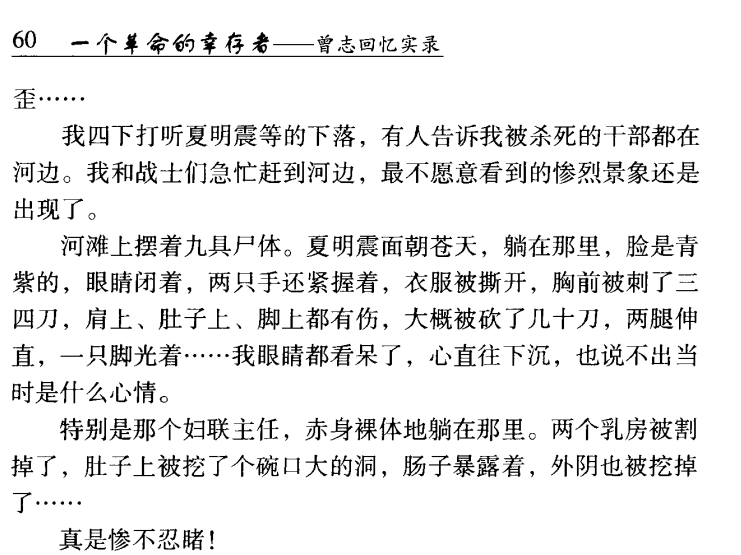</figure>
最牛魔的还得是下面的，把少先队的小孩引诱出来然后开图
<figure data-size="normal">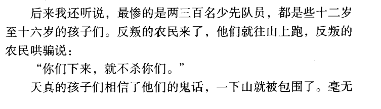</figure><figure data-size="normal">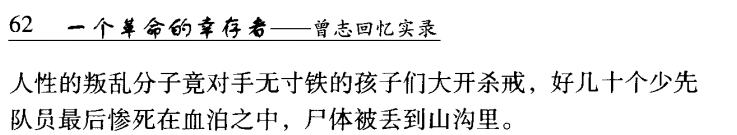</figure>
最令人忍俊不禁的地方来了，这场叛乱本来就是地主豪绅以“反抗烧房”而煽动起来的，<b>结果闹半天最后，叛乱分子们自己把房子烧了。</b>最忠于湘南特委“焦土政策”指示的不是党员干部，反倒是这些叛乱分子。你不得不怀疑这事是不是KMT混进里面开始熟练操作了

依旧曾志回忆录的内容
<figure data-size="normal">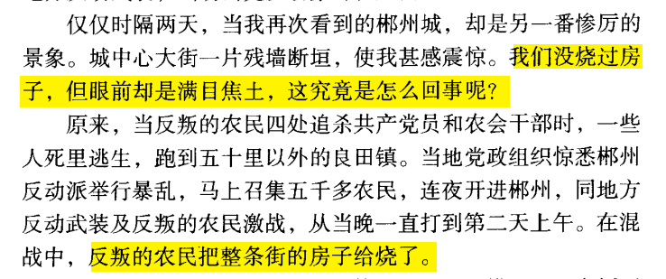</figure>
反动的豪绅地主向革命的疯狂反扑，暴露了他们的狰狞面目，使贫苦的工农群众迅速觉悟过来。暴乱发生的当天下午起，郴县的一些党员和群众冒险出城，分头赴往永兴、宜章及郴县良田、永丰乡报讯求援。

最先得到暴乱消息的是郴县良田区委，区委书记李克如当天下午3点多钟，就带领紧急动员来的1000多赤卫队员与农会会员，连夜赶到郴州城外，13日一早便向暴徒武装据守的东塔岭进攻。当天上午9时，郴县第三区区委又开来千余人增援。

到14日下午，由曾志、刘之至报讯赶来的工农革命军两个连，在陈毅率领下赶到。接着，郴县农7师2000余人，由邓允庭指挥从桂阳紧急赶回。各路援军从三面围攻城中之敌，至是日傍晚结束了战斗。这场反革命暴乱的策划者之一崔廷弼被当场击毙，崔廷彦与廖镜廷带着几十人从下水道潜出城内，狼狈逃去。
<figure data-size="normal">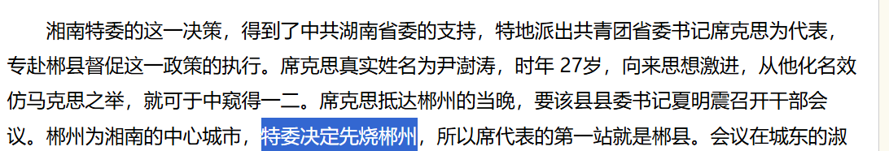</figure>
本来湘南特委是想以郴州为初步试点，结果遭到了党员干部群众的全面抵制，无法形成共识，严重分化了革命力量，闹得一地鸡毛。这次郴州的大失败也标志着湘南特委的“焦土战略”的彻底破产。之后不久，在朱德和陈毅的主持下，全面否定了“焦土战略”。
<figure data-size="normal">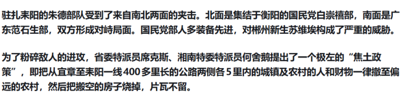<figcaption>这位的回答内容</figcaption></figure>
除了郴州城以一种吊诡的方式被叛乱分子们烧了，“焦土战略”再也无法形成共识，无法继续推行，而这位的回答有意或无意忽略了这一点。仿佛拟定的“焦土战略”被全面贯彻实施了一般，烧得千里无鸡鸣，仿佛朱德及广大tg党员高度认可这样的操作似的。

<b>四、为什么湘南特委能搞出如此挠灿的政策？</b>

1927年11月，瞿秋白主持的临时中央政治局扩大会议通过了一个叫《政治纪律决议案》的东西，处分了一大批领导武装起义的干部。处分的罪名是&#34;右倾逃跑&#34;“枪杆子主义”。什么叫意思？就是没有坚决攻打大城市，没有把革命高潮推到极致。毛泽东因为秋收起义后放弃攻打长沙、带着队伍上了井冈山，被撤销了中央政治局候补委员和湖南省委委员的职务。

毛泽东为什么要上井冈山？因为打长沙打不了，硬打就是送死。他的判断很明确：当务之急不是拿大城市，而是到农村去，打土围子、分田地、建政权，把群众真正组织起来，站稳脚跟以后再图发展。这条&#34;上山&#34;路线，就是后来被实践反复证明了的正确方向：扎根群众、从实际出发、不搞花架子、不搞盲动冒险。

但问题是，当时中央不认这一套。中央的路线是什么呢？是瞿秋白在共产国际代表罗明纳兹指导下搞的那套&#34;不间断革命论&#34;：全国革命高潮已经来了，必须不断进攻，必须打大城市，谁退缩谁就是&#34;右倾机会主义&#34;。毛泽东的&#34;上山&#34;路线和中央的&#34;进攻&#34;路线针锋相对，两边根本走不到一块去。两套路线一碰撞，结果就是毛泽东被撤职，正确的路线在决策层被组织手段否决了。

这意味着什么？意味着从1927年11月起，中央层面的路线方向盘就已经握在了一群迷信盲目进攻的人手里。毛泽东被撤不是他一个人的事，而是正确路线失去了决策权。从此以后，从中央传下来的调子本身就是错的。湘南特委就是在这个背景下接到了一个错误的方向。

更要命的是1928年3月，湘南特委军事特派员周鲁来到井冈山，又往火上浇了一桶油。他向毛泽东宣布，中央已经把你&#34;开除党籍&#34;了，你以后只能当个非党员师长。后来才查清楚，中央开除的是政治局候补委员，不是党籍。

但当时那个通信靠腿、文件靠传的环境下，这个乌龙已经造成了不可逆的后果。毛泽东被误传为&#34;开除党籍&#34;之后，完全丧失了在党内说话的权利，不可能再对任何政策走向施加影响。与此同时，周鲁把中央那套&#34;左&#34;倾盲动路线完整地带到了湘南。湘南特委书记陈佑魁、特派员席克思等人，拿着一个从根子上就错了的方向，开始了一场完全不看实际、不顾群众的狂热实验。

焦土政策就是这么来的。这群人脑子里只剩下一根筋。至于老百姓有没有地方住、群众同不同意、烧了房子到底能不能挡住敌人，这些最基本的问题，在他们那套逻辑里根本排不上号。毛泽东在井冈山上那一套&#34;依靠群众&#34;&#34;稳步发展&#34;的做法，在他们看来就是保守、就是右倾、就是过时了。而毛泽东已经被撤了，再也没有人能在决策层对他们说不。

结果呢？结果是焦土政策一宣布就炸了。朱德、陈毅不买账，夏明震当场硬顶，群众大会上直接引爆了武装叛乱。崔廷彦、崔廷弼为首的地主豪绅以&#34;反烧房&#34;为名煽动暴乱，杀了夏明震等九名干部，血洗了各机关团体，数百多名党员干部和群众遇害，连少先队的小孩都不放过。最讽刺的是，这群打着&#34;反烧房&#34;旗号起事的人，最后自己把郴州城给烧了。焦土政策唯一一次&#34;被落实&#34;，落实它的恰恰不是党员干部，而是暴乱分子。

这一连串荒唐事的根子在哪里？不在湘南特委那几个人神经不正常，虽然他们确实不正常，而在于作出正确判断的人已经被撤了，正确的路线已经被否了。毛泽东被撤职之前，他那一套从实际出发、依靠群众的打法，本身就是对&#34;左&#34;倾盲动最有力的钳制。他一走，这套钳制就没有了，错误路线畅通无阻。

所以这一节要说的其实只有一句话：1928年春天湘南发生的一切，不是什么&#34;少数人发癫&#34;的偶然事件，虽然他们确实很癫，而是&#34;离开了毛泽东的正确领导&#34;之后必然要付出的代价。政策脱离了群众、脱离了实际，正确路线在决策层无人代言。

这个教训不是一次性的，同样的剧本在党的历史上还会反复上演。正确路线被否定、毛泽东被排挤出决策岗位、革命力量遭受惨重损失，每一次血的代价都在证明同一件事：离开了毛泽东的正确领导，决策就脱离实际、脱离群众，革命就要吃亏，就要死人。直到1935年遵义会议，这条正确路线才重新回到党的领导核心，中国革命才真正走上了从胜利走向胜利的道路。

<b>五、洗白KMT？我劝你善良</b>

比起湘南特委一开始就遭到了党员干部的厌恶与强烈抵制，无法形成对此的认同与共识。KMT这边可就容易多了，烧杀如同呼吸一样自然，根本不用有任何道德顾虑。

九一八前两个月，蒋介石密令部队对苏区村落、人民斩尽杀绝的电报：“<b>大小各村庄务全烧燬，勿遗</b>。然后移动可也。<b>凡我军所到之处，为匪化太深，不易防守者，皆可焚燬。”</b>
<figure data-size="normal">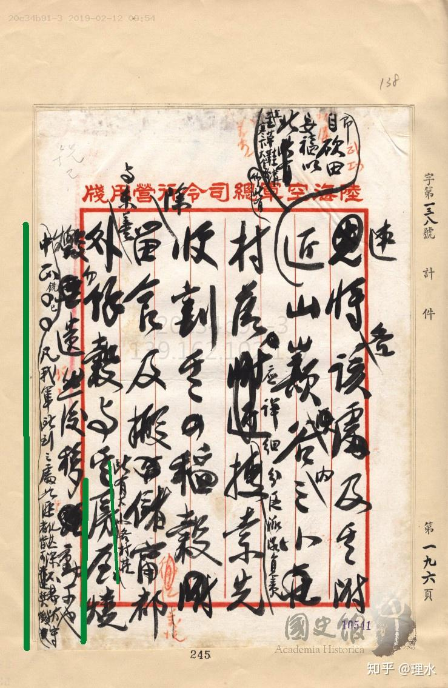</figure>
蒋介石：“匪之“剿”字，其意义亦如以刀入匪巢杀戮画净之意。其不足尽剿匪之义，而乃养匪贻患而已。务令各部烧杀，而称为要旨。”

白话文：“剿匪” 的 “剿” 字，本意就如同用刀刺入匪巢，将里面的人全部斩杀、彻底肃清。可眼下的剿匪做法，根本达不到剿匪的真正目的，反而只会养匪贻患罢了。务必严令各部，把烧杀作为核心要求，当作剿匪的要旨来执行。
<figure data-size="normal">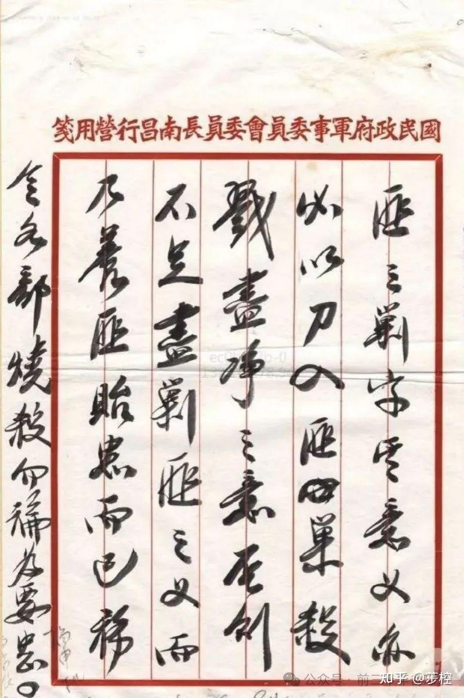</figure>
老蒋：“<b>对于匪化甚深之乡村与人民，无法感化者，准予烧杀不论，且应彻底督查其实施，以免再为匪所用也。</b>“
<figure data-size="normal">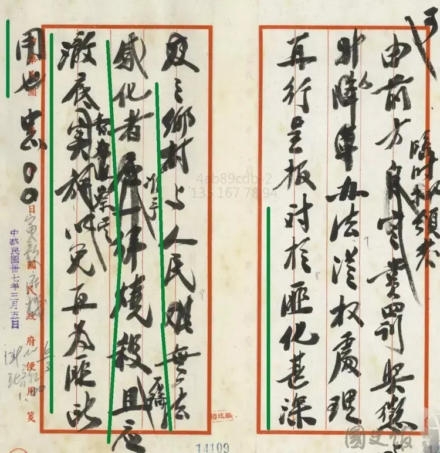</figure>
潢川刘总司令、沙市徐总司令，密。<b>匪化已深之区域非准各部队官兵尽量之烧杀，不能铲除匪根。即推“剿匪”之“剿”字，其意义亦必以刀入匪巢、杀戮尽净之意。否则不足尽剿匪之义，而乃养匪遗患而已。务令各部烧杀勿论为要。</b>中正。
<figure data-size="normal">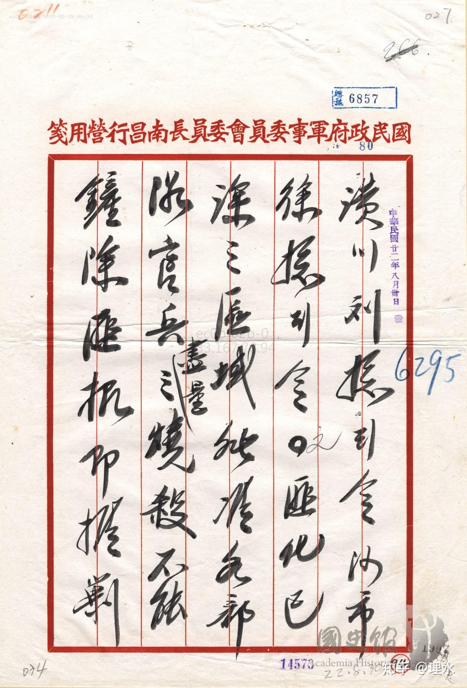</figure><figure data-size="normal">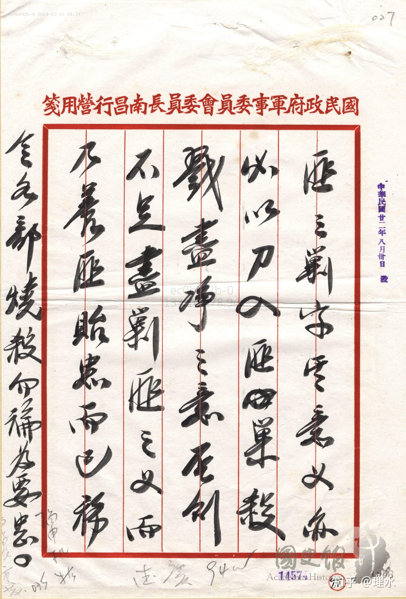</figure>
那么下面的人怎么执行的呢？刘镇华从蒋介石的手令中，提取出了“<b>有民即有匪，民尽匪尽</b>”的口号，对边区百姓实施灭绝，刘为报功割下的人耳就有“七担”之多。陈忠贞主编的《鄂豫皖革命根据地史》记载：
<blockquote data-pid="vqrcFSw8">国民党在“清剿”中，沿用“有民即有匪，民尽匪尽”、“宁愿错杀一千，不能漏掉一个”等血腥口号，纵兵烧、杀、抢、掠，所剿之处变成一片废墟，新坟叠叠。赤城县苏维埃政府所在地熊家河被洗劫成十室九空，渺无人烟。经扶县箭厂河附近的肖湾原有500多口人，被“清剿”后仅剩五六十人。油榨湾是几百人的大村子，被“清剿”后只剩下一个瞎子、一个腿上生疮的人和一家三个失去父母的孩子。周河附近的汤村原有160多人，被“清剿”后只剩10余人。当时，以卡房为中心，南起天台山，北到凌云寺，西至莲花石，东到郭家河，方圆90里地区几乎成了“无人区”。第十一路军的一个旅在立煌县的柳树庄，挖一条长达几里的大沟，一夜间活埋苏维埃干部、群众3500余人。<b>商城反动民团头子顾敬之，每到一处就大喊大叫要开人肉铺子</b>，在汤家汇周围百里内，杀害红军伤病员、军属和群众1万多人。<b>刘镇华第六十四师在皖西大肆屠杀共产党员和革命群众，为向上级报功领赏，割下死难者耳朵达七担之多，残暴到了极点。</b>敌人在监狱暴满的情况下，分别设立所谓“难民收容所”，仅在商城一县就设有4个，每所关押1000人左右。这些实为集中营的“难民所”<b>每天给“难民”喝掺有石灰的稀饭，吃后肚子发烧膨胀，因此每天都有人死亡，死了就扔到收容所旁挖的大坑里。</b>“难民“稍有反抗，就被铡死。此外，<b>又有许多年轻妇女被敌人押往他乡卖掉。</b></blockquote>
根据国民党骨干、新闻局长邓文仪主编的《剿匪战史》记载，经过这一番屠杀，在国军的“清剿”区内，<b>“无不焚之居，无不伐之树，无不杀之鸡犬，无遗留之壮丁，闾阎不见炊烟”。</b>

这些只不过是冰山一角<b>，</b>更知名的长沙大火和让美军拿武汉练手燃烧弹更不用我多说了。

以上
<h3>推荐阅读</h3><a href="https://www.zhihu.com/question/35713301/answer/2033868991324800351" data-draft-node="block" data-draft-type="link-card" data-draft-title="外国人对中国的哪些刻板印象会令国人很惊讶？" data-draft-cover="https://pica.zhimg.com/v2-2dca7ffe9edcc797f7d73b84b83e9699.jpg?source=7e7ef6e2&amp;needBackground=1" class="internal">外国人对中国的哪些刻板印象会令国人很惊讶？</a><a href="https://www.zhihu.com/question/1969325996290316171/answer/2042393017017972392" data-draft-node="block" data-draft-type="link-card" data-draft-title="全世界都是市场经济，但全球化唯有中国受益最大，工业产值最大，大国崛起，为什么？经济学家怎么解释？" data-draft-cover="" class="internal">全世界都是市场经济，但全球化唯有中国受益最大，工业产值最大，大国崛起，为什么？经济学家怎么解释？</a><a href="https://www.zhihu.com/question/2026930794917021070/answer/2034742925104563566" data-draft-node="block" data-draft-type="link-card" data-draft-title="有人质疑孙中山称呼为国父欠妥？不知道各位是怎样的心声？" data-draft-cover="https://picx.zhimg.com/v2-e54d30489a4c1ea223ed6b6ff0e76780.jpg?source=7e7ef6e2&amp;needBackground=1" class="internal">有人质疑孙中山称呼为国父欠妥？不知道各位是怎样的心声？</a><a href="https://www.zhihu.com/question/2024108184994871202/answer/2024462896663380112" data-draft-node="block" data-draft-type="link-card" data-draft-title="为什么在沙漠实行计划经济，连沙子都会短缺？" data-draft-cover="https://picx.zhimg.com/v2-293c824b07e1e6cc09a4d2922510311a.jpg?source=7e7ef6e2&amp;needBackground=1" class="internal">为什么在沙漠实行计划经济，连沙子都会短缺？</a><a href="https://www.zhihu.com/question/1969440300150793360/answer/1978783024729575768" data-draft-node="block" data-draft-type="link-card" data-draft-title="中华民国和中华人民共和国谁的疆域大?" data-draft-cover="https://picx.zhimg.com/v2-4c5d7bcefb814d7b5edffe7db5d1784f.jpg?source=7e7ef6e2&amp;needBackground=1" class="internal">中华民国和中华人民共和国谁的疆域大?</a><a href="https://www.zhihu.com/question/667096021/answer/2039331399681954282" data-draft-node="block" data-draft-type="link-card" data-draft-title="群众到底是盲目的还是智慧的？" data-draft-cover="" class="internal">群众到底是盲目的还是智慧的？</a>

---
导出时间: 2026-08-23 19:06