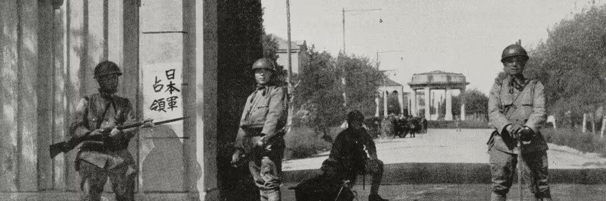
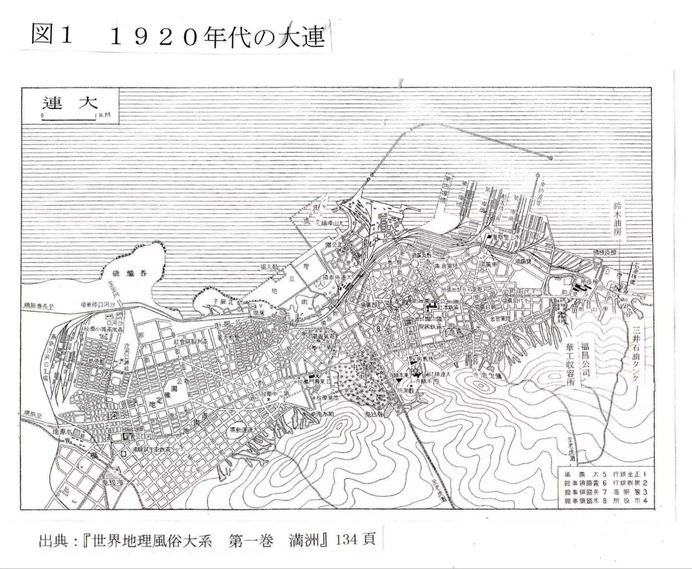
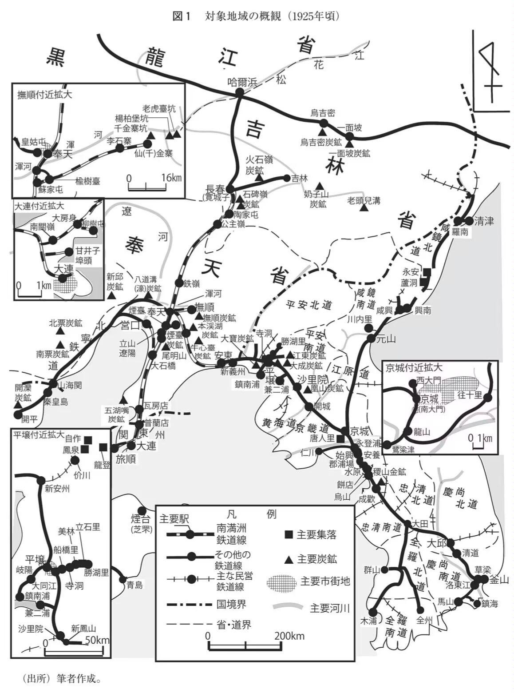
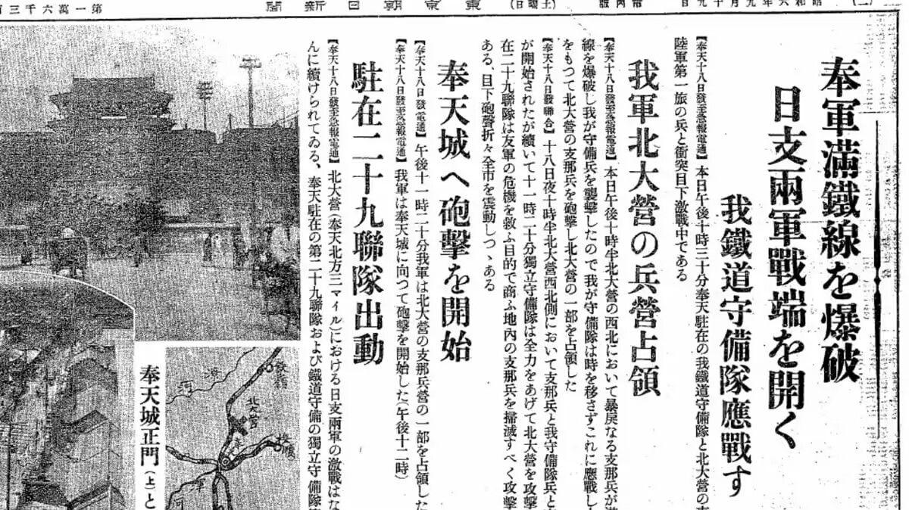
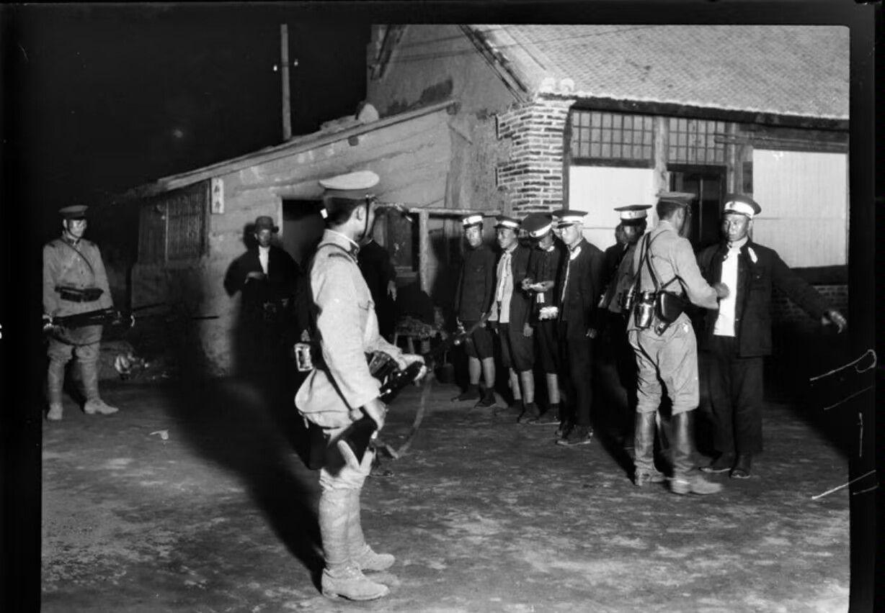
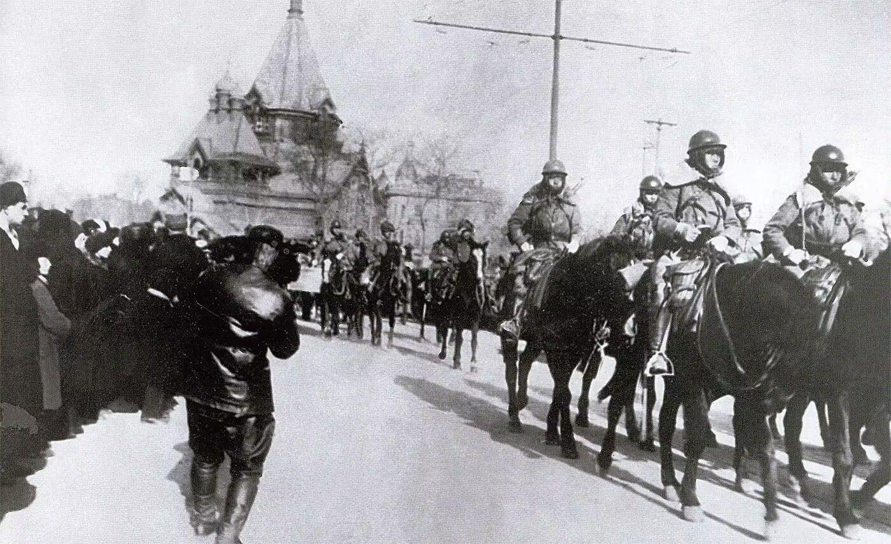
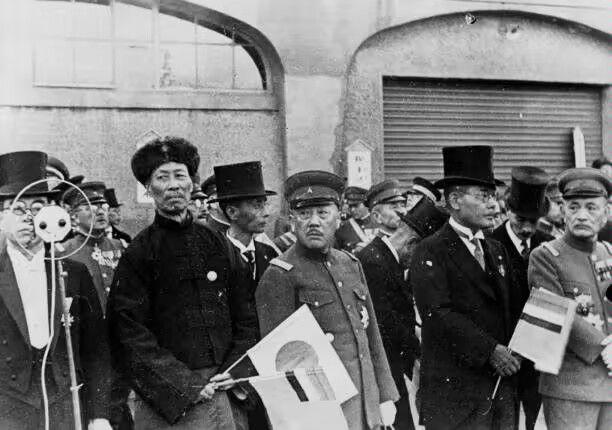

# 做一个在历史上留下痕迹的人有多难?

| 项目 | 内容 |
|---|---|
| 类型 | answer |
| 作者 | Tokai Teio |
| 收藏时间 | 2026-04-11 05:13 |
| 发布时间 | - |
| 收藏夹 | 抗联 |
| 原链接 | https://www.zhihu.com/question/299906025/answer/2026166020486742148 |

## 摘要

阅读日共头号亲中派安斋库治的访谈录时，发现了一段有趣的事实——东北曾经存在名为「日共满洲地方事务局」与「满洲日本人工会协议会」的纯·左翼日本人组织，其存在时间为1931年秋天。 由于两个组织的规模较小，存续时间很短，它们的存在可谓完全不为人知。包括战前日共领导人在内的绝大多数人都不知道，居然还有日本共产主义者在东三省领导过工人运动，甚至在九一八事变时呼吁中日韩三国工人联合起来阻止侵略、进行革命。 [图片] 日共…

## 正文

阅读日共头号亲中派安斋库治的访谈录时，发现了一段有趣的事实——东北曾经存在名为「日共满洲地方事务局」与「满洲日本人工会协议会」的纯·左翼日本人组织，其存在时间为1931年秋天。

由于两个组织的规模较小，存续时间很短，它们的存在可谓完全不为人知。包括战前日共领导人在内的绝大多数人都不知道，居然还有日本共产主义者在东三省领导过工人运动，甚至在九一八事变时呼吁中日韩三国工人联合起来阻止侵略、进行革命。
<figure data-size="normal"><figcaption>九一八事变</figcaption></figure>
日共满洲地方事务局的领导人松崎简、广濑进、冈村满寿、松田丰在任何网络平台都搜不到，绝大多数针对日共的学术研究也完全不会提及此事，这些人在被人叙述的[历史]中并没有留下自己的痕迹。

笔者首次发现他们，也是通过安斋库治在1986年在北京的访谈记录。1905年生于福岛贫民之家的安斋8岁就跟着父亲去了朝鲜讨生活，读完小学后又前往中国东北投奔兄长，成为了满铁的雇员。

安斋库治本人思想开始左转，是在1927年被满铁公派到上海同文书院学习，接触到那里的国民革命浪潮与大量左翼日本人以后。不过，在东北度过了七年时光的安斋却提起了一段有趣的往事：据其描述，其实安斋库治第一次接触共主义是在1926年，当时在营口搬运货物的工人向满铁职员派发传单，与此同时旅顺工业大学的日本人学生则成立名为「核心」的左翼组织，鼓舞、激励工人斗争——当然，这个组织很快遭到了政府的逮捕。

之后，安斋库治又继续对采访者竹中宪一说道：
<blockquote data-pid="1Inits1O">安斋：我在满铁的时候，那里出现了组建工会的动向。我们这些底层部门工作的，就会收到那种（一起组建工会的）邀请，与那些人有所关系。1930年左右，有个和我在满铁夜校同级的人叫中岛保住的，因为在满铁从事左翼运动而被捕了。还有个叫纳富的，他大概比我低一级吧。他们因为对现状不满而发起行动，结果也被逮捕了。  然后，最典型的是1931年。就是我被迫离开上海的那年，有个叫松崎简的人，我想他是早稻田大学毕业的。他父亲是位汉学家。叫松崎鹤雄，是位汉学造诣非常深的人。松崎简是他的孩子，在三一五事件（注：1928年日本政府针对日共成员的大逮捕行动）中遭到牵连，之后恐怕是和岩田义道（注：日共领导人）联系，回到了大连，建立了日共满洲地方委员会。  短时间内，他们就组织了六十人。在抚顺、奉天、大连。在东北这里建立了组织。但是大连有个邮局，说是要爆破那个邮局什么的，这也许是日本政府的谣言，但就因为这个问题，在1931年被一网打尽，全都被捕了。  同时，全协（注：日本劳动组合全国协议会，日共领导的非法工会）大概也在那时组织起来了。应该也有不少年轻女孩加入了。这是满铁内部最大的组织，我想应该是直接参加革命运动的。  竹中：有和CPC联络吗？  安斋：没有。那时候，在中央层面是有关系的。但地方上似乎没有。  竹中：那么，终究只是日本工人的组织了。  安斋：是的。是以日共满洲地方委员会，以及日本劳动组合全国协议会的满洲支部这样的形式组织起来的。</blockquote>
安斋库治所提及的「日共满洲地方委员会」与「日本劳动组合全国协议会满洲支部」吸引了笔者的好奇心，然而笔者同时也意识到绝大多数与日共相关的历史研究、历史资料都从未记录此事。换言之，这些人不仅被大多数日本人、中国人遗忘了，甚至在专门研究日共的学者之中也是默默无闻的存在。不仅如此，当时领导日共的高级干部（田中清玄、风间丈吉等人）与中层干部（宫内勇等人）的回忆中从未提及它们的存在。可以说，战前日共的大多数领导干部很可能也并不知道这些人的存在。

笔者花了很长时间，才发现确有学者做过这方面的研究，他就是专门研究731部队的庆应义塾大学教授松村高夫。根据松村高夫在2009年所做的研究，「日共满洲地方委员会」的历史起点需要追溯回到安斋讲述自己人生的六十年前——1926年。
<figure data-size="normal"><figcaption>1920年代的大连地图</figcaption></figure>
就在那一年，满铁内部出现了要求改善佣员（下级日本人雇员）待遇的动向，作为满铁车务员的松田丰等人开始准备建立属于佣员的工会。正如安斋所述，当时在旅顺工业大学组织社会科学研究会的广濑进、大田二郎、出口重治也为这一动向摇旗呐喊。1928年时，松田、广濑、大田、出口四人在营口组建了「核心协议会」，为改善满铁佣员的生活水平而开展运动。同年12月，启明协议会的相关人员尽数被捕，松田丰等人因涉嫌违反『治安维持法』而遭到日本政府起诉，史称「核心协议会事件」或「核心共○党事件」，运动随之陷入停滞。

但不久以后，满铁总部、抚顺煤矿、大连邮局、南满洲电气株式会社（满电）等地的日本劳动者也开始谋划组建工会，这些地方的运动领袖后来成为了日共满洲地方事务局的核心成员。1931年6月，大连邮局的古川哲次郎等人建立了通信劳动组合准备会（即通信工会），简称「通劳」。1930年11月，满铁文书科的打字员丰田初音、西静子等人组建的社会科学研究会也在1931年5月转型为冈村满寿领导的「一般劳动组合」（简称「一般」）。针对满铁经营的抚顺煤矿，1931年1月崎山信义在大连建立了名为「矿山劳动组合」（矿劳）的矿山工会，岩本政义等人则在抚顺设立了工会支部。1930年9月前后，川村丙午等人也计划在满电设立工会。

在广濑进的倡议下，这些日本人工会在1931年3月成立了「满洲日本人劳动组合协议会」（满协）的准备会。不过，这些工会大多是一些人数极少的微型组织，如「满洲煤矿工会」在抚顺煤矿只有14、15名成员；满铁总部的一般工会大约20人，以打字员为主；满铁的大连沙河口工厂之中，只有2-3名工会成员。因核心协议会事件而一起在大连与旅顺出庭的松田、广濑、出口讨论了组建统一工会的问题，并由冈村满寿来执行其计划，松田丰本人则尝试统筹领导这些分散在东北各地的工会。1931年6月20日，冈村、松田、出口、古川、西静子等人在大连市奥町的中央酒店协商后，正式成立了名为「满洲日本人劳动组合协议会」的日本人总工会。

当时东北大约有40万工人，冈村满寿起草的『运动方针草案』中写道：「作为我们组织对象的日本工人大约一万五千人」，包括了「铁路从业人员4700人、抚顺煤矿2000人、满电劳动者800人、满铁事务局劳动者2700人、沙河口工厂10300人、鞍山炼钢厂700人、通信工人2000人、『满洲日报』等地的印刷工人85人」（原文如此）。
<figure data-size="normal"><figcaption>（出所）『1920年代南満州鉄道における撫順炭運送』（三木理史）</figcaption></figure>
与此同时，他们并未无视东北的日本工人在各方面的待遇、工资远优于中国工人的问题，「满铁」的『运动方针草案』就此强调：「我们在推进斗争时，不可忘记大部分日本工人（主要是满铁从业人员）处于相对优越的条件之下。这种情况，第一，为修养团、社员会等反动御用团体的活动提供了绝好的基础。……第二，导致我们阵营内部产生了以过高评价文化运动来替代工人运动的倾向。……（他们主张）日本工人待遇优厚，所以没有发展工人运动的可能。文化运动是我们唯一的运动……」草案还特别制定了针对「社员会等反动法西斯组织」的对策。「满协」的12项行动纲领如下：
<ol><li data-pid="OSUvVhs3">为确立八小时工作制而斗争；</li><li data-pid="j-ur9vCj">为将奖金津贴纳入基本工资、保障最低生活水平、提高工资而斗争；</li><li data-pid="z6i4tqzd">为实施国家及资本家负担的（包括突发灾害、疾病、残疾等在内的）一切社会保障制度，特别是迅速实施失业保险制度而斗争；</li><li data-pid="-qWBD8eR">为彻底保护女工、童工而斗争；</li><li data-pid="Hdd3Vu5z">为反对临时雇佣制度而斗争；</li><li data-pid="3yYlpl6a">为反对资本主义的经营合理化、强化劳动强度、解雇而斗争；</li><li data-pid="Sfd-DSDg">为反对基于性别、年龄、国籍的差别待遇，实现同工同酬而斗争；</li><li data-pid="VZsWt_Gb">为反对一切温情主义、阶级调和主义而斗争；</li><li data-pid="bQaPoRSh">为反对使劳动群众承担代价的紧缩政策的欺骗性宣传而斗争；</li><li data-pid="hlyeeO71">为争取工人运动的自由，言论、集会、结社的自由而斗争；</li><li data-pid="QNtJxGQm">为反对战争、反对一切为侵略满蒙进行的攻击及法西斯主义而斗争；</li><li data-pid="Ndz-kCbS">为中日工人联合、保卫苏联而斗争。</li></ol>
从第7、8、11、12条中不难看出，「满协」是日本共产主义者领导的工会，反对日本工人与中国工人之间的差别待遇，也反对日本法西斯主义的侵略。

冈村、广濑、出口三人认为「仅凭我们几个人孤立地建党，最终也会落得和之前的核心协议会事件同样的结果。没有党的上层领导，就无法充分开展活动，所以在与党取得联系之前，应该等待。」改变这一点的是松崎简，他在三一五事件中被捕，不久在保释后回到大连。1931年5～6月，松崎以参加三一五事件第一次公审为由回到日本，期间秘密联系日共中枢，请求其批准满协的运动方针书。当时，代表日共中枢的岩田义道对他强调道：
<blockquote data-pid="d8hRD-hB">在工会之外，有建立政治性党组织的必要。具体方针是，满洲的党本应服从CPC的领导，但鉴于目前与其联络困难的状况，可暂时置于日共的领导与统制之下。因可预期这一组织将来会与CPC合并，故将其命名为日共满洲地方事务局。</blockquote>
松崎于1931年9月10日返回大连后，立即与满协的领导者冈村、广濑、松田会面，传达了日共中枢的意向，并办理了广濑三人的入党手续。1931年9月16日，四人在冈村家中成立了日共满洲地方事务局，四人成为领导核心。在与石堂清伦等人的对谈中，冈村满寿讲述了建党的经过：
<blockquote data-pid="NTnmMwzL">据松崎君说，地方事务局相当于日本国内的县委员会。但是，这里是中国，不是日本。所以根据一国一党的原则，我们不应属于日共，而应纳入CPC的指挥之下。但目前无法与CPC取得联系。要取得联系，需要通过驻莫斯科的日共代表与CPC代表进行沟通，在此之前的临时措施是建立日共的组织。虽然是建立日共的组织，但这终究是临时措施，所以用日共○○委员会的名称不妥。因此使用日共「满洲地方事务局」的名称。</blockquote>
建党之后，他们分三次向日共中枢推荐「满协」的工会领导人入党，先后推荐了古川、田口、出口、岩本、小林周三、川村、上别府亲志（沙河口工厂」、丰田、浜田、西、岩間富子（抚顺的打字员）11人入党，随后所有人都正式成为日共党员。

事实上，日共满洲事务局可以说根本来不及组织任何活动，因为就在它建立后的短短两天，日本侵略者就发动了九一八事变。它的第一次公开活动，是在事变后的第三天（1931年9月21日），散发了题为「依靠中·日·朝工人农民士兵的力量，打倒帝国主义强盗战争！」的传单。冈村就此说道：「考虑到九一八事变开始了，党必须立即就此做些事情，比如散发传单。如何去做这件事呢？一旦发布传单或声明，党的名字自然就公开了。此前完全是秘密的，只有同志之间知道。党尚未被人所知。」
<figure data-size="normal"></figure>
这份传单的开头写道：「全满的工人农民士兵诸君，战争终于开始了！日本帝国主义以9月19日奉天『中国士兵破坏满铁线路』为借口，开始了为占领满蒙的战争。看吧！交战数小时内，他们就占领了全满的各大要地，已经屠杀了数千无产者。他们更出动朝鲜混成旅团，准备动员内地各师团，其一部分部队已于21日拂晓秘密在大连登陆向内地出发。日本军队的这次行动，明显超出了他们所谓的『自卫』范围，是在周密计划下实施的，旨在武力占领满蒙。」传单结尾则是向东北工农发出呼吁。
<blockquote data-pid="vRUr_mF5">全满洲的工人、农民、士兵诸君：  谁能拯救在帝国主义日本铁蹄下惨遭蹂躏的满蒙劳苦大众？是中国军阀吗？不！那些家伙也是一丘之貉。那么是谁？不是别人。正是我们工人、农民、士兵自己！在资产阶级灌输之下，至今将彼此视为敌人的中国、日本、朝鲜的工农兵联合起来吧，将互相指向对方的枪口调转过去，对准真正的敌人——本国的资产阶级吧！  运输部门的劳动者，拒绝运输用于屠杀的武器！  在工厂、矿山、农场掀起反对帝国主义战争的斗争！  诸君知道的吧。苏联的工农兵之所以能消灭失业与饥饿，持续而成功地进行社会主义建设，正是因为打倒了资产阶级的战争，完成了对他们的阶级斗争。  打倒帝国主义强盗战争！ 打倒日本帝国主义！ 打倒中国资产阶级的军阀走狗！ 建立工农兵的苏维埃！ 保卫苏联！ 无产阶级专政万岁！ 中、日、朝工人的团结万岁！  1931年9月21日 日共满洲地方事务局</blockquote>
与此同时，「满协」在1931年9月24日的第四次筹备会上指出：「满协方针书中『同工同酬』的口号，是在中日朝无产者的统一战线中应首先实现的口号，通过争取实现此口号，方能实现打破『民族偏见』。……因此，方针书中『中日工人的联合』这一口号，应修正为『中日朝工人的国际联合』。在满洲，不仅有中国人和日本人劳动者，合计朝鲜人无产者中工业劳动者与农业劳动者的数量，也达到相当巨大的规模。必须让这三国的无产者，在国际主义的旗帜下紧密团结，对日本帝国主义布下同一战列……（当前）我们将组织对象限定为仅日本人，应立即消除这一规定，必须将中国人、朝鲜人作为组织对象。因此，必须将『满洲日本人劳动组合协议会』的名称变更为『满洲劳动组合协议会』」。于是，「满协」的正式名称变更为「满洲劳动组合协议会」，意在成为全东北的总工会。

9月27日「满协」召开紧急会议，决定开展反战斗争，散发反战传单与檄文。他们散发的传单名为「依靠中、日、朝的团结力量打倒帝国主义掠夺战争，在职场掀起反对战争的斗争」，内容如下：
<blockquote data-pid="2Kdfmefc">全满洲的中、日、朝工人诸君！！  我们一直不断呐喊的帝国主义掠夺战争终于开始了！以「万宝山事件」、「中村大尉事件」、「满铁线路遭到破坏」为导火索，日本帝国主义以「保卫满蒙既得权益」为借口，动员了五万军队，屠杀了数千不抵抗的中国军队（即中国无产者）。与此同时，他们对朝鲜与日本本土的军队下达了准备动员的指令，从朝鲜急派飞行队，一路向北进军。这一切都是为了将其铁蹄践踏工农的祖国苏联，以及正在取得胜利的中国苏维埃和朝鲜的革命运动。即使看资产阶级的报纸，不也能明白日本帝国主义的侵略已经超越了其自称的「保卫满蒙既得权益」的范围，是何等具有侵略性吗？  全满洲的中、日、朝工人诸君！  诸君知道的吧。资本家地主的帝国主义掠夺战争会带给我们什么？那是更加强烈的剥削、压迫，与持续饥饿的世界。作为工农血税的军队，为了守护资本家的利润，被当作肉盾投入直面死亡威胁的战争中。而且，即使留在职场的工人诸君，不也是在为爱国主义而牺牲的名义下，被迫工作12小时到15、16小时，回家后又被以自卫为名，被在乡军人会、青年训练所等拉出去干到通宵吗？  然而，诸君！在资本家与地主的掠夺战争之后，我们得到了什么？在欧洲大战中，数千万的工人和农民被资本家的炮弹杀害。又或是身患残疾，终生作为『活着的尸体』在街头徘徊。只要我们的头顶上还有资本主义，其他兄弟们不也正承受着代价——无法摆脱的失业和饥饿吗？无论战胜国、战败国，战争都导致工农陷入贫困之中，德国、英国、法国、意大利等国就是最好的例子。 在诸君之中，或许也有人认为战争能解决萧条问题，但欧洲大战后一时出现的日本经济景气，对工农究竟算什么呢？物价的上涨速度远比工人工资的上涨要快得多。大家应该能清晰地回想起来，即使在满铁，那时佣员们的生活是多么艰苦吧。这些归根结底，不正是只属于资本家、地主、小市民的景气吗？反对战争、对其发起斗争，战胜了这资本家、地主的掠夺战争的苏联无产者又如何呢？请看！五年计划暴风骤雨般地得到发展、失业者一扫而空，无产者的幸福得到增进！能打破资本家地主的战争，并将我们从其残暴中拯救出来的是谁？不是别人。正是集结在「满协」的旗帜之下的我们自己。</blockquote>
在这之后，「满协」又指出日本资产阶级趁战争之机压迫东北的日本工人，采取工作时间延长一倍、休假日一律取消、取消用餐与休息时间、工作量翻倍、劳动强度极大增加等方式压榨工人，工人沦为「战争的挡箭牌」。为此，「满协」喊出了要求日本资本家支付双倍工资、争取工人团结与自由、准备罢工以阻止战争、举行反战抗议的口号①。

1931年10月5日，「满洲劳动组合协议会」的机关报『满洲劳动者新闻』发行了自己的创刊号，并在上面列出了「满协」最新的七个口号：「一、绝对反对裁员！二、同工同酬！三、反对作为直接问题的降薪并要求涨薪！四、打倒帝国主义战争！五、保卫苏联！六、中日朝无产阶级联合万岁！七、大胆地将满协的样子展现在群众面前！」
<figure data-size="normal"><figcaption>1921年9月21日深夜，解除吉林铁道巡警武装的侵略军士兵</figcaption></figure>
与此同时，日共满洲地方事务局也10月1日创立了『满洲赤旗』，内容转载自日共机关报『赤旗』的主要文章。这是由离开满铁后经营着誊写印刷所的松田丰，印在日本薄纸上的。直到被逮捕前，他们发行了两三期的『满洲赤旗』。此外，地方事务局还发行了三种小册子，第一辑『地下运动的注意事项』、第二册『反对帝国主义战争及反苏维埃干涉战争的斗争』（1931年10月12日再版）、第三册『党的独立活动』，第四辑『建设社会主义的苏联』还没有得到发行，事务局的历史就结束了。

此外在10月5日，日共满洲地方事务局也散发了「渡政日」的传单，号召工人群众组织抗议与工人自卫团「在这一天进行斗争」，打倒帝国主义战争与日本帝国主义。所谓的「渡政日」是日共的党内革命纪念日，其起源是1928年10月7日，日共的核心领导人渡边政之辅在基隆港面对敌人的重重包围拔枪自尽。在具有重要意义的这一天，满洲事务局强调道：「如今，这满洲正化为可憎的帝国主义战争的战场，统治阶级准备在军队和反动团体的戒严令下，将我们为解放而进行的一切运动和组织顷刻践踏于铁蹄之下。对于这种暴政，我们也必须像日本本土、中国的同志们那样进行斗争。」②

然而，日共满洲地方事务局并未能在「渡政日」当天组织群众运动。在10月25日发行的『满洲劳动者新闻』第二号也在卷首文章『反战斗争与我们的弱点』中指出，「渡政日」的宣传活动「不得不说是失败的」，来自某邮局的「谷口吉也」提出疑问：为什么「渡政日」的相关活动仅仅停留在座谈会、研究会、茶话会之中，未能动员群众呢？总的来说，这一时期的日共满洲地方事务局与「满协」都在不断散发革命传单，但却迟迟未能吸纳群众、扩大组织，可谓陷入了与日本国内的日共革命运动所相同的困境——始终只是少数人孤立的运动。

在运动尚未发展起来之际，全东北的日本共产主义者就在1931年10月28日被一网打尽。满协的『满洲劳动者新闻』第二号记载：「10月28日上午6时，政府在全满洲范围内断然实施了针对日本共产主义者的大逮捕！他们正计划着通过攻击、污蔑所谓的共主义秘密结社，将最醒目的人物抓走，好将我们工人的不满情绪打压下去！对工农的镇压，通常就是采取这种形式的。」但在，10月28日当天，日共地方事务局的党员成功逃过一劫。

此事的大致缘由如下：『满洲赤旗』是由松田丰用誊写版印刷出来以后，夹在一本被挖空的厚书之中，通过邮寄方式散发出去的。10月中旬，广濑进寄往抚顺的刊物被邮局的检查所发现。在邮局工作的古川哲次党得知此事后，立即让松崎、冈村、广濑等事务局领导人转入地下。另外，由于日本治安当局会发电报通知各地在满洲各地一齐开展逮捕行动，古川在逮捕的前一天通过这封电报得知消息，因此采取了相关对策。多亏了古川的努力，党员无一人被捕。在战后的访谈中，冈村满寿说道：「在所谓的全满洲大逮捕行动时，当局会给各地发电报，所以在电报局的古川君立刻就能知道这件事。经他通知，我们这边就泄露了消息『明天早上有遍及满洲各地的逮捕行动！』。所以在大逮捕发生时，他们没能抓住一个党员。虽然不清楚这场大逮捕行动中有多少人遭殃，但既然是整个满洲的话，似乎有数百人被捕。但党员一个也没遭殃。」

然而几天后古川哲次郎被捕，在日本当局的酷刑（包括水刑）之下，他招供了。以广濑进在大连市附近的老虎滩被捕为开端，日共满洲地方事务所的党员接连被捕，最终共有23人遭到逮捕。熟悉战前日共革命史的人想必不会对这一幕感到陌生，因为战前的日共与西国的革命政党不同，其党员在被捕后基本毫无保密意识，故而包括日共干部在内的大多数人都会在被捕不久后很快吐露出自己所知道的一切，只有宫本显治等极少数人才可以做到坚不吐实。一旦被捕者开始招供，特高就会顺藤摸瓜地一网打尽，这正是战前日共运动史的常态。
<figure data-size="normal"><figcaption>1932年2月，进入哈尔滨的关东军部队</figcaption></figure>
冈村满寿后来曾经就公审说道：「当时，党已经掌握了一种战术。关于运动方针或纲领的要点，要尽可能详细地陈述；在预审笔录中，也要尽可能详细地记录下来，以便让狱外的人们知晓——这就是当时的战术……狱外的人，只要阅读预审笔录，就能相当明确地理解党的方针。预审笔录具有如此重要的意义。有其利用价值。……在预审笔录中，除了上述内容，我还详述了党的支部与小组的关系，特别是小组的重要性及其活动中的注意事项。因为那是狱外活动家重建组织时所必需的事项，所以我特别着力说明，但在公审时因无此必要就省略了。」

然而，这不得不说只是一种掩饰而已。正如研究日共历史的学者所言，「战前的日共之所以那么轻易地覆灭，是因为太多的人说得太多了。战前参加过党内活动的人，几乎都已经转向，同时也几乎都有过出卖他人的经历。……当时的日共为了保密，尽量减少每个党员所拥有的信息量，但即便如此，每个人也没能守住自己那部分的秘密，政府就这样顺藤摸瓜地抓捕了一大堆人。」无论是建立得多么巧妙的地下组织，只要其成员一个接一个地说出自己所知道的事情，就不得不暴露出其全貌。举例而言，在1931-1932年的「日共非常时代」，日共不断从左翼知识分子中收取大笔资金以供活动，当时党机关指派身为党员的大学教授杉之原舜一向河上肇收款。杉之原「发誓说死了也不会泄露秘密，请大家放心」，河上肇也相信了作为党员的他，然而「杉之原君在被逮捕之后，在预审法官面前把所有的事情都陈述了一遍，几乎没有遗漏任何细节。」

最终，日共满洲地方事务局的历史只持续了两个月左右。特高的内部资料『思想月报』总结道：
<blockquote data-pid="5y-J6D2f">值此九一八事变爆发之机，他们将运动的主要力量倾注于反战斗争之中，通过上述的各个企业支部及「小组」，对处于其影响下的团体，借助机关报『赤旗』，努力将作为当前行动纲领的反战口号，与其基本纲领——工农民主专政、打倒帝国主义、打倒封建军阀的各大口号相结合，进行宣传煽动活动。然而，其组织建立后仅仅一个个月即遭逮捕，连应作为活动根本方针的政治纲领都未能决定下来来。其党员的数量、质量自不用说，即使是作为其后台的满协的势力，以及作为其基础的支部、「小组」的组织率，亦无可观之处，反战斗争所产生的影响也极为局限。最终，事务局在萌芽状态下即告崩溃。</blockquote>
尽管被捕者多达20多人，但四名领导人难得地统一口径，坚称党员只有4人。1933年春预审结束后众人获得保释，同年秋季进行了第一次公审，检方要求判处松崎十三年有期徒刑，冈村、广濑、松田三人十年或十二年有期徒刑。在一审判决后，由于众人的行为不被视为建立新的非法政党，而被视作加入已经存在的非法政党，因而获得减刑，二审判决松崎简5年徒刑，其他人3年半有期徒刑。冈村满寿回忆说，由于二审的法庭审判长是他们在旅顺工大时代的恩师，所以「他帮了大忙」。虽然一行人又上诉至覆审部，但未获受理，恩师所下的判决成为最终结果，全体报告于1937年夏入狱。

不出意料的是，日共满洲地方事务局的领导人们也紧随佐野学、锅山贞亲、风间丈吉等日共国内最高领导人的步伐，在被捕入狱后选择了「转向」，即变节、叛变。1936年时，广濑进和出口重治二人曾作为伪满洲国军政部的顾问，为他们撰写题为『满洲贡绯之研究』的资料——正如该书作者佐佐木到一所言，这本书就是用来研究如何剿灭抗联的。伪满军政部军事调查部第一科长鹤崎健太透露道：「本书的调查及编辑主要由本调查部的大森、广濑、出口三位负责……」，即广濑、出口全面负责了此项工作，用他们在日共革命活动时积累的经验，为日本殖民者打击抗联出谋划策。至于松崎、广濑、出口、冈村等人此后的经历，笔者无论如何都搜寻不到，故而对于他们的叙述就告一段落吧。
<figure data-size="normal"><figcaption>1935年的伪满洲国</figcaption></figure>
就在日共满洲地方事务局的历史终结后不久，日共也在帝国政府的毁灭性打击下迎来灭亡。一批曾经投身革命，如今被捕、转向的前左翼知识分子为求生计，选择呼朋引伴地来到相对宽松的伪满洲国工作，由此开启了「满铁马克思主义者」的历史。不过，这一段历史已经与日共的革命史毫无关系了。

①这份9月27日传单的相关内容如下：
<blockquote data-pid="IA35bQIt">全满洲的中、日、朝工人诸君： 资本家的掠夺战争给诸君的职场带来了什么样的影响呢？第一，工作时间延长了。在满铁、铁路、电报、电话等直接与战争相关的工作场所，工作由八小时被延长到十二小时，十二小时被延长到十五六小时，而且我们还被迫不间断地连续工作。而且连星期日、节假日等休息日也被取消，因为这场的掠夺战争，职场的一部分人员被征调回日本本土，留下的人被迫干着两三个人的活儿！在某个职场，到夜晚还被以值夜为名，强制工人通宵！第二，劳动强度增大了。我们通过斗争争取到的用餐时间、休息时间都被取消，而且工作量还加重了两三倍。尽管如此，修养团、希望社、宗教团体正在为了资本家而煽动爱主义心，驱赶我们无产者去充当战争的挡箭牌。看吧！他们完全是资本家的走狗，是反动团体的成员。为了我们正当的利益，让我们以职场内的消极怠工、罢工、示威游行来斗争，反对资本家延长劳动时间及增大劳动强度，要求他们支付我们双倍工资，争取工人自治下的团结自由吧！  反对因战争导致的延长劳动时间、劳动强度上升！ 反对强制取消休息日！ 支付双倍工资！ 争取工人自治下的团结自由！ 打倒资本家的走狗反动团体！ 准备罢工，反对帝国主义掠夺战争！ 掀起式微与由行！ 在职场建立工人自卫团！ 中、日、朝劳动者的国际联合万岁！  1931年9月27日 满洲劳动组合协议会</blockquote>
②这份1931年10月5日，由日共满洲地方事务局散发的传单全文为：
<blockquote data-pid="Lt8FP-GP">全满洲的工人诸君！！  1928年10月7日，渡边政之辅同志在基隆码头被资产阶级的走狗们杀害了。渡边政之辅同志的名字，对我们日本劳动者来说，是永远不能忘记的。  他正是站在我们前列，为无产阶级解放事业战斗至死的。作为评议会（注：日共领导的革命工会）创立以来的光辉领导者，以及作为日共内一贯的革命工人代表者，特别是1927年日共再建以来，他的活动实在是伟大的。我们不能让他白白牺牲。……  如今，这满洲正化为可憎的帝国主义战争的战场，统治阶级正准备在军队和反动团体的戒严令下，将我们为解放而进行的一切运动和组织顷刻践踏于铁蹄之下。对于这种暴政，我们也必须像日本内地、中国的同志们那样进行斗争。  全满洲的工人诸君！！ 10月7日，是日共的光辉领导者同志渡政含恨被虐杀的日子，让我们以斗争来纪念这一天，为了我们最后的胜利！！ 用传单、宣传单来激发斗争吧！ 组织集会和由行势威，在这一天进行斗争！！ 组建工人自卫团，与白色恐怖作斗争！ 打倒帝国主义战争！ 打倒日本帝国主义！</blockquote>

参考文献：

『社会運動の昭和史 語られざる深層』（加藤哲郎、伊藤晃、井上学[編著]）

『日本と中国のあいだで 安斎庫治聞き書き』（竹中憲一）

---
导出时间: 2026-08-23 19:06