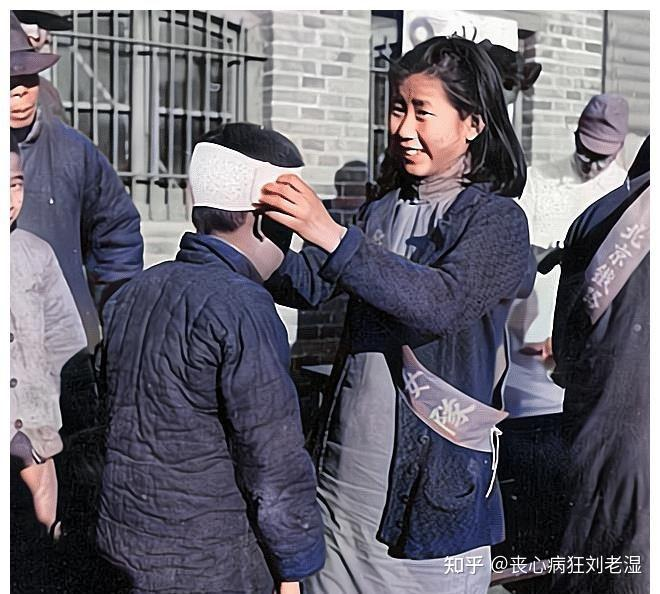
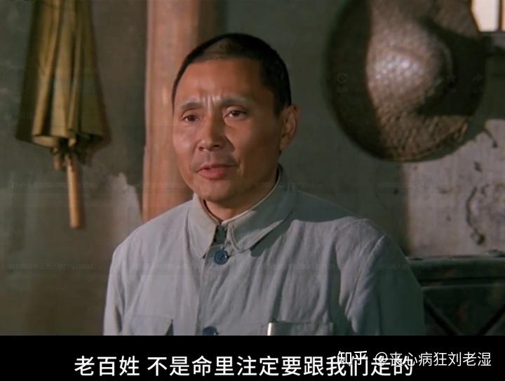
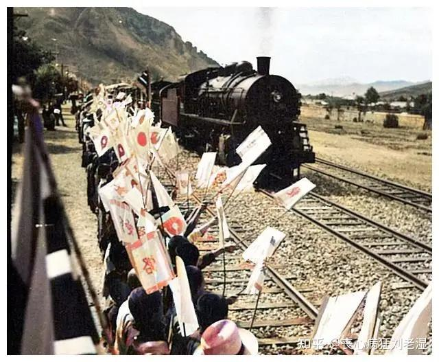
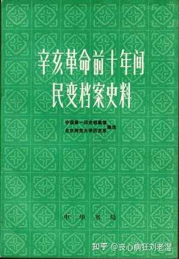

# 如果你是抗日战争时期日军总指挥，会怎样对抗《论持久战》的战略？

| 项目 | 内容 |
|---|---|
| 类型 | answer |
| 作者 | 丧心病狂刘老湿 |
| 收藏时间 | 2026-04-09 19:43 |
| 发布时间 | - |
| 收藏夹 | 抗联 |
| 原链接 | https://www.zhihu.com/question/667473860/answer/2025660180243789125 |

## 摘要

投共吧。 对抗个屁，根本对抗不了。 前头说过，妥协的问题是有其社会根源的…还在抗战初起时，我们就估计有一种酝酿妥协空气的时机会要到来，那就是在敌人占领华北和江浙之后，可能出以劝降手段。后来果然来了这一手；但是危机随即过去，原因之一是敌人采取了普遍的野蛮政策，实行公开的掠夺。 大体上，敌人是将东三省的老办法移植于内地。在物质上，掠夺普通人民的衣食，使广大人民啼饥号寒；掠夺生产工具，使中国民族工业归…

## 正文

投共吧。

对抗个屁，根本对抗不了。
<blockquote data-pid="ILqyNWyi">前头说过，妥协的问题是有其社会根源的……还在抗战初起时，我们就估计有一种酝酿妥协空气的时机会要到来，那就是在敌人占领华北和江浙之后，可能出以劝降手段。后来果然来了这一手；但是危机随即过去，原因之一是敌人采取了普遍的野蛮政策，实行公开的掠夺。 大体上，敌人是将东三省的老办法移植于内地。在物质上，掠夺普通人民的衣食，使广大人民啼饥号寒；掠夺生产工具，使中国民族工业归于毁灭和奴役化。——论持久战</blockquote>
无法对抗的根源在于战争性质，侵华战争之后日本长期占领中国领土，那么请问在一个原本就已经烂到匪夷所思的老民国底子上，额外再加一重负担当地经济可能不崩吗？？经济都崩了老百姓不造反吗？？

根本不可能啊！

这属于根本性、结构性的矛盾，这个问题解决不了别的就不用谈了。当然有人肯定会犟说那我拿一点利益出来分润给老百姓行不行？来，咱们看一个典型的例子：

我们都知道，日本侵华后进行物资掠夺严重依赖于铁路线，所以铁路破交始终是敌后游击战的重头戏之一。于是日本人针对这个问题，专门搞了“爱路运动”，将铁路沿线确定为爱路村，建立了爱路青年队、爱路妇女队等一系列组织。
<figure data-size="normal"></figure>
搞得很热闹对不对？然后奇妙的来了：当一个村子被确定为爱路村后，鬼子首先要做的就是——

把铁路两侧500内的高粱都踏马给你砍喽！

村民：？？？？？？？

为什么要砍高粱？因为高杆作物遮挡视线，不利于皇军巡逻。想想看，即便铁道线在你们村只经过了1里，但是两侧各500米就意味着有750亩的地不能种高粱玉米了，这谁受得了啊？？
<blockquote data-pid="ERNQIWjq">铁路两侧500米以内，应注意不使种植高杆农作物[1]</blockquote>
记住，给群众造成的经济损失，只要条件允许，就一定要以经济利益来进行弥补，这方面八路军有一个现成的例子：冀中平原农村里几乎家家养狗，夜晚部队行军时狗叫声会招来敌人。所以最后八路发动了“打狗行动”，然而狗在农村看家护院，与主人朝夕相处，许多村民都没法下定决心打狗。因此八路军除了让各村的积极分子带头打狗之外，还出钱给予村民经济补偿，把“打狗”变成了“卖狗”。

所以打狗行动最开始在群众嘴里是“八路军打狗，日本鬼抓鸡，汉奸打人要‘边区’（边区币）”

后来就变成了“狗皮好，狗肉香，吃饱穿暖打东洋，浑身上下有力量”最后冀中平原“夜行百里无狗叫”。
<figure data-size="normal"></figure>
鬼子的怀柔手段非常那啥，他们搞“爱路运动”主要靠请村长去东北旅游（……），提供农业贷款和种子、放电影、分农具，送小礼物（火柴，糖块）这些。但！是！

但是你一定被列为“爱路村”，就要在村子里搞保甲自卫团，晚上出人值夜班，伙食自备，而且相关费用要根据你有多少田来进行摊派。所以农民们的普遍反应是这玩意好处是真没见到啥，事是真不少……
<blockquote data-pid="DD8a9k31">村里通过保甲制没有得到好处吗，并不觉得实施保甲制后比以前好了，工作反而增加了。[2]</blockquote>
砍了路两侧的庄稼、强制摊派护路经费这是肉眼可见的经济损失，而鬼子那些弥补的手段比如发糖、放电影等等远远不足以进行弥补。至于你说种子什么的——呵呵，那是因为不许你在路两侧种高杆庄稼，所以发种子逼着你种替代作物的，拿好了啊，要是种不好皇军可是要不高兴的。

当然，因为靠着铁路嘛，所以看上去起码有“靠铁路吃铁路”的机会对不对？巧了，鬼子也是这么想的，鬼子专门组织了一种“厚生列车”，在春秋时节沿铁路线各个村子开过去然后停留，列车所到之处会进行爱路宣传，贩卖杂货，并给村民看病，但这里有一个小问题，请看大屏幕：
<figure data-size="normal"></figure>
因为厚生列车是一项很重要的政治任务，所以为了在鬼子面前彰显自己工作得力，各地的伪政权都会组织人手进行接待，然后还要摆拍，少不得还要请各界名人登车参观……别忘了，火车这东西是有时刻表的，列车停留的时间有限，等这些虚头巴脑的折腾完了还有个屁的时间看病。更倒霉的是接待的费用从哪出？？？

那当然还是要由爱路村的老百姓出啦！

惊喜不惊喜？

意外不意外？

好处远不足以弥补损失，然而惩罚却相当可怕：如果发现护路不力之人，鬼子当然要予以重罚甚至是枪毙，而且日寇挖空心思，提出铁路若有损毁则由负责此段的爱护村负责提供物资修补，变相转移了负担——请记住，华北的铁路线已经是日军顶重要的战略重心了，然而对于沿途各村来说，他们从其中获得的利益依然是负的，那么普通村县是个什么状态就不用多说了。

这就是《论持久战》所指出的“日寇必败”的根本依据：日本“其人力、军力、财力、物力均感缺乏”，在抗战早期之所以能取得一系列胜利，是因为日本的组织度更高，力量更加集中，而一旦战争进入相持阶段，日本必然无力控制广大的占领区，而只能扶持伪政府、并采用低效又容易激起民愤的掠夺策略来支持其长期战争，这反过来又会进一步激化矛盾，动摇占领区的统治基础，所以这种恶性循环一旦形成就无药可救。

想要脱离这种“死亡循环”，要么是日本人能在占领区内建立其稳定的伪政权，可惜在八路军等敌后武装存在的情况下这是不可能的；要么日本人愿意用极其漫长的时间，一个村子一个村子的杀过去，逐渐完成武力征服，但这样所消耗的时间跟精力都过于不切实际了；要么是日本人能突然醒悟，以歼灭中国军队有生力量、打击国民政府实力为第一作战目的，一战之后迅速脱离，根本不要占领区，转而试图通过掠夺和与国民政府谈判来榨取利益，但别忘了之前日俄战争后许诺国民的利益没有实现，大家可是发动了大骚乱的，而且就算是你想撤回来，下面的青年军官们肯吗？？
<blockquote data-pid="E-IOs6et">因此，应该看到这一抗战是艰苦的持久战。但我们相信，已经发动的抗战，必将因为我党和全国人民的努力，冲破一切障碍物而继续地前进和发展。”这些就是结论。亡国论者看敌人如神物，看自己如草芥，速胜论者看敌人如草芥，看自己如神物，这些都是错误的。我们的意见相反：抗日战争是持久战，最后胜利是中国的——这就是我们的结论。——论持久战</blockquote>

评论区里有人意淫只要有带清的控制力，带日本帝国就天下无敌了，还整出了一个靠着保甲跟武力胁迫坐稳晚清江山70年的说法，我笑死。

签了辛丑条约之后晚清民变数量之多，已经多到了可以专门集结出版的程度，你有兴趣的话可以自己找这本书来看看：
<figure data-size="small"></figure>
如果按照《清末民变表》的计算，1902～1911年间各地民变共1300余起——这叫做“年年岁岁，月月日日，无不有乱事起焉”，你还在这脑补带清“没有快速无药可救地崩溃”，辛丑条约签了十年带清就没了，你还想多快啊？

将推翻清政府的功劳全都归结于新军反正只能说明对历史的无知，很简单，请问武昌起义的新军有多少人？

按照当事人的说法，约有4000人
<blockquote data-pid="SoEpErbM">起义各部共计约四千人，其中非革命分子而临时同情革命的占多数[3]</blockquote>
但是军政府成立之后迅速扩军，在一周之内就扩充到了五协约三万人。那么这三万人，是从地里长出来的吗？
<blockquote data-pid="14SkgjOM">工人、农民、退伍士兵等，看到招募命令，无不踊跃参加，五协新军，几天之内即已招募完毕[4]</blockquote>
当然，新招募的这些革命军士气虽高，但是战斗力堪忧。所以清军在最初的失利之后卷土重来，还是拿下了汉阳汉口。然而这两镇却打了四十多天。最后“得两镇丢十省”，北洋军主力被全部牵制。在汉口巷战中，北洋军的机枪与火炮无法发挥优势，因而一度败退。本来双方是可能形成拉锯战的，但是冯国璋果断下令焚烧汉口市区——朝廷军队为了剿灭乱党下令焚城，反正我也不知道这是急了呢还是急了呢还是急了呢，最后打完了统计中发现有4000余人连个名字都没留下就殉国了：
<blockquote data-pid="uVTNcR62">殉国有姓名可记者，只三十二人；无姓名而确记数字者，四千二百八十余人[5]</blockquote>
这带清的统治可太稳固了。

这人民可太听话了。

---
导出时间: 2026-08-23 19:06