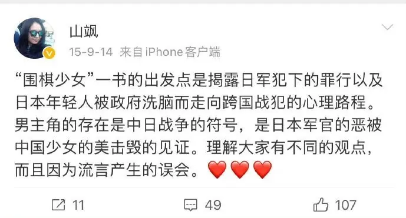
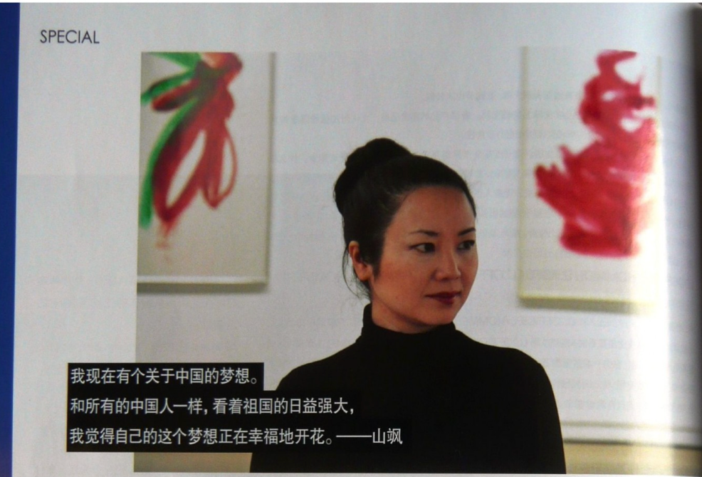
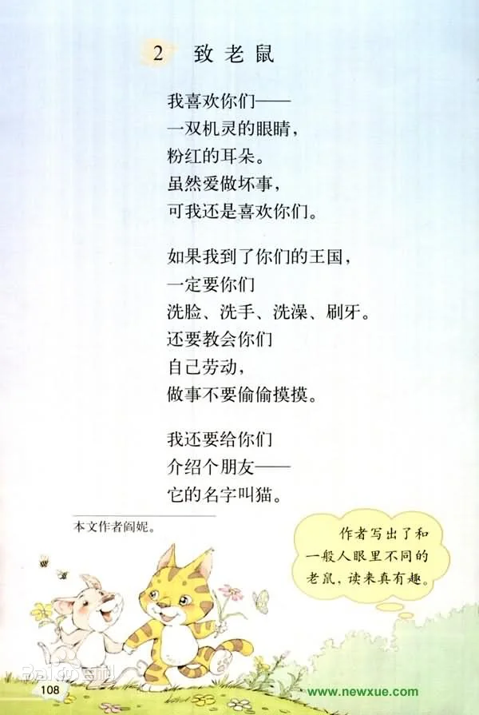

# 国家为什么迟迟不清理宣传口、文化口、教育口、法律口内的败类汉奸们？

| 项目 | 内容 |
|---|---|
| 类型 | answer |
| 作者 | Pseudocirrus |
| 收藏时间 | 2026-04-09 19:19 |
| 发布时间 | - |
| 收藏夹 | 抗联 |
| 原链接 | https://www.zhihu.com/question/2020953451459298446/answer/2025654174730166303 |

## 摘要

只说一下宣传口和文化口。 以前几年舆论场上很火的《围棋少女》事件为例。 《围棋少女》描绘了日本侵占东北期间，一位擅长围棋的16岁中国少女与一位伪装成中国人的日本军官相爱的故事。故事结尾处，围棋少女被日军俘虏，为了避免她被轮奸，日本军官枪杀了她而后自刎归天。 山飒在创作《围棋少女》时并没有意识到这会是一部“汉奸作品”。或者说恰恰相反，山飒是把他当成了一部“抗日作品”，以献给她的外祖父外祖母。 山飒的外祖…

## 正文

只说一下宣传口和文化口。

以前几年舆论场上很火的《围棋少女》事件为例。

《围棋少女》描绘了日本侵占东北期间，一位擅长围棋的16岁中国少女与一位伪装成中国人的日本军官相爱的故事。故事结尾处，围棋少女被日军俘虏，为了避免她被轮奸，日本军官枪杀了她而后自刎归天。

山飒在创作《围棋少女》时并没有意识到这会是一部“汉奸作品”。或者说恰恰相反，山飒是把他当成了一部“抗日作品”，以献给她的外祖父外祖母。

山飒的外祖父曾经在东北做过地下工作、在太行山打过游击，建国后还曾经出任长春市委书记。山飒生在红旗下，读的是北大附中，17岁被送去法国留学，后来定居法国，成为了法国华侨界的代表人物，两次代表华人艺术家参加在香舍丽榭宫举行的迎接中国国家领导人的国宴。
<blockquote data-pid="sgDVOOsz">外祖母1999年去世那天，我在意大利，父母打电话给我，我突然感到一种悲伤，现代社会不管在西方还是中国，追求的是物质生活，以金钱为主，在精神灵魂上的追求已经没有了，尤其他们老一辈的人，真正为中国人的自由洒过鲜血的这一代人，已经放到角落被遗忘了，现在外祖母也去世，好像抗日战争这段历史就了结了，没有人会再提起，现在的中国年轻人还会再为中国人的自由及尊严抛头颅洒热血吗？</blockquote><figure data-size="normal"></figure>
山飒1972年出生，8岁起就在《诗刊》、《人民文学》、《人民日报》等刊物上发表作品，11岁出版第一本诗集，14岁加入北京市作家协会，可谓是文学界的“超天才”。

这位“超天才”的政治立场其实不难猜测，她17岁放弃北大中文系的保送资格，拿着艾青、刘心武的推荐前往法国，在写《围棋少女》之前还写过一本书，叫Porte de la paix celeste，可以翻译成《和平天门》。这本书的另一个译名我就不说了，总之这本书可比什么围棋少女直白得多。
<blockquote data-pid="x9A_VFcT">《和平天门》是我的处女作，写的是我少女时的爱情和二十几岁当时对人生的看法，是很激烈而清新的小说。不过当时法语不好，没有能够写得更雄伟的手段。《围棋少女》题材完全不一样，它写爱情故事更为复杂，而且人物更为丰富，我自己的感觉是，我在《围棋少女》中能够表现在《和平天门》里不能表达的语言。两书中有个人物是同样的名字，这人其实就是我初恋的爱人，我们的初恋是很悲壮就结束了，我觉得我写了这两本小说来埋葬这段爱情，因此说起来都还是爱情小说。也是讲在社会与人生转变的一瞬间怎样去爱，怎样去恨，是这样的一个故事。</blockquote>
尽管以大众的视角来看，《围棋少女》堪称是文青病发作、政治负分的作品，但媒体通过包装很快就将其变成了“深受各国读者喜爱”的时尚单品。
<figure data-size="normal"></figure>
《围棋少女》这本书从法国传回国内时，自然也是被宣传成一本爱国主义作品。
<blockquote data-pid="N7yX8nNX">广州日报：以您那部《围棋少女》为例，法国的读者和国内的读者对这本书的反应最大的不一样是什么？ 山飒：很多法国的读者是觉得这本书陪伴了他们的成长，因为《围棋少女》是写一个小女孩性启蒙的状态，又是在国难当头的背景下，是一个非常艰难的性启蒙。那些正处于青春期的读者看了我的书，对于青春期的焦躁、幻想、痛苦和情人间的分离，他们都能在这个作品中体会到。国内的读者是觉得我用一个爱情的悲剧来讲述一个战争的悲剧，这个角度很新颖，他们以前没有看过以这样的角度来反映战争。</blockquote>
光明网上现在还能找到一篇介绍山飒的报道：
<blockquote data-pid="JUF6m9jT">从《和平天门》到《柳的四生》，从《凛风快剑》到《围棋少女》和《书法家的明镜》，她像一只夜莺不停息地歌唱，时而如泣如诉，刻骨铭心；时而如行云流水，飘逸自然……她用异乡的音符唱出了她心中的爱，心灵的歌，故国的歌。这歌声相比于前辈诗人（如程抱一）的歌唱，也许还显得稚嫩，但它同样深沉嘹亮、苍凉感人，这是发自诗人内心的声音，她独有的声音——是那背井离乡的远游人、探求者，心系祖国的歌唱。</blockquote>
《围棋少女》虽然还没有被拍成电影，但“要拍电影”的事情本身也可以用来炒作一番。
<blockquote data-pid="T-dDddla">成都商报日前报道了法国著名制片人MONIQUE.GUERRIER(中文名武唯一)和旅居法国的北京女作家山飒亲自来京，为中法合拍电影《围棋少女》寻找导演。昨日，突然杀出一个“程咬金”———《寻枪》导演陆川主动请缨出任《围》片导演。 陆川说，山飒以法语版小说《围棋少女》摘取法国最高文学奖后，他就开始关注这部小说。看了小说后，他便被小说的浪漫风格迷住了，非常想把它改编拍成电影，但无法联系上山飒。前不久从本报获知武唯一和山飒来京寻找中国导演执导该片后，陆川立即委托记者转告他的执导意愿。 昨日记者电话联系上远在法国的山飒。山飒惊喜地表示：“是拍摄《寻枪》那个导演吗？他来拍《围棋少女》应该很值得期待！但这事我也不能做主，而且武唯一目前已有人选了。”随后记者又采访了武唯一，她的态度很冷淡：“让陆川来执导该片的可能性很小。况且我不认识他，不能单凭你一句话就选他。”</blockquote>
山飒童年时写的诗据说也被放入了语文人教版六年级上册的综合性学习部分。
<figure data-size="normal"></figure>
山飒去法国并不是一时兴起。她的父亲阎纯德是北京语言大学的教授，1974年被派往法国讲学，被称为“第一个在法国系统讲授鲁迅的人”，很早就在法国建立了人脉关系。山飒的母亲李杨（李杨杨）在六十年代时更是北大校园里的风云人物。

阎纯德现在依然是“国际汉学”研究者，一带一路文化项目的负责人，作协的重要成员。前面提到的那个想拍《围棋少女》电影的导演陆川，他的父亲是著名反腐作家陆天明。陆天明和阎纯德都是在八十年代加入的作协。

如果不是后来有人真的读了《围棋少女》这本书，发出了质疑的声音，戳破了媒体编织的叙事，《围棋少女》无论如何也不可能被认定为汉奸文学的。

《水浒传》开篇是“洪太尉误走妖魔”，作者是想说，北宋民间的问题，根子要追溯到庙堂上。

---
导出时间: 2026-08-23 19:06