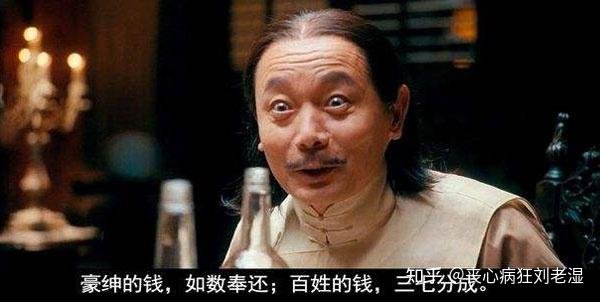
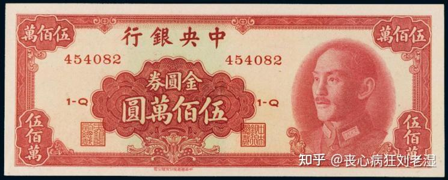

# 抗日时期八路军的经济状况如何？

| 项目 | 内容 |
|---|---|
| 类型 | answer |
| 作者 | 丧心病狂刘老湿 |
| 收藏时间 | 2026-04-05 19:09 |
| 发布时间 | - |
| 收藏夹 | 抗联 |
| 原链接 | https://www.zhihu.com/question/24814677/answer/2024202050183906273 |

## 摘要

两个字评价就是牛逼。 革命不是请客吃饭，然而革命者却必须要吃饭。 所以共产党在根据地构建了同时代东亚大陆上所有政权中最™先进高效且符合国情的财政体系，吊打鬼子，吊打汪伪政府，当然也踏马吊打牢蒋。 首先我们需要了解一下当时最流行也是最基础的征税操作，简单来说就是敲诈勒索。 尤其是七七事变爆发之后，华北大地上的秩序在一夜之间彻底崩塌，晋察冀一带原有政府官员大多将公款搜刮一空后弃官潜逃，溃兵败阵之后更是沿…

## 正文

两个字评价就是牛逼。

革命不是请客吃饭，然而革命者却必须要吃饭。

所以共产党在根据地构建了同时代东亚大陆上所有政权中最™先进高效且符合国情的财政体系，吊打鬼子，吊打汪伪政府，当然也踏马吊打牢蒋。

首先我们需要了解一下当时最流行也是最基础的征税操作，简单来说就是敲诈勒索。

尤其是七七事变爆发之后，华北大地上的秩序在一夜之间彻底崩塌，晋察冀一带原有政府官员大多将公款搜刮一空后弃官潜逃，溃兵败阵之后更是沿途抢掠，乱成一团。因此在日军抵达以前，许多地方都处于无政府状态。

对于打着抗日旗号四处搜刮的土匪和兵痞来说，这是天大的好消息——没有政府，意味着几杆枪便可以作威作福，杀进村里征拿卡要。所以当时是司令满街走，主任多如狗，实力不济的就找个村子进去就地勒索，胆子大的就找个交通要道拦路设卡。这样来过几次之后，就开始进入到劣币驱逐良币的过程了：挺进敌后的八路军不愿压榨百姓，在有些地区给养濒临断绝，许多部队直到寒冬腊月依然身着单衣。

你拿这个去抗日？？

当然不行对吧，所以接下来我们要介绍第二种略为先进的操作，那就是所谓的“县合理负担”。这个操作说白了就是吃大户
<blockquote data-pid="KCKchiUo">（筹粮对象）主要是汉奸、土豪和资本家，农民出钱出粮的户较少，贫苦农民基本不出负担[1] </blockquote>
很显然，你永远可以相信共产党的道德水准，所以八路去征粮基本都是按照队伍数量进行合理征收的——然而因为八路的道德水平太高了，所以这个玩法也是不行。因为大伙都知道这个玩法的奥义……
<figure data-size="normal"></figure>
牢蒋那边的思路，是我要粮食确实只跟你村里县里的地头蛇要，但你跟下边怎么筹粮那就是你的事了，所以压力是可以层层转嫁的。

你八路现在只跟大户要，那大户当然不干啊！

所以中共中央晋察冀分局书记彭真就指出这种办法“筹款极少而摩擦极多”，于是晋察冀边区政府成立之后，1938年3月开始停止“县合理负担”，转而实行“村合理负担”——这套东西，就是牢蒋以及汪伪各路政权根本玩不转的了。

村合理负担的要义是将一切负担，均按照由村户财产收入所折算的“分数”进行负担，得分越高的，负担越大。那么很简单的一个问题就是分数怎么算，最基本的思路是组织一个评议会，评议会由村长、村中的农工商会各一名代表以及村中闾邻组织代表组成，然后村民自己申报，评议会进行评分，此外不同根据地又根据自身经济结构特点，有所调整。

牢蒋：超，数目字管理！？如何做到了？？

四一二清党之后国民党失去了有效的基层组织，所以这一切对他们来说就是天方夜谭。然而在施行村合理负担之外，更重要的是整个边区搞了统筹统支——除边区政府以外，无论是八路军还是各路机关，都严禁在各地自行筹粮筹款；还搞了减租减息，恢复生产——当然也同步恢复田赋征收；而且还成立了边区银行，开始发行货币。

然后妙的就来了。

因为统筹统支，没有人乱打秋风，所以政府有了信用。

因为减租减息，恢复生产，所以农民除了正常缴纳田赋，还有了余粮。

因为政府有信用，农民又有余粮，所以1938年9月边区政府公布了《征收救国公粮条例》，同年11月，边区各县逐渐开始征收救国公粮；公粮基本上只用于供给军粮、优抚军属并进行救灾慰问，采用“分布式存储”策略，征收之后由各村自行保管。支用救国公粮的票据名为“军用粮票”，边区政府会根据部队数量与边区粮食收成来计算救国公粮征收总量，再向各个部队发放粮票。

当然只要稍稍动动脑子，大家就能明白这个玩法对基层治理能力的要求有多高——存在各村大家凭什么不直接吃掉？粮票？造假怎么解决？计算公粮征收总量如何让人心服口服？这里面的门道多了去了，篇幅所限就不详细说了。

救国公粮加上固定的田赋，构成了晋察冀边区财政收入的底色。在此基础上边区废除了头发税、骡马尾税、斗行牙税、大车捐、小车捐等一系列名目繁多的苛捐杂税，代以烟酒税、印花税和契税等新税种。其核心要义，一是便于征收，二是与民得利——比如契税，乃是田产房屋过户时所缴税款。由于无论是田产还是房屋，在一般民众心中都属于绝对的硬资产，因此不仅政府课税极重，而且交割时往往还要请四邻“吃割食”，给村长“盖印钱”，被中介“两头吃”，所以许多人会选择冒着被对方反咬一口的风险私下交易。在边区政府整顿了市场秩序、取消了种种陋习之后，许多民众不仅乐于缴纳契税，甚至主动补缴了之前私下交易时逃掉的税款。

简单来说就是，建立政府威信，然后藉此吃下以前被社会灰色地带和中间环节攫取的利益。

但是呢，打仗嘛，跟正常情况肯定还有不同，所以在上述这些税赋之外，一旦财政出现缺口，还要售卖救国公债：1938年4月到6月期间，冀中根据地财政收入的50%都来自公债。那么公债发行当然会涉及到货币计价问题——你边币能打得过伪币吗？？

一般人很难想象近代以来山西河北等地的币值有多混乱，我只说一点：河北唐县西大洋镇大德兴肉铺所发行的土票，在某段时间内是可以在当地跟法币一同流通的。
<blockquote data-pid="0eF0XVA5">一是大德兴肉铺,一是德元永杂货铺,长期以来与法币无异的在本地区流通,这种现象并非是个别的。[2] </blockquote>
1938年6月，晋察冀边区银行以粮食、棉花和法币作保，正式发行边币，旋即规定“边币为市面唯一的交换媒介”，与法币1:1进行兑换，之后开始逐步回收杂钞，清理土票，然后土八路开始跟鬼子的“联银券”进行疯狂的金融斗争，斗争手段之酷烈狡诈匪夷所思。

“联银券”是个什么样的货币呢？

简单来说，“联银券”是1938年2月日伪创办中国联合准备银行后所发行的货币，在当时来看极具全球视野，因为这个银行除北平总行外，在天津、青岛乃至东京都有分行。日本人野心勃勃，提出要凭借单币多场景联动打法，推动货币一元化，快速拉通前端掠夺链路与后端资本蓄水池，跑出“发券—收割—循环扩容”的价值飞轮，形成政银军一体的高频闭环增长生态。

简称，割韭菜。

联银券名义上与日元1:1等值，在华北沦陷区中，乃是支付军费与政府开支的“官方”货币，因此日伪在收购华北地区的煤炭、粮食与棉花时用的都是联银券。从1938年到1941年，联银券击败法币，成为了华北地区最为重要货币，就连天津英法租界工部局也不得不开始使用联银券。而在体量上，边币与联银券更是差异巨大，1939年12月联银券发行4.95亿元，边币发行不过一千来万，沦陷区面积和物产又非根据地所能比拟，所以伪政府跟鬼子非常喜欢依靠武力手段与生产力优势玩套购物资，输入通胀这一套。举个今天很难想象的例子——一个平静的午后鬼子跟伪军忽然跑到了边区与沦陷区交界的县村，然后把大伙叫了之后，大家心惊胆战中鬼子打开了包袱抖出了一大堆的破！衣！服！

买吧。

本质上这就是强迫你用货币甚至是实物（比如粮食）来购买日伪能够大量生产的物资，然后套走你的粮食、布匹、药材，制造输入性通胀。而且妙的是衣服这东西本身属于刚需，大量破衣服输入之后边区自己生产的土布怎么办？手工业者是要破产的啊！

此外日伪也大肆向边区输入雪花膏、花露水、玩具这些奢侈品，所以根据地一直力倡勤俭节约，1941年2月边区政府又公布了《外货入境分类课税办法》,将各种日用品分为奢侈品、非必需品和必需品三类，分别施以不许进口、重税交易与免税交易三种政策，跟日伪斗争，并适时向沦陷区外销土布等产品。1943年双方斗争最为激烈时，日伪甚至频繁出兵对边区集市进行“扫荡”，力求破坏边区的商品贸易秩序，而群众便在游击队的掩护下开展流动集市、夜间集市乃至“碰头市”，在田边树林里迅速交易，一碰即走。

边区政府的整体思路，一直都是实物经济为主，商品经济为辅，在绝大多数时间里边币始终钉紧粮食等硬通货，信用十分坚挺——但是你说直接取消边币，用粮食作为货币行不行？答案是不行，晋察冀山多，粮食运输损耗很大，所以依然还要保留货币来完成商品贸易。为了巩固信心，边区成立了各种合作社，工作人员会挑着商品深入偏远地区，以促进商品流通，日伪数次想要将联银券打入根据地内，皆以失败而告终，最终还是在大扫荡的武装攻势之下才将联银券堪堪带入边区。

而且保留货币最重要的好处，就是在斗争极端艰苦的时候，边区可以通过财政赤字化政策来缓解经济压力，以坚持抗战——当然我知道你会说牢蒋也在搞财政赤字化，但是相信我，牢蒋对经济的理解是踏马有异于常人的：
<blockquote data-pid="UFs9oEia">和各位有些不同……我可以说我们战时经济绝无问题——蒋介石·1941[3]  法币的信用，实际比战前还要稳固——蒋介石·1942[4] </blockquote>
要知道这是1941年，物价开始暴涨、恶性通胀都已经出现了，可老将依然认为通胀跟自己超发法币毛线关系都没有，法币的信用毫无问题，些许通胀都是奸商作乱。

这不纯纯有病吗？？

知道自己在做什么，跟假装知道自己在做什么是完全不一样的。所以根据地的经济状况较后方要艰难百倍，但依然支撑了下来，其中高效而廉洁的行政机构、以党员为骨干的基层力量是重中之重：以前面说过的“村合理负担”为例，这个政策实施之后，有些村子“同仇敌忾”地与政府对抗，全村上下都自称土地贫瘠出粮不高，压低粮食产量，以要求政府在征收粮款时候有所减免。甚至有些村内积怨多年的大姓，都会在实际利益面前放下矛盾，“一致团结、集体隐瞒”，将自家田地产量压下，以求少交公粮。而就算是村内诸人不肯相互隐瞒，在民主评议计算分数时也往往要为了一两分而闹到不可开交，有的村干部在这段时间里“数夜不睡，甚至有因工作而牺牲者”。

那么问题要怎么解决呢？当然要先苦一苦干部，边区政府深入各村培养了“最积极最慷慨的分子与能起模范作用的村干部”，务求在民主评议时起到表率作用，化解矛盾。但是最根本的问题还是“做蛋糕”而非“分蛋糕”，毛泽东在1942年专门讨论过这个问题：
<blockquote data-pid="2fD2bfbp">发展经济，保障供给，是我们的经济工作和财政工作的总方针。但是有许多同志，片面地看重了财政，不懂得整个经济的重要性……他们不知道财政政策的好坏固然足以影响经济，但是决定财政的却是经济。未有经济无基础而可以解决财政困难的，未有经济不发展而可以使财政充裕的——毛泽东[5] </blockquote>
所以1943年中央明确要求各根据地“以90%的精力帮助农民增加生产，然后以10%的精力从农民取得税收”。因此边区政府始终大力支持农民垦荒，不仅对垦荒土地免征三年，更是主动组织移民垦荒，全面抗战八年中边区扩大了耕地面积182万亩有余，此外边区政府还大修水利，改良育种，在抗战的滚滚硝烟之中改良农具肥料，愣是做到了耕战两不误。

当然，大扫荡开始之后许多部队一度被逼到了山穷水尽的地步——问题是你™神仙来了这个状态也没招啊，封锁到了极端困难的时候就是没辙，这是纯粹的物质问题。

那么认识不到“经济不发展而可以使财政充裕”的货色是个什么表现呢？？

嗯，牢蒋坚持认为法币贬值是因为奸商作祟，所以要求下面人严格管控物价，连续失败后认定这肯定是下面人干活不够用心导致的，索性成立了一个了行政院经济会议和国家总动员会议，老蒋亲自挂帅管控物价，工作求精求实求细，小到一枚鸡蛋也不放过，如1943年机秘甲第 7481 号手令就指出，“如鸡蛋每枚三元，应即没收其货物”。在这种思想的指导下，数年之后牢蒋终于制造出了近代史上空前绝后的大通胀……
<figure data-size="normal"></figure>

---
导出时间: 2026-08-23 19:06