# 如何理解科恩兄弟执导的电影《老无所依》？

| 项目 | 内容 |
|---|---|
| 类型 | answer |
| 作者 | 请叫小许写稿 |
| 收藏时间 | 2026-04-04 02:03 |
| 发布时间 | - |
| 收藏夹 | 抗联 |
| 原链接 | https://www.zhihu.com/question/20156217/answer/2023581442450401009 |

## 摘要

我的评价是它是一部世上最绝望的电影，当你看懂了这部电影的底层表达，以及导演藏在细节里的隐喻时，你会跟我一样陷入抑郁，陷入对人生和世界的迷惘。 如果你想完全看懂这部电影，请足够耐心地听完把它讲完，我会从各个角色、各个人物的视角，把这部电影像开了上帝视角那样，给你讲透。 和我看过的很多为了推进剧情、而给人物强行降智的作品不同，《老无所依》里的角色，处理各种问题的能力都非常优秀，哪怕在危险的环境中，也能…

## 正文

我的评价是它是一部世上最绝望的电影，当你看懂了这部电影的底层表达，以及导演藏在细节里的隐喻时，你会跟我一样陷入抑郁，陷入对人生和世界的迷惘。

如果你想完全看懂这部电影，请足够耐心地听完把它讲完，我会从各个角色、各个人物的视角，把这部电影像开了上帝视角那样，给你讲透。

和我看过的很多为了推进剧情、而给人物强行降智的作品不同，《老无所依》里的角色，处理各种问题的能力都非常优秀，哪怕在危险的环境中，也能在最快时间找到最优解。

但这些，却不足以抵抗生活的多变与命运的无常。

《杀死那个石家庄人》里的一句歌词：<b>生活在经验里，直到大厦崩塌。</b>

<b>过去的认知也许让你比较顺利地走过人生的某一段路，但它也会在某一刻突然失灵，甚至成为杀死你的武器。</b>

《老无所依》故事给我的感触太过真实，真实到它不像一部虚构的电影，而是一段记录时代的影像。

正因为足够荒诞，才现实至此，但你却很难指出它的不合理，很多人都说过“现实不需要逻辑”这句话，但那更多只是对于社会热点的粗滥引用。而你看完这部影片后，会对它有更深的理解。

如果你有很多想不明白、深感怪异的事情，这部影片或许能给你不一样的答案。

 

<b>搭上了生活的便车，却不知它驶向地狱</b>

莫斯在狩猎。他瞄准目标，扣动扳机，没有命中羚羊，击出的子弹却把他的人生引向了另一个轨迹。
<figure data-size="normal">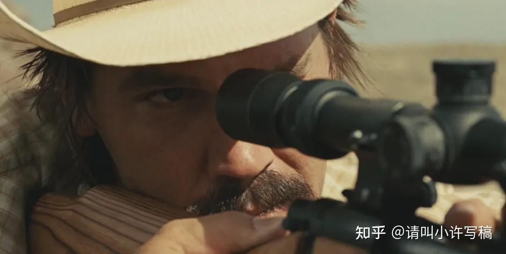</figure><figure data-size="normal">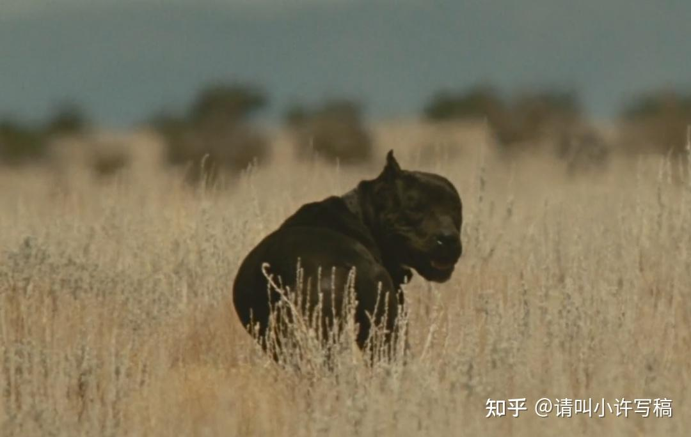</figure>
他发现了一条瘸腿的狗，一路上流着血。

跟随这条狗，莫斯闯入了毒贩的交易现场。

现场惨烈不已，地上全是尸体，枪械掉落在一旁，显然是谈判失败，双方发生了火拼。

莫斯在车上发现了一位活着的墨西哥人。

这个幸存者奄奄一息。他见到莫斯，做不了任何事，只能气若游丝念叨着：水，水。他渴望这个陌生人能救他一命。
<figure data-size="normal">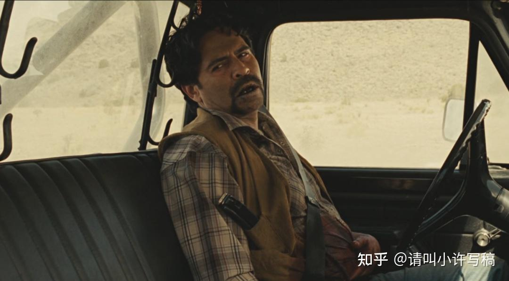</figure>
莫斯自顾自地拿走了他手枪，再次观察了一遍现场，又返回问道：你们一定还有最后一个人，他不在这里，他去哪里了？

莫斯为何如此笃定？因为他在现场发现了一车的毒品。

有货就应该有用以交易的钱，但现在钱不知所踪，必然是有人带走了，那个人就是最后的人。

这个时候，我们观察莫斯的行为，就能看到他作为退役军人的分析能力：

<b>一个受伤的人，在这样的大荒野中，走不了太远。因为不熟悉环境，他只能沿着往返的方向前行，考虑到他们是开着车来的，所以莫斯只需要跟着车轮，就能追上对方。</b>

<b>而此时正是烈日当头，他一定会选择能遮蔽阳光的阴凉处。</b>

依据以上两点，莫斯找到了躺在树下的人。
<figure data-size="normal">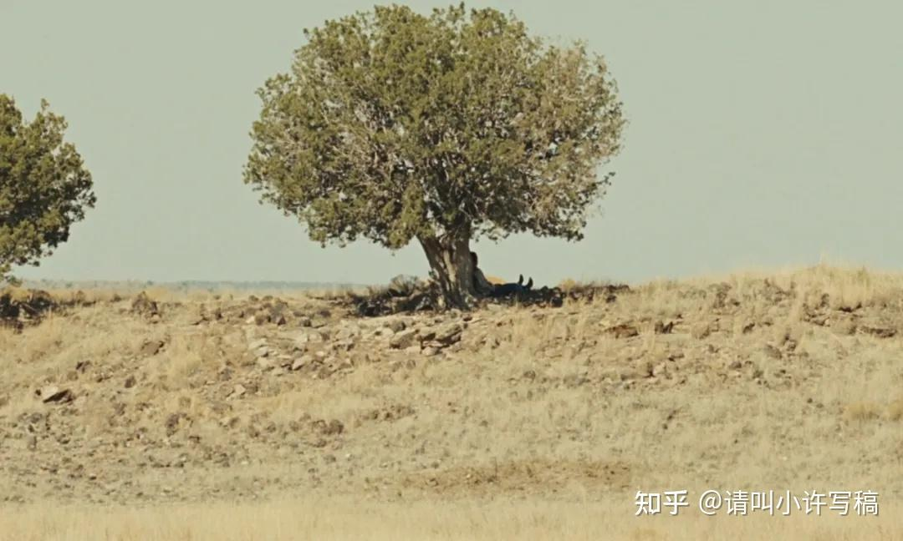</figure>
莫斯没有冒失接近，而是在远方用望远镜观察了很久，确定对方彻底咽气，才走了过去。

莫斯不急着打开皮箱检查里面的钱，而是先取走手枪，他生怕对方没有死透，给自己来上一枪。

他的步骤很有考究，这也是他从战场上活下来的原因。

莫斯带走了装满现金的皮箱，以及现场的手枪。而这把手枪，后面会救莫斯一命。

莫斯上车要离开时，天空早已变了颜色，晴空被乌云取代，传来一阵阵的轰鸣声。
<figure data-size="normal">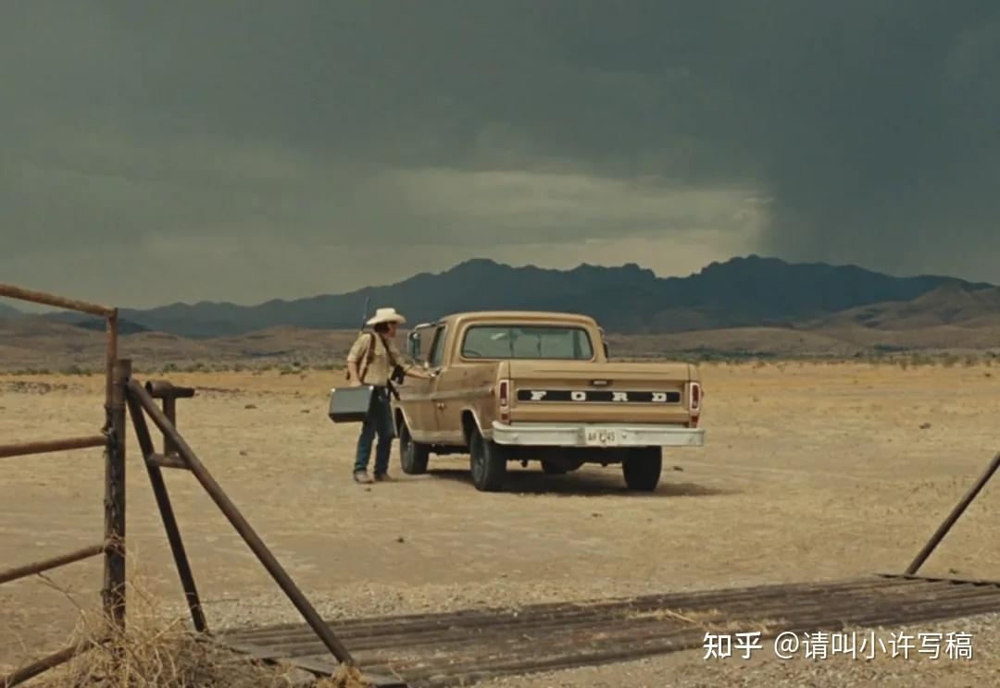</figure>
<b>这是对莫斯的警示，同时也是向观众透露莫斯后续的处境。</b>

回到家后，莫斯翻来覆去睡不着，那位一心求水的墨西哥人，始终在他脑海里挥之不去。

他或许贪财，但他始终是一个有良心的人。

而正是这份良心，让他做出了一个致命的决定：<b>回去给墨西哥人送水。</b>

莫斯赶到的时候，墨西哥人早已死去多时。

想返回的时候，却碰上了前来接应的毒贩同伙。

身后毒贩驾着车对他射击，猎犬在不停地狂吠，黑暗充斥着死亡的气息，但同时也盖住了视野，以至于毒贩一直打不中莫斯。

但两条腿可不比不上车轮，莫斯的优势只有一个：熟悉附近的地形。

这一点，与影片30分45秒老警长和警员的对话，形成了鲜明的对比。

警员问警长：为什么野狼不来吃这里的尸体。

警长回答：我不知道，也许他们不吃墨西哥人。
<figure data-size="normal">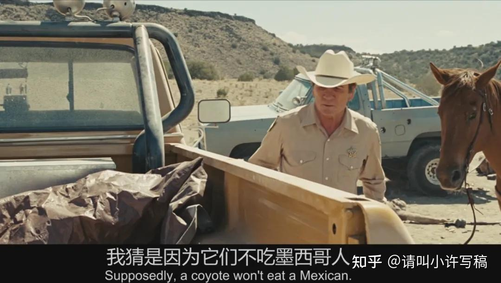</figure><figure data-size="normal">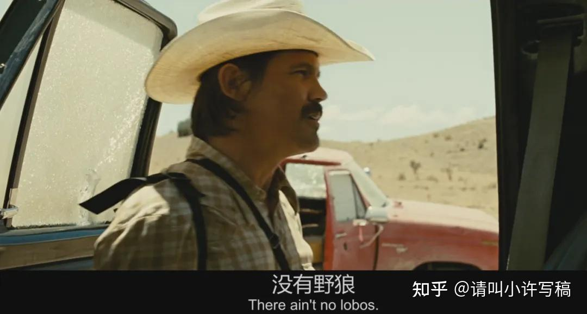</figure>
反倒是奄奄一息的毒贩劝告莫斯不要乱走，有野狼时，<b>莫斯可以很平静地告诉他：这附近没有野狼。</b>

这部分在写到警长篇章时，我会再提及

所以莫斯的逃跑不是漫无目的，而是有意朝着溪流的方向。

在挨了一枪后，莫斯脱掉吸水会变重的外套，老练地跳入了水中，往远处游去。

毒贩开着车没法追击，跟上来的只有猎犬，它跟着莫斯游上了岸边。

还记得前面的那把手枪吗？此时它发挥了作用，一枪解决了扑上来的猎犬。

简单处理好伤口后，莫斯回到家取出现金，要求妻子去娘家。

他知道遗留到现场的车牌号，会暴露自己的住址。

莫斯什么也没有和妻子说，只是强硬地要求妻子辞掉工作，承诺此间事了，回来后便能过上一辈子不用工作的富裕生活。
<figure data-size="normal">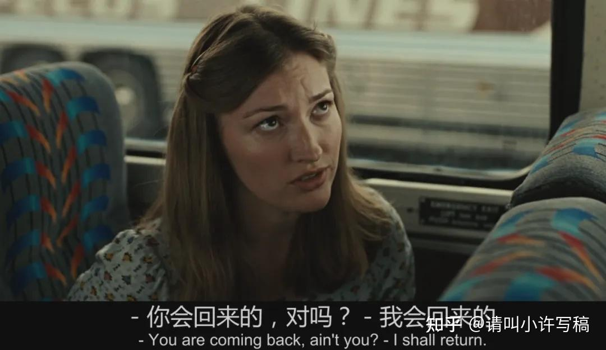</figure>
他说他需要一辆车，但不打算购买或租赁，而是找朋友借，因为他不想留下注册号，这样给敌人带来更多的信息。

他实际的行动比向妻子交代得更加谨慎，他甚至都没有去借车，出行全靠出租车。

入住旅馆，莫斯从里面拿出自己开支所需的部分后，把皮箱藏进了通风管道深处。

他拉开窗帘的一角，确定外面没有陌生车辆后，关上窗帘，离开了138号房。

他去了商场，购买必要的物品，在厕所清洗脚上的伤口的血迹，换上了新买的靴子和袜子。

回旅店的出租车上，莫斯要求司机围绕旅馆一圈，他要检查周围，确定是否有被人盯上。

经过所住的138号房时，莫斯发现窗帘多了一条缝隙，他记得出门的时候明明是全拉上的。而一辆陌生皮卡正停靠在不远处，他推测房间内已有不速之客，于是要求司机载他去另一家旅馆过夜。

第二天，他买好长枪，备上好能在野外生存的帐篷等物品，为了避免在狭窄的环境也能发挥枪的威力，还特意把枪杆锯短。

<b>在定义一个人时，任何善辩的言语，都无法胜过事实的行为。就像是判定一个人，你不会听他说什么，而只看他做了什么。</b>
<figure data-size="normal">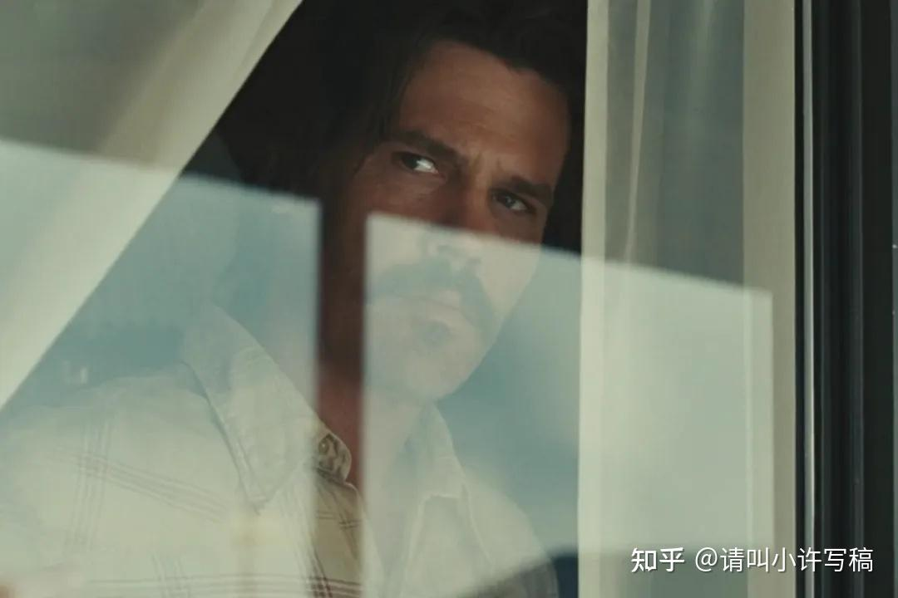</figure><figure data-size="normal">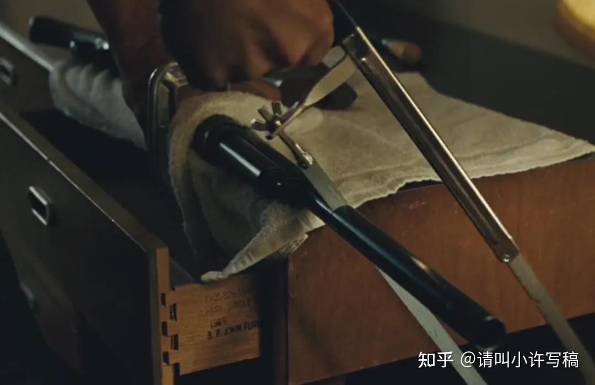</figure>
《老无所依》对每个人物的刻画，都保留了这种方式，因此<b>人物的每一个行为都有迹可循，无声但有力，很好地融入故事的场景里，完全不需要旁白和其他角色的赘述。光是在个各种场景下的神态、语言与肢体动作，就能为你娓娓道来他大概是一个怎样的人。</b>

就比如莫斯，他上述的种种行为，已经充分阐明了这个角色的画像：拥有极度的谨慎，干练的身手、以及果敢的执行力，是一位合格甚至优秀的退役老兵。

当身处险境时，你拥有这种能力，就能有更高的概率活下去，它是一个如此巨大的优势，但<b>也正是这份优势，给了莫斯太大的勇气，最终让他变得傲慢，自信能摆平这一切，却引来了更大的灾祸。</b>

一切妥当后，莫斯重回旅馆，向老板重新开了与138号房通风管道相连的38号房，这样他可以在敌人不知情的状态下从另一边取回皮箱。

此时原本的138号房已被毒贩占据，正等着莫斯回来送命。他们没能等来莫斯，反而等来了危险的杀手安东。

双方的实力完全不对等，几乎是一面倒的屠杀，安东很轻易地解决了房间里的三个毒贩。
<figure data-size="normal">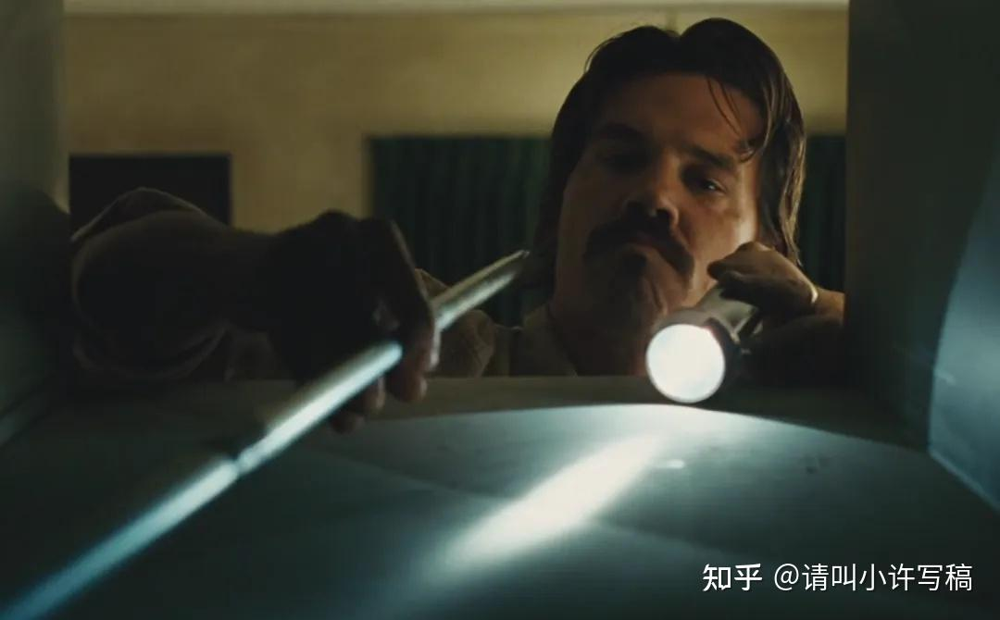</figure>
房间另一边的莫斯抓住机会，带着皮箱逃离了。

但他能逃得了吗？

来不及等出租车，莫斯临时拦了一辆车，打算搭便车去下一家旅馆。

在车上，莫斯和司机两人有了一段富有哲理的对话。

司机说：像你这样的年轻人，不该搭便车。

似乎是想给观众一点思考，沉默了好一会儿才继续说：很危险。

车主既未卜先知地命中主角的困境，同时也给出了一针见血的评价。

莫斯焦躁到慌不择路的状态，已经明示了他正在遭遇的危险事。

所以<b>司机的评价，是精准的推理，却在背后同时展现出更高维度的哲学。</b>
<figure data-size="normal">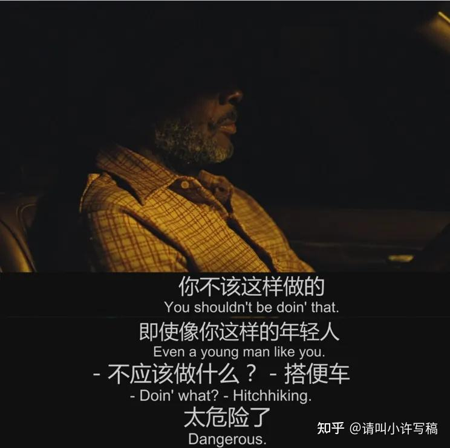</figure>
<b>搭便车，指的就是莫斯取走的那一箱钱，它是莫斯摆脱贫困、过上富裕生活的捷径，但它荆棘塞途，随时会吞噬生命。</b>

莫斯不知是否听出车主的弦外之音，他仍要坚持自己的决定。

他订了一家新的酒店，献上小费，请求管家如果有新的客人入住，一定拨打他房间的电话。

莫斯夜不能寐，有一个他始终没能想明白的问题：为何敌人能精准找到他的位置。

他打开皮箱，找到了答案：藏在一沓一元纸币中间的跟踪器。
<figure data-size="normal">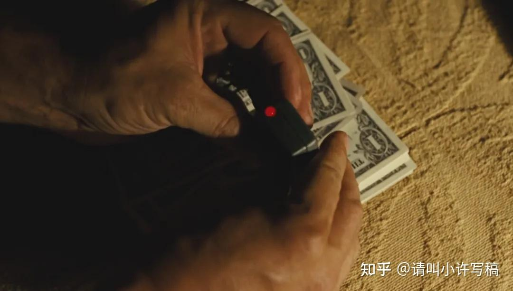</figure>
此时跟踪器的灯光正在闪动，或者敌人已近在咫尺。

莫斯给前台打了电话，根本无人接听，发生了什么已不言而喻。

莫斯从包里拿起手枪，坐在床上，关上灯，紧张地对准房门。

门缝里出现了人的影子，莫斯上膛，却似乎被门外之人听到。

门缝里的人影消失了，不一会儿，走廊的灯也被灭了。

突然间，门锁被枪击破，在门被推开的一瞬间，莫斯也开枪了。

随后不再犹豫，莫斯快速跳窗逃离。
<figure data-size="normal">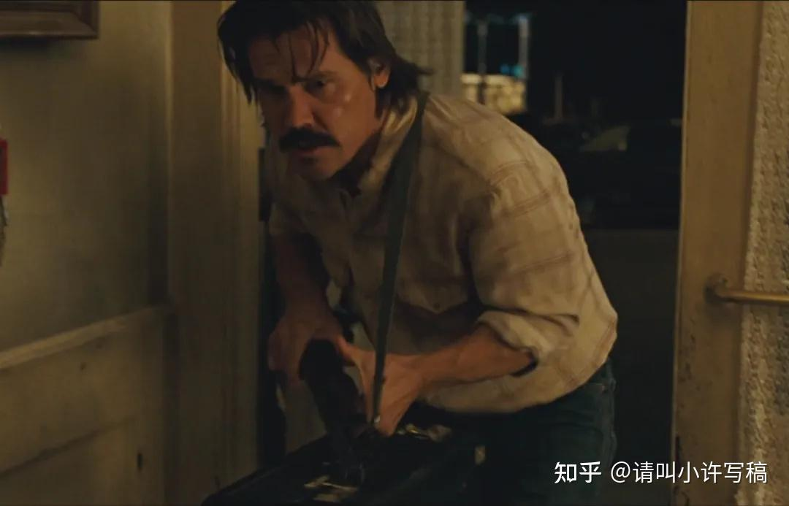</figure>
莫斯没有中枪，但弹出的锁芯还是让他受了伤，这样的状态逃不了多远。

莫斯再次拦了一辆便车。车主没能和他聊上几句，就被击中了脑袋。

莫斯的情况很危险，但这也是一个机会，莫斯很擅长抓住一闪而过的机会，他决定利用这一点降低敌人的警惕，从而反将一军。

请注意接下来两人对峙的细节：<b>莫斯弯着身，迎着对方的枪火往前开，假装中弹，故意撞上了路边的车。</b>

莫斯从车里出来，为了制造自己已死的假象，就必须关上车门，但不能让敌人听到关门声，所以<b>情况很危急，他关门的动作却依旧缓慢。</b>
<figure data-size="normal">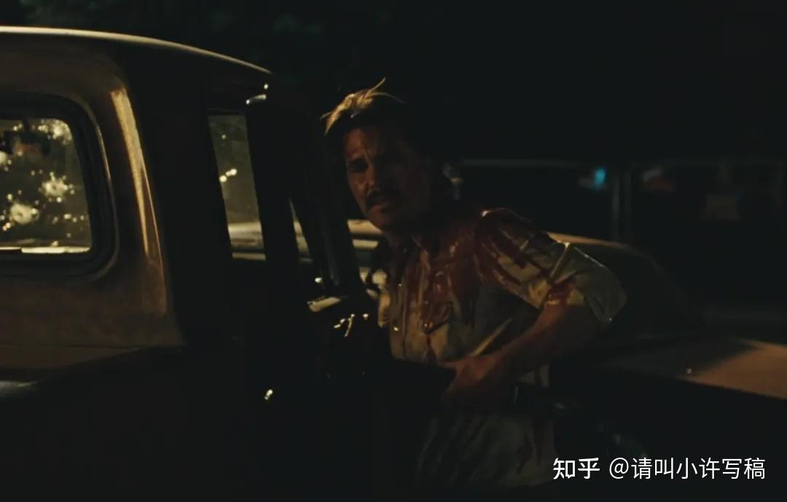</figure>
注意细节，莫斯关门的动作很轻

这些细节是如此自然，没有任何多余的镜头，一切皆有用意。

安东中计，从暗处走了出来。

安东望着车门下方的血迹，很快意识到这是陷阱，猎物并不在车里。他的危机意识很强，在莫斯开枪的那一刻，果断向旁边跃去。

莫斯赶来的时候，安东已失去踪影，而地上多了血印。显然敌人也中了枪，危机暂时解除。

危险的来源不一定只是安东，莫斯不敢往回走，为了不被警察和黑帮找到，他也不能去医院，只能一路向南，直往墨西哥。

在边境大桥上，莫斯拦住了三个年轻人。

莫斯本可以向三个年轻人求助，但他希望降低沟通成本，好尽快到桥的另一边，所以提出用500美金买为首青年的外套。
<figure data-size="normal">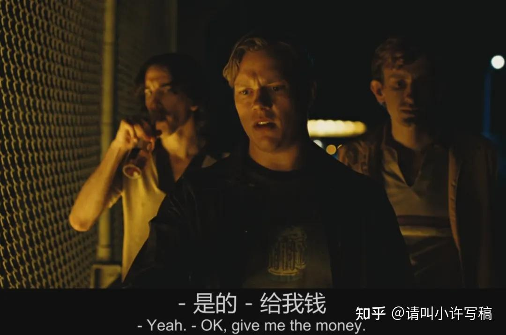</figure><figure data-size="normal">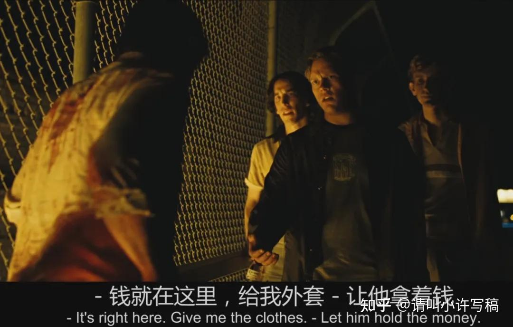</figure><figure data-size="normal">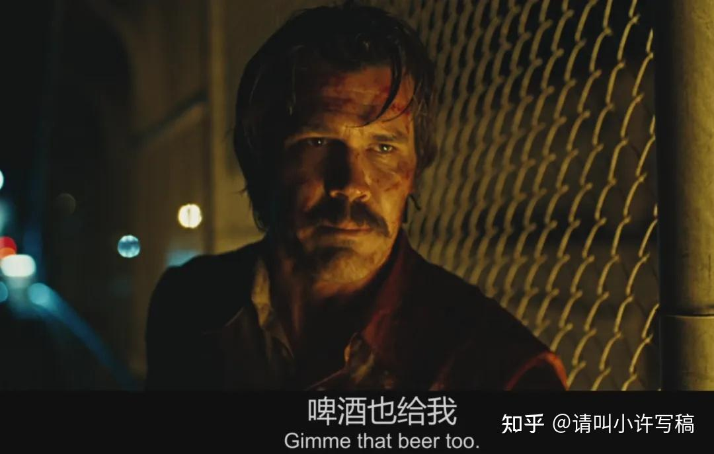</figure><figure data-size="normal">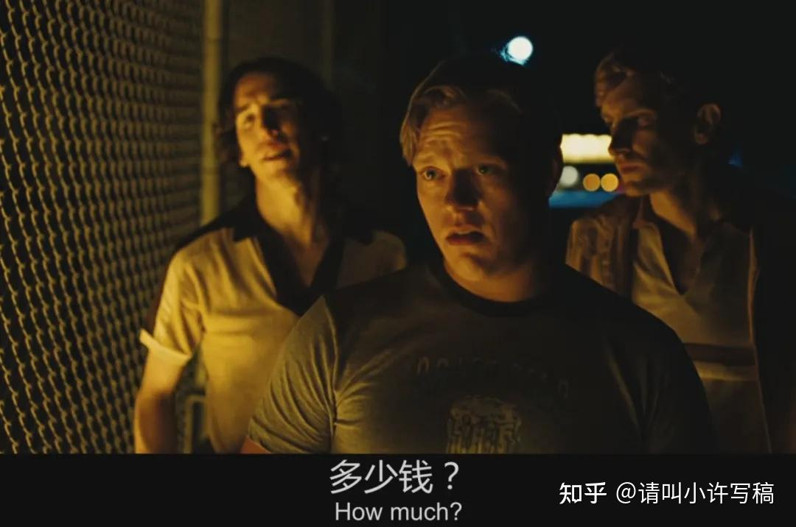</figure>
莫斯提出500美元买外套，却勾起了青年更大的贪欲。

在80年代，500美元的购买力足以几十件这样的外套，<b>他以为青年为了占便宜会迫不及待地进行交易，却没想到勾起了他们更大的欲望。</b>

莫斯让青年把外套给他，但青年说一定要先拿到钱，眼睛紧紧地盯着他手里的那沓钱。

莫斯本可以直接交易，但还是进行一波拉扯，并不是多此一举，而是他看到了青年眼里的贪婪，所以<b>他一定要营造一种感觉：自己不是那么好说话的人。</b>

钱货易主，莫斯还提出了附加条件：我需要你同伴手里的啤酒。

但这次他没有提出用钱买。要求啤酒的想法是临时产生的，因为<b>他用远超物品本身的价格，去买一件外套，并没有让事情变得简单，反而朝着更复杂、危险的趋势发展。</b>

如果此时他再用同样离谱的溢价买对方喝剩的啤酒，那么就会给对方传递一个信息：我现在很虚弱，但我很有钱。

那么接下来会发生什么呢？

<b>想要搭便车的人，可不止莫斯一个，他必须阻止事态往危险的方向发展。</b>

当左边的青年问他打算花多少钱来买的时候，莫斯盯着他，没有作声，用沉默来表明自己的态度。

右边的青年不希望事情放大，他劝住同伴，直接把啤酒给了莫斯。

一场可能的交锋，就这样被无恙地化解。

莫斯要外套是为了遮住枪伤，这样他才能在警卫的注视下，越过边境。

刚才的插曲，他意识到这种状态无法守住财富，所以把皮箱扔进桥下的草丛里，才颤颤巍巍穿过了边境桥。

墨西哥广场，莫斯被欢快的音乐吵醒，看到旁边的墨西哥乐队正在表演曲目。
<figure data-size="normal">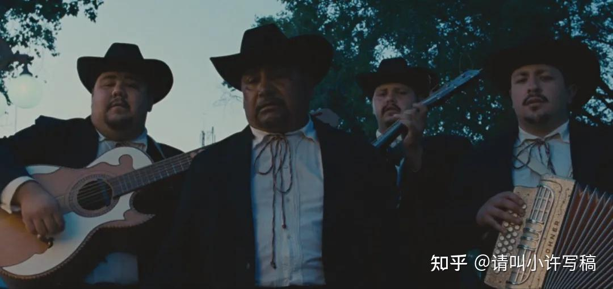</figure>
这是全影片唯一的音乐，那么它就不会是随便加上去的，一定是有特别的用意。

这段音乐非常欢快，却在对应着莫斯处境的悲惨。

我搜了一下，它的歌词是这样的：

<b>你没有翅膀，但你却想飞，想要触到天空。</b>

<b>你想要拥有财富，你想要玩火自焚，以至沦落至此。</b>

歌词，正对莫斯着的人生。

莫斯现在拥有了财富，却失去了安全、温暖和家。

这又和司机劝他不要搭便车的台词完美对应。

<b>那箱意外之财，既是生活的便车，也是烧身的火焰。</b>

种种细节，早已暗示了莫斯的结局。

只是这些伏笔埋得很隐秘，很容易被观众忽视，因为很少有电影会对镜头画面的精雕到如此地步。

莫斯学请求乐队救他去医院，报酬是100元，远低于之前买衣服的钱。
<figure data-size="normal">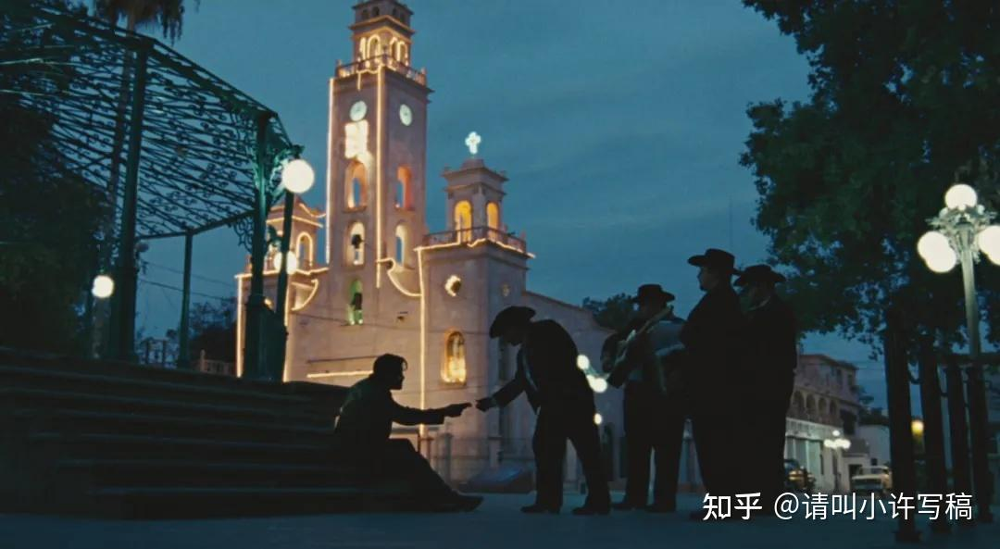</figure>
<b>他意识到了钱，对人精神的腐蚀，他不希望再次勾起他人的贪欲，就像当初现场的那箱钱，勾起了自己的贪欲那样。</b>

醒来后，莫斯看到的是手捧鲜花，戴着牛仔帽的男人。

男人叫卡尔森，是美国制毒公司派来的第二个杀手。
<figure data-size="normal">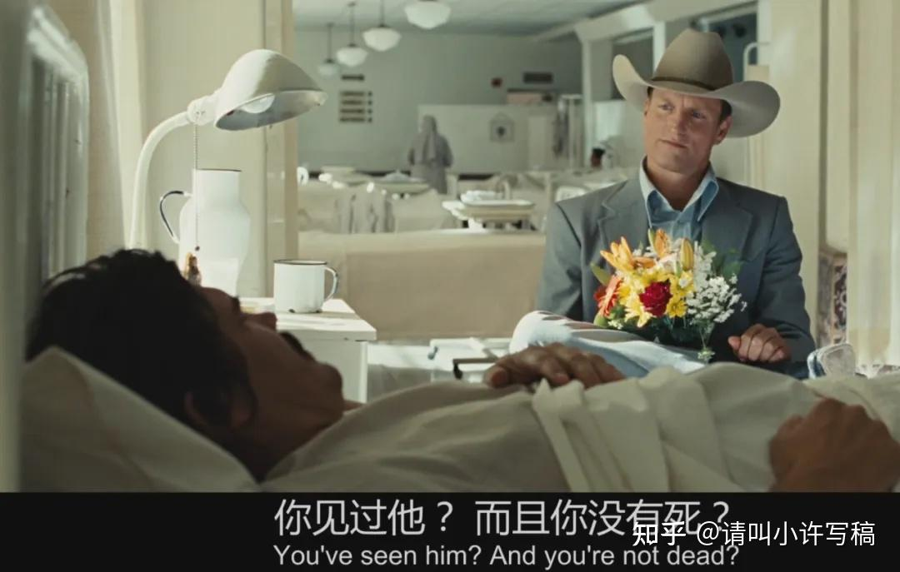</figure>
卡尔森并不打算要莫斯的命，而是要进行一场交易。

只要莫斯把钱交出来，他就能保护他们一家人的安全。

莫斯不以为然，问卡尔森自己为何不直接和安东做交易呢？

卡尔森却告诉他，安东不是一个合适的交易对象，因为无论是否把钱还回去，安东都会杀了他，理由是你给他造成了麻烦。

莫斯能从安东手里逃生确实很厉害，但卡尔森不觉得他能逃过第二次。

莫斯还在嘴硬，说自己能对付，但卡尔森接下来的话让他感到深深的不安。

卡尔森说：安东会去奥德萨市。

莫斯终于慌了，他问卡尔森他去奥德萨市干嘛。

卡尔森说出了莫斯所担心答案：去杀你老婆。

<b>一个是交了钱还要死，一个是用钱能换取全家的安全，二者貌似不难选。</b>

所以在卡尔森离开后，莫斯没有纠结太久，果断地给卡尔森打去了电话。

但卡尔森永远也没办法接听他的电话了，因为电话那一头是安东。

安东说：我知道你在哪里，但我不会自己过去，我要你亲自把钱送到我的脚下。作为回报，我会杀死你，但会留你老婆一命。
<figure data-size="normal">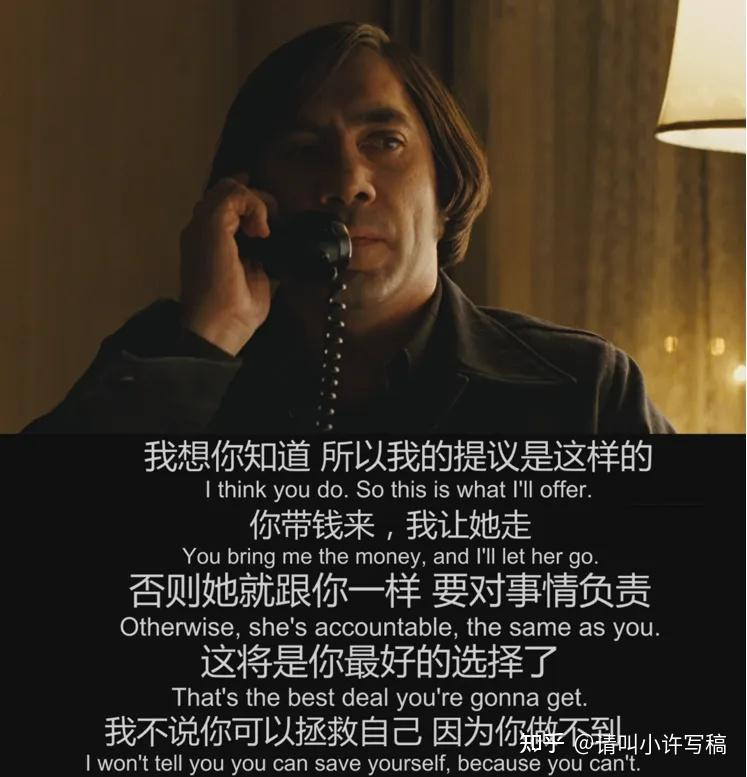</figure>
安东的提议，伤害了莫斯的自尊，也触碰了他的底线

如果妥协，只有自己会死；如果反抗，自己和妻子都会死，但也有可能都能活下来，用那笔钱过上富裕的生活。

安东的提议与其说是交易，不如说是威胁。这让想来硬汉的莫斯感受到了羞辱，他对自己的实力很有自信，所以他决定孤注一掷，干掉安东，彻底了结这件事。

这一刻，莫斯和安东有了同样的目标：找到卡拉。

不同的是：莫斯是为了保护卡拉，而安东则是为了杀死她。

回到美国，莫斯和妻子通了话，他要妻子带着钱远走高飞，这样自己全神贯注去应对安东。

电话里，丈母娘对莫斯怨声载道，她说自己得了癌症，怪莫斯没有能力。

母女俩在赶往埃尔帕索的出租车上时，丈母娘也一直喋喋不休，说早在三年前她就料到了这一步。

<b>对从事电焊工的女婿，她的鄙视，毫不掩饰。</b>

可见，莫斯在妻子的家人这边承受太多的压力，卡拉嫁给她大概率牺牲了很多，这些都被莫斯看在眼里。

如今他的岳母已身患癌症，他们却无能为力。
<figure data-size="normal">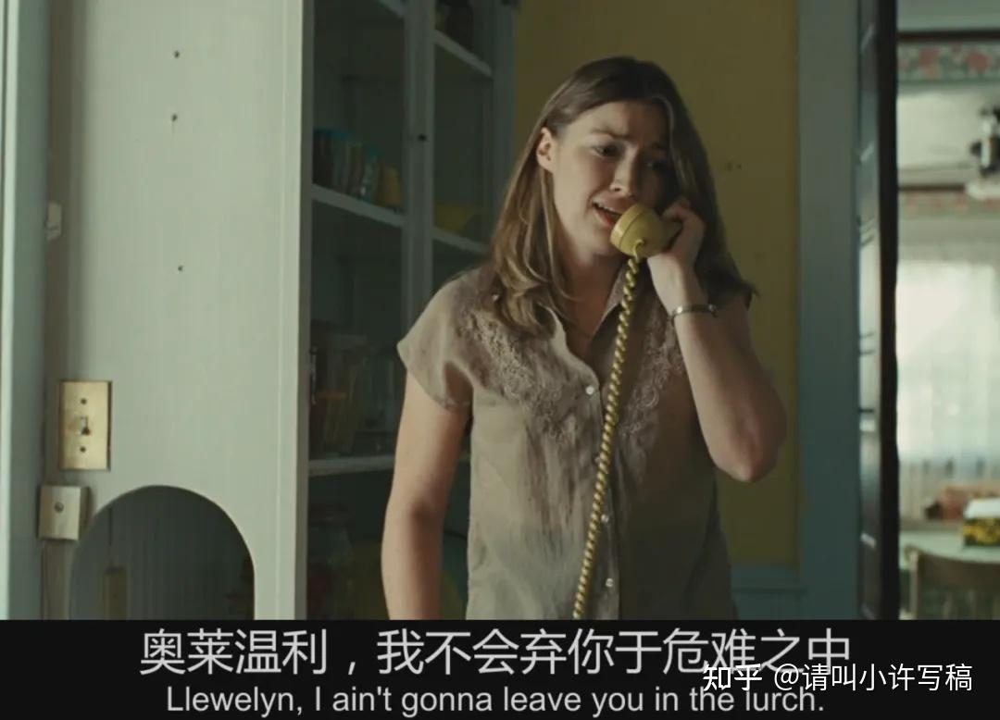</figure><figure data-size="normal">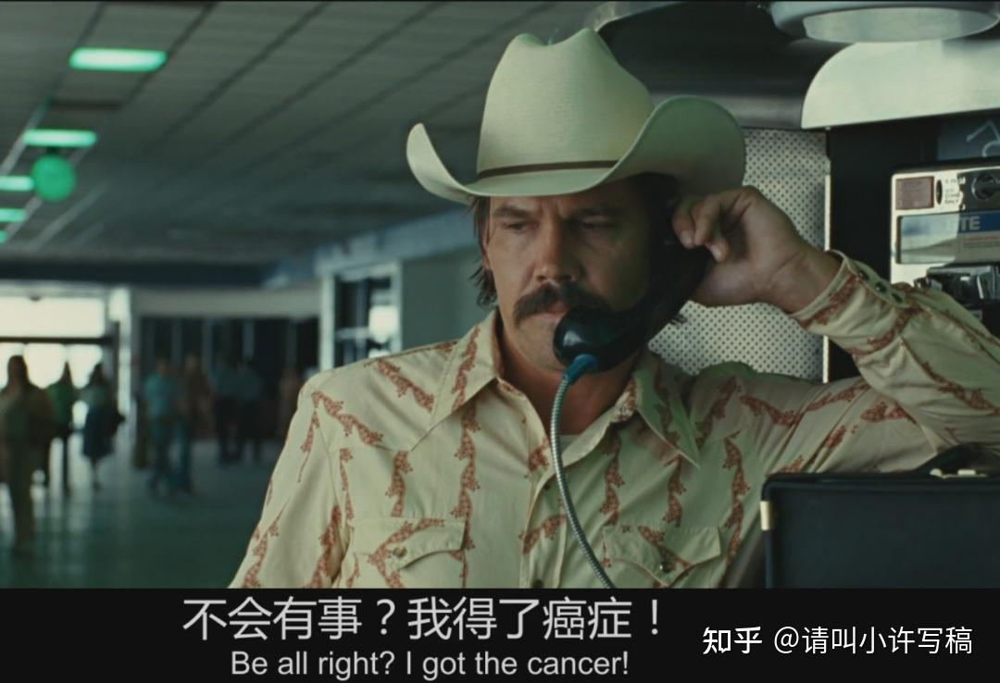</figure><figure data-size="normal">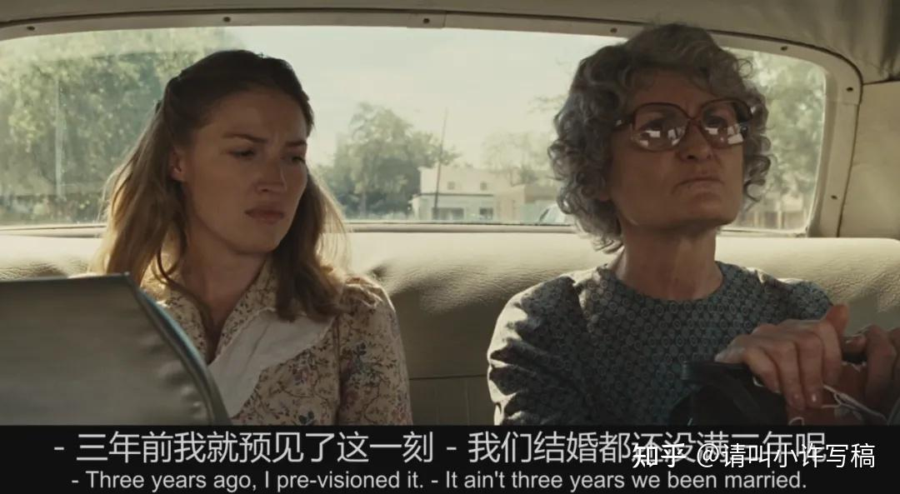</figure>
现在不一样了，当然，前提是莫斯能解决掉背后的麻烦。

卡拉和警长的通话求助时，卡拉曾这样对警长评论她的丈夫：只能你一个人去跟他谈，他从来都不会向别人求助，他从不觉得自己需要帮助。

这里可以看出，莫斯是一个自尊心很强的人，他有着自己的坚持。

或许正因如此，莫斯才会搭上便车，朝着危险的道路一往直前，只为给妻子带来更好的生活。

抵达约定的旅馆，莫斯被泳池旁的女郎搭讪。莫斯简单寒暄了几句，露出戴着戒指的手，告诉她在等自己的妻子，拒绝了啤酒和欲望。
<figure data-size="normal">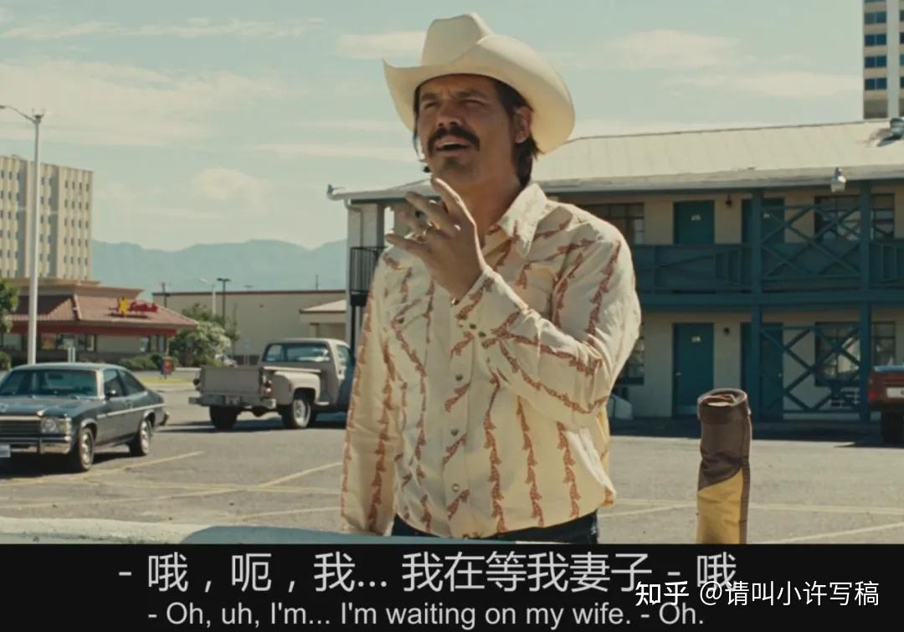</figure>
他有一个很爱他的妻子，他不希望这一切离他而去，他要捍卫这一切，就必须要和威胁家人生命的安东决一死战。

但他们没有这个机会，莫斯没能等来安东，反倒等来了另一帮人。

他们是墨西哥的毒贩，这一次找上门，只为莫斯从他们那里顺走的钱。

而莫斯的位置，正是他那天真的岳母泄露的。

这一次，莫斯没有创造奇迹，交战过后，莫斯死在了毒贩的枪下。
<figure data-size="normal">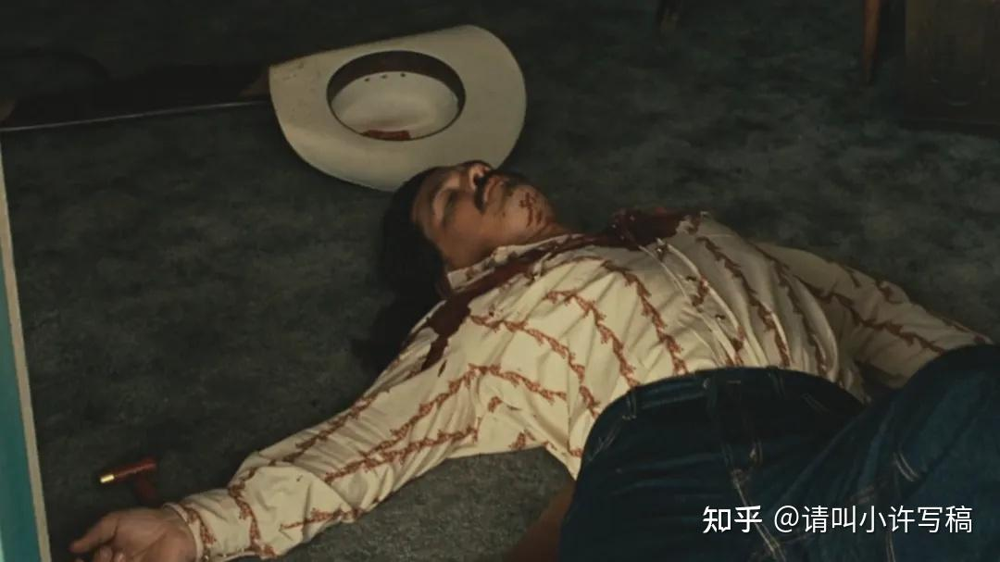</figure>
我们都以为莫斯和安东的对决是本片的结局，因为他们的矛盾最为直观，整部影片明线都是围绕他们的矛盾来推进的，这样才更符合戏剧属性的需求。

可在现实中，<b>事物的发展并不需要遵循一个固定的轨迹，电影的剧情走向来了一波反直觉，却让故事变得更加真实、立体。</b>

生活可不会机械地去服从人为的计划，而是会给你制造各种意外，正所谓世事无常。

<b>再丰富的经验、再敏捷的身手、与天才的认知，都无法对抗这种无常。</b>

莫斯正是死在了这种无常中，他把安东视作最大的对手，一心准备着和他的终战，却不曾想被岳母被刺，出乎意外地死在了墨西哥人手上。

但在我们看来，又是如此的常规，因为电影早就交代了墨西哥人，也是以找钱为目的的一伙势力。

和其他主角光环压倒一切的作品不同，在《老无所依》里，即使是那些看似只能当陪衬的旁外角色，也能登上舞台，发挥重要的作用。

<b>在这个无限接近现实的世界，没有人拥有不死的光环。</b>

所以莫斯的死法，反而成了情理之中。

 

<b>没有道德、没有情感、没有弱点</b>

一位警察抓到了一个打扮独特、举止怪异的男人。这个男人随身带着软管和氧气灌。
<figure data-size="normal">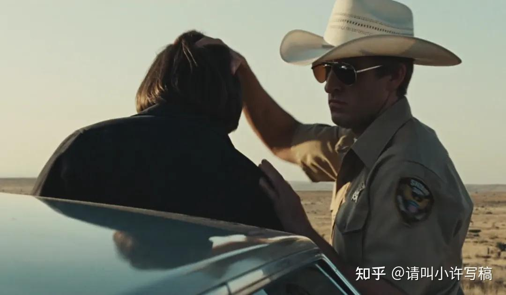</figure>
带到警局后，警员和上级通话简单地汇报了情况。

警员刚说完一切都在他的掌握之中，安东便以已悄然走到他的身后，用手铐迅速地勒住警员的脖子，两人一起倒在了地上。

警员在痛苦地挣扎，身下的安东保持着勒紧的动作。<b>警员的临死反抗在地上形成了一道道如树枝敞开的痕迹，就像是某种仪式，带来强烈的不安感。</b>

身下安东的脸因用力过猛而紧绷着，虽然并不轻松，但<b>整个过程他表情都保持着维持着一种静态，因而显得有些平淡，甚至是安详。</b>
<figure data-size="normal">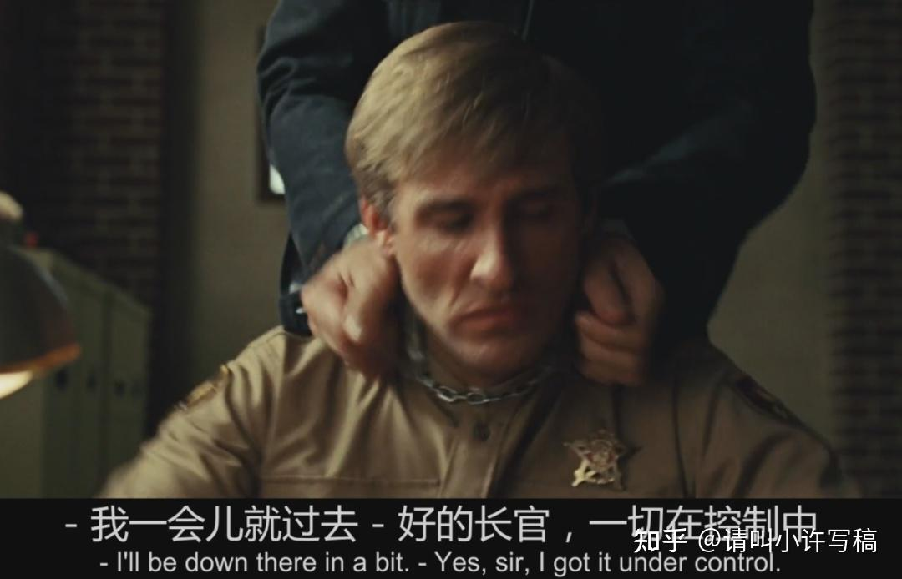</figure><figure data-size="normal">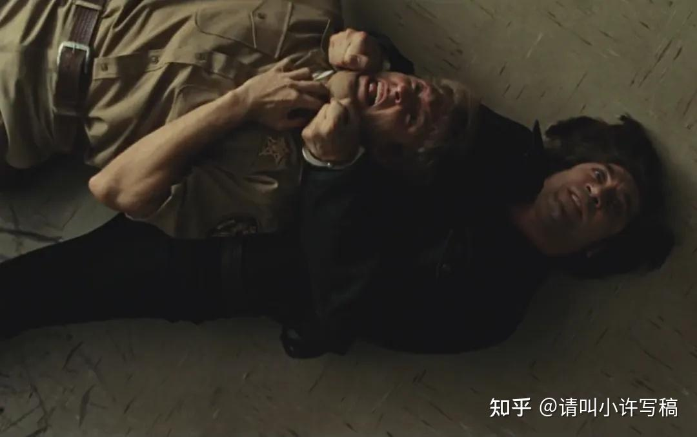</figure><figure data-size="normal">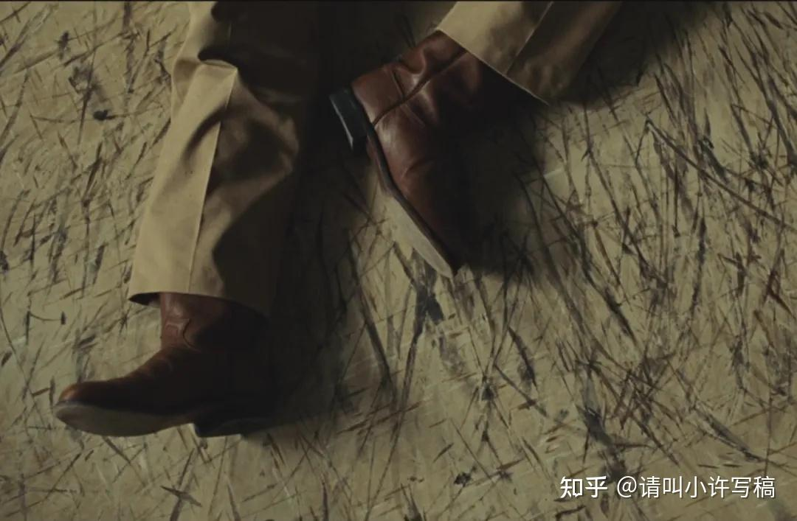</figure>
解决完警员后，安东洗净手上的血迹。他的两个手腕被手铐印出一道深深的伤痕，看起来很疼。但这种程度的痛苦，早已对安东造成不了任何影响。

离开时，安东带走了他的氧气罐。

他开着警察行驶在马路上，但警车太过招摇了，他需要更换一辆普通的车，所以逼停了一位路人车主。

安东礼貌地要求车主下车，安抚着让他站着不要乱动，然后把软管的枪头对准额头，扣动扳机，于是一条鲜活的生命宣告终结。
<figure data-size="normal">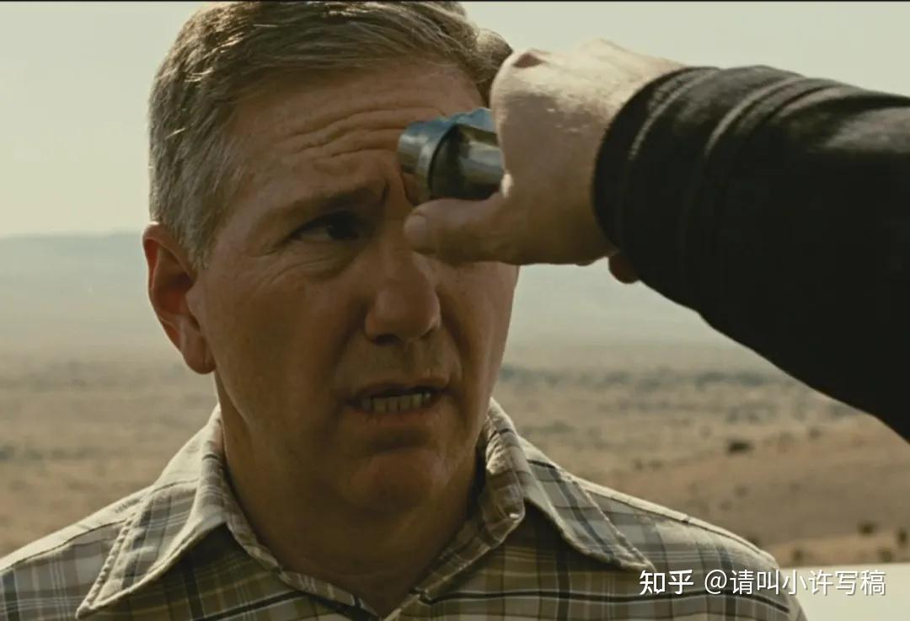</figure>
这种感觉，就<b>像是屠夫安抚待宰的牲口，如此冷酷、如此平和。</b>

安东的残酷不止于此，在加油站的百货店。

店主只是随口问了安东从哪里来，莫斯便感到不爽。

安东有了杀心，但理由好像不太充分。每当这个时候，安东就习惯给他们一次机会——让对方猜硬币的正反面，猜中了生，猜错了死。

店主猜中了正面，安东把硬币给了他，说是他的幸运币。

店主并不知道，他差一点就因为一句简单的问候而失去生命。

但不是每一个人都有这个机会，店主可杀可不杀，他的生死对安东都不会有什么阻碍。

电影里卡尔森对莫斯说过：安东一定会杀你，只因为你造成的种种不便。

这个台词很便于我们理解安东这个角色，因为<b>安东便是影片开头警长独白内容的具象化。</b>

这一次安东是带着任务而来的：帮助雇主找到在交易现场失踪的钱。
<figure data-size="normal">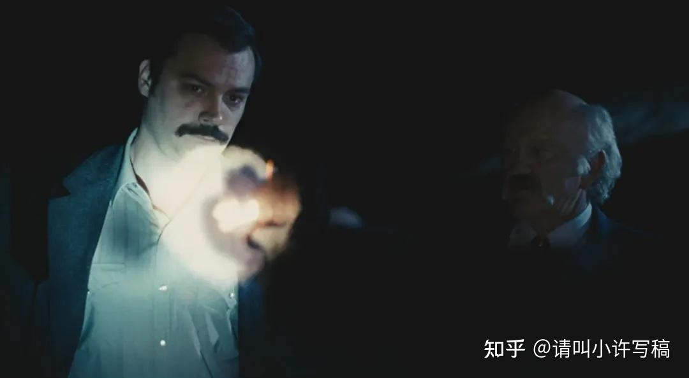</figure>
安东在两个同伙的带领下去火并现场。安东取下莫斯的车牌，要到钱箱的追踪器后，果断地杀死了他的同伙。

为何要突然对自己人下手，其实影片已经很鲜明地告诉了我们原因，就藏在警长和年轻下属对话的细节里，但很多人似乎都没有发现，这个在讲到警长的篇章时我会再来说明。

拿着莫斯的车牌，安东向管理员询问莫斯的工作地点，管理员说她不能透露当事人的信息，安东重复问了三遍，管理员终于怒不可遏：你聋了吗？我们不能提供讯息。
<figure data-size="normal">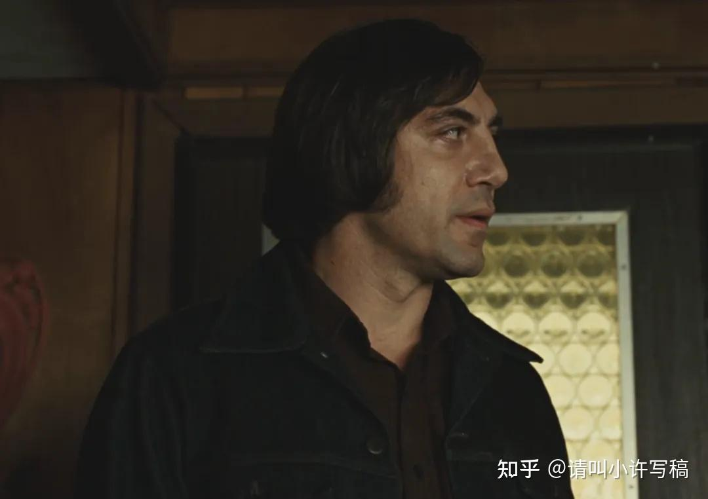</figure>
安东已有了杀心，但卫生间里传来动静，此地还有第二个人

同样的要求再三提起，这个时候的安东已经有了杀心，因为管理员的行为让他感到了麻烦——就像是安东在影片中杀的那个路人司机一样，可能是担心他事后报警给自己造成麻烦，也可能是说服对方把车交给他这件事本身就很麻烦。

安东没有选择动手，他听到了房间里的动静，显然这里还存在其他人。如此，杀了眼前的这个人，就还需要杀另一个未知的人，杀人反倒成了一件麻烦事。所以他这一次什么都没做，退了出去。

安东可以因对方造成的不便而杀人，也同样可以因感到不方便而放过一个人。

在影片在1小时19分钟，警长在和莫斯妻子对话时，特意给她介绍了现在屠夫宰杀一头牛的方法，用的是气罐和空气枪，这不正好对应上了安东的杀人方式？

安东就是那类屠夫，杀与不杀，怎么杀，都只是顺应心情，为了方便。

很多觉得人安东是一个有自己原则的人，但实际上安东的动机很随机，这一点也完美符合了影片开头老警长独白里所描述的那种人：<b>他们杀人并非利益，不是冲突，甚至不是激情，没有理由，随心所欲。</b>
<figure data-size="normal">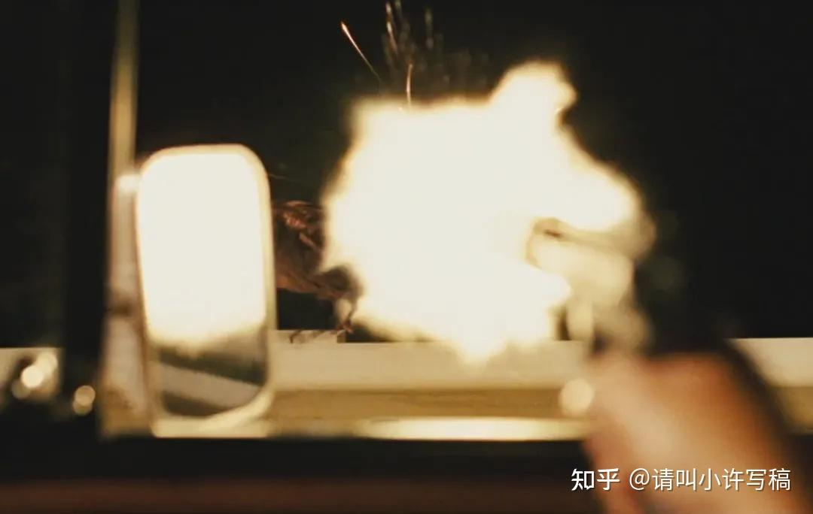</figure>
影片第41分钟的时候，安东撞见了桥上的乌鸦，他抬手射击，但没有击中。安东并不气馁，淡定地驾车从桥上驶过。

这个细节并不是随意设置的，而是能帮助我们更理解这个角色。

乌鸦死不死，安东毫不关心，他只是单纯地做出杀戮的动作，杀一只乌鸦是如此，屠夫宰杀牛畜也是如此，他杀死人类更是如此，顺手罢了，不一定需要多么充分的理由。

安东的杀人规律可以如此总结：<b>如果有必要，他一定要杀；如果杀一个人麻烦，也可以放过；若是介于二者之间，他也视心情给对方一个抛硬币的机会，让当事人的运气来决定一切。</b>

所以安东的杀人动机，本就是薛定谔的猫。

警长曾这样评价过这个素未谋面的对手：你对他们一无所知，你无法预判他的行动，所以很难采取措施。

他所说的人，正是安东，<b>他没有道德，没有原则，没有逻辑，也没有弱点，根本无迹可循</b>，这样的人最为可怕。

除此之外，安东的谨慎和素质也不比莫斯差。

影片的第46分钟，安东靠追踪器第一次找到了汽车旅馆里的莫斯。

安东没有直接闯入莫斯的房间，而是找老板要了旅馆的平面图。
<figure data-size="normal">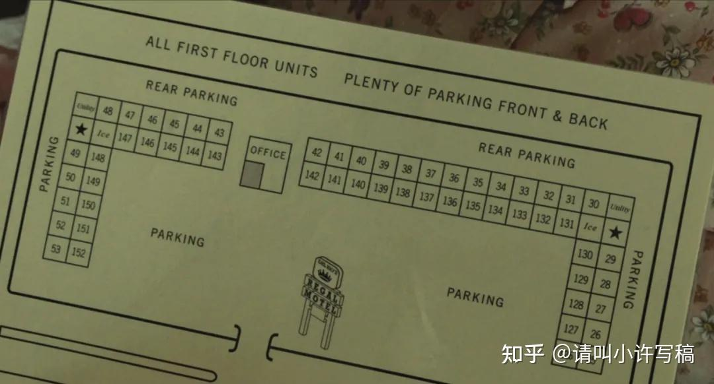</figure>
<b>安东选择的130房间很有考究，它既离莫斯定下的138号房间有一定距离，同时又与之形成角度，这样不用出门也能观察138房的人员出入情况，便于他下一步的行动。</b>

在进入房间前，他开灯观察了一遍房间，关灯关上门退出，再用力把门撞开。这是为接下来的行动做模拟测试，务必要对房间的布局进行了细致的观察。

演练结束，安东脱下鞋子，带上他的氧气罐，稳步走向138号房。

脱鞋是为了消除走路声，同时也是安东个人习惯：他很讨厌鞋底沾上血迹。
<figure data-size="normal">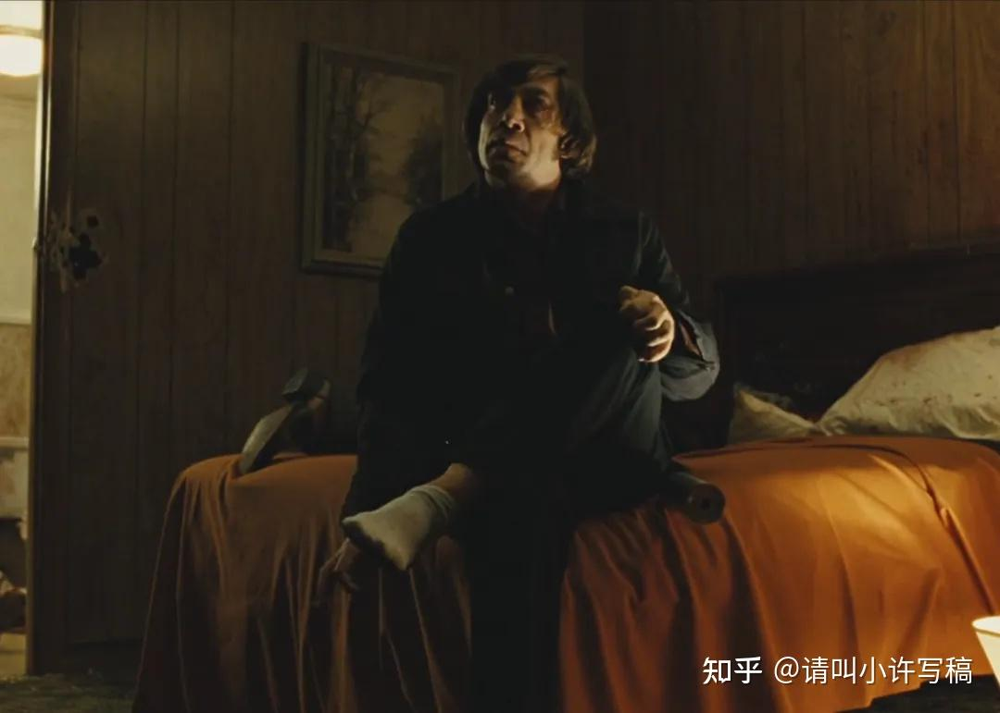</figure>
安东解决完墨西哥毒贩后，第一件是脱掉袜子

当他杀死意外闯入138号的三个墨西哥人后，第一时间脱下了袜子，而后才是寻找钱。

而那个时候，莫斯早已带着钱转移了。但没有关系，他有跟踪器，可以第二次找到莫斯。

安东和莫斯两个人的实力都很强，但真要拼个你死我活，莫斯不是安东的对手。

因为莫斯有身而为人的底线，他有良心，有家庭，有弱点。

第二次的相遇，安东吃了亏，是因为他低估了这次的对手，他没有事先了解莫斯退役老兵的背景。所以中了莫斯的障眼法，身上挨了一枪，差点被反杀。
<figure data-size="normal">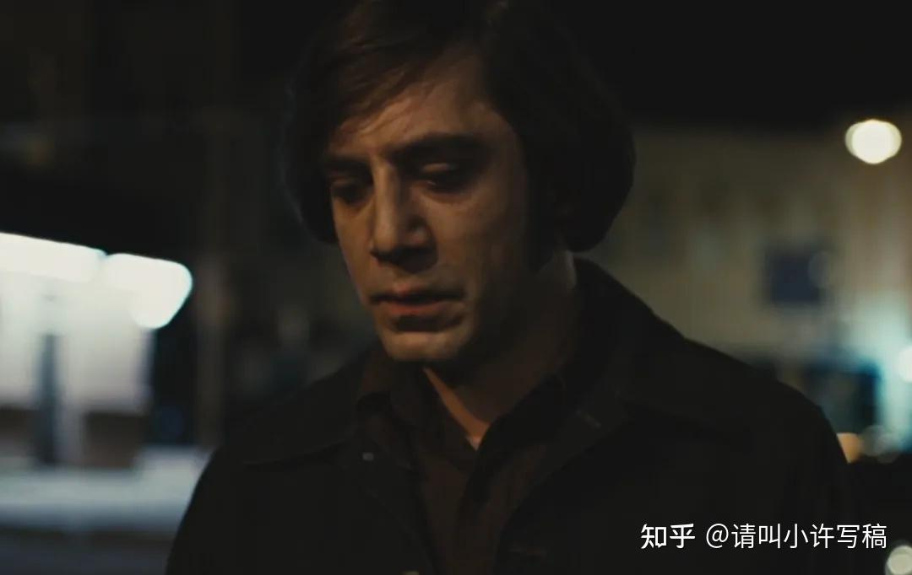</figure>
有了这一次的失误，安东的处理方式娴熟了很多。

他跟随莫斯去了墨西哥，在这里遭遇了另一个被雇主请来的五星杀手卡尔森。

他这件事理解成了雇主的背叛，所以在解决了卡尔森后，他回到雇主的办公室，当着会计的面，杀死了雇主。

安东向会计简单说明了自己杀雇主的原因，但会计无心倾听，他关心的事情只有一个。

他直接而胆怯地问安东：先生，您会杀了我吗？

安东没有直接回答，而是转过头笑着问他：你见过我吗？

我看到有影评人还在分析会计会怎么回应，以及会计的回应方式是否符合安东的原则，但我可以直接给出一个明确的答案：会计一定会死。

因为<b>他事实上目睹了整个过程，如果不解决他，就大概率会带来不必要的麻烦。</b>
<figure data-size="normal">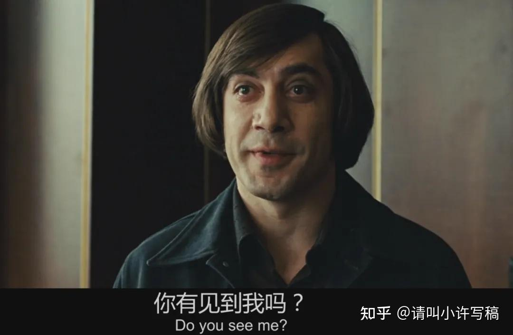</figure>
这和我前面说过的他杀路人车主的逻辑，是一样的，所以他连抛硬币的机会都不会给。

这一次对于莫斯，他冒险都不愿意了，要求对方把钱乖乖送到他的脚下，就像上帝要求他的仆从那样。作为施舍，他可以考虑放过他的老婆—没错，莫斯一定要死，只因为他造就的这些麻烦。

任务对安东来说已不再重要，他的首要目的成了一场狩猎的游戏。

<b>安东没有对某样东西的执念，很多决策也只是临时兴起，别人读不懂他，就连他自己也没法真正了解自己，所以他的行为不可预判。</b>

恰恰也正因如此，他的雇主感受到安东不受控制，所以才另外聘请了卡尔森。

而这个举动，让雇主遭遇了安东的报复，被安东找上门，枪杀在办公室。谁也别想真正掌控安东，否则就要死于非命，哪怕是他自己。

这一次，是选择牺牲自己保全家人，还是孤注一掷，帮妻子也绑上战车，安东把选择权交给了莫斯。

这就像猜硬币那样，只是这一次彩头不再是硬币，而是莫斯的妻子。

再回忆一下影片中安东杀的那几个人，基本都有明确的目的。

第一个路人司机，是为了换掉警车；
<figure data-size="normal">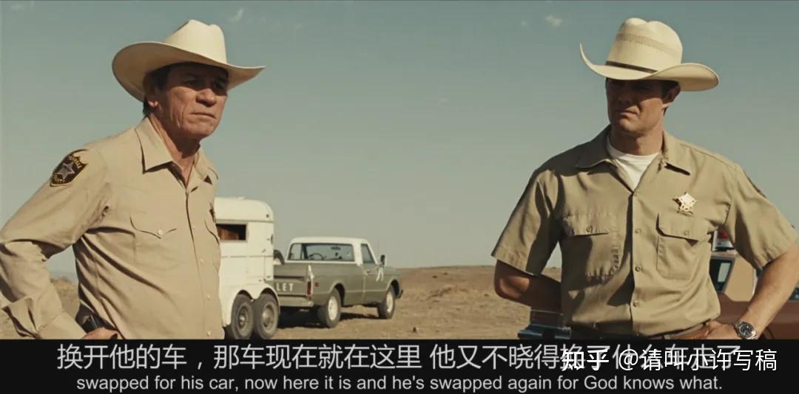</figure>
路人车主的车已被烧掉，警长好奇凶手又换了怎样车，另一辆车的车主又是否安好？

第二次现场的两位同伙，安东知道路人车主的尸体用不了多久会被发现，那么他名下车辆也被标记，所以他看上了同伙的车，因为这辆车大概率是不会有任何记录，不会被追查。

第三次是他的车抛锚，他静静地在路边等待，直到等来一辆运家禽的皮卡。

皮卡司机乐善好施地要帮他修车，并向安东搭话。但安东并不领情，他只关心最近的机场在何处，因为莫斯大概率会安排卡拉在此登机；当得到确切的答案后，司机也就失去了价值，但他的车还有作用，所以和第一次杀死路人司机时一样，安东没有耐心等司机把车修好，再次上演了杀人夺车的戏码。
<figure data-size="normal">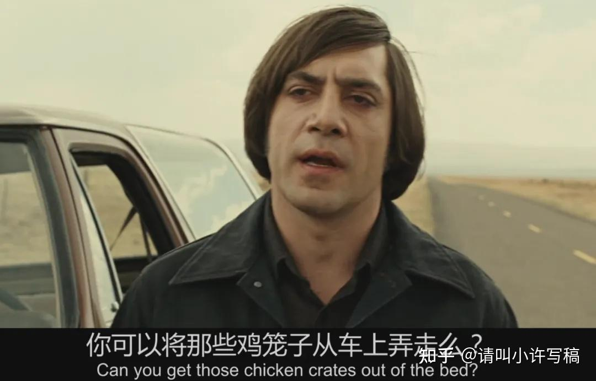</figure>
当得到自己想要的信息后，安东不多说一句废话，直接杀人抢车

<b>以上三个场景，安东之所以痛下杀手，原因都是他要换车，对方的存在会让他感到不方便，所以连猜硬币的机会也不会给。</b>

让受害者猜硬币并非安东的原则，只是消遣而已，如果猜中了，当事人的存活也不过是作为愉悦安东后所得到的施舍。

影片安东和另外两位角色的对话，能帮助你更立体地理解这个角色。

他们分别是卡尔森和卡拉。

面对安东的威胁，本属于不同身份背景、经历也千差万别的两人，却说了很多在安东看来几乎完全重合的话。

<b>你不需要这样做/你没理由伤害我/你没必要这样做</b>

<b>你知道你又多疯狂吗？/你一定是疯了</b>

所以安东才摇头回复卡拉说：人们都是这样说。
<figure data-size="normal">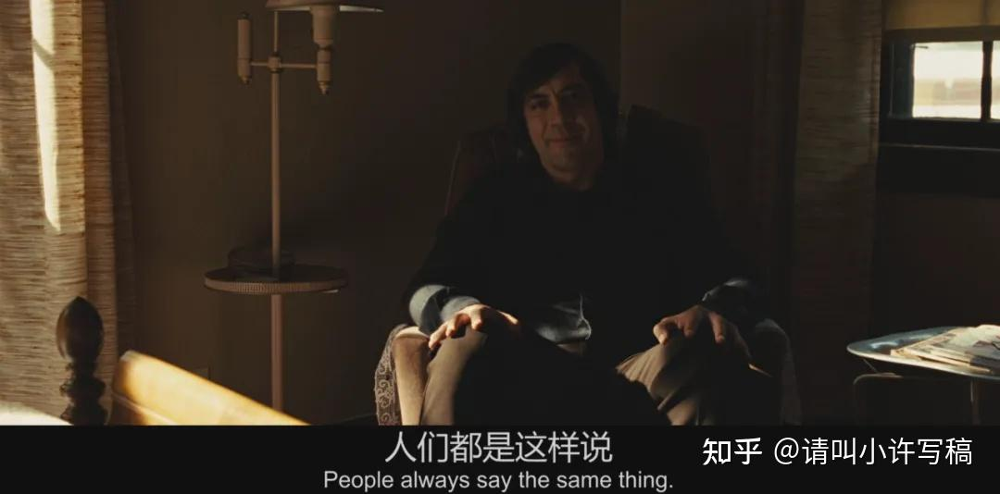</figure><figure data-size="normal">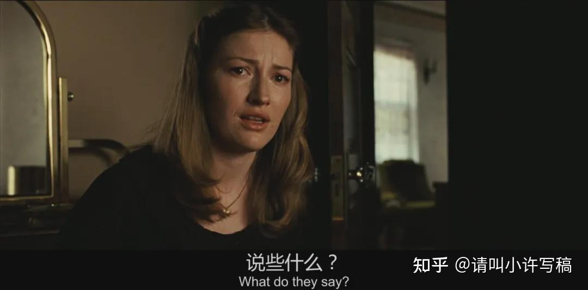</figure><figure data-size="normal">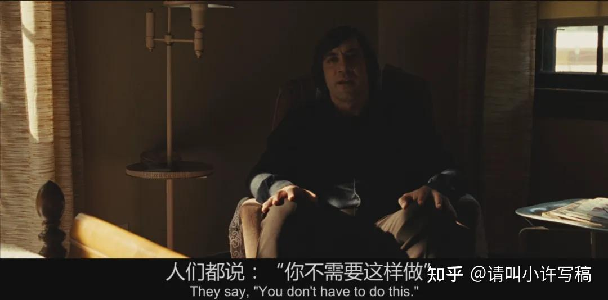</figure><figure data-size="normal"></figure>
卡拉后面只是重复着说：你不必这样。

除此以外，她确实也不知道该说什么了。

在安东的视角里，人们都是一样的，在死亡前面，都会说一样的话，显露出一样的恐惧，一样的无助，因而在枪口之下，众生平等。

<b>就像摆在砧板上的鱼肉那样，没有特点，没有个性，没有意义，对他们的求饶与挣扎，屠夫始终无动于衷。</b>

卡拉向安东诉苦自己没有拿到任何钱，身上所剩无几，还欠了很多账单，今天母亲的葬礼也是借钱完成的，她希望能得到安东的同情。

安东并不关心这些，而是要求卡拉参与他的生死游戏：猜硬币，猜中就活，猜错就死。

不要误会，安东并非于心不忍，而是在进行纯粹的消遣。

<b>安东确实没有杀卡拉的理由，但也没有不杀的理由。</b>

卡拉却玩起了小聪明，他说决定她生死的，并不是硬币，也不是上帝，而是抛硬币的人，所以她是不会去猜的。

卡拉的说辞确实有道理，但她选错了听众。

卡拉的喋喋不休非但没说服安东，反而让他心烦意乱，表情也变得阴沉可怖。

机会只有一次，既然不珍惜，那也等同于放弃。

出来的时候，安东还特意看了看鞋底，这个动作在他杀死卡尔森的时候如出一辙，都是为了确保鞋子没有沾上血迹，以此，暗示了卡拉的死去。
<figure data-size="normal">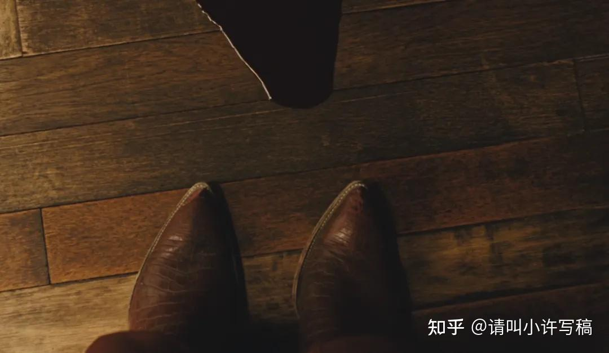</figure><figure data-size="normal">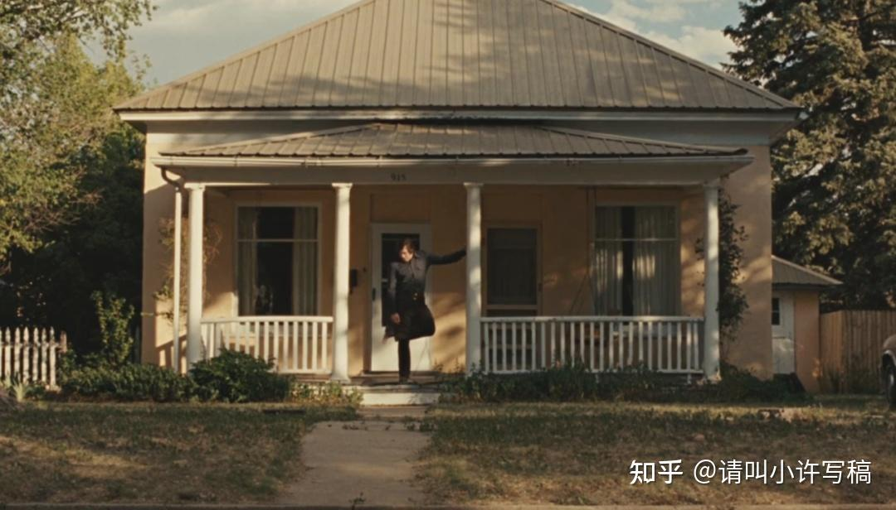</figure>
没有刻意的旁白，全是细致的镜头语言。

在电影里，安东的设定几乎无敌，但它也无法跳脱“世事无常”的规则。

在命运的纺织机里，他依旧是能被摆布的个体。

他驾车驶过绿灯的十字路口，被一辆闯红灯的轿车狠狠地撞击。

安东从车里出来蹒跚到路边，检查伤口，发现手臂的骨头断裂，露出肌肤。

两位骑车的少年，停在了安东的身前。
<figure data-size="normal">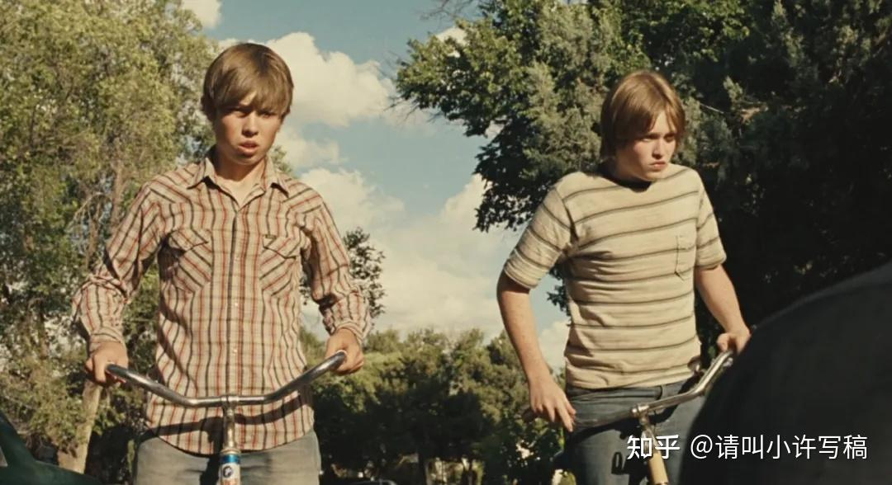</figure>
同样是受伤，同样是需要衣服，同样是对伤者的关切问候，这里安东的处境，和莫斯在桥上的桥段正好形成映照。

但二者又有不一样的地方。

还记得莫斯开场的第一句话吗？他提出要花500美金买外套，这导致青年们格外关注金钱，要求一定要先拿到钱，才会给外套，哪怕是喝剩的啤酒，也希望莫斯能拿出更高的溢价来购买。

安东一开始没有提出花高价交易，而是问少年买他的衬衫要多少钱。

诱惑并未直接给出，少年没有对更大利益的博弈，只是想热心地提供帮助，他说不要钱，果断把衬衫脱下递给了安东。

少年本是如此的单纯，<b>直到安东硬塞给他们100美元，条件是他们要替他做假证，向警方表示没有看到他。</b>

<b>于是，少年的善良不见了，两人为100美元的归属陷入了争执，此刻开始，他们也被金钱所腐蚀。</b>
<figure data-size="normal">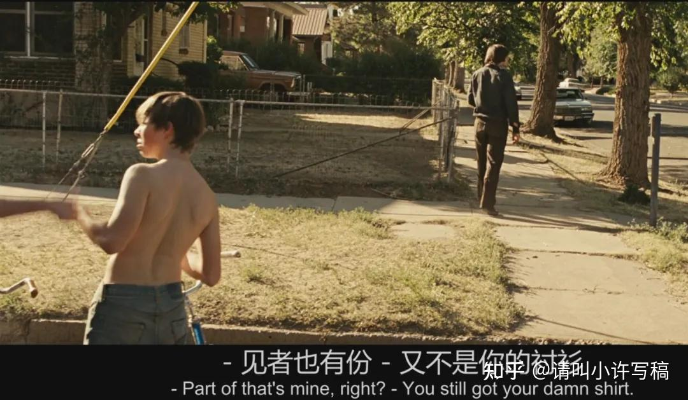</figure>
是否可以理解，遇到安东前的那两个少年，<b>属于老警长认知里的公民，也是属于过去他所熟悉的人们。</b>

而<b>拿到安东100美元之后，他们变成了另一类人，也是老警长感到陌生的“不可理解”的那类人。</b>

<b>而这一类人，如今已成了大多数。</b>

莫斯所遇见的三位青年，是从一开始就陷入了金钱的欲望里，所以他们变得贪婪、危险。

帮助安东的两位少年，还被善良阻挡了一会儿，但<b>最终还是慢慢地被这个社会所同化，尽管时间和过程不尽相同，但结果却千篇一律。</b>

<b>终究，大势不可阻挡。</b>

再来说说车祸这件事本身。

一个没有原则的人，这一次好不容易遵守交通规范，却被另一个不守规则的人害惨。

据说在原著里，肇事司机是瘾君子，撞车的时候他刚好嗑嗨了。

这个桥段的设置，其实也是从侧面去完善《老无所依》的主题：

当别人都有底线和原则的时候，你没有，那么本质上就是在作弊，就像是一场公平的搏击，大家都赤手空拳，而你却端着AK47，所以最后你赢了。

但<b>当你这种作弊的人多了，那么你也一定会被另一个作弊的人所害。你无法预测，无法阻止，它来去飘忽不定，你无法预测它在何时以何种方式发生。</b>

就像安东嘲讽卡尔森的古板，可如果卡尔森也丢掉了守则，那么他们的输赢将变成未知。

当你跳出局部的比拼，以一种高维的角度去看，会发现最后的结果是“全输”，因为<b>搏击场上，人人都开始持枪互扫，最终才有了世风日下。</b>

这，大概便是导演另一个隐晦的表达。

 

<b>极致的绝望：大势不可阻挡</b>

在讲老警长故事之前，我们来听一下他在电影开头的独白。

<b>我25岁那年，是这个郡的警长，难以置信。</b>

<b>我的祖父是个警察，父亲也是，我跟父亲同时当警长，他当时在布兰诺，而我在这里。</b>

<b>我想他一定以此为傲。我知道我是的，老一辈的警长们通常连手枪也不带，有很多人觉得难以置信，吉姆就从来没带过枪，卡曼契郡的伯金斯也不带枪。</b>

<b>现在我总喜欢听关于这些老前辈的事情，从不想错过一个，因此很难不把自己跟老前辈们做比较，也不禁好奇，他们那时是怎么做到的。</b>

<b>有一个男孩是我不久前，在亨斯维尔这里送他上电椅的。</b>
<figure data-size="normal">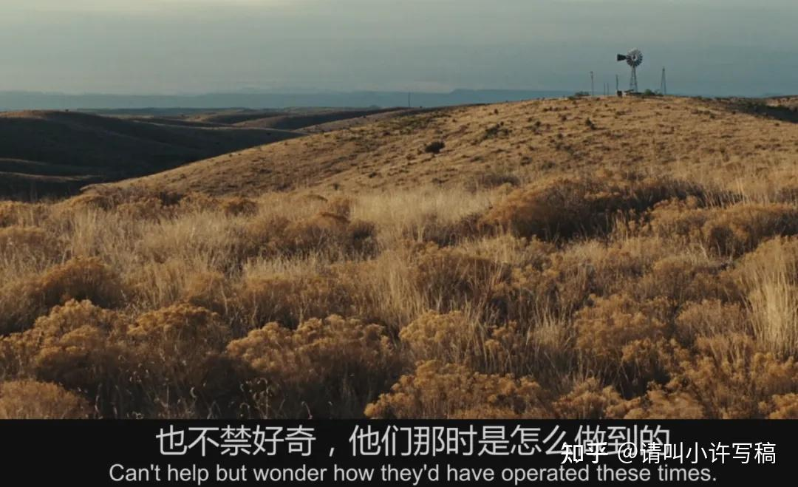</figure>
<b>我亲自逮捕、讯问他。他杀了一个14岁的女孩，报纸上写那是件激情犯罪，但是他告诉我说，根本没有半点激情。</b>

<b>他告诉我说他的杀人行为，都是经过长时间缜密计划的，他还说要是放他出来，他还是会去杀人，他也说他知道，他将会下地狱。</b>

<b>大概在那里待上十五分钟，我不明白是什么导致这样，真的不懂，你现在看到的犯罪，也很难去采取什么措施，不是我害怕，我原本就知道，做这行本来就要有心理准备，但我不想探出头去，走出去，面对我不了解的东西。</b>

<b>有时候，男人必须暴露在风险中，他只需要说：好的，我要成为这世上的一部分。</b>

请记住这段独白，关于警长的篇章，很多地方会跟这段独白对应上来。

在《老无所依》中，他便是“老无所依”这一主题的践行者。

警长是一位怎样的警察呢？我们看看这个角色的出场表现：

他牵着一匹马，从马厩里走出。
<figure data-size="normal">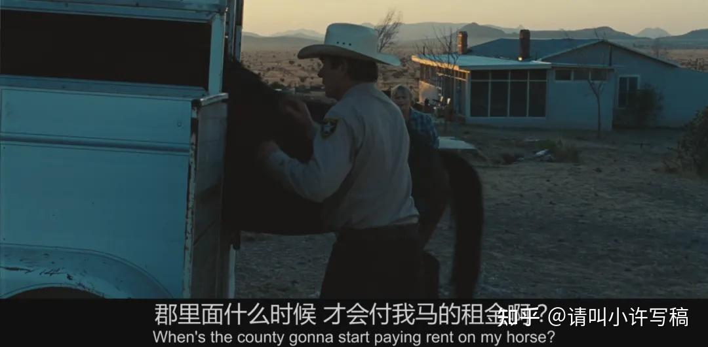</figure><figure data-size="normal">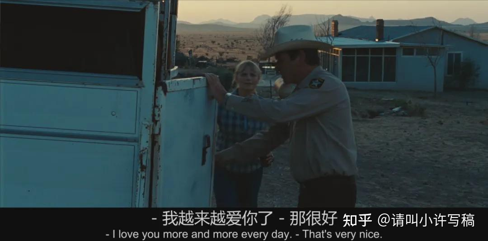</figure>
妻子走过来关心和打趣：郡里面什么时候，才会付我马的租金啊？

看得出来，马属于他们夫妻俩的私有财产，警长却经常“私车公用”。

警长对妻子很有幽默：<b>我越来越爱你了</b>。

这一天，他他收到警员的通知，要去某个地方办案。

荒原上有一辆被烧毁的车，它是被安东杀死的路人司机的。

安东正是用它换走了警车，而这辆车现在却出这里，说明安东又换了一辆新的车。

于此，交代了安东杀死那两位同伙的原因：是为了换走他们现成的车，因为路人车主一死，他的车必然会被追踪，继续使用的话会给安东带来麻烦。

既然要用这辆新的车，那么安东索性采取了最省事的办法：杀人夺车。他终归还是为了方便。
<figure data-size="normal">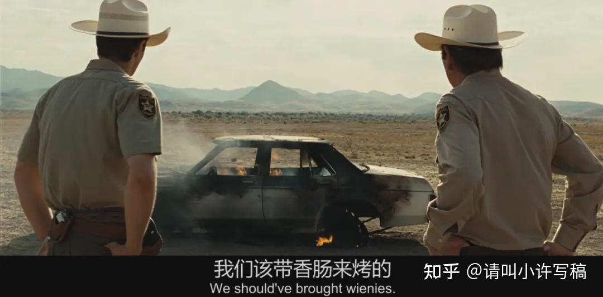</figure>
年轻的警员心气浮躁，看着仍在燃烧的车辆残骸，不合时宜地开起了玩笑：我们该带香肠来烤的。
<figure data-size="normal">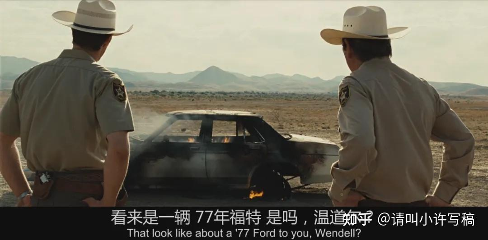</figure>
本应幽默的警长却没有接他的话，<b>不同于年轻警员如看戏一般的轻浮，警长注视着车骸的目光始终沉重</b>，他把话题拉回了案件本身：这是77年的福特吗？

<b>一老一少的两个搭档，在同一事件上，态度刚好形成了强烈的反差，其实从这一幕起，警长就已经被挡在在了年轻的主流之外了。</b>

<b>我已经能感受到“老无所依”这一主题所渲染的荒诞感了</b>，只是这种它并不明显，它习惯于在观众的不经意间，默默地把伏笔藏在细微的镜头里。

警长驾车运来自己的两匹马，不是因为古派，也不是为了耍酷，而是他要带着年轻的警员去现场更深处调查，骑马的目的是避免新产生的车轮影响现场原有的车迹。

更深处，两人发现了另一车辆被遗弃的车，警长认出了那是莫斯的。
<figure data-size="normal">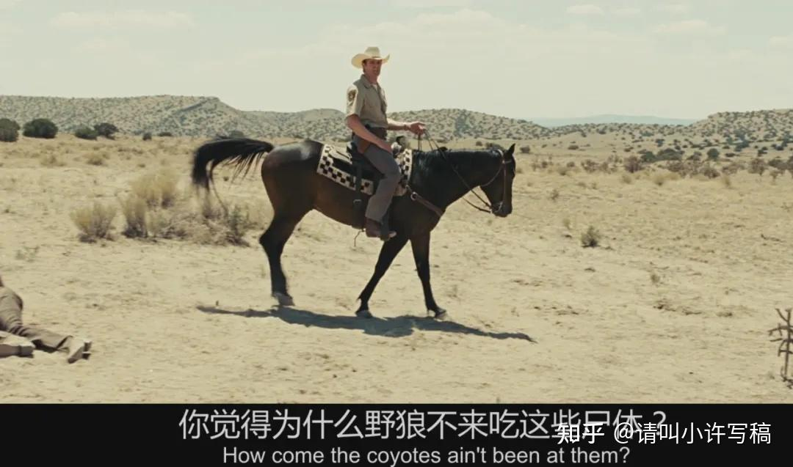</figure>
现场还有狗的尸体，他的警员问：为什么野狼不来吃这些尸体？

警长并不了解这里，自说自话地回答：也许是它们不吃墨西哥人。

而<b>对于这个问题，莫斯前面的回答则更加准确：这里没有野狼。</b>
<figure data-size="normal">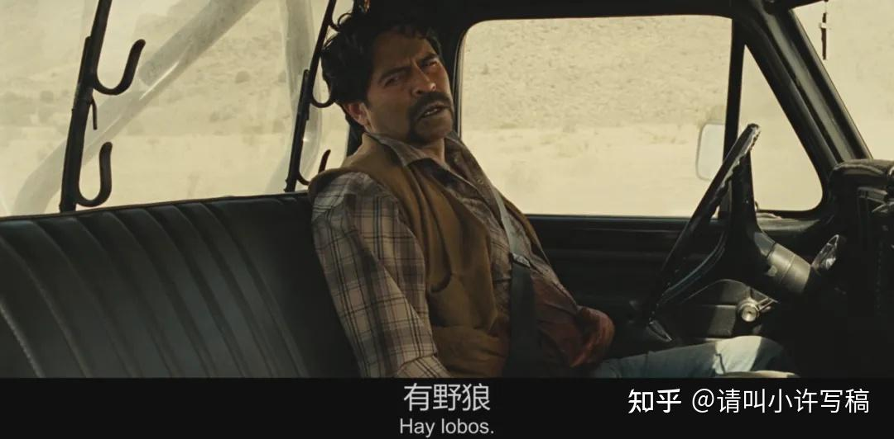</figure><figure data-size="normal">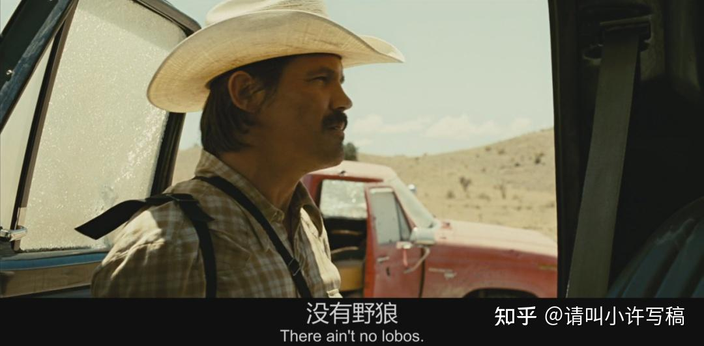</figure>
<b>所以，莫斯的死里逃生，并不是创作者的神来之笔，而是来自于逻辑的写实。</b>

根据现场遗留的车主的线索，警长两人去了莫斯的家。

敲门等待间，警长注意到了门锁失去了锁芯，于是两人推门而入。

桌上有被喝到一半的牛奶，仍在滴着水滴，说明他们正好错过了那位不速之客。

警长坐在了沙发，就在安东刚刚坐下的位置，饮下安东未喝完的饮料。

眼前是墨色的电视，身后是狭小的玻璃窗，阳光刚好照射进来，在电视剧上映出了警长的镜像。

<b>他似乎仿佛被困在了窄小的光亮里，四周是无尽的黑暗。</b>

警长说：他当时看到的画面跟我看到的一样，这给了我一个想法。

是什么想法呢？

电影没有接着讲下来，导演不喜欢刻意地说明，但我们刻意通过镜头的语言去感知。

上一刻安东坐在沙发上，看到的画面确实和警长无异，一样地喝着牛奶，一样地注视着电视里的自己。
<figure data-size="normal">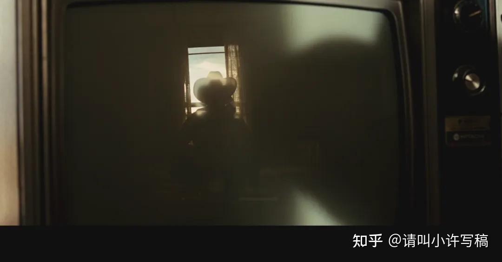</figure><figure data-size="normal">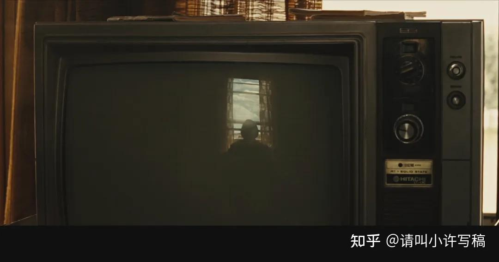</figure>
安东和警长在电视里映出的影像，完全一致，形成奇特的对应

一切仿佛都是一样，但实际上有一个东西是不一样的：时间。

这个时空错位，在警长的故事篇章，还会再出现一次。

为何设置这样的镜头？我会在后面进行说明。

路人司机的验尸报告出来了，奇怪的是，这个男子虽然被证实是枪杀，但在他的身体里面，却并没有找到子弹。

警长难以置信：难道是凶手用刀把尸体里面的子弹又取出来了？

一时想不出答案，但警长把这事记在了心里。

一段时间后，负责资料的女警员传递了新的信息：找到了车辆的主人，他们都登记在了死人的名下。

警长知道这样查下去不会有结果，兴味索然。

他让女警员打电话给他的妻子，说他要去奥德萨市找卡拉。

他特意强调要等他一定去了奥德萨市后再打，否则妻子会让他回家。

他甚至都不愿撒谎，他本可以说现在就已经到了奥德萨市，哪怕是这种工作需要的必要的谎言。
<figure data-size="normal">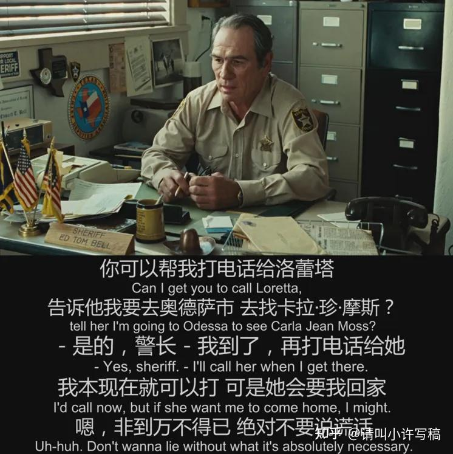</figure><figure data-size="normal">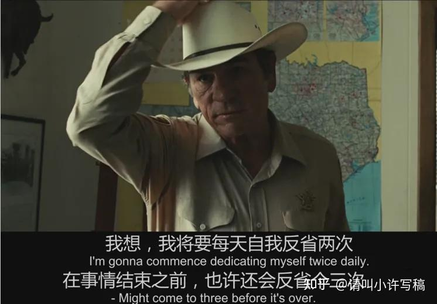</figure>
请记住警长的这些台词，它对于你理解警长角色，以及整部电影有很大的作用

他说：我每天都要反省两次，如果有没能解决的事，那么要反省三次。

他戴上帽子正准备出发，看到了从警局外驶过的小皮卡。
<figure data-size="normal">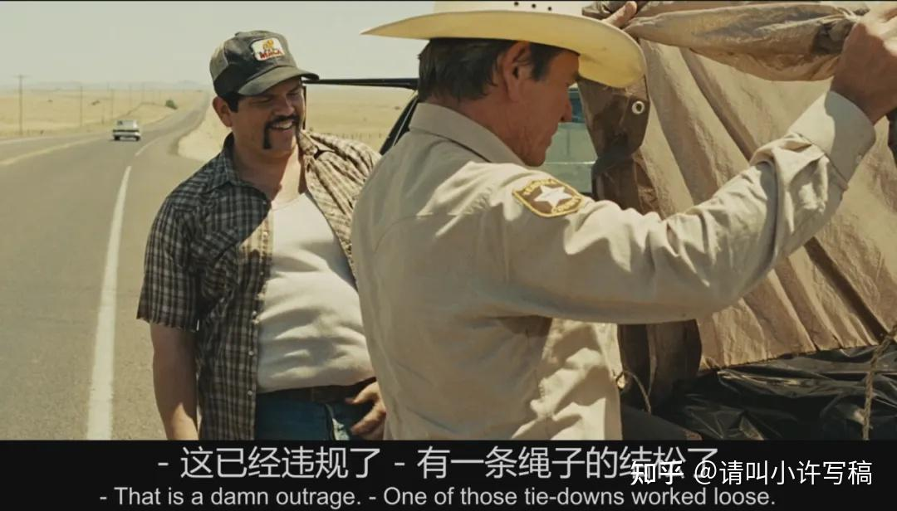</figure>
他驾车追出镇外，把皮卡逼停，理由仅仅只是捆绑牲口尸体的绳子松了，容易造成交通隐患。

他是一个很注意细节的警长。

在奥德萨市，警长见到了卡拉，他希望能得到莫斯的行踪，告知莫斯此时正面临着大麻烦

卡拉却对丈夫的自信却大于警长，觉得莫斯能摆平这一切。

这时，警长跟卡拉介绍起了一个人。

这人是个屠夫。他屠宰牛只的方式很独特，先用大木槌敲晕，绑起来后，再切断喉咙，任由它挣扎，直到力气耗尽。

屠夫用子弹结束牛的生命，但没有打中，反弹的子弹却击中了他的肩膀，直到现在，屠夫仍然无法右手举起帽子。

警长解释自己说的这个故事，是想让卡拉明白，即便是看起来必胜的局，都可能因为失误一溃千里，是劝告卡拉对莫斯的事情最好谨慎一点。
<figure data-size="normal">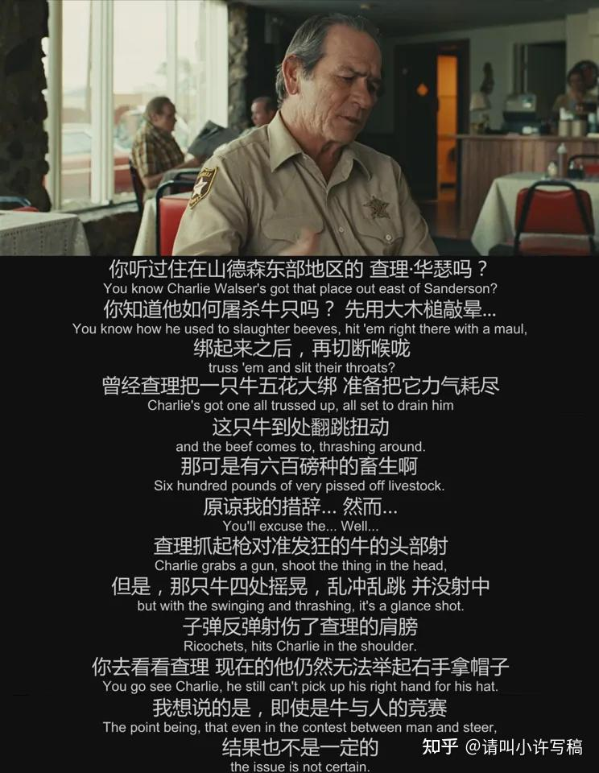</figure>
但这真是警长想要传达的吗？诸位请仔细观察人物的神态，请多思考一下。

警长讲着讲着意识到这个故事的比喻和结论都很牵强，中止了讲述，把名片递给卡拉，嘱咐如果有莫斯的消息了，请一定通知他。
<figure data-size="normal">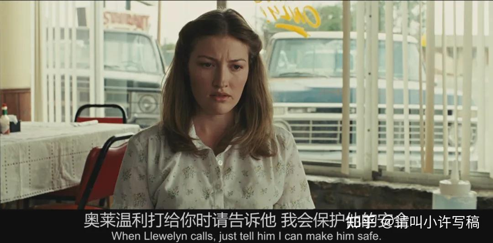</figure>
可是，以上这段意味不明的话真的是警长想要说的吗？

但显然，关于屠宰的故事，警长还没讲完。

他意犹未尽、突兀地补充了一句：当然，现在屠宰牛的方法不同了，使用空气枪，射出一块小石子，只能脑部这么深，然后吸出来，畜生永远不知道被什么射中。
<figure data-size="normal">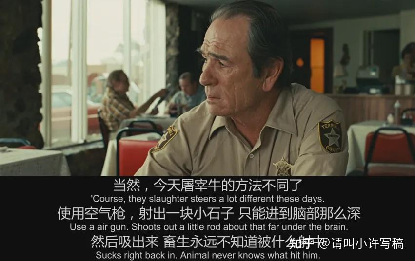</figure>
卡拉对警长的发言感到困惑，他问警长为什么要跟自己说这些。
<figure data-size="normal">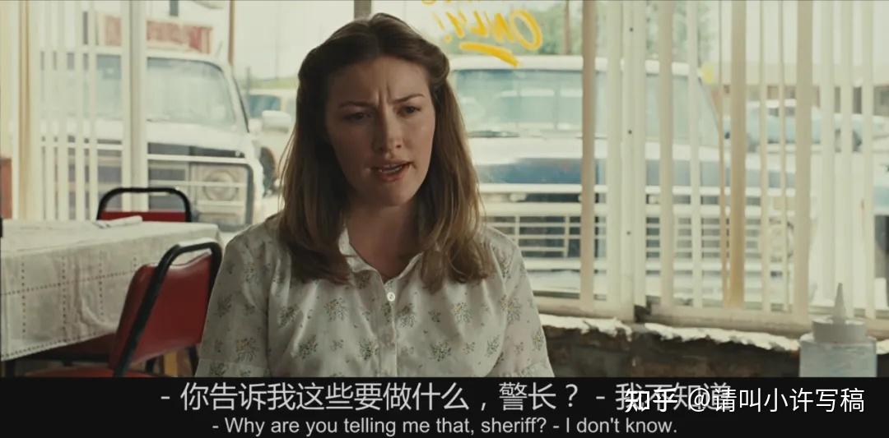</figure>
是啊，为什么要说这些？

很多人和所谓的影评人都没看懂这一桥段，现在我告诉你一个很震撼但我很肯定的答案：<b>警长后面讲到空气枪的那半段话，才是警长真正想表达的。</b>

还记得前面警长和他的下属讨论凶手杀人的方式吗？

现在他找到了答案：<b>凶手的杀人手法和现在屠夫屠宰牛羊的方式很相似，意味着杀手根本没有把受害者当作自己的同类，而是可随意屠宰的牲口。</b>

屠夫如何对待他的牲口，杀手就是如何对待他的猎物。

而如今，莫斯成了这个这个杀手的猎物。

<b>他想表达的，其实是杀手的冷酷至极，以及莫斯正身在如何可怕的处境里。</b>

<b>在屠夫和牲畜的比喻里，杀手才是那个屠夫，莫斯只是待宰的牲口。</b>

<b>二者对应的身份更好是相反。</b>

<b>但警长突然意识到一位单纯的女士，哪里会能承受这些，他害怕会惊吓到卡拉，所以才临时又改变了说辞，把莫斯和杀手的身份互换，改成了屠夫被他的牲畜反杀的故事，提醒她永远不要自高自满。</b>

他甚至为自己使用了“牲口”这个字眼而道歉，这个细节也验证了警长的绅士风度。

而后续卡拉通话问他这个屠夫故事是否真的时候，警长一时没反应过来，思索后才说这是一个故事，细节不敢保证，这个细节也证明了那个因牛而受伤的屠夫的故事，是他临时虚构的。

所以在这里，警长的表现会显得奇怪，他本人似乎也不知道自己在说什么，因此故事之外的观众，就更是对这一幕云里雾里了。

以上，正是警长奇怪台词和反应的唯一合理解读。

从奥德萨市回来后，在旅馆被安东杀死的那个三个墨西哥人，被警方发现。

但警长对三个死者漠不关心，认为他们不过是自然死亡，就他们的工作性质而言。

警长对毒贩并不关心，他们是社会安定的破坏者，警长关心的是事件何时能结束。

他问了旅馆的门锁，是否和莫斯家里被破坏的门锁痕迹是吻合的，显然他早已认定杀死杀死墨西哥的人、和杀死路人司机、以及追杀莫斯的，是同一个人，一个不能按常理分析，极致危险的人。
<figure data-size="normal">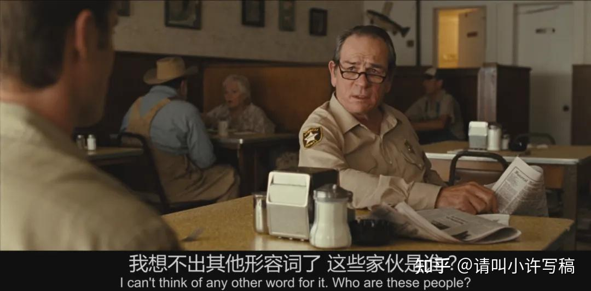</figure>
警长向警员分享了他手中报纸上刊登的两起事件：

在加州，有一对夫妇专门把房间租给老人，然后杀死他们，将他们埋在院子里，再将他们的社会福利金支票兑现。

并且他们在谋杀之前，一定要先折磨被害人，不知道动机何为，也许只是因为他们电视剧坏了，需要找人泄气。

当一个只套着套狗项圈的男人，从屋里跑出来时，邻居才发现了事情的异常。

如果没有这种匪夷所思的事，那个院子还不知道要埋上多少的白骨。
<figure data-size="normal">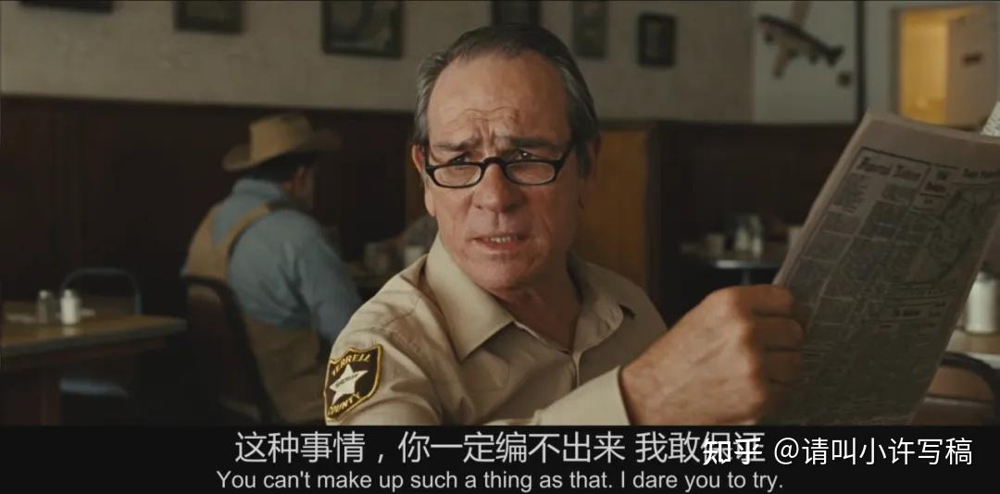</figure>
警长跟他的警员打赌：我敢肯定，这种事你一定编都编不出来。

<b>可是……警员却忍不住笑了出声，也不知道是因为事件的离谱，还是事件的不够离谱，警长在大惊小，又或者单纯只是好笑罢了。警员的脸上全程看不出一点惊异，虽然他很努力地想配合警长了，却依旧掩饰不了他的平淡和敷衍。</b>
<figure data-size="normal">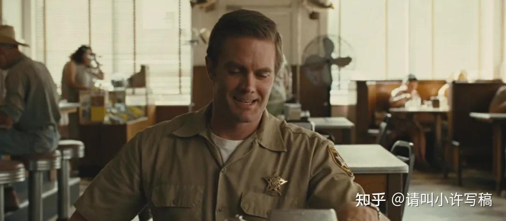</figure>
听完警长自认为难以解释的事件后，年轻的警员只是噗呲地笑了一声

是的，<b>面对一起怪异的事件，一位年纪近百的老警长陷入困惑，而一个不过二三十岁的小年轻却如此地从容自若。</b>

<b>难道是年轻警员的人生阅历，已经超过了这位即将退休的老前辈吗？</b>

细想下去，你会发现很有意思。

没能得到倾听者的认同，警长只好自问自答：没关系，有时候我也会一个人傻笑。

表面上是说给年轻的警员听的，实际上更多是说给自己听的，他也发现自己和这位后辈，很多时候根本就不在一个频道上。

他是否会这样认为：自己已经跟不上时代了？

<b>比起他，眼前的警员更能适应现在所发生的各自离奇事，因而更加波澜不惊。</b>

警长最后补充一句：<b>你能做的事情，其实不多。</b>

是的，因为能做的不多，所以他两度拒绝了去现场，但现在事情既然已经彻底走向无序，他至少希望能挽救莫斯。

莫斯和毒贩们不同，毒贩无论怎样死去都好，这是他们自己选择的结果，所以警长才说他们是自然死亡，就他们的职业而言；但莫斯是一位无辜的公民，只是一念之差卷了到了事件中。

卡拉感受到了警长的真诚，所以接到丈夫的电话后，第一时间打过来告诉警长，说愿意告知莫斯的位置，前提是必须只能是警长一个人去找莫斯，并保证他的安全。

警长做下了这个承诺，但他无法阻止一个应该死去的人死去，就如他后面和胖警官所说过的：<b>大势不可阻挡。</b>

警长赶到现场的时候，枪战刚好结束，一个墨西哥人正趴在地上苟延残喘，房间里的莫斯早已死去。
<figure data-size="normal">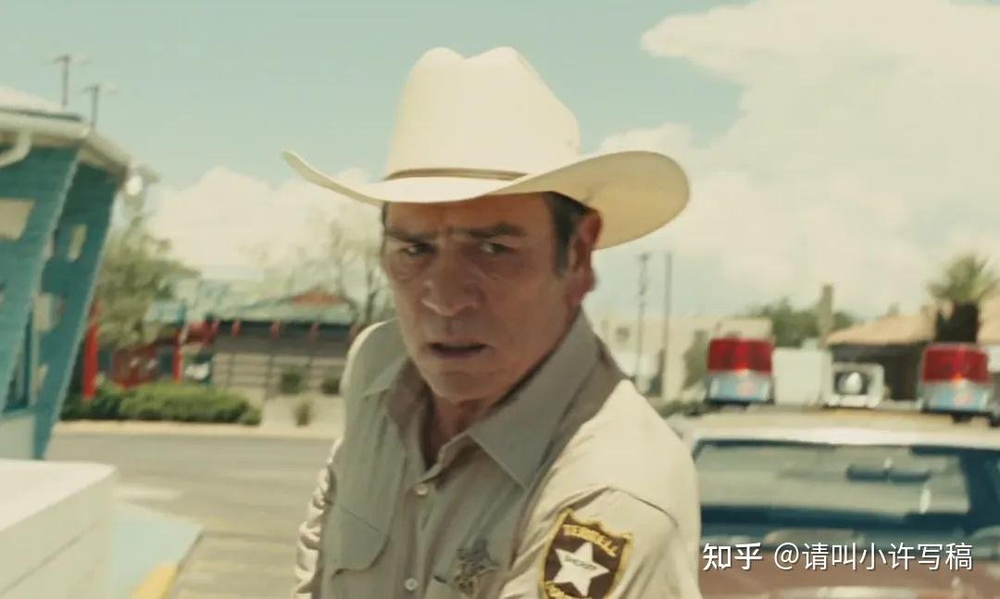</figure>
面对闻讯而来的卡拉，警长没有多言，只是默默地摘下帽子，用无声的方式向卡拉传达了这场噩耗，与他的同情。

警长向埃尔帕索的胖警长询问钱的下落。

胖警长也不为所知，他向警长诉苦，说这一切都因钱和毒品而起，现在所有的东西都变了，哪怕是在20年前，他也绝对不相信德州的城里，孩子们染着绿色的头发，穿着鼻环走来走去。

警长则说，世道就是从人们不再尊称“先生”和“女士”起开始变坏的，道德与风度被粗鲁和放纵取而代之，形成了一种陌生的新潮流。人人都沉浸其中，自娱自乐。

当讨论到安东时，胖警长说他是嗜杀的疯子，而警长的评价是：他像是一个鬼魂。
<figure data-size="normal">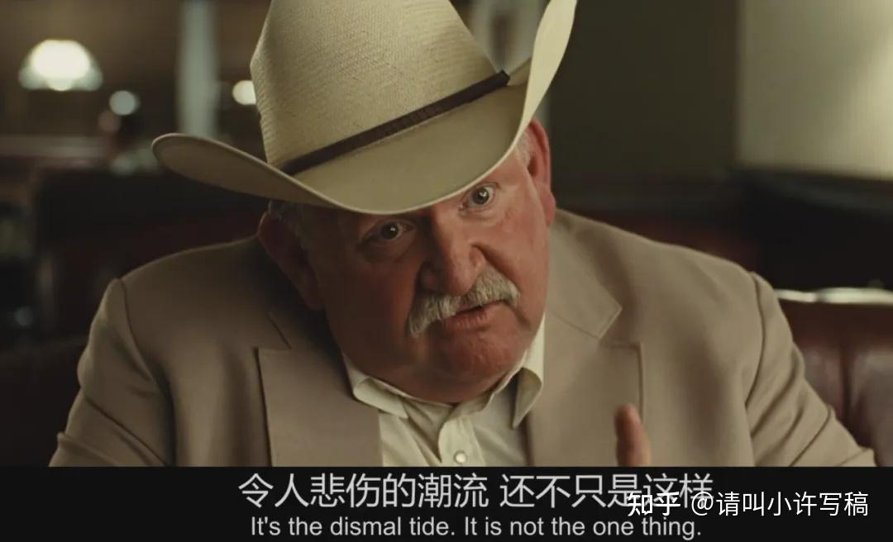</figure>
胖警长不确定地反问：他是真实的，对吧？

看似简单的对话，其实是对主题的进一步诠释。

不知道有多少人，注意到了旁警长后面的这句台词：在老鹰旅馆发生的事情，超乎想象。

老鹰旅馆，80年代，对新一代青年堕落的批判，各位是否有想到什么？

我想到了两个事物，其一是《老鹰乐队》，其二是《加州旅馆》，而老鹰旅馆这个名词，正是二者的拆分组合。

这肯定不是巧合，因为<b>电影是07年的作品，而电影里的背景年代，正好和《加州旅馆》的发行时间相差无几。</b>

<b>所以这部电影本身，就很有《加州旅馆》的韵味。</b>

这一点，我想在放在结尾再来解读，现在老警长的故事还未结束。

警长一人返回了枪战的现场，此时门口已经贴满了封条，他之所以过来，是听到胖警长说起过，安东可能会事后回到现场。

警长想到一件事，钱并没有被墨西哥人拿走，它还遗留在现场，静静地等待着安东来取走。

运气好的话，兴许能和他来个照面。

门口，警长特意观察门锁，那是一个空洞，和莫斯家的杰作一样，都出自安东——或许他正在里面。

而门的另一边镜边，安东在贴在墙角，静静地等待着警长进入。

警长闭上了眼睛，随后沉重地睁开。他很清楚到门后是一个怎样恐怖的存在，一旦推开这扇门，很可能万劫不复。

<b>身份的责任和求生的本能进行了短暂的斗争后，警长做出了决定，他拿出手枪，踏入黑暗的房间。</b>

房间内空无一人，紧锁的窗户，暗示着上位来客是从门口离开的。

原来刚刚出现的安东画面，只是警长脑海里的想象。

安东造成的压抑感实在过于强烈，所以警长才称呼他为“鬼魂”。
<figure data-size="normal">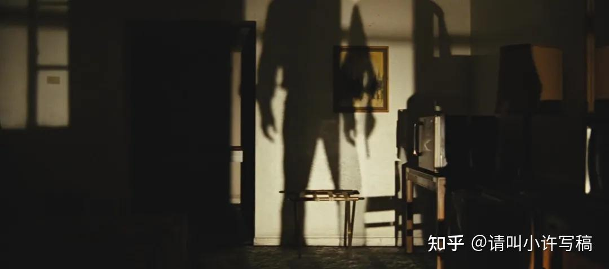</figure>
汽车的前灯透过敞开的房门，映出警长高大的身影，如同一个伟岸的巨人。

这一幕，和莫斯的家电视里映出的画像，却又何其相似。

警长是伟大的，但他却做不了任何事。

和在莫斯家时一样，警长还是错过了时机，他似乎注定追不上这个命中相克的凶手。

而在影片独特的镜头视角，他们都陷入在了某个世界里，彼此无法相遇、重叠。

警长留意到被打开的通风管道，地上是散落的螺丝和硬币，猜到了钱被莫斯在了里面，墨西哥人并没有带走它。
<figure data-size="normal">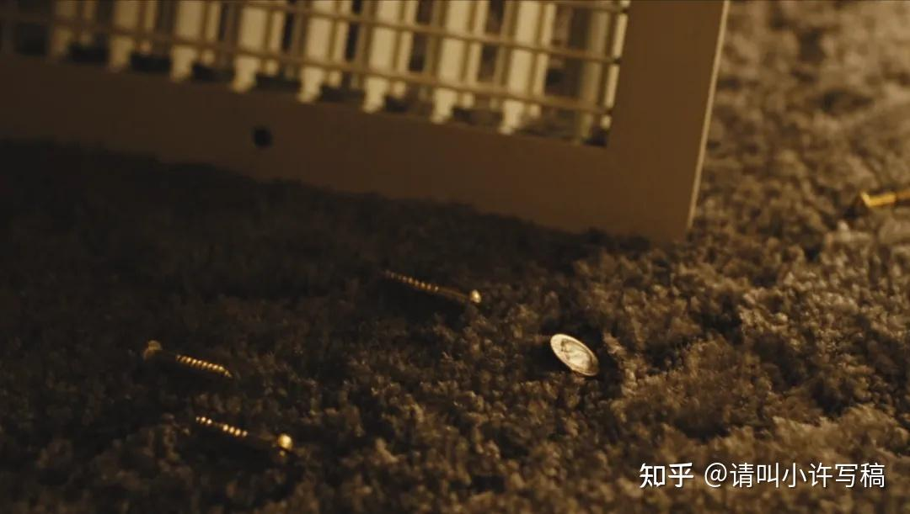</figure>
如今，它成了安东的战利品。

<b>恶人，赢得了最终的胜利。</b>

警长去见了退休的叔叔。

叔叔提到了警长打算离职的事，但警长不太想谈论这个话题。

泡完两个人的咖啡后，警长说起了另一个话题：那个枪杀你的死在牢里了，如果他没有死，活着出来了，你又该怎么办？

简短的台词，充分地展现了很多的信息。
<figure data-size="normal">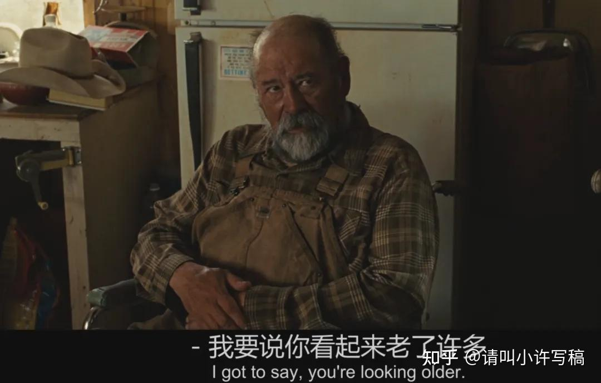</figure>
叔叔之前也是一位警察，他把重刑犯关进了监狱，但代价是永远地失去了双腿。

而失去的双腿，导致他也失去了这份工作。

<b>他是一位英勇的殉道者，为了责任牺牲了很多，可如今的他却独自一人住在荒芜破旧、布满灰尘的小屋，他的衣服满是污迹，显然长久没有洗和更换过，显然他的生活毫无保障，而房子周遭空无一人，只有周围的野猫与他做伴，显得如此凄惨、孤独。</b>

但叔叔依旧是幸运的，因为那个重犯死在了监狱，可如果他没有死呢？

叔叔只是淡定地说：我不知道，什么也不会做。

<b>他似乎已生无可恋，假如死亡将要来临，他只能默默等待，既然无法阻止，那就不必悲观，因为一切毫无意义。</b>

警长没有从莫斯的案件中走出来，他仍深陷自责和愧疚，为自己没能尽到职责而懊恼。

叔叔给警长讲了前辈麦克的故事。麦克遇到了一伙强盗，他被击中，倒在了门口，姑姑前去拿绷带，而强盗就坐在马上，静静地欣赏着麦克的死去。

叔叔述说麦克的故事，是为了告诉警长，他所遭遇的这些，并不是稀奇事，<b>这个国家对它的人们很苛刻</b>。他无法改变任何东西，没人会拜访他，一切都是空虚的，大势不可阻挡。
<figure data-size="normal">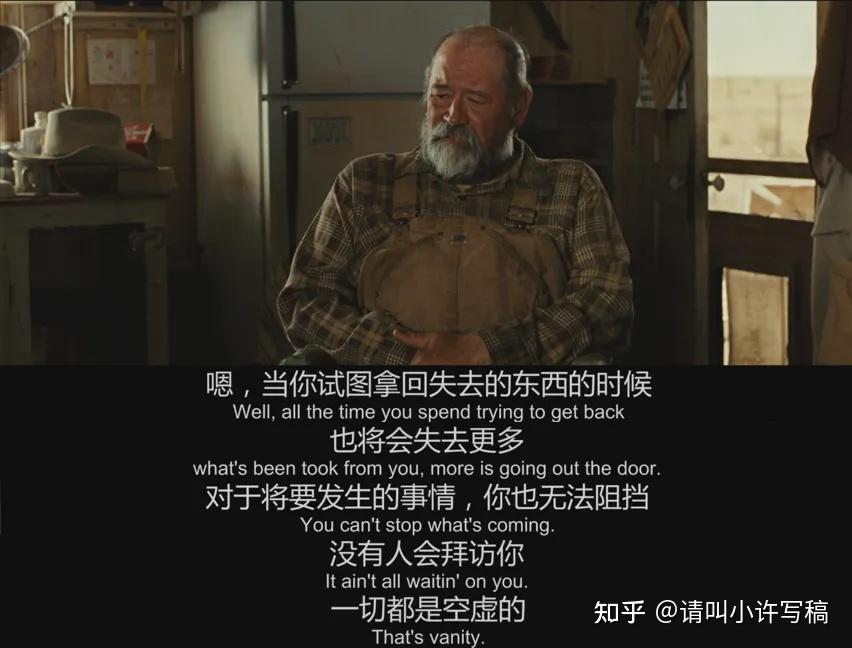</figure>
请注意这一句，它是本片的神来之笔：<b>大势不可阻挡。</b>

餐桌上，退休的老警长跟妻子说起了他的两段梦：

<b>梦一：我梦里比我老爸要老20岁，我们在城里的某处相见，他给了我一些钱，但我弄丢了；</b>

<b>梦二：我跟我把都回到旧时过去，某个夜晚，我骑马穿过山上的小路，穿过山上的小径，天气很冷，地上有雪，他骑马超过我，一言不发，继续往前，他从头到脚都用毯子盖着，并且抵着头；当他骑马超过我时，我见到他举着一把牛角火炬，就像从前的人们一样，而且我可以从火光里将牛角看得很清楚，就跟月亮的颜色一样。在梦里，我知道他将继续往前骑去。好像他要在寒冷的冬夜里，到某处去生火。我知道，无论何时我到了那里，他都会在那里，然后，我醒了。</b>

我们结合剧情来理解，警长的第一段梦，主要是愧疚，这个愧疚来自没能挽救莫斯，也来自没能实现对卡拉的承诺，来自没能将安东绳之以法，更来自无法改变现状的无力。

<b>父亲给他的钱，象征着职责与正义的传承，而如今，警长却把这一切都弄丢了，他没能像他的父亲那样捍卫这份荣耀。</b>

而第二段梦，则<b>是对过去美好的留念，以及，对未来那不切实际的希望。</b>
<figure data-size="normal">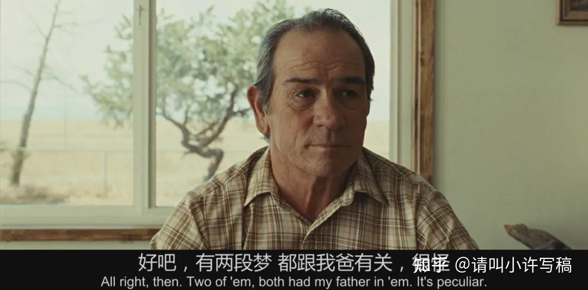</figure>
他梦到了自己回到了旧时光，那时候天气很冷，一片黑夜，暗示着环境的险恶。而父亲的牛角火炬，则象征着秩序和道德的美好，正好能照亮黑暗，带来光明和温暖。<b>警长希望光明和温暖能持续下去，由过去至未来，任由时光变迁，都不会离自己而去。</b>

可<b>很快他醒了，看到的是黑暗和寒冷，光明和温暖已成为过去式，而举着它的人，再也不会醒来。</b>

<b>他试图让火炬重新燃起，可终究无济于事，此番轮到漫漫长夜占据世界的舞台，他的灵魂却还停留在过去，阻碍他去适应新的秩序，无法融入新的人群。</b>

而没有这份记忆的人，比如年轻的警员，他们对于那些在警长看来匪夷所思的事，都不过尔尔，并不值得惊讶。

于是，<b>警长发现人们都变了，过去的人们所拥有的善良、淳朴、道义和浪漫，如今已被性、金钱、暴力和毒品所取代，人们不再相信美好，不再尊重生命，不再追求道德，甚至也不愿保持体面。</b>

哪怕是过去的罪犯，也能有自己的原则和底线，行事不会太过惊世骇俗，对社会的破坏始终保持着某种克制，因此警察执行公务都不用配枪。

可现在呢？

<b>这个世界已变得陌生，和自己熟悉的一切渐行渐远，他意识到了自己被抛弃的事实。</b>

<b>世界早已没有他们这种卫道士的容身之所，就像他那因公受伤的叔叔，没人拜访，没人留意，只能在无人之处默默老去，静静地等待着死亡的降临。</b>
<figure data-size="normal">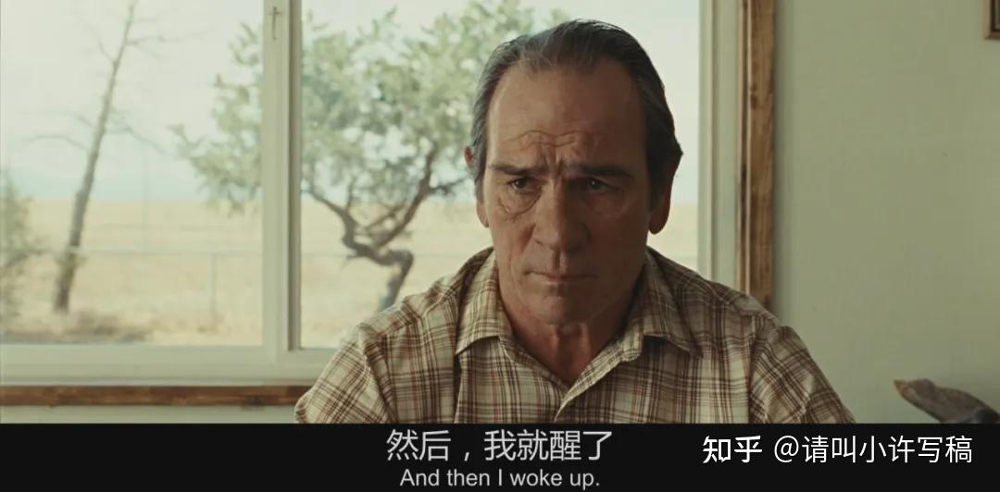</figure>
此，便为《老无所依》。

电影的英文名称《No Country for Old Men》。

直译是：没有国家会为它的老人。

 

<b>END</b>

 

<b>So I called up the Captain</b>

<b>（于是我叫来领班）</b>

<b>Please bring me my wine</b>

<b>（请给我来点酒）</b>

<b>He said：</b>

<b>（他说 ）</b>

<b>We haven&#39;t had that spirit here since nineteen sixty nine</b>

<b>（自从1969年起，我们便不再供应）</b>

这是歌曲《加州旅馆》里的歌词，里面提到了一个时间节点：1969。

歌词里，酒象征着美好的事物，但自从那一年起，它再也没有了。

歌曲发行于上世纪76年，和《老无所依》的背景大致相符。

不一样的是，《加州旅馆》则有对美国梦的反讽，以及对年轻一代的批判；

而《老无所依》，则是在过往美好的怀念中，所渲染的那种纯粹的无力、孤独、与绝望感。
<figure data-size="normal"></figure>
二者相同的是，都传递了一种信号：<b>新一代人们抛弃传统，拥抱自由、享乐和糜烂的现状，整个社会环境趋向无序。</b>

电影中所定义的好与不好，是存在着时间差的。

不知道大家注意到了没有，电影中的老警长和安东两大角色，设定有着很大的违和感。

比如：

<b>老警长曾对他的女助手说过，自己每天要反省两遍，如果有未能解决的事情，那么就反省三遍。</b>

<b>去外地工作调查，他本可以跟他妻子说已经到了那里，但他还是坚持要助手等他去了后再告知自己的妻子，他几乎不撒谎和欺骗别人，哪怕是很小、善意且很有必要的谎言。</b>

<b>从路上驶过的小皮卡，有一根固定货物的绳子松了，面对如此鸡皮蒜毛的小事，一般人嫌麻烦都算了，但警长却一定要驱车追赶，只为提醒他把绳子绑紧。</b>

<b>和卡拉的见面，他为了达到获取莫斯信息的目的，完全可以如实说明莫斯的险境，但他却特别在意女士的情绪，甚至不想让她承受哪怕一点的恐惧和忧虑，仍愿增加自己的工作量。</b>

以上对警长的刻画，非常细腻，细腻得有些过分，甚至可以说：<b>他太完美了，完美到几乎不像我们认知中的人类。</b>

一个真实的人，是立体、多面的，他有好的地方，也有坏的。

比如莫斯，他贪婪、自负、固执，还有点大男子主义，却不惜冒着生命危险去给墨西哥人送水。

这几乎已经是约定俗成了：<b>如果把一个人物刻画得纯好和纯坏，那么他便是扁平、单面的。</b>

所以哪怕是一个反派，优秀的作品，都会给他增加一个处境、一个动机，让我们看到这个反派背后的光环和美丽，从而让他（她）更加完整和立体。

<b>但是在这部电影里，导演却不留余力地用各种细节和镜头语言，来填补和充实两个角色完全单面化的特性，这本身就很“反直觉”，一定别有深意。</b>

这个深意是什么呢？
<figure data-size="normal">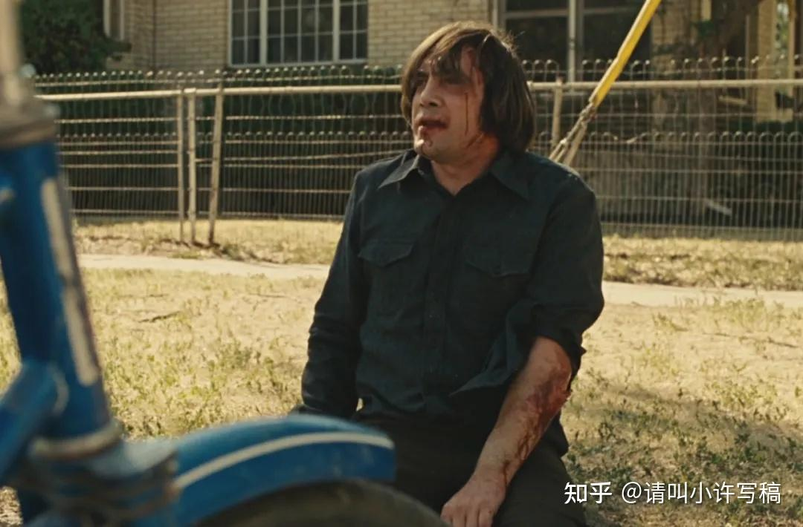</figure>
我们再来聊聊安东，<b>安东正好是警长的相反面，他危险、多变、残忍、冷酷、不具备任何情感。</b>

但有一点和警长又有着异曲同工之妙：<b>那便是坏的太彻底了，以至于他和警长形成了两个相反的极端。</b>

或许是导演叙事和刻画的缘故，我们似乎对安东这个角色很难产生痛恨和鄙视的心理，但安东做的这些事，又有多少称得上正面呢？

从身为为人的朴素价值观来评价，安东就是一个彻头彻尾的坏人，但我们确实好像很难讨厌起这个角色，更准确来说，是很难从人的角度对他产生情绪上的波动。

为什么会有这种感觉呢？

答案很明显，因为<b>他所展现的气质，根本就不像一个有血有肉、活生生的人，而是冷冰冰的机器，没有感激、没有愤怒、没有恐惧、没有亢奋、没有疼痛，没有同情，在他身上几乎找不到人的七情六欲。</b>

<b>所以我们没法跟他产生任何的共鸣，他准确来说，是某种现象和事物的拟人化。</b>
<figure data-size="normal"></figure><figure data-size="normal"></figure>
还记得莫斯的空房子吗，警长和安东两个人都闯入过，并且在电视黑色屏幕的镜面中，两人似乎都被困在了某个窄小的光亮里，四周是困住他们的黑暗。

为何导演要给两个角色设置这种几乎重合的画面？是对应什么呢？

可以结合四个已知的信息：

<b>其一是他们两大角色，正好一善一恶，一正一反，都极端地得不像正常的人类。</b>

<b>其二刚刚说到的，导演给两个角色设置的对应的重合的画面，其实二者存在一个很容易被忽视的区别：时间差。两个看似重合的画面，实际上形成的时间是不一样，是安东先来，后面才有警长，他们有着先后顺序；</b>

<b>其三是其实可以把电视屏幕当作背景版，背景既是镜头的背景，也是时代的背景，背景都是一样的黑暗，但是中心的人物却不相同，他们都是黑暗背景中的主角，也是当前时代的象征者。</b>

<b>其四是从第二个信息里面他提取并延申的：安东和警长，一个罪犯，一个警察，在电影里从未碰面、相遇，完全没有任何的交集，他们是完全错开的。</b>

只有时间，才能将两个事物彻底地隔开。

警长叔叔曾有过这样的台词：<b>这个国家对他的人们很残忍。</b>

因此完全可以大胆设想，警长和安东，完全是两个社会现象的拟人化。

<b>警长，象征着过去的美国，导演过于怀念，所以我们看到的他几乎完美无瑕；</b>

<b>而安东，则是美国当下和未来的具象化，他便是无序的象征。</b>

以前的美国讲道德，守秩序，大家有底线，追求风度，坚守责任，警长就是它的具象化；

<b>现在的美国，崇尚自由、自我，因而变得堕落、萎靡、付诸暴力、利益至上，它对待它的人民，就如同安东对待他的所遇之人，杀戮是随机、未定的，无论是善是恶，无论你幸福还是悲惨，哪怕你无私地提供帮助，为它付出与贡献过，在它面前，都不过是一个冰冷而简单的NPC，它对你没有共鸣，没有同情，没有感恩，也没有悲悯，他所执行的死亡，不会刻意避开任何一个普通人，你永远不会知道自己为何而死。</b>

<b>警长永远无法打败安东，本质上是一个旧时代，注定会被新的时代覆盖，所以才有了那句震慑灵魂的台词：大势不可阻挡。</b>

艾尔帕索的胖警长向老警长吐槽在他年轻时，街上见不到穿着鼻环、染着绿毛的人，警长却在纠结现在人们不再称呼他人“先生”，和“女士”。

可真实的情况只会越来越糟糕，他们更想不到，哪怕在他们已很不可理解的那个时期，也只有男和女的两个性别，但几十年后的2026年，美国已经有100多个性别了，男性只要觉得自己是女性，就可以堂而皇之地闯入女厕。

<b>他们的那个时代，虽然混乱，但也诞生过《加州旅馆》这种伟大的音乐，有着数不清影视和文学巨著，各种流派和形式百花争鸣，可现在，在被民主自由所包裹的美丽躯壳下，除了贪欲、毒品、冷漠、LGTB、政至正确、贫富差距、枪击暴力，世界灯塔的美利坚，又还能剩下什么呢？</b>

从某一个时间节点开始，堕落已是不可阻挡，美国每年的枪杀，增长的速度越来越快，从前警察不用配枪的那种场景，已是太远太远，无从想象。

而另一方面，<b>更多的人则在失去工作和家园，逐渐沦为流浪汉，直到默默地死去，他们的沉沦、消逝的整个过程，你甚至都找不到任何理由和逻辑。</b>

<b>没有因果，一切都是随机。</b>

现在，电影里的安东，有了一个专有的词汇：斩杀线。

也许，你只是遇到了一点小意外，比如生病、比如失业，也许，<b>你只是因为跟某人随口搭了一句话，于是，人生在这一刻彻底划上了句号。</b>

安东，并不是我们认知中人类，它更像是一个系统，一个并不公正的执行者。

<b>警长怀念他的过去，就像导演怀念他的警长，可是，它们现在已一去不复返了。</b>

 

<i>本文首发于公众号：安若小许</i>

---
导出时间: 2026-08-23 19:06