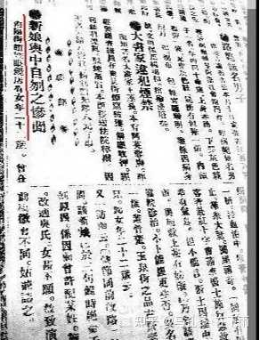
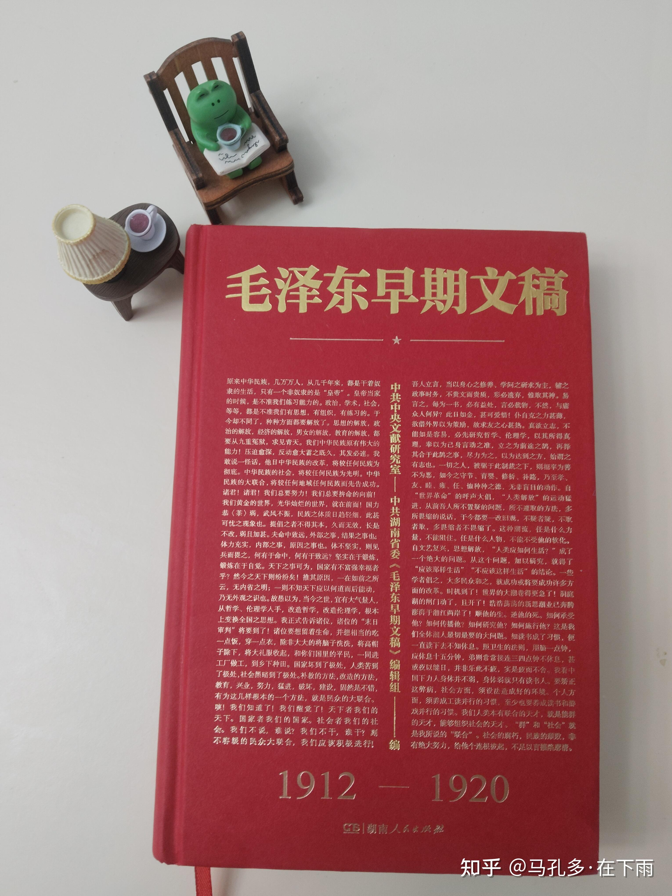
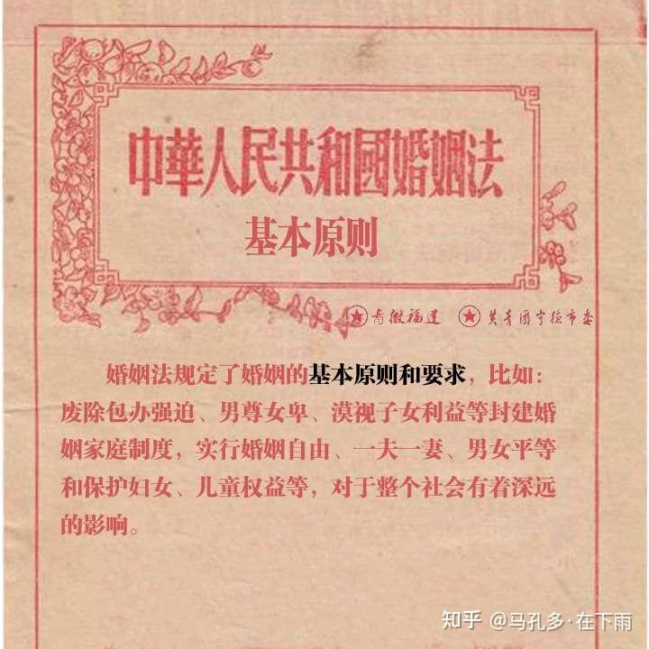

# 中国与世界文学史上，有哪些「读书人」通过书籍或文章直接影响了政治、教育或文化政策？

| 项目 | 内容 |
|---|---|
| 类型 | answer |
| 作者 | 马孔多·在下雨 |
| 收藏时间 | 2026-04-03 17:39 |
| 发布时间 | - |
| 收藏夹 | 抗联 |
| 原链接 | https://www.zhihu.com/question/2019773332921217175/answer/2023454517283266748 |

## 摘要

这个话题下，我想到了一个人，教员。 他从十篇为赵五贞怒发冲冠鸣不平的愤慨，再到提出四条绳索，再到新中国成立，亲自签发《婚姻法》提倡男女平等。 可以说是“读书人”变成“实践者”的一个有力佐证： 从情感上的共情愤怒，再到理性分析阶级矛盾，再到倡导实现男女平等。 “读书人”和“实践者”不必二分——一个人可以先用笔思考，再用手做事。1.事件起因 [图片] 1919年11月14日，湖南长沙赵五贞，因不满父母包办婚姻——被强迫嫁给比…

## 正文

这个话题下，我想到了一个人，教员。

他从十篇为赵五贞怒发冲冠鸣不平的愤慨，再到提出四条绳索，再到新中国成立，亲自签发《婚姻法》提倡男女平等。

可以说是“读书人”变成“实践者”的一个有力佐证：<b>从情感上的共情愤怒，再到理性分析阶级矛盾，再到倡导实现男女平等。</b>

<b>“读书人”和“实践者”不必二分——一个人可以先用笔思考，再用手做事。</b>
<h2>1.事件起因</h2><figure data-size="normal"></figure>
1919年11月14日，湖南长沙赵五贞，因不满父母包办婚姻——被强迫嫁给比她大20岁且声名狼藉的古董商吴五——在出嫁的花轿中用剃刀刎颈自杀，年仅22岁。死后棺木上仍被贴上“吴赵氏”的封条。

<b>赵五贞事件是教员思考妇女问题的起点，这条思考线索贯穿了他的一生。</b>
<h2>2.从社会批判开始：提出“三面铁网”</h2>
教员对这一事件高度关注，他让李思安等人去调查事情经过，随后在12天时间里，在湖南《大公报》、《女界钟》等报刊上连续发表10篇文章。

<b>这十篇文章的讨论是层层递进的，从客观分析赵女士自杀原因、人格讨论，再到呼吁男女反对包办婚姻，再到反对媒婆，改革婚姻制度，展现了青年教员一条完整的思考和论证路线，在新文化运动的冲击下，这个事件被完全放大到各个社会阶层面前。</b>

他尖锐地指出这社会问题：
<blockquote data-pid="T0ACcUqx"><b>“社会里面既含有可使赵女士死的“故”，这社会便是一种极危险的东西。可以使赵女士死，他又可以使钱女士、孙女士、李女士死，他可以使‘女’死，又可以使‘男’死”。</b></blockquote>
1919年11月16日，他提出致使赵女士自杀的三面铁网理论。<b>困住赵女士的是来自中国社会、她的父母、她所不愿意的夫家的三面铁网。</b>

<b>“</b>这三件是三面铁网，可设想作三角的装置，赵女士在这三角形铁网当中，无论如何求生，没有生法。生的对面是死，于是乎赵女士死了。<b>”</b>
<blockquote data-pid="zVRqfjOU">我今日所要说的，就是既然提出了“改革婚制”，就应该进行讨究“婚制如何改革”。我甚希望一般青年男女诸君，对于这个问题，有所解决。如有以解决的论文投向本报，本报当然是极其欢迎。——《改革婚制问题》</blockquote><figure data-size="normal"></figure>
教员在《大公报》上发出呼吁和探讨，女性要争取自由独立，鼓励男女探讨婚制如何改革，留下了一个待解决的问题。

1919年写下“三面铁网”后，教员并没有停止对妇女问题的关注。1920年，他在《湖南建设问题条件》中再次提出“女子经济独立”的问题；1921年，中共一大后，他负责湘区党委工作，直接领导了女工运动。

<b>赵五贞的影子，一直在他脑子里。</b>
<h2>3.建立系统理论：“四条绳索”的束缚</h2>
1927年，在《湖南农民运动考察报告》中提出“四大绳索”的理论，其中关于女性压迫的论述从社会批判，到系统理论的建构，开始从更深层次的制度层面进行阐述。有学者明确指出，赵五贞事件是毛泽东思考妇女问题的起点，“三面铁网”是“四条绳索”的早期雏形。
<blockquote data-pid="xwjQFnuE">“中国的男子，普通要受三种有系统的权力的支配，即：（一）由一国、一省、一县以至一乡的国家系统（政权）；（二）由宗祠、支祠以至家长的家族系统（族权）；（三）由阎罗天子、城隍庙王以至土地菩萨的阴间系统以及由玉皇上帝以至各种神怪的神仙系统——总称之为鬼神系统（神权）。<b>至于女子，除受上述三种权力的支配以外，还受男子的支配（夫权）。这四种权力——政权、族权、神权、夫权，代表了全部封建宗法的思想和制度，是束缚中国人民特别是农民的四条极大的绳索。”</b></blockquote>
值得注意的是，教员在提出“四条绳索”时，还进一步分析了这些权力之间的关系。

他发现，夫权在贫农中较弱，因为贫农妇女要下地劳动，反而有更多发言权。

这说明，<b>妇女解放不只是“反封建”，更是“反剥削”——阶级压迫和性别压迫是缠在一起的。</b>
<h2>4.青年时期理论到落地的践行：《中华苏维埃共和国婚姻条例》的颁布</h2>
教员一生都在践行读书、思考、实践，从赵五贞到四条绳索，再到苏区政府的建立推行实施婚姻法，实现了他青年时期对于婚姻问题的思考，并将其诉诸于具体的法律条款。

1931年，教员签署了《中华苏维埃共和国婚姻条例》，第一次以国家法律形式确立婚姻自由、一夫一妻、废除封建婚姻制度。

<b>这是他青年时期对赵五贞的思考，第一次落地为法律——也是中国共产党历史上第一部以国家名义颁布的婚姻法。</b>

<b>1931年的《中央苏维埃共和国婚姻条例》是我国婚姻立法史上的一个里程碑。</b>
<h2>5.1950年《婚姻法》：从思想到立法的最终实现</h2><figure data-size="normal"></figure>
1950年4月《中华人民共和国婚姻法起草经过和起草理由的报告》中对此给予了很高的评价。
<blockquote data-pid="oKGQzVvO">报告明确指出：1931年的《婚姻条例》“奠定了废除封建主义婚姻制度和建立新民主主义婚姻制度的原则基础”。</blockquote>
1950年《中华人民共和国婚姻法》是新中国成立后第一部法律，被教员誉为<b>“普遍性仅次于宪法的根本大法”</b>。

历史社会学的研究告诉我们，历史因果从来不是一条直线。

从1919年赵五贞的花轿，到1950年《婚姻法》的颁布，教员用一生回答了“读书人有什么用”这个问题。

他不是坐在书斋里写，他是写完就去做。

而今天，我们这些还在写的人，至少可以做到一件事：<b>被现实刺痛的时候，不麻木，停下来，写出来！</b>

我是 <a class="member_mention" href="https://www.zhihu.com/people/ea985abb87f8b7d17afa17aa3c74b361" data-hash="ea985abb87f8b7d17afa17aa3c74b361" data-hovercard="p$b$ea985abb87f8b7d17afa17aa3c74b361">@马孔多·在下雨</a> ，一个读书杂食者，和你一起通过阅读实现个人的成长！

<a class="member_mention" href="https://www.zhihu.com/people/0eebc9b425a88e87408729eec9f09be4" data-hash="0eebc9b425a88e87408729eec9f09be4" data-hovercard="p$b$0eebc9b425a88e87408729eec9f09be4">@知乎人文</a> 

---
导出时间: 2026-08-23 19:06