# 如何评价mygo声优林鼓子参与军国主义音乐剧？

| 项目 | 内容 |
|---|---|
| 类型 | answer |
| 作者 | 百合是美好的 |
| 收藏时间 | 2026-04-03 09:58 |
| 发布时间 | - |
| 收藏夹 | 抗联 |
| 原链接 | https://www.zhihu.com/question/2022784244447986263/answer/2023338628445685035 |

## 摘要

话说牢日在八月风暴这个题材上面叫屈实在是幽默到极点，他们喜欢把当时的苏军塑造成反面人物，但要我说，你如果是日本开拓团难民，遇到苏军乖乖听话还能活下来，你要是遇到当时的自己人太君指不定当场把你扬了让你给天皇效忠： [图片] [图片] [图片] [图片] [图片] [图片] [图片] [图片] 另一个很有名的日本遗孤中岛幼八写了一本何有此生，也有类似内容： [图片] 跟上面这帮看着不像人的行为，苏军明显要拟人多了，据日本遗孤王林起回忆，当时在苏联人管理的难民所并没有受到虐待，而且还有饭吃 [图片] [图片] -…

## 正文

     话说牢日在八月风暴这个题材上面叫屈实在是幽默到极点，他们喜欢把当时的苏军塑造成反面人物，但要我说，你如果是日本开拓团难民，遇到苏军乖乖听话还能活下来，你要是遇到当时的自己人太君指不定当场把你扬了让你给天皇效忠：
<figure data-size="normal">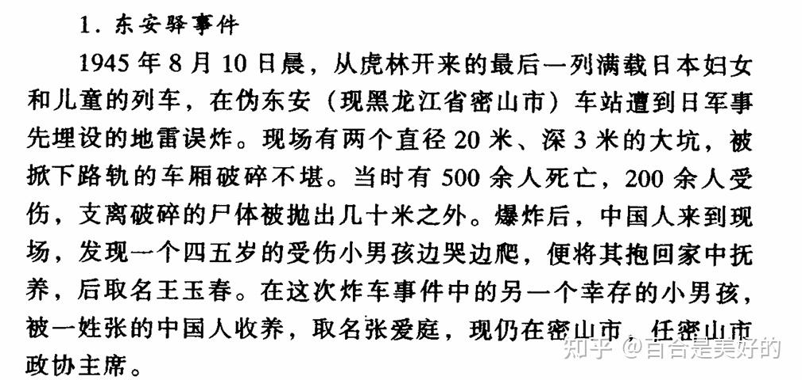<figcaption>日本遗孤调查研究</figcaption></figure><figure data-size="normal">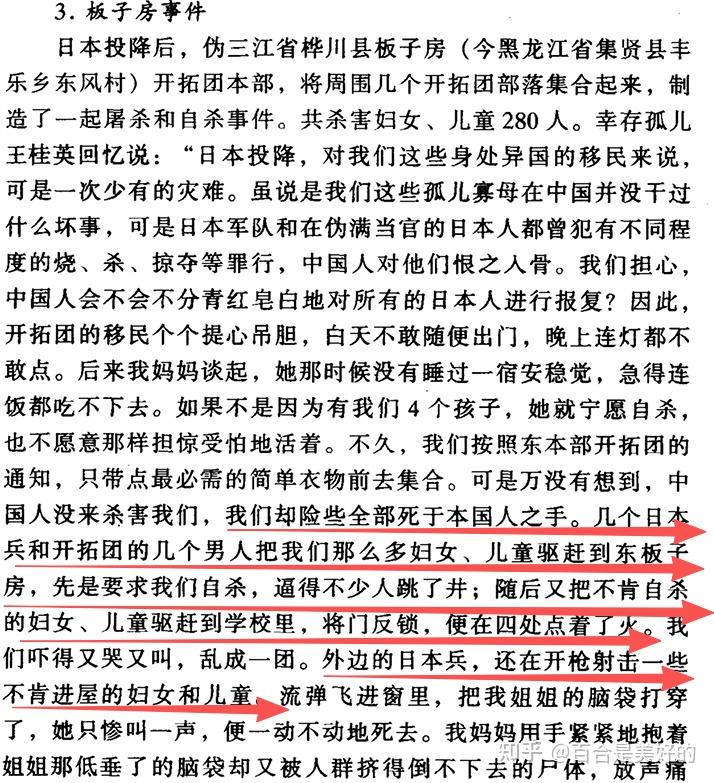<figcaption>日本遗孤调查研究</figcaption></figure><figure data-size="normal">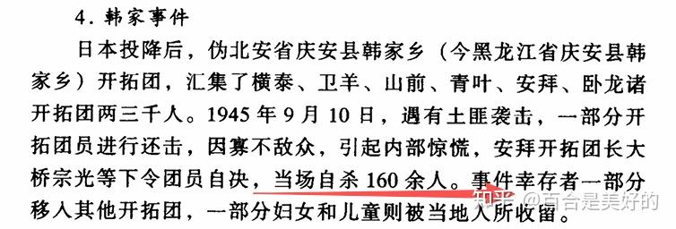<figcaption>日本遗孤调查研究</figcaption></figure><figure data-size="normal">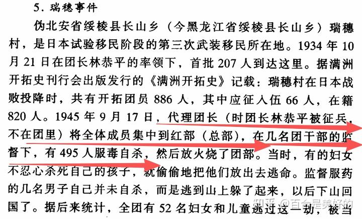<figcaption>日本遗孤调查研究</figcaption></figure><figure data-size="normal">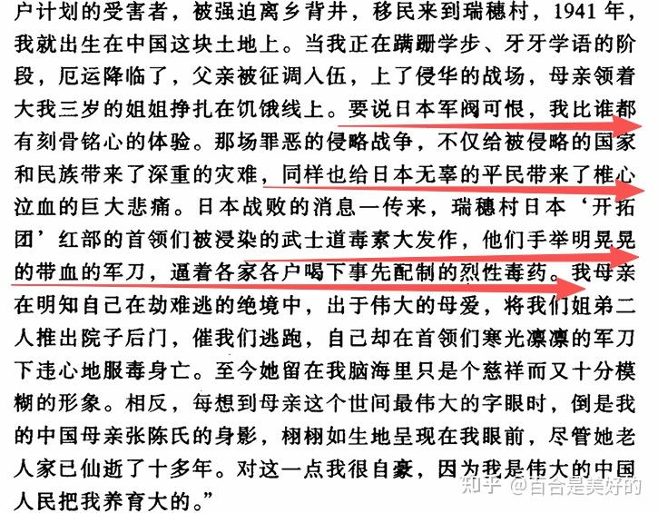<figcaption>日本遗孤调查研究</figcaption></figure><figure data-size="normal">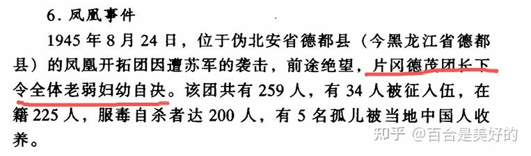<figcaption>日本遗孤调查研究</figcaption></figure><figure data-size="normal">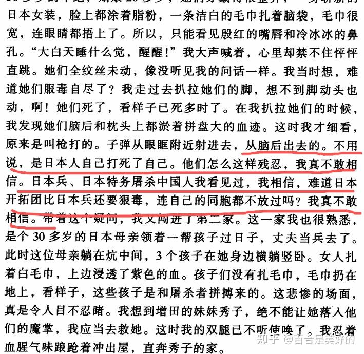<figcaption>日本遗孤调查研究</figcaption></figure><figure data-size="normal">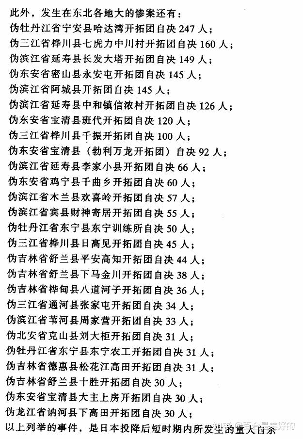</figure>
另一个很有名的日本遗孤中岛幼八写了一本何有此生，也有类似内容：
<figure data-size="normal">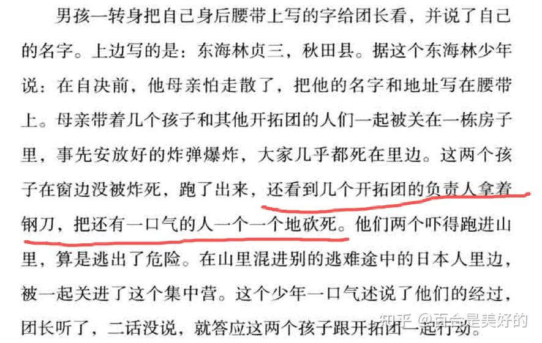</figure>
跟上面这帮看着不像人的行为，苏军明显要拟人多了，据日本遗孤王林起回忆，当时在苏联人管理的难民所并没有受到虐待，而且还有饭吃
<figure data-size="normal">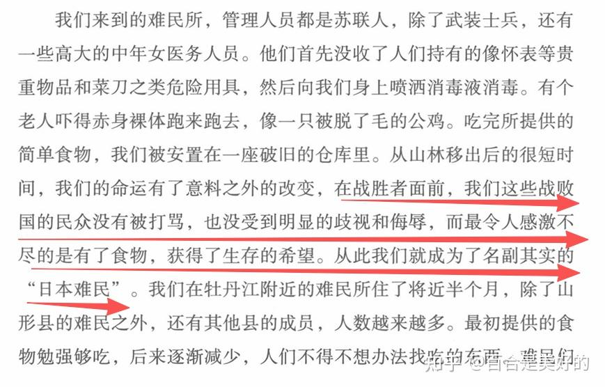<figcaption>我在中国75年</figcaption></figure><figure data-size="normal">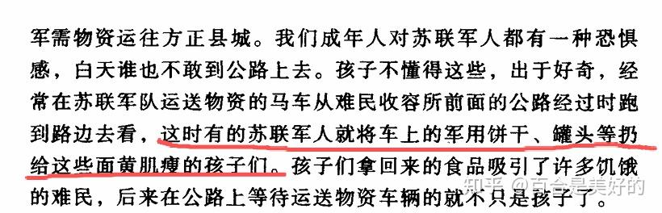<figcaption>日本遗孤调查研究</figcaption></figure>
------------------------------------------------------------------------

最新消息是不演了。
<figure data-size="normal">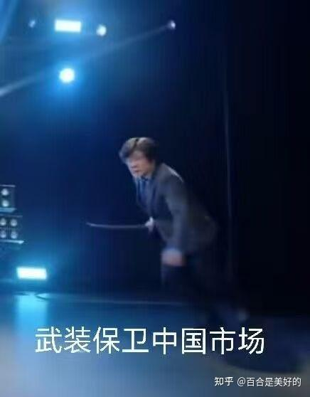</figure>
    我顺着上面的回答再说一下，在日本的满洲历史叙事里面，有一套非常恶心的说辞，就是：“联中抗俄”。主要就是喜欢把北方的俄罗斯塑造成大反派，然后日本在东北正义地抗击俄国入侵，这种说辞从日俄战争那会就开始了，黑塔利亚里面有一集我记得有个画面，就是日本站出来保护中国免受沙俄侵略，背景就是日俄战争，搞得自己好像很正义一样。二战里面这种抗苏叙事，无非就是把日俄战争那一套copy过来再玩一次罢了。

---
导出时间: 2026-08-23 19:06