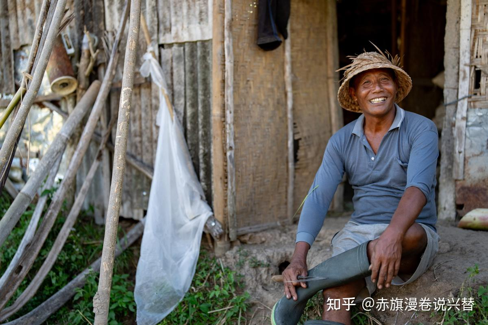
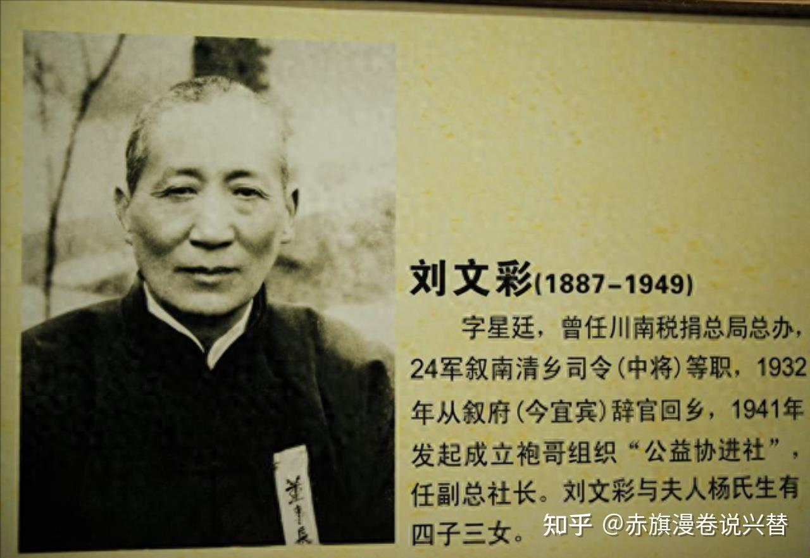
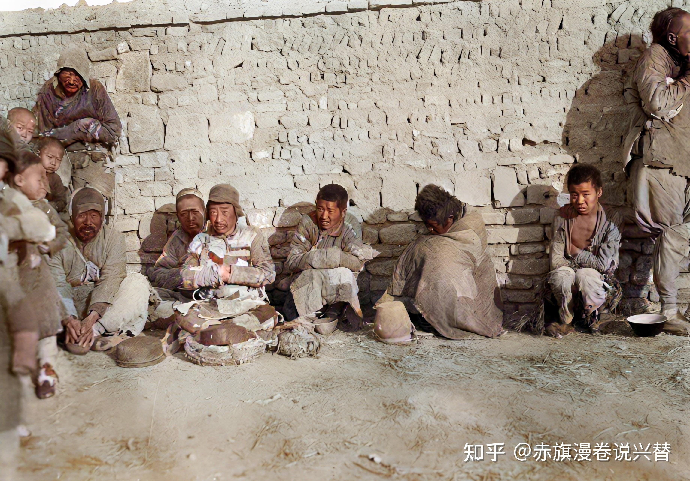
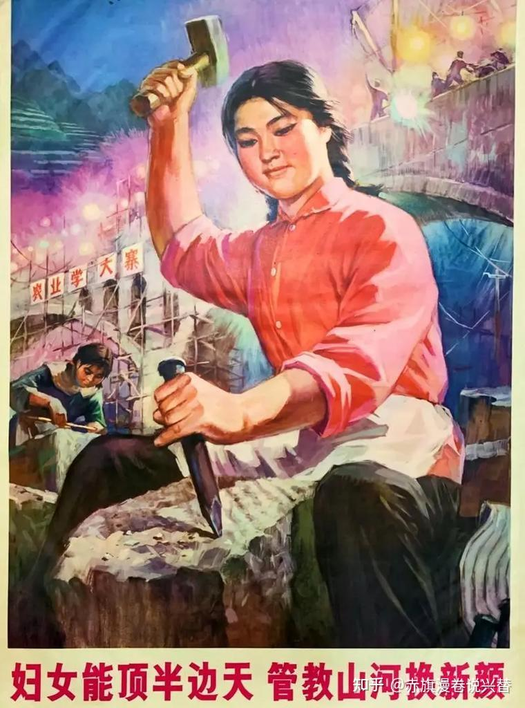
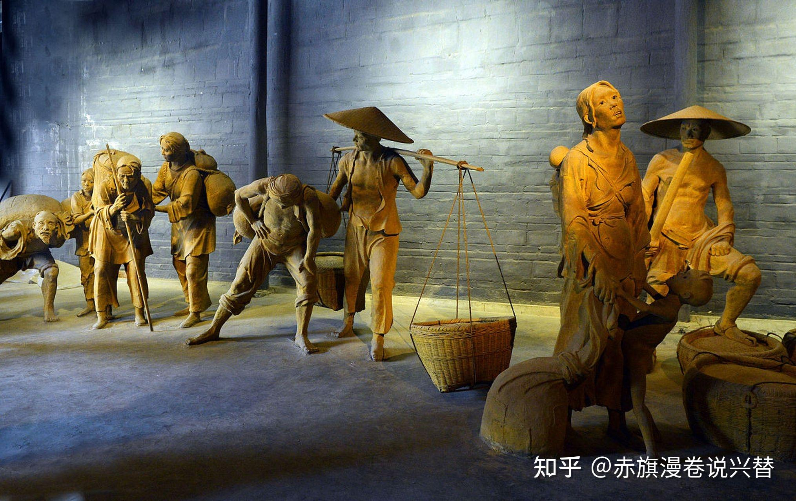
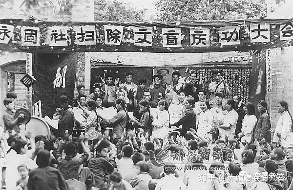
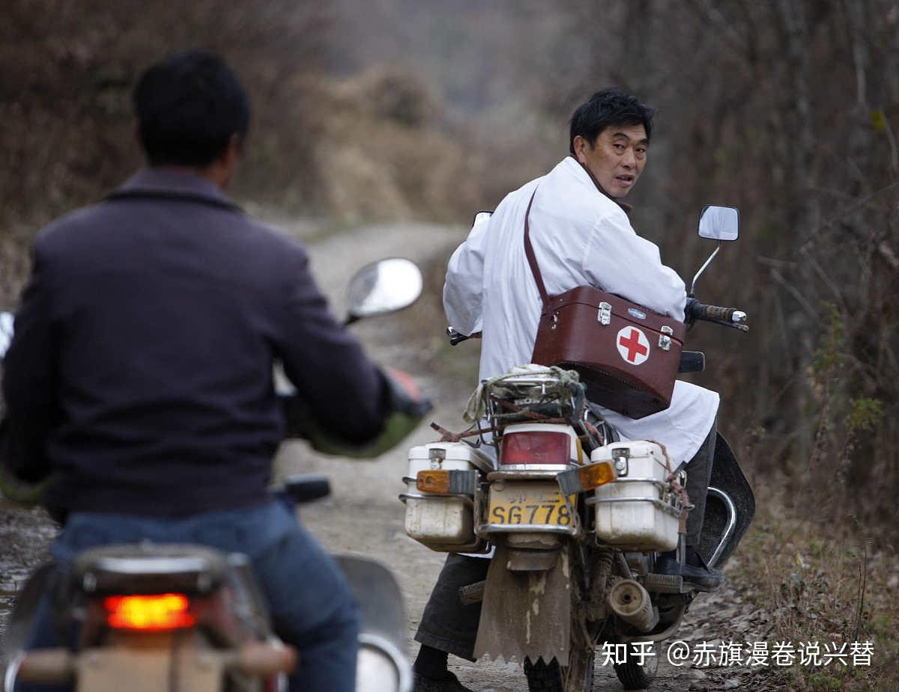
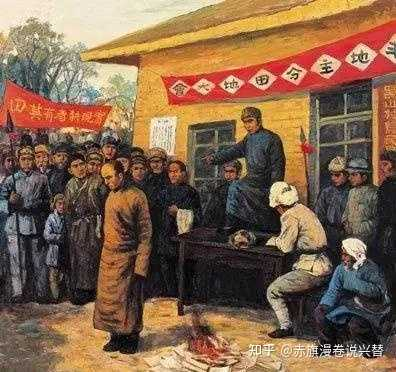
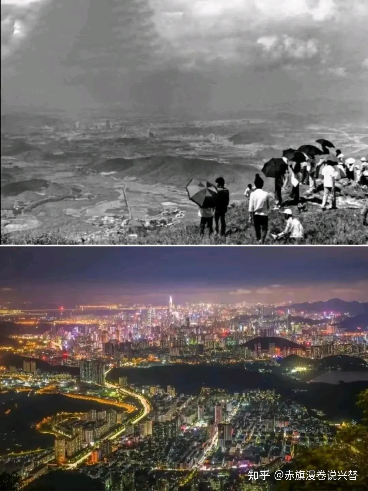

# 穷人打倒了地主为什么没有变富有？穷人打倒地主之前想过这么高深的社会学问题吗？

| 项目 | 内容 |
|---|---|
| 类型 | answer |
| 作者 | 赤旗漫卷说兴替 |
| 收藏时间 | 2026-03-31 23:53 |
| 发布时间 | - |
| 收藏夹 | 抗联 |
| 原链接 | https://www.zhihu.com/question/1999394882796668797/answer/2022461479723517445 |

## 摘要

我先直接说结论：旧社会的贫穷和新时代的贫穷压根不是一回事。 你翻开任何一本历史课本，或者听家里老人讲古，都会发现一个看似矛盾的现象——当年打土豪、分田地，穷人翻身做了主人，可为什么到今天，依然有人觉得自己“穷”？甚至有些人翻出老黄历，阴阳怪气地来一句：你看，当年闹了半天，不还是穷吗？这和当年王朝更替好像没区别啊？ 这话乍一听挺唬人，但本质上属于把“饥饿”和“没吃上大波龙”混为一谈的偷换概念。 旧社…

## 正文

我先直接说结论：旧社会的贫穷和新时代的贫穷压根不是一回事。

你翻开任何一本历史课本，或者听家里老人讲古，都会发现一个看似矛盾的现象——当年打土豪、分田地，穷人翻身做了主人，可为什么到今天，依然有人觉得自己“穷”？甚至有些人翻出老黄历，阴阳怪气地来一句：你看，当年闹了半天，不还是穷吗？这和当年王朝更替好像没区别啊？

这话乍一听挺唬人，但本质上属于把“饥饿”和“没吃上大波龙”混为一谈的偷换概念。

旧社会的穷，是“人吃人”的穷，是系统性把你按在泥里、连骨头渣都不给你剩的穷。而今天你嘴里喊的“穷”，大概率是“我看上了那款Pro Max但得咬牙攒两个月”的穷，是“别人家孩子暑假去了南极科考我家孩子只去了北戴河”的穷。这两种穷之间的差距，比你家门口那条臭水沟和马里亚纳海沟的差距还大。
<figure data-size="normal"></figure>
咱们把这事儿掰开揉碎了说清楚，不然总有人拿着今天的焦虑去否定当年那场改天换地的意义。

 

<b>先从最根子上说——人身依附关系的解除。</b>

什么叫人身依附？说人话就是：你压根不是个完整的人，你是地主家“户”下的一笔资产。

每一个中国人肯定都听过杨白劳的故事。贺敬之先生写的《白毛女》里，杨白劳给黄世仁种地、交租，到头来欠的债像滚雪球一样越滚越大，最后被逼着用女儿喜儿抵债。

杨白劳不是懒，不是笨，他一年到头起早贪黑，凭什么越种越穷？因为整个算账的规矩是地主定的。你种地，地是地主的；你借粮，利是地主定的；你生病买药，药铺是地主开的；你死了埋人，坟地还是地主的。你从头到脚、从生到死，每一口气都喘在地主的棋盘上，走不出那个格子。

杨白劳最后喝卤水自尽，不是因为他想不开，是因为他算明白了：他还不上。不是这一年还不上，是这辈子、下辈子、子子孙孙都还不上。他的身体、他的劳动、他的女儿，全是黄世仁账本上的一笔数字。这种“穷”，不是缺钱，是缺“人籍”。

历史上真实的案例比戏剧更残酷。民国时期四川大地主刘文彩，家里收租的规矩叫“干租”：旱涝保收，不管天灾人祸，租子一粒不能少。佃农交不上，就得用家里的东西抵，家具、农具、衣服、粮食，最后连人也押在那。
<figure data-size="normal"></figure>
刘文彩的收租院里有水牢，欠租的佃农被关进去，水里泡着，不生不死。有记载说，一个叫张德成的佃农，因为连续三年交不够租子，被关进水牢，放出来的时候双腿已经烂得见了骨头。他不是欠了多少钱，是欠了“规矩”，地主定的规矩。

1947年《中国土地法大纲》颁布之后，这些规矩被一锹铲平了。分到地的那天，有老农跪在地里捧起土往嘴里塞，说“我尝尝自家的地是啥滋味”。你听着像段子，但那是真事。因为在他活过的几十年里，脚下的土地从来不是他的。他犁地、施肥、收割，流汗流血，但地里长出来的东西是别人的。现在终于有一块地，种出来的粮食是自己的了，他得确认一下这是不是做梦。

这种“踏实”，你今天感受不到。因为你生下来就是个自由人。你想去北京打工，买张火车票就走；你想换工作，跟前东家说句“老子不干了”最多损失一个月工资；你想搬个家，叫个货拉拉半天搞定。但在一百年前，这些“理所当然”的权利，是千万人拿命换来的。杨白劳要是活到今天，他可能会被黄世仁起诉“合同纠纷”，但他不会被逼到喝卤水——因为他可以选择不租黄世仁的地，可以去城里打工，可以去工厂当工人，可以摆个小摊。但在那个年代，这些“选择”都不存在。

这就是第一层：穷不穷另说，你首先得是个人。旧社会的穷人连“人”都算不上，你谈什么富有？

 

<b>接着往下说，基本人权的普及。</b>

“人权”这个词现在被说得太多了，多到让人麻木。但在新中国建立之初，“人权”是实实在在、看得见摸得着的东西——比如，不再有人能随便打你。

听起来像句废话？但在旧社会，这不是废话。

民国时期的乡绅对佃农、长工的暴力是家常便饭。地主家的少爷心情不好，拿鞭子抽长工解闷；地主家的小姐出门，轿夫走得慢了，随手就是一烟锅子。你挨了打，没地方说理，因为乡公所的保长就是地主的小舅子，县衙门的县长是地主在省城读书时的同窗。
<figure data-size="normal"></figure>
更别说那些隐形的暴力——地主说你这块地今年租子得加两成，你敢说个“不”字，明年这块地就不租给你了。你不种他的地种谁的？周围的地全是他的。你只能跪下来磕头，说“东家开恩”。

有个真实的人物，叫刘青山。不是后来那个被枪毙的刘青山，是河北安国县一个普通农民。1943年，他租种了地主赵家的三十亩地，那年遭了蝗灾，庄稼被啃掉大半。他去找赵家商量减租，赵家管事的说：“蝗虫是天灾，租子是规矩，天灾归天灾，规矩归规矩。”让他照常交一百二十石粮。

刘青山交不出来，赵家就把他的耕牛牵走了，把他家的水缸、锅碗全搬空了，最后把他老婆陪嫁的一对银镯子也撸走了。他老婆哭着去找赵家理论，被家丁打了一顿，扔在门口。刘青山去县里告状，县长连案子都没立，说“租地交租，天经地义”。

这种事在旧社会太多了，多到没人觉得是新闻。因为权力不在你手里，法律不在你手里，连道理都不在你手里。你唯一能做的就是忍着，忍到忍不下去，就学杨白劳。

1950年《婚姻法》颁布的时候，有一条规定今天看来平平无奇：禁止纳妾。但在当时，这意味着一大批被当作“物品”的女性第一次获得了法律意义上的尊严。山西有个叫李二妮的妇女，从小被卖给地主家当丫鬟，十六岁被地主纳为妾。她在地主家过了十一年非人的生活，每天给正房太太端洗脚水、倒尿盆，稍有不顺就被打。

土改工作队进村之后，她头一个跑去诉苦，最后离了那家，嫁给了村里一个贫农。她后来当了妇女主任，带着村里的妇女学文化、学技术，活到了八十多岁。她跟人说：“以前我连自己姓什么叫什么都不配有人知道，现在我能站在台上给几百号人开会。这不是钱的事，这是人的事。”
<figure data-size="normal"></figure>
这就是人权的落地——它不是写在纸上的漂亮话，它是让你知道：你是自己的主人，你的身体、你的劳动、你的人格，不再属于任何别人。

你今天吐槽“996”是福报，吐槽老板PUA，这当然没问题，该吐槽吐槽。但你得知道，你能理直气壮地跟老板谈劳动法、谈加班费、谈五险一金，是因为有一套完整的法律体系和基层组织在给你兜底。老板不敢把你关起来打，不敢扣你身份证，不敢说你“生是他的人死是他的鬼”。

这不是因为老板心善，是因为我们现在的制度从根子上就把“人身依附”的土壤给铲了。

 

<b>再从最朴素的层面说——吃饭这件事。</b>

打倒了地主，穷人有没有立刻变“富”？没有。因为那时候是真的穷，全国都在穷。但你翻开1949年到1952年的经济数据，会发现一个惊人的事实：农业生产在这三年里恢复得极快，粮食产量以每年百分之十几的速度增长。

为什么？原因简单到荒谬——农民给自己种地了。

以前给地主种地，一亩地收三百斤粮，地主拿去二百斤，你剩一百斤，还完种子、农具、高利贷的利息，到手能糊口的不到五十斤。现在地是你的了，一亩地还是收三百斤，但你只需要交一小部分公粮，剩下两百多斤是你自己的。你头一年就把那三间土坯房翻新了，第二年添了头驴，第三年给儿子娶了媳妇。

这不是“变富”，这是从“随时可能饿死”变成了“能吃饱了”。但在当时的人看来，这就是天堂。

山东有个真实人物，叫孔照璧，曲阜人，据说是孔家的远房旁支。但他家穷得叮当响，三代给孔府大户当佃农。他爷爷那辈，孔府的地租是“倒三七”，也就是收一百斤，孔府拿七十斤，佃农留三十斤。到他父亲那辈，改成“倒八二”，孔府拿八十斤。

1946年土改，他家分到了十二亩地。孔照璧那年二十五岁，头一年种地，打了三千多斤粮食。他留足口粮，交了公粮，剩下的卖了，买了一头驴、一辆破胶轮车。他赶着驴车去赶集的时候，孔府的老管家看见了，回去跟孔府的当家人说：“照璧那小子，如今也人模狗样地赶着驴车了。”当家人叹了口气，说：“这世道变了。”
<figure data-size="normal"></figure>
孔照璧后来当了生产队长，再后来当了村支书。他这辈子没发过大财，但他养大了六个孩子，五个读了书，两个考上了大学。他的孙子在济南当工程师，孙女在上海当医生。

你说孔照璧“富”了吗？论存款，他死的时候存折上就两万多块钱。但他从一个给孔府扛活的佃农，变成了一个能供出两个大学生的父亲。这种跨越，是旧社会想都不敢想的。

 

<b>再往后说，教育这件事。</b>

旧社会的文盲率有多高？新中国成立之初，全国人口中百分之八十以上是文盲。农村地区更夸张，有些村子连一个会写自己名字的人都找不出来。

为什么？不是穷人不想读书，是读不起。私塾的束脩（学费）对穷人家来说是天文数字。就算你勒紧裤腰带把孩子送去读两年，认识百十个字，然后呢？回来接着种地。

知识对穷人来说没有任何变现的渠道，因为社会结构是凝固的——你认识字，你也当不了账房先生，因为账房先生的位子是地主家亲戚的；你考不了功名，因为科举1905年就废了；你进不了新式学堂，因为学费能把你家房子卖了。

新中国做了一件前无古人的事：扫盲。

这不是一个政策，这是一场运动。村村办夜校，冬闲的时候，识字课本发到每个人手里。“不识字是睁眼瞎”“学了文化好种田”。这些口号今天听着土，但当时是真的管用。无数农民在扫盲班上学会写自己的名字，学会看化肥的使用说明，学会记工分、算账。
<figure data-size="normal"></figure>
有个叫高玉宝的人，你可能听说过。他是辽宁大连的贫苦农民，从小给地主放猪，一天学没上过。1947年参军，在部队里学文化，一个字一个字地认，硬是写出了自传体小说《高玉宝》。

《半夜鸡叫》那篇，写的就是他自己小时候给地主干活时的经历，地主为了让长工多干活，半夜学鸡叫，骗长工起来上工。这篇小说被选进课本，几亿人读过。高玉宝从一个放猪娃变成了作家，这要是放在旧社会，简直是天方夜谭。但他做到了，不是因为他比别人聪明，是因为新社会给了他一个“人可以改变自己命运”的机会。

当然副作用就是，把地主周春富黑成了“周扒皮”。

但无论如何，今天的你，能在这里刷手机、看这篇文章、在评论区跟人辩论，基础是什么？是你认识字。而你能认识字，是因为国家推行了义务教育法，是因为当年那场扫盲运动铺了底，是因为无数乡村教师在山沟沟里拿着粉笔头教孩子写“人”字。这些，都是“打倒地主”之后才有的。

 

<b>再来说医疗。</b>

旧社会的穷人，生一场病就等于死。不是病治不好，是治不起。

有个数据：1949年之前，中国人均预期寿命只有三十五岁左右。这不是战争造成的，是日常的疾病、营养不良、产妇死亡、婴幼儿夭折堆出来的。一个农村家庭，生五六个孩子，能活到成年的可能只有两三个。一场痢疾、一场肺炎、一次难产，就能把一个家打回原形。

你去看那些民国时期的小说、报告文学，里面写穷人最怕的不是地主，是看病先生（郎中）。因为请一次郎中，抓几服药，可能就花掉全家半年的口粮。大多数穷人的选择是：硬扛。扛过去算命大，扛不过去就卷个席子埋了。

新中国建立之后，农村合作医疗、赤脚医生制度，是被世界卫生组织当作“中国奇迹”写进报告的。赤脚医生背着药箱，踩着泥路，走村串户。他们治不了癌症、做不了开颅手术，但他们能治痢疾、能接生、能给小孩打疫苗、能给伤口消毒。就这么几项基础医疗服务，把中国人的预期寿命从三十五岁一下子拉到了六七十岁。
<figure data-size="normal"></figure>
你去看《红旗渠》的纪录片，林县人民在悬崖峭壁上修水渠的时候，有个赤脚医生叫李芳洲，背着药箱跟着施工队，在工地上给人包扎伤口、治感冒发烧。有一次一个民工从悬崖上摔下来，摔断了腿，李芳洲用树枝给他固定，用草药敷伤口，硬是把那条腿保住了。那个民工后来活到八十多岁，逢人就说：“我这命是赤脚医生给的。”

放在旧社会，一个穷民工摔断腿，结局大概率是：家里人用门板把他抬回家，找个土郎中看看，土郎中说“这得接骨，我得去城里买药，一副药两块大洋”，拿不出钱，就只能在家躺着，躺到伤口感染、发烧，最后死在炕上。这不是惨，这是那个年代穷人的日常。

今天你吐槽“看病难、看病贵”，这当然是真实存在的问题，医疗改革也一直在推进。但你也得承认，今天你生一场病，哪怕是普通的肺炎，你大概率能治好，而且不会因此倾家荡产。新农合、城镇居民医保，虽然报销比例和范围还有很多待完善的地方，但它的存在本身，就意味着“因病致贫”不再是无法避免的宿命。

 

<b>还有一个容易被忽略的点——人的尊严和希望。</b>

这一点说起来有点虚，但恰恰是最关键的。

旧社会的穷人，最大的问题不是没饭吃，是“没盼头”。你生下来是穷人，你爹是穷人，你爷爷是穷人，你曾祖也是穷人。这个家族的轨迹是固定的：给地主扛活，欠债，还不上，继续扛活，娶不起媳妇，买个逃荒来的女人，生一窝孩子，孩子接着给地主扛活。一代一代，像驴拉磨一样，永远在那个圈里转。

你知道自己这辈子就这样了，你的孩子这辈子也这样，你的孙子还这样。没有任何渠道能让你“翻身”，因为整个社会结构就是为你量身定制的牢笼。

而“打倒了地主”这件事，最深远的影响不是分了那几亩地，是打破了这种“命定”的循环。
<figure data-size="normal"></figure>
你分到了地，你发现你种的粮食大部分是自己的；你送孩子去读书，发现他真能考上中专、考上大学，真能当上干部、当上工程师；你生了病，发现花几毛钱就能看好；你想做点小买卖，发现没人拦着你，没人收你的“行商税”；你被村干部欺负了，发现能去公社告状，而且真有人管。

这种“有盼头”的感觉，是钱买不来的。

我认识一个快递小哥，农村来的的，九零后。他爷爷是贫农，土改时分了地，后来当了生产队长；他爸爸赶上了改革开放，出去打工，攒钱盖了楼房；他自己读了职高，没考上大学，但来城里送了几年快递，攒了点钱，现在自己承包了一个快递站点，一个月能挣两万多。

他说了一句话，我觉得特别到位：“我爷爷那辈，觉得能吃饱就是好日子；我爸那辈，觉得能盖楼就是好日子；我这辈，觉得能当老板、能送孩子上好学校才是好日子。一代人有一代人的‘好日子’，但前提是，每一代人都比上一代人过得好。”

这个“一代比一代好”，就是“盼头”。而“盼头”的起点，就是那场让穷人不再当牛做马的革命。

 

<b>最后，回应一下标题那个问题——穷人打倒了地主为什么没有变富有？</b>

因为“富有”从来不是一蹴而就的事。新中国是从一片废墟上建起来的，接手的是一个百分之八十文盲、人均寿命三十五岁、工业几乎为零、农村赤贫遍地、城市里连钉子都要进口的烂摊子。

七十年时间，我们完成了人类历史上规模最大、速度最快的减贫奇迹。八亿人脱贫，人均寿命翻了一倍多，高等教育毛入学率超过百分之五十，高铁网覆盖全国，连最偏远的村子都通了公路和网络。
<figure data-size="normal"></figure>
你说今天的穷人还是穷，我承认。城乡差距、收入分配、房价、教育内卷，这些都是真实存在的问题，需要继续解决。但你非要说“跟旧社会一样穷”，那就是睁眼说瞎话。

旧社会的穷，是生下来就被判了死刑的穷，是没有任何机会翻身的穷，是连“富”这个字都不敢想的穷。今天的穷，是“我想要更好的生活”的穷，是“我看到了差距、我想要追赶”的穷。这两种穷之间，隔着一场彻底的社会革命、一套完整的基础设施建设、一张覆盖全民的保障网、一个让普通人可以通过奋斗改变命运的制度框架。

你问我穷人打倒了地主为什么没有变富有？我的回答是：穷人打倒了地主，不是为了立刻变富有，是为了让自己不再是谁的牛马，是为了让子孙后代有可能变富有。

而你，就是那个“子孙后代”。

---
导出时间: 2026-08-23 19:06