# 抗日战争中真实的日军是什么样子？

| 项目 | 内容 |
|---|---|
| 类型 | answer |
| 作者 | 世界树 |
| 收藏时间 | 2026-03-31 18:13 |
| 发布时间 | - |
| 收藏夹 | 抗联 |
| 原链接 | https://www.zhihu.com/question/656669972/answer/2022375895051113478 |

## 摘要

日本人读到了日本老兵的一些回忆录都犯恶心了 [图片] 有日本网民表示多年前在澡堂认识的日本老兵（现已死），经常边笑边谈当年在中国是如何杀孕妇取乐的，每天都去寻找孕妇绑在树上后开膛破肚，还表示那时候很有意思 [图片] 日本老兵回忆录关于在无锡和青岛的暴行 [图片] [图片] 部分日本网民的一些听闻 [图片] [图片] [图片] [图片] 日本兵强奸姑娘（クーニャン）的记录和各种口述比比皆是 [图片] [图片] 上世纪70年代一些日本老兵聚会时还经常笑谈自己当初在中国和别的国家的干下的事当做谈资。 [图片]

## 正文

日本人读到了日本老兵的一些回忆录都犯恶心了
<figure data-size="normal">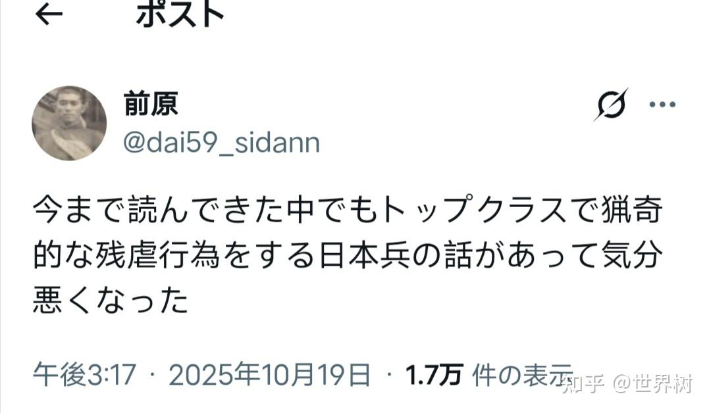</figure>
有日本网民表示多年前在澡堂认识的日本老兵（现已死），经常边笑边谈当年在中国是如何杀孕妇取乐的，每天都去寻找孕妇绑在树上后开膛破肚，还表示那时候很有意思
<figure data-size="normal">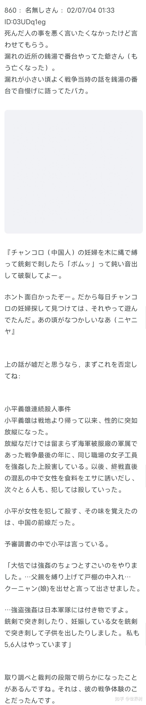</figure>
日本老兵回忆录关于在无锡和青岛的暴行
<figure data-size="normal">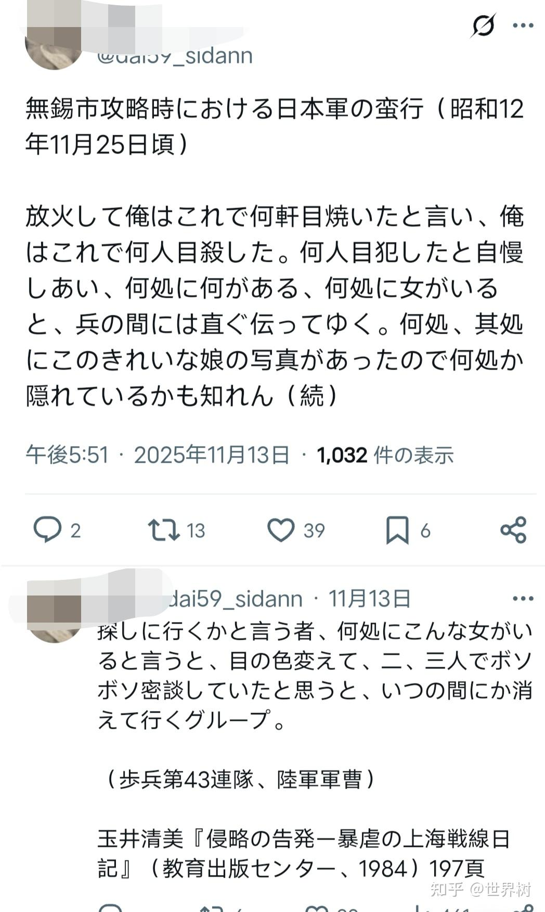</figure>
 
<figure data-size="normal">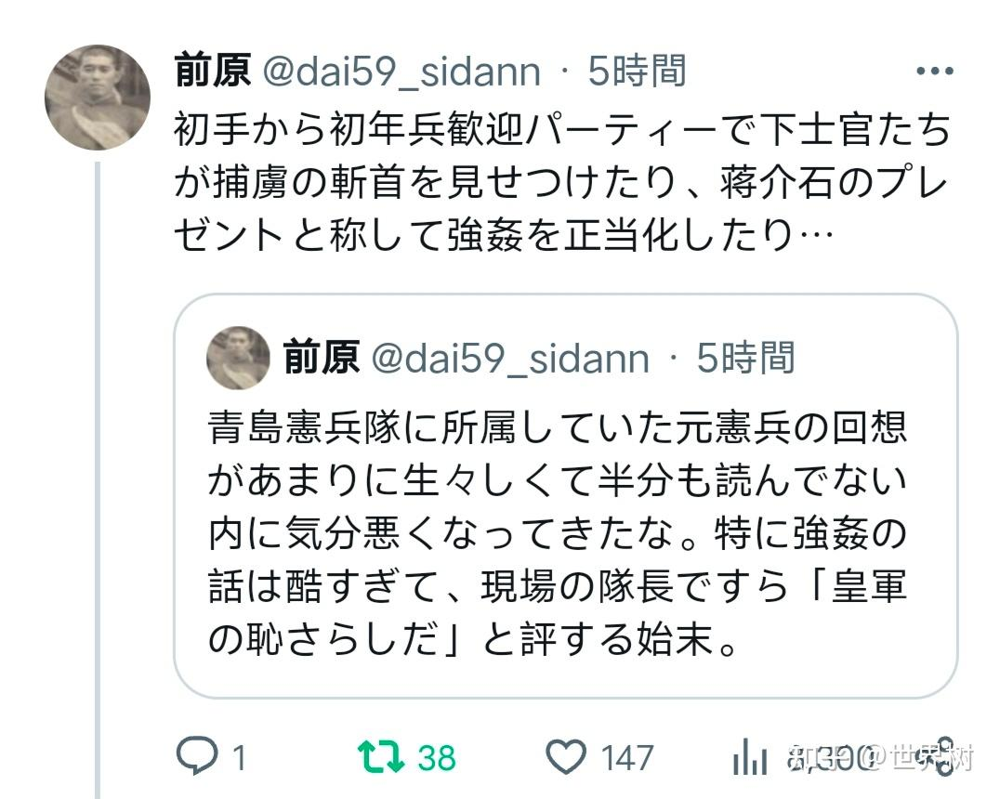</figure>
部分日本网民的一些听闻
<figure data-size="normal">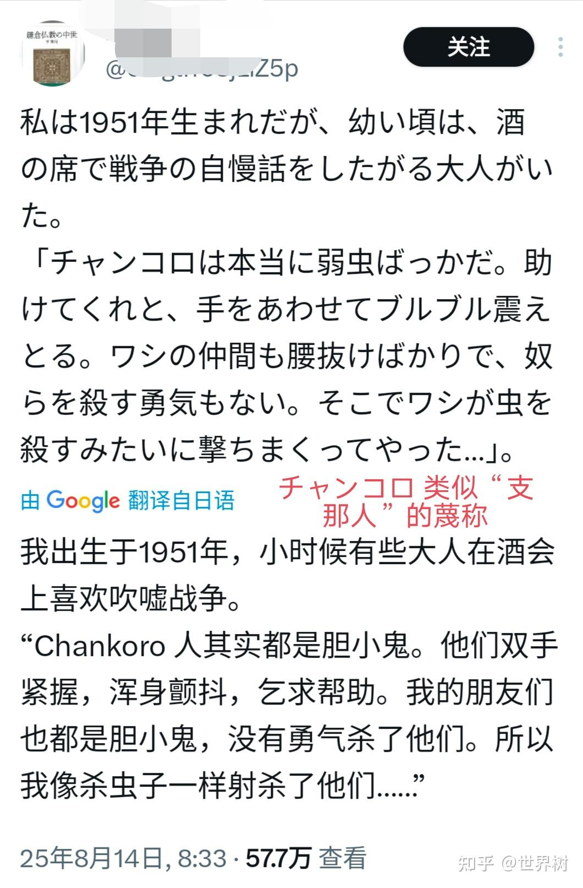</figure>
 
<figure data-size="normal">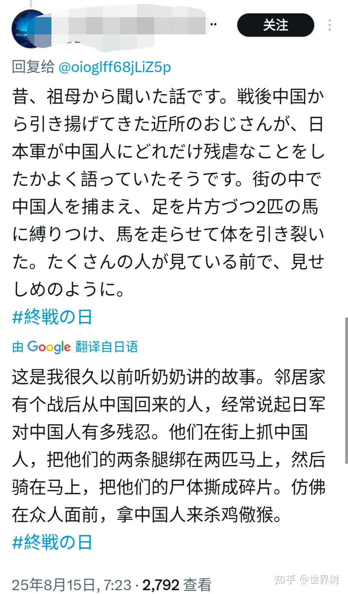</figure>
 
<figure data-size="normal">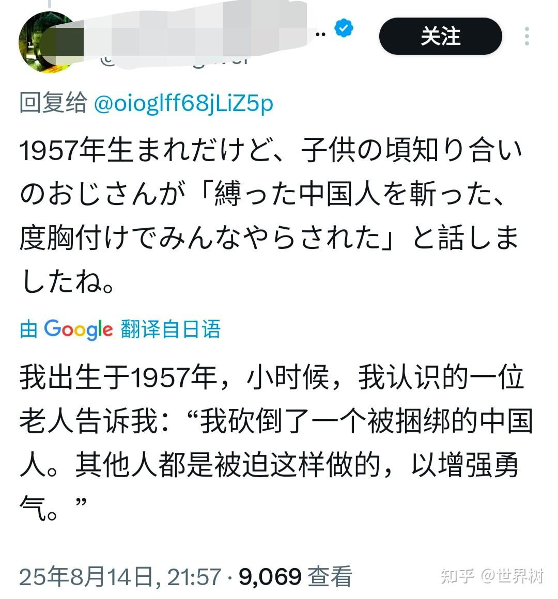</figure>
 
<figure data-size="normal">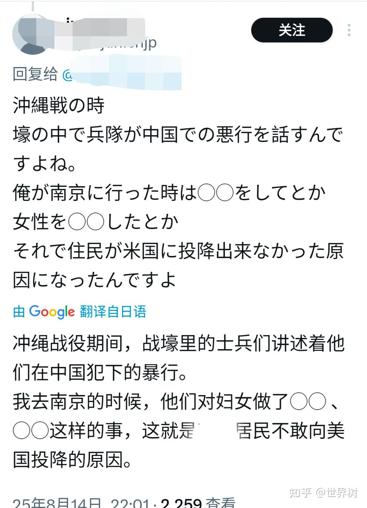</figure>
日本兵强奸姑娘（クーニャン）的记录和各种口述比比皆是
<figure data-size="normal">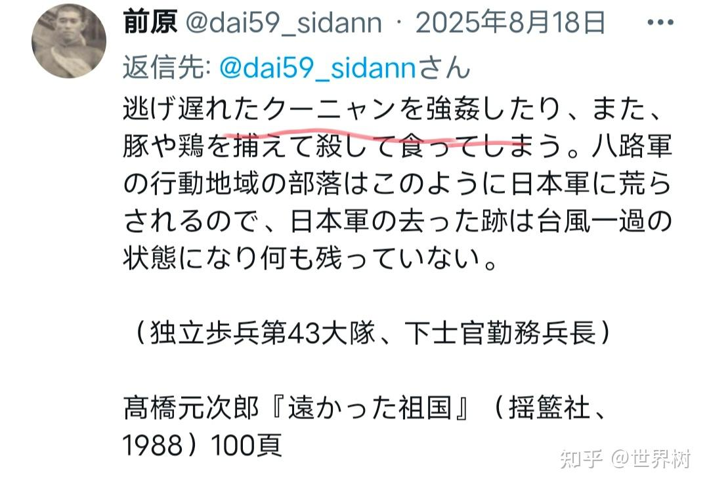</figure>
 
<figure data-size="normal">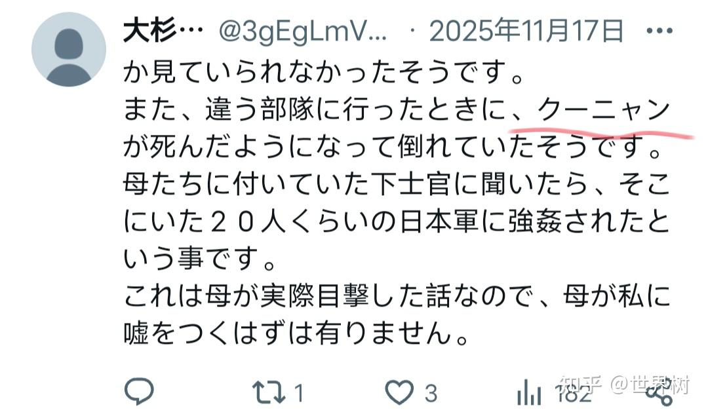</figure>
 

上世纪70年代一些日本老兵聚会时还经常笑谈自己当初在中国和别的国家的干下的事当做谈资。
<figure data-size="normal">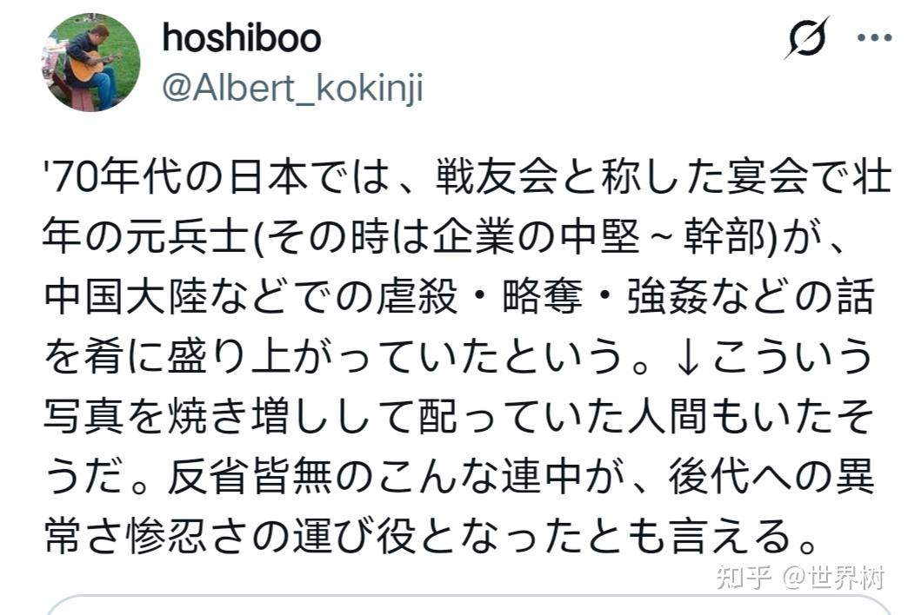</figure>

---
导出时间: 2026-08-23 19:06