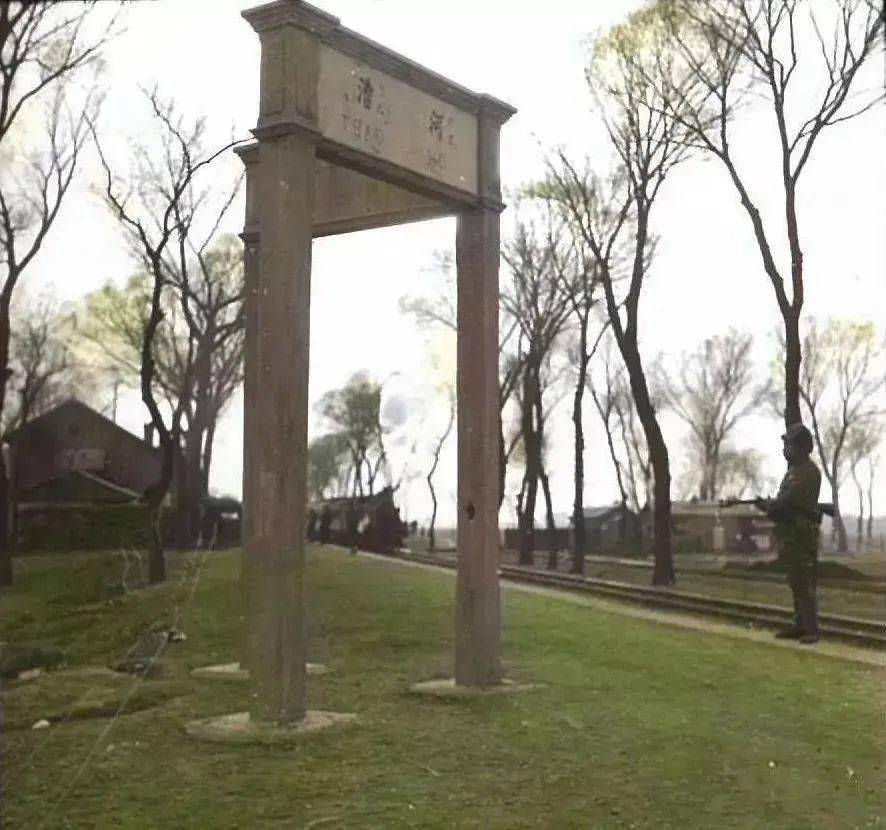
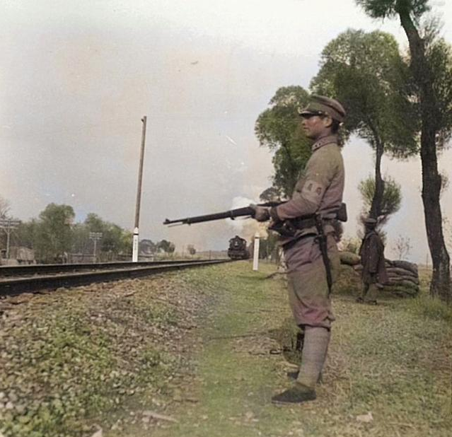
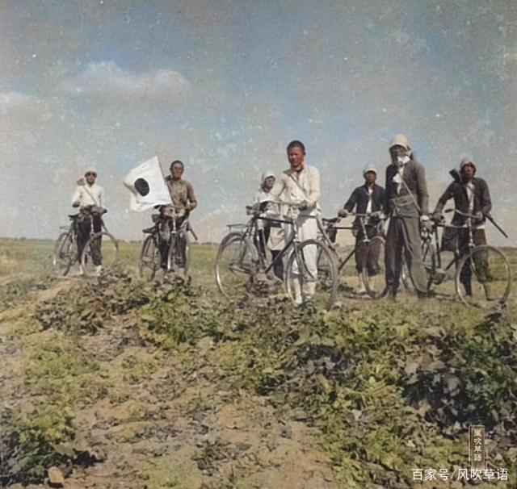
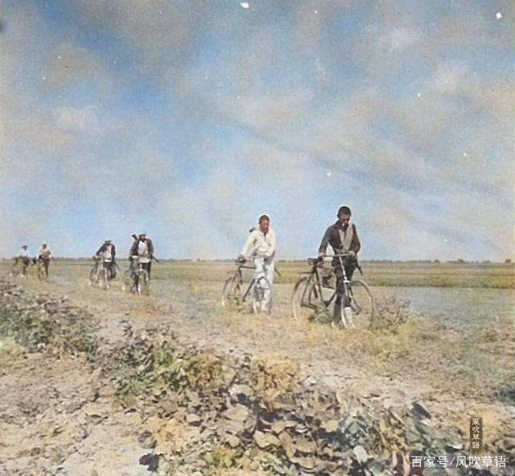

# 抗战期间武工队与汉奸便衣队的一次偶遇

| 项目 | 内容 |
|---|---|
| 类型 | article |
| 作者 | 言信 |
| 收藏时间 | 2026-03-28 09:01 |
| 发布时间 | - |
| 收藏夹 | 抗联 |
| 原链接 | https://zhuanlan.zhihu.com/p/2021144252189607875 |

## 正文

早年间我搜集抗战史料，也会搜集各种抗战故事，遇到有意思的或不可思议的故事，我会单独放起来作日后的分析整理。八路军与汉奸部队遇见后“不打”便是其中比较瞩目的一类。

现在人们一谈起“抗日战争”，当然我指的是我所熟悉的晋察冀抗战，都会很自然产生一个认识误区，以为所有战斗都是八路军同日军打的。但实际上，八路军与日军之间的战斗只占了大约一半，另一半是八路军与伪军之间打的，中国人打中国人的战争。

我在八九十年代搜集晋察冀抗战史料，其中也搜集了很多抗战故事。只不过我的审查比较严格，由于有很高的认知起点，像“神炮手”、“狼诱子”这样的自己编造的民间故事是过不了我这一关的。而像蔺柳杞那样的“八路军在黄土岭做成一个包围圈，然后让较弱的三支队将阿部规秀引进包围圈”，“请君入瓮”这样错误认知的民间故事，虽然知道“不真”，但我是用了很长时间才揭穿否定它。

八路军与伪军相见，是不是一见面就“开打”，刀枪相见，打到胜败乃分才会罢休。实际张开战只占到一半，另一半双方是不必动刀动枪的。《马辉回忆录》和其他一些抗战回忆录都真实记录了这一状况，那一时间，更多的是斗智斗勇、还有人性的展现。否则，八路军与伪军每次相见必然开打，积下血海深仇，就没有1945年以后的大批伪军被八路军吸收，又成为八路军的战斗力量。

我讲的这个抗战期间汉奸的故事，都发生在保定周边，八路军与伪军近距离相遇而没有发生流血战斗。没有动刀动枪，不代表中国人的怯懦，也表现了中国人的智慧：中国人之间的战斗，表现得却是中日之间的矛盾斗争，中国人犯不上为日本人卖命。在日本人看不见的地方，中国人之间如果不是极端为日本人效力的汉奸，都可以“装看不见”，放对方过去。

我以前曾分析过晋察冀八路军与伪军的各自战斗力。在人数上，这二者大致相等，八路军在抗战高潮的时候人数上超过伪军，而在抗日形势低谷的时候又弱于伪军。在斗志上、战斗意志上，八路军要优于伪军；但在枪支弹药上伪军要优于八路军。特别是，伪军有一个强大的后台：日军，而八路军孤立无援，所以只能依靠自己的力量，苦苦支撑。

伪军，华北的伪军被称为“华北治安军”，其中不乏京津保定几大城市的学生、青年农民，城市贫民。所以同八路军打起来，战斗力不是很强，如果没有日军在一起行动，晋察冀八路军一般不会输于伪治安军。但伪治安军中的“便衣”另当别论，这些便衣又被称为“特务”，战斗力强于穿军装的伪治安军。

这些“便衣”中有些是叛变的前八路军所组成的，这些便衣的“薪资”待遇较高，当一般穿军装的伪军月饷只有几块钱的时候，这些“便衣”能达到三十多元，“便衣队长”能达到六七十元。所以当年晋察冀八路军有个不成文的规定：对穿军装的伪治安军一旦放下武器都可以宽大，但唯独对这些前八路军组成伪军的不能宽大，缴枪了也必须处死。

姚雪森的书中如实记载了抗战胜利后，日军都撤走了，原日伪军联合驻守的碉堡炮楼都只剩下伪军在驻守，八路军趁机攻打炮楼。距易县县城不远的后山，今天统称洪崖山文化，是个民间信仰的游览胜地，而且香火仍然旺盛，经久不衰。

抗战年间这里有一座大炮楼，清一色都是当年叛变的易县籍的八路军战士所把守的。他们非常清楚，一旦炮楼被八路军攻克，他们都不会受到宽恕，只有死路一条。所以他们在八路军的围攻下只能拼死据守，除非弹尽，子弹打光了，否则绝不缴枪。事实也的确如此，这座炮楼打下后，由于给攻打炮楼的八路军造成了伤亡，所以八十多从八路军叛变过来的伪军俘虏全部枪毙，只放走了其中一个半大的孩子。

一谈起易县的汉奸，就不能不从赵玉昆谈起，易县好像没有比他更大的汉奸了，当年在八路军里的“官”比团长都大。我看现在谈赵玉昆的文章，都把他给简单化了，好像见八路军就打就杀，其实他是一个复杂性格的人，也是有多面性的。他有手段，所以能在八路军里当到那么大的干部、能被发展入党、还被特邀参加一分区党代会。1940年3月他叛变投敌时，距党代会结束仅一两个月，没有一个人，包括他身边的政委王道邦察觉到他的叛变。

赵玉昆有一张重要的“王牌”——“放生论”，至今很多人都不知道。1949年4月，赵玉昆在北平被发现被捕，随即由北平市公安局侦讯处预审科科长吕岱对他展开了审讯。有意思的是，当时驻守天津的杨成武二十兵团的保卫部部长杨卓，抗战时期的一分区锄奸科科长，以及当时华北军区司令员聂荣臻派来的保卫干部都参加了对赵玉昆的审讯。由于询问了许多敏感的内容，这份审讯词至今都被列为“绝密”的范围，没有对外公布过。

在审讯中，赵玉昆供述说，我对昔日的老同事都是手下留情的，很多人能活下来，都是我有意放生的。比如1940年赵玉昆叛变时，他可以首先将政委王道邦抓起来关押，但他没有那么做，而是有意造成看管不严的疏漏，让王道邦有机会逃走。恰好不愿跟着赵玉昆一起叛变的宋学飞派警卫员进村，悄悄接走王道邦，赵玉昆、宋学飞这一放一接，使王道邦获得一条生路。

赵玉昆“放生”的有许多人，姚雪森等人被扣押，赵玉昆说他们还是孩子，于是放走。唐珂（解放后一直在战友文工团）的大哥原是赵玉昆部队的粮秣官，因全家人都在八路军效力，所以被日军关押，眼看性命不保，要被处死。在死刑前的一个深夜，突然看守的岗哨被撤走、牢门也被打开虚掩着，唐珂的大哥一看机会难得，趁机溜回家去，捡得一命。事后得知，是作为把兄弟的赵玉昆安排的，只为糊弄过日本人。

再看几个被俘的八路军知识分子，原易县支队教育干事潘可西，潘汉年的侄子，日军扫荡时被抓进易县监狱，不是赵玉昆发话并关照，这个上海人不会活到抗战胜利。还有江苏人瞿世俊、瞿秋白的侄子，被俘后每次审讯大骂赵玉昆“狗汉奸”。这让赵玉昆很为难，杀他不是，也不能放他，只好把瞿世俊转到北京西苑战俘营关押。在西苑战俘营的瞿世俊脾气不改，依旧骂日本看守，结果被骂恼了的日军士兵杀害。

令我惊奇的是，当我开始在易县搜集一分区往事的时候，竟有易县当地人为赵玉昆说好话。赵玉昆是易县东邵村人，一个当地人说日军在东邵村附近要屠村杀人，都是被赵玉昆制止的。当日军在北淇村、菜园村屠村杀人的时候，赵玉昆无法制止，因为他隶属于独混15旅团，而屠村的是日军110师团的110联队，不一个系统，杀人时赵玉昆不会在现场。

当地老乡特意对我说，1941年日伪军围攻狼牙山五壮士，直至五壮士跳崖殉国，竟然无一受伤挂彩。因为冲在第一线的是隶属于易县警备队的伪军，不是日军。而伪军对八路军手下留情，他们原本是要俘虏这五名战士的。我做这些叙述，不是为赵玉昆这样的汉奸说情，我只是说，人性是一个非常复杂的东西，用简单化是说不清的。

早在赵玉昆叛变之前，一分区组织科、锄奸科未雨绸缪，对一分区的干部们有过一个综合分析。在这个分析中，他们把贫苦出身的赵玉昆列为依靠扶持对象，把大地主出身的宋学飞列为怀疑限制对象，出发点就是共产党看家理论的“阶级分析”。

贫下中农出身的赵玉昆当过东北军的大头兵，连班长都没当过，最辉煌的时候也只是个杀猪的屠夫。比起大地主出身的宋学飞，且当过东北军的营长，赵玉昆是不是更符合中共阶级路线中的争取依靠对象。但最后背叛八路军投奔日本人的，恰恰是处在社会底层的赵玉昆而不是大地主阶层的宋学飞，这是不是有点“反常”，与党的“阶级分析”背道而驰。

抗战年间，整个易县适合于背枪从军的人数，约有万余。其中约半数参加了八路军或抗日政府的地方民兵，其余半数在日伪统治之下，或者投靠赵玉昆当了伪军，或者在地方守炮楼子，或者参加了“护陵队”这样的地方武装。易县原本不大，双方都是亲戚套亲戚的关系，断了骨头连着筋，所以你中有我、我中有你，相互叛来叛去的情况并不罕见。

生怕在战争年代被“自己人”在背后打黑枪的赵玉昆，采取“放生”和“宽大”的做法，是为了收买人心，这也是他的复杂性格具有远见的一面。他从八路军叛变后，依旧对老部下宋学飞、张琴南的家属予以关照，严禁部下去骚扰，这一举措连聂荣臻都产生错觉，以为宋学飞真的与赵玉昆有勾结。相比之下，杨成武的为人更加准确：用人不疑，对宋学飞始终信任。

再讲一个故事。在一次非常规行动中，八路军武工队的一个小分队意外与汉奸便衣队相遇，但双方都没有开枪，装作没事人一样各自离去。讲这段故事的人，原本讲杨浩在1943年底，奉命将一个送款人从房山石楼护送进北京，到杨成武夫人赵志珍的大哥开办的一家贸易商行。但在石楼，意外与一个脸熟的汉奸便衣相遇，双方都乘坐同一辆客运公交车。但双方不知出于什么考虑，看出对方的身份但都没有说破，就这样平安直到分手。

讲故事的人说，当时地点在日伪统治区，不远处就是日伪据点，但那个认识杨浩的人没有呼叫。他们都公开挎着驳壳枪，杨浩的身份证明是在保定一个特务机关缴获的一张特务证，签发机关是北京的日本华北派遣军情报部门，是被派去搜集八路军情报的。这是一张一次性的特务证件，很可能早就作废了，但很难查对。杨浩带着它在敌占区蒙事，有一定的安全性但也不能过分依赖它，因为一核对准露馅。

当我对这件故事质疑的时候，讲故事人对我讲述了保定包子铺的故事和下面的故事。

大约在1942年的秋天左右，随着“五一大扫荡”后冀中抗日根据地的沦陷，面对敌强我弱的战争形势，八路军采取了一种新型的战斗方式“敌后武工队”，用小部队、便衣、渗透的方式，打入到敌占区去开展工作。一分区的武工队由每个主力团组建一个，相当“连”的规模，百余人；每个武工队又分为三个各自三四十人的小队；每个小队再分为三个十来人的小分队。

因为武工队的小队、小分队有比一般作战部队更大的活动自主权，所以才发生了下面的故事。

晋察冀的“冀”，指的是河北省，一条南北贯穿的平汉线铁路，将河北切分为“冀中”和“冀西”。冀中是大平原、产粮区；冀西是山区，相对贫瘠，当年的晋察冀八路军因为来自山西，所以是从贫瘠的冀西山区兴起的。这些从冀西山区参加八路军的老抗日，很多人从没见过铁路和火车，更不用说坐过火车了。

武工队成立后，以小分队为基本力量渗透进冀中各村，打击日伪汉奸，壮大抗日力量。小分队单独活动，但很多武工队员的一个心病，就是从未就近看过火车，只是在远远见过火车驶去，当然就更别说坐过了。有的小分队战士在私下里小声议论：只要能坐过一次火车，哪怕马上牺牲也知足了。

消息传到小分队的分队长那里，一个班长，能有多大的水平，他悄悄跟当地的区委书记，一个抗战那年从保定二中出来的女学生商量：有没有机会，让他们这十来个队员，集体乘坐一次火车，哪怕短短的一段路程，以满足大家的心愿。

几年以后，反映冀中抗战的优秀电影《烈火金刚》上映，给我讲这段往事的老人对我说，你看看电影中宋春丽饰演的女区委书记，当年的那个女学生提拔的区委书记就是这个样子，也是这样清秀挺拔、做起任何事情干脆利落，几乎跟电影中一模一样。

就是这个“干脆利落”，差一点酿成大错。战争年代，县委机关都隐藏在你不知道的地方，你没有地方去请示，又不能无限期等待，于是女区委书记就自己做出决断，豁出去带领这个十来人的小分队坐它一次火车。火车上车下车，都是在一分区控制的地盘内，铁路线以西是一分区管辖、以东原本是冀中九分区的地盘，虽然冀中军区没有了，但九分区班子还在，这位女区委书记就是冀中九分区的管辖干部。

这是很短的一段路程，从高碑店到定县的区间火车，北洋时期留下的旧火车厢，介乎于客车和货车两种作用，属于地方农民底层乘坐的车厢。无论是挑筐的农民还是挎篮走亲戚的妇女，这种区间火车最适合他们。如果从方顺桥或定兴县车站上车，十几分钟后在漕河车站下车。漕河车站在保定火车站前面，上下的地方旅客很多，他们不经过日伪军的老巢保定，不出意外，这十来个人的安全是没有问题的。

 
<figure data-size="normal"></figure>
<b>抗战期间的徐水漕河车站</b>

 
<figure data-size="normal"></figure>
<b>防守漕河车站铁路线的伪军警备队</b>

我记不清是方顺桥还是定兴上车的了，十来个小分队成员，都是当地农民打扮，挑着筐或麻袋，短枪随身带着。当年武工队的武器装备是每人一长一短，一分区每个主力团的侦察连也是这个标准，有的武工队就是侦察连换个牌子，同一套人马。可能是不放心，那位女区委书记亲自跟随，扎着假发髻装扮成农家妇女跟着小分队一起上了火车。

对稍精明一点的人来说，无论八路军还是日伪军，稍注意一下都会发现这是一个很成问题的组合。十来个精壮农民汉子，目光炯炯，占据着车厢的一角，围坐着一位年轻的农家妇女。这是一个一旦发生意外的战斗队形，当地农民有这么出门的吗？他们应该分开坐会更加融合于当地的民众，强壮的树干藏于森林之中会更不显眼。

上车，进车厢，坐下，等候发车，一切都很顺利，没有出现任何意外。但就在火车刚刚启动，车厢来回咣当的那一阵，意外发生了。一伙人就在火车发动的那一刻，赶到了车站，他们没有买票，直接急跑着冲进车厢，恰好就是小分队乘坐的那一节车厢。他们急匆匆地跑进车厢，总计十来个人，斜挎着盒枪，落脚点也就在小分队的旁边。由于事发突然，那一时间，双方都吃了一惊，僵在了那里。

对方领头的，是一个梳着大分头的大个子，圆眼睛、络腮胡子，他一眼就看出眼前这十来个人不寻常，于是开始打量小分队这些人。由于刚发车不久，车厢里空位很多，大分头的手下已经有人先找到空座位坐下了，但大分头没有坐下，他在一个精壮汉子的陪伴下，继续站在刚进车厢的地方，边打量小分队、边思考着什么？思考什么，我猜他是在思考双方一旦动手，各自的胜负比和损失情况吧。

小分队也看出眼前刚跑进车厢的这伙人很不一般，他们虽然也是年轻人，但透着一股汉奸便衣队的邪气，和当地农民的老实巴交、特别与八路军武工队的正气十足截然不同。看来双方都清楚知道自己的对面是敌人，但是不是动手还把握不准，因为双方势均力敌，动起手来谁都占不到绝对的便宜，很可能是死伤惨重的混战一场。

猛然间，大分头眼光一闪，原本凶狠的眼光变得柔和了，他先躲避开双方交织的目光，扭头转向了自己那一伙人，打算坐在自己人中间。看来是他打算装傻放过对方，也寄希望于对方也能放他们一马。大分头身边那个精壮的人反应就慢了许多，他刚刚发现了眼前这帮十来人的小分队很不一般，是那股与众不同的精气神很不一般。他把脸转向大分头，开口说：“大哥，这些人好像不是本地人，要不要盘问一下？”

大分头用头上的黑呢子礼帽抽打了精壮汉子一下：“见你的鬼，就你事多？我们今天的事还忙不完呢，你找那么多事干什么？”

火车尽管是慢车，但短途一站说话就到，火车放慢了车速，漕河车站就要到了。一看目的地到了，女区委书记做了个手势，大家立即起身，拎起麻袋和柳条筐下车。大分头他们坐在对面斜着眼看着，没有干预也没有阻拦，眼瞅着他们走出车厢，又大步走出漕河车站。早就在那里接应的地方干部赶着两辆大车，然后飞快地走向火车站东边的村子。

事后得知，这伙便衣队是赶到保定去的，但在半路上意外与他们相遇。但双方都没有做好“要打一仗”的准备，事情就这样过去了。这样的事情不是“孤例”，以后还发生过两次，而且还都发生在日伪统治区，一次是保定西大街、另一次是在房山的良乡，以后有时间再慢慢讲来。

 
<figure data-size="normal"></figure><figure data-size="normal"></figure>
 

<b>这是汉奸的便衣队，不是八路军武工队，仅从外观上你很难分辨出来。</b>

八路军、汉奸队，都是中国人，抗日战争，一群中国人在那里打仗，日本人在一边看热闹，总不是好事。于是有些中国人看明白了，与八路军相遇时，不再“真打”，而是“假打”，这就是这段故事的真谛。

当有朝一日，中日之间再次爆发战争，一群中国人——当代的伪军来打头阵，与当代的八路军——解放军相遇，中国人再次打中国人，这些当代的伪军是“真打”还是“假打”，糊弄日本人，有谁能说得清呢？

---
导出时间: 2026-08-23 19:06