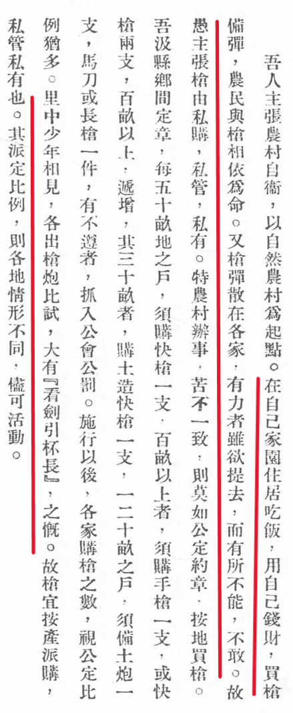
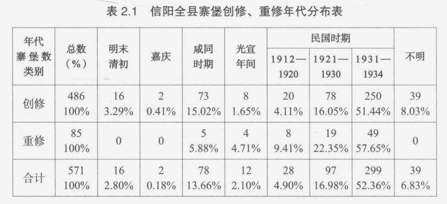
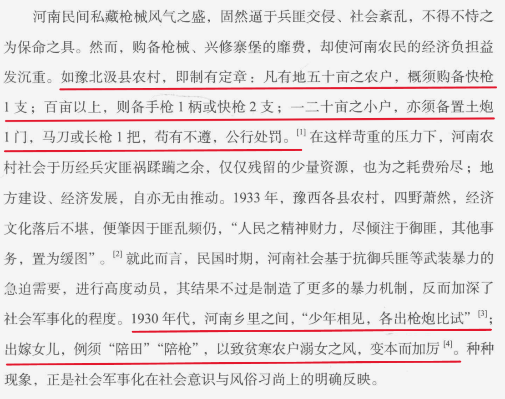

# 历史上有哪些让人印象深刻的地狱笑话？

| 项目 | 内容 |
|---|---|
| 类型 | answer |
| 作者 | 壮叭 |
| 收藏时间 | 2026-03-07 15:31 |
| 发布时间 | - |
| 收藏夹 | 抗联 |
| 原链接 | https://www.zhihu.com/question/1946253398891553373/answer/2013637931336738727 |

## 摘要

1930 年代，河南乡里之间，少年相见，各自掏出枪炮比试；农民在自家住居吃饭需要买枪备弹，与枪相依为命。 [图片] 进入民国后，河南匪患相比辛亥前更为严重,吏治腐败,政以贿成,政治秩序荡然无存,益以兵燹连年,旱涝时作,民无生路,纷纷聚众拉杆,铤而走险。尤其自 1922 年河南督军赵倜败溃,属下宏威军七八万人散而为匪,烧杀劫掠,掳人勒赎,无所不至,河南寇盗遂与军队合流,一变而为“兵匪”。兹后,军队败溃则为匪,土匪受抚则为兵,辗转相寻,习…

## 正文

<h3><b>1930 年代，河南乡里之间，少年相见，各自掏出枪炮比试；农民在自家住居吃饭需要买枪备弹，与枪相依为命。</b></h3><figure data-size="normal"><figcaption>农村自卫研究（王怡柯）104页</figcaption></figure>
<b>进入民国后，河南匪患相比辛亥前更为严重,吏治腐败,政以贿成,政治秩序荡然无存,益以兵燹连年,旱涝时作,民无生路,纷纷聚众拉杆,铤而走险。</b>尤其自 1922 年河南督军赵倜败溃,属下宏威军七八万人散而为匪,烧杀劫掠,掳人勒赎,无所不至,河南寇盗遂与军队合流,一变而为“兵匪”。兹后,军队败溃则为匪,土匪受抚则为兵,辗转相寻,习为成规,匪祸随之益形蔓延,1920 年代的中原大地萑苻遍野,荆棘满地,已成家喻户晓的“土匪世界”。根据日人长野朗调查,1923-1924 年间,河南知名盗匪约有 42 股,25000 余人;另据何西亚估计,1924 年河南各地杆匪凡 52 股,51000 余人。实际上,若再加上零星小股及未经调查者,斯时河南土匪总数当在 12 万人以上,平均每县有匪千人左右,其中临汝一地即有土匪 12000 人,洛宁县亦达 7000 人之谱,殆可谓遍地皆匪。从而河南在民国时期盗匪为祸之烈,甲于全国。著名巨匪如白狼、老洋人之纵横数省,震惊中外,固为显著例证,即寻常股匪,踪迹所至,亦不免举目蒿莱,蹂躏殆尽。据估计,自 1912 年以迄 1928 年,河南仅 27 县之地,便发生大小匪乱 630 起。其他如豫东僻邑沈丘县,在 1922 年至 1933 年十余年间,土客杆匪凡数十起,小者不下数百,大者无虑数千,县城被破三次,村镇集寨陷于匪者不知凡几,无告小民惨遭屠戮,肝脑涂地,劫后灾黎辗转沟壑,鹿独流离。豫南邓县向称繁庶,乾隆时民口 80 余万,共和以来,连年匪乱,至 1933 年时,耕地荒废者竟达 11000 余顷,几占全县农地之半,编氓口数更锐减至 40 余万。豫西新安、渑池一带民谣有曰:“白日不敢出外跑,黑夜不敢听狗叫,一听放枪炮,人人胆破了。”1930 年底,红十字会调查豫东兵匪灾情报告书中更是一字一泪地描绘出匪寇荼毒的惨况:
<blockquote data-pid="c89xKgOY">土匪蜂起,烧杀掳掠,架人勒赎,甚至烹食婴孩,惨无人道,……人民不死于岁,即死于兵,(不死于兵,)即死于匪。过其地,但见瓦砾堆积,墙壁残余,不见炊烟,徒闻腥血,奄奄待毙之子遗,令人望而下泪。</blockquote>
以上所述,不过胪列河南匪患之片段,而其酷烈已一至于斯,是全豫所罹祸殃之严重,实难想象。时人所谓,民国时期,土匪、军队与“土豪劣绅”并属河南社会重大祸害,殆非厚诬之辞。

<b>民国时期,河南匪盗丛滋,根本症结固须归于政治、经济环境的败坏,不过,从社会流动的角度而言,盗匪普遍化的现象,却与地方精英之多元化密切相关。</b>溯自辛亥年间,河南革命党人部署起义,积极笼络豫西绿林豪杰,畀予王天纵丁部大将军之名号,遂开招抚盗匪之恶例。此后军阀混战,故智相师,莫不招匪纳寇,以为扩充实力之手段。1920 年代,河南盗匪之接受招安,改编正式军队者,屈指难数,如张庆(老洋人)、宋一眼等皆其中之尤,而刘镇华、张钫等巨公名流麾下部队,更不啻土匪之化身。如此一来,拉杆啸聚,弄兵潢池,蔚为志士豪杰升官发财的终南捷径。王怡柯论河南匪患,即有如下讥刺:
<blockquote data-pid="bKOuPcV3">……今则何如?百人成杆,踌躇四顾,待价而沽。时则有军界领袖、政海要人,纷往勾结,竞相罗致,现款若干、地位某级,视其高者、厚者而从之,蔑有不售。</blockquote>
<b>在此有利诱因推动下,社会风尚与价值观念自不免为之丕变。</b>民国年间,河南各地普遍流传“要当官,去拉杆”之俗谚;若干“匪乡”甚至出现“父诏其子,兄勉其弟,妇勋其夫”,争相为匪的局面,苟有不从,则“妻室恨其懦”,其愿为匪,则“父老夸其能”。《阌乡县志》便明白指陈:
<blockquote data-pid="egHxAwxw">近岁地方不靖,绿林伏莽,一经收抚,则归乡自豪,而无识少年,因视此为升官发财捷径,野心勃勃,为盗渊薮。</blockquote>
揆诸实际例证,由盗匪转化为地方精英者,可谓比比皆是。如伊阳人范龙章于 1920 年代初落草为寇,迭抚迭叛,至 1930 年代已升任二十路军旅长,于禹县、漯河屯驻期间,贩运烟土,制售毒品,居然在其家乡置地 700 余亩,一跃而为当地四大豪绅之一。1933 年豫西临汝民团司令王某,赫然便是昔日土匪司令。1934 年渑池县著名杆匪常邦彦竟与现任区长角逐区长之职位。另一方面,地方精英之通匪庇匪、分肥窝赃等情事,亦属屡见不鲜;绅匪不分、熏莸同器的报道更是层见叠出,不一而足。1929 年遂平县不肖士绅便一度勾结股匪,联合暴动,劫监释囚。直到 1933 年,南召土劣犹与土匪狼狈为奸,甚至自造枪炮,供给土匪,并凭借后者势力,宰制全邑,“县长、区长等也必须听他们的话,否则便不安于位”。狄德满也曾指出,华北土匪领袖阶层不乏“身家清白,受过良好教育之人”。<b>然则,民国时期河南匪患猖炽,固然显示出社会军事化进程的加剧,同时也反映了在社会秩序解体、地方权力结构重新编组的历程中,带有高度强制性的武力资源,再度成为巩固地方精英支配地位的一大支柱,且其重要程度,较诸 19 世纪中叶有加无已。</b>这种情形不独于掠夺性的土匪集团为然,即便是处于防御性位置的民间社会,亦不能不受其影响。

<b>在兵匪交侵、荆天棘地,而官府不足仰恃的恶劣处境下,河南各地绅民为保身家性命之安全,其舍转聚自卫一途,实无他策;而其入手之方,要不外乎昔日对抗捻军的故步遗辙。于是,民国以降,全豫境内,寨垣棋布,民团蜂起,整个河南农村社会几彻底转化为一个以“制造暴力”(production of violence)为首要目标的武装组织,社会军事化的长期进程至此达于无以复加的地步。</b>民国《信阳县志》对此即有一段典型的描述:
<blockquote data-pid="PBH9a-Y5">六区吴家店向为商务辐辏之处,匪人垂涎尤甚。民国初尝一破于白狼,再扼于杆匪,创巨痛深,人咸思奋。近年乃实行坚壁清野法,将寨垣增高培厚,添筑炮楼多座,于雉堞上满布铁丝网,排架罐子炮、快枪、机枪,撩钩、搭钩各守具,民团勤加训练。平时间谍四出,稽查严密;有警,虽富家子弟无不荷械守陴。</blockquote>
兹先就寨堡修筑略做说明。前已述及,咸同年间,基于堵御捻军的需要,河南各地已普遍兴修寨堡,以为坚壁清野之计。嗣后承平日久,旧有寨垣,渐就颓圮;清末民初,间有重修新筑,为数尚鲜。及 1920 年代,兵匪迭作,全豫大扰,寨堡碉楼遂又应运而兴,其数骤增。如新安县于 1927 年后,“兵匪交警,焚杀县境几遍”,阖邑官绅乃倡议筑寨,“或修葺古迹,或奉请赈款新造,凡为寨五十有六”。1933 年行政院农村复兴委员会调查队于豫北滑县,自县城以至离城三十里之九区区公所,沿途所见稍大村镇,概皆筑有土寨,朝开夜闭,以防匪患。《重修信阳县志》罗列全县寨堡凡 486 座,由其修筑年代之分布,更可窥见民国时期筑寨自卫风气之盛:
<figure data-size="normal"></figure>
从表 2.1 可知,咸同时期与民国时期为信阳修寨的两大高峰,而民国时期的寨堡数目,无论新建、重修,尚且远居前者之上,在 571 座新旧寨堡中,便有 424 座修葺于 1912 年之后,所占比率高达 74.26%。此虽系信阳一隅之状况,唯稽诸各县相关记载,殆与全省普遍趋势相去不远。

民国时期河南各地寨堡,形制互异,广狭不一,其小者,夯土成围,工陋费省,所容不过数十人;至其大者,依山筑垣,砌以砖石,高雉深壕,俨若金汤,如陕县温塘寨,耗时期年,周长四里半,号称“小城池”。信阳游河镇寨,系就旧基改建,添设炮楼,可容三万余人,为申西一大保障。唯不论其规模大小,这些寨堡大致均为地主士绅等地方精英所控制。赵纯于 1930 年代初期考察南阳唐河间农村状况,便指出,当地筑寨者多为富裕之村,平日将贵重财物存储寨内,匪至则携眷牵牛避入其中。大寨皆有寨主,率由豪富势家担任,统制寨务,乱时,寨内欢迎外村逃难人户,以增厚势力,无寨可守的外村居民亦多赖之保全性命,彼此互利相依,构成一个以自卫为宗旨的武装共同体。1932 年,河南省主席刘峙在豫南发表演讲,亦谓豫南各乡农村每多筑寨自守,各寨寨主概系田连阡陌,“平日把持一切,鱼肉乡民”的地主豪绅,寨中雇有许多贫农游民执械守御,究其实质,“是地主的武力,并非民众的武力”。而若干零星实例,尤足明白显示此中消息。如 1926 年豫东考城巨富吕某,独居一寨,昼夜出入,皆有壮丁数十巡逻护卫,寨中储藏金银米粮,不可胜计,远近匪寇屡欲染指,而寨垣坚固,防御周延,莫可如何。

与修筑寨堡相倚相成,并轨而行者,厥为民团之类地方武力的崛起。这些地方武力,自系承袭清代团练遗绪发展而成,唯其名目之繁多、数量之庞大,则为前清所难企及。

<b>就其性质而言,河南民团大致可分两类:一为由官府推动,具有半官方名义之地方团队,一为纯系私人编练的民间武力。唯此二者界限不明,时生混淆,实难严格区划。</b>

清末民初,地方不靖,伏莽潜滋,河南各地即曾陆续筹办乡团,以备不虞。宣统三年(1911)八月,河北道石庚曾督同武陟知县曾广翰,招集士绅多人,商订章程,于城关设筹防局,募勇百名,严加训练,巡缉守卫;复饬令各乡村镇分设守望社,“藉资接应”。同年十二月,太康县令以会党谋乱,局势危殆,乃大练民团,分全境为 88 区,第为三等,上等练勇 300 名,中等 200 名,下等 100 名,统名曰守望团,由士绅公举团长统带,时加督训,筹措战守。嗣后,各县团队继踵纷起,名义屡更,存废不定,要皆不脱官督绅办、兵由招募、器械给养概仰地方摊派供应等基本模式。兹以阳武县为例,对其演变过程,略做说明如次。

先是,阳武县境于民国初元各地方皆有守望社之筹设,至 1912 年改称保卫团,唯以经费无着,名存实亡。及 1921 年,县知事孟平复划全县为五区,每区各办民团 1 队,置队长 1 员、团丁 10 人,就地筹款、分头购枪。1927 年,开封省垣设民团军总司令部,阳武民团遵章改组为民团军,团丁扩编至 150 人,各区别设后备民团军。次年,又改民团军为人民自卫团,实行缩编,直隶于省自卫团部。1931 年,河南省政府着手整编地方武力,各县常备民团(即人民自卫团)一体改称保安队,统归省保安处管辖;各区后备民团则改编为保卫团,以县长兼任总团长,各区区长兼任该区分团长,服装薪饷等费,一由地方摊派。及 1932 年,河南停罢自治,改行保甲,地方团队,再起变化。阳武县保安队即于斯时改称保安大队,其后复缩编为保安中队,移驻开封;各区保卫团则一律撤销,改按保甲编制,调训壮丁,另组壮丁队。[]至是,阳武地方团队,一如河南各县,在名义上统归于政府之号令。1934 年,一位作者在综述民国以来河南地方武装性质之演变时,便认为自 1931 年后,河南所有民间自由组织之武装已为官府统制之“官僚武力”所取代。

虽然,民国期间,河南各地除上述官府编组之正式民团外,其由地方绅民自行团练,不奉节制者,所在多有。1922 年杆匪舒德合盘踞林县,剽掠四野,各区绅民知官与兵皆不足恃,相率立民团,三日间集城下者四五千人,攻围数昼夜,卒能驱逐匪众,克复县城。再如 1929 年,豫南罗山县地方豪绅纷起组织自卫武装,其中仅丁印坤一人即编练有民众自卫团 1 队,人枪 300,丁自任团长,经常配合政府军围剿。至若 1920 年代中期风起云涌,遍布全豫,最盛时成员多达 150 余万的红枪会,论其本质,实亦不外以“保卫身家,防御盗贼,守望相助”为宗旨的民间自卫武力,此所以地方志书每多将民团与枪会混为一谈。由是以观,民国时期河南地方武装组织规模之庞大、数量之繁多,盖难确切估量。

尤有甚者,纵或是政府认可之各县正规民团,表面上人数器械皆有定章,实则官厅鞭长莫及,无力控扼,以致潜滋暗长,日见扩大。民国《陕县志》便说:
<blockquote data-pid="P2lxAmRb">自(民国)十一年后,陕县迭遭兵祸,土匪乘隙而起,时有抢掠。三、四、五、六、七、八等区皆先后组织民团,专事抵御匪患,人数枪支多寡不一,队长由本区推举,呈请县公署委任。其后四、五、七、八等区,……民团人数枪支大事扩充,渐成私人势力,尾大不掉,官吏莫可如何。</blockquote>
即使到 1930 年代,河南省府虽极力整饬地方团队,大加裁汰,而各县地方武力固仍有增无减。如豫南光山县东南境于 1931 年被攻占,拥枪游民无处容身,纷纷投充该县第七区易本应所部民团为团丁,致该团人枪众至 5000,俨若正规军旅。再如商城亲区区长顾敬之所辖民团,人枪之数,亦不下 3000。豫南一隅,即已如此,阖省何如,自可想见。

伴随着地方武装组织的急遽扩张,河南民间拥有的枪械武器,自亦为数日增。据 1927 年河南民团局等机关所做调查,彼时散落河南各地的制式武器,计有大炮 52 门、迫击炮 600 余门、快枪 50 余万支、盒子枪(手枪)10 余万支,连同土炮及仿造枪械合计,总数殆不下百万;而各地工匠所设仿造炉子,又达 400 余处,每处每日可造快枪 2 至 4 支。兹后,河南连年苦战,流失民间的兵器弹药,复不知凡几。1933 年河南省府着手查验民枪,迄 1935 年 8 月,凡共烙印各县民枪 23.24 万余支,而隐匿逃验、拒不呈报者,更数倍于此。斯时全豫 100 余县,每县仅快枪一项,即无下于 1 万支者,豫西临汝民有枪支,更高达 8 万余支,至足惊人。

<b>河南民间私藏枪械风气之盛,固然逼于兵匪交侵、社会紊乱,不得不恃之为保命之具。</b>然而,购备枪械、兴修寨堡的靡费,却使河南农民的经济负担益发沉重。如豫北汲县农村,即制有定章:凡有地五十亩之农户,概须购备快枪1支;百亩以上,则备手枪1柄或快枪2支;一二十亩之小户,亦须备置土炮1门,马刀或长枪1把,苟有不遵,公行处罚。在这样苛重的压力下,河南农村社会于历经兵灾匪祸蹂躏之余,仅仅残留的少量资源,也为之耗费殆尽;地方建设、经济发展,自亦无由推动。1933年,豫西各县农村,四野萧然,经济文化落后不堪,便肇因于匪乱频仍,“人民之精神财力,尽倾注于御匪,其他事务,置为缓图”。就此而言,民国时期,河南社会基于抗御兵匪等武装暴力的急迫需要,进行高度动员,其结果不过是制造了更多的暴力机制,反而加深了社会军事化的程度。1930年代,河南乡里之间,“少年相见,各出枪炮比试”;出嫁女儿,例须“陪田”“陪枪”,以致贫寒农户溺女之风,变本而加厉。种种现象,<b>正是社会军事化在社会意识与风俗习尚上的明确反映。</b>
<figure data-size="normal"><figcaption>纷纭万端  近代中国的思想与社会 (沈松侨)</figcaption></figure>

---
导出时间: 2026-08-23 19:06