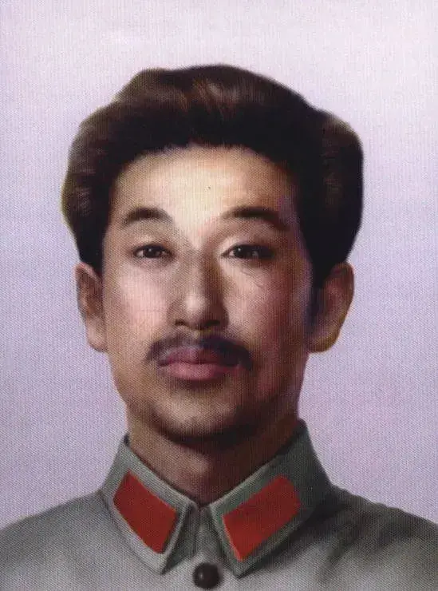

# 如何看待「以身殉国，罪减一等」这一观点？

| 项目 | 内容 |
|---|---|
| 类型 | answer |
| 作者 | momo |
| 收藏时间 | 2026-02-18 15:50 |
| 发布时间 | - |
| 收藏夹 | 抗联 |
| 原链接 | https://www.zhihu.com/question/6575748019/answer/2007482037863462669 |

## 摘要

这方面我觉得可以提一个人：赵尚志烈士。 [图片] 赵尚志将军的脾气，抗联高层提起来没有不骂街的：主观主义，暴躁，霸道，独断专行，与北满省委和李兆麟、戴鸿宾，王德泰等抗联高层关系都很糟，甚至还因为怀疑对方变节直接枪杀了抗联第九军司令祁致中，因为这个当时他还被开除了党籍。 但是，1941年秋，彼时杨靖宇将军牺牲一年多，抗联处于成立以来的至暗时刻，在成建制部队几乎全灭情况下，赵尚志将军带着五个人从苏联回国重新发展抗日…

## 正文

这方面我觉得可以提一个人：赵尚志烈士。
<figure data-size="normal"></figure>
赵尚志将军的脾气，抗联高层提起来没有不骂街的：主观主义，暴躁，霸道，独断专行，与北满省委和李兆麟、戴鸿宾，王德泰等抗联高层关系都很糟，甚至还因为怀疑对方变节直接枪杀了抗联第九军司令祁致中，因为这个当时他还被开除了党籍。

但是，1941年秋，彼时杨靖宇将军牺牲一年多，抗联处于成立以来的至暗时刻，在成建制部队几乎全灭情况下，赵尚志将军带着五个人从苏联回国重新发展抗日武装。

1942年2月，将军被特务刘德山背刺重伤被俘，八小时后不治身亡，致死还在对着俘虏他的伪军鬼子破口大骂。日伪锯下他的头颅，运往长春（伪满新京）邀功；无头遗体被抛入松花江冰窟。

关于赵尚志将军复杂充满争议的一生，1982年黑龙江省委《关于恢复赵尚志同志党籍的决定》是这么盖棺定论的：
<blockquote data-pid="hjZOd1al">赵尚志同志是伟大的抗日民族英雄，忠诚的共产主义战士，东北抗日联军的主要创建者和领导人之一。他为中华民族的解放事业英勇奋斗，坚贞不屈，屡建奇功，直至献出宝贵生命，<b>功绩是主要的，错误是次要的</b>。   赵尚志同志在领导抗日游击战争中，曾犯有严重错误，特别是错杀祁致中同志，是一个重大历史错误，给党的事业造成了损失。这一错误，主要是由于<b>当时历史环境的特殊性、与中央长期隔绝、个人思想作风上的主观主义、独断专行以及党内路线斗争的影响所造成的</b>。   1940年1月，中共北满省委作出《关于开除赵尚志党籍的决定》，主要依据是所谓赵尚志同志反对中央关于抗日民族统一战线的战略方针和企图捕杀北满省委领导人等问题。经复查，这些问题均属不实之词，应予推倒。   据此，省委决定：   1. 撤销1940年1月中共北满省委《关于开除赵尚志党籍的决定》，<b>恢复赵尚志同志的党籍</b>，推倒一切不实之词，为其平反昭雪。 ​ 2. 对赵尚志同志错杀祁致中等严重错误，仍应作为历史教训，实事求是地予以指出，以教育后人。 ​ 3. 恢复赵尚志同志的名誉，充分肯定他在东北抗日游击战争中的历史功绩，宣传他的革命精神和英雄事迹。   中共黑龙江省委 1982年6月8日</blockquote>
今天的黑龙江省哈尔滨市有个尚志市，就是以将军的名字命名。

---
导出时间: 2026-08-23 19:06