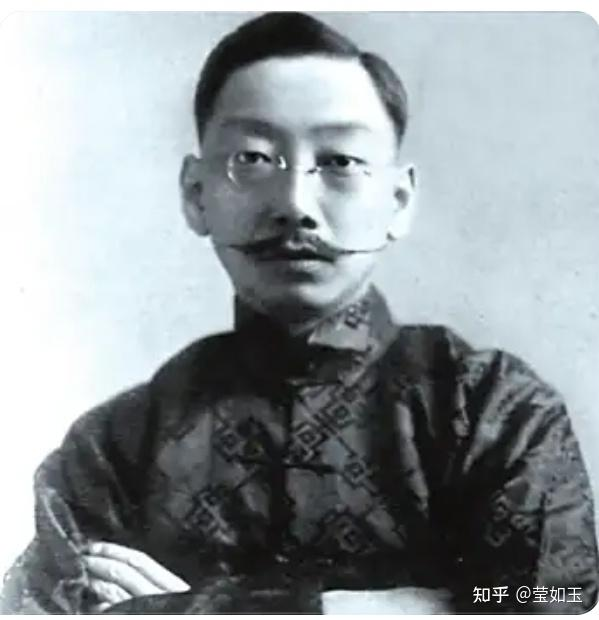
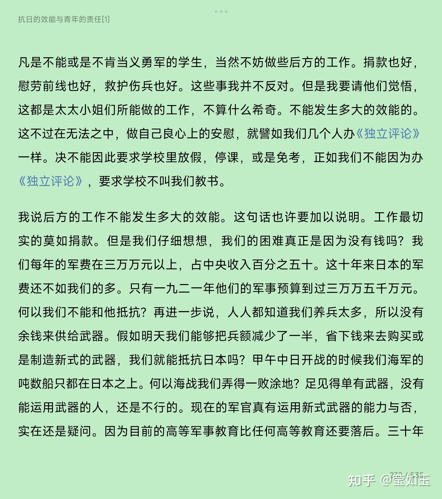
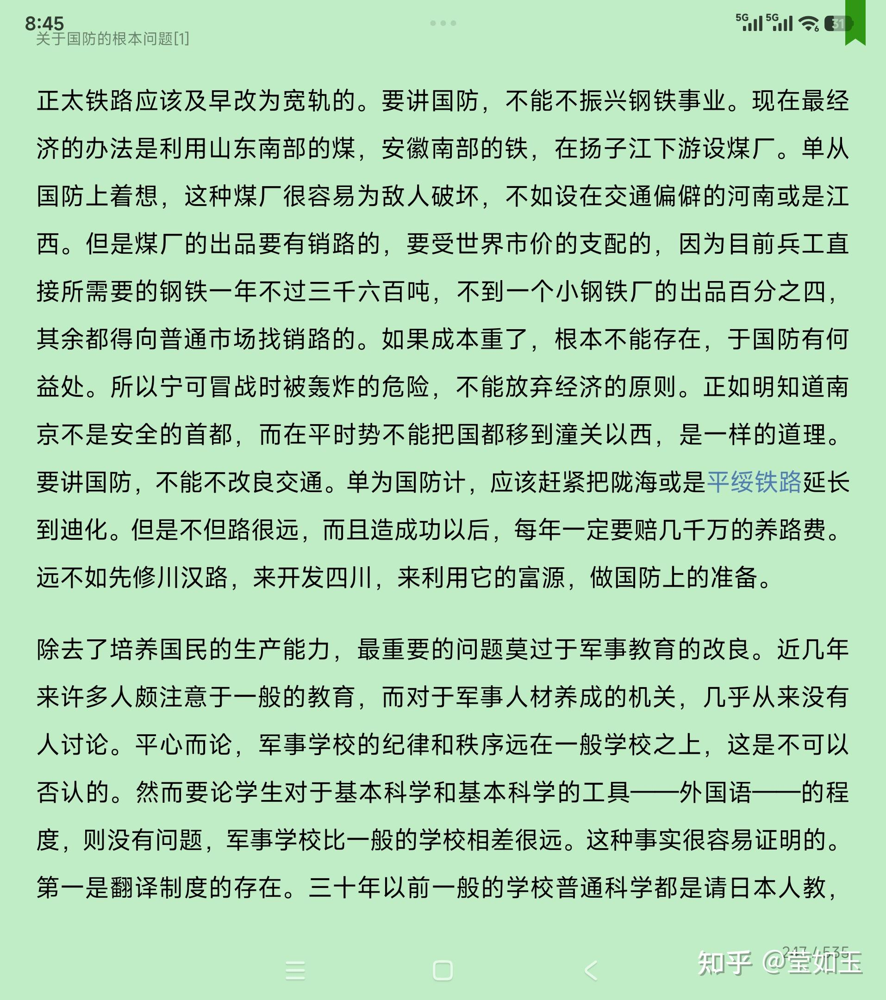
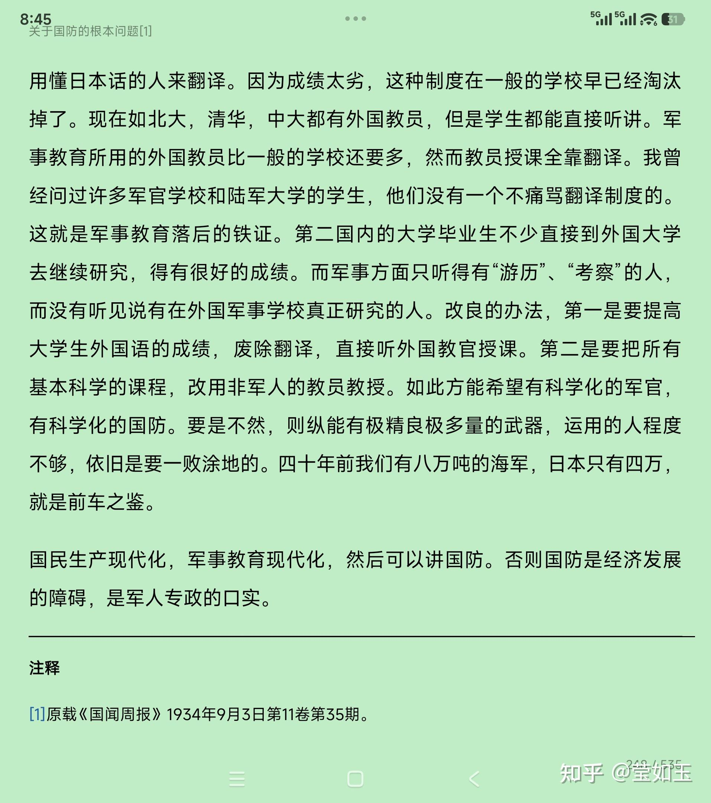

# 抗战14年期间中国人民有多绝望？

| 项目 | 内容 |
|---|---|
| 类型 | answer |
| 作者 | 莹如玉 |
| 收藏时间 | 2026-02-15 20:46 |
| 发布时间 | - |
| 收藏夹 | 抗联 |
| 原链接 | https://www.zhihu.com/question/64614406/answer/2006469493346542978 |

## 摘要

举一个坚决主张抗日，也很有眼光的学者丁文江的例子。他的抗日立场是毋庸置疑的，他的眼光也是有的，还很长远，坚决主张国共合作携手抗日，也不怕触蒋介石的霉头。 他于1933年1月公开发表了《假如我是蒋介石》一文，提出：假如他是蒋介石，第一要立刻完成国民党内部的团结；第二要立刻谋军事将领的合作；第三则要立即与共产党商量休战，休战的惟一条件是在抗日期间彼此互不攻击。但是，看丁文江客观分析中日国力对比的文章，就可…

## 正文

  举一个坚决主张抗日，也很有眼光的学者丁文江的例子。他的抗日立场是毋庸置疑的，他的眼光也是有的，还很长远，坚决主张国共合作携手抗日，也不怕触蒋介石的霉头。
<blockquote data-pid="FdKU-LKo">他于1933年1月公开发表了《假如我是蒋介石》一文，提出：假如他是蒋介石，第一要立刻完成国民党内部的团结；第二要立刻谋军事将领的合作；第三则要立即与共产党商量休战，休战的惟一条件是在抗日期间彼此互不攻击。</blockquote><h2>但是，看丁文江客观分析中日国力对比的文章，就可以看出他的绝望心情:&#34;打不了，没法打，不知道什么时候才能有实力打&#34;——然而，丁文江虽然绝望，却绝不主张投降，还是坚持要打，这，就是中国的脊梁:</h2>
 

在《抗日的效能与青年的责任  》一文里，丁文江痛哭&#34;我们是一个变态的国家&#34;:
<blockquote data-pid="01HBYD4k"><b>今天中国对日本的关系完全是变态的，通常国际的关系不是和就是战。我们的领土被日本占领了一年多了；上海的战争，我们死去好几万人，损失万万元以上；现在山海关又被日本占领了，而我们既然没有宣战，又没有议和！</b>…… <b>我们再问青年的责任是什么？青年应该做什么？</b> <b>这个问题也只有在变态的国家才会得发生的。假如中国的国家和欧美一样，全国的青年早已接到了动员令，拿着枪，背着包，“执干戈以卫社稷”去了。</b>那里还容你演说，捐款，贴标语，喊口号，视察前线，慰劳伤兵呢？因为这些轻松的工作，都是不能拿枪作战的人所能做的，轮不着青年的。做这种工作，决不足以尽青年的责任的。如果有大学学生要逃难逃考，纵然不被枪毙，至少也被学校革除，家族不容，社会不齿。</blockquote><h2>在上面文章和另一篇《关于国防的根本问题》里，他更是详细分析了中日两国的国力差距对比:</h2>
中国号称养兵二百万——日本的常备兵不过二十万！中国的人口比日本要多四五倍；以人数论，当然我们是占优势的。但是我们的一师人往往步枪都不齐全，步枪的口径也不一律。<b>全国所有的机关枪大概不过几千杆！——欧战的时候作战的军队每一师有一千五百杆。七五公厘的野炮大概一万人分不到两尊！——实际上需要二十四尊。重炮，坦克，毒气和飞机可算等于没有。所以以武器而论，我们的二百万兵，抵不上日本的十万</b>。欧战和上海的经验告诉我们，近代的战争是最残酷的，是不限于战斗员的。海上和空间完全在日本武力支配之下。沿江沿海的炮台都是四十年以前的建筑，丝毫没有防止日本海军的能力——吴淞的炮台不到五分钟就毁于日本炮火之下。十九路军在上海抵抗的时候，江北的军队受日本海军的监视，不能过江。最后上官云相的一师夜里用小船偷渡，因为拥挤，船翻掉好多只，淹死了好几百人，而过江耽搁久了，浏河没有防御，日本人就在那里上岸，抄袭十九路军的后路。上<b>海事变一发生，南京政府就不能不迁到洛阳。凡日本的海军和空军力量所达到的地方当然完全是日本的俎上之肉。所以我们对日宣战，完全是等于自杀</b>。

作战不但要兵器，而且要钱。<b>中央的收入，最好的时候不过六万万多万。其中一半以上是内外债的抵押品。九一八以前，中央所能自由运用的款项每月不到三千万。上海的事件一发生，中央可以支配的收入一落就落到二百万！</b>当时凡有靠中央接济的机关立时等于停顿。军队的饷项也就没有着落。所以一旦<b>正式宣战，日本占领上海，封锁我们江海港岸，中央的财政立刻即要破产。</b>…………

 

一班人——许多负责的军人在内——都以为我们的军事失败完全是由于器械的不精良；只要有新式的武器，我们就可以不怕侵略了。这是一种很幼稚的误会。实际上讲起来，国防问题不是如此的单简的。因为近代的战争，久已从少数军队的对抗，一变而为全国民的生产质量，知识程度，组织能力与牺牲决心的比赛。认清了这个前提，我们就知道国防问题是全国民近代化的问题，是整个的，是没有捷径的。

我们近代化的程度远不及印度与土耳其。例如印度全国人民的收入平均为每人每年八镑（约合华币一百二十元），我们则不足三十元；印度每年产铁将近一百万吨，我们则不足十分之一。而地理上、历史上的困难又非任何其他国家之可能比拟。从绥远到新疆的省城，骆驼要走三个月，汽车也得走二十天，而从苏俄的铁路边走到迪化只要一星期！从南京到昆明至少要走四十天，而从安南边境走却只有两天的火车！人人都知道我们的海军是丝毫没有防御的能力的。几千里的海岸线，没有一个新式的炮台。敌人随时随地都可以登陆。凡是沿海的大都会——全国精华所在的地方——没有一个不是敌人的俎上之肉。中央的收入一半以上是靠国税的。一有战事，对外贸易立刻完全消灭，关税当然是分文无着。就是盐税、统税大部分也都要同归于尽。大家应该记得一二八的事变发生，中央政府的收入立刻从五千多万一月减为二百多万。这还是没有正式宣战的呢。假如中日正式开战，日本决心占领上海的租界，凡有全国可以利用的现金立刻都要到敌人的手中。不但如此，我们受了残酷条约的束缚，把一条扬子江变为国际共管的水道；外国的兵船平时可以一直驶到离海口三千六百里的重庆。一旦有事，江南江北的交通完全断绝。一二八的事变，江北的兵不能到江南，上游的兵不能顺江到上海，大家还应该记得的。其他如大沽口不能设炮台，北宁路得驻有外兵，所以日本人一面在长城作战，一面可以命令我们的铁路替他运兵，都是这种条约的恶结果。国力不充实，这种条约不能取消；这种条约不取消，国力又何法可以充实？

凡此种种原是人人皆知的悲惨的事实。惟其可悲可惨，所以许多人不愿意提起。他们讲起国防来，好像这些事实都是不存在一样的。我现在特别提出来的目的，不是主张我们应该束手待毙，是要大家觉悟国防的问题不是在短期中可以根本解决的。无论我们如何努力，因为地理上、历史上的束缚，二三十年以内，是无法可以真正阻止敌人侵入的。我们最合理的希望是专注意于一二种新式的武器，如飞机潜水艇之类，使得敌人来攻击我们的时候，至少须出相当的代价，或者竟至得不偿失。三十年内能做到这一步，就算是我们最大的成功。

 
<h2>然而，丁文江唠唠叨叨说了那么一大堆不利条件，他却是反复强调要抵抗，要做长期准备，绝不认命投降</h2>
 

假如日本又轻轻易易的占领了热河，日本军阀一定要向长城以南打主意。华北如果不保，中南两部又岂能偏安？如此则中国全部的灭亡不过是时间问题，要使日本军阀不能实行他们的计划，<b>唯一的办法是使日本受最大的牺牲才能占领热河，使他们的军阀知道中华民国的土地是不容易让与人家的，是要用金钱和性命来交换的。这两件东西日本都不是不甚爱惜的。若是我们咬紧牙关抱定了不贱卖主义，他或者出不起这样大的价钱，放弃他们一部分的野心。这是我们目前唯一生路。</b>

为保存热河华北，目前固然要积极抵抗，但是这种抵抗，决不是短时期可以了结的。纵然日本不攻热河，我们当然还要收复东三省。纵然热河又丧失了，<b>我们还要保全华北。所以抗日的工作，不是凭一时的热心可以了事的，是要有长期的继续工作，使中国真能自卫，真能战胜日本，才可以发生真正的效</b>
<figure data-size="normal"><figcaption>丁文江</figcaption></figure>
 
<figure data-size="normal"></figure>
 
<figure data-size="normal"></figure>
 
<figure data-size="normal"></figure>

---
导出时间: 2026-08-23 19:06