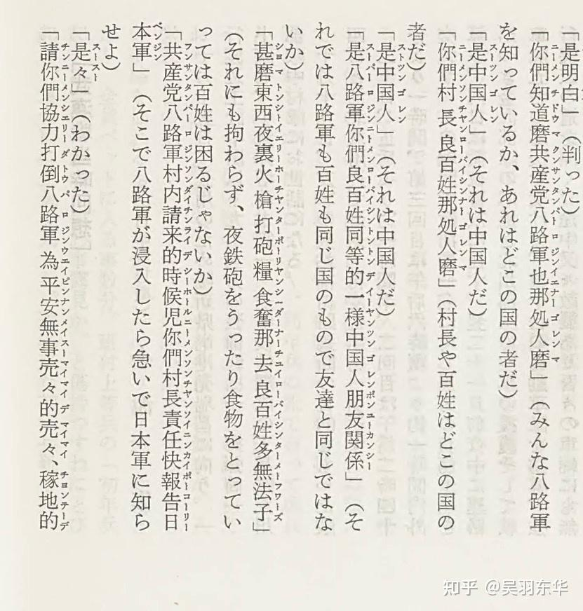
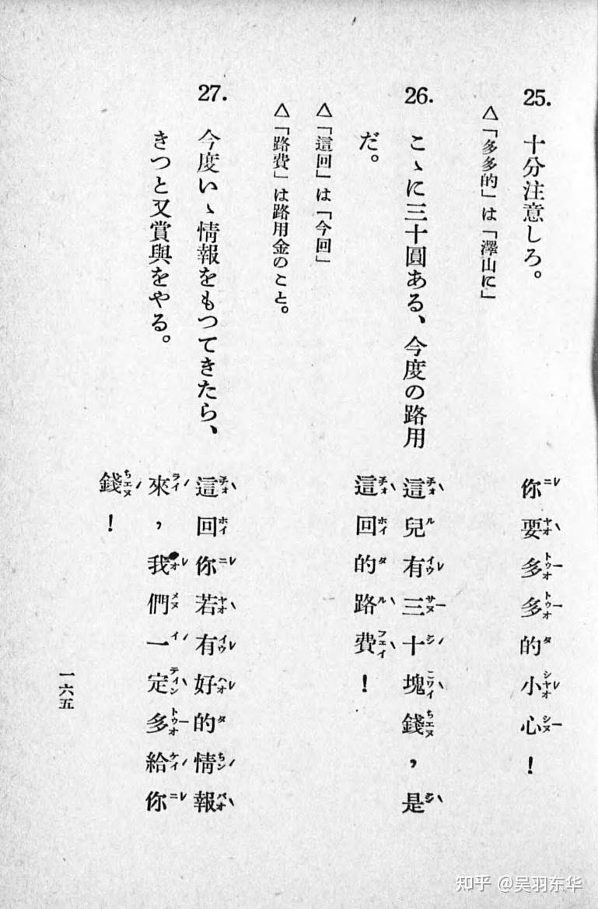
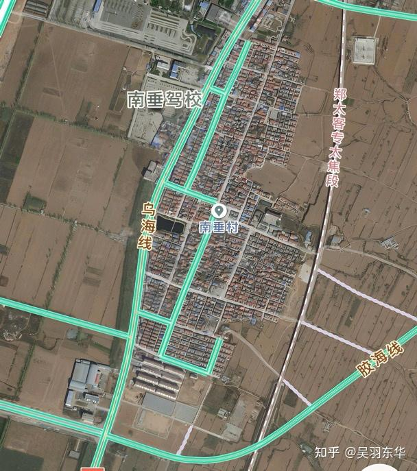
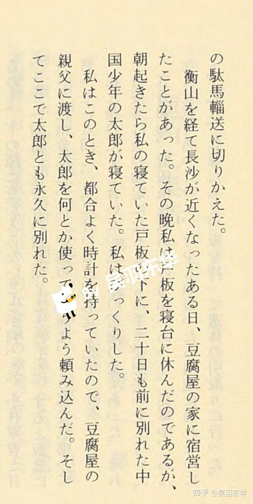
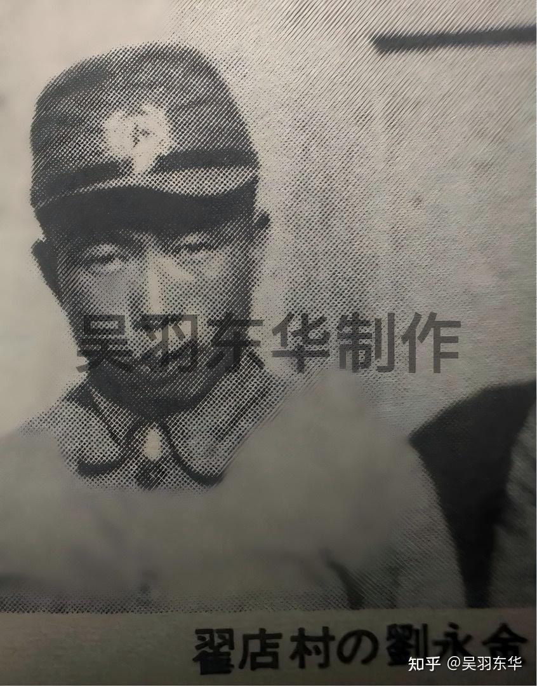
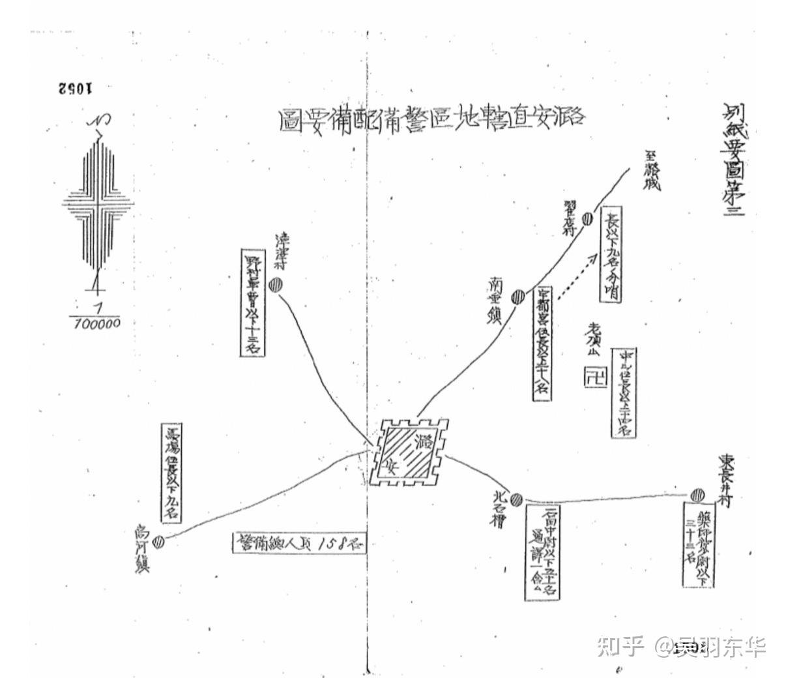
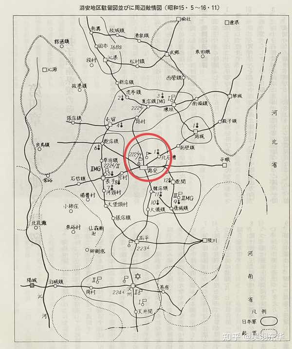

# 中国抗日战争中，为什么会有那么多的汉奸？

| 项目 | 内容 |
|---|---|
| 类型 | answer |
| 作者 | 吴羽东华 |
| 收藏时间 | 2026-02-14 13:43 |
| 发布时间 | - |
| 收藏夹 | 抗联 |
| 原链接 | https://www.zhihu.com/question/22280534/answer/2006000550412575323 |

## 摘要

那只能说日本人太会了。 怎么个会法呢。以前买过一本日军老兵自印回忆录的资料，作者是36师团步兵第222联队第一大队的高桥大吉少尉，这个人甲干出身，笔杆子很好，在222联队史写了很多高产文章。最初担任该联队第一大队本部代理副官及情报将校，可以说是个经常需要和中国人打交道的军官。此后，曾担任第一大队第一中队的第二小队长、1940年4月代理中队长，后任第一大队第二中队长，长期活跃于山西战场，深耕与驻地居民的所谓“中…

## 正文

那只能说日本人太会了。

 

怎么个会法呢。以前买过一本日军老兵自印回忆录的资料，作者是36师团步兵第222联队第一大队的高桥大吉少尉，这个人甲干出身，笔杆子很好，在222联队史写了很多高产文章。最初担任该联队第一大队本部代理副官及情报将校，可以说是个经常需要和中国人打交道的军官。此后，曾担任第一大队第一中队的第二小队长、1940年4月代理中队长，后任第一大队第二中队长，长期活跃于山西战场，深耕与驻地居民的所谓“中日提携”关系。

第36师团自1939年2月编成后，便长期在华北方面军第一军隶下，成为当时华北战斗力屈指的治安师团，该联队在5月接替第109师团太原附近警备后，第一场硬仗便是发动对八路军120师的五台作战，对中共的十六字战法可谓了如指掌。对其战斗力，引用高桥的话来说，就是“铁腿、夜眼、穿粗布、吃窝头”，顾名思义，就是说八路军战士擅长行军，也擅长夜袭，作风艰苦，高桥称赞“中共军队有压倒性优势的民众支持。”
<figure data-size="normal"></figure>
“什么东西！夜里开枪打炮，粮食都拿去，良民多没办法” “八路来的时候，你们村长责任，快报告日本军”“请你们，协力打倒八路”😨

 
<figure data-size="normal"></figure>
那么，平民怎么笼络呢？威逼利诱，但你不能说这些人是汉奸。比如上面，“这回你有好的情报来，我们一定多给你钱”，后面还有一些“快说，不说杀了你”。反正兵队中国语就是教一些抽象话。

1940年5月，该部根据师团命令，移动至潞安地区（长治）接替第20师团的警备地区，中队配置于南垂镇，一部配置于离镇子不远的翟店村，在这里高桥除了跟随部队出动征战，其余时间就是在和中国村民打交道。于是，便有了以下记录，堪称汉奸群像速描，但也有一些你不能说这些人是汉奸，仅仅是想活命的老百姓而已。括号内为原文。
<blockquote data-pid="i9bUTacK">曹人仁 在南垂镇做民众工作时，经常听取他的意见，为了解中国的习惯起到了很大的作用。他没有说中国干部们（如村长或自卫团长等）的坏话，指出了长处并告诉了我其利用价值。（当时的中国人为了保身，说其他坏话的人很多）。   刘永金 协助翟店村警备队，就情报收集和治安工作进行了很好的建议，因此敌方也想要他的命。   牛如麟 从南垂镇以商人的身份去过满洲，是个日本通，懂点简单的日语，担任了与中国方面的桥梁。   王顺天 南垂镇出身，是璐城县联合合作社社长，用现在的日本来说就是县农协会长。他经常来找我，询问我在进行合作社运动时与日军的关系如何，并通知我今后的计划。   权〇（日本名） 在南垂警备队工作的十六岁少年，做饭、打扫什么的都很勤快。   姜〇（女儿） 翟店村的满头屋(翟店村没有妓院，是士兵们唯一的社交场所) ，寨上村出身的姜贵（父亲）和女掌柜（太太）都非常亲日。她是一个十二岁的小女孩，总是笑眯眯地看着士兵们，很可爱。  王爱〇、王梅〇 南垂镇小学的最高年级生，是个聪明的优等生，也学过日语。  </blockquote>
（以上几乎每个人都有照片，鉴于部分当时是儿童现今可能还健在，出于隐私保护均采用匿名处理）
<figure data-size="normal"></figure>
就是今天潞州区的南垂村，有兴趣的可以去实地了解下🤔

当然，作者高桥并没有详细记录他们的身份，但从中推断，曹人仁可能是自卫团成员，一般就是由铁杆汉奸组成的协同日军的狗腿子。牛如麟懂点日语，也可能是个翻译，显然日军对其评价很高，铁杆汉奸没跑。王顺天是帮助日军统治的亲日组织头目，农协会成员一般是地主士绅担任，成员未必全是汉奸，但会长必定是铁杆汉奸，至于16岁的权某，这种一般是被称为“太郎”的中国儿童，有些和日本士兵感情很深，甚至日军部队开拔，有的太郎也会跟着走。姜某的父亲开着酒馆和日本军队做小买卖，被称为亲日家庭，那肯定也是汉奸了。
<figure data-size="normal"></figure>
补一个“太郎”，日军116师团步兵第120联队的记录。很能反映一个问题，在生死存亡前，有奶就是娘。但这不是汉奸。
<blockquote data-pid="W6duyNEN">经过衡山，临近长沙的某日，曾在豆腐店里宿营，当晚我用门板当作床休息，早上起来一看，在我睡的门板下面，竟睡着二十多天前分别的中国少年“太郎”，吓了我一跳。这时我刚好带着块怀表，便交给了豆腐店的掌柜，拜托他想办法雇佣太郎，并且和太郎在这里永别了。</blockquote>
有人会好奇了，日本军到底是怎么收买人心，让他们成为铁杆汉奸的？来看看高桥的表现。据高桥称，前任警备队曾雇用的密探中，有一个叫“刘永金”的人，高桥认为首先要取得他的信任，把他收入帐下。但高桥也很清楚，认为“他也是中国人，决不能掉以轻心。为了说服他，我必须亲自走进他的内心。”
<blockquote data-pid="SVXNcvD3"> “永金，你是我的老师，以后要教我很多事情。”</blockquote>
高桥说，认识一个人，首先要从拜访和打招呼开始。过了几天，高桥和包括刘永金在内的二十多个村民一起吃饭，拿了羊肉去包饺子，他们就站在院子当中，拿着脏兮兮的碗盛着吃羊奶做的咸汤。因为有股特殊的味道，高桥感到厌恶。
<figure data-size="normal"></figure>
铁杆汉奸刘永金玉照

最精彩的来了。看到这一段内心戏真是个大写的服字。
<blockquote data-pid="d1pHMZNx">“不知道会不会被认为「队长果然是和我们中国人是不同人种」”，刘永金又会不会失望呢？不管如何，总之我还是下定决心放进嘴里试试，却心里一阵难受。就像在吃生草一样，难以言喻的味道。酸腐、难闻的味道，而且烫的要命。”这个举动，起到了意想不到的效果。“队长和我们一起吃过饭，我们是兄弟”，刘永金说道。</blockquote>
可见，曾做过情报系军官的高桥，确实是笼络人心的一把好手。虽然这个村民世代以来生活的地方被日军占领是极其可悲的，但从中也能看出，在日本军刚柔并济的手段下，中国民众或主动或被动成为汉奸的可悲宿命。
<figure data-size="normal"></figure>
那么，文中提到的南垂镇和翟店村的警备队有多少日军呢？答案是，37人。当然，整个潞安地区日军有1万多人，一旦遭遇攻击，临近的日军都会赶来增援。另外说个恐怖的事实，潞安地区的中国人有多少人呢？15万人，城里1万（虽然大多逃亡）。

 

经人指出，表达的不够清楚。日军的潞安地区指的是：潞安（长治），高平，泽州（晋城），壶关，潞城，屯留这一片区域，得算上这些县，预计可能接近百万人。（随便找了个1935年的数据，高平 244,097  、晋城 297,422、壶关 120,773、潞城 108,563、襄垣 142,311、长子 150,617、屯留 122,925、长治 189,813，总数是1,376,521，可能有大部分逃亡的）潞安城内是师团本部加部分直属，潞安城附近就222联队的1个中队。
<figure data-size="normal"></figure>
红圈区域。

---
导出时间: 2026-08-23 19:06