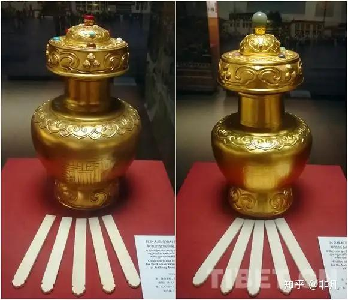
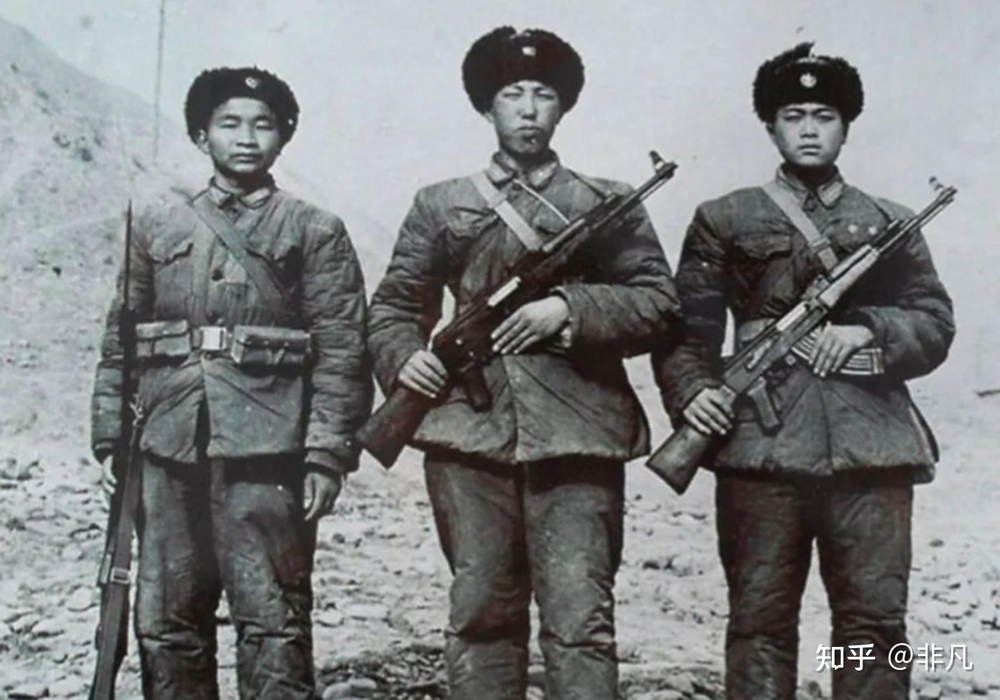
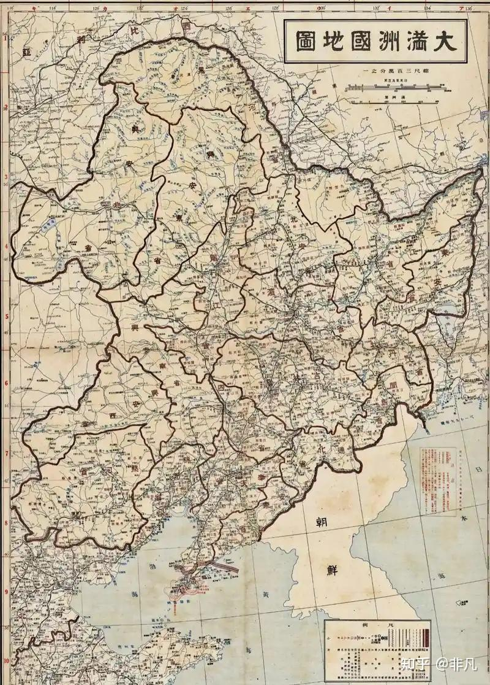
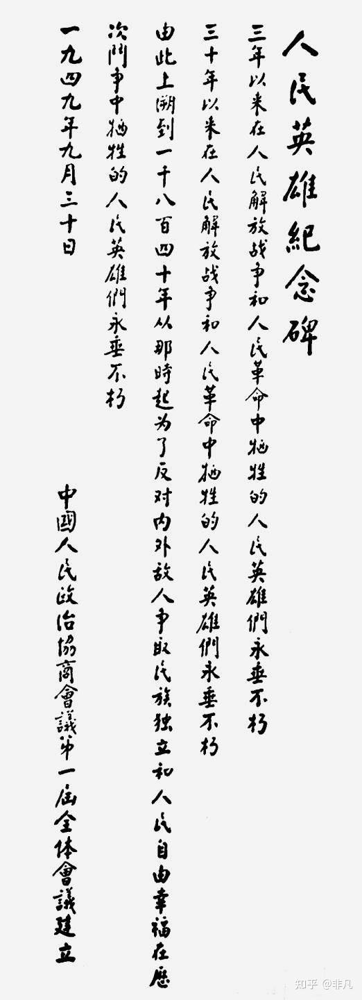

# 如果你是抗日战争时期日军总指挥，会怎样对抗《论持久战》的战略？

| 项目 | 内容 |
|---|---|
| 类型 | answer |
| 作者 | 非凡 |
| 收藏时间 | 2026-01-24 16:43 |
| 发布时间 | - |
| 收藏夹 | 抗联 |
| 原链接 | https://www.zhihu.com/question/667473860/answer/1998435634205978933 |

## 摘要

日本侵略中国的核心理论是「满蒙生命线论」。 来源是什么？ 就是元清非中国。 元清非中国，那么元清故土就不是中国的领土。 清帝退位，将中国汉人十八省交还，就算是实现承诺。满蒙的共主就是爱新觉罗·溥仪。 只要溥仪愿意回去领导满蒙，满蒙就有资格在大日本帝国的帮助下独立。 既然元清非中国，那么新疆、西藏、台湾当然也不是中国的领土。 这就是李登辉提出中国七块论的出发点。 这个争论到现在还在持续，也就是网络上的「16…

## 正文

日本侵略中国的核心理论是「满蒙生命线论」。

来源是什么？

就是元清非中国。

元清非中国，那么元清故土就不是中国的领土。

清帝退位，将中国汉人十八省交还，就算是实现承诺。满蒙的共主就是爱新觉罗·溥仪。

只要溥仪愿意回去领导满蒙，满蒙就有资格在大日本帝国的帮助下独立。

既然元清非中国，那么新疆、西藏、台湾当然也不是中国的领土。

这就是李登辉提出中国七块论的出发点。

这个争论到现在还在持续，也就是网络上的「1644史观」。

这个理论认为，公元1644年以后的中国是满清殖民地，满清不是中国政权。本质上就是延续日本的侵华理论，实际上回到「满蒙生命线论」这一主题上。
<blockquote data-pid="pr1dBhaP">&#34;满蒙生命线论&#34;是20世纪初期日本军国主义为侵华战争炮制的核心理论之一，主张将中国东北及蒙古地区视为日本生存发展的&#34;生命线&#34;。该理论由吉田松阴的补偿论、山县有朋的满蒙特殊权益论逐步演化而来，1929年石原莞尔首次系统提出《关东军满蒙领有计划》，1931年经松冈洋右公开演讲和媒体宣扬全面扩散。其核心逻辑是将侵占满蒙与日本国家安全、资源获取及大国竞争直接挂钩，为发动九一八事变、建立伪满洲国提供理论依据，最终成为日本法西斯全面侵华的思想纲领。</blockquote>
印度在上世纪逐步侵占西藏，实际上也和这个论点密切相关。历史上西藏独立或者半独立于中国。中国对西藏行使主权的主要表现就是活佛转世的「金瓶挚签」由中国政府主持和认定。从清乾隆五十七年（1792年）正式设立。
<figure data-size="normal"></figure>
如果元清非中国，那么西藏自然也非中国。日本可以提出「满蒙生命线」，那么印度就可提出「青藏生命线」。
<figure data-size="normal"></figure>
当代网络上不断炮制「1644史观」，强调元清非中国，本质上就是为日本军国主义和大印度主义服务，其中也包含了台独等分裂主义的主张。

比如说《澎湖海战》。中国确立对台湾的主权归属其合法性就是来源于清朝。「1644史观」之后的中国，其领土合法性何在？

中华民国建立以后，清帝退位。日本人抓住时机把溥仪带出北京，秘密送往伪满，成立伪满洲国。很明显，日本想把清朝继承下来，为「满蒙生命线论」背书。
<figure data-size="normal"></figure>
网络上甚嚣尘上痛批清朝的源头何在，不言自明。

因此，清朝很重要，元清就是中国。

研究历史的根本目的，就是从历史中找到现实逻辑和依据。

由此上溯到一千八百四十年，可是刻在人民英雄纪念碑上的文字。
<figure data-size="normal"></figure>
有些人知不知道自己在干什么？

所谓的「1644史观」就是垃圾，毋庸赘言。

日本人提出「满蒙生命线论」后，继而得寸进尺，要将华北地区作为伪满的缓冲区，妄图设立「华北自治区」，其试图全面继承清朝统治权的野心昭然若揭。这也是日本人控制清朝末代皇帝爱新觉罗·溥仪的终极目的。

这本身就是大日本帝国的持久性目标，也是日本的持久战。两个持久战相互碰撞，就看鹿死谁手。

抗日战争日本失败了，但是并没有死心。当前网络舆论的大战，实际上仍是抗日战争的持续，日本人并没有完全放弃这一目标。加上各路分裂势力的推波助澜，网红及一些人的错误言论，越闹越大。

时至今日，各位如何理解「由此上溯到一千八百四十年」，《论持久战》？

军事斗争虽然暂时画下一个句点，而意识形态上的斗争结束了吗？

将清朝握在自己手中，就是掌握了历史正朔，清朝历史不容他人染指。

故而，所谓抗日战争时期日军总指挥怎么看待《论持久战》？就是用持久战对抗持久战，和中国抢夺历史。此乃生死之战，只能硬上。当代网络，我们面对所谓的「1644史观」也只能硬上，告诉大家正确认识历史的方法和逻辑。当然，有很多人会说：「谁和你是我们？」

那么，你是谁？

日本时至今日依然在苦撑「满蒙生命线」，在网络上不断掀起大浪，坚持了一百多年，当然是持久战。

但历史会证明，真理究竟掌握在谁的手里。

---
导出时间: 2026-08-23 19:07