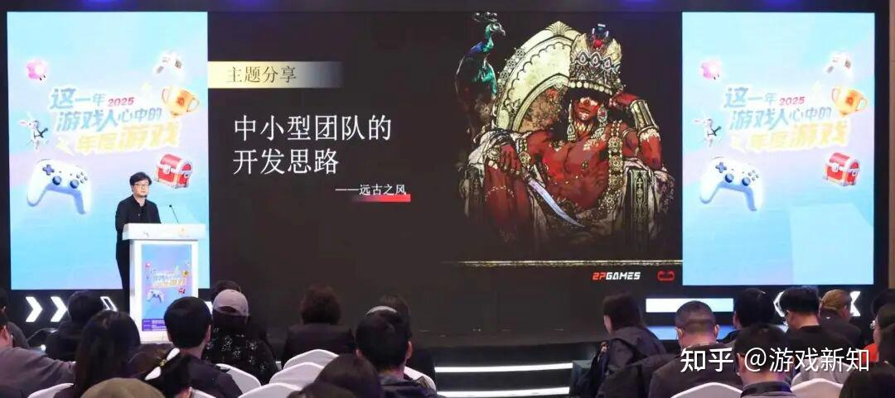

# 《苏丹的游戏》制作人：连续开三枪永远比瞄准三秒钟更重要

| 项目 | 内容 |
|---|---|
| 类型 | article |
| 作者 | 游戏新知 |
| 收藏时间 | 2025-12-24 09:09 |
| 发布时间 | - |
| 收藏夹 | 抗联 |
| 原链接 | https://zhuanlan.zhihu.com/p/1987087269824312302 |

## 正文

12月19日，在2025中国游戏产业年会「游戏人的年度游戏」交流活动上，《苏丹的游戏》制作人「远古之风」以《中小型团队的开发思路》为题发表演讲。   《苏丹的游戏》是由双龙头工作室研发的国产单机游戏。其于今年3月底在Steam发售，首月便以45万份的销量、3400万元的销售额登顶国游销量榜，截至2025年上半年，销量更是突破了100万份。游戏还凭借独特的美术风格及140万字的高质量剧本拿下了95%的Steam好评率。  然而这个爆款的诞生之路并不顺利。其核心团队出自十字星工作室，后者曾获得腾讯、快手等资本的支持，巅峰时期规模一度扩张至近200人，但因项目接连遇挫、公司濒临破产，到后来收缩到只剩十几人的研发团队——《苏丹的游戏》就这样开启了研发。  「我经常跟别人说为什么做这款游戏，因为公司快破产了，所有能够动的人都已经离职了，我们就要做一款游戏里面没有任何东西会动的，」在远古之风看来，<b>在不理想的开局下，不要去想自己想做什么游戏，而是先把手上资源看一下自己能做什么游戏。</b>  同时，远古之风提到，身为制作人，还应该让团队的每个人做自己擅长的事情，而不是提出一个想法、操控团队把想法变出来。而对中小团队来说，「<b>完成比完美更重要</b>，做得快、做完上线比什么都重要」。  <b>以下为演讲实录</b>（为方便阅读，游戏新知添加了小标题）：  感谢游研社、感谢游戏工委给了我们一个分享的机会。  首先我要先管理一下大家的预期，我讲的很「low」。就是我默认对中小型团队的开发思路感兴趣的，应该是一个很穷、缺这缺那的团队，这样的团队才符合这个主题。  现在是一个独立游戏大爆发的年代，Steam这几年每年都上新大量的游戏，其中大部分是小型游戏，我们把它们统一称为独立游戏的话，（增加的）数量是每年都在翻倍的——1000、3000、6000（款）这样的速度。  
<figure data-size="normal"></figure>
  <b>所有的艺术都发生在有限制的时候</b>  很多朋友想做一个游戏，但现在缺钱缺人甚至什么都没有。他可能是一个大学毕业生，（可能是）找不到工作或者被大厂开除了的人，（也可能是）公司破产了。反正就不是理想开局的状况下去做游戏，应该怎么立项怎么做？  其实有一个非常反直觉的结论，就是大家假想一下外面有个很饿的人，你很希望他吃饱饭，这个时候你要去厨房做饭了。你不应该说你想做什么，首先打开冰箱看看还剩下什么，用剩下的东西去做饭。做独立游戏、小型游戏或者说用游戏来创业，我觉得最重要的思路是，不要去想自己想做什么游戏，先把已经放在手上的资源看一下，你能做什么游戏。这是一个非常重要的心态上的转变——现在身边有什么样的同事，我具备什么样的技能，对什么领域最熟悉，这个就是你冰箱里的菜，你用这些菜来做一个游戏。  像我们《苏丹的游戏》，我经常跟别人说为什么做这款游戏，因为公司快破产了，所有能够动的人都已经离职了，我们就要做一款游戏里面没有任何东西会动的（笑）。这个游戏就这么简单，这个是很反直觉的。  在上一个10年，整个游戏商业化狂奔的时候，大家的想法都是如果我想做什么东西，我就去找一个人，我不相信有用钱雇不到的人。很多老板甚至普通玩家都会这样，我想做一个什么样的游戏就去找对应的资源，甚至临阵磨枪去学习相关的能力。这个想法当然是好的，但事实上当在你想炒这道菜的时候，市场上有1000个团队跟你一起开始炒，如果你还要去菜市场买菜甚至还不知道这个菜在哪里买的时候，你最好还是用冰箱里已有的东西，好好把这些东西完全发挥出来。不要想着去市场上雇佣一个完全不了解这个领域的专家来帮你解决这些问题，这个是一个重要的转变。  很多就说你太现实了，其实正好相反，我要说<b>游戏设计甚至所有的艺术都发生在有限制的时候。</b>古代最早的人在墙壁上作画，他只有手、只有泥巴，然后艺术诞生了。如果大家知道《DOTA》（编者注：玩法追溯到最开始，是一名学生根据《魔兽争霸3》的地图编辑器做出了一张名为DOTA的地图）或者《英雄联盟》这些游戏，对这些游戏底层有了解，你会知道是非常「草台」的。  泉水是因为隐藏的「琴女」在那里放技能，有多少人是知道这个事情的？这导致琴女的代码是特别难改的，改一下游戏就会崩溃。  当你一无所有的时候，游戏设计开始发生。当你说我要用年薪100万去雇一个TA（技术美术）来帮我解决紧要的游戏问题的时候，你是老板，你不是游戏设计师。<b>当你什么都没有，仍要做一个让大家喜欢玩的游戏的时候，你才是一个游戏设计师。</b>  所以大家一定要鼓起勇气，用自己手上的东西努力做出一些东西。  <b>让团队的人做他擅长的事情</b>  另外说一个很重要的点，你同时要珍惜这个机会，让整个小型团队去避免（一些误区）。我发现很多人有一个非常大的误区，想要一个什么样的东西，就让编剧/文案去把它写出来，或者想要一个故事、一个美术风格，就怎么去操控美术让他们把想法变出来。这个做法一开始就是错的，这还是老板的做法。  如果你是一个游戏制作者，团队里的美术擅长什么、他想画什么，编剧擅长的故事是什么，你一把抓住去炼化，这才是游戏设计者在团队里最重要的意义。  比方说我们是一个小餐馆，小餐馆最重要的是你应该知道自己家乡或者附近的乡土有什么蔬菜是最新鲜的，把后院里产的——天生就产这个好吃的玩意——做出来再去卖。你不是麦当劳，你不需要为自己的薯条好吃，专门研发一种土豆。这个是巨大的思路上的差异，<b>在团队里你要贡献自己的创意，但你的创意更多在于如何用上大家的创意。</b>听起来有点套娃哈，实际上就是团队能产出的美术设计、玩法设计和剧情这些东西，是没有加工的食材。而作为一个游戏人，你去想如何把这些食材做好并且尽量少的浪费。当你在工作中越珍惜食材，大家能感受到你的尊重，就会尽可能产生新鲜的食材给你。  我们不要像超大型连锁店一样，把面包边全都切了然后再去喂猪。你最好是把萝卜做成泡菜端给人家吃，一方面因为我们真的很穷，要省钱；另一方面是要通过这种自然的方式让团队的所有成员都能够投入到这个项目。  有一个古老的童话寓言叫石头沙漠：一个饥饿的女人想吃饱，但她只有一块石头，她就把第一块石头扔进缸里，然后跟别人说如果有麦子就好了，就有人加麦子；如果有蔬菜的话（就好了），有人加了蔬菜。就是这样子，让大家涌现式地去讨论一个问题，我们大致要做一个什么方向的产品，但是这个作品的很多细节需要激发团队成员的创造力。  很多游戏制作人或者策划，就是我心中有一个游戏，我想把它再现出来。对不起这个会很难，很多创作者以这个目标去做东西反而不好，大家要接受做游戏是一个1%成功率的事情。为了这个1%的成功率，要把团队所有人100%的能力发挥出来，才有机会成功。  确实比较残酷，从这一点上来讲，一定要改变自己原来的这种想法——不是去定制一个东西，而是让团队去涌现、去设计一个东西。  <b>做游戏是植物式的竞争</b>  很多游戏特别是独立游戏团队，都面临着一个很大的内部分裂压力，<b>大家很难在游戏失败的时候或者游戏成功的时候继续维持团队的统一性。</b>一定要让大家所有人都意识到团结的重要性。  我经常跟团队的同事做一个比喻，就是说整个游戏产业，无论大到一个产业还是小到一个团队，实际上创意产业是一种植物式的竞争，不是动物性的竞争。动物性的竞争就是两头野兽打架，有一个死了，有一个活着，活着的占领死了的地盘。这种竞争在传统商业中是更常见的，就是赢者通吃。  但是创意型产业或者是游戏开发它是什么样的？首先你无法在别人的尸体上获得任何收益，因为就是尸体不会创造价值。整个创意产业，无论是团队内还是团队外的竞争，都是植物式的竞争。两棵树（或者是两棵不同的植物）在同一片花园中生长，通过生长来建立自己的地盘，有可能两棵树会和谐的共存；也有可能有一棵树会把另一棵树通过极其缓慢生长的方式彻底扼杀了。这个是文化创意产业可怕的地方。  <b>你意识到失败的时候，你永远不会成功了。</b>因为它是一个完全基于生长的竞争，所以说要鼓励整个团队一起去生长，大家是所有人都是供给者，要尽量的鼓励大家用创作去巩固自己在团队中的位置，这样子才能够100%的把整个团队的积极性给激发出来，去完成一个作品。  <b>结语</b>  最后完成比完美更重要，做得快、做完上线比什么都重要。比如我刚才说的东西其实就很「草台」了，你的整个开发应该非常「草台」、非常简单，这个游戏只要拼凑好了、能够转、能够上线就OK了，发挥了你100%的能力。  千万不要想很多，想很多非常好，（但是，）我经常开玩笑说，很多我做《苏丹的游戏》的时候参考的游戏项目，到《苏丹的游戏》上线了，他们还没上线，就没有意义了。   连续开三枪永远比瞄准三秒钟重要。就这样，谢谢大家。

---
导出时间: 2026-08-23 19:07