# 老红军秦忠回忆录里有哪些不为人知的历史细节？

| 项目 | 内容 |
|---|---|
| 类型 | answer |
| 作者 | 无为上单 |
| 收藏时间 | 2025-12-19 19:37 |
| 发布时间 | - |
| 收藏夹 | 抗联 |
| 原链接 | https://www.zhihu.com/question/1914362735409491996/answer/1985433650733544492 |

## 摘要

秦忠回忆录内有关“四军在延安”的事很出名，到今天已经成了自媒体营销号炒作的常客，也就不必细说，这里不妨就结合其他材料，综合起来，聊一些《走出烽火硝烟——秦忠回忆录》里提及的、其他的“不常见于主流话语”的历史细节。 苦难童年与朴素革命心理对许多地富家庭、知识分子出身的老干部来说，童年往往是叛逆传统、心向进步的，如此才孕育出革命思想的雏形，于工农分子出身的老干部而言，他们的童年就往往是苦痛、压抑的，…

## 正文

秦忠回忆录内有关“四军在延安”的事很出名，到今天已经成了自媒体营销号炒作的常客，也就不必细说，这里不妨就结合其他材料，综合起来，聊一些《走出烽火硝烟——秦忠回忆录》里提及的、其他的“不常见于主流话语”的历史细节。
<h3>苦难童年与朴素革命心理</h3>
对许多地富家庭、知识分子出身的老干部来说，童年往往是叛逆传统、心向进步的，如此才孕育出革命思想的雏形，于工农分子出身的老干部而言，他们的童年就往往是苦痛、压抑的，不单是贫苦生活带来肉体上的痛苦，还会有鲜明阶级压迫产生出的精神仇恨，二者相叠加，才造就了青年时代听闻革命造反即兴奋的“革命人”。

这在秦忠身上就有体现：他小时就聪慧，没有经过教育，就认得字写得字，老先生说他是个读书的料子，可家长直说穷人家哪有法子读书，没有读书的“福份”，不如早点去帮工做活，为家里挣口饭吃。

秦父这番说法，既是生活所迫，也有“穷人命该受苦受累”的思想使然。秦忠幼时曾问过父母，为什么家里这么穷，为什么都姓秦，同族的宗祠长老、地主能收租吃米，他们却只能受苦做累、挨冻受饿，父母的回答，却是“祖坟不好”“命不好”“八字不好”。

还叫秦懋书的秦忠当然不相信这套说法，族坟是在一起的，怎么可能因为一个祖坟就决定人的命运？他心里埋下了质疑旧世界的种子，但还不知道新世界在哪，只知自己不应认命，心中憋着一股子气，“我人穷，但志不短”。

读了书的子弟们瞧见了他这个穷孩子在私塾边徘徊，集体出来羞辱他，“<b>他们骂我，欺辱我，说我穷光蛋还想念书，做梦都做错了</b>”，这是个火星子，点燃了秦忠心里的干柴，于是烈焰升腾，怒火中烧，向着这帮“地主崽子”发泄了出去，去打，去斗，即使自己被砸的满头流血也不退让。

“<b>我人穷，可志不短，早就憋着气没处出</b>，我丢下牛绳冲上去和他们扭打在一起。他们依仗人多势众，揪我的头发，把我那补丁探补丁的褴楼衣撕成了布条衫。别看我个子小，可我越战越勇，把那带头的小子打得直叫妈。他们一伙人全被我撵进了屋内。<b>石子从屋里飞出来，打在我的头上，鲜血直流，我毫不示弱，抓起屋外的稀泥巴奋起迎战，他们招架不住全都躲在桌子下面了。</b>”

但反抗总是有代价，同在黄麻地区的徐海东，幼时在学堂念书，不堪忍受地主子弟的霸凌，还手打人，致使被开除出私塾，再没有书读。秦忠被“小读书人”们挑衅，还击报复，也被视作闯祸，不止被上门要求赔偿，还遭了父亲的痛打——秦忠当然也是不服的，他仍要质疑，仍要痛恨。

“<b>我恨天恨地，恨这不平等的社会，恨我不能掌握自己的命运，恨我来到这个苦难的世界。我的童年没有幸福，只有苦难。人生的道路为什么这样的坎坷？</b>”
<figure data-size="normal">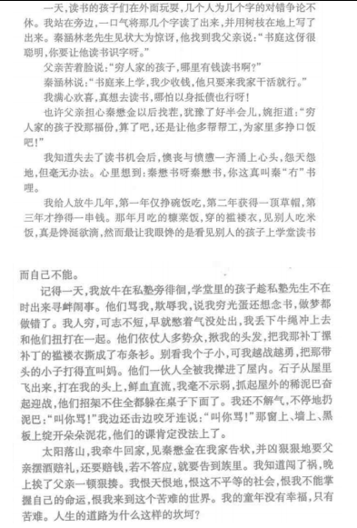<figcaption>《走出烽火硝烟——秦忠回忆录》8-9页</figcaption></figure>
这样干柴一般的思想，当然是接受革命星火的最好基底，当秦忠第一次接触到cp的宣讲，听到粗糙的“替穷人说话，帮穷人做事”“带头领着穷人造反、革命”后，他便天然生出了对“共产主义”的好感，即使他头脑里的“共产主义”充斥着自己的幻想和加工。但他确乎是一接触，就将主义视作了通往“天堂”的阶梯。

“天堂”不是比喻或夸张，这就是当时秦忠头脑里的、口头上的革命的终点：赤色革命是一条漫漫长路，这条长路最终的目标，就是通往“人人有饭吃，有书读，有衣穿”的“天堂”。这里头有个姓马的军师，比水浒传里的吴用还厉害，有个叫勒宁的将军，大炮能把山轰垮一半……

这样神乎其神、不可思议的故事，在穷人孩童中间就成了“天外事”，但主义与革命天然对穷苦人，尤其是秦忠这样的穷苦儿童有吸引力，少年儿童还是肯听秦忠的“吹牛”，讲各种各样关于“革命天堂”的事，这也让他成了孩童中间的“能人”。

“那些生意人告诉我的新鲜事，经我一编造,就更是神了。我在桃花河边对其他孩子神吹：听说有个共产党，共产党真了不得呀，他们中许多人都会十八般武艺。<b>他们走的一条路叫什么‘革命’路，这条路走到尽头就是天堂。天堂里人人都有饭吃，有衣穿，有书读。</b>他们中有个一个姓‘马’叫马克思的人，他头戴礼帽，身穿马褂，是个比梁山泊中的吴用还厉害的军师。还有一个小个子叫‘勒宁’(黄安话将‘列’读成‘勒’)是个将军，他能用比水桶粗的大炮打仗。那炮可厉害啦，一炮能把我们的三角山轰去一半。”

“<b>我吹得神乎其神，在孩子们中，我也成了知道‘天外事’最多的能人。</b>”
<figure data-size="normal">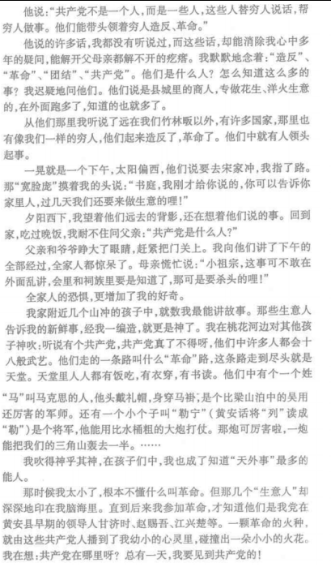<figcaption>《走出烽火硝烟——秦忠回忆录》12-13页</figcaption></figure>
最朴素、最直接的利益相关，最能打动人心，秦忠是听了“替穷人说话，帮穷人做事”的宣传而对赤色革命心生向往，渐渐向党和革命靠拢，而他真正亲眼见到到1927年的“革命”，即黄麻起义时，革命领袖的宣讲也是最贴合穷苦人所思所想的：无产阶级的天下就是把旧世界颠倒过来，穷人翻身，自有政权，不仅不再对官绅地主低头躬身，还要反过来，打他们的屁股，砍他们的脑袋。

“过去我们种田佬,只能交租交税给大老爷，被土豪劣绅、贪官污吏抓来打屁股、关监狱、砍脑壳；今天，还是我们这些种田佬、担粪的、放牛的，组织了自己的政府，<b>我们要打他们的屁股，砍他们的脑壳</b>。<b>只要我们团结起来跟着共产党，这就是我们劳苦人民的世界，这就是我们无产阶级的天下。</b>”

这番讲话，迎合了最朴素的“翻身”思想，造反、起义，除掉压迫自己的“老爷”，翻身做主人，通过革命通往“过好日子”的目标。秦忠回忆这段演讲，只记得当时自己大部分话都听不懂，但对这段，他尤其听得懂、记得清，“<b>那时候，好多话我听不太懂，但知道，共产党为穷人说话做事，穷人只有跟着共产党起来造反、闹革命,才会有好日子过。</b>”
<figure data-size="normal">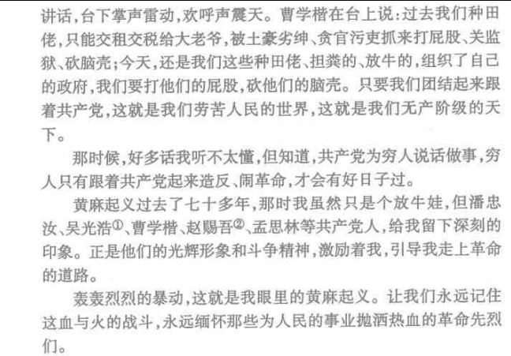<figcaption>《走出烽火硝烟——秦忠回忆录》22页</figcaption></figure>
这种“朴素思想”在鄂豫皖的运用并不罕见，鄂豫皖有三大起义，黄麻、商南、六霍，从商南起义中走出的开国上将洪学智，在起义时的“思想”就是彻头彻尾的“农民造反”，纯为了吃饱饭而来，参加的也是“联庄队”（党员掌握，但不打红旗，也不公开存在）待到起义聚集时，才知道自己是“苏维埃”了。

当然，洪学智他不觉得自己是被“骗上梁山”，通过此前的宣传铺垫，当地人便知晓党是为穷人打天下、向地主讨血债的，苏维埃是代表穷人做事的。那么，打红旗、斗地主，服从“一切权力归苏维埃”，也与一开始的初心毫不冲突。

“我们在南溪的联庄队也同时行动，一作气,连续攻破了几家地主大院，然后开仓放粮。这一夜，火把地，人声鼎沸，贫苦群众如过节一般……徐子清、萧方在会上讲话说：我们这次武装暴动成功了！……共产党是为穷人打天下的。穷人要团结起来，打倒地主，推翻官府，废除高利贷，废除高地租。<b>各乡各村的穷人要组织起来，成立苏维埃，向地主老爷讨还血债！一切权力归苏维埃！当时，我虽然搞不清楚苏维埃是什么，但知道苏维埃是共产党的组织，是代表穷人做事的。</b>”
<figure data-size="normal">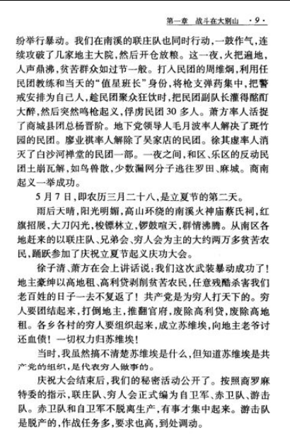</figure>
像秦忠、洪学智这样“先上车后补票”的例子，在鄂豫皖甚至可以说是普遍现象，许多大别山走出的老干部回忆青年岁月，都会提及类似经历。徐海东大将第一次接触主义，最感兴趣的是“打地主”，且想要地主子弟也一起宰掉。陈锡联上将参加武装斗争一年有余、被秘密党支部发展入党时才知道“党跟红军有区别”，甚至是这时才知道红军中有独立的党组织，在之前，他脑海里党和红军是一体两面的东西，以为当红军就是自动入党。

“怎么？我还不是党员？”“你什么时间入的党？”“我都当红军了，打了这么多的仗，还不是个党员？”

到了入党时，时年十五六岁的陈锡联作为一名没有机会读书的穷孩子，当然也认不得党旗上的字号，只认得上头的镰刀斧头标，然后跟着介绍他入党的党代表、班长一起，向着根本认不全的党旗，念着入党誓词，在“满天星斗的夜晚”里成为了一名共产党员。

“过了几天,在一个满天星斗的夜晚,党代表、班长悄悄领着我们几个人来到一个大草垛前。<b>党代表从怀里掏出一面旗子，旗子上绣着镰刀斧头，还有几个字，我不认识。党代表把旗子铺在草垛上，领着我们一起宣誓</b>。”
<figure data-size="normal">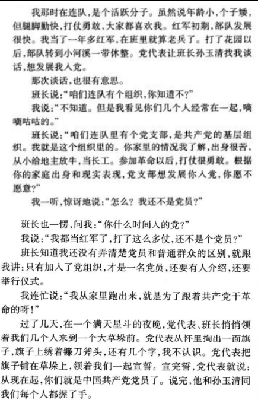<figcaption>《陈锡联回忆录》21-22页</figcaption></figure>
就像王林曾评价的那样，知识分子参与革命，通常是出于宏大抱负，怀着改造世界的理想而投身到革命事业中来，工农分子，则是现实压迫下产生出的、自然的对革命理念的亲近，这种亲近让他们献身革命，展露出少见的勇气与信仰。

与之相对，要进一步对他们“灌输”主义、理念和理论，那又会成为难事，秦忠本人作为一名红军基层战士，直到参加红军四五年以后，在川陕苏区时期才系统性的“补习”了一番共产主义的理论思想，“懂得了为谁当兵，为谁打仗。”

这样的记录，大概也能体现鄂豫皖红军对于“理论”的极度欠缺——一个红军战士为革命浴血搏杀数年，结果连“本党本军”所信奉的主义具体是什么、目标具体是什么都不知道，也无怪乎会产生“野蛮作风”“迷信崇拜”，

不过，这时秦忠在四方面军中养成的思想其实也很朴素，没有对未来和目标的思考，只有一个忠于主义、忠于组织，“<b>不管怎么说，我是党的人了。</b>我从小就敬佩赵赐吾、吴光浩甘济时那样的共产党人，<b>现在自己也是共产党员了，党叫干啥就干啥，我愿将我的一切献给党。</b>”
<figure data-size="normal">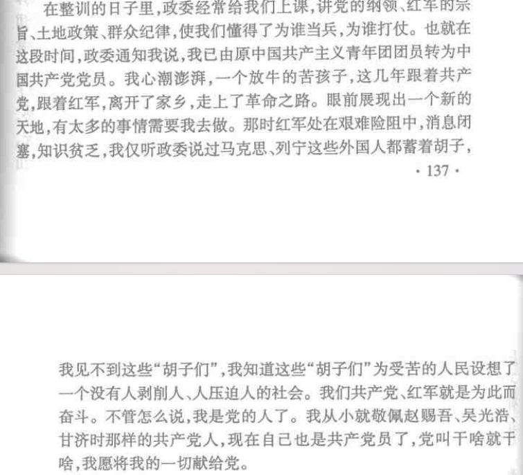</figure><h3>大水冲了龙王庙：四方面军在川陕与朱德家人的故事</h3>
谈到进入川陕以后的事迹，秦忠回忆录里还提及了一桩在四川仪陇的“趣事”：红军打土豪，打到了朱德母亲的家里。

在当时，战士们“打地主”的标准放得很低，看到一家人自己腌了好些腊肉，就自动去“拿”了两刀。这家的老太走出来，见到红军却也不怕，主动说：“娃儿哟，你们要吃就都拿去吧，家里还有哩！”

说者好心，听者有意，红军战士发现这老太婆家庭条件不差，“房子不破、有自己的农具”，不像别人家那么穷，于是当即就认定这个老太婆是地主家庭，想要吃朱家的大户。朱母见了这红军战士的粗鲁举动，直说自己儿子乃是朱玉阶，红军总司令，想喝止战士“不乱拿人家的东西”。

然而大家也都知道，四军的政治教育是很欠缺的，连主义和组织都不甚明了，更不要说指望基层战士熟悉红军名义上的总司令了，大家是只知道徐向前总指挥、陈昌浩军政委以及张国焘张主席，对朱德总司令也不熟悉，没听过说叫朱玉阶的“总司令”。

“<b>我晓得红军是好人，不乱拿人家的东西。我儿子就是红军，还是你们的总司令</b>”“<b>你莫瞎说，你的儿子叫啥子?</b>”“<b>啷咯瞎说嘛，他叫朱玉阶。</b>”“<b>朱玉阶？还是我们的总司令？我听都没听说过，真是乱讲。</b>”
<figure data-size="normal">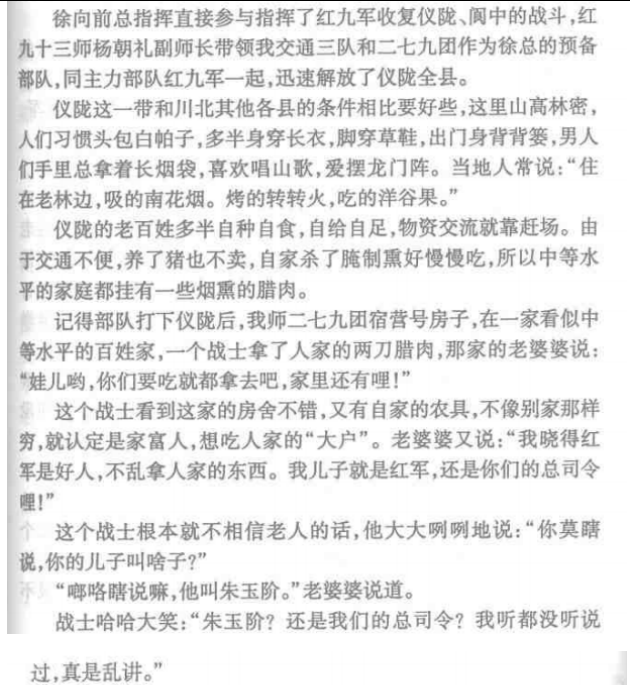<figcaption>《秦忠回忆录》167-168页</figcaption></figure>
实际上，在这时的四方面军里，不要说是基层战士没听说过“红军总司令”的字号，就是到了师长副师长这一个级别，也不知道有“朱玉阶”。秦忠当时见老太一脸认真，老乡也都说是真的，觉得有必要严肃对待，遂打报告给副师长杨朝礼，副师长也不知“朱玉阶”是谁，再打电话给张国焘。

到了张国焘这，才知道真有这么一位“朱玉阶总司令”，张国焘在电话里告诉下级：“<b>是的，是的，我忘了告诉部队，朱玉阶就是朱德，是我们红军的总司令。朱德就是仪陇人，现在正在中央红军。</b>”

这样一来，秦忠他们才知道，原来朱德总司令是“字玉阶”，仪陇人氏，此前这些知识他们是一概不知的。这也才意识到是“大水冲了龙王庙”，红军打土豪打到总司令母亲家里了，那个拿腊肉的战士被吓坏了，一众人在副师长的率领下登门道歉，归还腊肉。

朱母则颇为豁达，得饶人处且饶人，拿出了“我说拿得好”的态度，表示无必要归还，让红军战士们拿着这几块腊肉走，就当是给自己孩子吃了，“<b>没得啥子。你们是红军，我儿子也是红军,家里有肉难道还不给儿子吃？来拿嘛！</b>”

因为此事，军中进行了专门一回纪律整顿，副总指挥王树声亲自来做讲话，要大家不忘本，不要对老百姓耍威风，不用乱拿老百姓的东西——考虑到“腊肉”事件的起因是战士不管是不是“土豪”，见到腊肉就自己拿，这样的事可能在别的地方也发生过。

“<b>红军是人民的军队，不拿群众的东西，这是红军铁的纪律。我们师决不给红军丢人，听到没有？</b>”
<figure data-size="normal">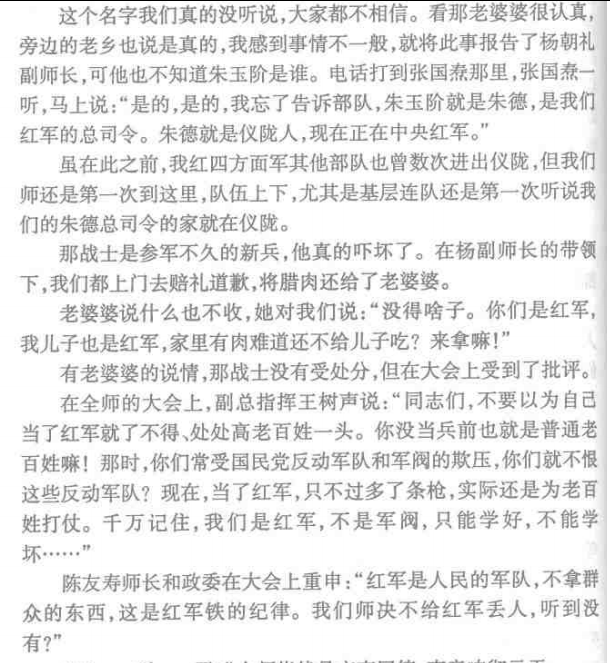<figcaption>《秦忠回忆录》168页</figcaption></figure>
实际上，如果当时这些战士们没有上报，而是“拿了就走”，那可能也不会发生接下来的事，四方面军在川陕边区，是靠着朱德弟弟的帮助打下了仪陇城。

许世友回忆录即提到过，红军攻打仪陇时敌人布防严密，许世友作为红九军副军长攻城不克，为之思考踱步之际，是朱德弟弟“老朱同志”（应为朱德之弟朱代庄）受组织之托，前来送上《仪陇城要图》，这才让许世友与政委陈海松找到敌人空缺，得以解放仪陇。
<figure data-size="normal">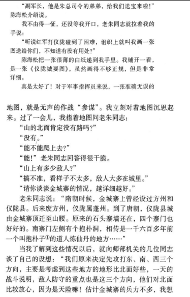<figcaption>《许世友回忆录》212-213页</figcaption></figure>
红军总司令的家人帮助红军解放家乡，这本来该是一桩佳话，可正所谓“历史不忍细看”，四方面军在仪陇，不光是“打土豪”搞到想打朱德母亲，还为了打粮的事，把拒绝红军“无指示打粮”、担任着村苏维埃主席的朱德大哥朱代历捉去“失踪”了。

“1933年10月的一天。代历正带领家人在地里干活。村里一游击队员匆匆跑来报告，说:‘福临场的游击队跑到阮家打粮(即筹集粮食)来了，哪个办?’他想：<b>我们并没得到上级的通知，他们哪个能随便到我们村里打粮呢？不行！他将手中的锄头往地上一摔，便随队员走进村里，阻止了来打粮的人。</b>”

“3天过后，忽然从衔燕石山下来了3个人，声称是福临场红军特务连派来的……<b>会上有人说朱代历包庇富人，抗拒红军打粮，他被带走了。</b>”之后朱代历“失踪”，十多年后旧事重提，朱代历被追认为革命烈士，像朱代历这样被“失踪”的基层干部，还有张思德烈士的父亲张行品[1]。

如果当时秦忠一行人不“认真对待”，也不是动了“打土豪”的心思，而是“搞了就跑”，拿着腊肉扬长而去，兴许朱德母亲也要吃这个“哑巴亏”了，不过肯定是比被“失踪”强得多。
<figure data-size="normal">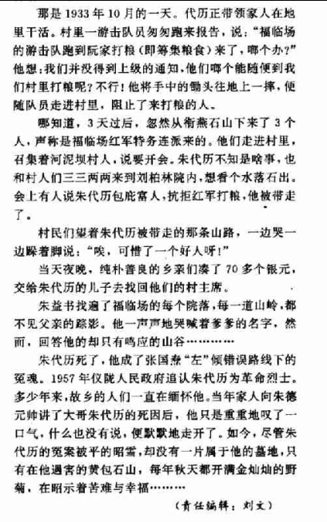<figcaption>《朱德的大哥朱代历之死》陈兆平 发表于《炎黄春秋》1995年第4期</figcaption></figure>
四方面军的基层指战员“不懂事”，如此对待朱总司令家人，大概也算得上一个“有上必有下”，后来长征草地分兵，朱总司令被裹挟随张国焘南下，因为拒绝承认张国焘伪中央而受刁难，在会上被辱骂为“老顽固”“老右倾”，受到监视软禁，小灶炊事员也被取消，连坐骑都差点保不住。

“一向说话温和的朱德，这几句话气得张国焘肝火直冒。他也一反平日说话皮笑肉不笑，双手合十胸前的神态，竟然骂朱德是‘老顽固’。黄超更带劲了,他骂朱德是什么‘老糊涂’、‘老右倾’、‘葬送了一方面军’……”

“生活上张国焘吃小灶，<b>朱德的炊事员没有了，他只得和战士一块吃大灶。当时，张国焘他们还煽动四方面军的人找朱德的麻烦</b>，朱德有一匹坐骑，是一匹骡子，从江西带去的，他很喜爱。四<b>方面军的几个伤员找总司令要马骑，他们还要朱德的骡子。</b>黄超甚至指使人要杀朱德的牲口，解决给养问题。”

罗通的这段回忆，和今天讲的“王维舟给朱总司令送马”的故事结合起来，就显得颇为有趣——出身川东游击军、不太受张国焘信任的王维舟下令给被“偷”走马匹的朱总司令一行人送去马匹[2]。这里的“偷”，就可能另有故事。历史的复杂经纬便是如此了。
<figure data-size="normal">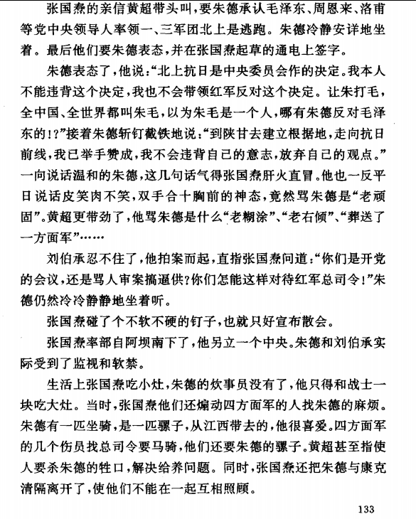<figcaption>《来自井冈山下——罗通回忆录》</figcaption></figure><h3>张国焘与徐总指挥</h3>
罗通作为一方面军出身的干部，回忆张国焘时提到张氏平日里的神态是“说话皮笑肉不笑，双手合十胸前”，像是唱惯了红脸的样子，这大概算是张国焘的“一贯作风”。1931年初到鄂豫皖时，张国焘就是“唱红脸”，假装支持曾中生等红军领袖，等南下之争爆发时，再在白雀园高举屠刀、大行诛戮，其是做惯了“两面派”，“笑脸杀人”的。

在秦忠的回忆录里，他就回忆自己曾在翻越秦岭时见到过的“和颜悦色”的张国焘。当时秦忠的战友、三班长陈正洪在行军路上讲怪话，大骂张国焘。数落张国焘的错误，是拉着四军越走越远，离开了大别山老区，不像是个革命干部，更像是个反革命。还和“后头的人”就张国焘的功过争辩起来。

“我看总部那狗日的张国焘就不是好东西。成天要我们跑,原来说打一阵就回大别山,这下好连到了啥地方都不知道。我看他是个反革命,要把队伍带去投敌人。”“他不是反革命,也不会带大家去投敌。这是没办法,是叫敌人逼的。”“叫敌人逼的?那就跟敌人干,拼了命,赚他娘的几个，革命到底’了也光荣。这成天光走,不打,就是逃跑主义。”

“你是谁?别他娘的管闲事。”“我是张国焘。”

“后头的人”就是张国焘本人，秦忠在鄂豫皖时期给张国焘送过信，知道他长什么样，本想劝陈别骂了，陈却越骂越起劲。最后才知道跟他谈话的人是张国焘。
<figure data-size="normal">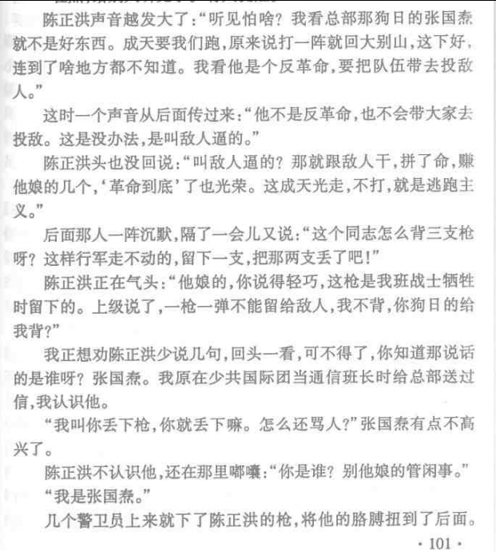</figure>
陈正洪发觉张国焘就在他身后，被张国焘的警卫员抓了起来，吓得一屁股坐在地上起不来，部队里都知道“张主席”的威名，谁敢顶撞他？大家都觉得陈正洪怕是小命难保了。

谁知道张国焘却是摆摆手，“语重心长”的告诉陈正洪：“<b>你这个同志革命很坚决嘛。我不会带队伍去投敌的，被敌人追着跑，是要保存实力，这是我的部队呀！</b>”然后叫来连长，嘉奖了位三班长陈正洪。然后让大家把多余的枪丢掉，轻装前进。

丢掉多余的枪，这是之前张国焘跟陈正洪讲的，要是陈正洪真的一不做二不休，把身上抗的枪丢了，会不会张国焘就用“丢弃武器”的罪名把陈杀掉？这只有天知道了，秦忠只觉得当时是“张国焘心情好”。
<figure data-size="normal">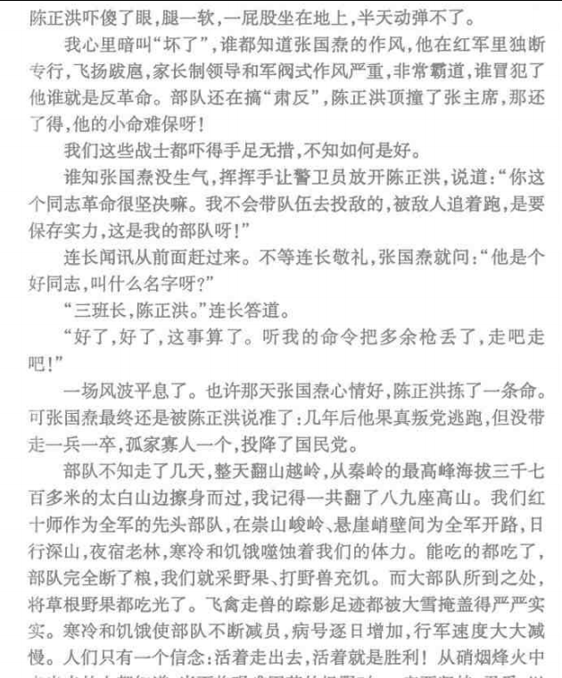<figcaption>《秦忠回忆录》102页</figcaption></figure>
照秦忠说法，他曾几次近距离见过张国焘，其中一次就是反六路围攻后的高干军事会议，他当时给31军军长孙玉清送信，直接进了会议现场，当时“<b>许多军长、师长都同意徐总的意见，而张国意一看会场形势对自己不利，专横跋扈，大发脾气。</b>”在会议室里来回踱步。

本就憋了一肚子火的张国焘这时看到外人闯入，大发脾气，指着秦忠这个“传令兵”骂起来：“你来干什么？嗯？这里开会，出去！出去！”结果这时的张国焘也像是没了权威，说话不顶用了，孙玉清立即“还嘴”，说秦是他让进来送信的。

张国焘咆哮起来，“谁让也不行，这是军事会议，出去！”秦忠这才退出去，然后大家在门外头就听到张国焘气急败坏的说话声音，丢下一句“我的意见就这样，要就照我的办，不听就算了。”摔门而去。秦忠在这里还不忘骂张国焘两句：“<b>我这个小兵对这位堂堂的张主席就没好印象，什么主席？哼！狗屁！</b>”
<figure data-size="normal">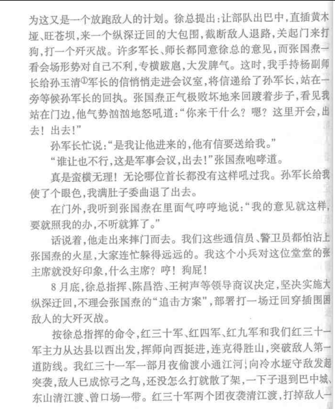<figcaption>《秦忠回忆录》164页</figcaption></figure>
反六路围攻后这段张国焘与四方面军指挥员就西线反攻方向的冲突，在徐向前回忆录中也有记载，但两人的回忆录也有所冲突。

秦忠回忆的是“东线反攻战果不足转向西线”后徐向前等人与张国焘开会争论方针，而在徐向前回忆里，以他为首的军事指挥员人在前方，张国焘一直人在后方，双方虽有争执，但一直没有面对面，而是在电话里打口水仗，并且是先按照张国焘指示打了东线，而后“将在外有所不受”，自行决定展开西线反攻，未与张国焘有争执，凭借战果让张国焘哑口无言。

“张国焘在后面,来电话要西旋。<b>电话里讲来讲去,我反复陈说利弊,坚持东旋。他充耳不闻,一再要我们西旋。吵了几个小时,就是说不服他</b>。陈昌浩同他说也不行。他是中央代表、西北军委主席,说了算,我们最后只好服从命令,率车西旋。”

徐向前作为最直接最权威的当事人，说当时他们是在电话里争，为何秦忠却说当时开大会集体讨论？我们不得而知，总不可能是专门为骂张国焘服务，强行编出来一段。
<figure data-size="normal">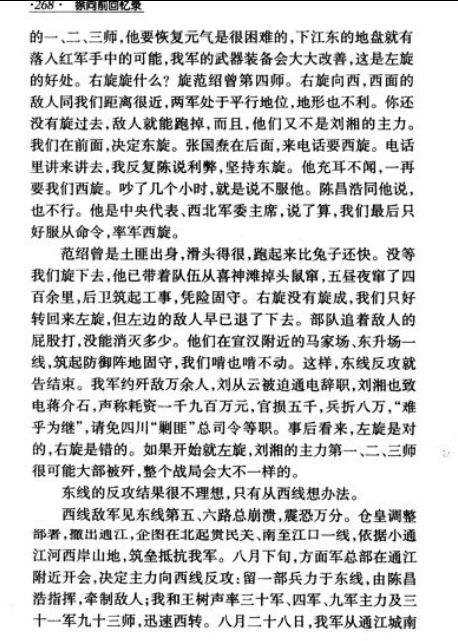</figure>
当然，秦忠与徐向前的回忆录也有互补之处，在关于1933年6月底木门会议的回忆上，徐向前回忆当时他领导了军事指挥员就三路围攻时期的肃反问题向着张国焘发起了一轮进攻，让政委陈昌浩做了反思，“批斗”了一名刑讯逼供的师政治部主任，保护了一批干部。

“木门会议上,大家议论纷纷,慷慨激昂,强烈要求停止部队内部的‘肃反’。<b>有个师政治部主任,搞刑讯逼供,杀人不少,在会上挨了批斗</b>。<b>陈昌浩的头脑清醒了些。他在讲话中虽肯定前一段部队中‘肃反’的必要性,但承认错抓了些人,同意停止‘肃反’将错抓的人放回。</b>木门会议,在抵制张国焘的罪恶‘肃反<b>’</b>上取得了胜利,意义非同小可。”[3]

而在秦忠回忆录，这位被“批斗”的师政治部主任，受到的处罚要更加严厉——拖出去枪毙。

“部队一边打仗一边有人被抓被杀,全军上下早就憋了一肚子气。在木门军事会议上,大批干部纷纷发言,愤怒批判肃反扩大化,群情激愤,<b>将一个积极执行肃反指令的师政治部主任拖出去枪毙了</b>。消息从上面传到基层,我们无不为之叫好。”

徐向前为何不补充？大概也是不想让“同左倾路线作斗争”的历史也蒙上血色。
<figure data-size="normal">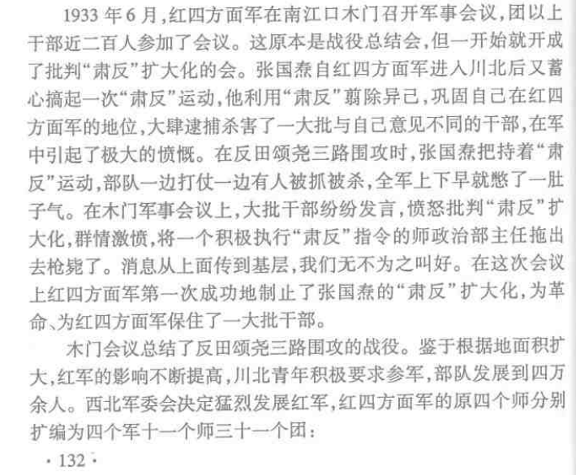</figure>

---
导出时间: 2026-08-23 19:07