# 四野的日籍官兵有多少？战斗力几何？

| 项目 | 内容 |
|---|---|
| 类型 | answer |
| 作者 | 红黑色的风 |
| 收藏时间 | 2025-12-17 11:50 |
| 发布时间 | - |
| 收藏夹 | 抗联 |
| 原链接 | https://www.zhihu.com/question/1955661120435098583/answer/1984591225320400329 |

## 摘要

又看到这种造谣图阴阳怪气，这种自打脸行为在知乎见到很多了，真的搞笑，问里面哪个是日军的士兵？ 一个都答不出来。 [图片] 坐着的白色衬衣胖老头，他年轻时候是这样 [图片] 李化民将军 土地革命战争时期，曾任红五军团第十五师宣传队队长、红一军团宣传大队副大队长等职，参加了中央苏区第四、第五次反“围剿”斗争和中央红军长征。抗日战争时期，历任八路军第一一五师三四四旅六八八团营长兼政治教导员、一二九师新编第一旅二团参谋长、冀中…

## 正文

又看到这种造谣图阴阳怪气，这种自打脸行为在知乎见到很多了，真的搞笑，问里面哪个是日军的士兵？

一个都答不出来。
<figure data-size="normal">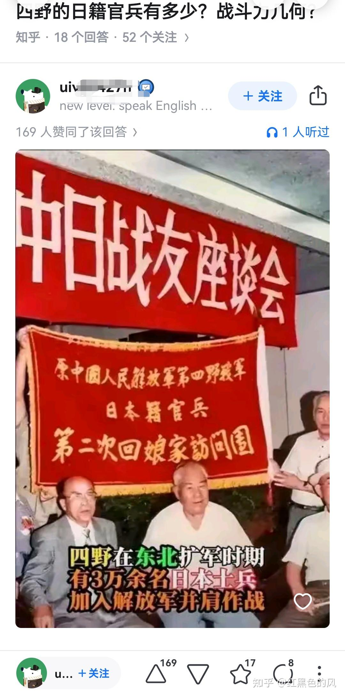</figure>
坐着的白色衬衣胖老头，他年轻时候是这样
<figure data-size="normal">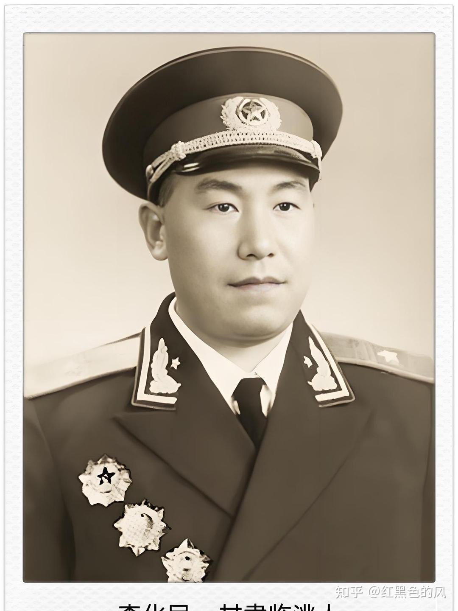</figure>
李化民将军
<blockquote data-pid="trforqyM"> 土地革命战争时期，曾任红五军团第十五师宣传队队长、红一军团宣传大队副大队长等职，参加了中央苏区第四、第五次反“围剿”斗争和中央红军长征。抗日战争时期，历任八路军第一一五师三四四旅六八八团营长兼政治教导员、一二九师新编第一旅二团参谋长、冀中军区第三十二团团长等职。解放战争时期，先后任东北民主联军保安第一旅副旅长、东北野战军第七纵队第二十一师师长、第四野战军四十四军副军长等职。中华人民共和国成立后，曾任中国人民解放军第四十四军军长，广州军区副参谋长，武汉军区、沈阳军区副司令员等职。中共第九至第十二届候补中央委员，中央顾问委员会委员。</blockquote>
左边年轻一点的西装老头，打土匪俘虏的
<figure data-size="normal">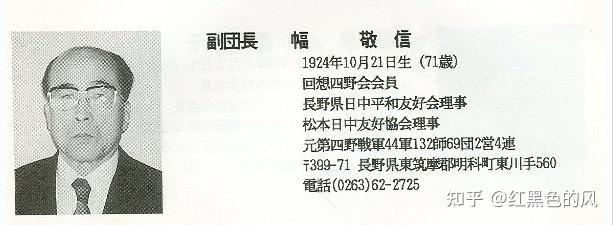</figure><blockquote data-pid="dHozpv_1">1946年11月走投无路的土匪向山外的八路军（东北民主联军）投降，之后幅敬信加入了八路军（东北民主联军）。</blockquote>
再左边露一只手的女性，开拓团集体自决被八路军救下来后加入
<blockquote data-pid="vfM1oiHk">1937年其父亲加入天理教阿城开拓团，1945年8月伪滨江省阿城县开拓团自决145人，1945年11月，东北抗日民主联军派人来到开拓团，17岁的本多歌子加入东北民主联军第一炮兵团随军卫生队当护士，后任第四野战军特殊兵团第二预备医院护士</blockquote><figure data-size="normal">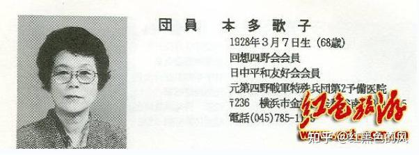</figure>
李化民将军左手戴帽子老头，义勇队的逃兵，剿灭土匪（地下先遣队）收编来的
<blockquote data-pid="T59mHOCK">从部队脱逃，1945年11月投奔大蒲柴河山里的日本人土匪团伙，那里的日本兵达到80余人。领头儿的名叫高桥干雄，本是日军满州第五部队直辖的特务，军衔为大尉。他和当地的土匪头子张永胜结伙，以维护社会治安的名义鱼肉乡里。张永胜的手下有土匪约60名。 1946年2月上旬转而试图投奔西北岔中日混合土匪团伙（日本兵的头目叫细川。细川为前关东军日军中尉，当时他手下的70名日本兵依然保有日本战败前的装备，轻、重机枪俱全，而且弹药充足。斐子文手下有200名土匪，不久两方火并，细川一派全灭）1946年3月敦化八路军警备二旅第五团武力收编张永胜，1946年6月张永胜和高桥干雄被朝鲜族群众揭发公审后枪毙。1947年9月，中村义光从敦化县的第二旅野战医院财务调到蛟河县的第十纵队29师卫生部当会计。</blockquote>
除了抗战时期俘虏转变的几千日本人外，东北地区三万三千多人以医护、技术人员为主体。

就那个鹤岗煤炭厂，抗战时期用中国人当牢工，抗战胜利后招了1500多日本人去挖矿，哪里来的日本兵呢?
<figure data-size="normal">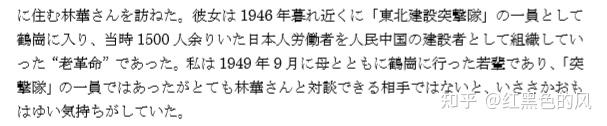</figure><figure data-size="normal">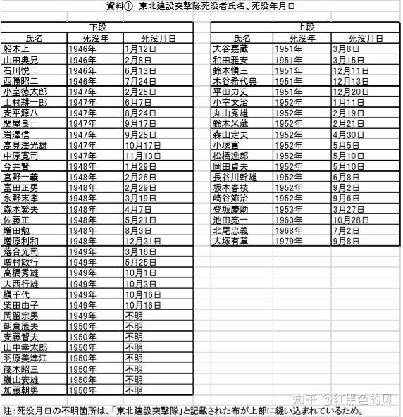</figure><figure data-size="normal">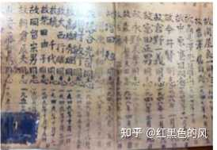</figure><blockquote data-pid="qAjBeWGX">若い隊員が初期に多く亡く なっていることを見るだけでも、零下 30 度にもなる極寒の地で三度のメシもままなら ず、病に倒れても薬もない状況を知ることができた。そのうえに初期の日本人工員の一 部には旧軍人、憲兵、特務・警察など反共の軍国主義思想に染まった人たちがいた。彼 らは「おれたちは騙されたんだ」と帰国運動を煽ったり、「突撃隊」指導者の暗殺まで 企んでいた。それらに打ち勝って教育を通じて「突撃隊員」をどんどん増やして、石炭 の増産につとめ中国東北から全土の解放に貢献した。</blockquote>
补充资料：
<figure data-size="normal">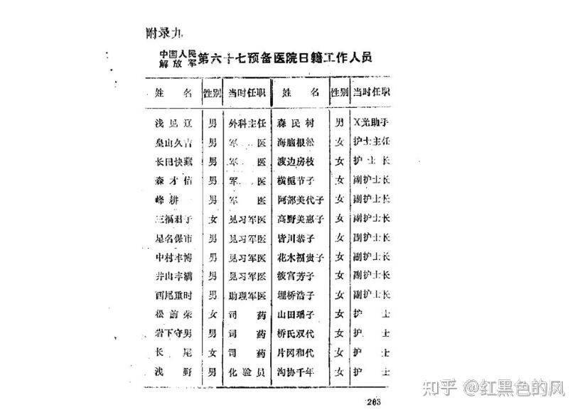</figure><figure data-size="normal">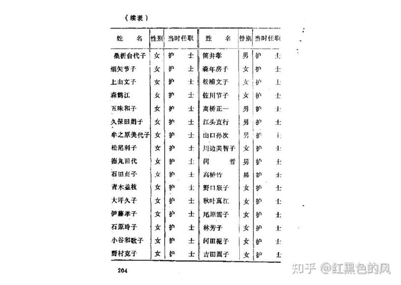</figure><figure data-size="normal">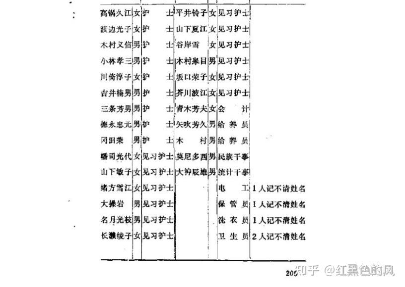</figure>
几万日本士兵，骗鬼呢？太原一万日军出了一个太原行署高级顾问一个中将副司令，在台湾几百日军将领出了一个陆军上将，四野的朝鲜族还有师长政委呢，这几万日本士兵在四野哪支部队当军长当纵队司令了？
<figure data-size="normal">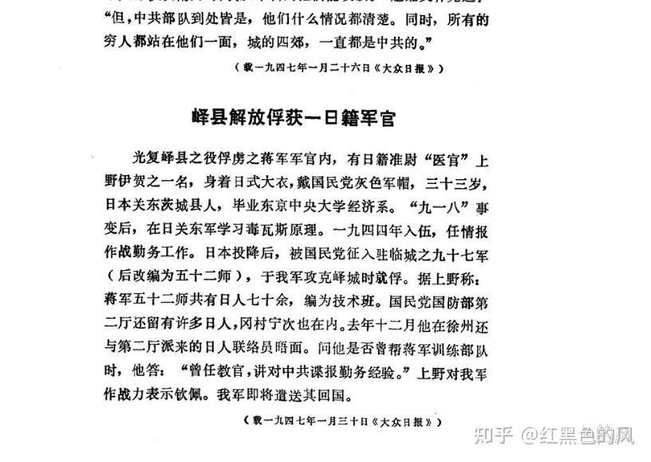</figure>

---
导出时间: 2026-08-23 19:07