# 纯聊天，0操作，我用AI两周做出了一款P社级的复杂策略游戏

| 项目 | 内容 |
|---|---|
| 类型 | article |
| 作者 | HkingAuditore |
| 收藏时间 | 2025-12-14 19:47 |
| 发布时间 | - |
| 收藏夹 | 抗联 |
| 原链接 | https://zhuanlan.zhihu.com/p/1983621373583726193 |

## 正文

<figure data-size="normal"></figure>
<b>游戏试玩链接 1： <a href="https://link.zhihu.com/?target=https%3A//hkingauditore.github.io/civ-game/" class=" wrap external" target="_blank" rel="nofollow noreferrer">HTTPS://hkingauditore.GitHub.io/civ-game/</a>  ，链接 2：<a href="https://link.zhihu.com/?target=https%3A//toyempires.top/civ-game/" class=" wrap external" target="_blank" rel="nofollow noreferrer">HTTPS://toyempires.top/civ-game/</a></b> 

QQ交流群：546526159

<b>转载、引用请告知。</b>

<h2>什么是“0 操作”？</h2>
咳咳，我得先说明白，这里的“0操作”还不至于到“只说了几句话，然后把电脑挂着就在那看AI操作”的程度，我这里说的“0操作”指的是我<b>彻底不参与一切和开发有关的工作</b>，这里的“不参与”包括：<b>不写一行代码，不对代码进行任何修改、不写任何成体系的策划案</b>——好吧，也就是Vibe。在这两周期间，我做过的事情只有：<b>1.把代码传到github上；2.玩这个游戏；3.和AI打嘴炮</b>。

在两年前，我就尝试深度接入AI开发的工作流（<a href="https://zhuanlan.zhihu.com/p/626004957" class="internal" target="_blank">利用AI在独立游戏项目中大干快上 - 知乎</a>），当时的我完全没有想到这一天这么快到来——当然今时不同往日，其实就算是现在这副模样也不是什么新鲜事了，毕竟现在各大AI应用都在用这个做卖点搞宣传了——当然，其实如果只是很简单的应用我也不至于到这么震撼，毕竟我现在隔三差五就能在小红书、B站上刷到各种“教你用AI做游戏”的视频，但必须承认在那些案例里游戏都<b>异常简单</b>，说是简单的功能拼凑甚至是随便找个开源代码下载下来改个名字也不为过；但是，但是，当这次我试图去做一个<b>功能极其复杂、各种系统盘根错节、数值一环扣一环、没有先例的游戏</b>，我居然完全地、彻彻底底地成功了——作为一个长期有技术焦虑症的游戏开发者，我一直害怕自己技术落伍或力不从心，甚至于一直会强迫自己要在完全掌握一门技术后才敢去使用它，但这次完全颠覆我十几年游戏开发生涯的经验，原来我可以在完全不掌握甚至不了解一门技术的情况下 <i>（这次AI做的是纯前端游戏，本人上次碰前端相关的东西还是六年前）</i> ，用完全“灵光一闪”的只言片语就这么快地实现自己的想法，这种感觉只有我小学的时候做白日梦才敢想。

<h3>多年以后，面对硅基生命，我会回想起自己打开 Gemini 3 的那个下午</h3><figure data-size="normal"></figure>
一切的起源只是因为Gemini3更新，想试一下Canvas，就随口编了一个“放置游戏”让Gemini老师去写。结果真给Gemini老师写出来了，甚至还能分享链接出去玩。  我把 demo 丢到群里，大家的反馈还挺不错。

幻想了，又幻想了：“既然大家觉得好玩，那我是不是可以……再加一点？” 于是我开始给它加自己的想法：
<ul><li data-pid="DIqQdPD6">加一点经济系统不过分吧？</li><li data-pid="9sz1Vj_u">纯挂机经济有什么意思，要加就加市场经济，来点供需、来点产业链、来点税收。</li><li data-pid="NgAdyOgt">加一点阶层系统也合理吧？</li><li data-pid="7_qLTCEm">都有外交系统就更像样了，那得点军事吧？</li><li data-pid="_f6gCQ5l">这不得加点事件？</li><li data-pid="3kNlYKdl">……</li><li data-pid="QAVorEV8">我去，这不就是维多利亚3。</li></ul>
为了让群友能更方便地玩到更新（我真不明白Gemini为什么每次更新代码都要生成一个全新的链接），我做了唯一一次比较像“动手”的事：
<ol><li data-pid="gzcfX76G">把 Canvas 代码导出来</li><li data-pid="avzolzi4">按 AI 的步骤部署到了Github Page</li></ol>
当然，这一系列流程也是AI指导我的，我只要按着他说的做就行，如果不是担心安全性问题我觉得这一步完全交给AI也不是什么问题。

<h3>我要做最恶劣的狗策划</h3>
接下来，我把活拆给了这三位鼎鼎大名的AI老师：
<ul><li data-pid="aektmegE"><b>Claude</b>：主力，什么活都能干，基本相当于“全能开发 + 细节策划”，最大的问题是额度太少了，不然没后面两位什么事了。</li><li data-pid="6cFzOiZB"><b>Codex（ChatGPT）</b>：副手，什么活都能干，也能审查代码，虽然用你主要是因为Claude额度太少了。</li><li data-pid="NOF6ztK8"><b>Gemini</b>：先和他说我的点子，让它给一个Prompt，后来发现其实不太需要这一步，因为Claude会自动帮我想好细节。偶尔让她写写代码，大多数情况下让它锐评游戏好不好玩，因为她给的情绪价值太足了。项目刚开始还没有支持Code Assist的Gemini3，所以大多数情况下用的是Gemini2.5，体验很不好，但3 Pro支持后体验要好上不少。虽然用你主要还是因为Claude额度太少了。</li></ul>
而我要扮演的就是在即便是GameJam都是最恶劣的那一类策划：只负责提出空有两三句方向的点子，对细节实现一笔带过，完全没有一点成型的案子。  我做的事情就是：<b>不断把脑子里的想法讲出来，</b> 如果AI做不了我就压力AI。
<figure data-size="normal">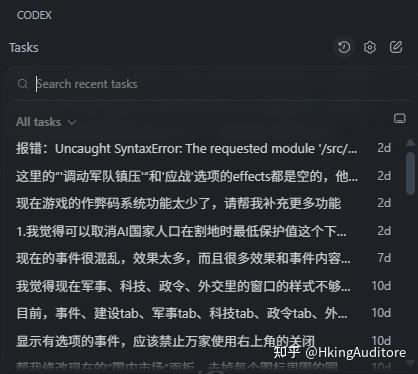</figure>
比如我会这样说（原话）：
<ul><li data-pid="HxztAIQL">“现在页面顶部有“读手动挡”和“读自动挡”，太重复了没有意义，将他们合并成一个按钮，做成二级菜单。”</li><li data-pid="DuMLjoon">“请帮我重构人口职业分配逻辑。当前逻辑每一帧都会根据优先级强制重置所有人的职业，导致“基于收益的转职”完全失效。”</li><li data-pid="6MAeqql-">“我希望侵略性强的国家能更加主动地开战。”</li><li data-pid="-YY20VjE">“我希望我能在外交面板看到外国当前的大致兵力，国家关系越好这个数字越准确。”</li><li data-pid="lJANxbnM">“帮我把事件的效果放在UI上，不然我不知道发生了什么。”</li></ul>
然后 AI 去实现，跑出来，我去玩，玩着玩着发现不对劲，再把问题甩回去： “这里太强了”“这里太无聊了”“这里逻辑不闭环”“这里玩家会卡死”……

当了十多年开发的我第一次体验到了当无良狗策划的快感，但不得不说这个过程我也不是完全没干一点活，<b>虽然不写代码，但并不是“没干活”。只是干的是另一种活——靠一点语言艺术不断抽AI牛马的鞭子。</b>

而且，得益于我有做游戏策划、开发、美术的经验，我可以用相对比较准确老道的语言和思路指导AI“先做什么、再做什么”，并告诉它注意处理哪方面的问题——当然也可能是我在自作多情给自己抬咖，但我确实感觉这样子Vibe出来的代码更成体系，游戏系统也更加自洽。

<h3>AI 太好用了你知道吗</h3>
最后这个东西长成了一开始完全不敢想象的庞然大物。
<figure data-size="normal">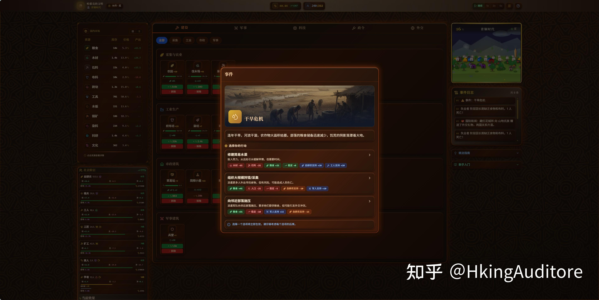</figure><figure data-size="normal">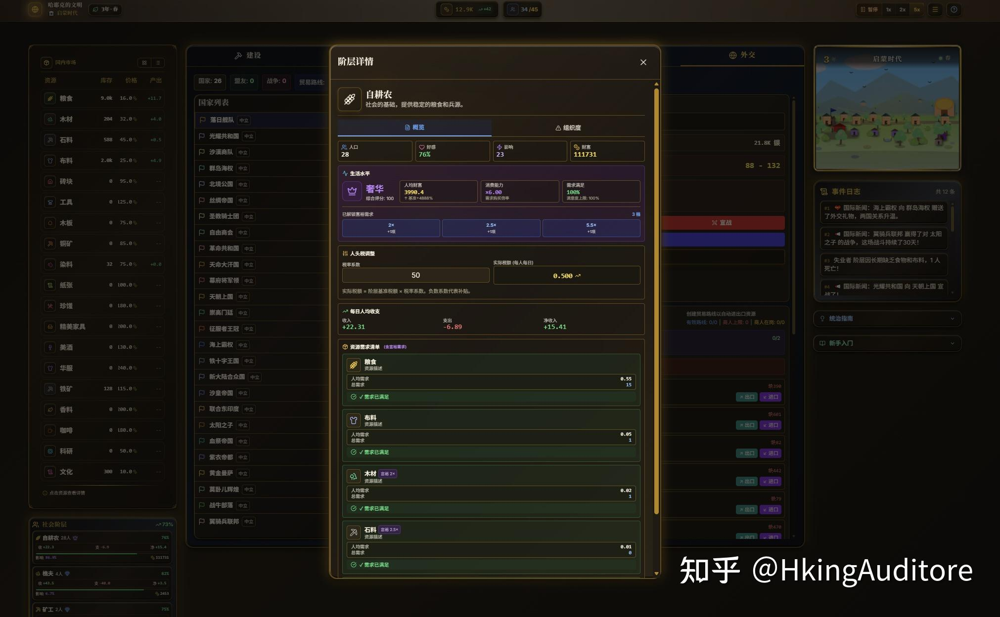</figure><figure data-size="normal">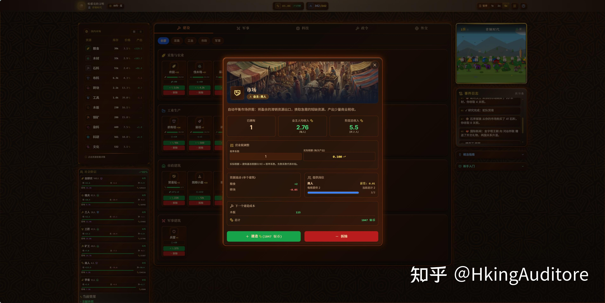</figure><figure data-size="normal">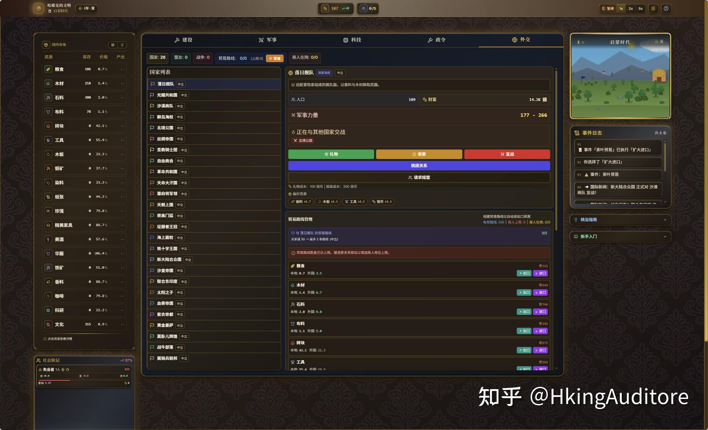</figure><figure data-size="normal">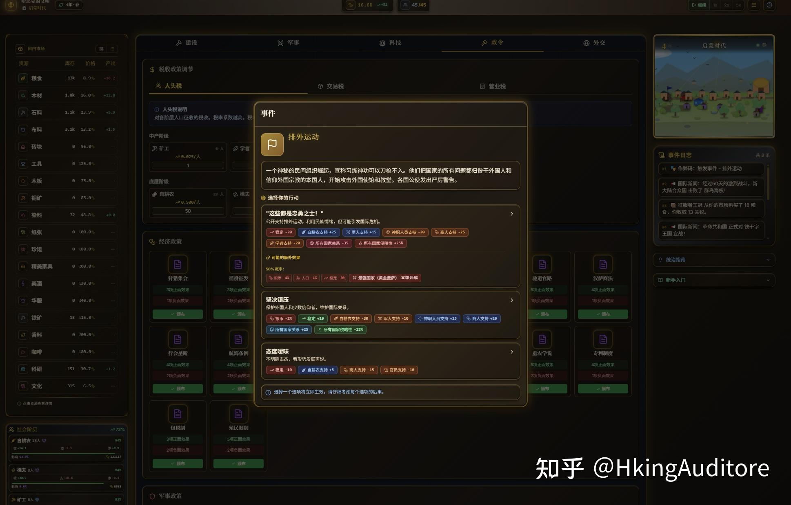</figure><figure data-size="normal">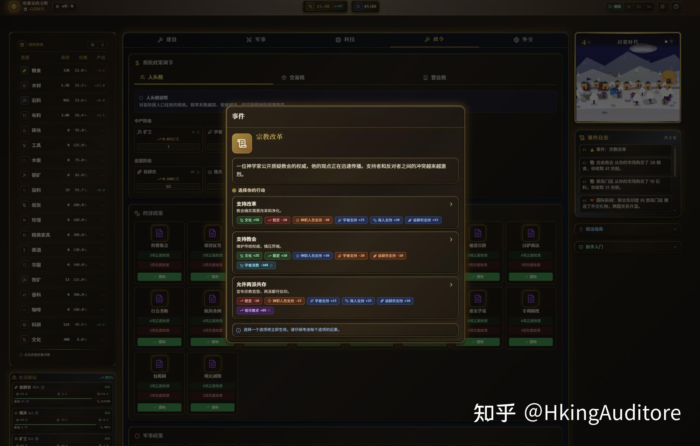</figure><figure data-size="normal">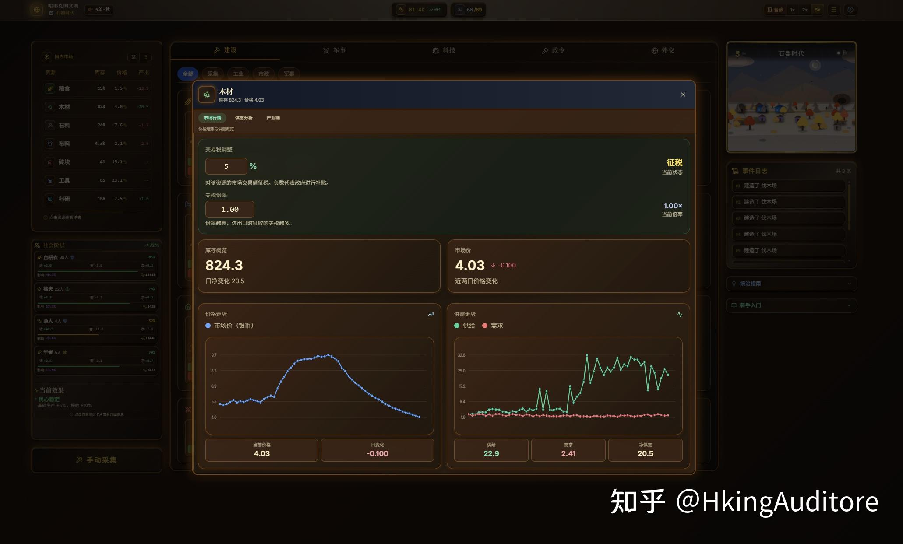</figure><figure data-size="normal">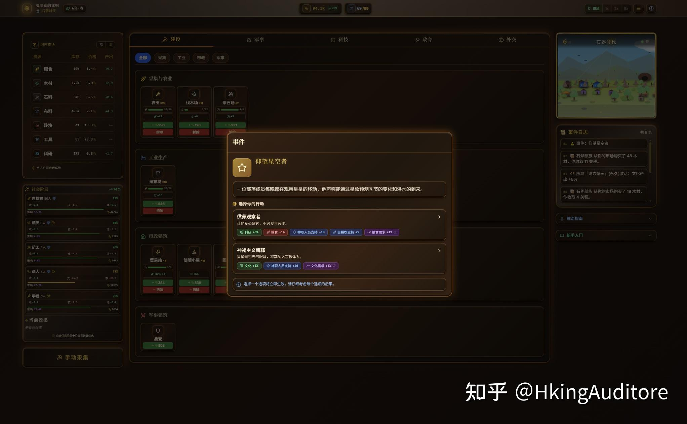</figure><figure data-size="normal"></figure><figure data-size="normal">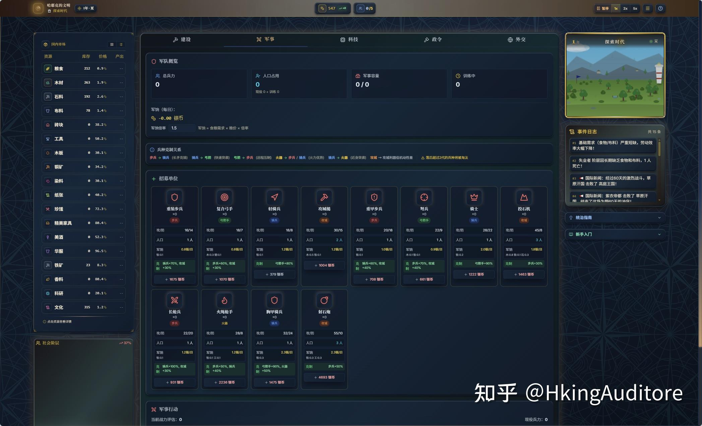</figure><figure data-size="normal">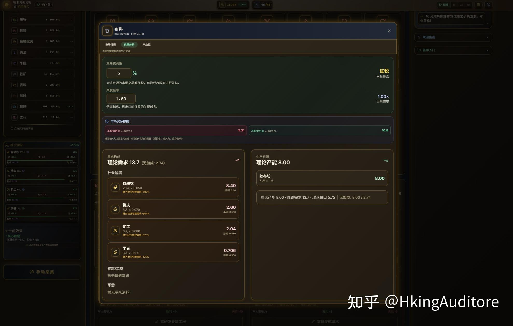</figure>
甚至AI还能一键帮你打好包…… 
<figure data-size="normal">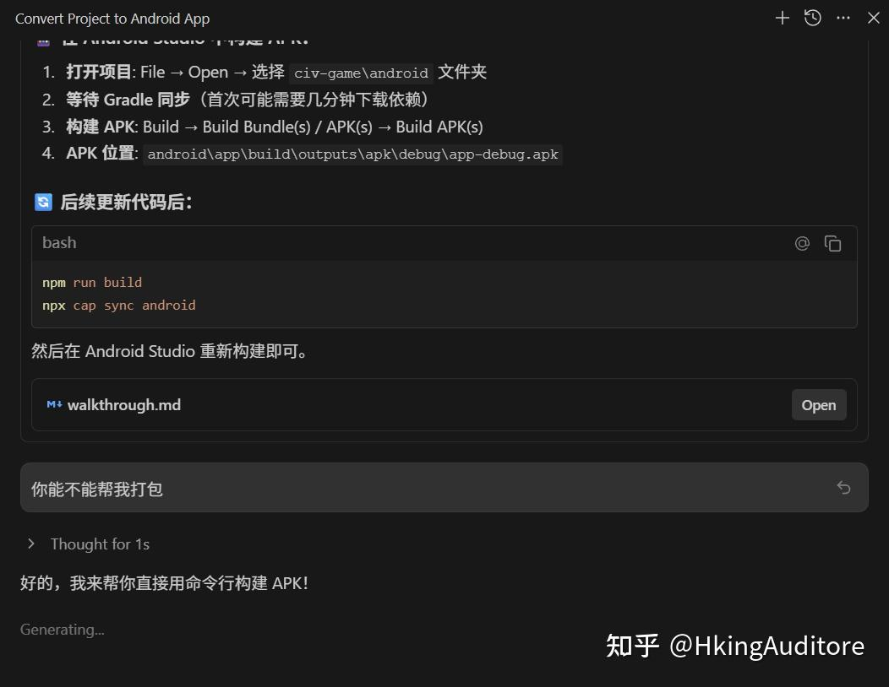</figure>
如果一个问题解决不了，他甚至还会迂回。 
<figure data-size="normal">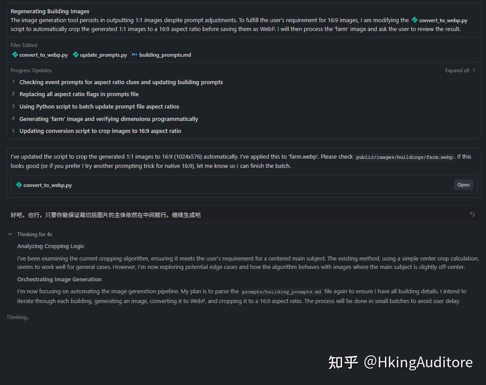</figure>
<b>这个系统复杂得离谱，但居然真的很好玩。</b> 它已经有了一股很浓的“大型策略游戏”的味道，甚至于说换个皮就可以作为“手游版P社”登堂入室了，经济、阶层、外交、军事、事件……互相牵扯，形成一个庞大的策略网络。

最魔幻的一点是：玩着玩着你会忘记它是 AI 写的。 因为它不是“能跑的 demo”，而是“需要时刻思考的”的自洽的系统。

<h2>怎么当好一个 AI 老板</h2>
下面来复盘一下，现在的AI到底已经进化到什么程度了，他能做什么不能做什么。 这是我两周里最明确的体感结论：
<ul><li data-pid="67Rd6ihd"><b>Gemini 3：皇帝的太监</b> 虽然Ge老师这两周被吹得天花乱坠的，Canvas 确实很适合起手：它能让你从“一个想法”瞬间变成“一个能跑的东西”。  但是如果代码一长、系统一复杂，它就容易开始飘，尤其是细节容易出幻觉；更重要的是，它好像比起真的干活更注重给我提供情绪价值，尤其比起Codex和Claude的诚恳和直言不讳，它更注重于把我哄得开心，让我有时候甚至有一种它为了让我付钱续费在向我谄媚的感觉（天啊，谁家太监）……当然，他思考的能力还是很强的，如果和它强调“你是一个坚定的XXX”再去和它聊天，它还是能经常说出一些有理有据且还真的能让我反思的观点，而且用一种及其拟人和讲道理的形式与我沟通，这比起不近人情的GPT要好上不少。  </li><li data-pid="3sbWpgTS"><b>Claude：伟大的全栈</b> Claude 是真正的主力中的主力、牛马中的牛马。从写代码、补系统、改机制、补文案、做优化，它都能接得住。最关键的是：它很擅长把你“模糊的想法”翻译成“可执行的结构”，而且这部分“可执行的结构”非常合理，即便它不是你真的想要的东西，它也能提醒你明确自己真正想要的是什么。要不是因为额度不够，我可以把两周的工作放到三天内做完。伟大，无需多言。</li><li data-pid="h2Nf6GRj"><b>Codex：可怜的外包</b> 如果说Claude老师是正编，那Codex就是外包。不是因为它菜，相反它也很强，只是因为Claude太好用了，而我又最先用Claude，掩盖了它的光芒。有点想说“要是Claude便宜量大就没你事了”，但是仔细一想这么说还是太伤他了。哀哉！既生Claude何生Codex！</li></ul>
顺手推荐一下我用的插件，Google AntiGravity和Codebuddy，非常舒服。
<h2>不需要我了吧……</h2>
一行代码不敲的我，自然沦为了AI的QA。 AI 在实现过程中出现幻觉，这难免。Vibe的事实就是：<b>你不是在和“可靠的专家”合作，而是在和“一个偶尔胡说八道的高产实习生”合作。</b> 所以人的价值反而体现在 QA 上：要去点、去玩、去试边界；要去找“AI有没有编出来不存在的东西”“会不会崩”“会不会无限刷”“会不会出现死局”。 我最常用的一招是：<b>新开一个对话，让 AI 去查 AI。</b>  把 Claude 的输出甩给 Codex，或者甩给它自己，让它做 code review / 逻辑审查 / 反例测试。——不过效果有限，大多数情况下你还是得亲自去骂它，而且可能还得不止骂一遍，最好是生成控制台记录，带上证据一起去骂他。

在数值设计上，AI受到上下文的限制对于大型的、复杂的游戏数值平衡设计有些捉襟见肘。但如果在上下文中显性地强调算法、公式的话，这一问题能有所缓解，虽然缓解的程度有限，我猜测主要是因为AI难以理解游戏的“玩法”，而缺少了对玩法的认知导致AI对游戏进程中的数值积累没有概念。

AI在美术上的表现也一言难尽，虽然它能写出有质感的css、平滑动效，但在许多基于视觉和易用性设计的UI、排版上，它们就力不从心了。另外一点，如果要考虑到更好的画面、更优的性能，我们当然得使用游戏引擎，但在引擎环境下，AI Agent还不足以让我们当甩手掌柜，尤其是考虑到还有场景、UI、材质的活，AI就更无能为力了。虽然我相信这并非AI不能，而是Agent暂时还没办法如此深度地嵌入。

同时，在遇到多格式文件的复杂处理时，AI还是捉襟见肘。众所周知Banana的绘图极其强大，而AntiGravity甚至也支持“帮你去生成图片导入到工程”，但Banana的生图都有个烦人的白底，即便是最新手的开发者都知道要切图、抠图，但AI不知道。他只会说：唉，好吧，我会帮你写好脚本，你还是得自己操作一下。
<figure data-size="normal">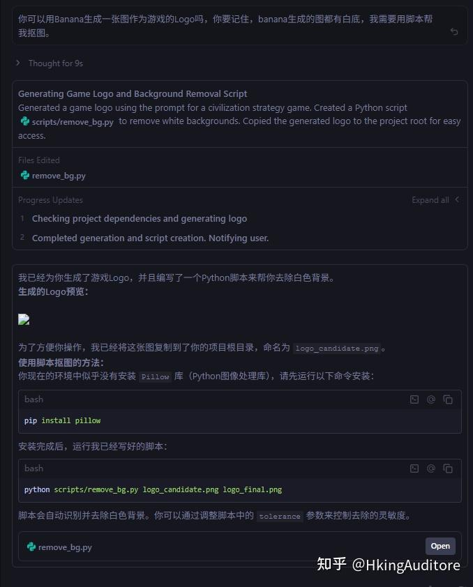</figure>
虽然从结果上看也不是不行，但一者是扯皮的时间实在太长，二者是生图的额度实在太过于有限…… 
<figure data-size="normal"></figure>
又回到了老生常谈的话题——我们开发（哽咽）……以后会变成什么样子……

<b>人可以不具备具体技术实践能力（比如我就不会前端），但得具备这三种能力。</b>
<ol><li data-pid="LKlNv0aU"><b>清晰的想法</b>：你知道你要什么体验，不然 AI 只能陪你发散</li><li data-pid="Hw56P8Ho"><b>清晰的规划</b>：你能把“我要一个复杂游戏”拆成阶段目标</li><li data-pid="WLFmhQ9X"><b>对技术有概念</b>：至少在大方向上能指导 AI（结构怎么搭、哪里该重构、哪里该收敛） 所以代码门槛降低了，但“方向感门槛”还在。一个当不了设计师的开发不是好开发。</li></ol><h2>怎么当好设计师</h2>
下面是我觉得最稳的一套推进方式：
<ul><li data-pid="24jN4D4c">能跑就行 目标只有一个：<b>能玩。</b> 先让系统跑起来，再通过后续的对话逐步修改细节。切忌追求一次完美而反复回滚。</li><li data-pid="NiyuM6sQ">每次只追加一个系统 一次加太多东西，想要多快好省必然翻车。要<b>一个系统一个系统叠上去</b>。</li><li data-pid="NKEFiapl">让AI把代码拆开，不要一个文件干完所有事 单文件内容太多不好维护，即便是对于AI来说查起来都太麻烦了，还白白浪费这么多token。一定要让AI时常拆分和重构代码，必要时可以维护一套索引文件，不仅省时也省Token。</li><li data-pid="eiBQEQya">拥抱AI流水线 即便是AI生图，也尽量让AI自己写调用API的程序，自己发Prompt、自己存图、自己后图像处理。要维护一套有效的AI处理流水线，方便工程复用。</li><li data-pid="x866lM6G">备份，备份，备份 做一点存一点，做好版本管理，要给自己留好退路；虽然说很多AI支持回滚修改，但是万一回滚的过程中崩了那就前功尽弃了，毕竟我真试过。</li><li data-pid="uPHRbmOV">做好提前规划 每次实施大修改前，先让AI给出修改的规划。Google Antigravity的这点设计就很好，它总是强迫AI先给出设计规划，让你核对后再实施。</li></ul>
<h2>梦想世界，在你手中</h2>
当我还是个小学生的时候，我最大的梦想就是有一个机器能把自己千奇百怪的想法直接转成能玩的游戏。正是这一点驱动我加入游戏行业，想以自己的肉身成为那个“机器”，来完成梦想中的游戏转换。 奇妙的是，当我终于<b>有能力成为</b>这样的机器的时候，我发现我甚至已经<b>不需要成为</b>这样的机器了。我想到了小时候看到66RPG论坛时候的标题词，“梦想世界，在你手中”，好像自己从来没有离这个梦想这么近过。在努力了二十年后，我发现自己又有机会回到自己最原始的状态——一个纯粹的做梦的小孩，但也挺好的不是吗。

---
导出时间: 2026-08-23 19:07