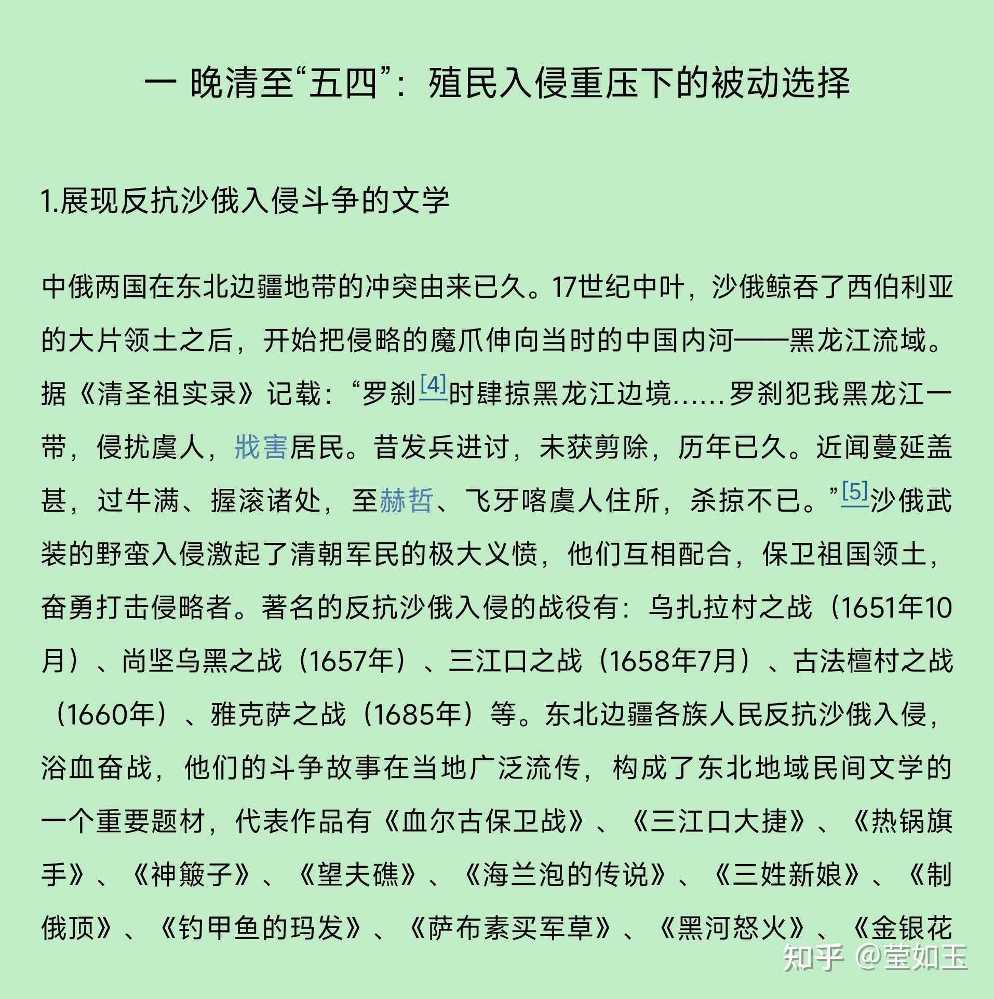
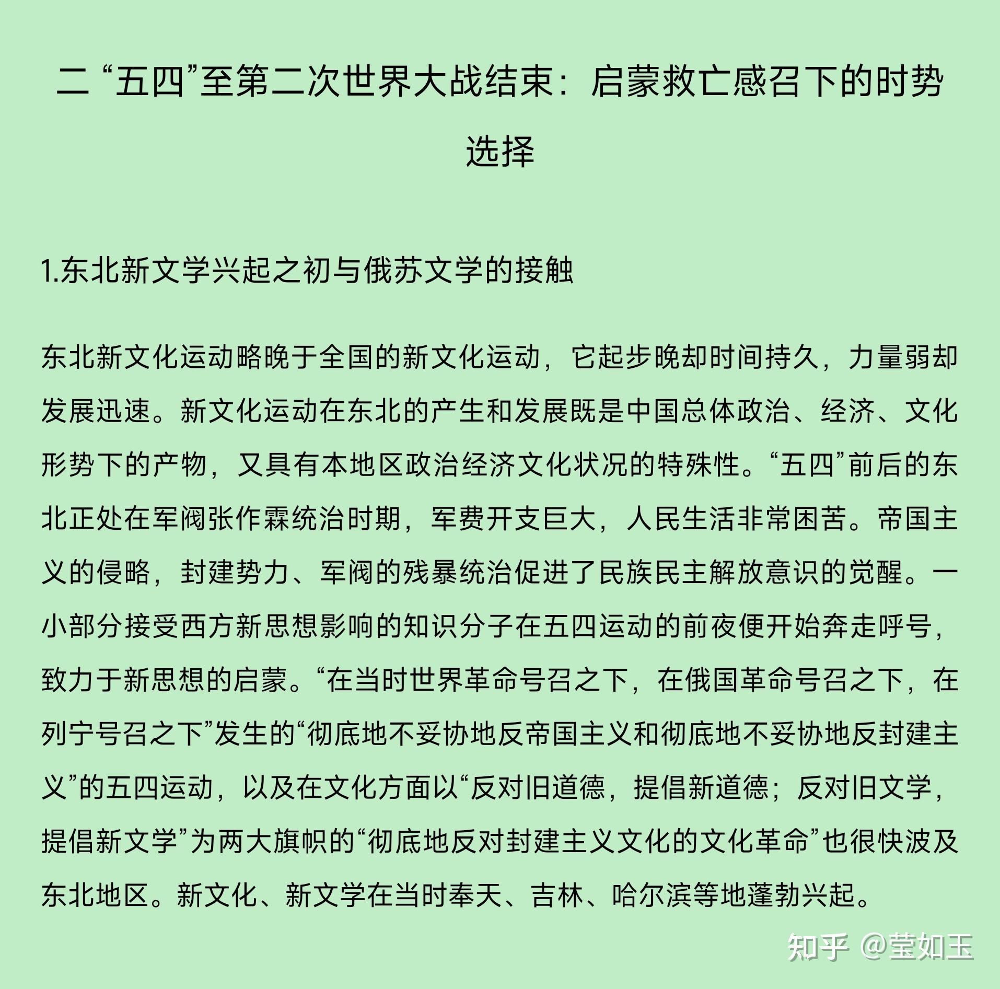
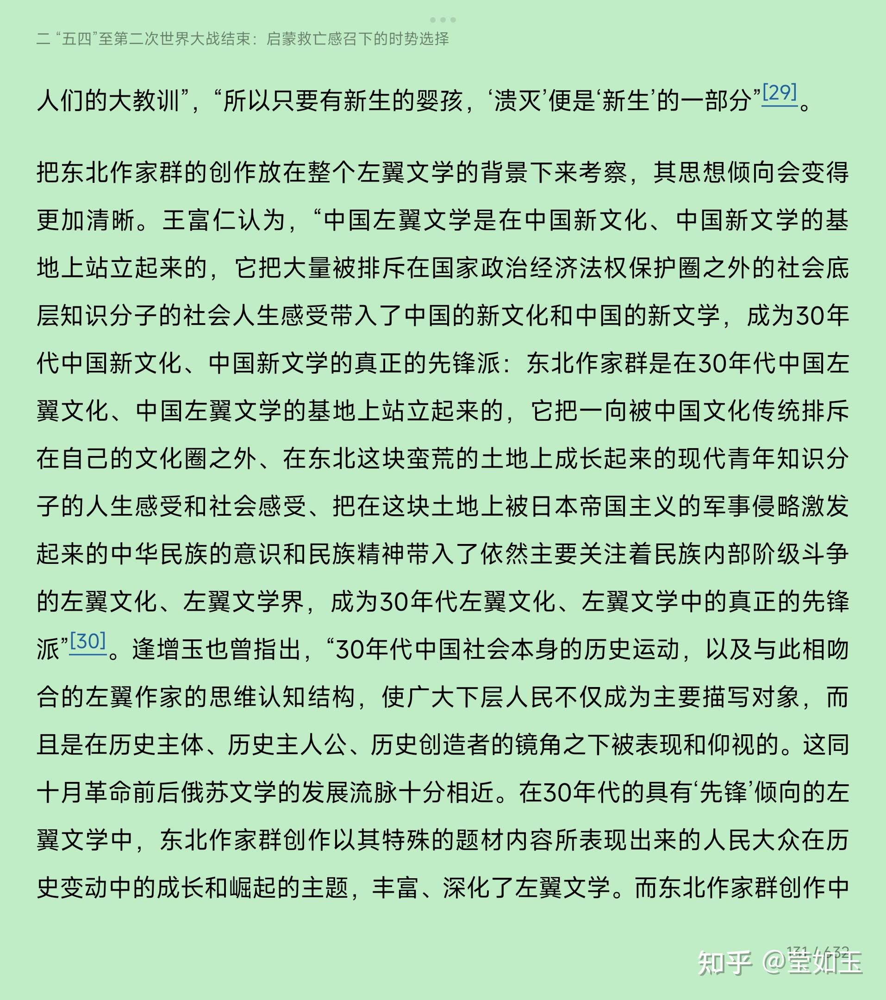
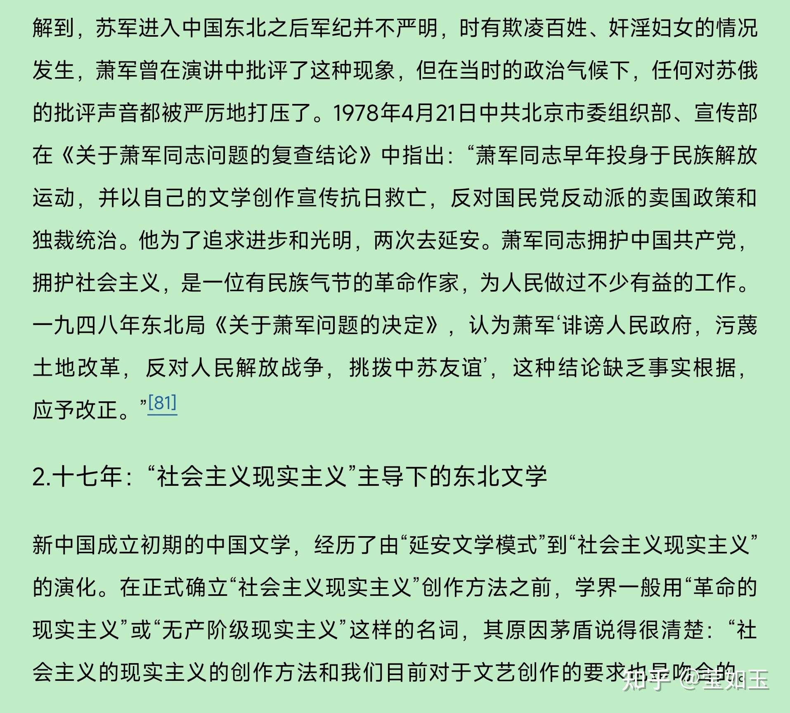

# 从东北文学谈东北，东北文学见证了哪些历史变迁？

| 项目 | 内容 |
|---|---|
| 类型 | answer |
| 作者 | 莹如玉 |
| 收藏时间 | 2025-12-11 21:31 |
| 发布时间 | - |
| 收藏夹 | 抗联 |
| 原链接 | https://www.zhihu.com/question/13528319415/answer/1982563085848946660 |

## 摘要

东北文学反映的就是东北历史。由于清朝长期的封锁，东北在清朝时期文化发展是相当落后的，晚清民初的市民生活是这么个状态: 在沈阳城西门脸的德泰轩茶馆门前，一辆装着八个大木桶的马车，正把一个个从大北关八王寺甜水井装满甜水的大木桶卸下车。时近中午，德泰轩茶馆座无虚席，人头攒动，因为天茶馆邀请李庆魁和芦醒生等著名评书演员轮流演出，每天早场是从中午到午后四点，晚场是六点到九点。在沈阳城的北市场“杂巴地儿”，此…

## 正文

 东北文学反映的就是东北历史。由于清朝长期的封锁，东北在清朝时期文化发展是相当落后的，晚清民初的市民生活是这么个状态:
<blockquote data-pid="0Vkg2bnp">在沈阳城西门脸的德泰轩茶馆门前，一辆装着八个大木桶的马车，正把一个个从大北关八王寺甜水井装满甜水的大木桶卸下车。时近中午，德泰轩茶馆座无虚席，人头攒动，因为天茶馆邀请李庆魁和芦醒生等著名评书演员轮流演出，每天早场是从中午到午后四点，晚场是六点到九点。在沈阳城的北市场“杂巴地儿”，此时早已热闹非凡，有打把势卖艺的，“有说单口相声的，有说长篇评词的，有唱大鼓的，每表演10分钟，演员就手端小笸箩向观众收一次钱”。还有爻卦算命的，在街边放张桌子，桌上铺块布，向下垂着，布心画个“阴阳鱼”，桌上放个带盖的卦筒和敞口的竹筒。卦象“如是灾难，他能破解，并向人要钱，这叫做‘卦礼’。如是‘上上卦’（上等好卦），还得多给几个‘卦礼’钱”。入夜，各大戏院灯火通明，当时的名家名角纷纷登台献艺。此外，各个妓院也到了忙碌的时候，打扮妖艳的妓女们倚着门，招揽客人，浑身上下无不散发着大众文化的俗气。[ 郎元智：《近代东北城市生活中精英文化与大众文化的冲突与融合》, 《城市学刊》2015年第7期。 ]</blockquote>
 在《东北文学通史》里是这样描述的:
<blockquote data-pid="FVn-wBST">由于清廷对东北的封禁，东北文化出现了严重的滞后，是时江南一带资本主义经济已经有所发展，报纸等典型近代传媒也已经出现，但东北的报纸却少之又少，1620年的一份塘报，成为东北可考的第一份报纸。近代东北报纸多为日俄殖民者创办，国人自办的报纸不仅数量少，而且要受到严格的控制，但是文学仍然在这样的环境中得到快速的发展。报纸出现后，文坛的变化，正如郑振铎所言：“梁启超开辟了新闻文学的大路……小说和戏曲在这时，俱有复由士大夫之手而落到以市民为中心之概；其一是昆腔的消沉与皮黄戏的代兴；其二是武侠小说与黑幕小说的流行。文坛的重镇渐渐由北京的学士大夫而转移到上海的报馆记者们与流浪的文人们，像王韬、吴沃尧辈之手。正足以见到新兴的经济势力，正在侵占到文学的领域里去。”东北的文学格局亦出现了如上变化，文学由庙堂走向民间，职业作家代替了文人士大夫，小说等通俗文学体裁逐渐取代了诗歌的主导地位。……</blockquote>
所以，随着清朝覆灭，东北同时受到外界日俄帝国主义的影响，和来自关内的相对先进文化冲击，文化变迁影响巨大，张家父子时代，伪满时代，解放战争时代，新中国前三十年时代，改开后时代，不同的历史产生了不同的文学。以八十年代以后的东北文坛为例，当时的状况是这样的:
<blockquote data-pid="mZKEVqv8">  在新时期的东北文坛，文学的发展既受到了主流文学思潮的冲击，又具有自身的特色；既有金河、邓刚、白天光、谢有鄞为代表的乡土寻根文学，张抗抗、梁晓声为代表的知青文学，马原、洪峰为代表的先锋文学，又有阿成、迟子建等独具个性的创作，呈现出较为繁荣的创作格局。新时期东北文学可说是继现代的东北作家群崛起之后又一股强劲的“东北风”。探讨俄苏文化和文学对新时期东北文学的影响，首先需要厘清其发展的脉络和走向。在新时期的东北作家中，马原可说是一个另类。他1982年毕业于辽宁大学中文系，同年赴西藏做记者，1989年才返回沈阳。他的作品基本是以西藏为背景展开的，很少对东北地域的描写，而且他的写作受拉美文学影响较为明显。相比而言，同为先锋文学主将的洪峰则主要将目光投射在东北地域，作品中充盈着东北地区独特的地方风情，表现了对历史和人生的深刻思考。可以说，新时期东北文坛的大多数作家都是以东北地区历史文化的变迁和人们的生存境遇为创作源泉的，并且在理论上提出了“东北文学”的概念。……</blockquote>
 

  尤其是反映东北历史文化的文学作品，像下文这样列举了一大堆代表之作，不过说实话，除了邓刚的作品，其他我读过的不多:
<blockquote data-pid="Dfy-P8cY">  新时期东北文学的创作成就应首推蕴含东北地域文化特征的乡土文学。早在20世纪80年代初期，在金河、邓刚、阿成、张笑天、迟子建等作家的创作中地域文化特征已初见端倪。“东北文学”口号的提出，更加有力地推动了东北地域文学的发展，“尤其是涌现出了一批致力于东北地域历史文化探索的作家和作品。<b>诸如金河的小说集《不仅仅是留恋》，邓刚的《迷人的海》，张笑天的《木帮》，韩汝诚的《乌兰察布眷情》、《金香炉》，王宗汉的《情债》、《关东响马》、《末代马贼》，于德才的《焦大轮子》，白天光的《七角猪的悲剧》、《牛血大旗杆》，孙春平的《轱辘吱嘎》，王立纯的《边城三老》、《熊骨烟嘴》，阿成的《年关六赋》、《远东笔记》，迟子建的《北极村童话》、《伪满洲国》等作品，</b>不断探索地域历史文化的积淀及其对现实生活的影响，在人物塑造、揭示生活矛盾、叙写生存状态中都侧重于对民族文化心理的开掘，表现了作家新的审美视角和新的思维方式。其显著特征是将人物置于历史和现实的空间，赋予人物命运纵深的历史感，探寻东北人性格、精神生成的文化奥秘，从中提升一种文化的生命精神</blockquote><figure data-size="normal"></figure>
 
<figure data-size="normal"></figure>
 
<figure data-size="normal"></figure>
 
<figure data-size="normal"></figure>

---
导出时间: 2026-08-23 19:07