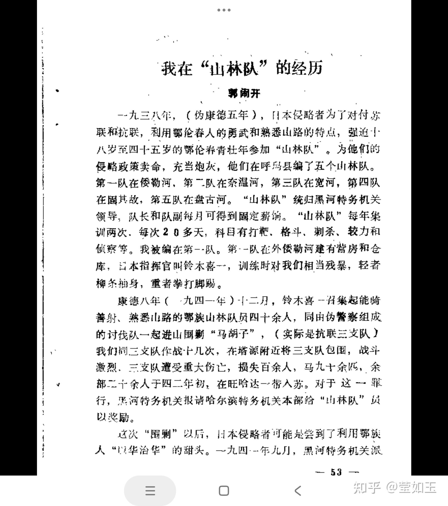
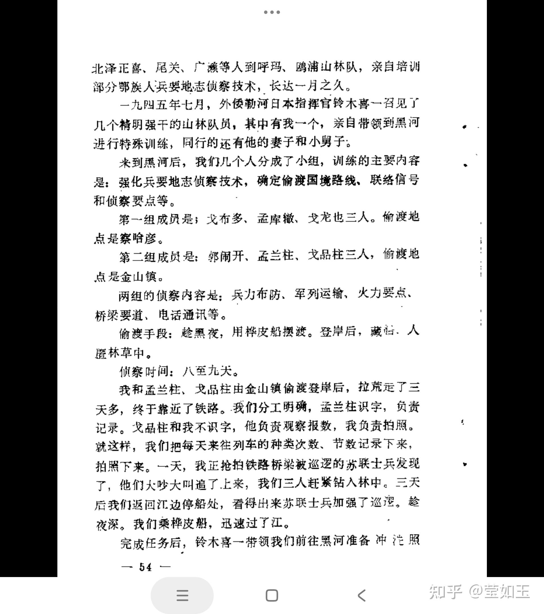
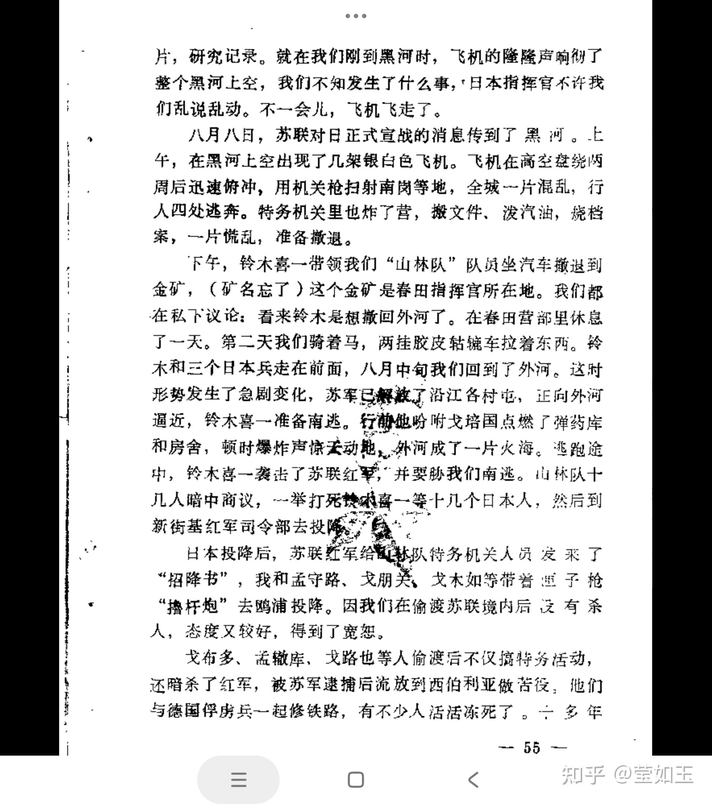
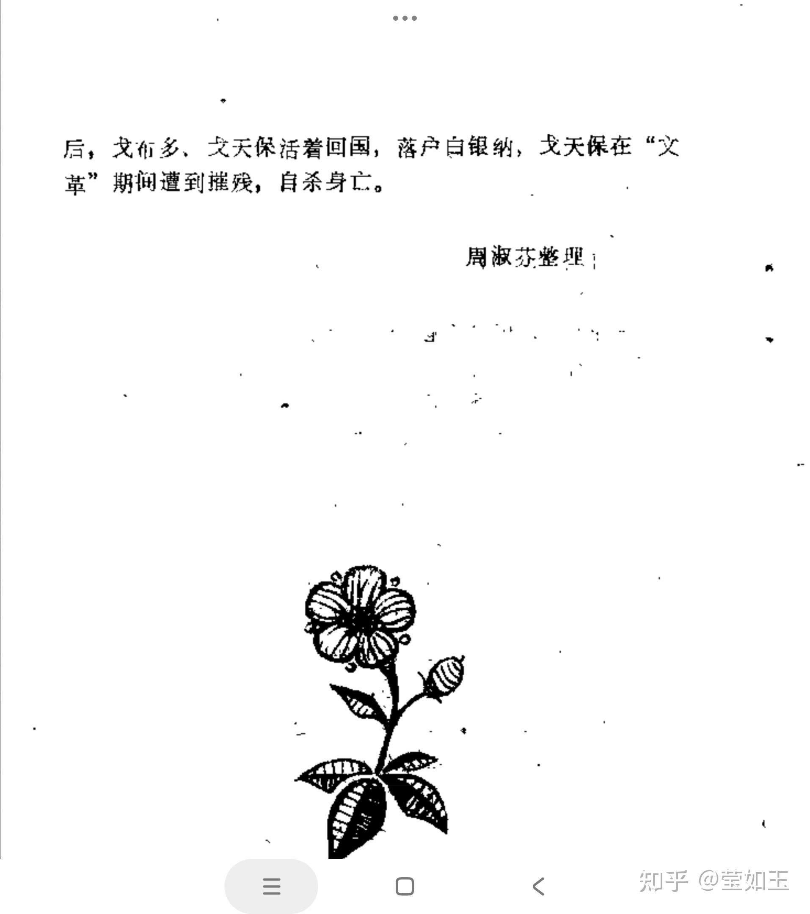

# 抗日战争中有哪些故事？

| 项目 | 内容 |
|---|---|
| 类型 | answer |
| 作者 | 莹如玉 |
| 收藏时间 | 2025-12-09 07:52 |
| 发布时间 | - |
| 收藏夹 | 抗联 |
| 原链接 | https://www.zhihu.com/question/394227579/answer/1981632327969964170 |

## 摘要

抗战期间，一个鬼子军官叫铃木喜一的，组织了一支鄂伦春族猎手为主体的&#34;讨伐队&#34;，由于鄂伦春猎手熟悉地形，精通雪地林地作战，枪法又好，对抗联造成极大的威胁，抗联名将王明贵在回忆录中，就详细描写了铃木喜一讨伐队给抗联造成的巨大损失。然而，铃木喜一成也成功在这支鄂伦春讨伐队身上，死也死在这支鄂伦春讨伐队手里，苏军出兵东北后，这支讨伐队立刻反水，将铃木喜一以下十几个日本人全部干掉，向苏联投降，有的被宽恕，有…

## 正文

  抗战期间，一个鬼子军官叫铃木喜一的，组织了一支鄂伦春族猎手为主体的&#34;讨伐队&#34;，由于鄂伦春猎手熟悉地形，精通雪地林地作战，枪法又好，对抗联造成极大的威胁，抗联名将王明贵在回忆录中，就详细描写了铃木喜一讨伐队给抗联造成的巨大损失。然而，铃木喜一成也成功在这支鄂伦春讨伐队身上，死也死在这支鄂伦春讨伐队手里，苏军出兵东北后，这支讨伐队立刻反水，将铃木喜一以下十几个日本人全部干掉，向苏联投降，有的被宽恕，有的被扔到西伯利亚服苦役。

  下文是抗联的王明贵老将军回忆录中对这支日寇傀儡队伍的描述
<blockquote data-pid="RXA258ik">2月初，我们经过北西里金矿顺着倭勒根河向余庆公司老沟行进时，突然遭到伪黑河省日军铃木喜一上尉网罗的猎民讨伐队的袭击，给我军造成很大损失，受伤20余人，牺牲20余人，其中有英勇善战、屡建功勋的大队长杨利荣……铃木喜一讨伐队，象魔鬼一样缠住我三支队不放。为了甩掉敌人的尾追，我们曾想了很多办法，有时在伊勒呼里高峰的密中昼夜穿行，有时在呼玛河、多布库尔河边隐蔽，但始终未能脱开敌人的暗中监视……拂晓，我三支队到达库楚河边的山坳。休息时，我和几个干部去察看地形，准备打击尾追之敌。但我们万万没有想到往南二里多远就是敌人讨伐队的营地，伪黑河省铃木喜一讨伐队发现我部后，便悄悄地占领了库楚河东西两个制高点，隐蔽在丛林里，从东、南、西三面将我部包围。当我们察看了北边的地形后刚回到篝火旁，敌人的枪声就响了。我们的马匹被枪声惊得四处逃散。我当即命令徐宝和带领20多名战士抢占西边的小山包。由于敌人占据了有利地形，又穿着白色狍皮大衣伏在雪地上，隐蔽在树林里，我们很难发现目标，而我们却暴露在敌人的射程之内，处于十分被动的境地。我三支队全体指战员团结一致，顽强抵抗，整整打了一天，我们百余人的队伍只剩下25人了，其中还有几名伤员……</blockquote><h2> 而在文史资料中，也读到了其队员在解放后的回忆</h2>
<b>一，接受训练，围剿抗联</b>

 

一九三八年，（伪康德五年），日本侵略者为了对付苏联和抗联，利用鄂伦春人的勇武和熟悉山路的特点，强迫八岁至四十五岁的鄂伦养青壮年参加“山林队”。为他们的侵略政策卖命，充当炮灰，他们在呼马县编了五个山林队。第一队在倭勒河，第二队在奈温河，第三队在宽河，第四队在固其故，第五队在盘古河。“山林队”统归黑河特务机关领导，队长和队副每月可得到固定薪饷。“山林队”每年集训两次，每次20多天，科目有打靶、格斗、刺杀、较力和侦察等。我被编在第一队。第·-队在外倭勒河建有背房和仓库，日本指挥官叫铃本喜一，训练时对我们相当残暴，轻者柳系抽身，重者拳打脚踢。

康德八年（一九四一年）小二月，铃木喜-兴集起能骑善射、熟悉山路的鄂族山林队员四十余人，同由伪警察组成的讨伐队一起进山围剿“马胡子”，（实际是抗联三支队）我们同三支队作战十几次，在塔源附近将三支队包围，战斗激烈，三支队遭受重大伤亡，损失百余人，马九十余匹，余部二十余人于四二年初，在旺哈达一带入苏。对于这一罪行，黑河特务机关报请哈尔滨特务机关本部给“山林队”员以奖励。

 

<b>二，越境侦查苏联红军</b>

一九四五年七月，外倭勒河日本指挥官铃木喜一召见了几个精明强干的山林队员，某中有我一个，亲自带领到黑河进行特殊训练，同行的还有他的妻子和小舅子。来到黑河后，我们几个人分成了小组，训练的主要内容是：强化兵要地志侦察技术，确定偷渡国境路线、联络信号和侦察要点等。

第一组成员是；戈布多、孟库辙、戈龙也三人。偷渡地点是察哈彦。

第二组成员是：郭闹开、孟兰柱、戈品柱三人，偷渡地点是金山镇。

两组的侦察内容是；兵力布防、军列运输，火力要点.桥梁要道、电话通讯等。

偷渡手段：趁黑夜，用桦皮船摆渡。登岸后，藏在人瞪林草中。

侦察时间：八至九天。

我和孟兰柱、戈品柱由金山镇偷渡登岸后，拉荒定了三天多，终于靠近了铁路。我们分工明确，孟兰柱识字，负责记录。戈品柱和我不识字，他负责观察报数，我负责拍照。就这样，我们把每天来往列车的种类次数、节数记录下来，拍照下来。一天，我正抢拍铁路桥梁被巡逻的苏联士兵发现了，他们大吵大叫追了上来，我们三人赶紧钻入林中。三天后我们返回江边停船处，看得出来苏联士兵加强了巡逻。趁夜深。我们乘桦皮船，迅速过了江。

 

<b>三，日本战败，杀日投降</b>

下午，铃木喜一带领我们“山林队”队员坐汽车撤退到金矿，（矿名忘了）这个金矿是春田指挥官所在地。我们都在私下议论：看来铃木是想撤回外河了。在春田营部里休息了一天。第二天我们骑着马，两挂胶皮轱辘车拉着东西。铃木和三个日本兵走在前面，八月中旬我们回到了外河。这时形势发生了急剧变化，苏军只解被了沿江各村屯，正向外河逼近，铃木喜一准备南逃。行动前吩咐戈培国点燃了弹药库和房舍，顿时爆炸声惊动，外河成了一片火海。逃跑途中，铃木喜一袭击了苏联红军，并要胁我们南逃。山林队十几人暗中商议，一举打死铃木喜一等十几个日本人，然后到新街基红军司令部去投降

日本投降后，苏联红军给配社队特务机关人员发来了“招降书”，我和孟守路、戈朋美，戈木如等带着盒子枪“撸杆炮”去鸥浦投降。因我们在偷渡苏联境内后没有杀

人，态度又较好，得到了宽恕。

戈布多、孟辙库、戈路也等人偷渡后不仅搞特务活动，还暗杀了红军，被苏军逮捕后流放到西伯利亚做苦役，他们与德国俘虏兵一起修铁路，有不少人活活冻死了。……

 
<figure data-size="normal"></figure>
 
<figure data-size="normal"></figure>
 
<figure data-size="normal"></figure>
 
<figure data-size="normal"></figure>

---
导出时间: 2026-08-23 19:07