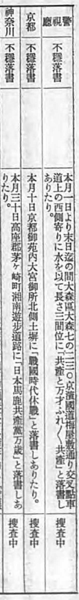
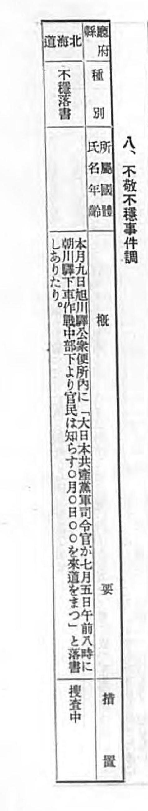
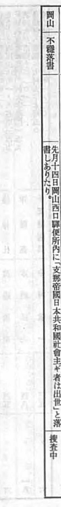
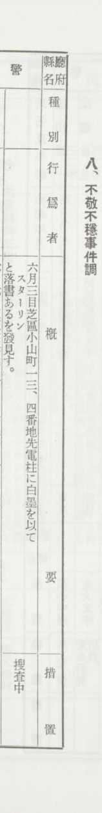
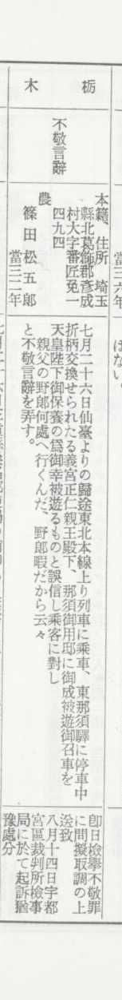
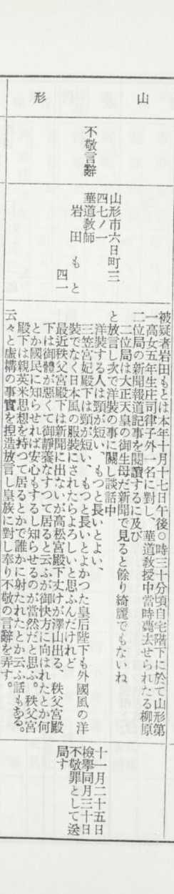
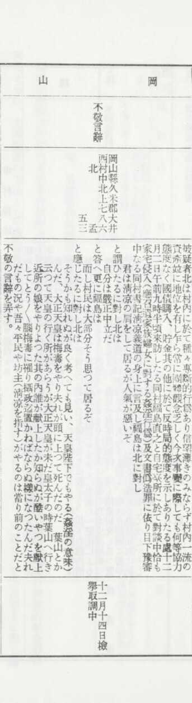
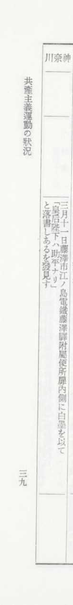
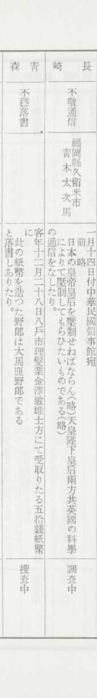
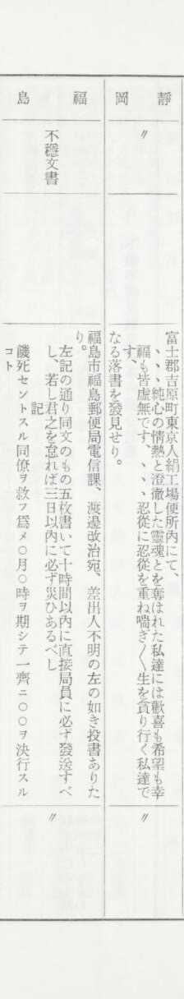

# 有没有很有趣的历史小故事?

| 项目 | 内容 |
|---|---|
| 类型 | answer |
| 作者 | 达尔文蛙 |
| 收藏时间 | 2025-12-09 07:01 |
| 发布时间 | - |
| 收藏夹 | 抗联 |
| 原链接 | https://www.zhihu.com/question/1891409132894021372/answer/1981619501503096201 |

## 摘要

在二战时期，日本政府建立了严密的言论监控体制，任何可能的反政府言论，甚至是流言蜚语都会遭遇严厉的镇压。为了确保不留死角，特高课还把很多乱七八糟的事纳入了侦查范围，为那个恐怖国家留下了几笔令人哭笑不得的历史记录。 在1939年7月的《特高月报》中，特高课上报了数起非常不严肃的“政治案件”，比如神奈川县的一处道路旁出现了“日本马鹿共产党万岁”的标语，以及京都大宫御所北侧的土墙上出现了“战国时代休战”六个大…

## 正文

在二战时期，日本政府建立了严密的言论监控体制，任何可能的反政府言论，甚至是流言蜚语都会遭遇严厉的镇压。为了确保不留死角，特高课还把很多乱七八糟的事纳入了侦查范围，为那个恐怖国家留下了几笔令人哭笑不得的历史记录。

在1939年7月的《特高月报》中，特高课上报了数起非常不严肃的“政治案件”，比如神奈川县的一处道路旁出现了“日本马鹿共产党万岁”的标语，以及京都大宫御所北侧的土墙上出现了“战国时代休战”六个大字：
<figure data-size="normal"></figure>
后者大概是被当作反战言论来看待，而前者⋯⋯把这种东西写进报告里，或许是想为极权政治增添一点活跃的气氛？

除了户外空间，特高课还会搜查公共厕所。他们在旭川站的公厕内发现了“大日本共产党军司令官某时到朝川站作战，附近官民应夹道欢迎”的涂鸦，西口站的厕所内则有“██帝国日本共和国社会主义者崛起”的口号：
<figure data-size="normal"></figure>
 
<figure data-size="normal"></figure>
除这类抽象言论外，倒也有稍微直接些的涂鸦被记录在案，比如1943年8月的《特高月报》提到在东京芝区的电线杆上有人写“斯大林”：
<figure data-size="normal"></figure>
 

除了这类“进步言论”，特高课的另一个工作重点是大不敬言论，如埼玉县的一个农民以为自己遇到了昭和的专列，于是破口大骂，“这个无所事事的混蛋又要去哪里”：
<figure data-size="normal"><figcaption>1943年8月《特高月报》，值得注意的是，此人被暂缓起诉</figcaption></figure>
或是山形市一个喜欢谈论皇室八卦的花道教师，她评价三笠宫妃的脖子太短，认为昭和的老婆应该少穿洋装，多穿日本风的服装：
<figure data-size="normal"><figcaption>1943年12月《特高月报》</figcaption></figure>
我寻思这不是妥妥的爱国主义言论，大大滴良民？建议特高课严查昭和是不是娶了个英米特務⋯⋯

还有一些非常日本的大不敬言论，冈山县的一个村民向大家爆料，为什么大正是个傻子？因为他嫖宿民女得了脑梅毒！
<figure data-size="normal"><figcaption>1941年12月《特高月报》</figcaption></figure>
以及藤泽市有人意淫皇后：
<figure data-size="normal"><figcaption>1942年3月《特高月报》</figcaption></figure>
昭和：我去，你怎么知道？

另外这也算共产主义运动吗（恼

最为可笑的是，特高课的报告中甚至出现了根本不涉政的事件，像是有人在纸币上写“制造纸币的人是大笨蛋”：
<figure data-size="normal"><figcaption>1940年1月《特高月报》</figcaption></figure>
福岛有人寄“不转发多少份就会倒大霉”的诅咒信（这个行为这么古老的吗），以及静冈县有工人心情郁闷：
<figure data-size="normal"><figcaption>1940年7月《特高月报》</figcaption></figure>
不知在当今世界的某个角落，是否依旧有秘密警察在追查同样荒诞的案件呢？

 
<a data-draft-node="block" data-draft-type="link-card" href="https://www.zhihu.com/question/328348392/answer/1932750315855280051?share_code=rOaRGfXwj4WQ&amp;utm_psn=1981579493727553521" data-draft-title="有没有比较有趣冷门的历史小趣事？" data-draft-cover="https://pic1.zhimg.com/v2-cdb51e69a3e185e19d7d5a42eff76440.jpg?source=7e7ef6e2&amp;needBackground=1" class="internal">有没有比较有趣冷门的历史小趣事？</a>

---
导出时间: 2026-08-23 19:07