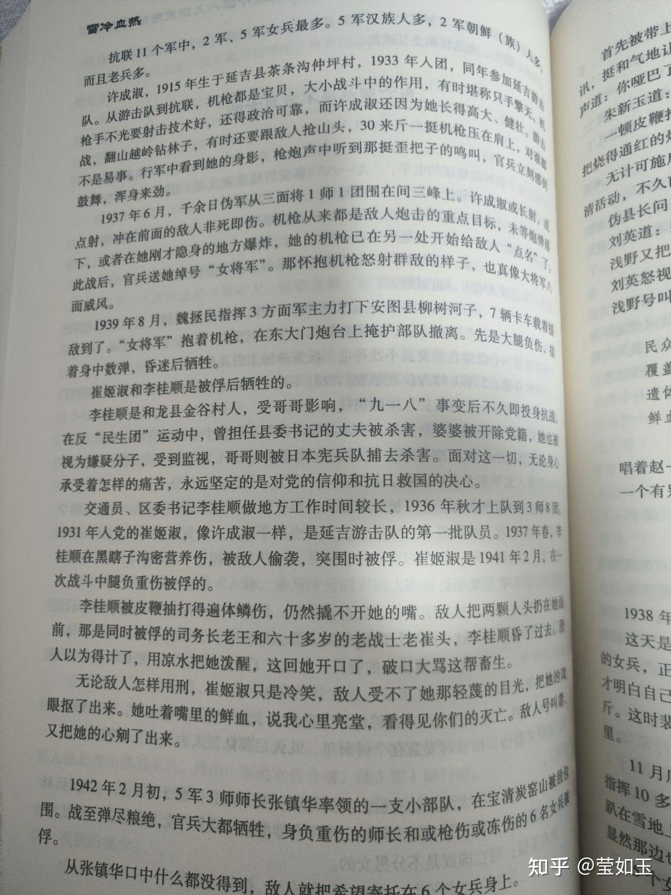
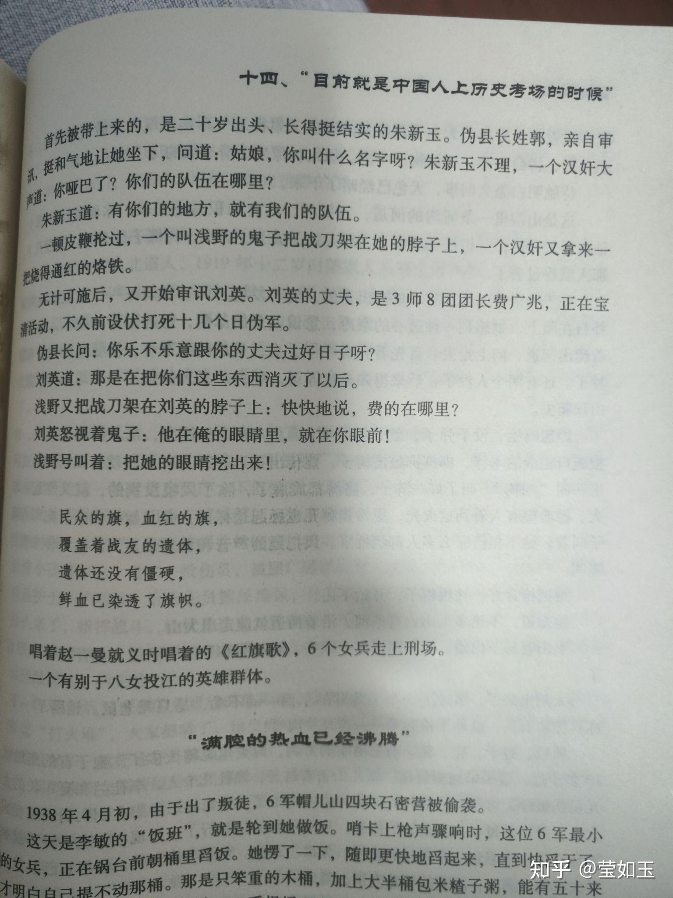
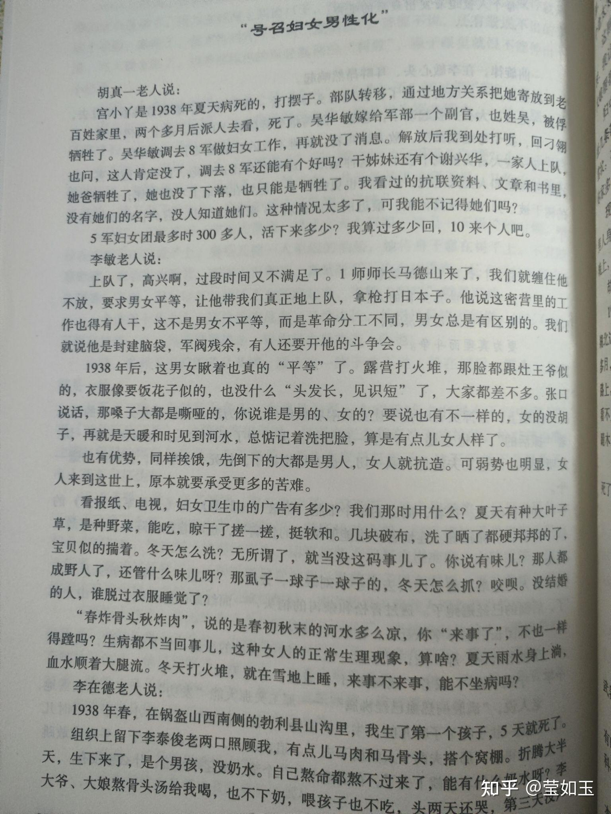
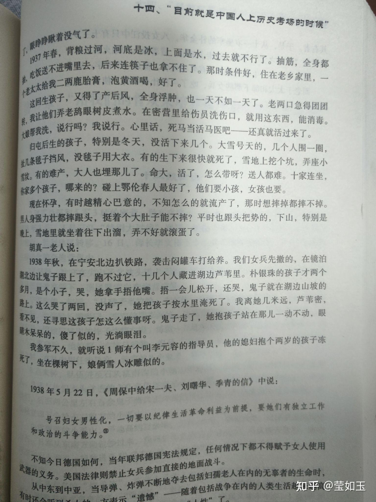

# 历史上有让人一听就落泪的故事吗？

| 项目 | 内容 |
|---|---|
| 类型 | answer |
| 作者 | 莹如玉 |
| 收藏时间 | 2025-11-08 19:51 |
| 发布时间 | - |
| 收藏夹 | 抗联 |
| 原链接 | https://www.zhihu.com/question/2375245278/answer/1970579280846099866 |

## 摘要

抗联的女兵们， 抗联第五军有三百多名女兵，极端艰苦的战争中留不下多少详细资料，老人百般回忆，熬到战争胜利的有多少，也就十来个。危机时刻和男人一样拼杀作战，作为女性还要忍受更特殊的生理折磨，有的牺牲在战场上，有的被俘不屈遇难，有的在艰苦到极点的作战环境里冻饿病而死。留下的若干记录让人读着就不禁心如刀绞，潸然泪下: 女战士事迹一:许成淑，1915年生于延吉县茶条沟仲坪村，1933年入团，同年参加延吉游击队。从游…

## 正文

  抗联的女兵们，<b>抗联第五军有三百多名女兵，极端艰苦的战争中留不下多少详细资料，老人百般回忆，熬到战争胜利的有多少，也就十来个</b>。危机时刻和男人一样拼杀作战，作为女性还要忍受更特殊的生理折磨，有的牺牲在战场上，有的被俘不屈遇难，有的在艰苦到极点的作战环境里冻饿病而死。留下的若干记录让人读着就不禁心如刀绞，潸然泪下:
<h2> 女战士事迹一:</h2>
许成淑，1915年生于延吉县茶条沟仲坪村，1933年入团，同年参加延吉游击队。从游击队到抗联，机枪都是宝贝，大小战斗中的作用，有时堪称只手擎天。

机枪手不光要射击技术好，还得政治可靠，而许成淑还因为她长得高大、健壮。游击战，翻山越岭钻林子，有时还要跟敌人抢山头，30来斤一挺机枪压在肩上不是易事。行军中看到她的身影，枪炮声中听到那挺歪把子的鸣叫，官兵鼓舞，浑身来劲。

1937年6月，千余日伪军从三面将1师1团围在间三峰上。许成淑或长射点射，冲在前面的敌人非死即伤。机枪从来都是敌人炮击的重点目标，未等炮弹落下，或者在她刚才隐身的地方爆炸，她的机枪已在另一处开始给敌人“点名”。此战后，官兵送她绰号“女将军”。那怀抱机枪怒射群敌的样子，也真像大将军八面

1939年8月，魏拯民指挥3方面军主力打下安图县柳树河子，7辆卡车载着援敌到了。“女将军”抱着机枪，在东大门炮台上掩护部队撤离。先是大腿负伤，接着身中数弹，昏迷后牺牲。

 
<h2>女战士事迹二:</h2>
1931年入党的崔姬淑，像许成淑一样，是延吉游击队的第一批队员。1937年春，李桂顺在黑瞎子沟密营养伤，被敌人偷袭，突围时被俘。崔姬淑是1941年2月，在一次战斗中腿负重伤被俘的。

李桂顺被皮鞭抽打得遍体鳞伤，仍然撬不开她的嘴。敌人把两颗人头扔在她面前，那是同时被俘的司务长老王和六十多岁的老战士老崔头，李桂顺昏了过去。敌人以为得计了，用凉水把她泼醒，这回她开口了，破口大骂这帮畜生。

<b>无论敌人怎样用刑，崔姬淑只是冷笑，敌人受不了她那轻蔑的目光，把她的双眼抠了出来。她吐着嘴里的鲜血，说我心里亮堂，看得见你们的灭亡。敌人号叫着，又把她的心剜了出来。</b>

 
<h2><b>女战士事迹三:</b></h2>
1942年2月初，5军3师师长张镇华率领的一支小部队，在宝清炭窑山被敌包围。战至弹尽粮绝，官兵大都牺牲，身负重伤的师长和或枪伤或冻伤的6名女兵被俘。

从张镇华口中什么都没得到，敌人就把希望寄托在六个女兵身上。

首先被带上来的，是二十岁出头、长得挺结实的朱新玉。伪县长姓郭，亲自审。挺和气地让她坐下，问道：姑娘，你叫什么名字呀？朱新玉不理，一个汉奸大喊道：你哑巴了？你们的队伍在哪里?

朱新玉道：有你们的地方，就有我们的队伍。

一顿皮鞭抡过，一个叫浅野的鬼子把战刀架在她的脖子上，一个汉奸又拿来一把烧得通红的烙铁。

无计可施后，又开始审讯刘英。刘英的丈夫，是3师8团团长费广兆，正在宝

清活动，不久前设伏打死十几个日伪军。

伪县长问：你乐不乐意跟你的丈夫过好日子呀？

刘英道：那是在把你们这些东西消灭了以后。

浅野又把战刀架在刘英的脖子上：快快地说，费的在哪里？

刘英怒视着鬼子：他在俺的眼睛里，就在你眼前！

浅野号叫着：把她的眼睛挖出来！

民众的旗，血红的旗，

覆盖着战友的遗体，

遗体还没有僵硬，

鲜血已染透了旗帜。

唱着赵一曼就义时唱着的《红旗歌》，6个女兵走上刑场。

 
<h2>女战士事迹四:</h2>
李在德老人说：

1938年春，在锅盔山西南侧的勃利县山沟里，我生了第一个孩子，5天就死了。

组织上留下李泰俊老两口照顾我，有点儿马肉和马骨头，搭个窝棚。折腾大半

天，生下来了，是个男孩，没奶水。自己熬命都熬不过来了，能有什么奶水呀？李

大爷、大娘熬骨头汤给我喝，也不下奶，喂孩子也不吃，头两天还哭，第三天没声了，眼睁睁瞅着没气了。

…………

1937年春，背粮过河，河底是冰，上面是水，过去就不行了。抽筋，全身都抽。

吃饭送不进嘴里去，后来连筷子也拿不住了。那时条件好，住在老乡家里，一太太给我二两鹿胎膏，泡黄酒喝，好了。

这回生孩子，又得了产后风，全身浮肿，也一天不如一天了。老两口急得团团转，我让他们弄老鸹眼树皮煮水。在密营里给伤员洗伤口，就用这东西，能消毒。大娘帮我洗，说行吗？我说行。心里话，死马当活马医吧——还真就活过来了。

归屯后生的孩子，特别是冬天，没活下来几个。大雪号天的，几个人围一圈，几条毯子挡风，没毯子用大衣。有的生下来很快就死了，雪地上挖个坑，弄座小雪坟。有的难产，大人也埋那儿了。命大，活了，怎么带呀？送人都难。十家连坐，你家多个孩子，哪来的？碰上鄂伦春人最好了，他们要小孩，女孩也要。

现在怀孕，有时越精心巴意的，不知怎么的就流产了，那时想摔掉都摔不掉。男人身强力壮都摔跟头，挺着个大肚子能不摔？平时也跟头把势的，下山，特别是晚上，雪地里就坐着往下出溜，弄不好就滚蛋了。

胡真一老人说：

1938年秋，在宁安北边扒铁路，袭击闷罐车打给养。我们女兵先撤的，在镜泊湖北边让鬼子跟上了，跑不过它，十几个人藏进湖边芦苇里。朴银珠的孩子才两个多月，是个小子，哭，她拿手捂他嘴。捂一会儿松开，还哭，<b>鬼子就在湖边山坡的路上。这么哭了两回，没声了，她把孩子按水里淹死了。我离她几米远，芦苇密，着不见，还寻思这孩子怎这么懂事呀。鬼子走了，她抱孩子站在那儿一动不动，眼晴木呆呆的，傻了似的，光淌眼泪。</b>

<b>我参军不久，就听说1师有个叫李元容的指导员，他的媳妇抱个两岁的孩子冻死了，坐在棵树下，娘俩雪人冰雕似的。</b>

 
<figure data-size="normal"></figure>
 
<figure data-size="normal"></figure>
 
<figure data-size="normal"></figure>
 
<figure data-size="normal"></figure>

---
导出时间: 2026-08-23 19:07