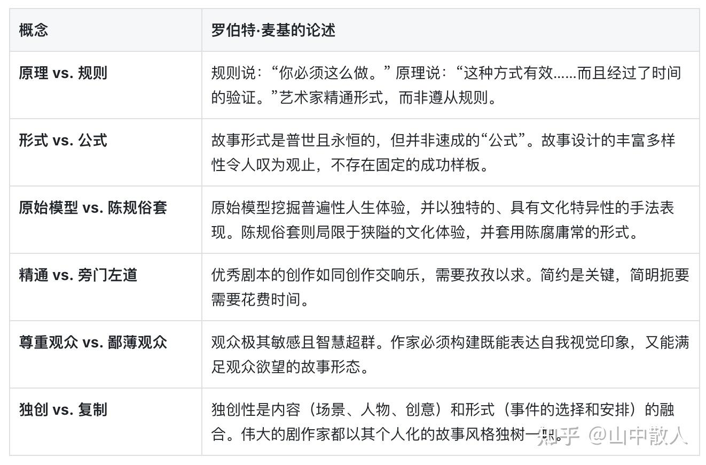
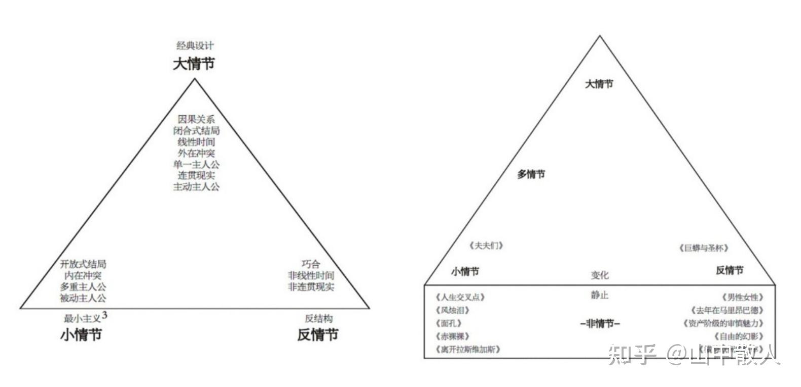
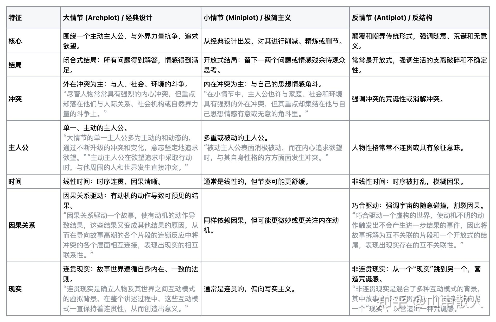
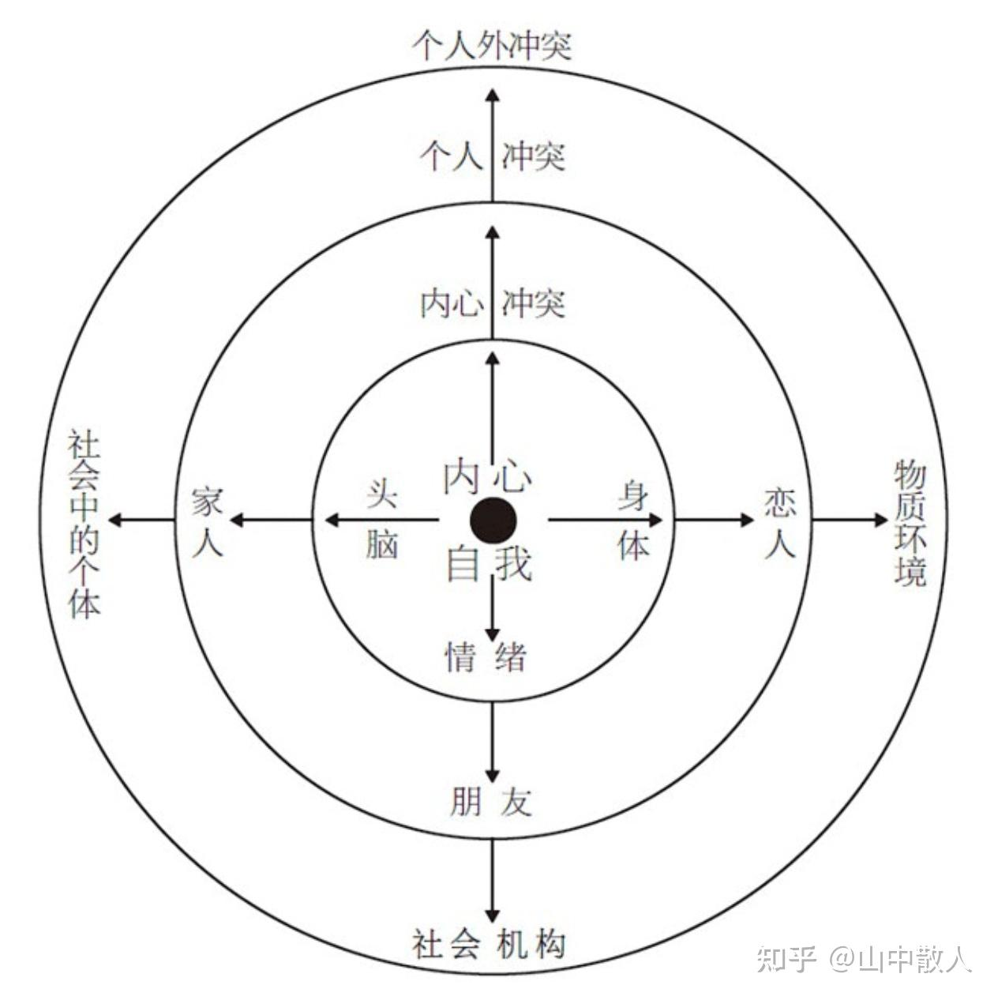
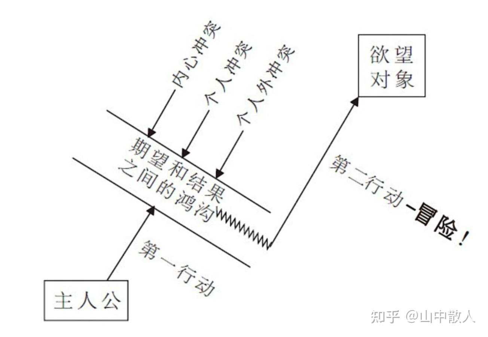
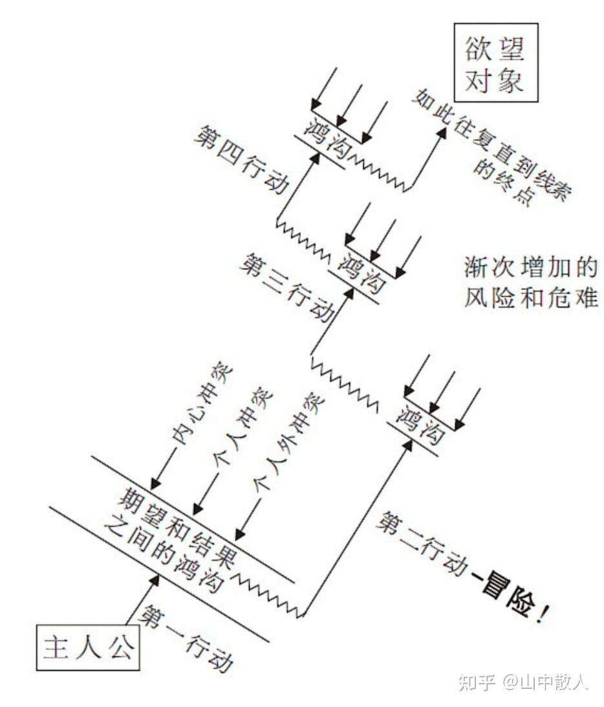
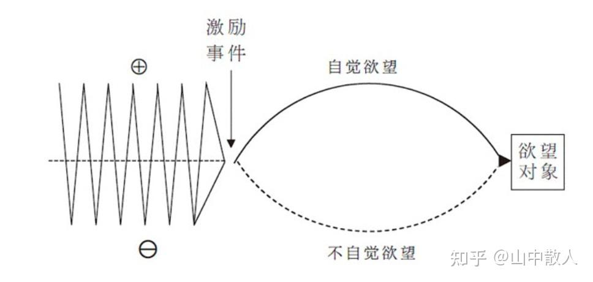
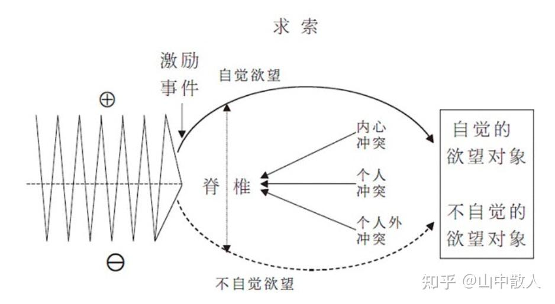
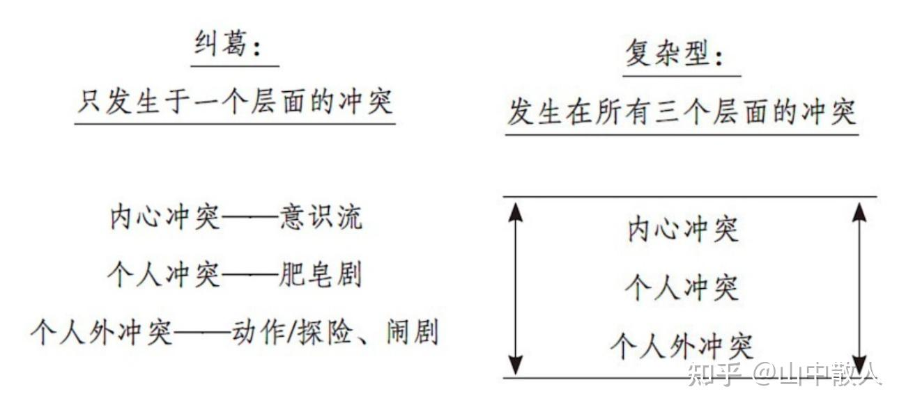
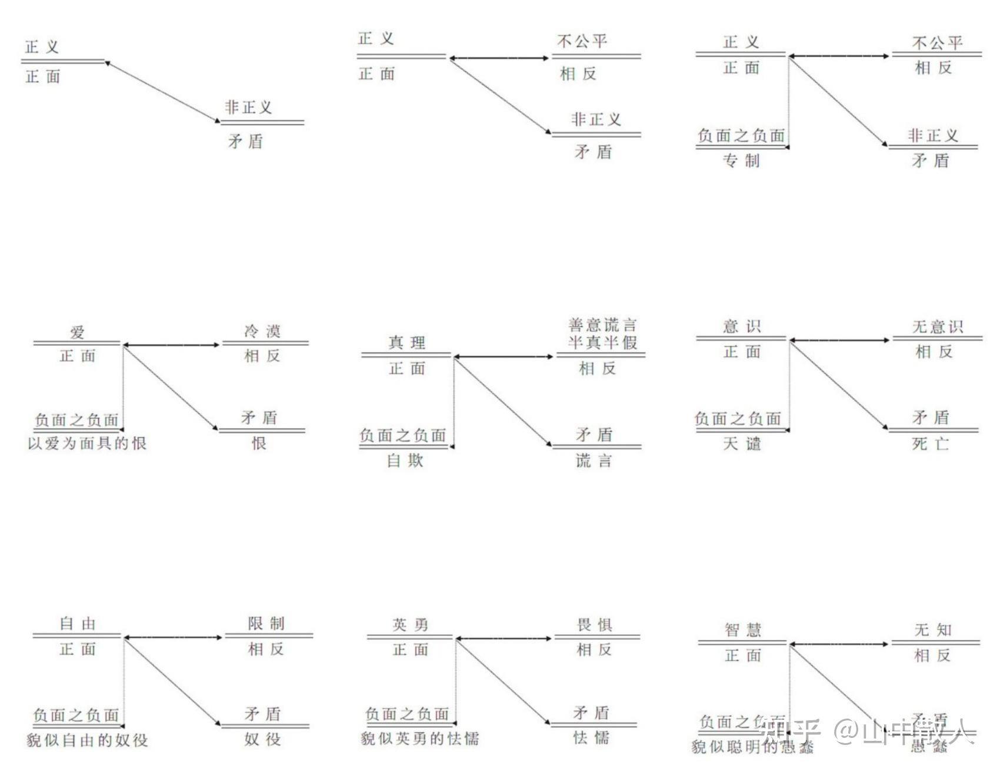

# 罗伯特麦基的《故事》被过誉了吗？

| 项目 | 内容 |
|---|---|
| 类型 | answer |
| 作者 | 山中散人 |
| 收藏时间 | 2025-10-03 22:11 |
| 发布时间 | - |
| 收藏夹 | 抗联 |
| 原链接 | https://www.zhihu.com/question/24806003/answer/1957568423887365567 |

## 摘要

柏拉图曾说：&#34;谁会讲故事，谁就控制了世界，谁就拥有了整个世界。&#34; 不仅揭示了叙事在人类文明中的核心地位，也预示了故事作为一种隐性权力，如何潜移默化地塑造着我们的认知、情感与行为。 在当代，从品牌传播到政治动员，从影视创作到个人表达，讲故事的能力已成为一种不可或缺的软实力。罗伯特·麦基的《故事》正是解构“故事”的经典之作，它像一把手术刀，剖开那些打动人心的叙事作品，抽象出故事构建的深层原理与普遍原则。 …

## 正文

柏拉图曾说：&#34;谁会讲故事，谁就控制了世界，谁就拥有了整个世界。&#34;  不仅揭示了叙事在人类文明中的核心地位，也预示了故事作为一种隐性权力，如何潜移默化地塑造着我们的认知、情感与行为。

在当代，从品牌传播到政治动员，从影视创作到个人表达，讲故事的能力已成为一种不可或缺的软实力。罗伯特·麦基的《故事》正是解构“故事”的经典之作，它像一把手术刀，剖开那些打动人心的叙事作品，抽象出故事构建的深层原理与普遍原则。
<h2><b>Part1 故事的困境与艺术家的责任</b></h2><h3><b>故事的衰竭与手艺的失传</b></h3>
尽管人类对故事的需求永不餍足，故事已成为主导性的文化力量，但全球范围内故事讲述的总体质量却在每况愈下。其根本原因在于创作者普遍缺乏对手艺的掌握。许多人误以为看过大量电影、戏剧和小说就等于学会了创作，将无意识吸收的模式当作“直觉”，从而导致了陈词滥调的泛滥。

• <b>手艺的失传：</b> 过去的作家通过大学教育、图书馆自学或制片厂学徒制来学习手艺。然而，当代大学的创意写作教学已从故事的内在原理转向外在的语言和符号分析，而好莱E坞旧的学徒制也已不复存在。

• <b>价值观的腐蚀：</b> 现代社会在道德和伦理上的玩世不恭、相对主义和主观主义，导致了价值观的混乱。这使得作家难以假定观众的期待，必须更深入地挖掘生活，创造出能向一个愈发不可知的世界传达新见解的故事载体。

• <b>奇观取代实质：</b> 脆弱的故事手法被迫用奇观和炫目噱头来取代实质内容，导致影像愈发奢侈浮华，表演愈发做作暴力，最终流于怪诞。麦基警告：“文化的进化离不开诚实而强有力的故事。如果不断地耳濡目染于浮华、空洞和虚假的故事，社会必定会走向堕落。”
<h3><b>故事的核心要义：原理与形式</b></h3>
麦基强调，在一部作品的全部创作中，作家75%以上的劳动都用在了故事设计上。文学才华本身并不足够，核心任务是构建一个好故事。
<figure data-size="normal"></figure>
“一个故事的核心不仅是你该讲什么，而且还包括怎么去讲。”

 

<h2><b>Part2 故事的核心要素</b></h2>
一个讲得美妙的故事犹如一部交响乐，其结构、背景、人物、类型和思想融合为一个天衣无缝的统一体。作家必须像研究管弦乐队的乐器一样，先逐一精通故事的诸要素，再将它们整体合奏。
<h3><b>故事的结构谱系</b></h3><ul><li data-pid="BCvBjlrM"><b>结构：</b>是对人物生活故事中一系列事件的选择，这种选择将事件组合成一个具有战略意义的序列，以激发特定情感并表达特定的人生观。</li></ul><blockquote data-pid="sNf0NP2P">“事件是人为的，或能够影响到人，于是便勾画出人物；事件发生在场景之中，于是便生发出影像、动作和对白；事件从冲突中吸取能量，因而激发出角色和观众类似的情感。”</blockquote>
• <b>事件 (Event)：</b> 在人物生活情境中创造出富有意味的<b>变化</b>，这种变化通过一种<b>价值</b>来表达和经历，并通过<b>冲突</b>来完成。
<blockquote data-pid="rZQbDVq7">“故事价值是人类经验的普遍特征，这些特征可以从此一时到彼一时，由正面转化为负面，或由负面转化为正面。”“例如，生/死（正面/负面）便是一个故事价值，同样的有爱/恨、自由/奴役、真理/谎言、勇猛/懦弱、忠诚/背叛、智慧/愚昧、力量/软弱、兴奋/无聊，等等。所有这种人类经验中，价值负荷可以随时走向反面的二元特质，便是故事价值。它们可以是道德的，善/恶；可以是伦理的，是/非；或仅仅负荷着纯粹的价值。希望/绝望既不涉及道德，也不属于伦理，但当我们身处这经验两极的任意一端时，必然会确切地感知到。”</blockquote>
• <b>场景 (Scene)：</b> 在某一相对连续的时空中，通过冲突表现出来的一段动作，这段动作至少在一个重要程度可以感知的价值层面上，使人物生活中负荷着价值的情境发生转折。理想的场景即是一个故事事件。“如果一个场景不是一个真正的事件，就删掉它。”
<blockquote data-pid="KVOVRIJe">“故事价值是人类经验的普遍特征，这些特征可以从此一时到彼一时，由正面转化为负面，或由负面转化为正面。”“例如，生/死（正面/负面）便是一个故事价值，同样的有爱/恨、自由/奴役、真理/谎言、勇猛/懦弱、忠诚/背叛、智慧/愚昧、力量/软弱、兴奋/无聊，等等。所有这种人类经验中，价值负荷可以随时走向反面的二元特质，便是故事价值。它们可以是道德的，善/恶；可以是伦理的，是/非；或仅仅负荷着纯粹的价值。希望/绝望既不涉及道德，也不属于伦理，但当我们身处这经验两极的任意一端时，必然会确切地感知到。”</blockquote>
• <b>节拍 (Beat)：</b> 场景内部最小的结构单位，是动作/反应中一种行为的交替。节拍构筑了场景的转折。

• <b>序列 (Sequence)：</b> 一系列场景（通常2到5个），其冲击力呈递增趋势，最终在一个高潮场景中达到顶峰，实施比单个场景更强劲的改变。
<blockquote data-pid="T167zYjm">“每一个场景都在自己的价值层面上进行了转折。 场景一：从自疑到自信。 场景二：从死到生；从自信到失败。 场景三：从社交灾难到社交胜利。 同时，这三个场景构成了一个负荷着另一更大价值的序列，这一价值居高临下却又与其他价值相辅相成，这便是那份工作。 在序列的开始，她没有工作，第三个场景成为一个序列高潮，因为她的社交成功为她赢得了工作。从她的观点来看，这份工作是一个如此重大的价值，她不惜冒着生命危险来得到它。”</blockquote>
• <b>幕 (Act)：</b> 一系列序列的组合，其顶点为一个高潮场景，导致价值的重大转折，其冲击力远超任何前置的序列或场景。
<blockquote data-pid="o7ZRF2Tl">“场景以细微但意义重大的方式转折；一系列场景构成一个以适中的、更具冲击力的方式转折的序列；一系列序列便构成下一个更大的结构，幕，一个表现人物生活中负荷价值情境里一个重大逆转的动态单位。一个基本场景、一个构成序列高潮的场景，以及一个构成幕高潮的场景之间的区别，在于其变化的程度，或者更确切地说，在于其变化对人物——对人物的内心生活、人际关系、世事时运或以上诸因素的组合——所具有的冲击力的程度，无论是变好还是变坏。 幕是一系列序列的组合，以一个高潮场景为其顶点，导致价值的重大转折，其冲击力要比所有前置的序列或场景更加强劲。”</blockquote>
• <b>故事 (Story)：</b> 由一系列幕构成的最大结构。故事高潮将引发出绝对而不可逆转的变化。
<blockquote data-pid="JonBs_Vl">“一系列幕便构成所有要素中最大的结构：故事。一个故事就是一个巨大的主事件。” “当你在故事的开头来看人物生活中负荷价值的情境，然后把它和故事结尾的价值负荷进行比较时，你应该能够看到电影弧光1，一大片弧形放射的变化之光把生活从故事开始时的一个情境带到故事结束时另一个变化了的情境。这个最后的情境，这一终极变化，必须是绝对而不可逆转的”</blockquote><h3><b>故事三角：叙事设计的版图</b></h3><figure data-size="normal"></figure>
故事三角是一个描绘所有故事形式可能性的理论地图，涵盖了从经典到实验性的所有叙事方法。
<figure data-size="normal"></figure>
我们必须想方设法引导观众从外在行为来解析角色的内在生活，而不能利用画外解说或人物的自我告白。即如约翰·卡彭特所说：“电影就是将精神的东西物化。
<ul><li data-pid="dQiHhnmG">经典设计是指围绕一个主动主人公构建的故事，主人公为了追求自己的欲望，与主要来自外界的对抗力量进行抗争，通过连续的时间、在一个连贯而具有因果关联的虚构现实里，到达一个表现绝对、而变化不可逆转的闭合式结局。</li><li data-pid="9uukO5xW">在左角，放上了最小主义的所有实例。顾名思义，最小主义是指作者从经典设计的成分开始，对它们进行削减——对大情节的突出特性进行精炼、浓缩、删节或修剪。我把这一整套最小主义的变体称为小情节。”</li><li data-pid="LN8uzb4W">在右角便是反情节，它是反小说（新小说）和荒诞派戏剧的电影翻版。反结构变体并没有削减经典，而是反其道而行，否认传统形式，以利用甚至嘲弄形式原理的要义。</li></ul>
上述列举的七类形式上的矛盾与对照并不是一成不变的。在开放/闭合、被动/主动、连贯现实/非连贯现实等属性之间还存在着无限不同程度的细微差异。所有故事讲述的可能性都分布于这一故事设计的三角形内，但绝少有影片的形式会纯粹到可以固定于某一角端。这三角的每一条边都是一个结构选择的图谱，作家将故事在这些边线上滑行，对各个角端的特征或糅合或拆借。

 

随着故事设计从大情节开始向下滑行到三角底边的小情节、反情节和非情节时，<b>观众的数目将会不断缩减。</b>
<blockquote data-pid="lkFUhEiW">经典设计是人类思维的镜像存在。经典设计是一个记忆和预期的模式。当我们回想往昔时，我们会不会将事件进行反结构的串连？会不会进行最小主义处理？不会。我们会围绕一个大情节来回顾和构建我们的记忆，将过去生动地唤回。当我们憧憬未来时，我们所惧怕或祈祷的事情会在眼前闪现，我们所想象的是不是最小主义的？反结构的？不是。我们会将我们的幻想和希望铸造为一个大情节。</blockquote>
<b>经典设计呈现了人类知觉的时间、空间和因果模式，如果逸出这一模式，人类的心智将会出现逆反。</b> 小情节和反情节产生于大情节——前者将其缩小，后者将其反对。 那些在故事三角的纵深角落取得成功的作家都知道，理解的出发点位于三角的顶端，而其事业也是从经典形式开始的。

大师，首先必须精通大情节。

 
<h3><b>结构与背景</b></h3>
<b>故事的背景是四维的</b>
<ol><li data-pid="iQa827E6"><b>时代（Era）</b>: 故事在时间中的位置（当代、历史时期或假想的未来）。</li><li data-pid="Ft3bkI5F"><b>期限（Duration）</b>: 故事在时间中的跨度（几十年、几年、几个月、几天，甚至银幕时间等于故事时间的作品）。</li><li data-pid="Xq9zT4Wf"><b>地点（Place）</b>: 故事在空间中的具体物质位置（城镇、街道、房间、星球等）。</li><li data-pid="MWy9yq9D"><b>冲突层面（Conflict Level）</b>: 人性维，即故事是在哪种社会域的冲突层面上讲述的。这包括人物内心的冲突、人际关系间的冲突，与社会机构的斗争，以及与环境力量的争斗。</li></ol><blockquote data-pid="A3SWTJQg">“冲突层面是故事在人类斗争的层级体系中的位置。”</blockquote>
 

<b>结构和背景之间的关系</b>

故事的背景<b>严格地界定并限定了其可能性</b>。

故事必须遵守其自身内在的或然性法则。因此，作家的事件选择局限于他所创造的世界内的可能性和或然性。

• <b>内在或然性法则</b>: 即使是虚构世界，也只有特定的事件是可能的或然的。故事必须遵守其自身的内在或然性法则。

• <b>世界规则</b>: 每一个虚构的世界都创立了一种独一无二的宇宙论并制定了自身的“规则”，这些因果原理一经确定，就不可能更改。

• <b>约束与创新</b>: 背景对故事设计的约束<b>不会扼杀创造力</b>，反而会<b>激发创作灵感</b>。

    ◦ 世界越大，作者的知识越稀释，创作选择越少，故事越充满陈词滥调。

    ◦ 世界越小（可知的范围内），作者的知识越完善，创作选择越多，故事也就越新颖。

• <b>观众预期</b>: 观众会潜意识地考察作者虚构宇宙的“法则”，如果作者稍有违犯，观众就会认为作品不合逻辑、不可信，从而拒绝接受。

 
<h3><b>结构与类型</b></h3>
<b>电影类型</b>

“以下是一套银幕剧作家通用的类型和次类型系统。这套系统通过实践而非理论演化而成，并且根据题材、背景、角色、事件和价值的差别来进行界定。”

一 主要类型和情节
<ol><li data-pid="BPTp64UL">爱情故事 (Love Story)</li><li data-pid="8dRpJv5e">恐怖片 (Horror Film)</li><li data-pid="FOkOpRQJ">教育情节 (Maturation Plot)</li><li data-pid="Q6RJgivF">赎罪情节 (Atonement Plot)</li><li data-pid="FnI0PZNA">惩罚情节 (Punishment Plot)</li><li data-pid="BrS-tNmN">动作/探险 (Action/Adventure)</li><li data-pid="yqQCchM_">史诗/大片 (Epic/Blockbuster)</li><li data-pid="ouiEynLr">西部片 (Western)</li><li data-pid="40-pXRjD">旧喜剧 (Old Comedy)</li><li data-pid="QFsI2TiO">新喜剧 (New Comedy)</li><li data-pid="T3R7Tewx">幻灭情节 (Disillusionment Plot)</li><li data-pid="VO0UCqLL">历史剧 (Historical Drama)</li><li data-pid="67rR3GNC">传记 (Biography)</li><li data-pid="mSdKazhp">纪实剧 (Docudrama)</li><li data-pid="k_ywPQF1">嘲讽纪录片 (Mockumentary)</li><li data-pid="akLQv0Oa">音乐片 (Musical)</li><li data-pid="FqvYIEAq">科学幻想 (Science Fiction)</li></ol>
二 超大类型（Ultra-Genres）及其次类型 此外，书中还列举了几个庞大而复杂的超大类型，其包含的次类型几乎数不胜数：
<ol><li data-pid="JscTHfsd">喜剧 (Comedy)： ◦ 次类型有恶搞喜剧、讽刺喜剧、情景喜剧、浪漫喜剧、荒诞喜剧、闹剧和黑色喜剧。 ◦ 喜剧的最高常规是“无人受到伤害”。</li><li data-pid="AbY_7cFo">犯罪 (Crime)： ◦ 次类型主要根据观察犯罪的视点来分类，包括：神秘谋杀、罪行、侦探、黑帮、惊悚或复仇故事、法庭、报纸、谍战、监狱戏和黑色电影。</li><li data-pid="5eCXg18k">社会剧 (Social Drama)： ◦ 次类型包括家庭剧、女性电影、政治剧、生态剧、医药剧和精神分析剧。</li></ol>
三 其他重要的类型或结构提及

• 多情节影片 (Multiprotagonist/Multiple Plot)

• 动作片 (Action Film)

• 惊悚片 (Thriller)

• 精神分析惊悚片 (Psychoanalytic Thriller)

• 艺术电影 (Art Film)：

◦ 其故事设计取决于一条大常规：“没有一定之规”。

• 渴望故事 (Desire Story)
<blockquote data-pid="URQZbMwj">“经历了几千年的故事讲述之后，没有一个故事会完全与众不同，以至于与其他已写过的故事毫无相似之处。”</blockquote>
 

<b>结构和类型的关系</b>

每一个类型都给故事设计制定了常规：高潮时的常规价值负荷，如幻灭情节的低落结局；常规背景，如西部片；常规事件，如爱情故事中的男女邂逅；常规角色，如犯罪故事中的罪犯。观众知道这些常规，并期待着看到它们一一实现。

其结果是，类型的选择明确地决定并限定了一个故事中什么是可能的，因为它的设计必须将观众的知识和预期考虑在内。

 

<b>类型与观众预期</b>

• <b>观众即类型专家</b>: 观众带着从一生的观影经验中积累的<b>一整套复杂的心理预期</b>进入影院。

• <b>作家的挑战</b>: 作家必须满足观众的类型预期（否则有令人失望的风险），同时必须将其预期引向新鲜而出其不意的时刻（否则有令人厌倦的风险）。这要求作家具备超越观众的类型知识。

• <b>定位观众</b>: 从片名到宣传推广，老道的营销方略旨在激发类型预期，将故事类型固着于观众的心灵。一旦向观众承诺了某种形式，作家就必须履行诺言。

<b>类型常规与创作限制</b>

• <b>类型常规</b>: <b>类型常规</b>是界定各个类型及其次类型的具体背景、角色、事件和价值。例如：

    ◦ 犯罪类型必须在早期发生犯罪，必须有侦探人物，最终警察必须查明真相并拘捕罪犯。

    ◦ 喜剧的<b>最高常规</b>是“无人受到伤害”。

    ◦ 艺术电影的故事设计取决于一条大常规，即<b>没有一定之规</b>，通过最小主义或反结构来打破常规。

• <b>精通类型</b>: 作家必须尊重并<b>精通</b>自己的类型及其常规，才能引导观众去体验丰富多彩、新颖别致、变幻万端的常规，从而<b>重构并超越观众的期待</b>。

总而言之，一个讲得美妙的故事犹如一部交响乐，其中的<b>结构</b>、<b>背景</b>、人物、<b>类型</b>和思想必须<b>融合为一个天衣无缝的统一体</b>。要达到这种和谐，作家必须将故事的诸要素视为管弦乐队的各种乐器，先逐一精通，再整体合奏。
<blockquote data-pid="DXDM5_6J">“你还必须问自己：我最喜欢的类型是什么？然后，执笔去写你自己心中最爱。因为，对观念或经历的激情有可能衰竭，对电影的爱却会是永恒的。类型应该是一个不断给你注入新鲜灵感的源泉。” “真心实意地选择好你的类型，因为在想要写作的所有原因中，唯一能时时刻刻为我们提供养分的，就是对作品本身的爱。”</blockquote>
 

 
<h3><b>结构与人物</b></h3>
人物与结构是不可分割的。它们的争论源于对“人物塑造”和“人物真相”的混淆。

• <b>人物塑造 vs. 人物真相：</b>

    ◦ <b>人物塑造 (Characterization)</b> 是所有可观察到的人的素质总和（年龄、性别、职业、言谈举止等）。

    ◦ <b>人物真相 (True Character)</b> 隐藏在人物塑造的面具之下，只有在人物处于压力之下做出选择时才得到揭示。压力越大，揭示越深，其选择越真实体现了人物的真相。
<blockquote data-pid="EfcBC165">“得知真相的唯一方法就是看他如何在压力之下做出选择，在追逐欲望的过程中采取哪种行动。他选故他在”</blockquote>
• <b>人物弧光 (The Character Arc)：</b> 优秀的故事不仅揭示人物真相，还在讲述过程中展现人物内在本性的变化（变好或变坏）。

 

• <b>结构与人物的功能：</b>

    ◦ <b>结构的功能</b>就是提供不断加强的压力，把人物逼向越来越困难的两难之境，迫使他们做出越来越艰难的冒险抉择和行动，逐渐揭示出其真实本性，甚至直逼其无意识的自我。

    ◦ <b>人物的功能</b>是为故事带来令人信服的素质，使其选择和行动可信。

    ◦ 结构和人物是互相连锁的。故事的事件结构来自人物在其压力之下所做出的选择和采取的行动；而人物则是通过在压力之下的选择和行动来揭示和改变的生物。两者是同时被改变的。如果你改变了事件设计，那么也就改变了人物；如果你改变了人物的深层性格，也就必须再造结构来表达人物被改变了的性格。

 
<h3><b>结构与意义</b></h3>
让观众相信你观点的方法，来自对故事讲述的精心设计。当你创造故事时，便也创造着你的证据。思想和结构在一种修辞关系中相互交织。
<blockquote data-pid="a1xLQTyK">故事大师从不解释。他们所从事的是艰苦卓绝的创造性劳动——戏剧化表达。 如果被迫去听思想讨论，观众很少会感兴趣，也绝不会相信任何内容。</blockquote>
故事通过创造“审美情感”来传递意义，即将思想和情感同时融合在一种体验中。故事是对真理的创造性论证，它通过事件的动态设计来证明其思想，而非解释。

• <b>主控思想 (Controlling Idea)：</b> 是故事不可磨灭的终极意义，可以用一个句子表达。它由两个部分构成：
<ol><li data-pid="h3oIz8t8"><b>价值 (Value)：</b> 故事高潮为人物世界带来的最终价值的正面或负面负荷（例如，“正义得到伸张”或“暴政肆虐”）。</li><li data-pid="o-8DJFYf"><b>原因 (Cause)：</b> 导致这一价值转变为最终状态的主要原因。一个复杂的故事也许会包含许多促成变化的力量，但一般而言，总有一个原因占据着主导地位。</li></ol>
“比如，价值加原因”的主控思想是：“正义战胜了邪恶，因为主人公所使用的暴力更胜罪犯一筹。”
<blockquote data-pid="2d_VIQX4">“看着你的结尾，问自己：作为这一高潮动作的结果，有什么正负价值，被带到了主人公的世界？接下来，从这一高潮往回看，一直深挖到故事的基石，问自己：这一价值被带到他的世界的主要原因、动力或手段是什么？这两个问题的答案所组成的句子便是你的主控思想。”</blockquote>
 

<b>思想与反思想：</b> 

故事进展通过在故事中押上台面的各种价值的正面负荷和负面负荷之间的动态移动而构建起来。

从灵感得到激发的那一刻起，你便进入了虚构的世界以寻找一个设计。你必须在开始和结尾之间建立起一座故事之桥，一个可以从前提一直跨越到主控思想的事件进展。这些事件回响着一个主题的两种互相矛盾的声音。在一个序列接着一个序列，且常常细化到一个场景接着一个场景的设计中，正面思想及其负面的反思想一直都在争论，你来我往，创造出一个戏剧化的辩证论战。而在高潮中，这两个声音里将有一个胜出，成为故事的主控思想。

<b>这种思想和反思想相互对抗的节奏，便是这门艺术最根本的东西。</b>
<blockquote data-pid="SuDno7Vm">“危险之处在于：当你的前提是一个你感到必须向世人证明的思想，而你把故事设计成一种对那一思想不可否认的论证之时，你便已把自己推上了一条说教之路。<b>在急欲劝诫的热情之中，你将会压抑另一方的声音</b>。”  “这并不是说，从一个思想观念开始就必定会产生说教般的作品……但这确实是一种风险。随着故事向前发展，你必须心甘情愿地去关照相反的甚至是对抗的思想。<b>最优秀的作家都有一副辩证的灵活头脑，可以轻易转换观点。他们既能看到正面，也能看到负面，还能看到所有不同程度的反讽，并真心实意令人信服地找出这些观点中蕴含的真理。</b>这种全知迫使他们变得更有创造力、更有想象力，且更有洞察力。”  “因为证明你观点的证据并不在于你能多么强硬地断言你的主控思想，而在于它将如何战胜你为它部署的各种强大的对抗力量。”</blockquote>
 

 
<h2><b>Part3 故事设计原理与实践</b></h2><h3><b>故事的材质：鸿沟</b> <b>(The Gap)</b></h3>
<b>主人公</b>

任何东西，只要能被给予一个自由意志，并具有欲望、行动和承受后果的能力，都可以成为主人公。 
<ul><li data-pid="4DeL0bx5"><b>主人公是一个具有意志力的人物。</b></li></ul>
“主人公的意志力也许不及《圣经》中以坚忍耐劳著称的约伯，但其意志力必须足以在冲突中支撑其欲望，并最后采取行动来创造出意义重大且同时不可逆转的变化。” 
<ul><li data-pid="sfF3QMLI"><b>主人公必须具有自觉的欲望。</b></li></ul>
“主人公具有一个需要或目标，一个欲望对象，而且对此有清楚自知。” 
<ul><li data-pid="MKVxiBPY"><b>主人公还可以有一个自相矛盾的不自觉欲望。</b></li></ul>
“一个多维度主人公的自觉和不自觉的欲望通常是互相矛盾的。他相信他所需要的东西与他实际上需要而自己并未觉察的东西相互对立。这是不言自明的。如果一个人物的潜意识欲望碰巧即是他所明确追寻的东西，那么这个潜意识欲望的设置便毫无意义。” 
<ul><li data-pid="FkLe0ynP"><b>主人公有能力令人信服地追求其欲望对象。</b></li></ul>
“他有能力做到正在做的事情，而且还必须具有达成欲望的机会。” 
<ul><li data-pid="6RUrf2Bz"><b>主人公必须至少有一次机会达成欲望</b></li></ul>
“用亨利·大卫·梭罗的话说：“芸芸众生都过着一种默默绝望的生活。”大多数人都在浪费他们的宝贵时间，死的时候都带着一种未偿宿愿的遗憾。这一痛苦的见解也许不无道理，但我们不能允许自己相信这一点。相反，我们总是把希望保持到最后一刻。” 
<ul><li data-pid="jKepHo5u"><b>主人公有意志和能力追求其自觉和/或不自觉的欲望，一直到线索的终点，一直到背景和类型所确立的人类极限。</b></li></ul>
“故事的艺术不在于讲述中间状态，而在于讲述人类生存状况的钟摆在两极之间摆动的情形，讲述在最紧张状态下所经历的人生。” “因此，观众期望讲故事的人是有眼光的艺术家，能够将其故事推向那一遥远的广度和深度。” 
<ul><li data-pid="JqF_I0p4"><b>故事必须构建出一个最后动作，让观众无从想象出另一个更好的可能。</b></li></ul>
“把我们带到这一极限的是主人公。他必须发自内心地去追求他的欲望，一直到人类经验在深度、广度或二者同时满足的边界，以达于最终绝对而又不可逆转的变化。” 
<ul><li data-pid="IdXfJ19p"><b>主人公必须具有移情作用；同情作用则可有可无。</b></li></ul>
“移情是指“像我”。在主人公的内心深处，观众发现了某种共通的人性。在那一认同的瞬间，观众突然本能地希望主人公得到他所欲求的一切。”

 

 

<b>观众纽带</b>

当我们认同一位主人公及其生活的欲望时，事实上是在为我们自己的生活欲望喝彩。

故事赐予我们的正是这样一种机会：去体验我们自己生活以外的生活，置身于千姿百态的世界和时代，去追求、去抗争、去感受我们生存状态的各种不同深度。

 

 

<b>人物的世界</b>

一个人物的世界可以被想象为一系列同心圆，围绕着一个由本真身份或本真知觉所构成的圆心，这些圆标志着人物生活的各个冲突层面。最里面的圆或层面便是他的自我以及产生于其头脑、身体和情绪等自然要素的各种冲突。
<figure data-size="normal"></figure><ul><li data-pid="iIxyWlNn"><b>最里面的圆或层面便是他的自我以及产生于其头脑、身体和情绪等自然要素的各种冲突。</b></li></ul>
一个人物世界中最近的对抗力量圈便是他自己的本体：情感和情绪、头脑和身体，这一切的一切从此一时到彼一时都可能会也可能不会以他所期望的方式做出反应。我们最大的敌人往往是我们自己。
<ul><li data-pid="oJATY7bl"><b>第二个圆表示个人关系，那种比社会角色更深层的亲密联盟。</b></li></ul>
除非我们将常规的社会角色搁置一 旁，我们才能找到家人、朋友和恋人真正的亲密感——他们不会以我们所期望的方式做出反应，从而形成了个人的冲突的第二个层面。
<ul><li data-pid="oqS1CLzR"><b>第三个圆标志着个人外冲突层面——超出个人之外的所有对抗力量 源</b></li></ul>
与社会机构和社会个体的冲突——政府/公民、教会/教民、公司/客户; 与个体的冲突——警察/罪犯/受害人、老板/员工、顾客/服务员、医生/病 人;以及与人为环境和自然环境的冲突——时间、空间及其中的每一个物 体。

 

 

<b>鸿沟 (The Gap)</b>
<ul><li data-pid="CX0l5-Y3"><b>故事产生于主观领域和客观领域的交接之地。</b></li></ul><figure data-size="normal"></figure>
故事的真正材质和能量源泉在于<b>鸿沟</b>——即人物的主观期望与客观现实结果之间的差距。

1. <b>行动与期望</b>：主人公为追求欲望，采取一个他认为能得到预期积极反应的行动。

2. <b>现实的反应</b>：然而，客观世界（内心、人际、外界）的反应却与他的期望大相径庭，甚至更为强烈。

3. <b>鸿沟的产生</b>：在期望和结果之间裂开了一道鸿沟，使他比行动前离欲望更远。

4. <b>新的行动</b>：鸿沟迫使人物重新评估，采取一个他起初不愿意采取的、风险更大的新行动。

这一“行动 -&gt; 意外反应 -&gt; 鸿沟 -&gt; 更大风险的新行动”的模式，在不同层面上循环往复，循序渐进地推动故事发展，直到线索的终点。

 

 

<b>关于风险</b>

风险是什么?如果 主人公得不到他想要的东西，他将会失去什么?更具体而言，如果主人公 不能达成其欲望，将会发生在他身上的最坏的事情是什么?

如果这一问题得不到令人信服的回答，那么故事的构思在核心上便出 了问题。例如，如果答案是“如果主人公失败，生活将会回到正常状态”， 那么这个故事便不值得讲述。主人公想要的东西没有任何真正的价值，而 一个故事如果讲述某人追求毫无价值或价值甚微的东西，那么这个故事便 是在给“乏味”下定义。

人物欲望的价值尺度与他为达成欲望而愿意承担的风险成正比;价值 越大，风险便越大。

<b> 进展过程中的鸿沟</b>

主人公的第一个行动已经激发了对抗力量，阻挡了其欲望的实现并在 预期和结果之间横亘了一道鸿沟，挫败了他对现实的幻想，使他与其世界 处于一种更大的冲突之中，并把他推向了更大的风险。但是坚韧不拔的人 类大脑会迅速对现实进行重塑，将其模式放大，以包容这一挫败，即这一 始料未及的反应。现在，他必须采取第二个行动，一个更困难更冒险的行 动，一个与其变更了的现实观相一致的行动，一个基于他对世界的新期望 的行动。但是，他的行动又一次激发对抗力量，在他的现实中裂开又一道 鸿沟。所以他进行调整以适应这一意外，再一次加大赌注，并决定采取一个他觉得与其修改了的世界观相一致的行动。他更深地挖掘自己的潜能和 意志力，使自己冒着更大的风险来采取第三个行动。

也许这个行动会取得正面的结果，他暂时向自己的欲望迈进了一步， 但是随着他下一个行动的开始，鸿沟又会訇然中开。现在，他必须采取一 个更加困难的行动，要求更强的意志力、更强的能力和更大的风险。在这 一反反复复的进展过程中，他的行动不仅得不到合作，反而会不停激发对 抗力量，在他的现实中开辟一道道鸿沟。这一模式在不同的层面上循环往 复，直到线索的终点，一个最后行动，让观众无从想象出另一个更好的可 能。

<b>期望和结果之间的鸿沟远远不只是因果关系的问题。从最深层 的意义上而言，表面的原因和最终的结果之间的这一断裂，标志着人类精 神和客观世界的交接点。一边是我们主观相信的世界，而另一边则是客观 存在的现实。这一鸿沟便是故事的温床</b>，是一口熬煮故事讲述手法的大 锅。作家正是从中找到最有力度的生活转折瞬间。我们能够到达这一决定 性交接点的唯一办法，就是从里面工作到外面。
<figure data-size="normal"></figure>
<b>鸿沟内的创造</b>

<b>优秀的写作不太强调发生了什么，而是强调发生于 谁、为什么发生以及如何发生。</b>实际上，最丰富、最满足的愉悦来自那些 聚焦于事件导致的反应与所获见解的故事。

即使是在最最宁静、最最内化的场景中，这一系列动作/反 应/鸿沟、新一轮的动作/出其不意的反应/鸿沟也会一个节拍接着一个节拍地 使场景步步为营地直逼其转折点，向观众展示出令人惊叹和痴迷的反应。

一旦想象出一个场景，你应该一个节拍一个节拍、一个鸿沟一个鸿沟 地写下去。你所写出的东西应该生动地描述出发生了什么、得到了什么反 应、看见了什么、说了什么、做了什么。你所写的东西应该让读者在阅读 它的时候，也会一个节拍一个节拍、一个鸿沟一个鸿沟地体验生活的那种 过山车般的感觉，就像你在写字台前所体验的一样。

<b>故事的材质和能量</b>

<b>故事的材质是鸿 沟，是一个人采取行动时，期望发生的事情和实际发生的事情之间裂开的鸿沟</b>;是期望和结果之间、或然性和必然性之间的断层。要构建一个场 景，我们应该不断地撬开现实中的这些裂隙。

至于故事的能源何在，答案也是一样的:鸿沟。观众移情于人物，设 身处地地去追寻他的欲望。观众对世界的期望基本上等同于人物对世界的 期望。当鸿沟在人物面前裂开时，也同样会在观众面前裂开。这便是那 种“哦，我的上帝!”的时刻。

 

 

 
<h3><b>激励事件 (The Inciting Incident)</b></h3>
故事是一个由五部分组成的设计:激励事件，故事讲述的第一个重大事件，是推动叙事开始运作的核心动力，一切后续情节的首要导因，它使其他四个要素开始运作起来——进展纠葛，危机，高潮，结局。

• <b>激励事件核心功能：</b>
<ol><li data-pid="wTdy5Xw3">彻底打破主人公生活力量的平衡。</li><li data-pid="NSMdMkWL">故事脊椎：在他心中激起恢复平衡的欲望（自觉和/或不自觉的）。</li></ol><blockquote data-pid="FUShV08l">主人公可以以任何适宜于人物和世界的方式对生活平衡中突然的负面 或正面变化做出反应。我们都希 望能对自己的生存状况进行一些合理的掌控。如果一个事件彻底打破了我 们的平衡感和控制感，我们将会需要什么?任何人，包括我们的主人公， 将会需要什么?恢复平衡。</blockquote>
 
<figure data-size="normal"></figure>
3. 求索：将他送上一条追寻欲望对象的求索之路。 一个事件打破人物生活的平衡，使之或变好或变坏，在他内心激发起 一个自觉和/或不自觉的欲望，意欲恢复平衡，于是把他送上了一条追寻欲 望对象的求索之路，一路上他必须与各种(内心的、个人的、个人外的) 对抗力量抗衡。他也许能也许不能达成欲望。这便是亘古不变的故事要 义。 
<figure data-size="normal"></figure>
 了解你的故事的求索形式，只需确认你主人公的欲望对象。只要你深入主人 公的内心，发现他的欲望，就会开始看到你的故事弧光，亦即激励事件把 他送上的那一条求索之路。

4. 在观众脑海中提出“戏剧大问题”（例如，“这件事结果会如何？”）。

<b>激励事件的设计</b>

激励事件的发生无非通过下述两种方式之一:随机或有因，要么由于巧合，要么出于决定。

若出于决定，那么这一决定可以由主人公来做出: ;或者由 一个其力量足以颠覆主人公生活的人来做出。

如果是由于巧合，可以是天降横祸型:;也可以是天赐洪福型。抉择或巧合，二者必居其一;舍此，便别无他途。

<b>激励事件的创造</b>

最后一幕的高潮是所有场景中创作难度最大的:它是故事讲述的灵 魂。如果它失败，整个故事终将失败。但是，写作难度居其次的则是主情 节的激励事件。

可能发生在主人公身上最坏的事情是什么?那一事件如何才能最终成 为可能发生在主人公身上最好的事情?

最好是什么?如何变成最 坏?如何再次逆转，成为主人公的重生?或者:最坏是什么?如何变成最 好?最后如何再次导致主人公的毁灭?<b>我们之所以总是在“最好”和“最坏”之 间伸展，是因为故事若要成为艺术，并不是讲述人类体验的中间地带。</b>

<b>激励事件的冲击给我们创造了到达生活极限的机会。</b>它是一种爆炸。无论多么微妙或直接，它必须打乱主人公的现 状，将他的生活推出其现行轨道，使人物的宇宙变成一片混乱。<b>在这一片 混乱之中，你必须在高潮处找到一个结局，无论好坏，最终使这一宇宙得 到重新安排，进入一个新的秩序。</b>

 
<h3><b>幕设计</b></h3>
<b>进展纠葛</b>

主人公意识到自己所冒的风险，表现出更大的意志力和能力，奋力越 过这一鸿沟并采取第二个难度更大的行动。其结果是，再次引发对抗力 量，在期望和结果之间开掘出第二道鸿沟。

通过发掘出人物越来越大的能力，要求他们表现出越来越强的意志 力，并将他们推向越来越大的风险，令他们不断越过一个个按照行动的力度或性质划定的不归之点，作者便构建出了一个循序渐进的故事进展过 程。

故事绝不能退隐于轻量级性质或力度的行动，而必须循序渐进地朝着 观众无从想象出更好替代的一个最后行动向前运行。

<b>冲突法则 </b>

当主人公走出激励事件，他便进入了一个由冲突法则统领的世界。亦即:若无冲突，故事中的一切都不可能向前进展。

冲突法则不仅仅是一条审美原理，它还是故事的灵魂。故事是生活的 比喻，活着就是置身于看似永恒的冲突之中。即如让-保罗·萨特表达的那 样，现实的精华就是匮乏，一种普遍而永恒的欠缺。这个世界上的一切东 西都不够人们享用。食物不够，爱不够，正义不够，时间永远不够。如海 德格尔所说，时间是存在的基本范畴。<b>我们生活在其不断缩减的阴影之 中，如果我们想要在短暂的人生中成就点什么，让我们死的时候不存在浪 费时间的遗憾，那么我们将会与那些阻止我们欲望的匮乏力量迎面撞上。</b>

例如，如果我们设法满足自己的外在欲望，找到了与世界的和谐，那 么这种安宁很快就会转化成无聊。此时，萨特的“匮乏”则变成了冲突本身 的缺乏。无聊即是当我们失去欲望后，当我们缺乏一种缺乏感时所产生的 内在冲突。

如果内心生活和大世界中冲突的深度和广度不能打动你，那么想想这 个:死亡。死亡就像是一辆未来的货运火车，向我们迎面驶来，使现在和 那时之间的距离一分一秒地逼近。如果我们想获得生活上的任何满足感， 就必须赶在火车碾过来之前起用生活的对抗力量。

<b>生活就是冲突。冲突是生活的本质。作家必须决定在何时何地排演这种斗争。</b>

<b>纠葛型VS复杂型</b>

为了让故事产生纠葛，作者必须循序渐进地制造冲突，一直到线索的 终点。
<figure data-size="normal"></figure>

<b>幕设计</b>

<b>作为观众，拥着故事艺术家说:“我想要一种达到生活极限的具有 广度和深度的诗化体验。</b>

一个故事可用一个幕讲述—— 一系列场景构 筑成几个序列，最后进展为一个重大逆转，结束故事。

一个故事可用两幕讲述:两个重大逆转之后，便告结束。

在我们试图满足观众需要的努力中，为了讲出能够同时触动最最内在 和最最外在的生活之源的故事，两个重大逆转是远远不够的。

试考虑这样的节奏:情况很坏，然后变好—— 故事结束。或者，情况 很好，然后变坏—— 故事结束。或者，情况很坏，然后变得更坏——故事 结束。或者，情况很好，然后变得更好—— 故事结束。在以上四种情况 中，我们感到总是缺少点什么。

第三个转折缺失，而且 我们知道我们尚未触及极限，直到至少另一个重大逆转发生。因此，在亚 里士多德指出之前的几百年间，三幕故事节奏就已成为故事艺术的基础。

<h3><b>场景设计</b></h3>
• <b>转折点</b> <b>(Turning Point)</b>：每个场景都应围绕一个转折点构建，即场景中押上台面的价值从正面转向负面，或反之。一个没有转折的场景是静态的、乏味的。转折点能产生四重效果：<b>惊奇、增加好奇心、见识和新方向</b>。

• <b>伏笔和分晓</b> <b>(Setup and Payoff)</b>：通过想象那些“不可想象”的情节转折（如兄弟背叛），然后回溯到故事前文，巧妙地铺设逻辑和动机，从而创造出既出人意料又合乎逻辑的强大故事。逻辑是一种可以回溯前文去重建的东西。

• <b>情感转变</b>：观众的情感体验（快感或痛感）产生于价值的转变。当观众移情于一个角色，并看到他生活中押上台面的价值从负面转向正面时，会产生积极情感；反之亦然。故事必须在正面和负面情感之间动态交替，以克服“回报递减定理”。
<blockquote data-pid="-oOuVnuZ">我们是通过表现必要而精确的体验来促使观众在心中自然生出一种情感，然后带领观众经 受那种体验。因为转折点不仅传达见解，它们还能创造出情感的动力。 为了理解我们如何才能创造出观众的情感体验，我们首先必须明白， 世上只有两种情感——快感和痛感。每一种都有其不同程度的变异:前者 如欢乐、爱情、幸福、狂喜、愉悦、销魂、刺激、极乐等等;后者有痛 苦、害怕、焦虑、恐怖、悲伤、屈辱、萎靡、凄凉、紧张、悔恨等等。但 是，在本质上，生活给予我们的只能是非此即彼。 作为观众，当故事的讲述过程带领我们经历一种价值的转变时，我们 便会体验到一种情感。 首先，我们必须移情于人物。 其次，我们必须知道 人物想要什么并希望他得到他想要的东西。 第三，我们必须明白人物生活 中，押上台面的价值。 在这种情况下，一个价值的改变便能打动我们的情感。</blockquote>
• <b>真正的选择</b>：有意义的选择不是善恶之争，而是<b>两难之择</b>：
<ul><li data-pid="TzWbfSBt"><b>不可调和的两善取其一</b>：两个都想要，但只能选一个。</li><li data-pid="uD32pmJz"><b>两恶取其轻</b>：两个都不想要，但必须选一个。</li><li data-pid="sO9Or9uQ"><b>在这种真正的两难之境中，一个人物如何选择便是对其人性以及他 所生活的世界的一个强有力的表达。</b></li></ul>
 
<h3><b> 场景分析</b></h3><ul><li data-pid="nnFGqsLM"><b>第一步:确定冲突</b></li></ul>
首先要问，是谁驱动这一场景，谁促使它发生?任何人物或力量 都有可能驱动一个场景，即使是一个非生命的物体或大自然的作为也 可以。然后，深入这一人物或力量的文本和潜文本，并自问:他(或 它)想要什么?欲望永远是关键。

问:是什么对抗力量在阻挡这一欲望? 这些力量可能来自任何层面或多种层面的组合。在确认了对抗力量源 之后，问:这些对抗力量想要什么?
<ul><li data-pid="aa03PJU1"><b>第二步:标注开篇价值</b></li></ul>
确认场景中押上台面的价值，并注意在场景开始时，其负荷是正 面还是负面。
<ul><li data-pid="v9iLfJmx"><b>第三步:将场景分解为节拍</b></li></ul>
这种动作和反应的交流即是节拍。只要它在延续，人物A“正趴在 她的脚下”，但人物B却“对其恳求置之不理”，这便可以构成一个节 拍。即使他们的交流重复多次，这还是同一个节拍。直到行为发生明 显变化，才会出现一个新的节拍。
<ul><li data-pid="gG9kTQPp"><b>第四步:标注结尾价值并比较开篇价值</b></li></ul>
在场景的末尾，考察人物处境的价值负荷情况，并以正面/负面进 行描述。

没有发生任何变化，因此没 有发生任何事情。也许向观众传达了一些解说性的东西，但整个场景却是平淡乏味的。如果反之，价值发生了变化，那么场景便发生了转 折。
<ul><li data-pid="9vn_rG8v"><b>第五步:审察节拍并定位转折点</b></li></ul>
在那一片弧光中，找到期望和结果裂开鸿沟的那一瞬间。因为 正是在这一时刻，场景开始转折到它变化了的结尾价值。此时此刻便 是转折点。

 
<h3><b>危机、高潮和结局</b></h3>
• <b>危机</b> <b>(Crisis)</b>：故事的必备场景。主人公与他生活中最强大、最集中的对抗力量进行面对面的斗争。

• <b>高潮</b> <b>(Climax)</b>：故事意义的证明。它带来一个<b>绝对而不可逆转</b>的价值摇摆，其变化的意义将深深打动观众。创作时常采用逆向思维，从高潮的结果出发，反向构建所有前置场景的因果关系。

 
<h3><b>创作要点</b></h3><ul><li data-pid="3j7rrH03"><b>强大的对抗力量</b>：虚弱的故事源于软弱的对抗力量。强大的故事必须探究负面性的所有层面，从<b>相反价值</b>（如“不公”之于“正义”）到<b>矛盾价值</b>（如“非正义”），最终达到<b>否定之否定</b>（如“专制”），即人性的黑暗极限。</li></ul>
你的故事是否具有如此强大的负面力量，以至于正面力量必须不 断获得道高一尺魔高一丈的超越力量?下面是一个可以指导你进行自 我评判并回答这一重大问题的技巧。
<ul><li data-pid="CWgw4Q0I">首先是矛盾价值，正面的直接对立。</li><li data-pid="1c-tzxKt">然而，在正面价值和矛盾价值之间还有相反价值</li><li data-pid="r6EsMBDf">然而，相反价值也并不是人生体验的极致。在线索的终点还横卧 着负面之负面(否定之否定)，一种具有双重负面性的对抗力量。</li></ul>
一个在冲突的深度和广度上进展到人生体验极限的故事，必须依 循以下型式来运行:这一型式必须包括相反价值、矛盾价值和否定之 否定价值。

否定之否定(负面之负面)是指一个复合否定，其中生活情境不 仅会在量上变坏，而且还会在质上变坏。负面之负面已经达于人性黑 暗势力的极限。就正义而言，这一状态即是专制。或者可以用一个既 适用于个人政治也适用于社会政治的短语来表达:“强权即真理。”
<figure data-size="normal"></figure>
<b>一个故事虚弱时，不可避 免的导因就是其对抗力量过于软弱无力。</b>

第一步就是询问押上台面的价值及其进展过程。正面价值是什 么?哪一个最卓著，足以转折故事高潮?对抗力量是否探究了负面性 的所有层面?它们是否在某一个点上达到了负面之负面的力度?

• <b>展示，不要告诉</b>：这是对观众智慧的尊重。通过戏剧化表达，让观众自己去观看、思考、感受并得出结论。

• <b>兴趣与惊奇</b>：通过<b>神秘、悬念和戏剧反讽</b>来维持观众的兴趣。真正的惊奇来自期望与结果之间的鸿沟，它会带来深刻的见解；而廉价的惊奇只是利用叙事打断来震惊观众。

• <b>巧合的运用</b>：巧合是生活的一部分。要使其在故事中有意义，应尽早引入，并让其随着时间发展构建出逻辑；绝不能用巧合来转折结局。

<b>人物</b>

作家就是心灵虫，是潜入人 物的心灵，发现他的各个方面、他的潜能，然后创造出一个符合他本性的 事件——激励事件。对每一个主人公来说，这一事件将会因人而异——对 这一个也许是找到了一笔财富，对另一个也许是失去了一笔财富——但是 我们设计事件是为了适合人物，事件发生的本身必须能够把他送上一条求 索之路，令他达到他生存的极限。

几千年过去了，我们的内在没有丝毫 改变。即如威廉·福克纳所指出:人性是唯一不会过时的主题。

<b>人物设计开始于两个主要方面的安排:人物塑造和人物真相。</b>
<ul><li data-pid="8l6GF9Hh">人物塑造是所有可观察的素质的总和，是一个使人物独一无二的综合 体:外表特征，加上行为举止、语言和手势风格、性别、年龄、智商、职 业、个性、态度、价值观、住在哪儿、住得怎样。</li><li data-pid="A0idJa5O">人物真相潜伏于这一面 具之下。撇开他的人物塑造特征不谈，在其内心深处这个人是谁?忠诚还 是不忠?诚实还是虚伪?充满爱心还是冷酷无情?勇敢还是怯懦?慷慨还 是自私?意志坚强还是意志脆弱?</li></ul>
<b>人物真相只能通过两难选择来表达。这个人在压力之下如何选择行 动，表明他到底是一个什么样的人——压力愈大，其选择愈能更加深刻而 真实地揭示其性格真相。</b>

<b>所有人物都要迎战对抗力量来追求欲望。</b>

---
导出时间: 2026-08-23 19:07