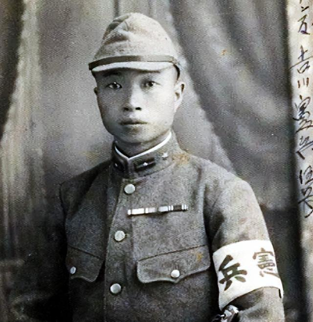
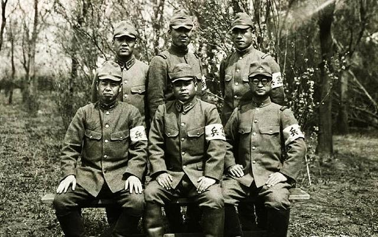
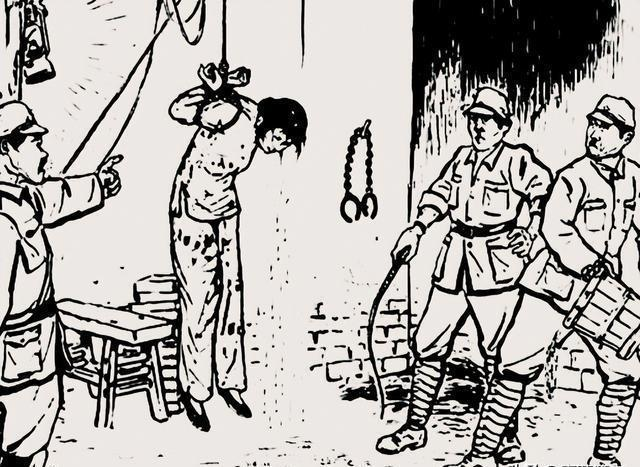
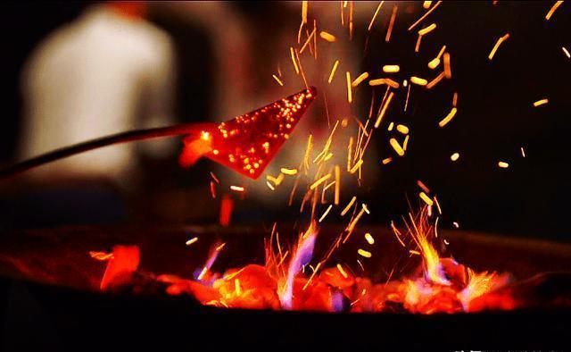

# 假设你参加抗日组织被日军活捉，如何能像烈士一样不出卖组织和战友？

| 项目 | 内容 |
|---|---|
| 类型 | answer |
| 作者 | 陈群2019 |
| 收藏时间 | 2025-09-20 20:31 |
| 发布时间 | - |
| 收藏夹 | 抗联 |
| 原链接 | https://www.zhihu.com/question/32752874/answer/1952832198039302508 |

## 摘要

佐藤五郎，曾身为侵华日军宪兵军曹，在被俘虏之后，交代出了潍县日本宪兵队所使用的令人发指的十大酷刑。 [图片] 【第一酷刑：灌刑】 灌刑这残忍手段，是硬把凉水、火油或者辣椒水往人身体里灌。实施时，先把人仰面绑在木架上，头稍稍垫高。接着拿个铁壶，往人嘴里猛灌，直到再也灌不进去为止。 宪兵把犯人的肚子灌得满满当当后，紧接着抬起脚，朝着犯人的肚子狠狠踩下去。接连踩了好几脚，那肚子里被灌进去的凉水、火油还有辣椒水，就…

## 正文

佐藤五郎，曾身为侵华日军宪兵军曹，在被俘虏之后，交代出了潍县日本宪兵队所使用的令人发指的十大酷刑。
<figure data-size="normal"></figure>
【第一酷刑：灌刑】

灌刑这残忍手段，是硬把凉水、火油或者辣椒水往人身体里灌。实施时，先把人仰面绑在木架上，头稍稍垫高。接着拿个铁壶，往人嘴里猛灌，直到再也灌不进去为止。

宪兵把犯人的肚子灌得满满当当后，紧接着抬起脚，朝着犯人的肚子狠狠踩下去。接连踩了好几脚，那肚子里被灌进去的凉水、火油还有辣椒水，就一股脑儿地从犯人的鼻子和嘴巴里涌了出来。

紧接着，宪兵不停地灌东西，还使劲踩踏。这般一遍又一遍地折磨，犯人们被折腾得奄奄一息，有些直接就在当场被折磨丧命。
<figure data-size="normal"></figure>
【第二刑：拉杆子】

有一种刑罚叫拉杆子，行刑时，先在横梁上挂好绳子，接着把犯人的两根大拇指用绳子紧紧绑住。随后，将犯人的双臂从背后反拧，整个人就这样被绳子吊着悬在空中，行刑者还死死抓着绳子不放松。这刑罚相当残忍，能硬生生把人的手臂关节给拉开。

“犯人”在拉伸酷刑下，疼得仿佛灵魂都要被抽离，那痛苦的模样，简直如同在生死边缘疯狂挣扎。一些人承受不住，关节直接被硬生生拉断，还有人直接被这钻心的剧痛活生生疼死过去。

【第三刑：冰火刑】

所谓冰火之刑，便是在冰天雪地的寒冬时节，将人衣物扒光，丢进盛满凉水的大缸中浸泡一阵。随后，又把浑身湿透的人拖到院子里，任其在酷寒中冷冻，直至人被冻得奄奄一息。

“犯人”都快被冻僵了，随后宪兵把人捞起来，直接架到火上烤。那场景，简直惨不忍睹，人被烤得焦头烂额。佐藤五郎就曾亲眼看到，有个游击队员被烤得全身没有一块好皮肉，全都焦烂了。

两天过去了，这名游击队员终究没能扛住，被敌人残忍折磨，丢了性命。

【第四刑：加盐刑】

有一种残忍至极的刑罚叫加盐刑罚。行刑者会手持锐利无比的刀子，在受刑者身体各个部位，毫不留情地划开一道道触目惊心的口子。随后，他们会把盐或者碱，径直撒到那鲜血淋漓的伤口之上。每一次执行这种刑罚，都得消耗一大包盐巴，光是想想都让人觉得毛骨悚然。

宪兵们简直丧心病狂！刚在伤口上撒完盐，竟又对着那被盐刺激的柔弱伤口使劲儿折腾。“犯人”疼得在床上翻来滚去，凄惨的叫声接连不断。好些人直接疼得昏死过去，伤口处还往外冒着粘液和脓血。

佐藤五郎回忆说，那时候遭受加盐刑致死的“犯人”，起码有三十多个。

【第五刑：狼狗咬】

日本宪兵队向来爱用狼狗咬人的狠招。他们会先把人牢牢绑在一处，接着宪兵和特务们示意，那些被他们精心豢养的恶狼狗，便如饿虎扑食般，疯狂地朝人猛扑过去，张开血盆大口一阵撕咬。

只见那狼狗凶猛地扑向“犯人”，先是毫不留情地将其衣服撕扯得七零八落，紧接着便在“犯人”身上疯狂撕咬啃噬，直咬得“犯人”皮破血流、惨不忍睹。要是行刑时“犯人”侥幸没被咬死，稍作简单治疗后，又会再次被送到狼狗面前，继续承受那残忍的撕咬。

在宪兵队那阴森恐怖的地方，一旦被狼狗撕咬，“犯人”基本没活路。那些没当场被咬死的“犯人”，也逃不过之后发病身亡的厄运。

【第六刑：麻鞭刑】

麻鞭之刑，行刑前先将麻鞭浸入水中，随后高高扬起，用力往人身上抽打。这一鞭下去，立马就留下一道血印，触目惊心。有的血印还会慢慢渗出鲜红的血，而挨打的人，那感受，就仿佛被钢刀直直扎进心里，疼得钻心。

那鞭子一旦抽到人的脸上，鼻子和嘴巴瞬间就会鲜血直流。更有甚者，一些所谓的“犯人”，鞭子无情地抽到眼睛上，眼睛当场就被抽瞎。这鞭子之刑，手段残忍至极，光听着就让人胆战心惊，不寒而栗。
<figure data-size="normal"></figure>
【第七刑：老虎凳】

老虎凳，这可是一种极其残忍的传统刑讯手段。施刑时，会把人的大腿牢牢绑在木质凳子上，一直绑到膝盖部位，让人无法动弹。接着，再在脚跟下方用砖头一点点垫高。一般来说，最多垫上三块砖，受刑者就会感受到那种犹如万针钻心般的剧痛，简直是生不如死。

这般剧痛，任谁都扛不住。那些遭受折磨的“犯人”，常常疼得豆大的汗珠直冒，不少人被压得直接昏死过去。甚至，有些体质弱的，当场就被压没了性命。

另有一种刑罚，和老虎凳差不多。受刑者得被迫跪在地上，行刑的人会拿杠子狠狠压住他的腿肚子，接着往他脚面下垫砖头。要是垫上一块砖头，这人还不招供，那就接着再垫。如此反复，直到招供才罢休。遭受这般折磨的人，常常疼得仿佛在生死边缘来回挣扎。

【第九刑：刺割刑】

刺割刑罚，乃是刺刑与割刑的合称。所谓刺刑，是将人反手捆绑在柱子之上，随后用削得尖锐的竹签，朝着“犯人”每根手指的指甲缝里扎进去。要是“犯人”不招供，就不停地扎，直到鲜血顺着竹签汩汩流淌。

一顿刑罚施下，“犯人”的十根手指，竟全都被竹签狠狠插入。要知道十指连着心呐，“犯人”瞬间疼得死去活来，扯着嗓子发出声嘶力竭的惨叫，那场面，简直惨不忍睹，令人不忍直视。

割刑，那可是相当残忍的刑罚。行刑时，会用刀硬生生割掉人的耳朵、鼻子，砍断手腕，剁掉手指，甚至挖出眼珠。这种毫无人性的酷刑，比起商纣王所施之刑有过之而无不及。遭受此刑的人，就算侥幸没被折磨致死，也必定落下终身残疾，往后的日子都只能在痛苦中度过。

【第十刑：烫烙刑】

这刑罚简直丧心病狂，卑鄙至极！日本宪兵把烙铁烧得通红，恶狠狠地往女“犯人”胸口和身上烫。非得把人家皮肉烫得焦糊糜烂，他们才肯停手，简直毫无人性！

最惨无人道的，是把烧得通红的烙铁，直接朝着人的肛门狠狠捅进去，一路往上，甚至捅到下身小肚子的位置，当场就把肠子给捅烂了。那滚烫的烙铁，瞬间就把人体器官烫坏。遭受此刑的人，简直生不如死，剧痛之下直接昏死过去。只要被施了这烫烙之刑，几乎没人能活命。

1942年，短短三个月，就有十多个“犯人”惨遭烫烙折磨致死。这些无辜的受害者里，有年仅几岁的孩童，还有十几岁的少女。日本宪兵的所作所为，比普通日本兵更加残忍暴虐，简直丧心病狂。
<figure data-size="normal"></figure>
佐藤五郎所回忆记录下的那十大酷刑，犹如一把尖锐的刀，将日本宪兵的凶残狠毒毫无保留地剖露出来。哪怕时至今日，当我们翻开这些记录，那字里行间所描述的场景，仍能让我们后背发凉，心生恐惧，完完全全是日军如豺狼般丑恶本性的真实呈现。

日寇在江苏阜宁也制造了屠杀千余人的暴行，并把拒绝被奸污的妇女剖腹挑婴，活活折磨死。其实当年日寇在阜宁的杀人的手段可以说是千奇百怪，多么毒恶的都有。以下整理出来的17种都是史料中有上明确记载的。

<b>削头削面</b>

阜城南市居民陆和，被日寇抓住后，将身子埋于地下，用刀削去头皮，血喷出头顶而死。同样被削头削面的还有阜城南红庙渡口中，70多岁的摆渡张二伢子，日寇把他抓走后，用铁丝把手缉起来，用刀子削去一层面皮，血流不止，活活疼死。

<b>麻绳勒死</b>

六套街邹万祥的哥哥，被日军抓获，腿被打断，然后用麻绳勒死。

<b>挖掉双眼</b>

在六套街上开杂货店的周月池，被日寇用刺刀挖去双眼，当场捅死。

<b>大剁六块</b>

阜城登瀛桥70多岁卖花的张二支伢子，被日寇抓住，剁成六块，惨不忍睹。

<b>用踩杠踩死</b>

阜城原大堂一位姓石的乡亲，51岁，被日寇用踩杠活活踩死。

<b>四肢钉墙</b>

农民胡秀本被日寇抓到阜城，将手脚钉在王和卿家墙上，活活折磨死。

<b>军犬咬死</b>

阜城陈画眉，40多岁，是新四军侦察员，不幸被日寇抓住，先用香烟烧他的脸皮，然后放军犬将其活活咬死。日寇还称之为“军犬舞”。

<b>剖腹挑婴</b>

1938年5月，施庄乡田舍村姓田的一家六口人，被日寇杀死5个。在这次屠杀中，田家有一名孕妇因拒绝日寇奸污。被两日寇强行扒开衣服，割去胸部，再用刺刀破开腹部，挑出肚子里已满七个月的胎儿。

<b>石灰坑呛闷</b>

1938年5月，日寇在阜城小虹桥西边挖了一个大石灰坑，把抓到的人拖到石灰坑里，活活呛死，一共有100多人死在这个坑中。

<b>剜肛抽肠</b>

1938年5月中旬，日寇至新沟扫荡，杀死群众11人，其中一名叫戴永震的群众被吊在树上剜肛抽肠。

<b>投井淹死</b>

日寇第一次侵占阜城，撤走以兵们在北街的一口井里发现两具被日寇投井淹死的尸体。

<b>滚油锅摸钱，沸水锅煮主人</b>

陈集石狮村群众曹加法爱国心强，多次到敌占区为新四军购回枪支弹药和药品等军需物资。1945年1月18日，曹加法不幸在小尖被日寇逮捕，身上抄出新四军三师二古三团的特殊证件，日寇先令其在滚油锅里摸钱，又把他放入沸水锅里煮。最后把半死不活的曹加法拖圩门外的乱坟岗，用刺刀戳死。

<b>砍去脑袋，军犬吞食</b>

1939年2月6日，日寇第五师团第二十一联队一个中队100余人，将六套街上铁匠夏如桢抓住，绑在门前树上，砍去脑袋，唤来狼狗吞食其脑子。

<b>以人作靶</b>

1939年5月6日，日寇在六套镇抓去15个青年，带到街北卢长茂家后面，令他们站成一排，让新兵当靶子，用步枪瞄准逐一杀害。1940年3月16日，日寇在到益林扫荡的路上，以同样方式杀死多人。

<b>捆人成串，溺水取乐</b>

1939年3月16日，日寇在益林园汇通装载行内抓去20多个群众，用绳子捆成人串，拖到河内，淹一阵拉上岸，又拖下河，淹一阵，又拉上岸。如此反复，最终将这些人全部淹死。

<b>刺刀戳死</b>

1939年3月16日，日寇扫荡到益林，在东圩门外，用刺刀戳死孙明庆、耿大等人；在河南戳死周廷霞、陶荣；在西圩门戳死陶育才；在北圩门戳死姚乃生、周二加子等人

<b>铁丝穿锁骨</b>

1939年5月7日，日寇扫荡驻东沟，把程兆鸿，周殿恩等18人用铁丝穿锁骨，连成一串，押到南码头用刺刀戳死后推下大粪坑。

罪证烈烈，警示我们要不忘屈辱历史！

---
导出时间: 2026-08-23 19:07