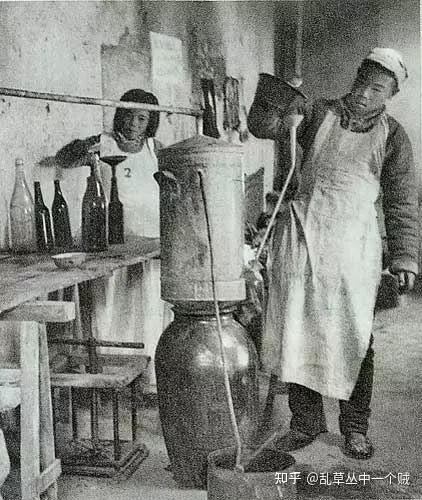
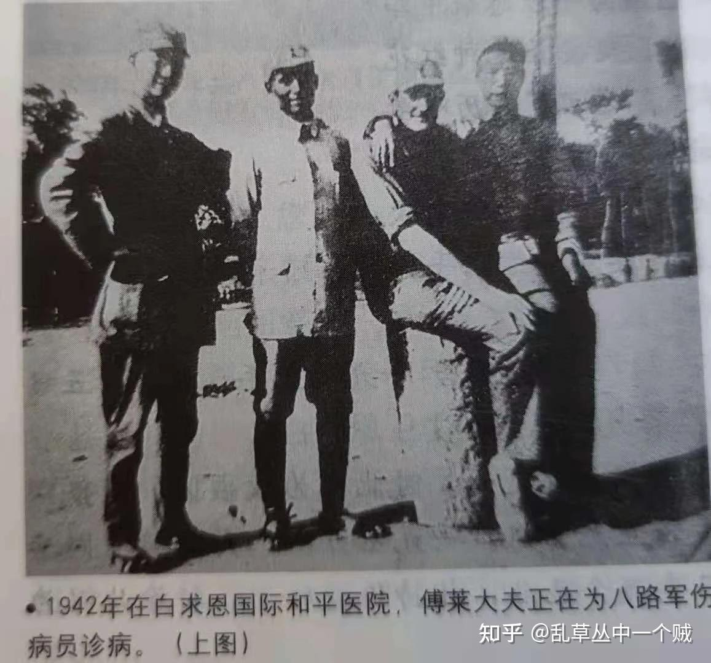
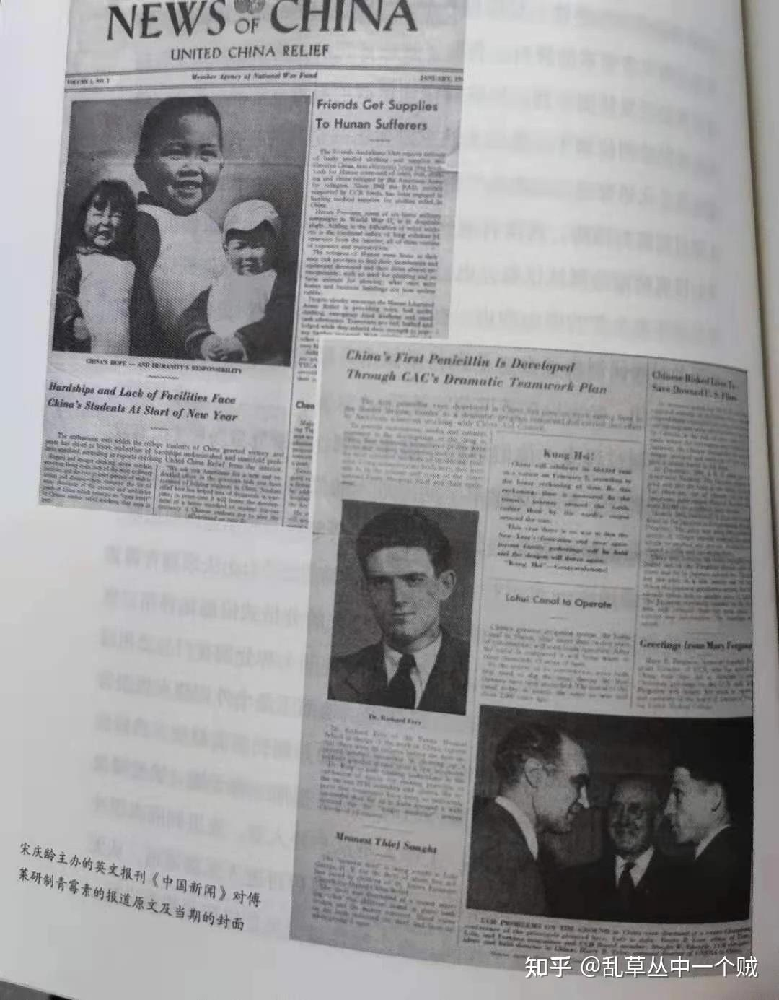
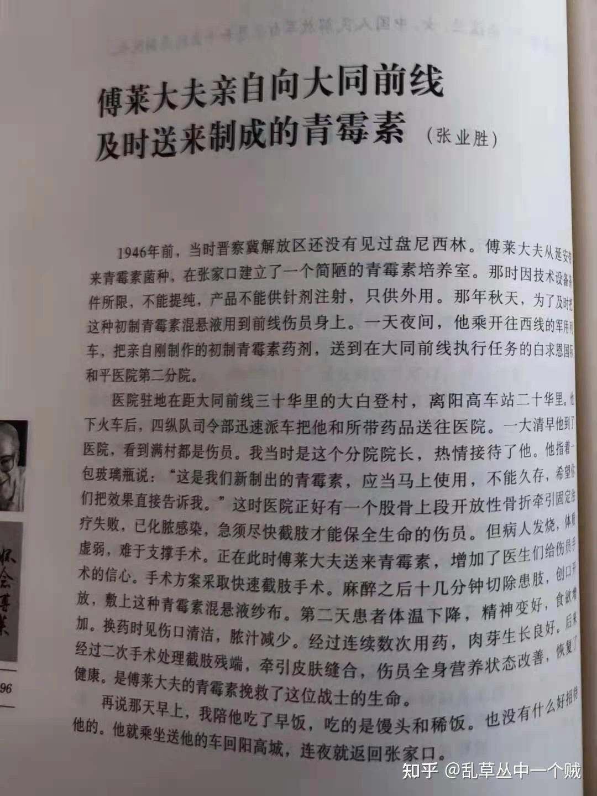

# 为什么抗战电视剧里面冒着生命危险去搞盘尼西林而不是去种板蓝根?

| 项目 | 内容 |
|---|---|
| 类型 | answer |
| 作者 | 乱草丛中一个贼 |
| 收藏时间 | 2025-08-25 05:45 |
| 发布时间 | - |
| 收藏夹 | 抗联 |
| 原链接 | https://www.zhihu.com/question/1943176696590230525/answer/1943187160619520416 |

## 摘要

很简单，当年的先辈们知道什么顶用。 中药在控制严重细菌感染（尤其是大面积创伤、坏疽）、需外科手术的紧急情况、恶性疟疾等方面，效果远不如现代西药可靠和快速。其标准化、大规模供应、快速起效性也存在问题。 长征开始时舍不得扔掉X光机，到了陕北后有了根据地，托宋庆龄从上海带来的物资中，除了能与远方联络的一百瓦大电台外，还有新的X光机。 1939年下半年之前，八路军每月可以向国府领取军饷及各种物资，比如1938年2、3…

## 正文

很简单，当年的先辈们知道什么顶用。 

中药在控制严重细菌感染（尤其是大面积创伤、坏疽）、需外科手术的紧急情况、恶性疟疾等方面，效果远不如现代西药可靠和快速。其标准化、大规模供应、快速起效性也存在问题。

长征开始时舍不得扔掉X光机，到了陕北后有了根据地，托宋庆龄从上海带来的物资中，除了能与远方联络的一百瓦大电台外，还有新的X光机。

1939年下半年之前，八路军每月可以向国府领取军饷及各种物资，比如1938年2、3月份，新四军从汉口的军医署领了半个车皮的药品，其中就有牛痘疫苗、三联疫苗、止痛片、止痛针、碘片、酒精等根据地急需的品类。

同时，爱国人士和华侨的捐赠也是我军药品的重要来源。抗战初期，红十字会救护队经常给我军送药品，而且每次都是大手笔，抗战一开始就拨给新四军两车皮药材，1939 年11月又一次性给了200万粒奎宁丸。还派出了三支救护队，到陕甘宁工作了两年多，做了三千多例手术，来的时候都也带了数百个床位的常用药。

宋庆龄主持的国际福利基金会也抓住一切机会，向延安运送药品和医疗器材，帮助我军度过了抗战初期的艰难岁月，不过，随着国共两军军事摩擦的加剧，国府很快就停止了对八路军的统一配给，也开始阻挠其他渠道的药品运入根据地。因此，从1939年秋季开始，八路军药品的主要来源就是秘密购买。1939 至 1942 年,晋冀鲁豫根据地通过地下交通线，到日占区购买的药品，约占药品总消耗量的70%至 80%。不但专职的秘密采购人员经常出入日占区，药材部门的负责人也多次化装成商人，到日占区大批量买药。而且国共当时也不算彻底撕破脸，重庆、西安等地的八路军办事处，也能想方设法搞到一点药。另外，整个抗战期间，沦陷区始终活跃着不少八面玲珑、四面讨好的商人，它们经常出入日寇占领下的大城市，与当地的药店保持着良好关系，不仅能买到珍贵药品、还能加工订货。比如晋察冀根据地就找到了一个专属供货商，甚至能从上海买到印尼原装的奎宁，可以解决敌后医疗的大问题。

但到1942年，八路军野战卫生部全年采购医药的开支，为法币10亿多元，以1942年1 月延安1 石小米价值法币630元计算，相当于花掉了160万石小米，严重消耗了抗日根据地极其有限的人力物力，这样庞大的开支显然无法持续。

1939年1月，八路军卫生材料厂正式投产时，有100多名工人，分为西药部、中药部、材料部，说起来，药厂的资金是靠孙夫人捐的5000法币起家的，压片机、灌注机等主要设备，是通过八路军驻西安办事处，从国统区制药厂买来的。技术骨干也是通过统一战线，到西北化学制药厂做了几次宣传，鼓动十几个技术工人跳槽组成的。
<figure data-size="normal"></figure>
1940年，根据地又用小米成功的酿造、提纯出了医用酒精，并且突破了玻璃瓶的生产技术，药厂出品的注射剂瓶，瓶口都是用酒精灯一个一个地烧结的，制作、消毒和检验都十分严格（后勤工作文献2 380页），从来没发生过什么质量问题。

年底总结，能生产的药品有100多种，包括奎宁注射液、葡萄糖注射液、健胃片等20多种常用药，增强抵抗力的大补丸、壮尔神，缓解中暑症状的八路军行军丹，以及黄苓碱、甘草膏等 80 多种中成药，战场救护中至关重要的脱脂棉纱、药皂、胶布等 10 多种卫生材料，也能自己生产。1939年，该厂生产注射剂3900盒、中药2500磅、片剂550磅、酊剂620 磅。1940 年产量翻了一番，1941年的产量又超过之前两年的总和，达到了针剂9600盒、中药15000磅、片剂4300磅、酊剂1700磅、药棉5100磅。

磺胺类药物的战场应用形成标准化流程：清创后直接撒布磺胺粉，外敷纱布包扎，每24小时换药一次。八路军野战医院在百团大战中创新“磺胺油纱条”技术，将磺胺粉与凡士林混合制成油纱，使伤口愈合时间缩短7-10天。据晋察冀军区卫生部档案记载，1941年反扫荡作战中，磺胺类药物消耗量占全部抗菌药的76%。

乙酰水杨酸的解热镇痛特性，使其成为战地最普及的非处方药。八路军每人随身携带的“急救包”中，阿司匹林片与磺胺粉、绷带并称“三大件”。1942年北岳区反扫荡作战中，卫生员通过舌下含服法，使阿司匹林起效时间缩短至15分钟，及时救治了大量发热伤员。

抗战结束前，自制的药品可以满足药品消耗量30%-60%，1944年甚至还突破了战场救护神药——粗制青霉素。

1939年，白求恩手术中划伤手指，细菌从伤口侵染全身。11月12日凌晨，白求恩在河北省唐县黄石口村逝世，终年49岁。

如果当时就有青霉素，不需要太多，也许几十万单位就足够挽救他的生命了。可惜，当时弗洛里和钱恩才刚开始进行青霉素研究；磺胺虽然已经出现，却非常难于获得。当时的根据地，用于伤口外涂消炎的只有红汞（２２０，即红药水）和铋泼糊（ｂｉｐｐ，碘仿糊剂），没有抗菌素可以使用。

1941年，晋察冀来了又一个外国医生，在白求恩卫生学校从事内科学、传染病学及医学检验学教学，还同时是白求恩国际和平医院的医生。
<figure data-size="normal"></figure>
1944年，这位叫傅莱的医生打算制造青霉素，此人于1920年出生于奥地利维也纳，原名Ｒｉｃｈａｒｄ　ｓｔｅｉｎ。1934年，Ｒｉｃｈａｒｄ　ｓｔｅｉｎ在多普林根中学读书，并接受了战伤急救、内科学、传染病学、医学微生物检验等医学专业培训。1937年，他加入了奥地利共产党。

1938年3月15日，德国吞并了奥地利，同时开始了压迫政策。理查德．斯坦因逃亡意大利，在意大利的热那亚港口登上了开往中国的远洋轮船。

1939年，19岁的Ｒｉｃｈａｒｄ　ｓｔｅｉｎ来到了上海港。先是在犹太人难民救助委员会自助的一家慈善机构打杂，然后与难民中学医的同行一起开办临时传染病医院，收治病人。后，北上天津，在一家德美医院做Ｘ光放射诊断和化验工作。

1941年，Ｒｉｃｈａｒｄ　ｓｔｅｉｎ在地下党的帮助下，辗转来到晋察冀，被安排到晋察冀的白求恩卫生学校与印度援华医疗队的柯棣华一起执教。1944年，傅莱从晋察冀调到了延安中国医科大学做教员，担任内科教学。同年11月，加入中国共产党。

傅莱后来还担任了华北军区卫生部顾问等职位，并在新中国成立后，与马海德一样获准加入中国国籍。

当时根据地面临日军及国民党双重封锁，敌后各区的药品供应十分困难。

在回忆录中经常可以看到地下党组织假扮商人或各种身份去敌占城市买青霉素、磺胺等药材，再设法运送到解放区的，现在的华润集团，前身叫联和行，是1938年中共为抗日战争在香港建立的地下交通站。联和行把募捐到的钱物，经秘密通道辗转运抵武汉、重庆八路军办事处，再分批转运到抗日根据地，为前线浴血奋战的八路军、新四军输送药物、通讯器材和运输车辆。

根据地只得自力更生，生产自救，1943年７月２２日，美军观察组（又称迪克西使团）第一批成员抵达延安。开始了美国官方与中国共产党开展了长达3年的正式交往与合作，迪克西使团是中国抗战后期中国共产党与美国政府开展军事合作的具体表现。通过在延安的观察，史迪威等人建议美国提高中共军队作战能力、改善共军武器装备，以期早日击败日军，夺取最终反法西斯战争的胜利。　

1944年夏，傅莱医生以美国援华联合会(UCR)中国总会晋察冀代表的身份，请美国援华委员会(CAC)帮助，向英美有关部门索取青霉菌菌种和相关资料。

美国援华联合会于1941年2月成立，旨在统一美国各地援华募捐活动和统一提供援华经费，该会章程规定，其救济对象“纯为中国人民，绝无党派和宗教之分”。

原白求恩国际和平医院院长李蕴兰在《傅莱大夫在解放区研制出青霉素》一文回忆，１９４４年冬，美国援华联合会提供的一批物资运到了陕甘宁边区，其中有一个蒸汽消毒锅，６支青霉素菌种，还有一些琼脂培养基、乳糖、玉米淀粉和碳酸钙等物质，另外还有一些关于青霉素的资料。

1945年初，傅莱根据资料，制定出初制青霉素开发研制计划，报陕甘宁边区政府批准立项后，就带领王学礼（建国后任中央核工业部812工厂医院院长）、宋同珍两位助手，在延安城东柳树店中国医大内，自己动手建起生化研究室开始研制。

从已有的资料来看，傅莱解放区的试制可能更加接近于『土法炼钢』。土房、土炕，人工抱着发酵瓶振摇，打气筒上装上无菌棉花和滤布的给培养液通氧……

　1945年5月17日，《解放日报》刊发了一篇题为《留延国际友人傅莱医生试制青霉菌素成功》的新闻消息。５月２０日，陕甘宁边区中西医药研讨会在边区参议会大礼堂举行首次医药学术报告会，傅莱医生在会上报告了怎样运用边区现有条件制造青霉菌素，并展览所需器具，说明制造过程。
<figure data-size="normal"></figure>
什么叫初制青霉素？它是什么形式的制品？制成的青霉素有效成分含量有多少？产量有多高？是否进行过动物实验？使用的时候是肌肉注射还是静脉注射或者只是口服？

李蕴兰回忆，1945年11月，傅莱奉命从延安到了张家口，把菌种和资料带到了晋察冀。傅莱和医学教授刘璞住在张家口西山坡的一座日式小楼里，小楼的地下室被改为了实验室。1946年４月，张家口生产的第一批初制青霉素生产出来被送到和平医院使用。

 1945年秋，张业胜被任命为白求恩国际和平医院第二分院院长。据张业胜回忆，1946年８月，傅莱乘坐开往西线的军用列车到了阳高车站，又乘坐司令部的车到达了医院驻地的大白登村，给当时在大同战役前线的白求恩国际和平医院二分院送来了青霉素。从张业胜的回忆中可以看出几点：１，傅莱所制造青霉素装于三角玻璃瓶的培养液中，为混悬液；２，没有经过提纯，只能外用，保质期不超过１周；３，使用的时候是用含青霉素的纱布包裹覆盖伤口。
<figure data-size="normal"></figure>
到了这里，我们可以得出结论，所谓的初制青霉素没有经过提纯、结晶，其实并不是严格意义上的的青霉素制品。它不仅距离欧美当时已经上市的青霉素有天壤之别，距离昆明中央防疫处１９４４年的青霉素制剂还有极大的距离。当然，它与现在我们使用的青霉素药品的差距，大概比图灵机与Ｍａｃ　ｂｏｏｋ的差距还大。

可是，能说它不是好药吗？

据张业胜回忆，当时，医院正好有一个股骨上段开放性骨折牵引固定治疗失败，已经化脓感染的伤者。医生对患者进行了截肢手术，并覆盖青霉素混悬液纱布。连续数次的用药后，肉芽生长良好，伤者存活了下来。

在那个时间、那个地点，只要能够用上，就已经是最好的药了。

1945 年，八路军野战卫生部举办了一场医药卫生成果展，一次性就陈列了好几百种自产的成品药剂。

---
导出时间: 2026-08-23 19:07