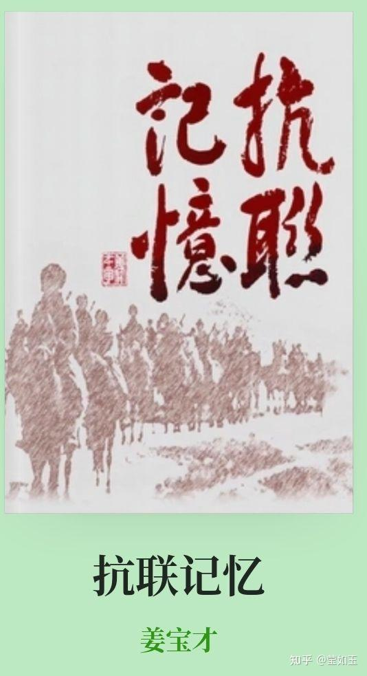
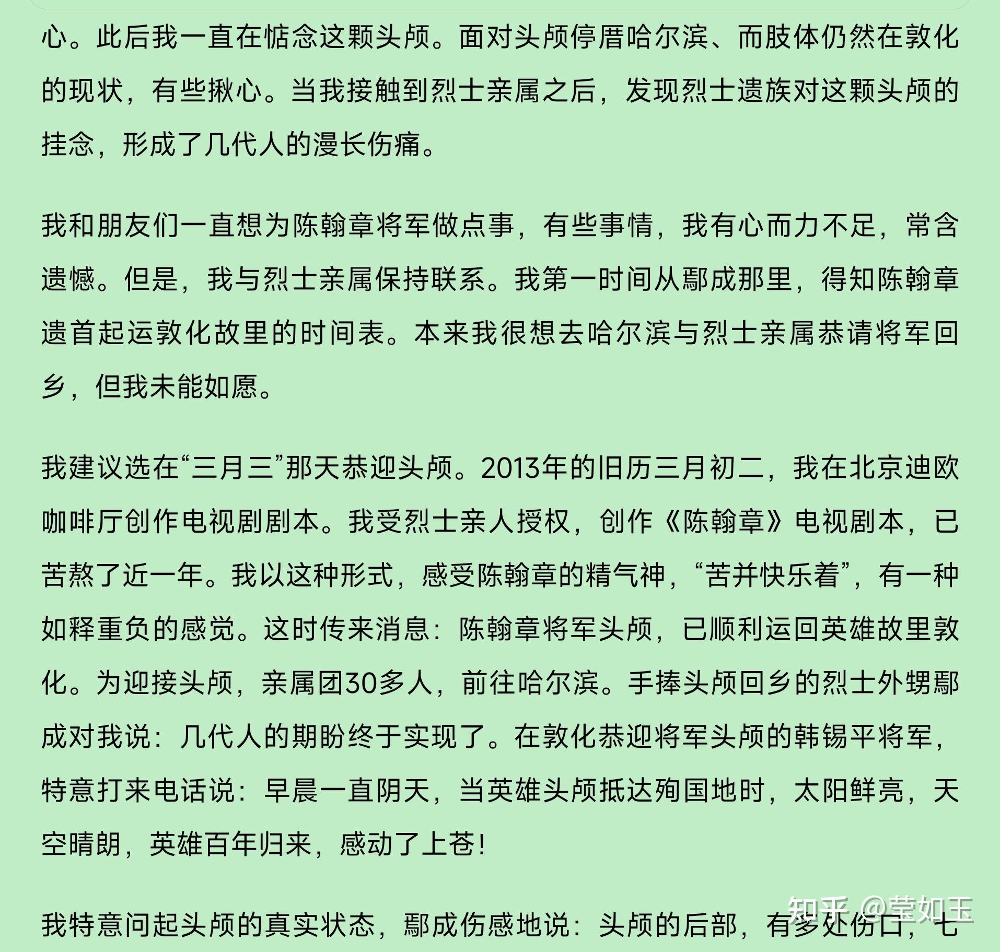
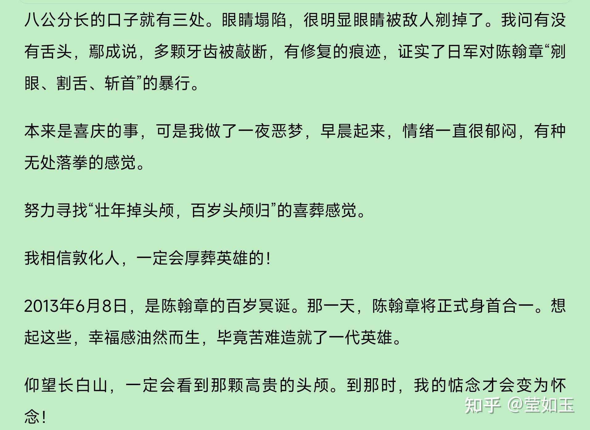

# 你见过哪些震撼的文物？

| 项目 | 内容 |
|---|---|
| 类型 | answer |
| 作者 | 莹如玉 |
| 收藏时间 | 2025-07-20 08:05 |
| 发布时间 | - |
| 收藏夹 | 抗联 |
| 原链接 | https://www.zhihu.com/question/641013464/answer/1930176545139438739 |

## 摘要

有这样一些文物，我不敢看，不忍看，只是看看描述就已经心中无比震撼，那是抗联志士留下的手脚甚至人头: 离庄凤家不远的地方，有家博物馆，展厅里就展示着一个类似木乃伊的“足部”标本，颜色褐黑，这是一位抗联者的“足部”，而且这是老兵活着时候捐给国家的。在抗联部队里，冻死人的事情屡见不奇，冻死的人数要比战死的人数还要多。抗联老战士姜立新，有一个绰号，叫秃爪子，他的10个手指全部被冻掉了，10个脚趾也都被冻掉了，…

## 正文

有这样一些文物，我不敢看，不忍看，只是看看描述就已经心中无比震撼，那是抗联志士留下的手脚甚至人头:
<blockquote data-pid="U5ar4wdm">离庄凤家不远的地方，有家博物馆，<b>展厅里就展示着一个类似木乃伊的“足部”标本，颜色褐黑，这是一位抗联者的“足部”，而且这是老兵活着时候捐给国家的。</b>在抗联部队里，冻死人的事情屡见不奇，冻死的人数要比战死的人数还要多。<b>抗联老战士姜立新，有一个绰号，叫秃爪子，他的10个手指全部被冻掉了，10个脚趾也都被冻掉了，他在1962年去世前，曾留下了手脚的照片，从照片上感受到抗联生活的原始状态</b>。当看到整个脚腕部以下被冻掉的“实物”时，有种“瘸”的感觉。这是抗联人的“足部”标本，极具有文物价值。可称得上是这家博物馆的镇馆之宝。</blockquote><h2>  抗联领袖杨靖宇、陈翰章、汪雅臣在殉国后，头颅被日寇制成标本保存，试图恐吓中国人民，新中国建立后，这三位烈士的头颅标本被列为一级文物，单看描写，就已经震人心魄:</h2>
 

  2005年的一天，我和几位朋友来到哈尔滨烈士陵园拜谒。这里是东北最早的烈士陵园，里面有我军第一任炮兵司令朱瑞的坟墓，这里还安放着抗联十军军长汪雅臣和抗联一路军第三方面军指挥陈翰章的头颅。

　　汪雅臣的头颅，浸泡在药水里，就像一位战斗间隙歇息的战士，脸色黝黑，一个典型的北方黑汉子。虽然看过几位烈士的遗首照，曾亲自从山林里寻找并捧回赵尚志头骨，也曾在杨靖宇身首合一的红馆前驻足。从没有像在汪军长头颅前的这种感觉：没有愤怒和悲伤，好像是在欣赏一颗活着的抗战者，甚至产生了一种雄壮感、威武感和强烈的艺术审美感：抗战者的头颅就应该是这样！

　　最后，来到安放陈翰章头颅的墓室。应该说，这是我见到最好的由大理石砌就和雕刻而成的，很有装饰感、肃穆感，这是墓碑的艺术。

　　墓室大开了，看到了陈翰章的头颅。这颗头颅跟汪雅臣的头颅相比，面部惨白，两眼凹陷，嘴唇内收。与头颅对视，他犹如我的父亲、我的祖父、我的祖上——一个地道东北人的模样。他静默不语，一尊佛首。为了拯救整个国家，头颅落地。他是远古神话里的战神，掉了头颅，以乳为目，以肚脐眼为口，手持武器，作战的英雄。浑身血液加速，冲上头顶。

　　这是平生人第一次见到皮肤组织完好的烈士头颅。头颅生动如初，依然可看到他殉国时的表情，以及头上留下的伤痕。

　　解说员说，头颅的主人，为了抗日上了长白山，从此再也没回头，直至1940年12月8日殉国。他是一个美男子。

　　讲述完他的战绩，介绍他殉国时的状态：他负伤后落入魔掌，怒骂敌人，敌人割去了他的舌头；他怒视敌人，敌人剜下他的眼球，最后日军割掉了他的头颅。

　　尽管他属于前辈，但是他殉国时才28岁。他由于在药水里保存，头颅如初——将军战斗间隙中的打盹。他双眼塌陷，脸色惨白。我看到头颅，颓然跪下。在墓室里向头颅下跪的姿势，被李明先生（赵尚志外甥）拍了下来。他快寄给了凤凰台“文涛拍案”节目组。后来我跟窦文涛谈到当时的感受：面对头颅，有一种被刀子刺中胸膛的感觉，真正知道了什么是“心痛”。后来窦文涛告诉我，片子播出后节目组收到观众来信，很多人想前去拜谒英雄头颅。

　　最痛苦的莫过于烈士的遗族，陈氏家族到陈翰章这辈子，已是三代单传，男性只有陈翰章自己。陈家就盼着他顶起家业，谁想到他偏要去抗日救国，这无疑等于让陈家断香火。

　　陈翰章死后身首异地，吉林敦化埋的是尸体，头颅还在哈尔滨。陈父临终前最惦念的就是让儿子身首合一，他跟妻子交代后事，落叶要归根，把你儿子头颅找回来，给他安葬，让他有个全尸。

　　后来，陈母知道了儿子头颅的下落，特意到哈尔滨看儿子。她坐在一旁端详自己的儿子，悲痛欲绝，跟儿子说：你为国家已经尽忠了，跟妈回家吧！

　　老太太想把儿子头颅要回家，埋在“老头子”（陈父）脚下。尽管儿子是老太太的，但整座城市都舍不得让陈翰章离开。陵园的人对老太太说，想儿子的时候，就到这里看看。

　　每次来看儿子，老太太都不愿意走。后来老太太不能走了，只有把思念放在心里，一直到死前，还在叨念儿子啥时候回来。

　　再后来，妹妹陈凤英为哥哥的事奔走，总觉得应该让陈翰章有个囫囵身子。到了1986年的时候，陈凤英领着自己的女儿去哈尔滨。扫完墓就要把哥哥的“脑袋”抱回来，烈士陵园不敢做主，自然不同意。她一气之下去北京找陈翰章的战友，那位战友早已经去世，其夫人安慰她，劝她想开一些。陈凤英从北京回来不久就去世了，时年54岁。后来，陈凤英的丈夫带着儿子去看头颅，这个儿子就是我的朋友鄢成。

　　鄢成对我说：“小时候调皮，姥姥就把舅舅‘回家’的事托付给了我，渐渐地我对舅舅有了一种印象，但很模糊：我一直纳闷，他怎么就掉了脑袋呢？有一天，父亲带着我和家人去看舅舅，这是我第一次看到舅舅的模样。看到舅舅头颅时，心里是真的很难受，那脸上的刀疤，陵园人的介绍说，舅舅当时右臂受了伤，就靠在一棵大树边，鬼子就冲上来了，舅舅用左手拿枪的时候，日本人就上来了，用刺刀在他的脸划了两刀，陈翰章怒骂日军，日军把枪抢去了，把舅舅绑在树上，把牙撬开，把舌头割下来。陈翰章用眼睛怒瞪日军，日军把他眼球也挖了出来，随后砍掉了他的头颅，把头颅送到日本关东军司令部，去邀功领赏。”…………
<figure data-size="normal"></figure>
 
<figure data-size="normal"></figure>
 
<figure data-size="normal"></figure>

---
导出时间: 2026-08-23 19:07