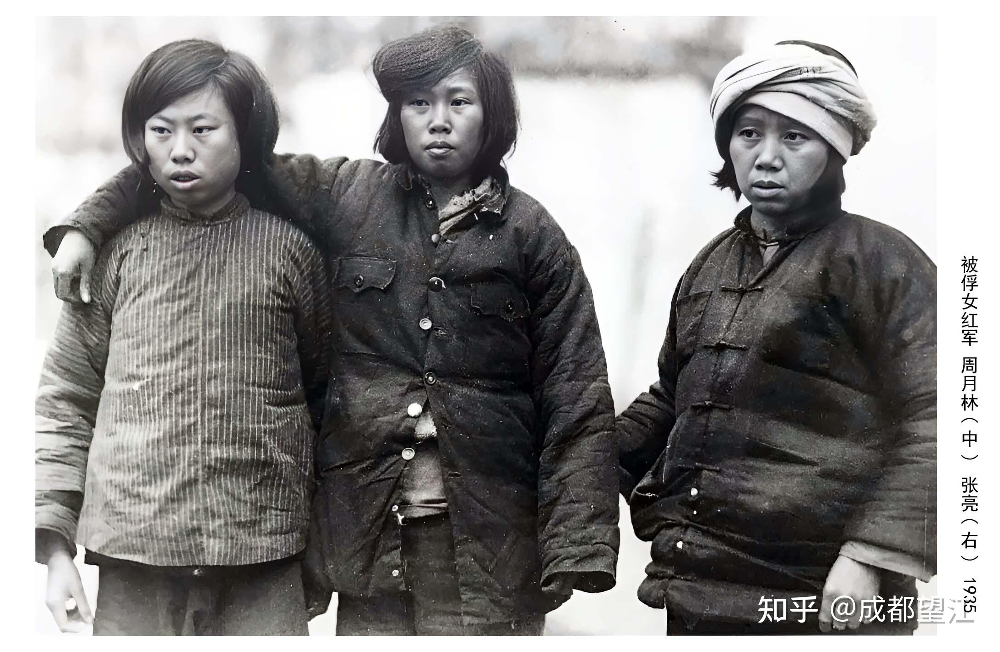

# 历史上有哪些被冤枉误会的人？

| 项目 | 内容 |
|---|---|
| 类型 | answer |
| 作者 | 成都望江 |
| 收藏时间 | 2025-06-11 10:33 |
| 发布时间 | - |
| 收藏夹 | 抗联 |
| 原链接 | https://www.zhihu.com/question/31895606/answer/1916080490458362562 |

## 摘要

女红军周月林和张亮 1935年，三名突围的女红军在福建被抓捕示众，中央社记者拍了一张照片，在报纸上发表。 [图片] 位于中间的女性名叫周月林。1906年生于上海，9岁做童工，17岁进纱厂，1925年加入中共。她的第一个丈夫张佐臣是早期共产党人，五卅运动领导者之一，1927年四一二事变后遇难。此时她已赴苏联。后来与另一位早期共产党人梁柏台在苏联结合。1931年秋，夫妻二人被派回中国，进入瑞金中央苏区。梁柏台任司法人民委员，周月林任…

## 正文

女红军周月林和张亮  

 

1935年，三名突围的女红军在福建被抓捕示众，中央社记者拍了一张照片，在报纸上发表。  
<figure data-size="normal"></figure>
 

位于中间的女性名叫周月林。1906年生于上海，9岁做童工，17岁进纱厂，1925年加入中共。她的第一个丈夫张佐臣是早期共产党人，五卅运动领导者之一，1927年四一二事变后遇难。此时她已赴苏联。后来与另一位早期共产党人梁柏台在苏联结合。1931年秋，夫妻二人被派回中国，进入瑞金中央苏区。梁柏台任司法人民委员，周月林任妇女部长。在1931年11月召开的中华苏维埃代表大会上，周月林与毛泽东、项英、张国焘、朱德、张闻天、周恩来、刘少奇、陈云、瞿秋白等17人为中央主席团成员，周月林是其中惟一的女性。她接着当选中华苏维埃共和国中央执行委员会委员，后担任医院院长。

 

位于右侧的女性名叫张亮。她原籍四川，也曾去过苏联，曾任红军总司令部副指导员，是项英的妻子。

 

中央红军主力长征后，组织决定梁柏台、周月林夫妇留守江西。1935年2月，留守红军领导人项英看到瞿秋白肺病恶化，何叔衡年近六旬，妻子张亮怀孕，决定派一个警卫排护送他们突围，前往香港。周月林熟悉地下工作，派她一道前往。2月24日，他们在福建上杭水口镇附近被包围。周月林跳出了包围圈，发现瞿秋白与张亮还未脱险，于是回头寻找，不幸与瞿秋白、张亮一起被俘。三人在危险中约定了假身份，瞿秋白自称医生和文化教员，周月林自称护士，张亮自称香菇行老板。他们被关押到上杭，两个月后转押龙岩，再转押长汀国民党军三十六师师部。6月18日，瞿秋白被害，时年36岁。周月林和张亮被判10年徒刑。在狱中，由周月林接生，张亮产下一个男孩，取名项学诚。

 

国共再度合作后的1938年5月，梁柏台的同学陈士明将她们保释出狱。周月林方知梁在1935年3月4日突围时负伤，已被杀害。

 

周月林和张亮想回到共产党怀抱。但组织上认为她们出卖了瞿秋白，不再接纳。她俩在兵荒马乱中走散。张亮带着儿子到南昌找到了项英。有一种说法，说项英当面质问张亮：“瞿秋白同志是怎样死的？是不是你和那个周月林干的？”张亮来不及分辩，就被项英一枪击毙。有人则否定这种说法。1998年，原项英的警卫排长李德和解开了这个谜团。根据他的回忆，1938年年初，张亮还带着孩子来到了新四军军部，见到了项英，夫妻二人相处非常和睦，没有爆发过争吵。后来张亮还带着孩子离开了，原新四军军部秘书长李一氓也表示项英没有拔枪射杀妻子，而是因为当时部队在战时的特殊因素，不方便将张亮和孩子留在部队，于是项英给了张亮一些钱让她带着孩子走了。项英和张亮还有一个女儿，名叫项苏云，据项苏云回忆，在1938年，张亮曾经将儿子项学成送到延安，交给中央组织部。由此可见，项英并未枪杀张亮，否则张亮不可能出现在延安。中央文献出版社2010年出版的老红军陈复生回忆录《九死复生》，还原了历史真相——“项英不留她，给了她路费，任她自行设法将儿子送到延安。然后由康生命令边区保安处逮捕了她。边保干部陈复生回忆，领导告诉他说：“项英来电，同意处死。”遂命令陈复生等用绳子勒死了张亮。“那个女人被带来的时候一句话也没有说，我们也一句话都没有问。”张亮死后，项英到延安出席中央全会，曾见到张亮留下的儿子项学诚。1941年发生皖南事变，项英遇难，时年43岁。后项学诚留学苏联，成为海军潜艇军官。他死于文革，时年39岁。

 

周月林回到上海，嫁给一个贫苦工人。中华人民共和国成立，当年瑞金的同事毛、刘、周、朱、陈等已经成为国家领导人。周月林默默地在上海从事街道居委会工作。1955年，瞿秋白遗孀杨之华要求追查出卖瞿秋白的凶手。这年8月24日，周月林被捕。1965年12月，北京市中级人民法院以“出卖党的领导人”罪名判处12年徒刑。她先在京郊劳改农场服刑，1969年10月，遣送到山西省榆次女子监狱。瞿秋白在文革初也以《多余的话》为由被打成叛徒。周月林被关押14年后，留榆次日化厂就业，仍是监督劳动。

 

在胡耀邦推动平反冤假错案的大形势下，瞿秋白洗刷了罪名。周月林的冤情也迎来转机。1979年，有关部门根据当年的报纸上“赤共闽省书记之妻投诚，供出匪魁瞿秋白之身份”的报道，确定福建省委书记万永诚牺牲后，妻子徐氏被俘，熬不过酷刑，供出瞿秋白，又经被俘的收发员郑大鹏暗处指认，坐实了瞿的身份。从而确定周月林、张亮没有出卖瞿秋白。1979年11月15日，北京市高级人民法院撤销对周月林的原判，无罪释放。

 

1980年3月，山西省组织部给周月林落实政策，按1925年参加革命办理离休手续，提议给她定行政14级，她只接受了17级，当时月薪不足百元。她年逾古稀，孤身一人，幸亏梁柏台老家新昌县欢迎她前去养老，她和上海工人所生的一个儿子也愿意照料她。她活到91岁去世，总算度过了安宁的晚年。

---
导出时间: 2026-08-23 19:07