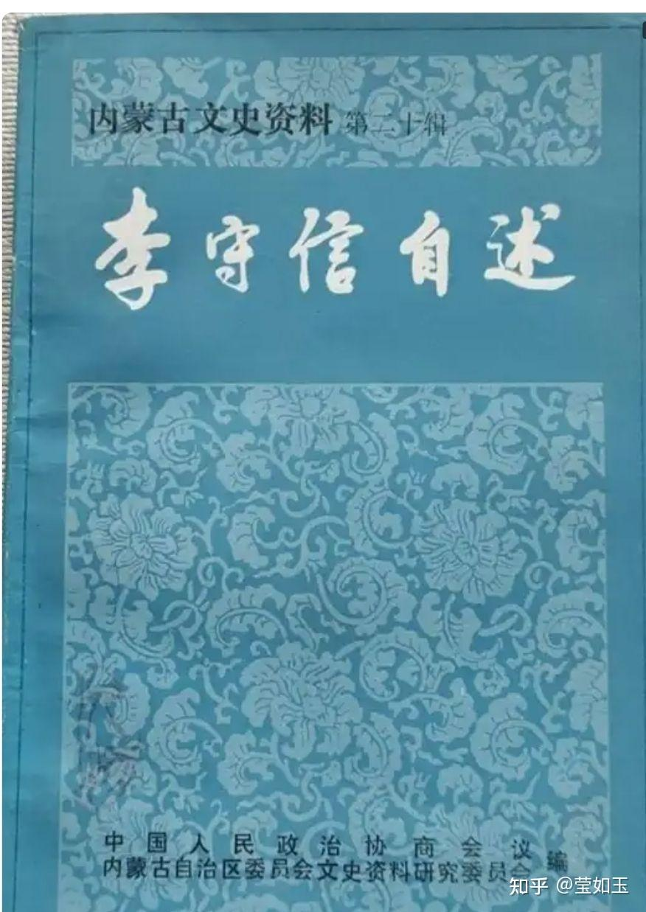
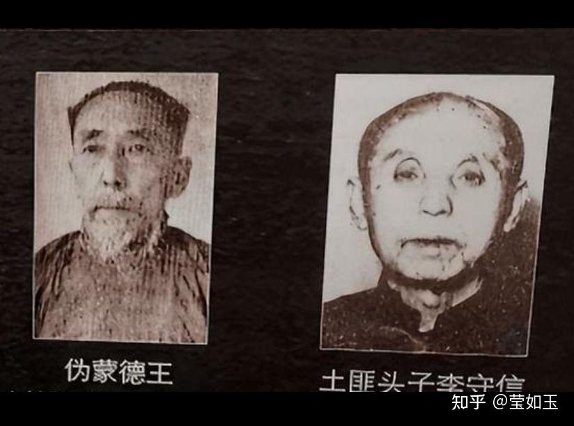
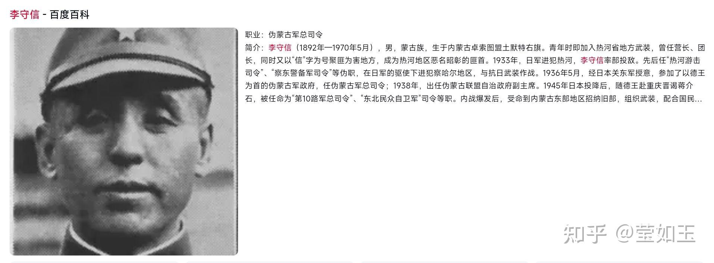

# 有哪些学者的回忆录或是个人自传写得生动有趣，值得一看？

| 项目 | 内容 |
|---|---|
| 类型 | answer |
| 作者 | 莹如玉 |
| 收藏时间 | 2025-04-14 19:15 |
| 发布时间 | - |
| 收藏夹 | 抗联 |
| 原链接 | https://www.zhihu.com/question/6418760622/answer/1895193454956482704 |

## 摘要

推荐一位&#34;绿林大学&#34;函授教授李守信的自传，绝对是一流水准。 李守信从一个文盲炮手起家，到土匪，到官兵，到投靠日本老牌汉奸，到投靠老蒋坚决反共，到被俘改造寿终正寝（这货明明都跑到台湾了，愣是为了自己的政治野心又跑回大陆想反共游击，结果自投罗网）。这一生够传奇了。而他晚年的口述回忆录也很认真，提供了大量珍贵的热河土匪，军官，汉奸资料，可以说是热河的一部历史。且文笔生动，内容详细，阅读起来毫无乏味之感。 …

## 正文

  推荐一位&#34;绿林大学&#34;函授教授李守信的自传，绝对是一流水准。

 李守信从一个文盲炮手起家，到土匪，到官兵，到投靠日本老牌汉奸，到投靠老蒋坚决反共，到被俘改造寿终正寝（这货明明都跑到台湾了，愣是为了自己的政治野心又跑回大陆想反共游击，结果自投罗网）。这一生够传奇了。而他晚年的口述回忆录也很认真，提供了大量珍贵的热河土匪，军官，汉奸资料，可以说是热河的一部历史。且文笔生动，内容详细，阅读起来毫无乏味之感。
<h2>  例如他当了四年多的胡匪，对热河土匪内幕如数家珍，就拿胡匪的战斗方式来说，你看他的介绍，简直是一部经典的打劫教科书:</h2>
  胡匪多在“落簾”(日落)以后行动，到了“挑簾(日出)以前即 行潜伏。黑夜走路除了观星，还以四季的风向判断方位。夜间 行动时也有口令做为联络的信号。“合杆”时，各“杆”都互相戒 备，行军休息时不敢和不可靠的“杆子”相随或聚集在一起。

  和官兵“开壳”，如被围在山头和大院里，亦是支持到“落簾”以后 才敢突围。因为白天突围伤亡大还要被跟上。没有情况都是白 天休息，谓之“压班”。进村之前即设上“卡子”，把村子完全封 锁起来，找高处派人上去站岗，“团语”叫“瞭水”。然后挨门逐 户点名，告给老百姓们不准少了一口，恐怕跑出去走露风声， 或是前往营盘中报告。过路的人进来以后，就禁止再行出去， 等“杆子”挑开方许行动，并进行盘查。“压班”的时候，轮 流“放卡”和“瞭水”，由“爬子”给喂马，当地的乡约或甲头给准 备两顿饭。休息时，和衣抱着枪睡觉，马不卸鞍子，只是把肚 带松开。“挑”的时候本来朝东走，却往西或往南、往北开拔， 四散开绕一个圈儿，然后才归入正路。村里如有自己的“线 头”，给拿上扫帚或赶着牲口“漫踪”，遇见河流下水走几里， 再上干岸投奔大道。所有这些，都是预防官兵追击。当官 兵“搜踪归线”一耽误时间，“杆子”便可走远了。

   “出摊子”不外干“卡线”和“打窑”两种营生，以及遇见官 兵“开壳”。“卡线”多在白天动手，“引线的”把镖车、烟土驮子 和“肥秧儿”出门的日期，和必经的路线探听明白以后，“杆 子”预先在险要地方埋伏起来，临时把交通断绝，来往的人都 集中到一起看管，除没收武器概不搜腰。如果报出字号， 是“当家的”的朋友，连武器也不没收。镖车、烟土驮子和“肥 秧儿”，差不多都有“炮手”保护。

  “杆子”里的人要分开三组，进行“卡线”战斗。一组专对付“炮手”，把他们轰跑赶走； 一组先往打倒拉东西驮货和人骑的骡马，使其走不出现场；另 有一组担任警戒，设上“卡子”准备应付突然而来的敌人。因为 附近的驻军或是民团，听见枪声往往会寻找麻烦，并且大道上 说不定会和走路的军队及其他“杆子”遭遇。东西和“秧儿”到手 以后，即火速离开现场。如果卡了“肥线”和弄住“肥秧”，由于 贪图钱财和重赏之下必有勇夫，军队会不顾命地追击；民团、 巡警以及其他“杆子”，也会在听见消息以后，等在半路或是卡 在险道上拦阻。

  除了去绑“土包子”财主，胡匪很不愿意“打窑”。因为遇 到“响窑”，都有“炮手”站在碉堡上抵抗，一两小时攻打不开， 联庄就会把民团调集起来，纠缠住不好脱离战斗。并且子弹很 缺，又没有重武器，故忌讳攻坚。所以勒“肥秧”最好不到他家 里去勒，而要在“老虎出洞”的时候下手。“打窑”不只惊动军 队、民团，并且打草惊蛇，“窑儿”里如果没有“线头”，即便把 窑儿打开，也找不见正经的“主儿”，他们有地道可以逃走。要 是非“打窑”不可，事先必须由“线头”调查清楚里边的各种情 况。如“炮手”住在那间房中，主人睡在那个院里，贵重财物和 枪马子弹搁在什么地方等等。全盘情况了解以后，也是分组进 行战斗。夜间进入村中，首先派一组人设上警戒“卡子”。一组 摸到墙根用横杆登上去夺碉堡。一组人跟着跳进院去。除了撬开大门留下出路，其余猛扑主人的卧室，点着装到洋铁桶里的 油浸棉花，扔到房里照得通明，“线头”指给哪个是“当家的主 儿”或是全家的“命根子”，外边喊一声：“朋友，对不起得 很！”让穿好衣裳送给“秧子房当家的”派人经管。事先估计好 有多少家当，如把枪弹、骑马和现金、烟土献出来，即不必往 走带人；如款项存在外边或坚不吐露，那就蒙上眼睛叫他上 马。因为时间非常紧迫，并且防止“小绺子”们翻箱倒柜。如 无“线头”指给确实储存枪弹、现金和烟土的地方，把“秧儿”勒 住以后，即不“扫窑”，而要很快地离开这个村庄，吃饭、休息 得到百八十里以外再说。离开“打窑”和“卡线”的现场后，在没 有开入“压班”的村庄以前，“当家的”都要突然把众人圈起来， 下马搜查腰包和马鞑子，要是进入村庄“压班”时检查，“小绺 子”们都有路数，那就将抢摸来的东西转移到了别处。“压 班”以后出了村子，也进行突然检查。随便乱拿东西会松懈战 斗，故“杆子”里不许小偷小盗。

“出摊子”的时候，必然要和官兵或民团“开壳”。特别是破 了他们的“圈儿”，还要跟踪硬追，尤其是“卡线”和“打窑”遇 见“茬口”，追得越发凶猛。“当家的”朋友不多，又做了好“买 卖”，沿途可以说尽是敌人。遇到“跳儿”(官兵或民团)追击， 派“炮头”指挥一些“硬手”在后边“蹩着”，“挑线的”领着大队继 续走路。“当家的”看见后边“蹩不住”，带上人扭回头去援助。前边发现有人拦阻，也是派“炮头”指挥“硬手”去“蹩”，“挑线 的”给引路绕开行走。“炮头”带的人能够“蹩住”，“当家的”就 不必过去援助。如果四面八方前来包围，首先得抢山头。在平 川地方一看冲不出去，就得赶快进大院上房，等到“落簾”以 后，再往出冲击。无论是“挑儿”前来追击、拦阻或者包围，胡 匪都要“先礼后兵”。如果官兵、民团是应付公事，只回给以零 星的空枪，或是打发“线头”跑过来叫给扔下一些东西，好回去 销差，“甩头”(扔马)不满足，还得给“甩爬子”。如果把东西扔 下还不罢休，那就是要抢“秧儿”或解决“杆子”。到了这个时候 才设“死卡子”，撂倒马还不朝理，即往倒撂人，因为他们不认 这一份儿朋友。突围的时候，预先得“打道”，就是把包围圈挑 开一个缺口，队伍从口子冲出去。被包围在大院里，走时在墙 上掏一个能通过人马的窟窿，这也是由“炮头”领一帮“硬手”在 前边“打道，先把手伸出去向前面、左面、右面放枪，如没有 重大反响，再扔出一个物件，亦未招来子弹，证明这个地方敌 人包围松懈，出去前左右三面设上个三“死卡子”，包围圈的缺 口就越挑越大，全部人马都可通过。一出了圈儿，军队就不容 易再行追上，因为军队是一人骑着一匹马，胡匪多是两、三匹 马，骑累一匹再换一匹，昼夜不停，可走四百多里。……

 

像上面这样详细有趣的资料，在李守信的回忆录里很多很多，推荐大家看一看，有趣的紧呢。
<figure data-size="normal"></figure>
 
<figure data-size="normal"></figure>
 
<figure data-size="normal"></figure>

---
导出时间: 2026-08-23 19:07