# 如何评价徐志摩的「血海论」？

| 项目 | 内容 |
|---|---|
| 类型 | answer |
| 作者 | 公社记录委员 |
| 收藏时间 | 2025-04-12 08:10 |
| 发布时间 | - |
| 收藏夹 | 抗联 |
| 原链接 | https://www.zhihu.com/question/603594146/answer/1894301387606713558 |

## 摘要

没什么问题，革命就是要流血厮杀，只是光说杀还不对，我还要加以补充， 不只是革命者要杀人，还要带领群众一起杀人，…群众的发动，开始即是暴烈的，在城市必须尽量屠杀工贼、反动政府机关一切官吏，反动的国民党，破坏交通机关，税收机关，没收银行大商店豪绅的财产。在农村中须尽量屠杀土豪劣绅农贼，彻底铲除封建关系，没收土地财产，这种斗争必须是风暴的，猛烈的，才能推翻一切旧社会政治的经济的，改变社会关系。我们必…

## 正文

没什么问题，革命就是要流血厮杀，只是光说杀还不对，我还要加以补充，<b>不只是革命者要杀人，还要带领群众一起杀人，</b>
<blockquote data-pid="ZxJxu19v">……<b>群众的发动，开始即是暴烈的，在城市必须尽量屠杀工贼、反动政府机关一切官吏，反动的国民党，破坏交通机关，税收机关，没收银行大商店豪绅的财产。在农村中须尽量屠杀土豪劣绅农贼，彻底铲除封建关系，没收土地财产</b>，这种斗争必须是风暴的，猛烈的，才能推翻一切旧社会政治的经济的，改变社会关系。<b>我们必须排斥“仁慈”、“维持秩序”等坏观念，以阻挠群众几千年积抑之下的发泄和破坏。</b></blockquote><figure data-size="normal">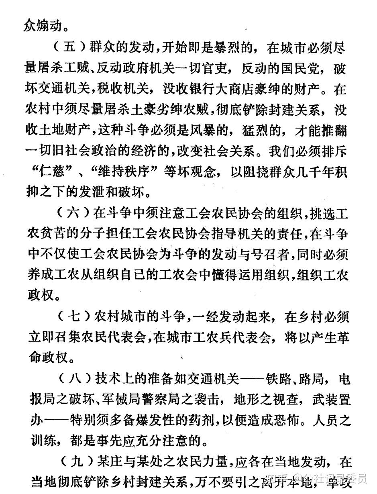<figcaption>河南省委致郑州市委信—关于发动群众武装暴动的补充意见（一九二八年十二月底）</figcaption></figure>
不只是要带领群众一起杀人，<b>更要注意在这些杀人里让群众自己觉醒，使其从自在的阶级跃升为自觉的阶级，在阶级的暴力中直观的感受自己的力量。</b>
<blockquote data-pid="AjnzhUVq">……<b>暗杀的方式杀死工贼，以文字的宣传作公开的承认，这仍不能赤色恐怖使群众负起责任，而是以党代替群众，且公开的承认赤色恐怖是党或团干的，更是错误，使群众认为这是党团与工贼的冲突，而不是群众不容工贼的表示，使群众因此越发畏缩，使反动派工贼等的活动不能因受这次打击而感到革命的群众势力非常伟大，到处可以受工人的监视，因而不敢不停止其反动的工作，工人要马上屠杀工贼的倾向，是不应抑止的。</b>但是如某同学在厂中领导二、三十人进行殴打工贼，仍不能常有多量的群众的意义，<b>你们现应在秘密工会的小队中，挑选比较勇敢的分子组织恐怖队，在秘密工会指导之下进行殴打，通告应普遍的尽量的宣布工贼的罪恶，极力煽动工人殴打工贼的情形。群众已充满了殴打工贼的热情，即随时都可在工人群众合聚的场合内，如在工人上工或下工时间，鼓动群众进行殴打，工人群众在殴打混乱的状态中，恐怖队指导高呼口号，更应由恐怖队分领群众搜捕其他工贼，进行围殴痛打，打时最好是打死，至少要打得他失掉进行反动工作的能力</b>，打了以后应由工人组织的名义及党、团名义，散布传单，历述工贼勾结资本家军阀买办阶级的事实，宣布其罪状，使一般知道买办阶级勾结军阀资本家最〔后〕结果。</blockquote><figure data-size="normal">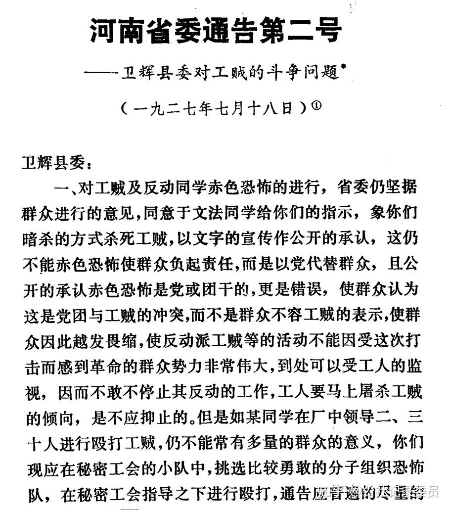<figcaption>河南省委通告第二号—卫辉县委对工贼的斗争问题*（一九二七年七月十八日）</figcaption></figure>
不只是让群众殴打屠杀反动派就好，<b>还要把群众的权力无限制扩大，就是革命干部被吊树上打断腿，乃至也被殴打冤杀，也是革命的一环，</b>
<blockquote data-pid="UA8lZ4KK"><b>面对整党，普通党员起初并不十分在意， “因为他们懂得上级这一套，每次都说得很厉害，以后马马虎虎也就完了”.⑤雁北有些干部参加整党会议时还在琢磨： “不管开什么会也好，先脱了衣裳睡他几夜安生觉再说，还可抽时间到浑源城去玩玩。”</b>6但是，随着工作队对群众的鼓动，以往积累的干群矛盾逐渐爆发，工作队又为之火上添油，使之不断激化后，<b>干部受到的压力和打击已非同一般，殴打致残乃至致死事件时有发生。保德三区东庄一干部因扩兵中的强迫行为，“被和他有私仇的妇女们拿着木棍，只打三下，把下腿打断了。四区也曾发生过同样一件事”。面对这样的危险，一部分区村级的干部， “因为过去曾多少犯过些错误，打过人，或使用过群众斗争果实，占过便宜，也整天害怕，‘不知何时交群众处理呀！””⑧在整党激烈地区，干部人心惶惶，和顺县“普遍的形成干部害怕、发愁、着急，以至寻死服毒等现象”；9难石县“七区区长逃跑到山中自杀了，二区区长前天也吃了大烟，而这些人都还认为是问题不大的”</b>。 和党员干部的状况形成对照，<b>一部分群众在整党中确有出气和当家做主的感觉。沙河新城工作队召开整党群众大会时，有些群众“说到干部对自己压迫，放声大哭。贫雇妇女周明的说：&#34;我这次破出死也要倒出自己的苦水来，去年俺到北掌村开贫雇会，提了村干部几条意见…………说我是特务、造谣，狠狠的吊打了一顿，还准备扣我四十天。</b>&#39;群众情绪很高，午饭后又自动的集合起来”。①<b>山西涉县经过群众性的整党后，群众反映： “‘当干部真不容易，一点脏也要洗脸啦！，群众对干部的火气全消了。”宾县一位贫农更是深有感触： “我活五十来岁，不用说看见过，连听说都没有过老百姓还能管干部，这才叫真民主呢！”</b></blockquote><figure data-size="normal">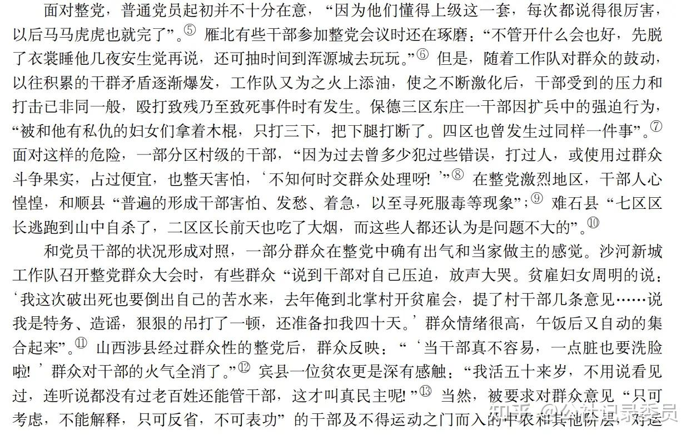</figure>
<b>对革命者来说，革命不是轰轰烈烈，更不是什么“归来报明主，恢复旧神州。 ”“无偏无党，王道荡荡。”“今逢四海为家日，故垒萧萧芦荻秋。”革命就是一件要人命的琐碎事，接上第二件要人命的琐碎事，直到革命胜利或者革命者牺牲。</b>

革命要你抹杀亲情，自己父母身死，姊妹兄弟来信，自己也得为了革命工作自动或被动（<b>有时候没得选，上级会要求你一定要留下）</b>所以会错过和亲人的最后一面。
<blockquote data-pid="WTUlNArf">霁帆既为吾校学生，又担任重要职务，对感情方面应该减杀。至安葬一节不过是钱的问题，所需才不过百元，若就地与特派员商议，在此筹钱或者可以，如此则不必回家，以致防害工作。</blockquote><figure data-size="normal">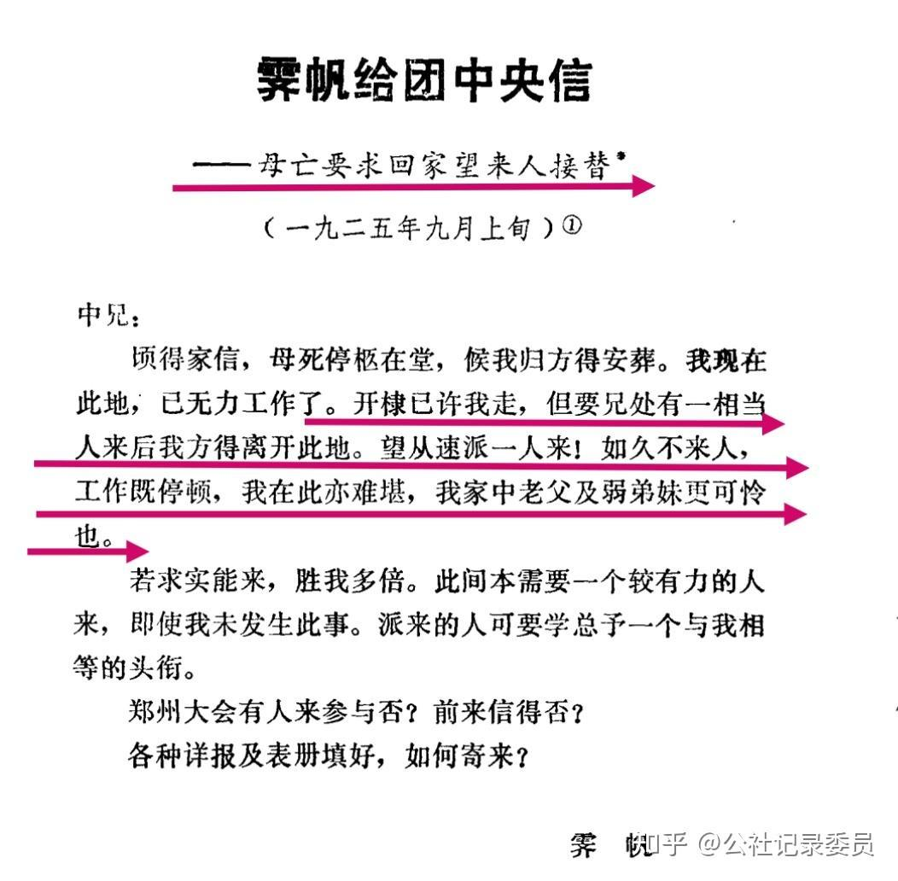<figcaption>（9月上旬）霁帆给团中央信—母亡要求回家望来人接替</figcaption></figure><figure data-size="normal">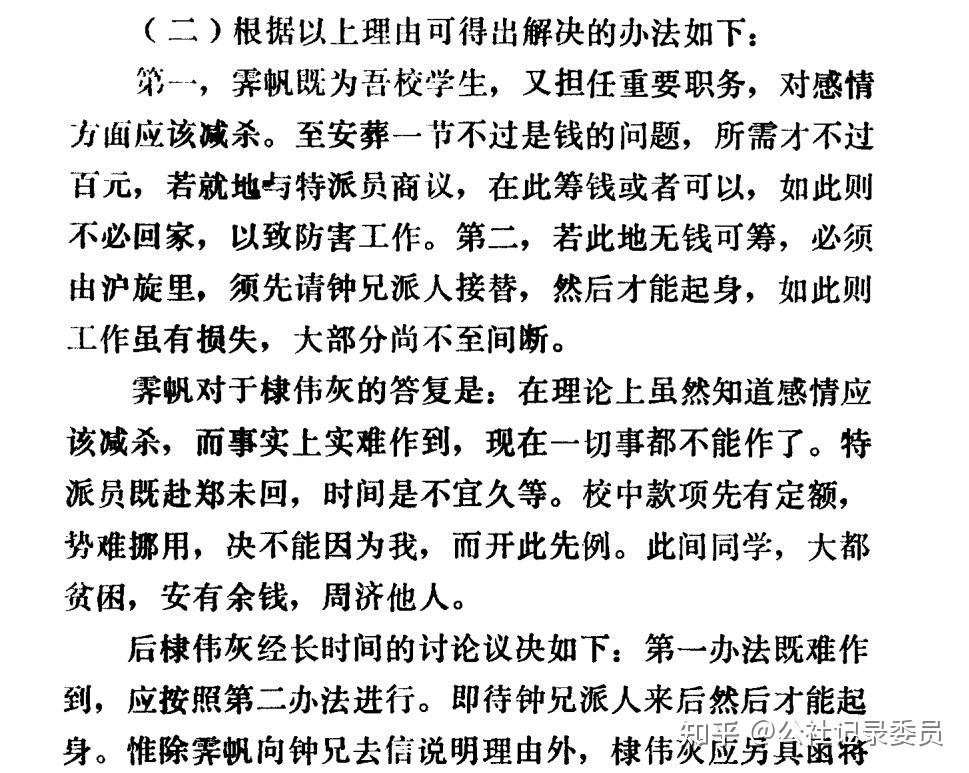<figcaption>（9月13日）团开封地委给钟兄信—霁帆回川料理母亲丧事的请示</figcaption></figure>
革命还要你见死不救，那些被反动派抓住受辱的同志就在你面前，见你即流泪<b>，你也想杀人救人“™的，天杀的反动派居然敢侮辱我的同志”，可你还得向她摇手，让她把头低下</b>
<blockquote data-pid="y_xb1wNJ"><b>我在寿县时，遇见储三姑娘（乡农常委）卖在圩子里面，在圩沟洗菜，见我即流泪，后一个同志向他摇手，他才把头低下。到甸集（寿县）时见有四个妇女是赤区的，在该处拍卖，每人要价洋四百元，该妇女等还反抗，并说以死了之。</b></blockquote><figure data-size="normal">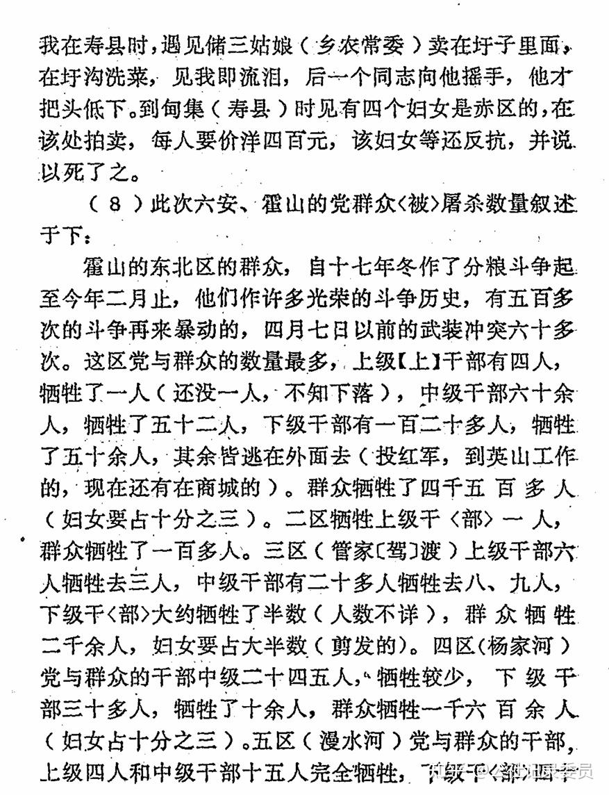<figcaption>舒传贤关于六安中心县委工作情况给中央的报告*（一九三○年十二月十日）①</figcaption></figure>
革命会让你变成一个后世难以理解的疯子，<b>肃反冤死有什么不对的？你跑才不对嘛！冤死也是应该的，谁叫你来革命了？</b>
<figure data-size="normal">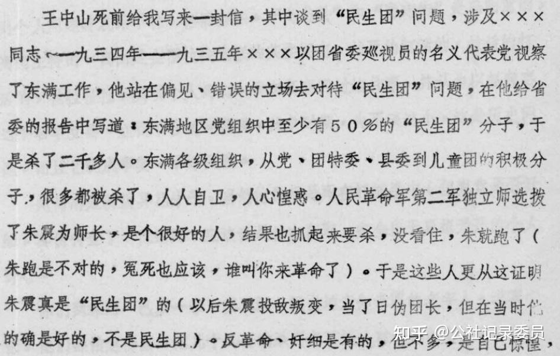<figcaption>《访问周保中同志记录（一九六○年五月三十日）——关于东北党组织的路线问题，民生团问题和赵尚志问题》载于《中共东北地方党史资料访问录选编 周保中同志专辑》</figcaption></figure>

可即便这般疯魔，那为何还会有革命？

因为革命者的教唆？那这革命者又从何而来？

<b>可以是天上坠下的灾星，可以是地里开出的恶种，但唯独不能是被阶级压迫的人？是不是这个意思？</b>

<b>当代人靠血海论指责中俄革命的抽象程度类似于，在被源源不断运输了一堆易燃易爆物的仓库里，存储者点上一根烟，然后眼含热泪的说“这些东西炸起来多可怕啊。”</b>

<b>那你为什么要往里面送那么多易燃易爆物？因为爽吗？</b>

<b>确实，反动派被屠杀的时候总是觉得自己是人，屠杀多么可怕，但他们屠杀的时候，可就爽多了，从来没把人当人看。</b>

洛水以南，土匪边〔遍〕地，不能入其境。本年旧历三月，张治公曾对农民作一次大屠杀，人民房屋被烧去过半，死者不下数万。西至新安，南至龙门，东至偃师，北至水口（距洛三十里），西南至宜阳（距洛七十里），纵横数县之内，悉遭浩劫（张当时屠杀民众，调有师之众），因此人民普边〔遍〕的受感：（1）无房屋住；（2）无牲口用（大部被张杀死了）的痛苦。

人民去年粮食早就吃完了（大部分系被张治公刮去），本年所收的麦绝不够吃，将来难免有没有粮的恐慌，同时秋粮又因天早之故，未得种上（昨今两天才得雨，但已晚矣！ ），将来实要成为很严重的问题。

冯军现在正向民间要麦应完粮〔银〕一两，须交麦……斗用流通〔券〕逼老百姓卖麦，并要鞋、要料、要草等，地丁完纳至十九年，人民所负之苛税，杂捐，不但〔未〕免除丝毫，且反变本加利〔厉〕，至征兵正在雷火风行的办理
<figure data-size="normal">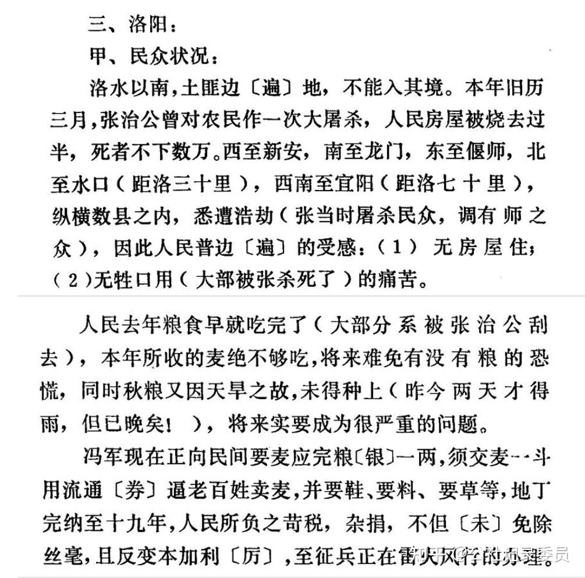<figcaption>刘明佛对豫西工作视察报告—关于郑州、洛阳、渑池、陕州的工农运动及政治状况＊（一九二七年七月十五日）①一、政治状况：</figcaption></figure>
冯对农民之屠杀与欺骗。冯玉祥知道河南的统治，最难的问题，便是枪会群众的反抗。他对于枪会的办法，当然是老军阀所袭用的“恩威并进，剿抚兼施”一贯的政策。不过他更做得毒辣些。河北枪会的反抗，他是无情的屠杀。彰德白枪会曾击退吉鸿昌，占领彰德，吉鸿昌凡遇枪会农民群众则用机关枪扫射。个人则枭首示众。在卫辉纱厂，以杀白枪会为名—有几个白枪会在厂内，竟冤枉屠杀纱工三百五十余名。在河北屠杀的枪会，盈千累万，不可以数计。河南洛阳的农〔民〕反抗捐税，立即派大兵韩复榘下乡痛剿，杀人、放火焚村，军队所过之处，都成焦土。他是采用最严厉的手段来镇压农民的。
<figure data-size="normal">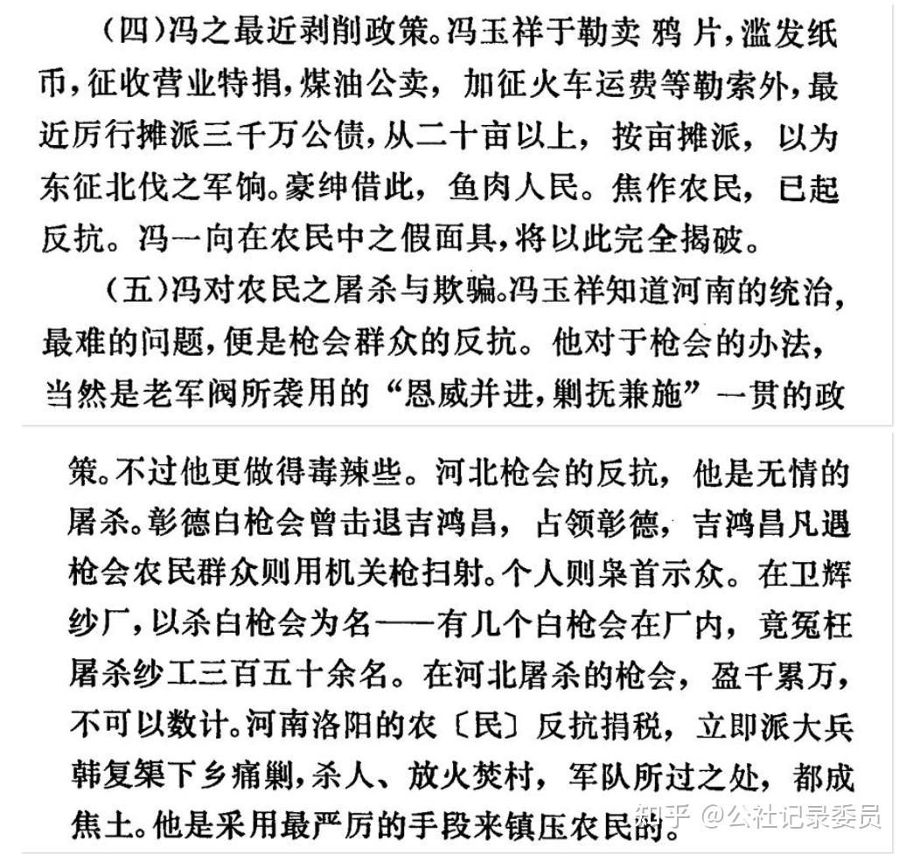<figcaption>河南省委给中央的报告—关于形势、工农运动及党组织状况＊（一九二七年十一月二十四日）</figcaption></figure>
2、吉部开至卫辉：卫辉纱厂中多彰德人，吉部以彰德人均与白枪会有关，同时接到冯玉祥扑灭枪会命令，遂于八月二十五日上午九时以三列车军队开至卫辉包围纱厂，夜工尚在梦中，手枪队、大刀队即闯入工房，见人便捉，捉住便杀，厂内死尸横陈，鲜血迸流，除在厂内车站杀戮者不计，又捆载三百工人乘车分赴南北各站，沿途杀戮，悬首于路旁电杆上，以向枪会示威，尸身遍地，无人敢收理。
<figure data-size="normal">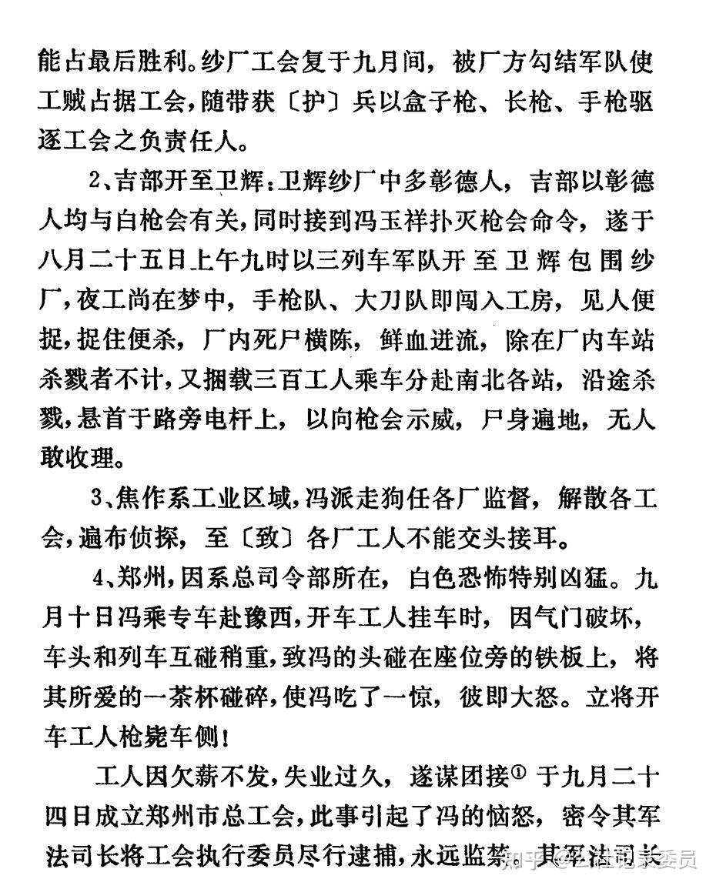</figure>
1、河北的天门会本是贫苦农民的组织，根本上是反抗富豪土劣的。原先也曾经抵抗过奉军欢迎冯玉祥。冯到豫变成了富豪土劣的代表，故天门会即与冯立于反对的地位，七、八月间冯与天门会开仗，农民自然抵不过有枪的军队，结果冯玉祥屠杀了天门会的贫苦农民在三千以上。冯军至天门会区域即纵火焚烧，鸡犬不留。

2、白枪会在河北曾与梁寿游击队合谋反冯，被冯侦去，派吉鸿昌部队剿灭，曾在彰德与红枪会正式开火，白枪会因无枪弹被军队打死无数。

3、八月二十五日吉部屠杀工人后，在离卫辉以北二十五里之尚庄，有正在耕地的农〔民〕十余人，同时有红枪会十余人赴戏场祭神，吉在车中命令开枪，结果死农民二十余人。

4、焦作农民因土豪劣绅压迫，起而反抗，冯的走狗县长保安队去帮助土豪劣绅逮捕农民领袖多人，此系十一月间事。

5、洛阳农民苛税特重，时因不能担负捐税或稍有反抗者，即被捕入狱，洛阳狱中五百余农民，均系不能担负或抗粮而坐罪者，十月间阎日仁、张沿农等与枪会勾结谋起而反抗，被冯派韩复榘军队剿灭。韩军至不分皂白，凡阎、张与红枪会驻过之地，即纵火焚烧。洛阳城南现在之自由县区域二十五村，被韩军杀戮，男女老幼，无一存者，其状之残〔惨〕，今古未闻。

6、豫南之息县驻军为任应歧部，农民因不堪其压迫，在七、八月间组织八树会迷信团体，不用器械而徒手与军队搏战，任应歧愤怒下令剿杀，息县城周围八十里以内之农民，惨遭屠戮，结果老幼农民死者在三万以上，河南统治阶级对此惨剧未发一言。现息县各乡的有数十里无人烟之区域，荒草遍野，白骨垒垒。

7、汝南冯军与土匪撕杀，出城二里以外，周围百里，村屋为墟，荒草盛茂，渺无人踪。

8、叶县城曾被靳云鹗部下李振亚勾结土匪占据，靳李失败，冯以肃清靳、李残部为名，攻打县城，破城后杀戮城中农民无数。

9、禹县城曾被李振亚部占据，城破后惨杀农民，其情形与叶县同。

10、此外南阳及其他各县，冯常以肃清土匪为名，惨杀农民，动辄十里：此种情形几乎无日无之，无县无之，在河南成了一种普通惯见的事情，统治阶级也好象视为当然的了。

11、剿杀土匪枪会之外，冯最近以其部队战争死伤过大。（总数在三万以上，非嫡系尚不在内，冯对伤兵常以无药医治听其痛死，甚至活埋）强迫征兵，勤派门头，农家每家出一壮丁给冯玉祥当炮灰，农民怨恨异常，甚至有上吊死者，普通多以钱（或百元或数十元）购买失业破产贫农，送去作兵，冯马上即开赴前线，而之中常至无一生还者。
<figure data-size="normal">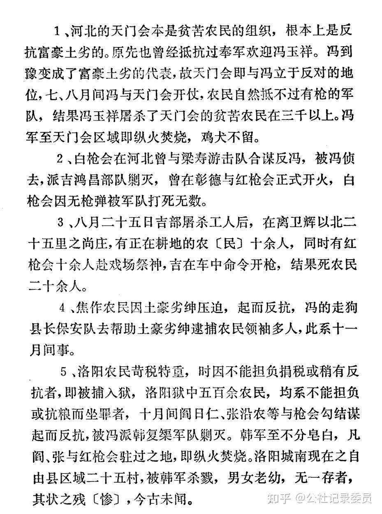</figure>
（3）<b>在革命中心区域舒家庙、团墩、三尖铺、匡黄冲、霍〔郝]家集、白衣庵、清〔新]店河、西河口、大化坪、千笠寺、漫水河、长善[山]冲、独山、闻家店、燕子河、七林[邻]湾、金家寨等，都没有男女老幼。男女三分被他们杀了，十分之三逃的逃，投红军的也有。</b>

（4）<b>霍山东北区、六安三区十几里路，没有人烟，十家只有三家有人，就是有人亦不全了。东北区在四月该区区委报告，有五百家绝户。三区（六安）在六月据区委报告，有一百家绝户。反动统治阶级屠杀，论批的拉去杀，砍头、腰斩、活挖心，每天平均各局子都有五六十尸狼藉，听狗吃，不准收尸，如要收尸，另外要给大洋三四十元或七八十元不等。各区剪头妇女未活一人。少先队、劳动童子团他们用钢锥通死，高举示威[众]。若捕获较比[美]貌的妇女，是负革命要职的，先由小反共首领弄去轮奸，然后施之死刑。我闻有一个妇女不给他们奸，咬他们的手面，他们把她[即把她】一块块儿的割死。</b>.

（5）凡被捕获的革命者（苏维埃负责者或赤卫队长），<b>特别用极残酷的刑法，先行拷打，用钉钉[指]心，强迫他哄[供]机关和人以及一切组织情形，后用腰斩、挖心、活割死，惨酷之状无已〔以]复加，凡革命家属均被杀完了。</b>

（6）<b>赤区的祠堂庙宇以及群众的住所被烧尽了，鸡、牛、猪、羊以及稻子都被挑完了。</b>

（7）<b>在赤区掳的妇女，在十岁以上、十四岁以下均被拉走，最美的都由白军（潘善斋）和自卫队长官们弄去作妻妾，或由他们运往别处送朋友（豪绅、地主、流氓），或运往别处（寿县、颍上、合肥、霍邱、罗田）论打的拍卖，余下来的留作共用（即是轮奸），后再拍卖；次等妇女即士兵留去作老婆，每人身价大洋约二百四十元。十一、二岁的小姑娘，即运往蚌埠、正阳、合肥等卖给妓院做妓女。十三、四岁小姑娘奸死者颇多。</b>

<b>我在寿县时，遇见储三姑娘（乡农常委）卖在圩子里面，在圩沟洗菜，见我即流泪，后一个同志向他摇手，他才把头低下。到甸集（寿县）时见有四个妇女是赤区的，在该处拍卖，每人要价洋四百元，该妇女等还反抗，并说以死了之。</b>

（8）此次六安、霍山的党群众&lt;被&gt;屠杀数量叙述于下：

霍山的东北区的群众，自十七年冬作了分粮斗争起至今年二月止，他们作许多光荣的斗争历史，有五百多次的斗争再来暴动的，四月七日以前的武装冲突六十多次。<b>这区党与群众的数量最多，上级【上】干部有四人，牺牲了一人（还没一人，不知下落），中级干部六十余人，牺牲了五十二人，下级干部有一百二十多人，牺牲了五十余人，其余皆逃在外面去（投红军，到英山工作的，现在还有在商城的）。群众牺牲了四千五百多人（妇女要占十分之三）。二区牺牲上级干&lt;部&gt;一人，群众牺牲了一百多人。三区（管家[驾]渡）上级干部六人牺牲去三人，中级干部有二十多人牺牲去八、九人，下级干&lt;部&gt;大约牺牲了半数（人数不详），群众牺牲二千余人，妇女要占大半数（剪发的）。四区（杨家河）党与群众的干部中级二十四五人，“牺牲较少，下级干部三十多人，牺牲了十余人，群众牺牲一千六百余人（妇女占十分之三）。五区（漫水河）党与群众的干部，上级四人和中级干部十五人完全牺牲，下级干&lt;部&gt;四十余人，牺牲了半数，群众牺牲了二千有余。六区（闻家店）党与群众的上级干部七人，牺牲了三人，下余的四人，现在一师工作，中级干部七十余人，下级干部九十余人，均皆牺牲了，群众牺牲了二千七百零。七区（黑石渡）党与群众的上级&lt;干部&gt;四人完全牺牲了，中级干部二十余人，牺牲了六、七人，下级干部三十余人，牺牲了八人，群众牺牲七百人。该区妇女被掳去拍卖的要[有]四百余人（因该&lt;区&gt;妇女甚漂亮）。三区妇女被掳去一百余人，一区妇女被掳去九十余人，六区妇女被掳去三百余（内有六安三区和霍山东北区来被难的妇女），由罗田团匪掳去的。</b>

<b>「六安三区的群众自十七年秋作砍柴的斗争，一直到去年十月独山暴动失败后，即牺牲了群众五百余人。自今年三月红军三十二师和三十三师占领麻埠、独山后，他们组织起来，红军给他们长枪十三支，和他们的赤卫队二百余人编为游击队，实行在该&lt;区&gt;作骚动的工作，扰乱敌人的后方，对于赤区帮助颇大，至八月他因粮食的断绝才坍台。该区党与群众的上级干部九人牺牲了三人，中级干部三十余人，牺牲了十余人，下级干部百余人牺牲尽，该区群众牺牲了二千七百余人。四区（南岳庙）与三区毗连，群众也都起来，曾与统治阶级武装冲突了数次，群众牺牲四、五百人。六区（金家寨）党与群众的干部大都退到商城去了，未跑的群众牺牲了二千五百余人。七区（麻埠）党与群众的干部不到十四人，该区坍台即退至六区，现亦退到商城去了，群众牺牲了二百余人，该区妇女被掳四百左右。三区妇女被掳去三百余人，六区被掳去的妇女约百余人。</b>
<figure data-size="normal">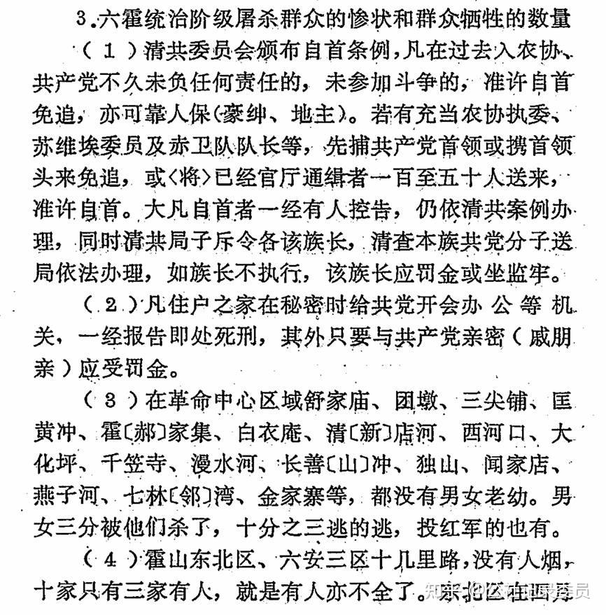<figcaption>舒传贤关于六安中心县委工作情况给中央的报告*（一九三○年十二月十日）①</figcaption></figure><figure data-size="normal">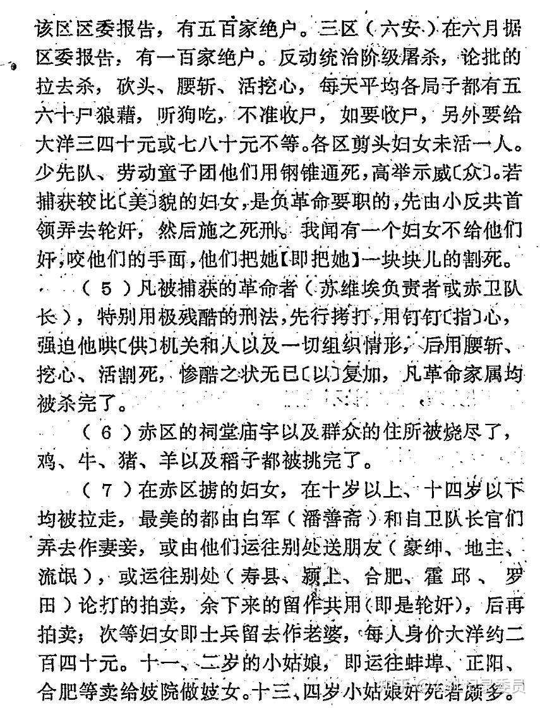<figcaption>舒传贤关于六安中心县委工作情况给中央的报告*（一九三○年十二月十日）①</figcaption></figure><figure data-size="normal">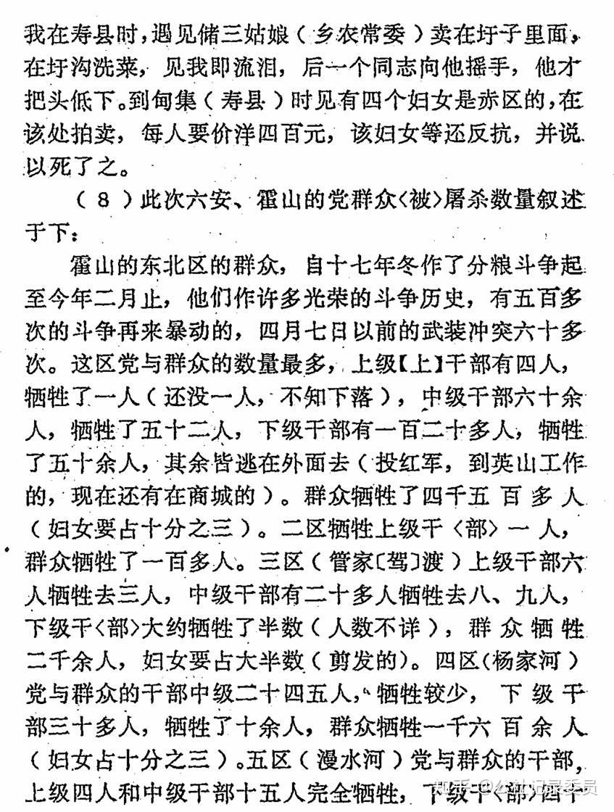<figcaption>舒传贤关于六安中心县委工作情况给中央的报告*（一九三○年十二月十日）①</figcaption></figure><figure data-size="normal">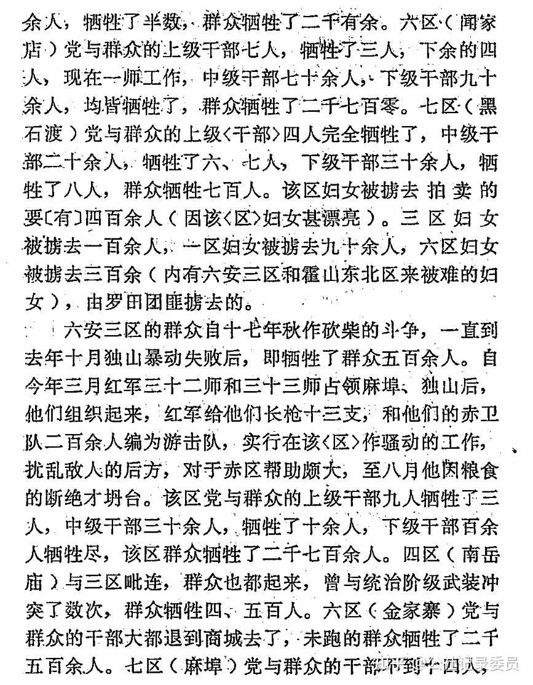<figcaption>舒传贤关于六安中心县委工作情况给中央的报告*（一九三○年十二月十日）①</figcaption></figure>
这就是革命所要泅渡的血海，是腥臭的，污秽的，由无数该死、枉死和赴死者的血所累积起的血海。

徐志摩说，“<b>他们相信天堂是有的，可以实现的，但在现世界与那天堂的中间隔着一座海，一座血污海，人类泅得过这血海，才能登彼岸，他们决定先实现那血海。</b>”我说，徐志摩说的好！<b>革命不就是和反动派厮杀出的血海吗？美丽的新世界，反动派会主动给最广大人民群众创造出来吗？</b>

但中国革命与革命共和的领袖子任先生说得更好！
<blockquote data-pid="ThbyxyVp">……<b>中国是中国人民的，不是反动派的。</b>中国古代有个寓言，叫做“愚公移山”。说的是古代有一位老人，住在华北，名叫北山愚公。他的家门南面有两座大山挡住他家的出路，一座叫做太行山，一座叫做王屋山。愚公下决心率领他的儿子们要用锄头挖去这两座大山。有个老头子名叫智叟的看了发笑，说是你们这样干未免太愚蠢了，你们父子数人要挖掉这样两座大山是完全不可能的。愚公回答说：我死了以后有我的儿子，儿子死了，又有孙子，子子孙孙是没有穷尽的。这两座山虽然很高，却是不会再增高了，挖一点就会少一点，为什么挖不平呢？愚公批驳了智叟的错误思想，毫不动摇，每天挖山不止。这件事感动了上帝，他就派了两个神仙下凡，把两座山背走了  。现在也有两座压在中国人民头上的大山，一座叫做帝国主义，一座叫做封建主义。<b>中国共产党早就下了决心，要挖掉这两座山。我们一定要坚持下去，一定要不断地工作，我们也会感动上帝的。这个上帝不是别人，就是全中国的人民大众。</b>——《愚公移山》 ……<b>人总是要死的，但死的意义有不同。</b>中国古时候有个文学家叫做司马迁的说过：“人固有一死，或重于泰山，或轻于鸿毛。” <b>为人民利益而死，就比泰山还重；替法西斯卖力，替剥削人民和压迫人民的人去死，就比鸿毛还轻。张思德同志是为人民利益而死的，他的死是比泰山还要重的。</b>——《为人民服务》 ……<b>我们死去的若干万数的党员，若干千数的干部和几十个最好的领袖遗留给我们的精神，也就是这些东西。我们无疑地应该学习这些东西，把自己改造得更好一些，把自己提高到更高的革命水平。</b>——《为争取千百万群众进入抗日民族统一战线而斗争》</blockquote>
<b>美丽的新世界是可以实现的，是工人阶级的，不是反动派的，但不是要革命者作人类泅渡这血海的决定人，而是要革命者俯下身子作牛马，“我们一定要坚持下去，一定要不断地工作，我们也会感动上帝的。”这个上帝不是别人，就是受压迫的无产阶级。</b>

<b>要感动受压迫的无产阶级，革命为之努力的新世界就是可能的，这需要革命者前赴后继的牺牲，要革命者把自己也投进这无边无涯的血海之中。是，死了就死了，但“人总是要死的，但死的意义有不同，为人民利益而死，就比泰山还重；替法西斯卖力，替剥削人民和压迫人民的人去死，就比鸿毛还轻。”</b>

<b>只是，革命亦不是自我感动就能胜利，就能泅渡这片血海，我们应当从死者身上汲取经验与精神，改造自己，提高自己“我们死去的若干万数的党员，若干千数的干部和几十个最好的领袖遗留给我们的精神，也就是这些东西。我们无疑地应该学习这些东西，把自己改造得更好一些，把自己提高到更高的革命水平。”</b>

---
导出时间: 2026-08-23 19:07