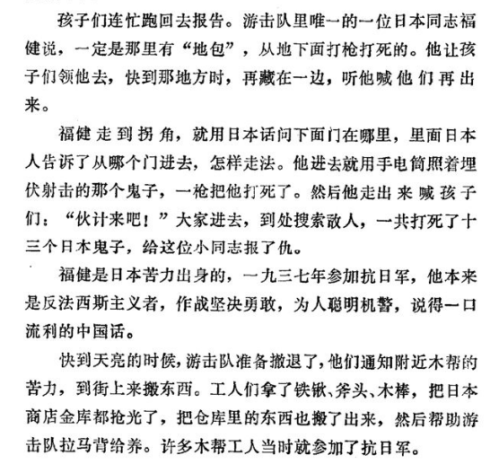
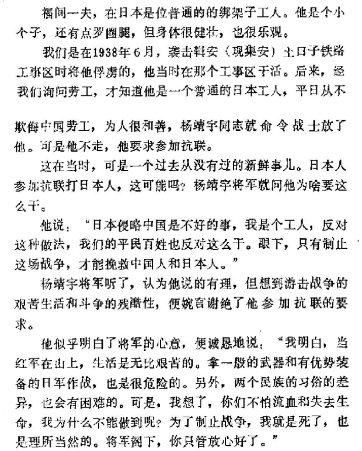
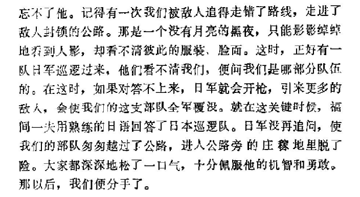
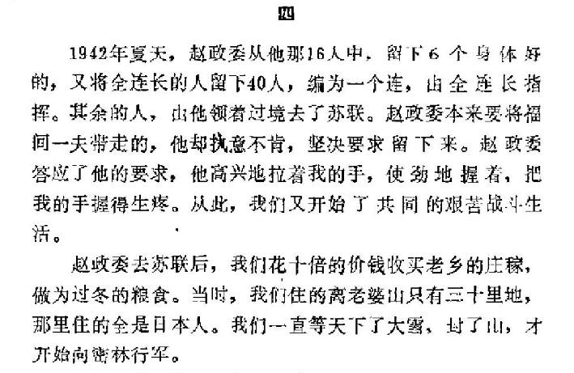
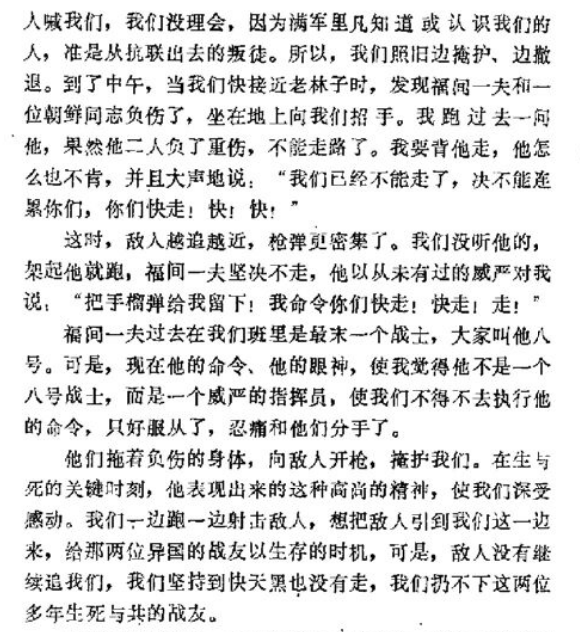
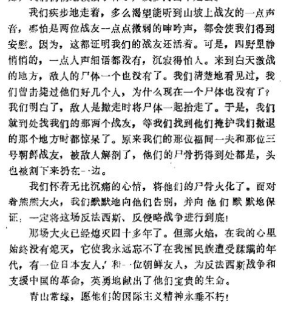

# 东北抗联是否知道在中国东北日本左翼？

| 项目 | 内容 |
|---|---|
| 类型 | answer |
| 作者 | 无为上单 |
| 收藏时间 | 2025-03-14 19:01 |
| 发布时间 | - |
| 收藏夹 | 抗联 |
| 原链接 | https://www.zhihu.com/question/12728931846/answer/124412194783 |

## 摘要

大家都知道，在当年的朝鲜战场上美军一方出了个华裔美军吕超然，他出名是因为在战场上大喊“我是中国人，别开枪”，迷惑了志愿军战士，为美军一方争得了战机、击退了志愿军的攻击。而在当年的东北敌后游击战场上，其实也有一位以“母国语言”骗取“同胞”信任、帮助“异民族”军队杀伤“同胞”的“吕超然”，只不过这是一位自愿参与抗日的日本工人。 周保中文选里收录有一份周口述的《杨靖宇和他的队伍》中的第八节“日本同志福…

## 正文

大家都知道，在当年的朝鲜战场上美军一方出了个华裔美军吕超然，他出名是因为在战场上大喊“我是中国人，别开枪”，迷惑了志愿军战士，为美军一方争得了战机、击退了志愿军的攻击。而在当年的东北敌后游击战场上，其实也有一位以“母国语言”骗取“同胞”信任、帮助“异民族”军队杀伤“同胞”的“吕超然”，只不过这是一位自愿参与抗日的日本工人。

周保中文选里收录有一份周口述的《杨靖宇和他的队伍》中的第八节“日本同志福健”，就专门提到了抗联队伍里的这位叫做“福健”的日本战士。据周保中所说，这位1937年被俘后即坚决随杨靖宇抗日的“福健”，称得上“背叛了祖国的个人”：在某次战斗里，抗联铁血少年队遭遇日人的偷袭，一人当场身亡，队员急忙回去找到福健。福健立刻察觉这是碰到了“地保”。

于是作为一个地道的日本人，福健伪装为日侨，“<b>走到拐角，就用日本话问下面门在哪里，里面日本人告诉了从哪个门进去，怎样走法</b>”，福健确认信息后便一枪打死了为自己开门的日人，接着呼唤少年队队员们进入地堡，“<b>大家进去，到处搜索敌人，一共打死了十三个日本鬼子，给这位小同志报了仇</b>。”

这位用自己的日本身份诱杀日军、帮助抗联打死了一整个地堡日兵的“日奸”，要是用今天的网络话语说，该是“大义灭倭，是真左”了。
<figure data-size="normal"><figcaption>《周保中文选》191页</figcaption></figure>
那么，这位“一九三七年参加抗日军”的“日本法西斯主义者”、帮助抗联消灭日本侵略者的“日本真左”究竟是谁？“福健”肯定不是他的全名，但结合起来“苦力出身”、与铁血少年队在一起的特征，我们能确认“福健”应当就是“福间一夫”。

关于福间一夫的更多事迹，我们可以看当年就在一路军战斗的沈凤山的回忆，在《忆福间一夫》里，沈凤山回忆福间是在1938年6月的辑安战斗中被抗联俘虏。杨靖宇当时得知福间“是一个普通的日本工人，平日从不欺侮中国劳工，为人很和善”后，就准备将他放走，但很快就发生了“<b>一个从没有过的新鲜事儿</b>”：这个日本人竟主动要求参加抗联。

“日本人参加抗联打日本人，这可能吗?杨靖宇将军就问他为啥要这么干”，福间则拿出了一个“国际主义左翼”的自觉，同杨靖宇讲：“日本侵略中国是不好的事，我是个工人，反对这种做法，我们的平民百姓也反对这么于。眼下，只有制止这场战争，才能挽救中国人和日本人。”

在福间一夫的恳求下，杨靖宇最终同意了这位日本工人参加抗联的请求，抗联便多了一位日本战士。

将沈凤山的回忆与周保中、李延禄二人的回忆结合起来，我们似乎也能看到，福间一夫的事迹在抗联当中，较之伊田助男更加出名——<b>抗联四军首长回忆的伊田助男事迹发生在1933年，但到五年后的1938年，抗联一军中间对于“日本左翼支援抗战”的事迹像是还是“从没有”听说过的状态。</b>
<figure data-size="normal"><figcaption>《忆福间一夫》载于《吉林文史资料》第23辑</figcaption></figure>
此后一段时间，福间一夫与沈凤山，及另一位朝鲜族战士“小赵”配对为“三人组”，三人之间互相学习对方语言，多年以后接受抗联史研究者刘贤女士采访时，沈老就讲到：“日本人福间一夫参加抗联，排为八号战士，大伙叫他‘老八号’。韩政委(韩仁和)把‘老八号’分到我和小赵这个对子里来，我们这个学习对子就由‘一对红’变成‘三人组’了。韩政委特别指示我，必须尽快让‘老八号’听懂中国话，可以说不明白，起码达到我们三个人之间听得懂”——福间一夫“一口流利的中国话”，大概也是这时候同沈凤山学的。

再回到沈凤山将军的回忆当中，我们也能看到另一桩福间一夫利用“母语优势”帮助抗联的事迹。

在1938年秋的北上转移途中，沈凤山等人“被敌人追得走错了路线，走进了敌人封锁的公路”，在黑夜当中撞上了一支日军巡逻队，“他们看不清我们，便问我们是哪部分队伍的。在这时，如果对答不上来，日军就会开枪，引来更多的敌人，会使我们这支部队全军覆没。”

所幸福间一夫此时就与沈凤山在一起，他“用熟练的日语回答了日本巡逻队”，成功骗过了日军，让抗联队伍成功脱险。之后，沈被调到二军四师三团做警卫员，同福间分别。
<figure data-size="normal"></figure>
沈凤山再一次见到福间一夫是1941年10月，当时沈凤山所在的队伍屡遭打击，只剩16人，不得已前往东宁，在那里他与福间重逢。

“这时的福间一夫，虽然精神头仍很足，但艰苦的生活，使他比过去瘦多了，脸也变得粗精发黑。我心里很不好受，知道他一定吃了不少苦。可是在他眼里，依然充满革命乐观主义精神，熠熠闪光。我从他的眼里，又一次受到极大的鼓舞。”

这相逢的喜悦也不止一次，1942年夏，沈凤山追随的“赵政委”准备北上苏联，本来计划将福间一夫也一并带走，但是福间一夫坚持留在东北继续抗日，赵政委同意了他的要求后，<b>福间“高兴地拉着我的手，使劲地握着，把我的手握得生疼</b>”——革命战友情谊之深可见一斑。
<figure data-size="normal"></figure>
但就像许多抗联人的故事一样，福间一夫与沈凤山的战友情最终也以悲剧收场。1942年，沈、福等人随队躲入原始森林，着破衣、食生谷，福间一夫在艰苦卓绝的游击斗争里只能以麻袋做衣，又因长期断食肠胃虚弱，吃了生粳穗后“干燥得拉不出屎来，他就自己用手抠，结果把直肠抠感染了……打进林场后，他又饱吃了一顿大饼子，排不出大便，肚子胀不说，而且直肠感染得疼痛难忍，使他走起路来更困难。”

“这一些情况，他一点儿也没对人讲,作战时他冲在前头，背东西时，又抢着背了不少，使他在往山上跑时，步步艰难。同志们知道后，纷纷要替他背身上的东西。起极他怎么也不答应，后来经过李医生和我们再三动员，他才勉强同意了……他不愿拖累大家。为了加快速度，紧紧地咬着牙，往前走着。有好几次，身子都打晃了，下嘴唇也咬出血来，仍坚持着前进。大家看在眼里，无不佩服他的坚强毅力和苦战精神。”

也正是这一伤势，让福间一夫最后没能脱出重围，在搬完缴获品上山后，沈凤山一行遭到日伪讨伐队的追击，临近躲入深林时，福间与另一位朝鲜同志重伤不能行走。沈本想背上与他情谊深厚的福间一夫，然而福间坚决不做战友的拖累，自己与朝鲜同志留下掩护。
<figure data-size="normal"></figure>
追击与反追击持续到黑夜，在夜晚时分，日伪军警不见了踪迹，沈凤山一行小心翼翼的回到白天战斗发生地，抱着希望试图寻回战友。

可现实是无情的，“我们就到处找我们的那两个战友，等我们找到他们掩护我们撒退的那个地方时都惊呆了。原来我们的那位福间一夫和那位三号朝鲜战友，被敌人解剖了，他们的尸骨扔得到处都是，头也被割下来扔在一边。”

抗联里有记载的唯一一位日本战士，就这样死在了黑龙江的原始森林之中，身首分离，尸骨裂解。他的战友们为他做了火葬的仪式，看着他尸骸燃起的火焰，默默向他告别，默默向他们保证这场游击战争会进行到彻底胜利的那一天。
<figure data-size="normal"></figure>

---
导出时间: 2026-08-23 19:07