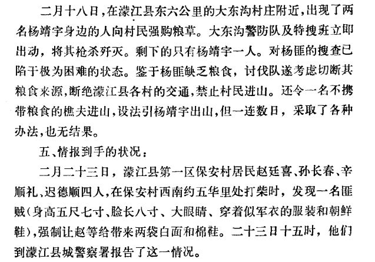
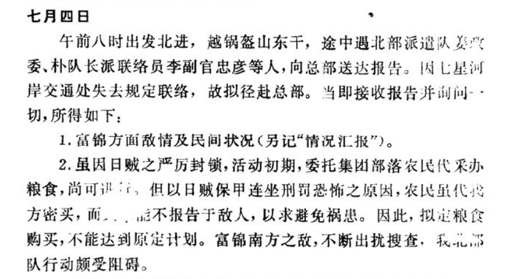
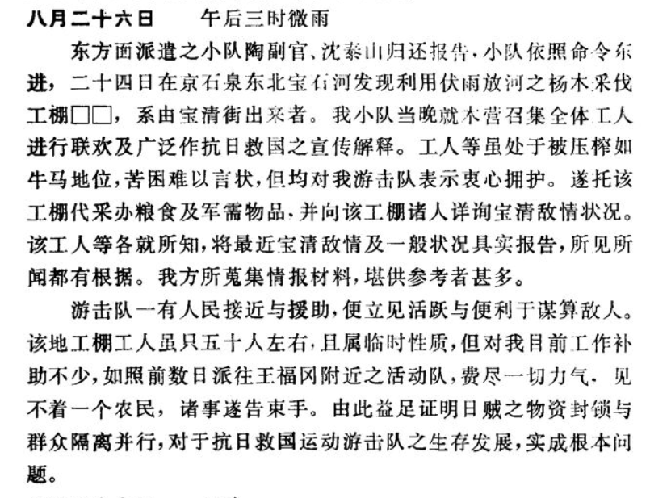
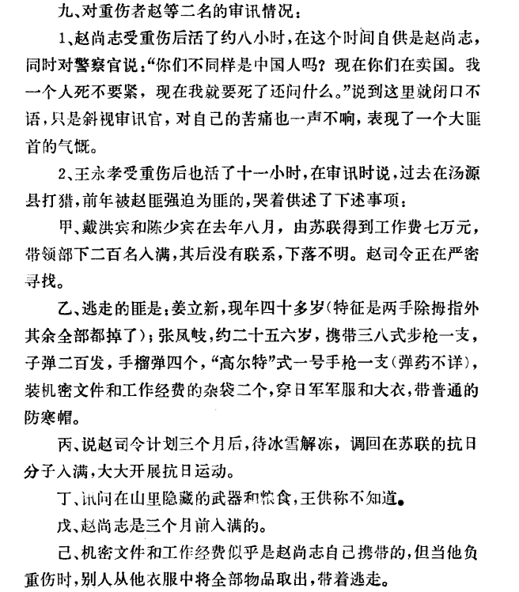

# 85 年前杨靖宇「我们中国人都投降了，还有中国吗？」，这种精神你怎么看？

| 项目 | 内容 |
|---|---|
| 类型 | answer |
| 作者 | 无为上单 |
| 收藏时间 | 2025-03-09 16:29 |
| 发布时间 | - |
| 收藏夹 | 抗联 |
| 原链接 | https://www.zhihu.com/question/13220296873/answer/120194501482 |

## 摘要

杨靖宇最后时刻说的这句话，我想除了表达“不投降”的意志以外，可能还有对东北抗战大局的哀叹：经过日伪数年的“治本工作”，东北民众基本已与抗日武装隔绝，纵有接触，民众也大都不愿支持抗日，甚至有出卖抗日武装者。 不提“为了母亲反革命”的杨靖宇副手程斌，如果不是当年“伪化”了的农民报告杨靖宇的行踪，杨靖宇将军或许也不会死在1940年的2月（尽管很大可能还是牺牲） 今日谈及“农民出卖杨靖宇”，说是“打柴的村民在…

## 正文

杨靖宇最后时刻说的这句话，我想除了表达“不投降”的意志以外，可能还有对东北抗战大局的哀叹：经过日伪数年的“治本工作”，东北民众基本已与抗日武装隔绝，纵有接触，民众也大都不愿支持抗日，甚至有出卖抗日武装者。

不提“为了母亲反革命”的杨靖宇副手程斌，如果不是当年“伪化”了的农民报告杨靖宇的行踪，杨靖宇将军或许也不会死在1940年的2月（尽管很大可能还是牺牲）

今日谈及“农民出卖杨靖宇”，说是“打柴的村民在回村途中遇到日本特务，将杨靖宇的情况一五一十地说了出来”，这其实是当年日伪官办杂志《协和杂志》里的说法。在实际的日伪档案里，“濛江县第一区保安村居民赵廷喜、孙长春、辛顺礼、迟德顺四人”并非是遇到了日本特务才“被迫”说出杨靖宇下落，而是自己到濛江县伪警署报告杨靖宇行踪的。

“我们中国人都投降了，还有中国吗？”此语在今日提起，确实感人。然而在杨靖宇将军牺牲时却像是一个讽刺——他刚与同胞讲完不能投降的话，我们的同胞却转头出卖了我们民族的英雄，此诚杨靖宇将军之死中最令人痛心之点。
<figure data-size="normal"><figcaption>《通化省警务厅关于枪杀杨靖宇经过情况的报告》1940年3月6日 载于《日本帝国主义侵华档案资料选编 东北大讨伐》</figcaption></figure>
一般民众何以“不抗日”？自然不是因为真的要做日贼走狗，而是日寇“治本方案”执行严厉，不仅对农村百姓大行烧杀恐怖，集团部落监视之严更到了“抗日游击队所依此等作业人民，几乎绝迹。农村人民被禁锢于集团部落，受行动监视”（周保中日记语）的地步。

1940年7月的日记中，周保中这位抗联领袖人物就在行动里大感日伪压迫之严密，“活动初期，委托集团部落农民代采办粮食，尚可进行，但以日贼保甲连坐刑罚恐怖之原因，农民虽代我方密买，而xx能不报告于敌人，以求避免祸患”。
<figure data-size="normal"><figcaption>《东北抗日游击日记》471页</figcaption></figure>
然而周保中又可称是幸运的，他在1940年遇到的伐木工人、河边渔民对他所率队伍毫无出卖，不仅积极代为采买物资、提供食物，还“各就所知，将最近宝清敌情及一般状况具实报告”、“对我目前工作补助不少”。

“工人等虽处于被压榨如牛马地位,苦困难以言状,但均对我游击队表示衷心拥护。遂托该工棚代采办粮食及军需物品，并向该工棚诸人详询宝清敌情状况。该工人等各就所知,将最近宝清敌情及一般状况具实报告，所见所闻都有根据。我方所蒐集情报材料,堪供参考者甚多。”

1935年末关东军编制治安肃正方案时，曾将三千万东北人视作三千万精神“匪贼”——即三千万东北人均在精神上有反日抗日之观念，此种思想会因烧杀扫荡的压制不能表达，但到底仍存心中。
<figure data-size="normal"><figcaption>《东北抗日游击日记》493页</figcaption></figure>
而要再说不幸者，那便就是与南满杨靖宇齐名的北满赵尚志，他虽未受百姓出卖，却是遭了内奸叛徒的黑枪。

1942年2月，伪三江省警察关于射杀赵尚志的报告中就提到了赵尚志“受审”时的表现：重伤濒死的赵只承认自己就是名扬东北的赵尚志，除此之外，他只有一句对汉奸的质问，“<b>你们不同样是中国人吗?现在你们在卖国。我一个人死不要紧，现在我就要死了还问什么。</b>”

赵尚志自1931年起即起兵抗日，历经11年白山黑水苦斗，同日伪军战斗不知多少场，没有让日贼倭寇杀死，而今却受汉奸特务重创、为汉奸伪警所擒。面对审问他的伪警，赵尚志心中怕也是哀怒交加，怒于同为中国人，对方却为虎作伥；哀于同为中国人，对方却卖国求荣。

“我一个人死不要紧”，下一句是什么？是不是同杨靖宇一样，也是“我一个人死不要紧，中国人都卖国了怎么办？”

赵尚志没有说完这句话，只像是失望至极，讲了一句“现在我就要死了还问什么”后，便不再讲话，忍着痛苦一声不吭直至死亡，连伪警也要在报告中承认赵尚志有“大匪首的气概”。“（赵尚志）只是斜视审讯官，对自己的苦痛也一声不响，表现了一个大匪首的气概。”

与赵尚志形成鲜明对比的便是与他一同被俘的王永孝，王此时同样重伤，他是被日伪军警打伤的，这时在伪警面前却是毫无气节可言，不仅“哭着供述”，还说自己是“被赵匪强迫为匪的”。

死到临头，王永孝这个追随了赵尚志一年的抗联战士，倒是跟携苏联抗日经费回国后隐姓埋名的戴鸿宾一样，做了实际上的亡国奴了。同胞为虎作伥，战友放弃抵抗，赵尚志将军之悲哀也诚在此。
<figure data-size="normal"><figcaption>《三江省警务厅关于射杀前东北抗日联军总指挥赵尚志的情况报告》1942年2月19日 载于《日本帝国主义侵华档案资料选编 东北大讨伐》</figcaption></figure>

---
导出时间: 2026-08-23 19:07