# 为什么杨靖宇的上下级和最亲近的人，最终成为叛徒？

| 项目 | 内容 |
|---|---|
| 类型 | answer |
| 作者 | 无为上单 |
| 收藏时间 | 2025-03-06 10:17 |
| 发布时间 | - |
| 收藏夹 | 抗联 |
| 原链接 | https://www.zhihu.com/question/56092889/answer/117581718933 |

## 摘要

很多知友提到周保中处决关书范一事，将关书范描述为“因形势恶化心生动摇意图叛变，最终为周保中所杀”的叛徒，我个人想这其实不太准确，也不太“公平”。因关书范“动摇”的直接原因并非对抗日前途的悲观，而是对自己妻子的感情——他的妻子刘兵野为日伪所擒，成了日伪诱降他的诱饵，为了救回老婆，关书范吃了日伪的饺子、同日伪做了谈判。柴世荣对此直接指出关书范是思想动摇，周保中得知后更勃然大怒，决定枪毙“叛徒关书范”…

## 正文

很多知友提到周保中处决关书范一事，将关书范描述为“因形势恶化心生动摇意图叛变，最终为周保中所杀”的叛徒，我个人想这其实不太准确，也不太“公平”。因关书范“动摇”的直接原因并非对抗日前途的悲观，而是对自己妻子的感情——他的妻子刘兵野为日伪所擒，成了日伪诱降他的诱饵，为了救回老婆，关书范吃了日伪的饺子、同日伪做了谈判。柴世荣对此直接指出关书范是思想动摇，周保中得知后更勃然大怒，决定枪毙“叛徒关书范”，要他做鬼去见自己的老婆。

有关枪杀关书范一事，详细的记叙我们可以看史义军先生的《最危险的时刻——东北抗联史事考》一书，在“投降和决不投降的抗联将领”一章，史义军就提到了关书范并非是简单的“被敌人吓破了胆”，他在书中引用了当事人柴世荣之妻胡真一的回忆，指出“事情并没有那么简单”。

当年关书范之妻刘兵野被捕，关通过交通员打听，得知刘并未被杀，“关书范爱刘兵野”，于是关书范去向周保中求救，求周保中走地下党的关系门路，将刘兵野营救出来。

关书范说：“军长，刘已找到，通过地下党，把她要出来。”

“要不出来，要出来是要付出很大代价的，敌人不会白抓她的。”周保中如此回复。

怎么办？爱妻心切的关书范违反组织纪律，联系上了日本人，吃了日伪的肉饺子，想要日伪把他老婆放出来——与他同行的抗联战士们都“不食周粟”，没吃日贼走狗的诱降饺子，而他关书范却吃了。
<figure data-size="normal">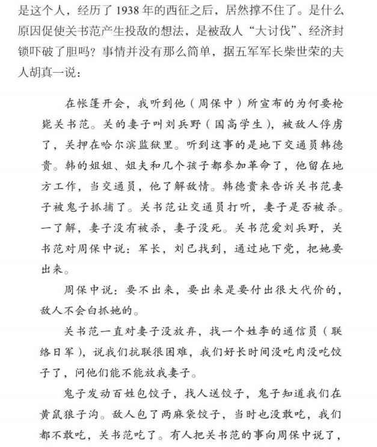<figcaption>《最危险的时刻——东北抗联史事考》165页</figcaption></figure>
这意味着什么？这意味着动摇了，开了口子了。今日吃日伪的饺子，明日是不是就要吃日伪的皇粮，做日贼的走狗？

“你是不是想叛变，你的目的是什么？”这是周保中得知此事后对关书范的质问。柴世荣仍答，自己只是想要回老婆，“我区谈判就是想把刘兵野要回来，要饺子，给饺子，说明鬼子同意谈判。”

这话周保中相信吗？他不相信，即使关书范是他的老战友、好下属，是五军一师的师长，可他跟日本人联络，那即使今日不叛，终究也有一天要变心。周保中私下找到柴世荣，告诉柴：“关这人留不得了，他要变心了，他要把队伍带跑。”柴世荣则还有爱才之心，同周讲“别激化，还是教育为主，他革命那么多年了。”

再然后，五十年代指责赵尚志“几十上百的杀害百姓同志”的周保中，在1939年怒斥柴世荣不愿杀人是“右倾”，批评同情关书范是“叛变革命”。周保中也曾有“极端”的时候，枪毙关书范的事情就这么定了下来。

与今天传说里的“关书范临死时改悔，同周保中坦白罪过”不同，关书范到死也不认为自己是叛变革命，他被绑时破口大骂，骂周保中：“野兽，你不是人呀，枪毙我你会后悔。”周保中反骂道：“你被枪毙，你变成鬼，爬到刘兵野的巴盖子上”——你关书范这么想你的老婆，那就做鬼去见他吧。

两枪过后，抗联五军一师师长关书范，作为“革命叛徒”被处死。为什么是两枪？因为第一枪时关书范还未死，口中仍讲：“原谅我，我革命这么多年，把我杀了有什么好处?”
<figure data-size="normal">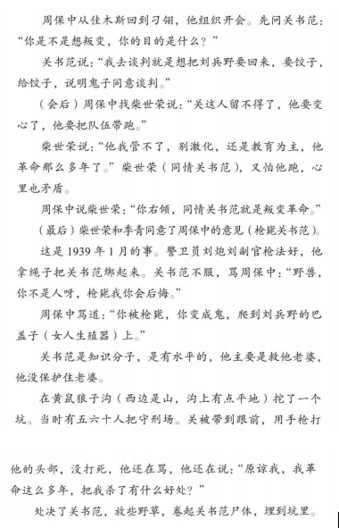<figcaption>《最危险的时刻——东北抗联史事考》166至167页</figcaption></figure>
关书范是周保中的爱将，他的“叛变”、“变心”也是因周保中不愿助他营救妻子而起，周保中杀死关书范若说没有心理波动，那是不可能的。

1939年1月16日，关书范自佳木斯返回军中，当天被周保中枪毙。1939年1月17日，周保中在个人日记里为关书范写了一上千字的小传，追念关书范这个“叛徒”的一生，在结尾写道：“<b>抗日救国不可侮，政治立场不能变，军事纪律不能苟且，将关书范就地执行枪决。翌日集合五军刁翎部队全体宣布罪状，并竭力整顿内部意志，为党和中华民族解放事业效忠到底。</b>”
<figure data-size="normal">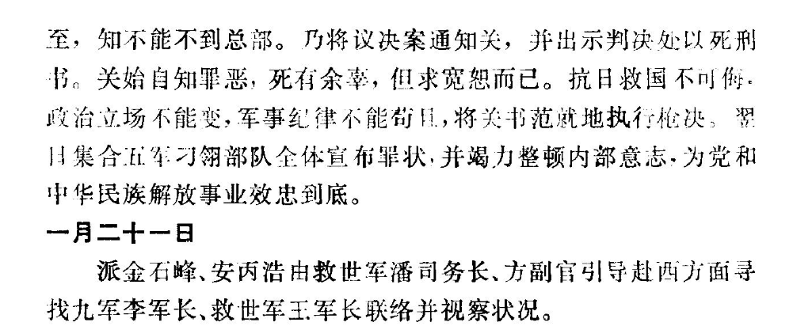<figcaption>《东北抗日游击日记》309页</figcaption></figure>
“抗日救国不可侮，政治立场不能变，军事纪律不能苟且”，抗日救国事业容不得动摇，动摇即叛变，即叛徒。做烈士，革命胜利了是“精神不死”、百世流芳，而做叛徒，在周保中眼里，在当时的共产党员眼里，是“生不如死”的。
<blockquote data-pid="PyggQPG8">永久奋斗就是要奋斗到死。汪精卫、张国焘这些人没有这个精神，于是中途变节。有一首诗说：‘周公恐惧流言日，王莽谦恭未篡时。向使当初身便死，一生真伪复谁知。’这个在历史上叫‘盖棺定论’，人到死的时候才能断定他的好坏，议论他的功罪是非。所以发扬永久奋斗精神是重要的，这样的道德才算是真正的政治道德。</blockquote>
可剩余的抗联战士，连同周保中自己，又曾真的没有过一丝一毫的动摇与感伤吗？那是不可能的，周保中自己都回顾斗争历史，都曾感到伤感之情。

1939年3月23日的日记里，周保中写道：“一九三七年秋末冬初，余自下江回抵牡丹江岸……彼时我军兵强马壮，急驰避敌锋未与接触，安然绕道南去渡江东进。光阴易度，倏忽半年以上，<b>抗日联军一落千丈，惨败改观，真不胜今昔之感。</b>”
<figure data-size="normal">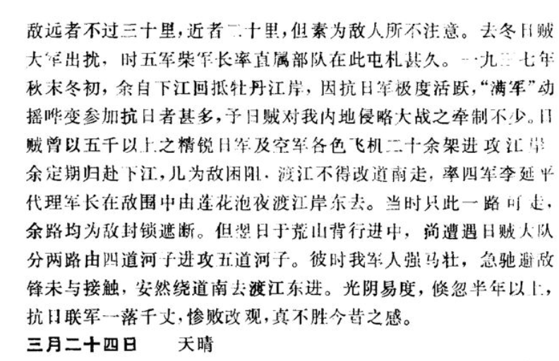</figure>
周保中此等坚决抗战之抗联领袖尚且心生悲情，更何况一般战士？1938年以来，许多周保中身边的抗联指战员离开了他，有的是以忠实同志的身份化为抗日救国事业的烈士，也有的，是做了抗日事业的逃兵乃至叛徒。

周保中的身边不断发生逃跑，不断发生叛变。这叛逃原因无非有二，一为经年苦战不见成果，心生动摇，不信抗日救国可行，于是叛变投敌做日贼走狗；二为苦斗白山黑水，无粮无肉，杀乘马、取粗粮乃至人肉为食，终难忍受此种困苦，不得不做亡国奴。

1939年3月26日，周保中捡到一份日伪的劝降传单，内中对“抗日军诸君”讲“诸君冰天雪地，饥寒交困，痛苦异常……抗日迷梦应行速醒，大满洲帝国王道乐土,诸君应速归顺，现在是良好机会”。

周保中将此一传单内的宣传摘录入日记当中，随后写下一连串抗联如何由盛转衰的历史：抗日军受经济封锁，粮食军需陷于绝境，最终为日贼“治本方案”将军民之间完全隔绝，于是部队中间战士无粮可吃，伤员无处安置。1938年起，叛逃滋生，起先为外围部队，而后为基础本部，最终是上级指挥员也做叛徒。

“农民及城市的最后联系完全被日贼隔离，加以天寒地冻，寒风刺骨…每值严重时期，联军各部队只有少数队员徒手逃亡，拐械判降日贼者更不多见。自<b>一九三八年春天以后，情形就太坏了，不但平素革命军队基础不稳的部队大批叛降日贼，即较巩固的中心军队亦生动摇</b>。因日贼广泛利用叛徒，动摇乃益见扩大，以至出现<b>上级重要领导干部起始动摇逃亡者，甚至无耻叛降日贼，供日贼驱使，使昨日之抗日救国民族英雄荣誉，一变而为极可耻无赖徒之卑贱行为。</b>”
<figure data-size="normal">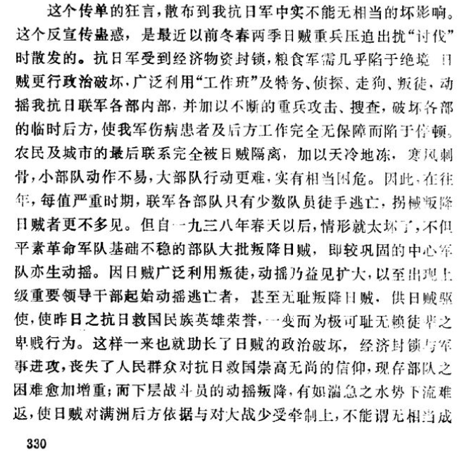</figure>
周保中何以在日记内写下这么多对叛逃的思考呢？叛变的“上级指挥员”，大约是几月以前的宋一夫、关书范，下级老战士的叛逃，则是常常发生的。当年2月16日，周保中就于日记里记下了自己遣散一批抗联九军老战士的经历：

“<b>九军人数不及三十名，多年参加抗日救国，惟萎靡不振，纪律不佳，且今日动摇特甚</b>，有请长假者，有玩忽勤务者。林副官及张文二名，拐械将给养充饥的待杀马匹骑走，投降日贼。余以现在处在极端艰苦困危状况下，不稳之人员与部队常足以增加对整体之不稳与困难之危险；且查该部人员虽属多年参加九军，但现已有根本瓦解之现象。为健全行动计，乃商得九军王主任克仁同志之一致意见，将该部队残余人员完全解除武装，给资遣散”

二十多名“多年参加抗日救国”的九军老战士，历经打击后终归沦落至“萎靡不振”、“动摇特甚”的地步。周保中知晓这些战士已经“不稳”，对抗日前途有了悲观情绪，也只能“好聚好散”，将他们全部收枪遣散，从此各走一边……
<figure data-size="normal">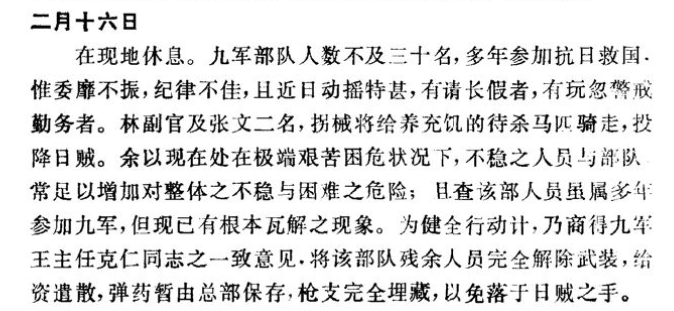</figure>
遣散九军老兵只是部队动摇的开始，3月中旬连续四日，周保中手下均有基层官兵逃跑、叛变。

3月14日，“<b>只吃糠末一餐</b>”后，时年28岁的警卫队四班长巩学文带着18岁的年轻队员关福祥、杨子刚携枪支乘夜逃走，周保中“料其必投降刁翎日贼”，不管他们继续东进。“<b>经马桥河，木材作业工人悉走，棚被日贼焚烧，给养征筹及情况探询无着</b>”。

3月15日夜，三军队员李文库执勤站岗时叛逃，周保中无奈，只得又遣散五名三军战士，“免继续发生叛逃情况。”

3月17日，周保中一行绝粮三日，既见不到友军，也寻不到民众。“<b>遍寻柴军长部无踪影，就地之炭窑木柴作业亦无一人可询问，而粮绝已三日</b>”。于是队伍中再生叛逃，分队长靳云祥、队员孙喜三“叛走降敌”，周保中不得不急行军连夜转移，于河西寻得窖藏萝卜为部下充饥。

或许是在吃萝卜时，周保中写下了靳云祥逃跑时的情状：“靳云祥拐去捷克式步枪一支，孙拐马枪一支。<b>靳当时系在侦探派遣中，将陶副官之四四式马枪、自来得手枪一枝及所带子弹及机关零件等机关枪零件等交陶副官，并说明不得已，只能逃走之苦状</b>”

绝粮三日，见不到友军、靠不了群众；无饭吃、无屋住；战士们要么萎靡不振遣散，要么失去信心逃亡，靳云祥大概确实是绝望了，也同战友“说明不得已”，表示“只能逃走”——抗日抗不下去了，散伙吧。
<figure data-size="normal">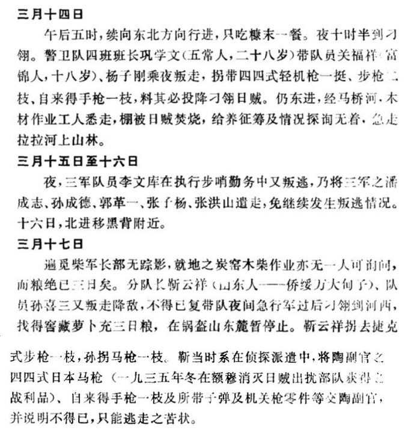</figure>
靳云祥之事迹，诚如周保中3月1日日记内所写：“<b>绝粮状态则易遭致星散瓦解，联军各部之叛逃投降敌人者均为绝粮之故。</b>”

只不过他相信，现在手下部队“较稳固”，应不至于如其他部队一般生出叛逃投降，乃至陷于“星散瓦解”的地步。
<blockquote data-pid="JRcivL70">苦于给养的困窘,对全盘工作活动及队伍休养、整顿与巩同1有极大的障碍。敌人的坚壁清野政策实甚毒辣,游击队无策源地缺乏援助.又无相当的粮食准备,即有准备亦易告损失。例如总部小百顺沟储藏的粮食虽系粗苞米:可供现地人员两月以上的饱食，今则突然全部损失，颗粒无存,<b>若非部队较稳固,则绝粮状态则易遭致星散瓦解,联军各部之叛逃投降敌人者均为绝粮之故。</b></blockquote>
可现实容不得这样的设想。靳云祥拐枪逃跑以后，周保中又一次开始为死者写传记——他第一次于日记里写小传是给自己的老战友、新“叛徒”关书范，之后日记内的传记均是为死难烈士而作——革命人相信“精神不死”的道理，肉体的死亡不是真正的死，若能求得革命事业之胜利，那么革命烈士便是永为后人铭记，成为超脱肉体、精神不死的英雄人物。

但要后人永远记忆，那总要留下记录。或许后人不会记得李钟植、崔玉林、金助一，不会记得无数“无名的周保中”、“无名的杨靖宇”，但彼时周保中这个生者，总要记得那些先死者。

“李钟植，年二十八岁，高丽人，第二军第五师第十五团第九连队员(二师四团九连)…一九三九年二月十日在正大罗勒密山元木营袭击夜战时阵亡，同时有第五军二师五团二连队员崔玉林”

“金助一，高丽人，九军政治部科长。于一九三八年二月由第上军第一师第三团政委任职改调九军，亦于此次战役中重伤牺牲四道河子西北上沟庙岭东。”

周保中作挽歌一首，“捐躯轻鸿毛，荡寇志不渝。倭奴罪恶须清除，索还血债笔笔。同志们！安息！”缅怀三人，也纪念白山黑水间无数为抗日而死者。
<figure data-size="normal">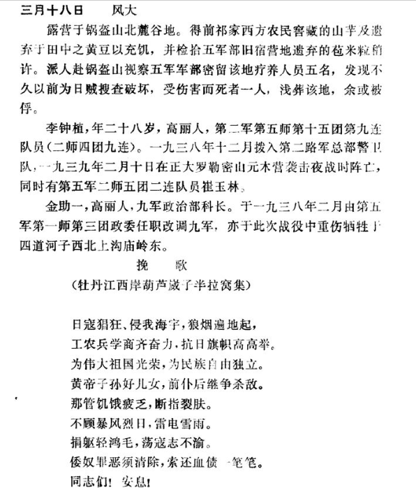</figure>
周保中接下来要写的烈士小传还有很多，一个个名字出现在他的日记中。1939年3月31日，召集柴世荣等人召开吉东省委扩大会议之后，周保中又写起烈士小传，此次是追念莲花泡惨案烈士的。

他曾在1939年1月9日给关书范、柴世荣等人的信件里提起这些烈士，他要关书范记得，“我们不能忘记了莲花泡四十二烈士的白骨未收，宝清烈士山血痕犹在，我们不能忘记傅显明及许多先烈同志在吉林东部及松花两岸、牡丹江畔的英勇战死。”

周保中这样告诉关：<b>“我们是‘盖棺论定’者，我们是最后笑人的人”，“我们坚持战斗在日贼未至根本崩溃以前，中国民族解放战争获得最后胜利之后。”</b>

周保中相信，日贼总有一天会被打跑，中国民族解放战争总有一天能胜利。“我们”会是盖棺定论者，是最后书写历史的人，英雄烈士要百代流芳，日贼走狗要遗臭万年。
<figure data-size="normal">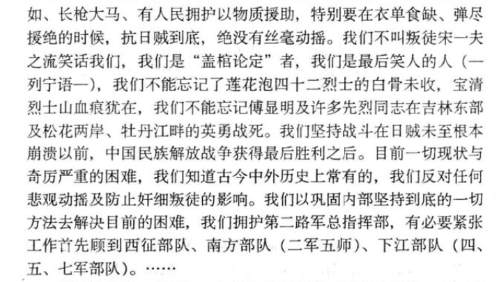<figcaption>《周保中关于坚持抗战、反对悲观动摇等问题给柴世荣、关书范的信》1939年1月9日 载于《周保中抗日救国文集》</figcaption></figure>
“姚新一同志，原名唐九英，字瑶璞，吉林生人。曾肄业于北京大学史地系，精通英文。在北平即参加中国共产党，热心从事革命运动。……此次受派由刁翎往方正县属之克上克省委秘书处旧址搬移密藏之重要文件及印刷器材，南归后由莲花泡江西密营赴江东，遂遇敌袭击捐躯。唐同志遗妻关氏携二子居吉林，长子秉政年十三，次子七龄”

“胥杰同志，原姓孙名礼，依兰宏克力人，卒业于师范讲习班，后赴木斯任教。-九二七年夏偕爱妻王禹智同志同赴吉东省委，担任秘书处兼缮写。……一九三五年即参加中国共产党，奔走抗日救国运动最为有力，实为有深造前途堪期重任之优秀干部，惜乎捐躯太早，诚属革命运动之一大损失，”
<figure data-size="normal">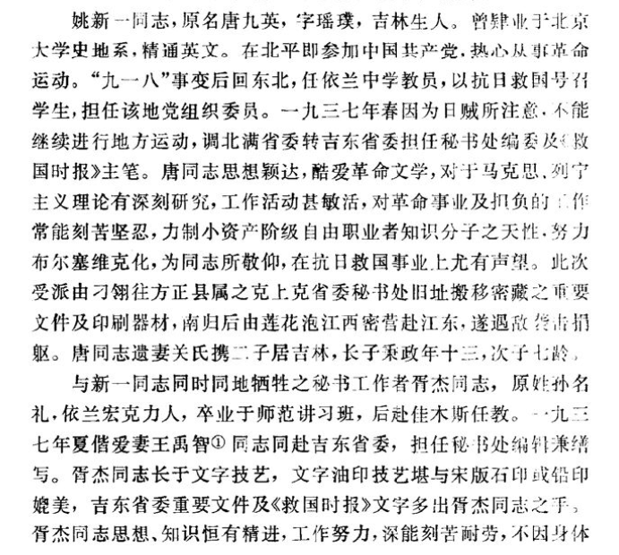</figure>
“秘书孙绍堂同志，一九三三年参军,一九三四年参加中共党，与胥杰、新一同时同地牺牲。……一九三六年派送学习，革命知识理论大有进步，对无产阶级革命主义信仰笃实，学无线电深有心得，不但熟练通信技术且能制造，在久远革命斗争中，有重大期待乃竟过早牺牲，实属可惜。”

“朴正熙，高丽民族解放运动中之先进妇女，与上述三同志同时牺牲，年四十四岁，与金石峰同志同居半生。……一九三七年参加中国共产党，政治觉悟与工作努力为同志辈及凡有知交之群众所敬仰。此次亦以斗争紧张而告牺牲，失去革命妇女之先导人物，殊为憾事。”
<figure data-size="normal">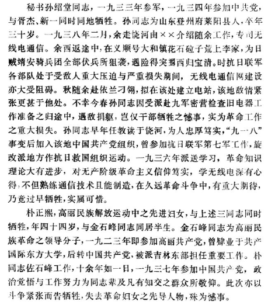</figure>
写到最后，周保中仍要回归斗争现实，金勇男、姚新一、孙绍堂、李洪秀、胥杰、朴正熙、梁名升等同志先后牺牲，宋一夫、曲成山、栾志援、关书范等干部先后叛变。东北的抗日形势确实已到“严重”的地步。

叛变逃亡所以发生，原因也就正如前文所说，直接者是因不断的断粮绝粮，根本者则是干部缺乏“中心支柱”，对于抗日斗争绝望。

“最近，总部警卫队由五军征调的队员中，有弃械潜逃者，有拐带轻机关枪大小枪支叛逃降敌作走狗者，<b>其直接原因虽然由于近日来不断发生断粮绝食恐慌，实则由于党的干部缺乏做群众斗争的中心支柱。</b>”
<figure data-size="normal">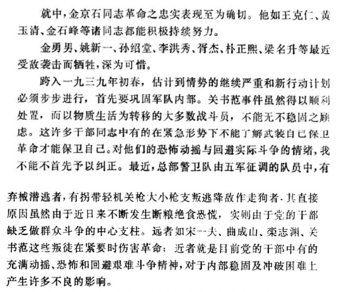</figure>

战斗仍要继续，时间来到1940年，周保中的日记里又新添了数名抗联人的传记，有的是烈士，有的是叛徒。

1940年6月24日，周保中领导队伍袭击永丰金矿后进一步转移，部队又陷绝粮恐慌当中，“桦川南边驼腰子之日贼守备队与大小石头河方面之日满伪军呼应出扰，对于矿井采金工人之行动监视甚严。派遣队日需给养征发既不可能，购买亦难办到……来源即告断绝，<b>派遣队全体同志陷入饥饿恐慌状况</b>”。

在粮荒之中，周保中再次回忆过往，“许多事是用不着很多回想，并且许多事是‘不堪回想’！然而又不能不回想。”他想起了黄玉清、张镇华，想起无数为民族牺牲的烈士，在自己的笔下对他们加以无限的称赞：

“两同志有至高之布尔塞维克信念，有为民族牺牲到底之决心表示，加以总部留守人员及直属部队人员，都经过长期艰苦斗争，巨风骇浪俱未稍动摇。工作活动亦有锻炼，遵守纪律，实为忠贞不拔、坚忍耐劳之革命志士。换言之，<b>乃六七年来千万人损耗后之硕果与结晶，洵非残败剩余、颓萎不振可同日而语。</b>”
<figure data-size="normal">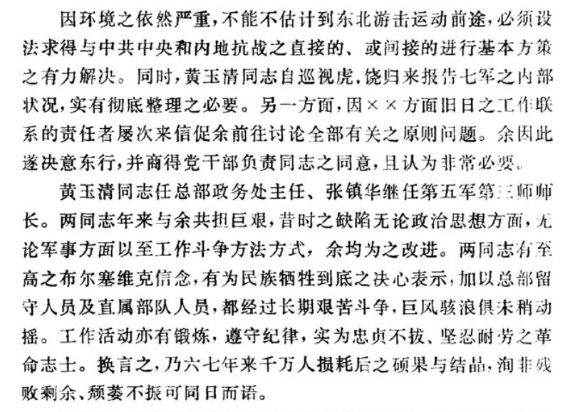</figure>
“除战死者外，张镇华以下七同志为敌俘去送宝清。<b>敌人狂喜，劝张归降，张恶骂之，敌人以优良衣食相强，张拒绝之。以下同志都受敌人劝诱降顺，无一首肯者</b>。日贼狰狞面目突现，将张枷铐锁链，押解佳木斯。刘团长学悦以下十同志为敌人戕杀于宝清，张则被杀死于佳木斯。”

“黄玉清同志与张失联系后，因情势益趋紧迫，乃退避兰山，将后方留守人员完全集中掌握。因断粮及服装不堪，即不尽战死，亦将尽冻饿而死，乃冒险铤而绕越敌人……后方管理主任徐建昌及战伤之申指导员善一以及其他之伤创者五人，妇女朱新玉、崔顺善、刘淑英等悉被敌人俘虏入宝清城，<b>敌人劝降，尤以为妇女懦弱，多方诱劝，无一屈辱投降者，遂为日贼害死。独徐建昌贪生怕死，在敌人利诱威迫之下，变节降顺，并为敌作狗…余以为心下江中心部队虽败犹荣，美玉无瑕，独此为疵，诚堪愤恨。</b>”
<figure data-size="normal">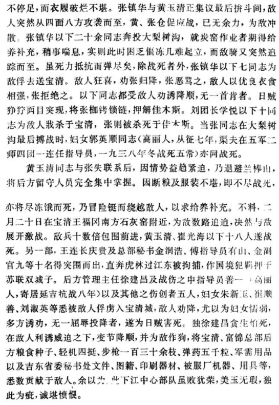</figure>
周保中接下来写道：“<b>申等何其洁白光亮，如在天之日川星辰;徐类何其污浊，如粪坑之蛆。</b>昨日为抗日救国之革命同志，今日顿有天地之悬隔，此即为人事历史之一索引乎。”

然而黄玉清、张镇华、申善一等忠实同志皆死，“兰山无恙，星河依然，独不见我黄、张以下艰辛共尝、誓与生死之诸同志。<b>鲜血遍溅，白骨抛荒，后死之我，不胜感伤！</b>”——纵“兰山无恙，星河依然”，却也回避不了“全体同志陷入饥饿恐慌状况”的苦痛现实，周保中所以能自慰者，恐怕也只有思念已死之同志，以作为“后死之人”坚定意志。

“又不能不回想”，周保中心里是认为不该在此时想起烈士的，因死难者的事迹所唤起的，不单是意志，也有悲凉伤痛之感。“<b>每一队员，亦属难能可贵之民族战士。今丧失累累，从何处求得填补，后继前仆者又有伊谁，此余所以深为痛悼者也</b>。”

忠实同志死伤殆尽，不能补充，又有谁能继承他们这一代人的意志，为抗日救国前仆后继？《愚公移山》讲“子子孙孙无穷匮也”，东北抗日事业的“子子孙孙”在哪里？在1940年的这个春天，周保中见不到，也想不到答案，只得“深为痛悼”。

东北义军大起义之时自比“谢玄三千”，抗日联军苦斗白山黑水之中自喻“田横五百”，但世上没有奇迹，东北的抗日斗争既未创造淝水之战的传奇，也未诞生田单复齐的史诗。民族战士们所有的，只是“青松古柏般坚韧不拔的民族气节”，与超乎常人想象的痛苦折磨。
<figure data-size="normal">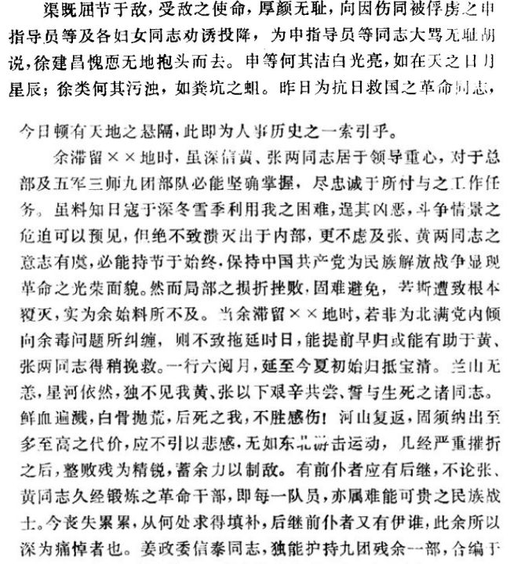</figure>

---
导出时间: 2026-08-23 19:07