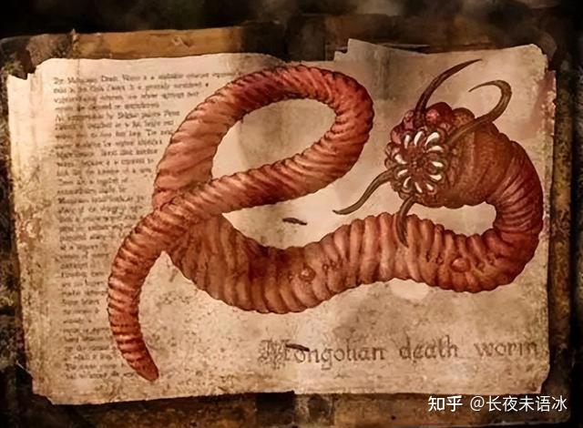
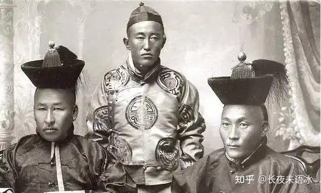

# 有哪些比野史还离谱的正史？

| 项目 | 内容 |
|---|---|
| 类型 | answer |
| 作者 | 长夜未语冰 |
| 收藏时间 | 2025-02-20 11:04 |
| 发布时间 | - |
| 收藏夹 | 抗联 |
| 原链接 | https://www.zhihu.com/question/10882311880/answer/105668174960 |

## 摘要

内蒙金丹道起义期间，因为相信金丹道徒能驱动妖法作战，十九世纪九十年代的内蒙河北大地曾经上演过真人版的大逃杀奇观：几十万人有的躲进了深山老林里，有的干脆选择自我了断，更多的则是拖家带口漫无目的地逃亡，而一旦被“邪魔”（金丹道徒）追上，立刻吓得抖如筛糠跪地求饶，无人敢抵抗，结果就是被对方一路赶着屠杀，场面横尸遍野，惨不忍睹，堪称现实版的大逃杀。 而酿成悲剧的根源，似乎可以从一则当地蒙古人世代流传的传…

## 正文

内蒙金丹道起义期间，因为相信金丹道徒能驱动妖法作战，十九世纪九十年代的内蒙河北大地曾经上演过真人版的大逃杀奇观：几十万人有的躲进了深山老林里，有的干脆选择自我了断，更多的则是拖家带口漫无目的地逃亡，而一旦被“邪魔”（金丹道徒）追上，立刻吓得抖如筛糠跪地求饶，无人敢抵抗，结果就是被对方一路赶着屠杀，场面横尸遍野，惨不忍睹，堪称现实版的大逃杀。

而酿成悲剧的根源，似乎可以从一则当地蒙古人世代流传的传说中得到一些启示。
<figure data-size="normal"></figure>
图中这个长相非常克苏鲁的生物在西里尔蒙语中被称作олгой-хорхой，翻译过来就是“肠虫”的意思。蒙古人相信，这种长相怪异的虫子是恶魔的化身，它们生活在戈壁深处，具有超自然力量，不但能喷射毒液还能口吐火电。

上世纪末，曾有超自然爱好者前往蒙古国调查，特地走访了一处靠近戈壁的偏僻小村落，结果令人啼笑皆非，几杯酒下肚，这些被采访的蒙古牧民纷纷开启放飞自我模式，几乎所有被采访者都声称自己见过肠虫。而且众说不一。有的说见过这虫子，一碰就会自爆，爆炸飞迸的汁液有强烈腐蚀性。有的说这虫子会喷毒，人中了必死。还有的说会放电，自己有两个朋友都被这虫子电死了……

按照这些蒙古老铁的论述，这玩意儿几乎在当地遍地都是。然而调查人员在当地待了一个月，用尽各种手段，始终找不到一点痕迹。

我们都说喝酒和吹牛是一对孪生兄弟，该节目的录制者最后也不得不感慨：这帮顿顿离不开酒的蒙古老铁对吹牛的执念实在太强了。而根据他们的表现就不难猜测他们日常生活中有多不靠谱，对自己嘴里说出来的话有多么不负责任。

事实也确实如此：

时间回到十九世纪九十年代初的内蒙河北大地，彼时受封于蒙东（内蒙古东部、热河北部一带）的蒙古王公<a href="https://zhida.zhihu.com/search?content_id=709239501&amp;content_type=Answer&amp;match_order=1&amp;q=%E8%BE%BE%E5%85%8B%E6%B2%81&amp;zhida_source=entity" data-icon-name="zhicon_icon_24_link" class="internal">达克沁</a>极端仇视当地的汉族百姓，此人自恃官高爵显，作威作福，暴虐无道。他将山林视为蒙人的私产，禁止汉人砍柴做饭，并且派遣由蒙古家丁组成的巡山队巡逻，上山砍柴的汉族百姓一旦被抓获，不仅柴禾以及绳子、镰刀等工具会被没收，“情节严重者”还要遭受极为残酷的私刑：<b>“如以碗口粗小树砍去枝梢，削其顶为尖，将犯山人衣服尽脱，并将小树弯在地以索尖插入肛门，陡一松手将人撅在半空，旋即落地，摔得脑浆崩裂。”</b>

1891年，热河地区爆发了水灾，粮食减产，以种地为生的百姓生活日益困苦，被禁止砍柴的汉人贫苦百姓只能去牧区割牧草来维持生存。然而在严重的自然灾害面前，达克沁不但不体恤灾民，反而将敲骨吸髓的民族压迫推进到了新高峰。他不仅禁止砍柴，还禁止汉人流民割牧草自救，偷割牧草的汉人百姓一旦被捕，达克沁就会命令属下“夺其绳担，并施毒打辱骂。严重者还会：<b>“捕到府中严押，苛以私割牧场罪名，动辄打杀，尸首置于野。”</b>

与达克沁一样，他的家人对待汉人百姓也极为残酷。达克沁的儿子四喇嘛：<b>“动辄勒增汉民租价，侵夺人家生产”，致使百余里中无人不怨”</b>；达克沁的福晋（妻子）外出时：<b>“勒令开道，其有乡间愚鲁农人，回避稍迟者，无论妇女老幼，鞭笞立至，几至酿成巨变。”</b>

正所谓上行下效，有这样的主子，那些达克沁府上的蒙古家仆自然不遑多让。他们：<b>“有跋扈者，自恃身高，时复出而相扰。纠合三五， 持刀骑马，闯入汉族人家，索要酒肉钱财，笞打妇男，抢掠牲畜，尽而后已。”</b>
<figure data-size="normal"><figcaption>清末蒙古王公</figcaption></figure>
面对这种全方位、敲骨吸髓式的压迫，“达克沁欲调蒙兵杀汉腾地”的传言开始在流民百姓中不胫而走广为流传。可以说此时的内蒙已经变成了一个危险的火药桶，汉人各阶层百姓除了团结一致奋起反抗外，已无其它活路可走。

在这种绝望的氛围中，活跃于内蒙东部地区的秘密道教结社组织金丹道登上了历史舞台。

金丹道主要流行于朝阳县、建昌县、<a href="https://zhida.zhihu.com/search?content_id=709239501&amp;content_type=Answer&amp;match_order=1&amp;q=%E6%95%96%E6%B1%89%E6%97%97&amp;zhida_source=entity" data-icon-name="zhicon_icon_24_link" class="internal">敖汉旗</a>一带，信徒以迁移到关外的汉人为主，其首领便是<a href="https://zhida.zhihu.com/search?content_id=709239501&amp;content_type=Answer&amp;match_order=1&amp;q=%E6%9D%A8%E6%82%A6%E6%98%A5&amp;zhida_source=entity" data-icon-name="zhicon_icon_24_link" class="internal">杨悦春</a>。金丹道平日里号召信徒吃斋行善， 不食烟酒，也施行医术，看病救人，在当地颇得人心。不过金丹道之所以受拥戴，主要还是因为一个令人啼笑皆非的原因：受汉人的评书、戏曲等文艺作品的影响，当地蒙古精英对留着华夏发髻、青衣铁剑的道士素来敬畏，认为他们<b>“通鬼神，善变化，迅疾如风，尤不可招惹”。</b>这种说法经过金丹道巧妙的润色和渲染，流传到下层蒙古人耳中时，在酒精的推波助澜下逐渐变成蒙古版的乡野怪谈，蒙古牧民相信道士装扮的汉人是汉人中的巫师，拥有刀枪不入、呼风唤雨的力量。因此非常惧怕，路上遇到都会绕道而走。受此影响，当时内蒙古东南部很多汉族移民都加入了金丹道，为的就是抱团取暖，借助组织的震慑力与蒙古人抗争。于是乎逐渐的，金丹道就成了汉人在当地的利益代言者。

也许是随着汉人“巫师”的数量越来越多，蒙古社会人心惶惶，让达克沁也感受到了威胁。总之从1891年初开始，达克沁积极调集蒙古兵，加强<a href="https://zhida.zhihu.com/search?content_id=709239501&amp;content_type=Answer&amp;match_order=1&amp;q=%E8%B4%9D%E5%AD%90%E5%BA%9C&amp;zhida_source=entity" data-icon-name="zhicon_icon_24_link" class="internal">贝子府</a>及周边的兵力。

然而事机不密，贝子府增兵的消息不胫而走，很快传遍整个蒙东。此时双方长期积攒的矛盾已经达到了临界点，达克沁的举措无疑相当于让“杀汉民腾地”的传言得到了实质印证。一时间积压在汉人心中的怒火，像火山一样爆发了。

得知贝子府正在增兵的消息后，杨悦春深知事态严峻，此时必须先下手为强立即发动起义，不能给敌人准备充分的时间和机会。一旦对方率先发难，则攻守之势易形，后果难料。

用我们今天的眼光看，尽管杨悦春存在很多时代局限性，但他仍然不失为一个有韬略的组织者。他知道想要起义成功，必须先对手一步聚集起力量。因此至少在两年前，金丹道徒便向朝阳、建昌、平泉、赤峰、锦州、义州、宽城子等地进行游说联络活动，建立了广泛而严密的基层组织。与此同时他们也不忘装神弄鬼，不断向蒙古人传播金丹道擅长法术的流言，从而制造社会恐慌氛围。

光绪十七年十月初十（1891年10.10），在一切准备就绪后，金丹道起义爆发。金丹道众打着“替天行道，扫胡灭清”的口号揭竿而起。周边饱受压迫的汉人群众一呼百应，纷纷加入其中。

十月初十夜，起义军向首恶——达克沁的贝子府发起了全面攻击。战斗中，达克沁提前做的准备工作发挥了作用，他向府中的蒙古护卫辟谣所谓的金丹道法术不过是装神弄鬼的骗术，鼓励蒙古护卫拼死抵抗，在达克沁的运作下，起义军的突袭被暂时抵挡下来，双方激战了两个时辰，起义军依然未能攻下贝子府。

然而恰在此时，一件意外的发生，却让达克沁战胜恐惧的所有努力，在顷刻间付诸东流：一辆起义军运送火药的车子被府中蒙古兵的火炮击中后爆炸，导致数名起义军士兵被炸飞，身体落入贝子府中。

正在作战的蒙古兵见状，顿时大惊失色，以为起义军真的使用“妖术”作战了。原来汉人的评书，戏曲等文艺作品在这些平素提笼架鸟的蒙古护卫中很有市场，而这些作品中又不乏各种道家施法的桥段。伴随法术施展的往往都是一声巨响、一阵青烟。刚好金丹道本来就是道家打扮。这些蒙古兵见状脑海里马上联想到评书里无数次提到的腾云驾雾的法术，惊呼：<b>“贼有道法相助，不能敌”。</b>于是<b>“皆惊慌失措，枪不能放，均委而弃之，各逃生命”</b>，这次意外的“道法显灵”，如同压死骆驼的最后一根稻草，令蒙人勉强支棱起来的最后一点抵抗勇气也冰消瓦解，恐慌像多米诺骨牌一样快速传播，直接导致全军崩溃，贝子府也迅速被起义军攻陷。

获得胜利的起义军，望着这片给自己带来苦难和压迫的源头，如今正被自己踩在脚下的，心中的泄愤之情无法抑制，于是他们在贝子府中大肆屠杀。除了达克沁三儿子和长孙侥幸逃脱之外，达克沁及家人二十三口连同在贝子府种避难的属民及家仆合计一千余人都被杀掉，达克沁的祖坟也被捣毁。

攻占贝子府后，金丹道起义军将其更名为“开国府”，并推举杨悦春为“总大教师”，李国珍为“扫北武圣人”。王增被封为右丞相。其他各首领依次被封为王、侯、军师、元帅、副帅、先锋等，并立即开始了扩大战果的军事行动：

“派令王增、王福等招集四五千人到东路土默特旗一带沿途来找蒙古营子抄杀。李青山等到西路平泉州、喀喇沁等旗一带抄杀，北路王增告知冯善政，转嘱李国珍带领七八千人往北路扎萨王旗、奈曼王旗、海林王旗一带抄杀，南路由平南王徐立等率领，攻打朝阳。”

金丹道打出<b>“替天行道、扫胡灭清”</b>的旗号，共兵分四路，以“从此不受蒙古欺侮”为宣传口号，号召各地与蒙古居民有矛盾的汉民们“行动起来”，很快便聚拢了大批人众。起义军势如破竹。不久，敖汉旗、翁牛特右旗、土默特左旗、奈曼旗等旗的衙署纷纷被攻陷，附设庙宇、房屋、财物、档案尽数烧毁，甚至连敖汉郡王达木林达尔达克的祖坟都被暴动军捣毁了。起义的浪潮仅仅数日内就席卷了内蒙古东南部，辽宁、吉林、河北三省部分地区在内的广大区域。

据史料记载，起义军“<b>头裹红巾，手持器械，只呼杀！杀！凡遇蒙古，无得免者。每杀一人还口呼，尔等尚吃租乎？尚施威乎？”</b>

到这里，大逃杀的剧情正式开始了：

这一年，蒙人奔走相告：汉人发怒了，他们施法术到处杀蒙人，我们没有法术和他们对抗……

最开始，许多当地蒙人只听到了传闻，却因为酒精作祟克制不住到处宣扬，期间不乏各种添油加醋的成分，从而使当地的恐慌氛围得到充分的预热，而等到目睹逃难的同族越来越多时，当地所有人连同谣言的散播者都对此深信不疑，于是人心彻底崩溃，大家开始四散奔逃，将流言扩展到更多的地区。结果就是传言越传越广，越传越夸张，形成了逻辑闭环，影响范围几乎涵盖整个河北北部和内蒙，当地的蒙人纷纷举家带口向北逃窜，对于他们来说，这已经不再是种族冲突，而是现实版的魔族入侵。

根据时人回忆，蒙古人对金丹道徒会法术的说法深信不疑：

<b>“传有善火术者，口诵真言，枪刀不入，放火公鸡，口吐火球，不燃自焚。”</b>

经过蒙古人的脑补，差不多是这样：
<figure data-size="normal"></figure>
除了火属性法术，还有毒属性。

<b>“传有通邪术者，毒淬其身，面青绿，善喷云吐雾，中者立死。”</b>

经过蒙人的脑补，大概是这种形象
<figure data-size="normal"></figure>
我们都说谣言止于智者，然而在金丹道事件中，智者却从始至终都没出现。结果就是：面对传闻中毒火双修、恐怖如斯的金丹道，蒙人连眼见为实的想法都不敢有，直接将金丹道视作了邪神或某种超自然种族，他们与金丹道徒遭遇，即便被刀架在脖子上，也只会不停下跪磕头哀求（被刀杀起码比被法术烧死、毒死要好），没一个人敢站起来反抗：
<blockquote data-pid="iyn4qcYg"><b>“适有蒙古未及逃出者，三五十成群，以为潜逃之计，路遇三五贼党（金丹道徒），皆不敢还手，匍匐哀告，终不见恕，引颈受刃，不敢少移也。”</b></blockquote>
实话实说，事情到这一步，其性质已然超出了大逃杀的范畴，正式迈向了神秘学领域：
<figure data-size="normal"></figure>
可以说，如果没有清政府后续紧急调集淮军镇压，对蒙古族来说后果将不堪设想……值此再看狼图腾中所谓的“游牧狼性精神”，可谓是徒增笑耳。

---
导出时间: 2026-08-23 19:07