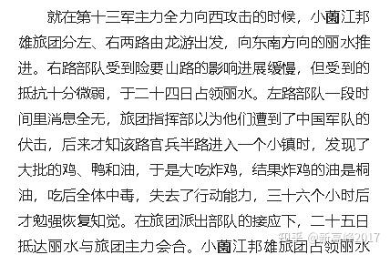
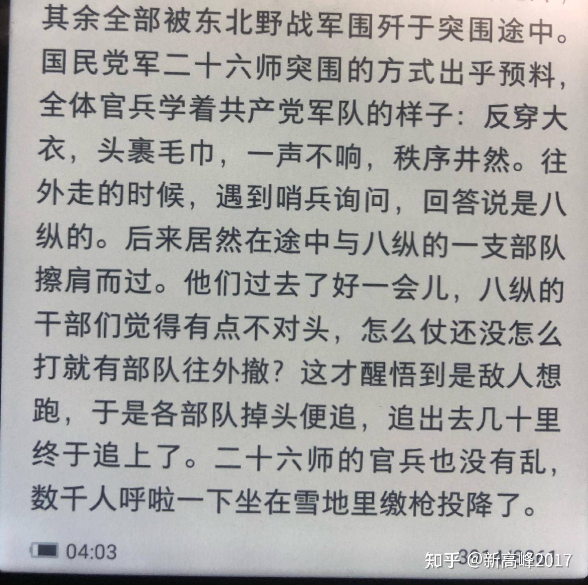

# 读史书时有没有让你笑出声的段落？

| 项目 | 内容 |
|---|---|
| 类型 | answer |
| 作者 | 新高峰2017 |
| 收藏时间 | 2025-02-12 15:55 |
| 发布时间 | - |
| 收藏夹 | 抗联 |
| 原链接 | https://www.zhihu.com/question/31673647/answer/99161396001 |

## 摘要

抗日战争中某次战役，日军某部队因为吃了桐油炸的鸡丧失战斗力36小时。 [图片] 补充：国民党军伪装成解放军突围 [图片]

## 正文

抗日战争中某次战役，日军某部队因为吃了桐油炸的鸡丧失战斗力36小时。
<figure data-size="normal"></figure>
补充：国民党军伪装成解放军突围
<figure data-size="normal"></figure>

---
导出时间: 2026-08-23 19:07