# 哪些历史人物让你特别特别意难平？

| 项目 | 内容 |
|---|---|
| 类型 | answer |
| 作者 | Nichuhe |
| 收藏时间 | 2024-12-18 08:51 |
| 发布时间 | - |
| 收藏夹 | 抗联 |
| 原链接 | https://www.zhihu.com/question/646980351/answer/57910796304 |

## 摘要

说一个冷门的，北满省委书记金策，大概除了热爱看黑龙江党史的爱好者们，都没怎么听说过他。 [图片] 金策同志是东北抗联严峻期在东北坚持到最久的省军级干部，三路军政委，三军政治部主任。在抗联最危险的时候，已经撤到苏联的金策同志仍然回到了东北，并且从1941开始长期实际上主持黑龙江地区所有的党务工作（当时军事工作是三路军参谋长许亨植同志在主持，和金策这个三路军政委搭档可以说是政委管党务，参谋长管军事）。 金策1903年出…

## 正文

说一个冷门的，北满省委书记金策，大概除了热爱看黑龙江党史的爱好者们，都没怎么听说过他。
<figure data-size="normal">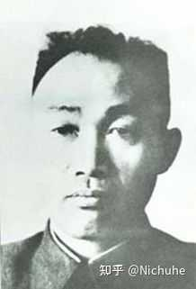<figcaption>△1945-1950 中年的金策</figcaption></figure>
金策同志是东北抗联严峻期在东北坚持到最久的省军级干部，三路军政委，三军政治部主任。在抗联最危险的时候，已经撤到苏联的金策同志仍然回到了东北，并且从1941开始长期实际上主持黑龙江地区所有的党务工作（当时军事工作是三路军参谋长许亨植同志在主持，和金策这个三路军政委搭档可以说是政委管党务，参谋长管军事）。

金策1903年出生在朝鲜咸镜北道的城津市（现在的金策市）。他大概不到十岁就和父亲来到了东北，最早是高丽共产党的成员。1928年因为高丽共产党的宗派主义，导致在中国东北组织受到严重破坏，金策也在同年被捕入狱。当时朝鲜半岛的一名爱国律师许宪为金策辩护，让金策得以减刑，只被判了两年有期徒刑，而金策坐牢的地点，就在知名的汉城西大门监狱。
<figure data-size="normal">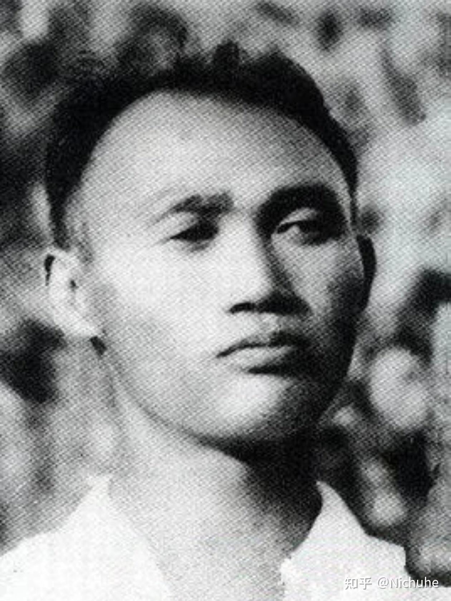<figcaption>△1920年代，还在东北的青年金策。</figcaption></figure>
金策在出狱后，在许宪律师家短暂居住，然后返回了自己长期居住的中国东北，但是刚回到家，就发现，父亲和妻子都病逝了，只剩下两个六岁和四岁的孩子。

在1930年1月之后，金策在龙井被元宗教团体举报和逮捕（原因是因为金策刚出狱就宣传革命）。不久后，日本人又在5月前来龙井追查金策，金策为了自己和家人的安全起见，把两个孩子托付给妻子的哥哥。根据后来金策的回忆，他在革命期间，一直以来有一种心理准备，就是如果自己的妻兄能够活下来，就会把自己的儿子养大，如果妻兄去世，自己的儿子就会变成流浪儿和乞丐。但是金策必须要以革命为先。他在苏联短暂修整期间和金一代说过，如果他的儿子和他都能活下来见到胜利，或许他的儿子还能见到他这个“不肖的父亲”。

而在这段时间，根据共产国际一人一党原则，金策组织关系转为TG，由此金策开始了为东北各族（包括在东北的朝鲜族）人民革命的生涯。

对于金策的革命生涯，大致时间线我会参考百度百科和黑龙江党史发布的“金策在东北革命斗争中”两篇文章的资料给大家粗略讲述一下金策的过往事例。

金策1930年7月27日在黑龙江省宁安县东京城加入中国共产党，8月任东京城区委书记，10月任宁安行动委员会书记，同年11月被捕。这次被捕的原因是因为后来知名的立三路线。

而在金策被捕的差不多同一年，另一东北抗联知名将领，同样来自于朝鲜半岛的许亨植同志，因为1930年530在日本驻哈尔滨领事馆领导抗议（实际上是朝族学生一拥而上翻墙进去把领事馆给砸了）也在沈阳坐牢。根据一位韩国纪实作家在东北的考证，许亨植同志和金策两位同志可能在1930-1931就已经认识了，这也为这对后来北满省委的领导搭档的友情埋下了伏笔。

金策同志和许亨植同志在九一八后出狱（可能是前后脚也可能就是同时）。金策1931年11月在哈尔滨特委工作。1932年和许亨植同志搭档，金策去宾县担任特支书记。1933年1月，调到珠河县任河东党支部书记，同年5月在县委秘书处工作。1934年5月任珠河县委秘书长、哈东支队军需处长。1935年1月，先后任东北人民革命军第三军二团、四团政治部主任。1936年春，任东北抗联第三军第四师政治部主任。1937年11月，任东北抗联第三军政治部主任。由此履历，我们不难看出，金策也是一个基层经验丰富，军事能力过硬的干部。 

1939年4月12日，中共北满临时省委在通河召开第二次执委全会，决定将北满临时省委改建为中共北满省委，成立东北抗日联军第三路军总指挥部。会议选举金策为省委书记，张兰生当选为省委执行委员（至1940年1月），兼任东北抗日联军第三军政治部主任（至1940年4月）。

在担任北满省委书记期间，长期带有腿伤的金策同志经常翻山越岭。他工作负责，没有领导架子，经常亲自爬山去传达指示和递送党内刊物。

此外，百度百科金策词条下遗漏了一条重要信息，就是金策是在抗联北撤时期去过苏联的。金策也是在北撤期间第一次见到了金一代。不过金策很快就回了东北。当时撤到苏联，基本就是能活下来。反而从苏联回到东北大概率要面临掉脑袋的风险，但是金策作为北满省委高级领导，还是展现出了极大的勇气和担当。
<figure data-size="normal">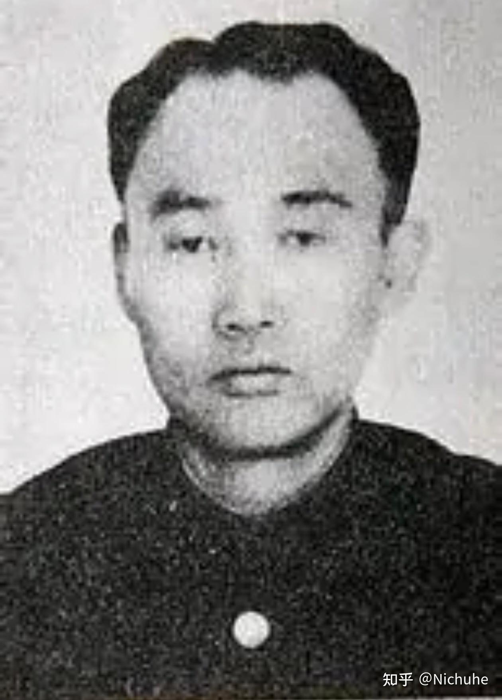<figcaption>△抗日时期的金策。</figcaption></figure>
走之前，根据韩国网站上的资料，金一代在金策临出发前叮嘱金策，让金策无论如何劝许亨植回来，传下来的原话是：“许亨植同志，我想，你不要把唯一的生命丢在满洲。（原文是韩语，我直接翻译的）”。金一代当时或许没想到的是，许亨植到牺牲都没有回来，而金策也因为“不想离开淌着战友鲜血的土地”的原因，直到1944.1才回到苏联。

1941年7月，金策担任东北抗联第三路军政治委员，率领小部队在北满省委游击区（就是今天的黑龙江和蒙东部分地区）地区活动。1942年8月，金策同志的老搭档，许亨植同志因为指导地方工作时遭遇日伪截击，壮烈牺牲。考虑到金策的安全，苏联方面和八十八旅一直希望金策回苏联。但是被金策多次拒绝。

直到1944年1月，金策同志带着当时的省委秘书全昌哲，全昌哲同志的爱人安景淑，才过界到苏联任东北抗联教导旅第三营政委。
<figure data-size="normal">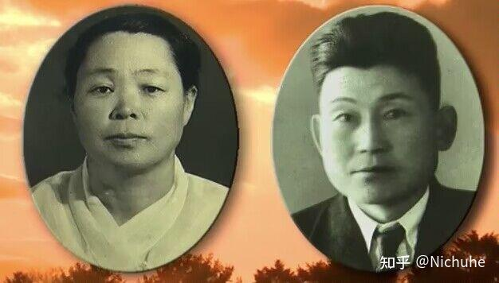<figcaption>△引自朝鲜纪录片，金策同志的老金沟省委三人组里的搭档，省委秘书全昌哲同志和他夫人安景淑同志，全昌哲同志1905出生，按年龄看这个照片应该也是抗日结束没几年拍的。</figcaption></figure>
金策到了苏联没多久，就开始替自己和已经牺牲的老战友针对自己在留守东北期间的工作的不足做出了检讨。如果这个大家有兴趣，回头我写一写许亨植同志牺牲过程和巴木通大逮捕事件。

1944.1月以后，黑龙江籍的于天放同志接替金策同志负责东北留守的工作。1944年底，于天放被日伪逮捕。于天放同志巧妙和日伪周旋，争取时间，在1945年夏天打死日本看守，翻过三道铁门逃出生天。日本人拉了当地十万群众手拉手拉网抓于天放，群众刻意把于天放同志漏出去了。于天放同志在逃出拉网圈后误闯村子，面对群众说出豪言壮语，“我就是于天放，今天我死在中国人手里也认了”等语。结果群众一听说面前的青年是于天放，立马去庙里发誓绝不出卖于天放，并且骑马抓回了意图告密的日伪警察。于天放同志逃出生天，并且在监狱外和大家一起庆贺抗战胜利。 
<figure data-size="normal">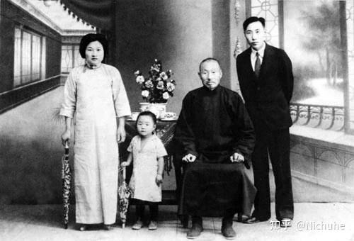<figcaption>△照片为于天放同志全家福。真正的清华拳：于天放同志（1908-1967）毕业于清华经济系，1932身为黑龙江人特地回东北参加家乡抗战并坚持十三年。1944年底被捕。1945年夏天与同监狱的五军难友配合打死日本特务，在墙上题诗一首，翻过三道铁门逃出生天，直到1945.8.15抗日胜利，日本人也没抓到他。</figcaption></figure>
八一五之后，金策同志也随着朝鲜工作组回到朝鲜。1946年，金策与流浪东北十多年的孩子在分别16年后相见。后来因为酿酒和一位朝鲜酿酒女工姜正淑结缘。在朝鲜战争早期，金策特地托人在半岛南部寻找许亨植同志的烈士遗孤，并且将两个孩子送到朝鲜（两个孩子根据韩国纪实作家的记录起码活了七十多岁）。 

<b>1951年因为朝鲜战争指挥过程中的心脏病突发而去世。相隔十六年再见的父子，其实只在一起生活了四年。</b>

后来，金一代把他的孩子抚养成人，他的大儿子就是朝鲜的政治局委员，金国泰<b>。</b>

后面还有细节的话，我再慢慢补充。

 

金策同志个人性格和轶事：

1.男德典范，重感情。金策夫人和父亲去世后，金策长达16年没有再婚。个别资料记载金策夫人和父亲是因为日伪要再次逮捕出狱的金策，但是没在金策在东北住所抓到人，他妻子和父亲对金策情况完全不知情，被日本人拷打后重病致死。但更多资料仅仅记录其父亲和夫人病逝。无论如何，在27-43岁，人生最好的16年没有再娶，一方面当然可以说是对革命任务的执着，另一方面或许也有对亲属的思念因素。
<figure data-size="normal">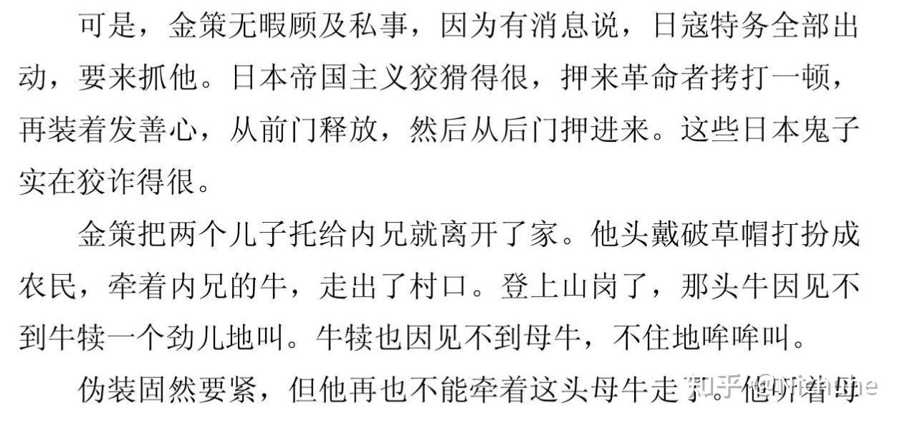</figure>
 
<figure data-size="normal">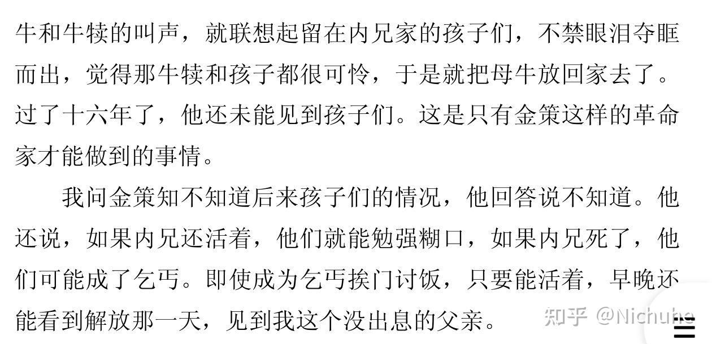<figcaption>△这是金一代回忆录里金一代记录的金策口述历史。金策在知道妻子父亲病逝后无暇多想，必须马上为后面打算。这里有些细节在记录时候被省略掉了。</figcaption></figure>
其实，金策同志最开始有短暂的一段时间里，应该是把自己的孩子带在身边照顾，但是在因为参加革命工作得罪了当地朝鲜宗教团体，且被宗教团体举报给军阀后，金策再次被捕。然后5月日本人又开始来找金策，为了自己和孩子的安全，金策不得不把孩子托付给内兄。
<figure data-size="normal">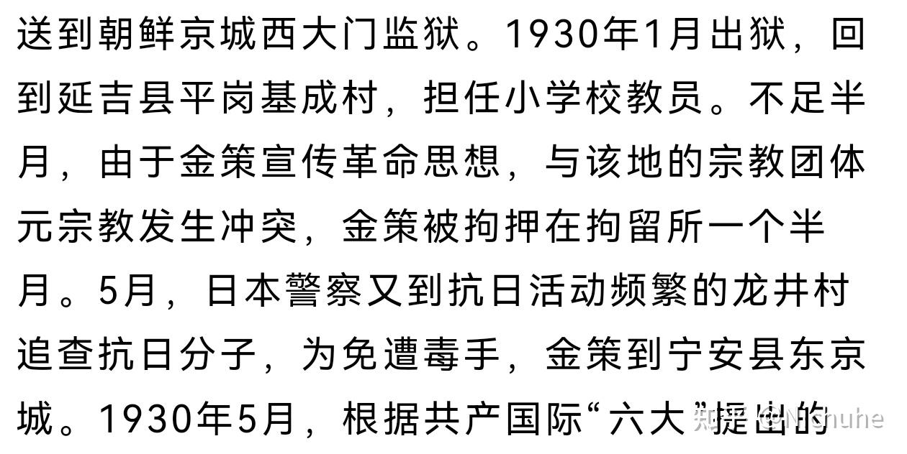<figcaption>△刚出狱就开始宣传革命，结果又进去了的金策同志。根据记录，我们大致能推测金策和孩子在一起应该只有两个半月（毕竟还有一个半月在监狱里）。不过按照时间，这时候他应该还没加入TG，不过快啦。</figcaption></figure>
2.一视同仁，重纪律。全昌哲同志曾经为了一位犯了错的同志求情，被金策同志教育，为违反纪律的人求情也是违反纪律，因此被罚站。但是金策后来还是以教育为主，小惩大诫。可以看出他宽严相济的行事作风。

3.擅长补衣做饭等内务，擅长照顾人。金策经常在革命期间让战士和交通员睡觉，自己借着烛火灯光给战士补衣服，足见金策同志自我生活管理能力极强。

4.同理心强。面对初次上战场失误的战士和因为过于严苛导致战士逃跑的政工人员，金策都以教育为主，拒绝 辱骂和严苛处置这些同志，有极强的同理心。  

 

＊看到评论区有网友问我，“三路军的领导不是李兆麟和冯仲云吗？”，我解释一下，冯仲云同志当北满省委书记时间很短，而且他因为在一些涉及北满省委和三路军生死存亡的重大问题上当了调和派，结果被两派人一起撤了职（这不是我说的，是李敏大姐回忆录说的）由张兰生同志（黑龙江籍满族）接任，1939年4月12日，中共北满临时省委在通河召开第二次执委全会，会议选举金策为省委书记。<b>金策同志实际上是北满省委书记任上最长的一位领导。</b>此外，1942开始，虽然北满省委撤销，金策等同志亦隶属于东北特支局，但是对于留守在东北没去苏联的同志们来说，金策仍然行使事实上的北满省委书记职权（也是黑龙江的党务最高领导人）。
<figure data-size="normal">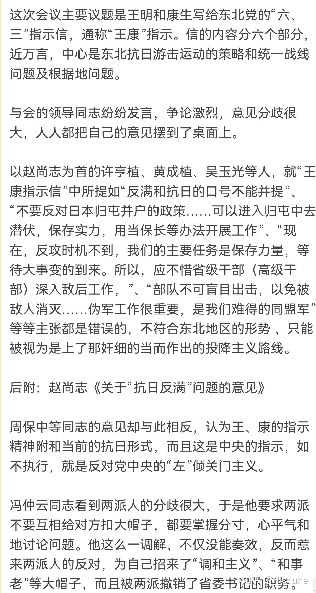<figcaption>△李敏大姐回忆录里的冯仲云同志被撤职始末</figcaption></figure>
此外，<b>金策正是李兆麟的政委，</b>李兆麟同志的夫人金伯文原名金贞顺，之所以改名为金伯文，这个名字也是金策取的。为什么金策同志取这个名字呢？就是因为金策同志眼里贞和顺代表旧妇女道德和压迫妇女，所以给金伯文大姐改了名。

＊看到评论区有人讽刺山沟里的省委驻地和金策同志担任省委书记这件事，我就想，你可以歧视朝鲜族，但是你改不了历史啊。这样，你要真不满意，不如让百度百科改内容和老金沟纪念地把陈雷同志的题词撤掉？
<figure data-size="normal">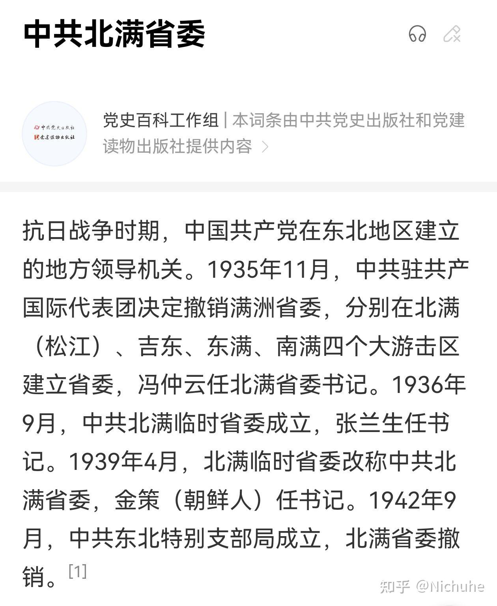</figure>
 
<figure data-size="normal">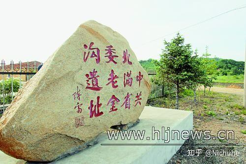<figcaption>△北满省委老金沟旧址，原抗联老干部，黑龙江省老省长陈雷同志的题字，他夫人李敏大姐是抗联老兵，12岁参军，打到21岁抗战结束</figcaption></figure><figure data-size="normal">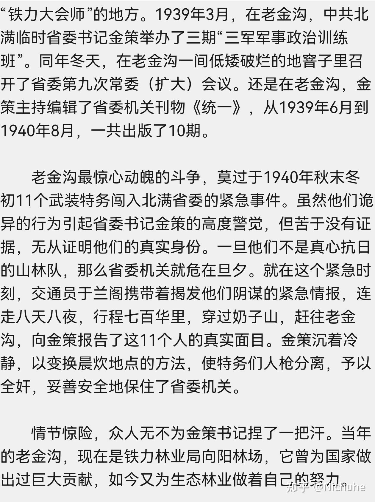<figcaption>△一些关于老金沟事件的叙述纪念文</figcaption></figure>
这个故事后来也被收纳入黑龙江党史里金策同志的个人介绍，也算是金策同志的经典故事了。
<figure data-size="normal">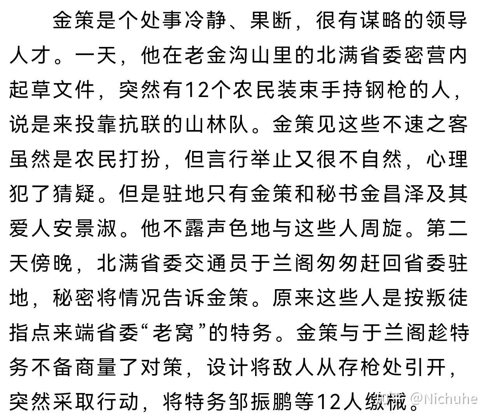</figure>
 
<figure data-size="normal"><figcaption>△黑龙江党史官方介绍，给金策同志单开了一个网页</figcaption></figure>
如果想详细了解老金沟1940年省委的惊魂事件，可以参考这个文章，更详细的事件介绍：

“八天八夜狂奔七百里送情报，抗联交通员大惊，敌人特务早到了一天”
<a data-draft-node="block" data-draft-type="link-card" href="https://link.zhihu.com/?target=https%3A//m.163.com/dy/article/I26UO6SB0553SDTZ.html" data-image="https://picx.zhimg.com/v2-3f7ba667cad27284067ea6251f4ea6bf.jpg" class=" wrap external" target="_blank" rel="nofollow noreferrer">8天8夜狂奔七百里送情报，抗联交通员大惊，敌人特务早到了一天_手机网易网</a>
 

没想到这么多人会喜欢这个文章，也感谢大家对于东北革命史的关注和热爱。我认为不分民族，所有为东北在抗日时期做出重要贡献的革命者都应该被大家记住，所以写了这个文章，感谢大家的关注。

---
导出时间: 2026-08-23 19:07