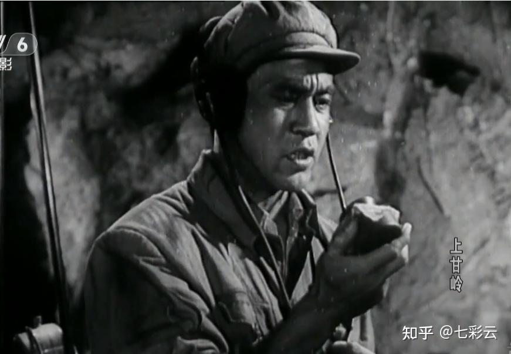
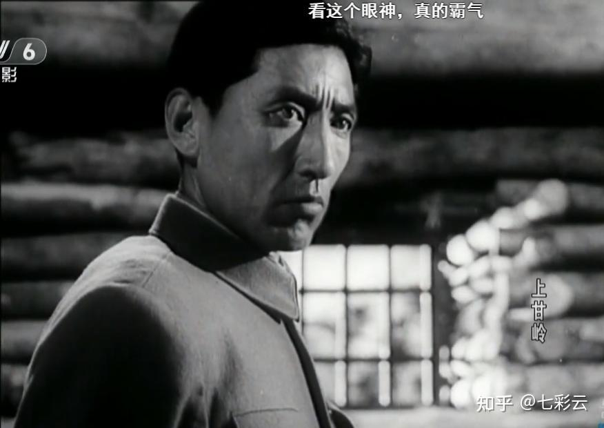
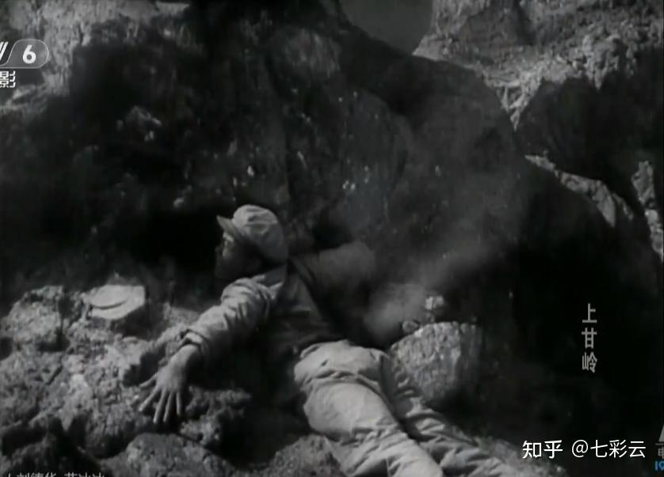
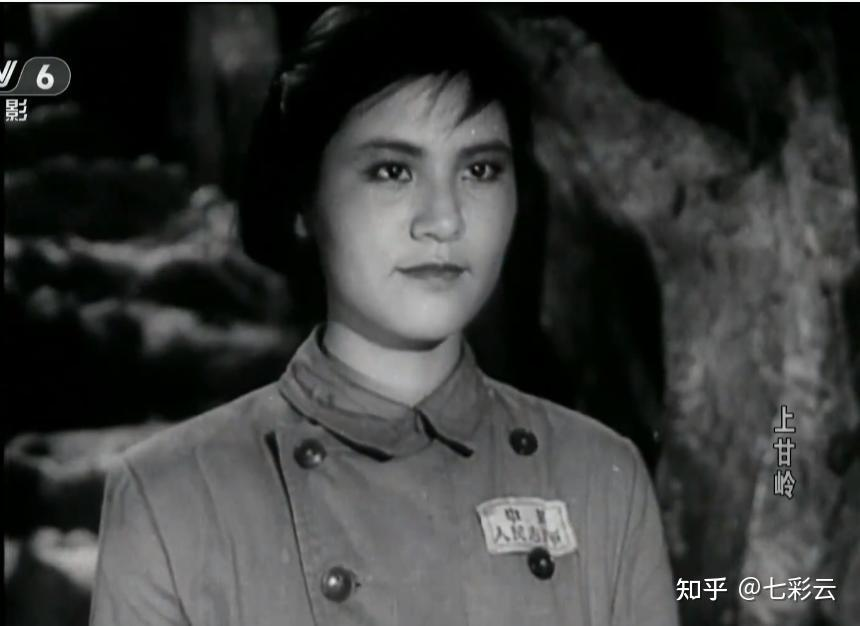
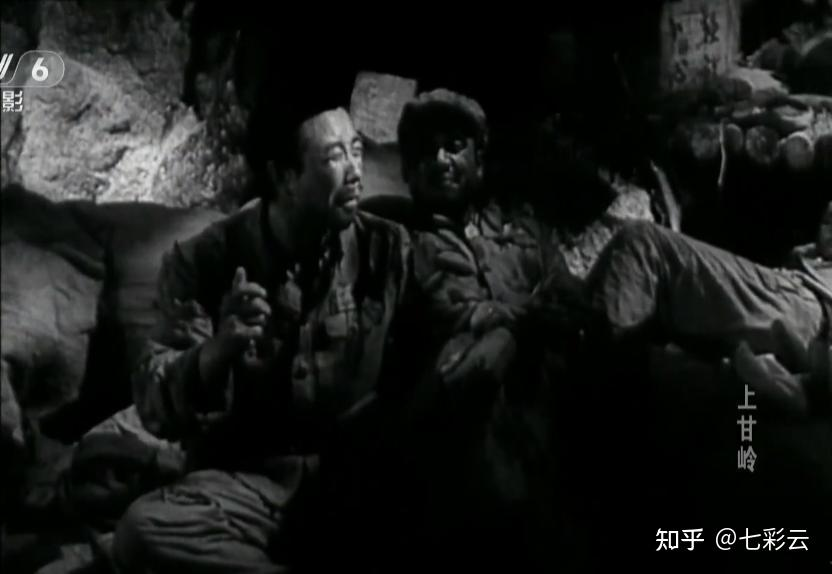
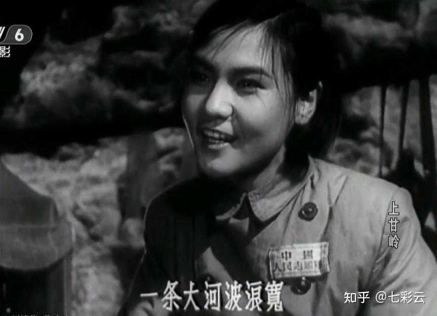
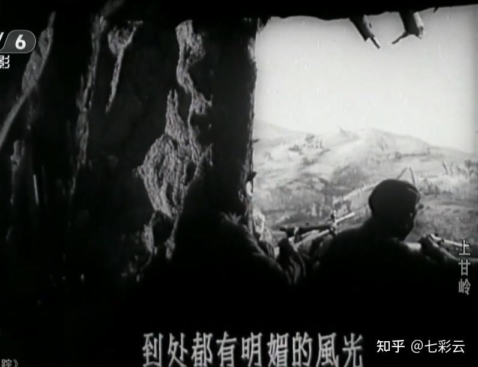
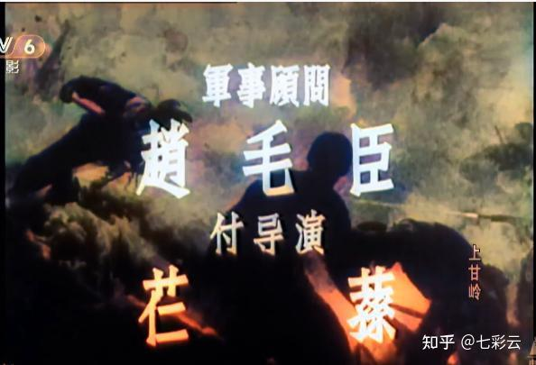
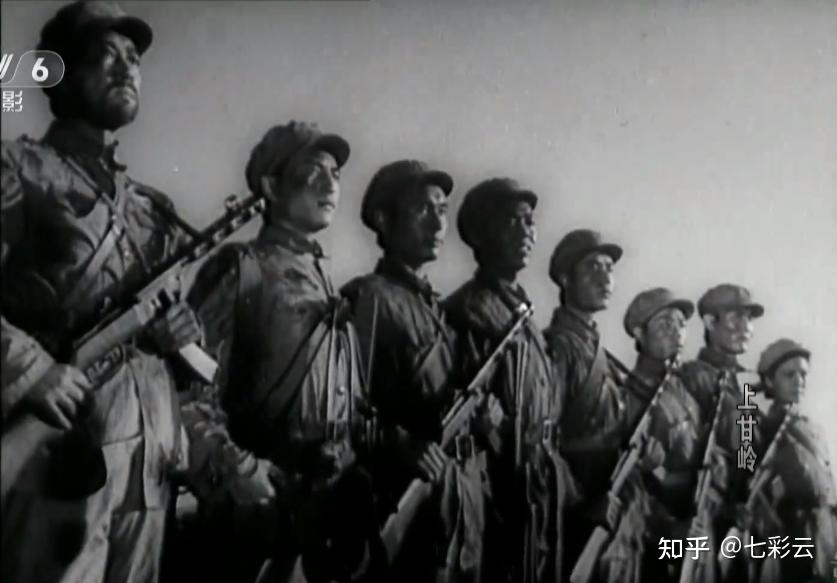

# 如何评价电影《上甘岭》？

| 项目 | 内容 |
|---|---|
| 类型 | answer |
| 作者 | 七彩云 |
| 收藏时间 | 2024-11-09 14:33 |
| 发布时间 | - |
| 收藏夹 | 抗联 |
| 原链接 | https://www.zhihu.com/question/358947395/answer/26957010988 |

## 摘要

1、《上甘岭》军事顾问是赵毛臣，他是上甘岭战役中四连指导员，亲自在坑道里指挥战斗的。拍摄电影时，他曾操作郭留诺夫重机枪射击配合录音，因此电影中你听到的重机枪声音都是他打出来的。 [图片] 2、片中八连连长张忠发的原型并不光是134团七连连长张计发，虽然他们名字差不多。他的原型还包括特功八连连长李保成和四连指导员赵毛臣等人，张忠发当过师长警卫员这段应该取自15军警卫连连长王虏，他曾经是秦军长的警卫员，牺牲在增援上…

## 正文

1、《上甘岭》军事顾问是赵毛臣，他是上甘岭战役中四连指导员，亲自在坑道里指挥战斗的。拍摄电影时，他曾操作郭留诺夫重机枪射击配合录音，因此电影中你听到的重机枪声音都是他打出来的。

 

 
<figure data-size="normal"></figure>
 

2、片中八连连长张忠发的原型并不光是134团七连连长张计发，虽然他们名字差不多。他的原型还包括特功八连连长李保成和四连指导员赵毛臣等人，张忠发当过师长警卫员这段应该取自15军警卫连连长王虏，他曾经是秦军长的警卫员，牺牲在增援上甘岭的路上。

饰演张忠发的演员高保成名字和李保成也相近，不过这是巧合。

 

 
<figure data-size="normal"></figure>
 

3、师长的原型是时任45师师长崔建功，他是东北军出身，在直罗镇战斗中被红军俘虏，后来成为开国少将。

 

 
<figure data-size="normal"></figure>
 

4、最后反击牺牲的通讯员杨德才原型并不是黄继光，而是用胸膛顶住爆破筒和敌人碉堡同归于尽的苗族小战士龙世昌。

事实上，整个上甘岭战役中和敌人同归于尽的战斗英雄记录下来的就有38人，仅仅在黄继光牺牲的那天夜里就有四人，除了黄继光之外还有赖发均、龙世昌和欧阳代炎。

所以，杨德才的原型也可以说并不止一个。

 

 
<figure data-size="normal"></figure>
 

5、卫生员王兰的原型一般认为是王清珍，不过她并没有进入坑道一直在后方工作，坑道里是没有女卫生员的。这一点在电影上映后被很多志愿军老战士指出，但和同样虚构的小松鼠一样，这也是导演为增加艺术感染力所做的设计。也有很多志愿军老战士看了电影之后非常感动，他们认为坑道里有女卫生员很好。

 

 
<figure data-size="normal"></figure>
 

6、一排长说的“望梅止渴”故事被他加工过了，事实上曹操的“望梅止渴”并没有吃酸梅这段，不过一排长改编的非常好，让观众听了嘴里都会有酸水。

7、乔羽在写《我的祖国》歌词时，导演沙蒙的要求是等什么时候这部电影没人看了，你的歌也有人唱，事实上乔羽做到了。

 

 
<figure data-size="normal"></figure>
 

8、《我的祖国》里的那条大河是不是长江？乔羽说是的，之所以不直接说长江，是因为几乎每个人的记忆里家乡都有一条大河，如果具体指到长江就狭隘了。

9、《我的祖国》作曲是刘炽，他和乔羽合作过很多次，比如《让我们荡起双桨》。《我的祖国》第一句“一条大河”非常经典，几乎一听就让人有想流泪的感觉。事实上，这句歌词的旋律来自于抗战歌曲《卢沟问答》的第一句：永定河~~~......

 

 
<figure data-size="normal"></figure>
 

10，最关键一条，电影中拍摄的坑道内景是在长影厂的摄影棚拍的，导演将坑道变宽了变高了，条件也变好了。事实上，电影放映后，军事顾问赵毛臣曾被幸存的战友责备：毛臣啊，你呆的坑道是这样的吗？

 
<figure data-size="normal"></figure>
 

现实中的坑道更窄、更小，人都站不直身体只能挤坐在一起。坑道内空气污浊气味难闻，缺少食物、药品和饮用水，有些重伤员送不下去在坑道里牺牲了。此外，坑道里遭受到的危险比电影中严重很多，战斗也更激烈。

 

 
<figure data-size="normal"></figure>
 

电影的原型之一特功八连先后增补过800多人，几乎是一个小团的人数，战后只剩下6个人，原来的八连只剩3人。

也就是说，现实的战斗比电影《上甘岭》要残酷很多，很多！

---
导出时间: 2026-08-23 19:07