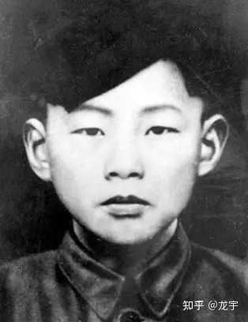

# 有哪些酷刑是人类的意志承受不了的？

| 项目 | 内容 |
|---|---|
| 类型 | answer |
| 作者 | 龙宇 |
| 收藏时间 | 2024-05-26 22:11 |
| 发布时间 | - |
| 收藏夹 | 抗联 |
| 原链接 | https://www.zhihu.com/question/266917806/answer/3510853043 |

## 摘要

[图片] 金方昌（1921年—1940年12月03日） ，中共代县县委宣传部副部长兼城关区委书记。 1938年2月，金方昌在民族革命大学二分校加入中国共产党。入党后，他向党组织强烈要求到抗日最前线工作。同年8月，金方昌从民族革命大学毕业，被派往晋察冀边区，分配到代县“牺牲救国同盟会”工作。 1939年冬，金方昌被调到地处日伪统治中心地带、抗日工作基础薄弱的代县城关区任区委书记，领导群众开展减租减息斗争。他率领武装模范队的战士们和…

## 正文

<figure data-size="normal"></figure>
金方昌（1921年—1940年12月03日） ，中共代县县委宣传部副部长兼城关区委书记。

1938年2月，金方昌在民族革命大学二分校加入中国共产党。入党后，他向党组织强烈要求到抗日最前线工作。同年8月，金方昌从民族革命大学毕业，被派往晋察冀边区，分配到代县“牺牲救国同盟会”工作。

1939年冬，金方昌被调到地处日伪统治中心地带、抗日工作基础薄弱的代县城关区任区委书记，领导群众开展减租减息斗争。他率领武装模范队的战士们和各村民兵，割电线，挖公路，伏击敌人的巡逻队，打得日军惊魂不定，龟缩在炮楼里不敢出来。日军和代县伪政权悬赏重金，捉拿金方昌。

在监狱里，日寇对金方昌威逼利诱，想要他投降日寇。为此，日寇为他开出了伪军县长的职位以及高额的薪酬。但金方昌不为所动，大喊日寇：“我宁死也不会当汉奸！”

利诱不成，日寇便决定屈打成招，逼迫金方昌说出情报。之后，日寇对金方昌使用了残忍的酷刑。<b>在使用酷刑上，日寇很有自己的一套。他们先是用皮鞭抽打金方昌，他们抽打得很猛，待金方昌身上有伤口后，他们又往金方昌身上撒盐。妄图用一招就使金方昌屈服。</b>

<b>刺骨的疼痛，让金方昌发出了阵阵惨叫，但他始终没有屈服。而后，日寇又对他使用了老虎凳、竹签、烙铁、电刑。但结果是一致的，金方昌在日寇的折磨下多次晕过去。但始终没有说出日寇想听的那句：“我招了，我招了，我投降！”</b>

被敌人打断一条胳膊，挖掉一只眼睛，但他没有屈服，仍蘸着自己的鲜血在墙壁上写下了“严刑利诱奈我何，颔首流泪非丈夫”14个大字，鼓励战友继续斗争。

1940年12月3日，金方昌被押上刑场。他昂然挺立，从容就义，年仅19岁。

 

 

 

给上级的最后一封信

“刘昂同志并转上级：我借大西庄村长十元钱，请还给他。我被捕是由左的冒险行为来的，对敌人没有充分的估计。这错误以教育其他同志，以免后患。我是死了，但丝毫没有对革命不忠实的地方，无论是在敌人的拷打中、利诱中，没有暴露一点秘密。牺牲是为了革命，没有什么。这是革命成功的代价。还有几件事要交待：

大西庄老百姓拿我一个饭包（皆为文件）。

大西庄我跑的沟里，有几封报告信和一支手枪，均请找见交给上级。

致最后的敬礼！

方昌

 

 

 

最后一封家书

“永昌、默生胞兄：

我于二十九年十一月二十三号在代县大西庄被敌捕。临捕时以手枪向敌射击，弹尽将枪埋藏后拼命北跑，敌有骑兵追上被捉。我高呼中华民族解放万岁，并向敌伪讲演。

我在敌人的牢狱里、法庭上、拷打中、利诱中始终没有半点屈服、惧怕。我在被捕后，没有丝毫悲伤。我只有仇恨和斗争。我知道我是为着民族的解放、全人类的解放而牺牲。我在牢狱中向这些罪人工作着。我没有想过我会活，也绝不会活，我只有死。不过我在死前一分钟都要为无产阶级工作。我要求哥哥们：

一 能坚决地为无产阶级革命奋斗到最后胜利的时候。这不仅事你们要有这种人生观，能为这种事业干，并且把自己锻炼成象列宁、斯大林、毛泽东一样会运用马列主义到实际中去。这样才能使自己坚持到无产阶级革命成功的时候。这里边还有这样希望，就是希望你们能在快乐的幸福的共产主义社会里生活。最后希望到那时候你们还存在。

二 要求哥哥们能把咱们弟弟侄侄们都能培养成无产阶级的革命战士。尤其是把七弟（尔昌）能培养成坚强的革命伟大人物。

哥哥们永别了！祝你们健康，致最后的敬礼！

你的弟弟

写于敌人的木牢

金方昌烈士的追悼大会上，代县全体回族人民送了一副挽联：今朝折箭哭烈士，明日祭君现敌头。

1942年，代县游击队在一次伏击战中，一举击毙双手沾满金方昌烈士和其他无数抗日志士鲜血的日本宪兵队长石谷。

抗日战争胜利以后，臭名昭著罪恶累累的郎豹武，暂时逃脱人民的惩罚。解放战争中，他投靠绥远国民军张朴部下任职。1949年4月，张部于绥远和平解放时以起义部队接受了中国人民解放军的改编。1951年7月，郎豹武自行脱离部队，化名潜逃，并使用滚油喷溅面容，变成麻子脸，以为熟人不易辨认，混入黑龙江铁县林区当了伐木工人。1952年7月，代县公安局历经艰辛终将其捕获归案。1953年被判处死刑立即执行。

---
导出时间: 2026-08-23 19:07