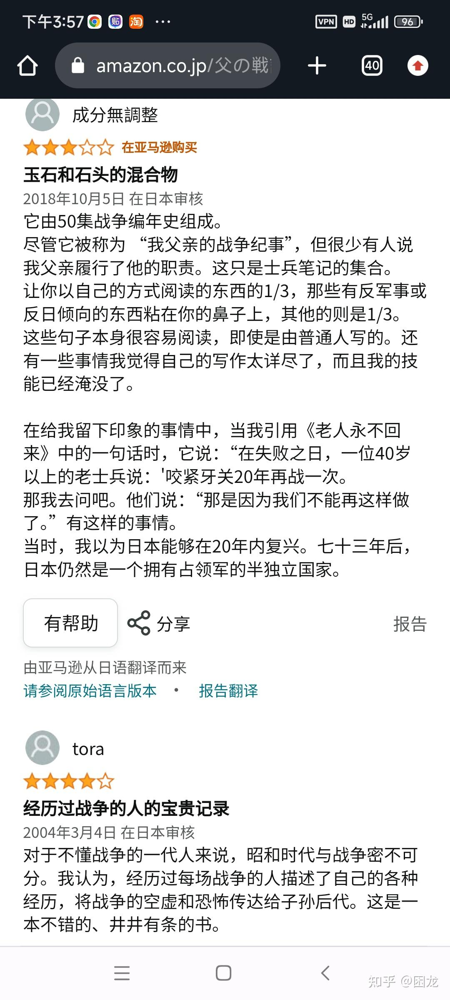

# 抗日战争日本人什么时候感觉自己要输了?

| 项目 | 内容 |
|---|---|
| 类型 | answer |
| 作者 | 困龙 |
| 收藏时间 | 2024-01-10 23:58 |
| 发布时间 | - |
| 收藏夹 | 抗联 |
| 原链接 | https://www.zhihu.com/question/629955645/answer/3357648778 |

## 摘要

1941年8月，华北某据点的鬼子想去偷袭八路军，结果被反打埋伏，损失惨重，有一名叫铃木的炊事兵也不知所踪。 本来嘛，死一个大头兵，对蝗国来说算不得什么。然而这据点里有个伙夫李太郎，这小子因为在伪政府当官的爹被共产党给锄了奸，所以铁了心跟着日本人干。 由于铃木平常对据点里的中国伙夫还不错，再加上他还有老婆孩子，李太郎深有物伤其类之感，极力请求据点派兵去寻找铃木，但是被长官拒绝了。于是这位双料孝子拿出三十…

## 正文

1941年8月，华北某据点的鬼子想去偷袭八路军，结果被反打埋伏，损失惨重，有一名叫铃木的炊事兵也不知所踪。

本来嘛，死一个大头兵，对蝗国来说算不得什么。然而这据点里有个伙夫李太郎，这小子因为在伪政府当官的爹被共产党给锄了奸，所以铁了心跟着日本人干。

由于铃木平常对据点里的中国伙夫还不错，再加上他还有老婆孩子，李太郎深有物伤其类之感，极力请求据点派兵去寻找铃木，但是被长官拒绝了。于是这位双料孝子拿出三十块钱（这是他十个月的薪水）托其他日军转交给铃木的家人，李太郎一带头，剩下两个伙夫也跟着捐了一点钱，把在场的鬼子都感动的稀里哗啦。

长官听说这事以后也很激动，多好的中日亲善榜样啊，就亲自向李太郎道谢。结果李太郎一声不吭听完，冲着据点长官字正腔圆地大骂了一声“八嘎牙路！”，就跑了，跑了……

这还没完，过了些天，李太郎又偷偷找到据点总务长平野，说他打听到铃木没死，而是被八路军俘虏了，八路军把他安排在附近一个村子养伤，守备很空虚。李太郎满心兴奋，觉得这回日本人肯定会出兵把铃木救出来了。

不料平野却犯了难，日军极为忌讳被俘，东条老贼写过一篇叫《战阵训》的玩意，里边提到“勿受生擒为俘虏之辱，勿死而留下罪人之污名。”

也就是说，铃木死了还能落个为国尽忠的名头进靖国神厕，否则即使生还回来，也还是要被枪毙，家人也会受牵连，就连所属部队主官也要跟着吃瓜落。

平野犹豫半天，架不住李太郎软磨硬泡，最后一咬牙，把自己的王八盒子给了李太郎，又向别人借了一支三八大盖，给剩下两个伙夫发了几个手雷，私自去救铃木。

他们到了地方，看见铃木在病房里待着，就又扔手雷又放枪，把八路军哨兵搞得一脸懵逼，趁机把铃木“救”了出来。李太郎背着铃木一路撤退，最后这一小伙人居然也成功撤回了据点。至此为止，这次《拯救鬼子铃木》的行动可以说十分圆满。

然而之前说过，日军还有战阵训这个苛刻的东西。被救回来以后，铃木丧魂失魄，一个劲地道歉，尽管平野安慰说帮他作证没有被俘，是被中国村民救助，可众人心里都清楚，纸包不住火，这事很难蒙混过去。

平野回房后不久，听到炊事班传来一声“boom”的巨响，他跑过去一看，铃木趴在地上，用手雷给自己来了一个物理意义上的肝肠寸断。（阴谋论一下，这时候为什么会让他一个人独处，还能接触手榴弹呢？）

不管怎么说，铃木死了，就这样结束了作为侵略军的荒唐一生。闻声而来的长官见到这一幕，长舒一口气，欣慰地笑了，铃木真乃武人の花啊，好死。

正痛哭流涕如丧考妣的李太郎听到这话，顿时勃然大怒，跳起来痛斥：共产党都给他看病包扎，现在人死了，你这个当长官的怎么还能说出这种话？！

接着李太郎说了句平野桑再见，又对长官恶狠狠骂了一句“东洋鬼子”，就扬长而去。在场的日本人呆若木鸡，愣是没有拦他。

最离谱的是，太平洋战争爆发后，平野又得到了李太郎这个老朋友的消息，只不过，现在他已经投了共，成了八路军的中队长……

平野在回忆录里这么描述：

“他在作战中豪胆，沉着，神出鬼没，以消灭‘东洋鬼子’为业，多次给日本军沉重的打击。”

故事结束。

荒谬吗？很荒谬。

我不知道日本人什么时候觉得自己要输，但我敢肯定，平野在这一刻已经知道了。

——更新——
<figure data-size="normal"></figure>
补充一下，这是本故事原著《父の戦記》亚马逊的评论区，它们依然存在，不曾消失。

---
导出时间: 2026-08-23 19:07