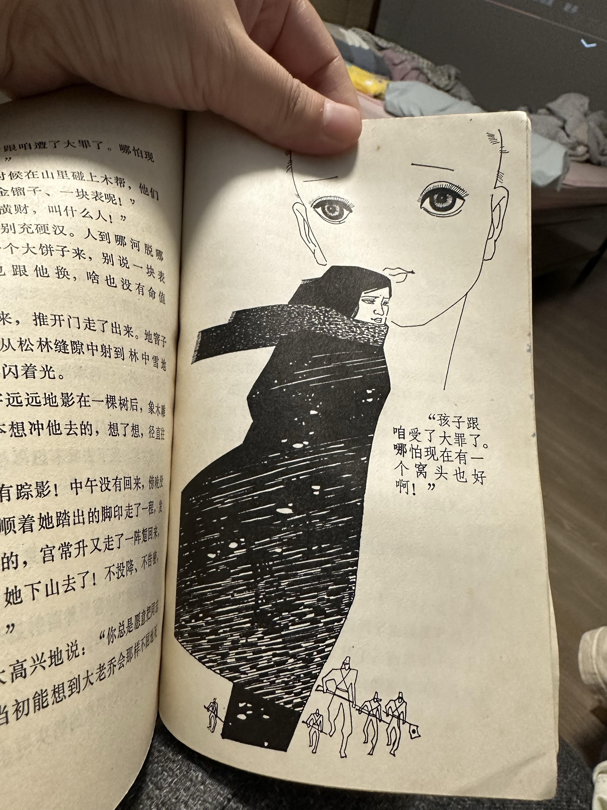
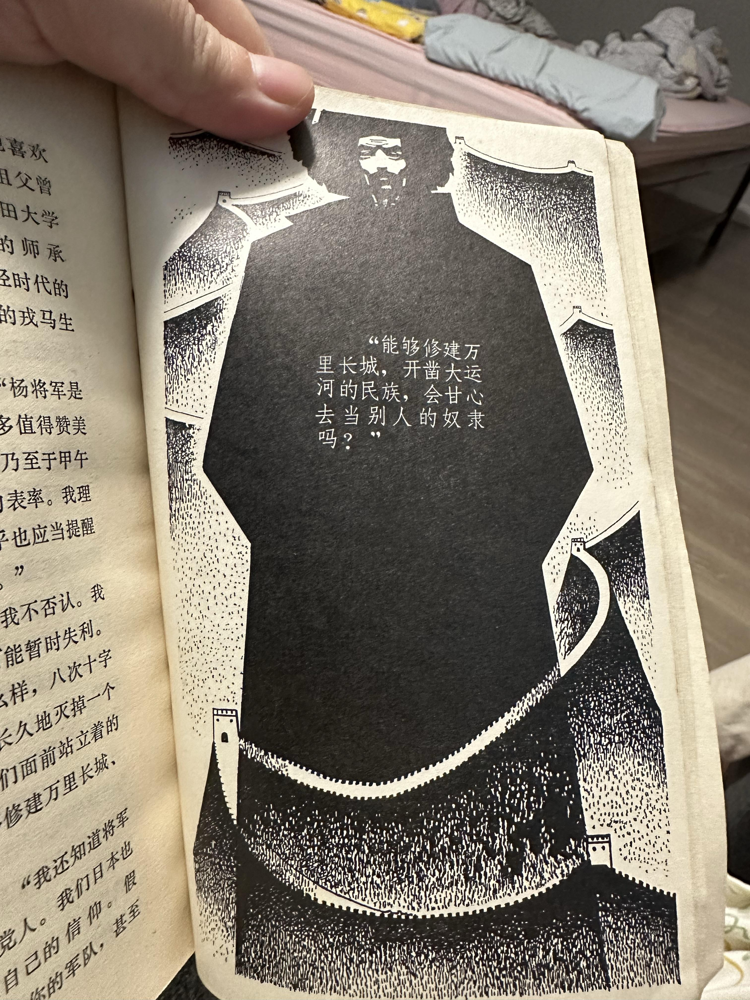
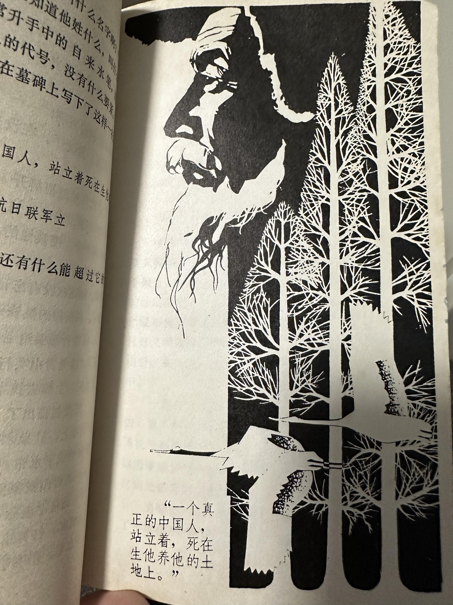

# 为什么杨靖宇的上下级和最亲近的人，最终成为叛徒？

| 项目 | 内容 |
|---|---|
| 类型 | answer |
| 作者 | 判官笔 |
| 收藏时间 | 2023-06-24 11:24 |
| 发布时间 | - |
| 收藏夹 | 抗联 |
| 原链接 | https://www.zhihu.com/question/56092889/answer/3087405038 |

## 摘要

《落霞》这本书我买到了，有几幅插图。 [图片] 这是宋大嫂孩子挨饿，就是那个烈士遗骨，女共产党员的感叹。 [图片] 这是日本人问杨靖宇为何不投降，他其中一句回答。还有很多震撼内容。真的震撼。 [图片] 这是杨靖宇死亡的姿势，站立的。 违反常识的是，杨靖宇就不是一个军人。只是被迫拿起枪的有良知的中国人。 其实那时候并不是人人都有这个勇气的。 因为不愿忍辱偷生，一个河南人跑到东北去参加抗日游击战争。 我找到了那个吃很多饭干很多活，骗日…

## 正文

《落霞》这本书我买到了，有几幅插图。
<figure data-size="normal"></figure>
这是宋大嫂孩子挨饿，就是那个烈士遗骨，女共产党员的感叹。
<figure data-size="normal"></figure>
这是日本人问杨靖宇为何不投降，他其中一句回答。还有很多震撼内容。真的震撼。
<figure data-size="normal"></figure>
这是杨靖宇死亡的姿势，站立的。

违反常识的是，杨靖宇就不是一个军人。只是被迫拿起枪的有良知的中国人。

其实那时候并不是人人都有这个勇气的。

因为不愿忍辱偷生，一个河南人跑到东北去参加抗日游击战争。

我找到了那个吃很多饭干很多活，骗日本人一顿饭却不投降的，骂口不绝而死的，叫大老乔。

还有一个小姑娘，隐瞒女孩身份加入抗联的，其实大家都知道她是女孩。

——分割线——

可能答非所问了。

我80后，童年看过一本小说《落霞》，张笑天写的，讲东北抗联覆灭的过程。那时候已经跟上级失去联系了。周围的人一个个做了叛徒。

看的很绝望，就是杨靖宇一步步被逼上绝路的过程。

他只是个纺织专业的学生，只能扛起枪上战场。他也有家庭，后来遇到了有学历有颜值的红颜知己，尽管跟家人失联多年，他却理智地打住了。

私德高尚。

我印象最深的是两个人。

一个是杨靖宇手下的抗联战士，吃四个人的饭干四个人的活。

他很能吃饿的受不了，叫嚣着饿死了，他去投降。

手下要打死他，杨靖宇阻止了。

他被日本人抓住后，叫日本人拿点吃的就交代。

他连吃了几个人的饭量，看的人目瞪口呆。

他却什么也没交代，破口大骂慷慨就义。

一个是抗联领导的老婆，老领导已经就义了，嫂子带着孩子来投奔，杨靖宇就接收。

有次敌人扫荡，孩子哭了，马上就要吸引鬼子过来了，他们藏身的地窨子要暴露。

哄也哄不住，女人饿的也没有奶水，众目睽睽之下，女人只得狠心把孩子掐死。

看到这段我泪目了。

杨靖宇不忍让革命烈士唯一的后代死，把孩子抱起来到外面，孩子最后没哭了，躲过一劫。

当然了，孩子最后仍然死了。抗联覆灭了。

他死的时候，日本人怎么也不明白弹尽粮绝那么多天是怎么活下来的。

日本医生解剖了才发现胃里都是棉籽，树皮。医生都哭了。

日本指挥官给他恭敬地敬了军礼。

这世界上有一种人，明知不可为而为之。他们大概是傻子吧。

可是若不是那么多傻子，我们怎么能得到胜利呢？

很多事是做了才有希望。

---
导出时间: 2026-08-23 19:07