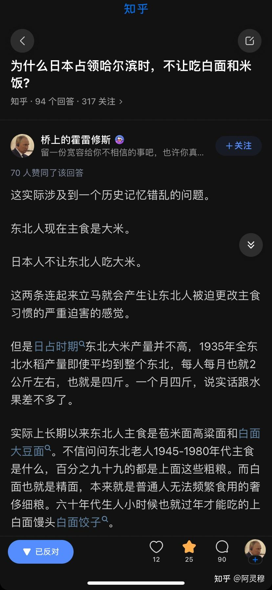
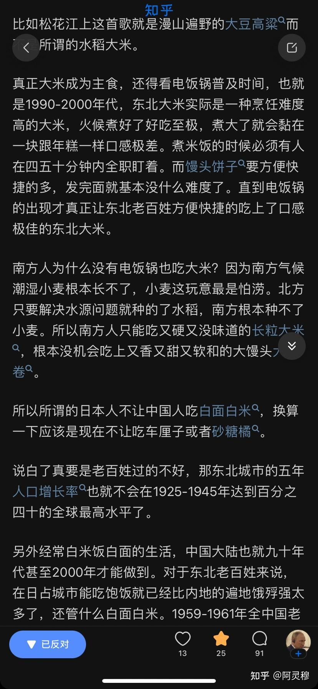
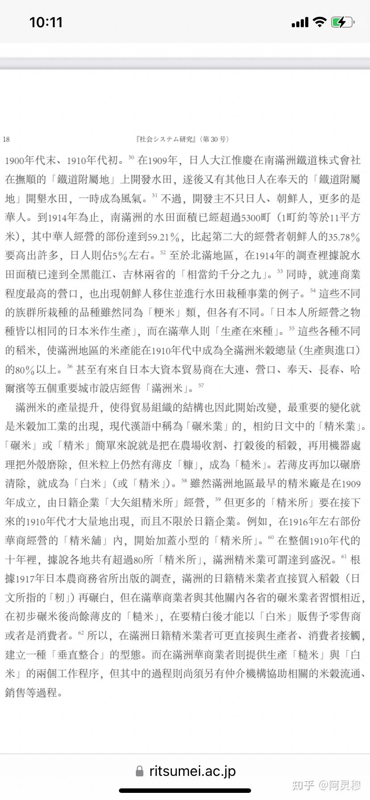
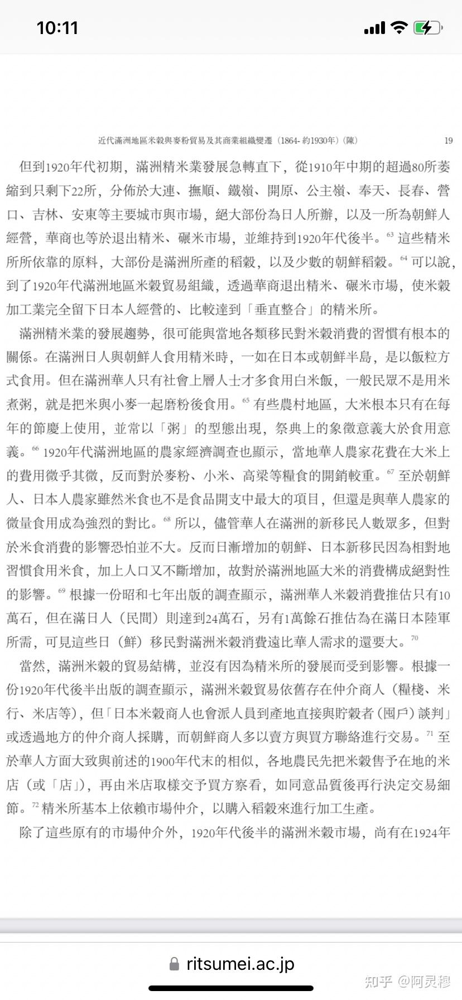
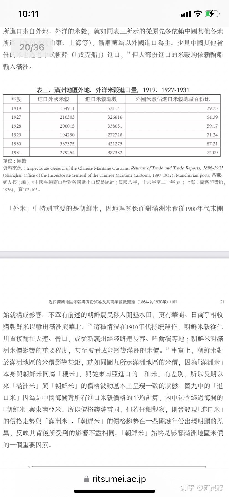
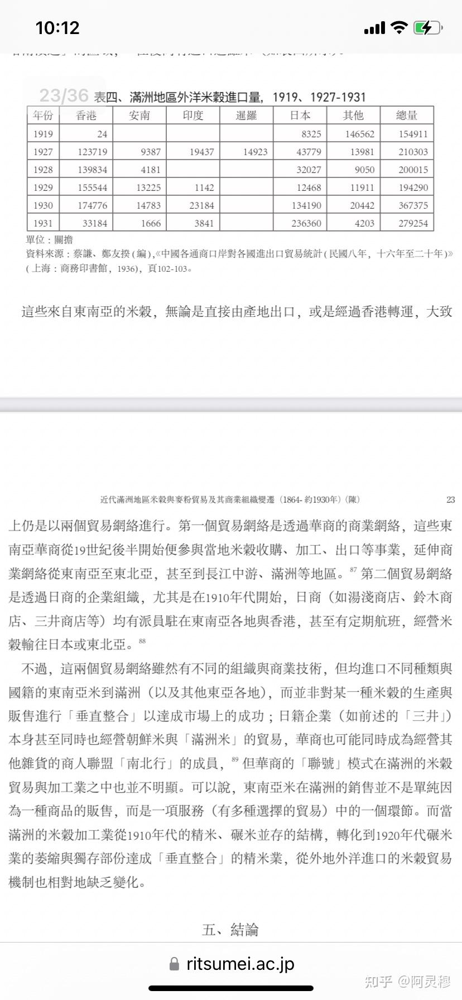

# 为什么日本占领哈尔滨时，不让吃白面和米饭?

| 项目 | 内容 |
|---|---|
| 类型 | answer |
| 作者 | 阿灵穆 |
| 收藏时间 | 2023-02-11 10:39 |
| 发布时间 | - |
| 收藏夹 | 抗联 |
| 原链接 | https://www.zhihu.com/question/309165907/answer/2887546673 |

## 摘要

很有趣，一个在日华人不知道“经济犯”和“协和面”， [图片] [图片] 也很惭愧，作为一个满洲国哈尔滨警察厅警尉警衔的特务的重外孙子，我看不懂日语。 那咱们看看别人写的东西可以不可以呢？ 以下内容来源自台湾国立成功大学历史系副教授陈计尧于2015年三月发表的《近代滿洲地區米穀與麥粉貿易及其商業組織變遷 (1864- 約1930年)》，对大米面粉贸易进行了研究。 [图片] 划重点：根据满铁调查报告，1914年南满洲地区水田面积已经达到了五千三百町，几…

## 正文

很有趣，一个在日华人不知道“经济犯”和“协和面”，
<figure data-size="normal"></figure>
 
<figure data-size="normal"></figure>
也很惭愧，作为一个满洲国哈尔滨警察厅警尉警衔的特务的重外孙子，我看不懂日语。

那咱们看看别人写的东西可以不可以呢？

以下内容来源自台湾国立成功大学历史系副教授陈计尧于2015年三月发表的《近代滿洲地區米穀與麥粉貿易及其商業組織變遷 (1864- 約1930年)》，对大米面粉贸易进行了研究。
<figure data-size="normal"></figure>
划重点：根据满铁调查报告，1914年南满洲地区水田面积已经达到了五千三百町，几乎供应了东三省地区80％的大米消耗；
<figure data-size="normal"></figure>
划重点：在日华人说东北老百姓在过去以杂粮面为主食，这地方说的没毛病；

但是请注意，满洲国可不止沦陷后苟活的东北本土老百姓，还有日本移民和朝鲜移民——日本移民和朝鲜食用大米的比重，确实比当地东北老百姓高很多；而文章还提到，“在满洲华人只有上层人士食用”；

而且结合上下文，稻米在10年代刚刚大范围种植的时候，参与种植的为满洲国地区东北老百姓为主，但是大米“精米”加工企业，却长期把持在日本人和少部分朝鲜人手中。

——那我不禁要问了：普通老百姓为啥不吃大米么？是因为不喜欢么？

而且在日华人忘了一件事：

即便本土大米产量少，那遍地是牛奶和黄金的“王道乐土”，他难道就不能进口么？

实际上还真能，从山东到上海，甚至再到台湾和朝鲜、印度、越南、泰国，都有往我大满洲进口的记录。
<figure data-size="normal"></figure>
 
<figure data-size="normal"></figure>
那现在我再问一句：

满洲国的老百姓不吃大米，是因为不喜欢么？

 

所以这就是我为啥总提议国家应该系统研究并且对中小学生公开对于伪满政权研究的资料，甚至可以写进教科书；

以前好些人在扭曲历史的时候，比如李 诏安 硕，曾经在别人说伪满没有某某某的时候，广泛普及甚至夸张伪满很多充足的某某某；

现在变了，

大家都觉得确实伪满很多资源物产、但是日本军国主义份子就是不给你吃给你用，甚至还要从你手边抢的时候，另一帮人开始扯说，根本不是这样，伪满时候大家都很穷，人家根本不是抢来的，你根本没有何谈是人家抢的呢，那都是xxxx给你灌输的仇恨思想。

反正作为一个满洲国特务的重孙子，我是特别喜欢看这种当年在“王道乐土”之中的耗材们的后代，一边为太君粉饰，一边骂我小粉红。

参考文献：

［1］陈计尧.近代滿洲地區米穀與麥粉貿易及其商業組織變遷 (1864- 約1930年)［EB/J］社会システム研究.

<a href="https://link.zhihu.com/?target=https%3A//www.ritsumei.ac.jp/acd/re/ssrc/result/memoirs/kiyou30/30-01.pdf" class=" external" target="_blank" rel="nofollow noreferrer">https://www.ritsumei.ac.jp/acd/re/ssrc/result/memoirs/kiyou30/30-01.pdf</a> 2015.

 

相关回答
<a data-draft-node="block" data-draft-type="link-card" href="https://www.zhihu.com/question/39900235/answer/1414180883" class="internal">在“伪满洲国”生活是怎样一种体验 ？</a>

---
导出时间: 2026-08-23 19:07