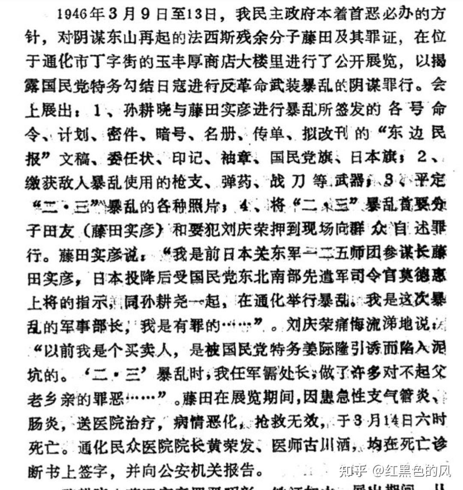
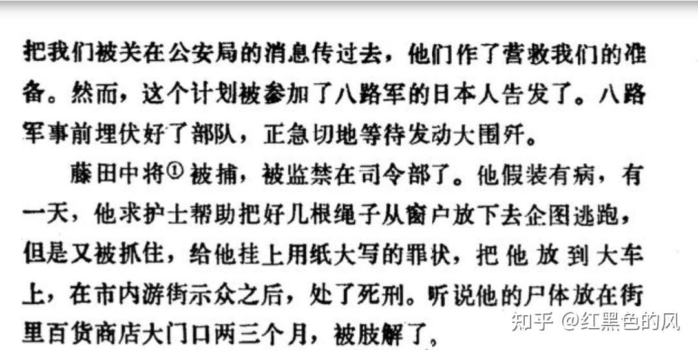
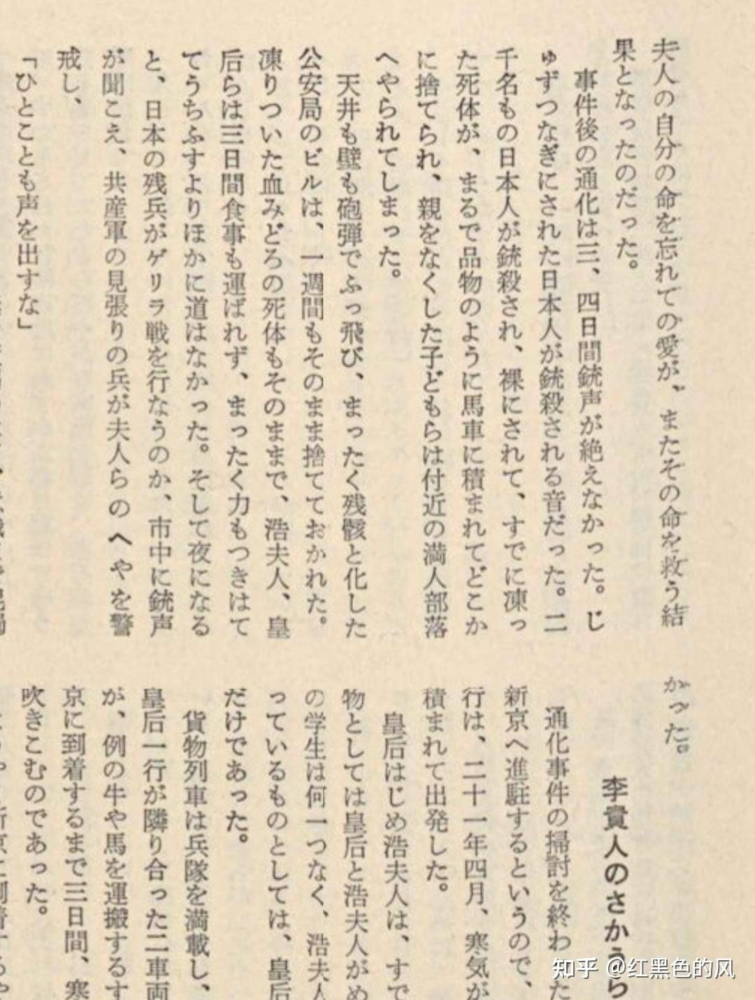
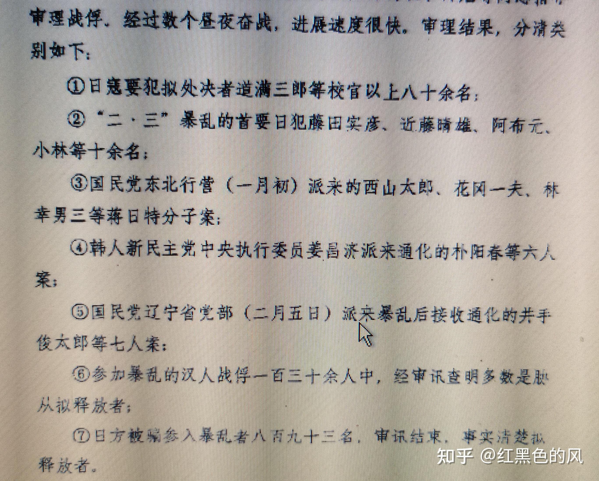
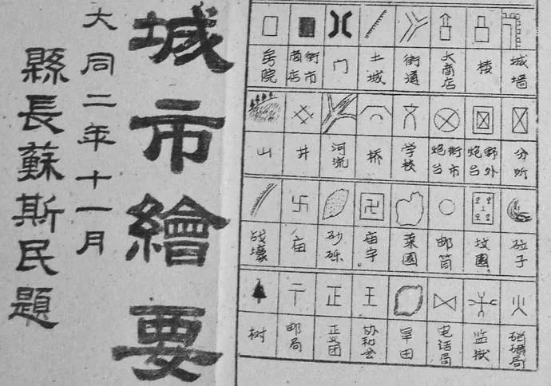
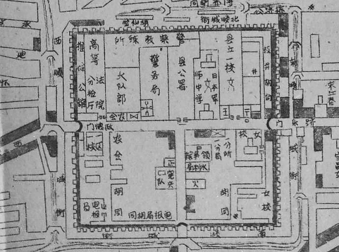
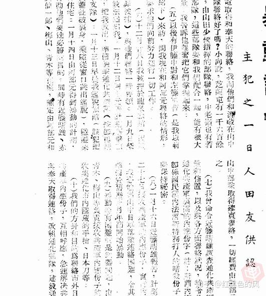
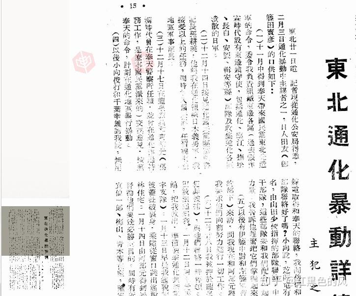
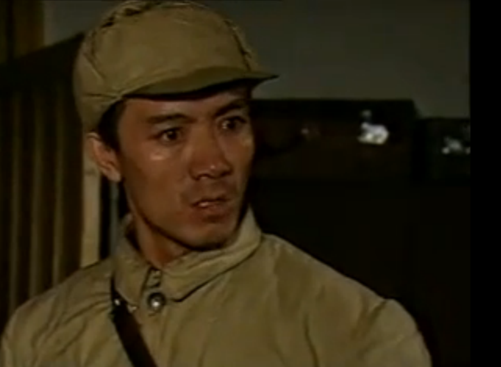

# 你们是如何看待通化2.3事件的？

| 项目 | 内容 |
|---|---|
| 类型 | answer |
| 作者 | 红黑色的风 |
| 收藏时间 | 2016-12-07 15:58 |
| 发布时间 | - |
| 收藏夹 | 抗联 |
| 原链接 | https://www.zhihu.com/question/41376418/answer/134760295 |

## 摘要

这是一个老回答，主要是有人问藤田实彦和医院院长柴田的下场更新一下。藤田呢，肯定是死了，但是怎么死目前大概有三种说法： 1.病死，当时黄荣发院长、日本人古川洒、押川医生做的尸检。 [图片] 藤田は痩せてやつれた体に中国服をまとい、風邪をひいているのか始終鼻水を垂らしながら「許してください。自分の不始末によって申し訳ないことをしてしまいました」と謝り続けた。心ある人たちは見るに忍びず、百貨店に背を向けた。 3月15…

## 正文

这是一个老回答，主要是有人问藤田实彦和医院院长柴田的下场更新一下。藤田呢，肯定是死了，但是怎么死目前大概有三种说法：

1.病死，当时黄荣发院长、日本人古川洒、押川医生做的尸检。
<figure data-size="normal"></figure>
 
<blockquote data-pid="YwJEimDU">藤田は痩せてやつれた体に中国服をまとい、風邪をひいているのか始終鼻水を垂らしながら「許してください。自分の不始末によって申し訳ないことをしてしまいました」と謝り続けた。心ある人たちは見るに忍びず、百貨店に背を向けた。 3月15日、獄中で肺炎のため死去。享年45。その遺体は市内の広場で3週間さらされた。</blockquote>
2.中毒，这个没什么证据，只有日本人这样说。

3.枪毙后五马分尸
<figure data-size="normal"></figure>
 
<figure data-size="normal"></figure>
不过过程如何结果都一样，因为藤田是列入枪毙名单的，跟他一起当过展览的什么近藤晴雄、刘庆荣之类都吃枪子了。
<figure data-size="normal"></figure>
那个柴田其实有两种说法，第一个宽大了（不知道是不是跟被释放的护士长柴田朝江搞混了，这两个还是同族），第二个说法是9月在临江枪毙。

通化事件，也就是二三暴乱，性质是蒋日勾结发动的大规模叛乱事件，通化及通化周围的日本人、蒋伪特务、被策反的叛徒都参与其中，你得先了解二三暴乱的通化情况。
<figure data-size="normal"></figure><figure data-size="normal"></figure>
 

<b>居留通化的日本人概况</b>

通化市的日本人口约有八千余人，绝大部分是官吏、军人、商人，劳动者次之。其中如清水、大林、大仓等二十八个株式会社货组合，亦有几家医院、学校、妓院等。军事方面有山本部队等约三个师团驻守通化。抗战结束后，上层人物大多逃亡，仍留居通化的还有三千多人。大部分军人为下级军官士兵，将校级数量不多。这些军人，如军事指挥官安井少将。抗战胜利后，这些人有的向当地人卖军马、武器、军用品谋生，有的怀有“二十年复兴满洲国”的复仇之心，将武器弹药埋于地下，妄图伺机而动，东山再起。特别是一九四五年八九十月之间，通化附近的日本居民成群结队逃亡到通化，因而，市内的日寇投降军、潜伏人员、伪官吏等骤增。其中有被我军缴械的日本关东军六千多人。从伪都新京方面过来的官吏，既有前满铁总裁木村卓一、伪宫内府次长荒井静雄、近卫处长大泽寅一、参议府参议高桥康顺、国务院参事官松山处吉等三百多人。到一九四五年年底，通化日本居民达到五千八百五十八户，人口一万六千多人。他们多是居于市内日任聚集的龙泉区。根据当时户口统计，龙泉区有一千七百六十五户，五千六百三十余人；东昌区有三百七十多户，一千五百六十六人；中昌区有七百三十四户，三千五百九十四人；启通区有二百七十五户，九百二十七人；二道江区有二千零一十一户，四千九百三十五人，郊区尚有日本人、潜伏军数目不详。

在通化、临江、蒙江、长白、抚松一带，有富永中将为首的关东军三千多人，从海龙、四平一带的流寇部队富士部队残部，有藤田实彦大佐的一二五师团残部，潜伏老爷岭山脉南段的林子三千多人。

一九四五年十二月一日，通化市政府发布文告，明确指出“日本帝国主义虽已投降，但绝不是日本无产阶级的失败”，号召“中日人民必须永久团结，以建设新东北”，文告阐明我民主政府立场、政策“彻底肃清日本法西斯残余势力，挽救其劳苦大众，争取解放。对贫病者是以显厚之救济及医疗，创设医疗所，对贫困患病者免费治疗，保护善良的日本居民生命财产安全，保证日本居民最低限度的生活，并为一般劳苦大众介绍职业，尊重其民族地位及风俗”

民主政府建立三个月期间，发放救济高粱米八千余斤，玉米面三万四千四百余斤，救济棉被六十六套，救济金十九万元，受救济者达一千七百二十六人，解决大量日本贫民生活问题，对在我政府及其他部门工作的日本工程技术人员，生活均有优待。因此，受到大多数日本居民下层阶级的拥护，在政治上趋向我民主政府，之后的暴乱中支持我民主政府，揭发隐藏的日本战犯。此外，部分日本人受法西斯残余蒙骗、武士道精神流毒影响，或处于民族复仇心理，或抱有再度复兴野心，与国民党反动派勾结，试图采取暗杀、爆炸、投毒、暴乱等手段推翻我民主政府，重新建立日本法西斯的基地。

<b>蒋日伪勾结</b>

正如日本奉天特务头子池田的自述“为了再起，我们就得依靠、利用国民党”，国民党辽宁省党部执行委员会主任委员李光忱给藤田实彦去电“世界大战结束后，不禁同庆之至，通化方面的日本军呈现坚持立场，不被八路军缴械，至今保持其势力，是为中国东北省之协力作用，此完全于贵官之英明指挥，今后亦互相联系，为建设东北共同迈进”

当时有许多日本法西斯残余分子与国民党达成互助协议，相互勾结，改名换姓，或以难民为掩护，潜伏矿山、林区，借着稳定东北局势的情况下，混入国共两党的维稳机构中。

<b>日本人反共活动</b>

在通化，伪满洲国民政部次长筱野破魔夫，混入“日解联”，窃居驻通化支部长职务。伪满洲协和会参事官千叶幸雄则混入通化日本居民管理委员会，窃居救济员职务。日本关东军一二五师团参谋长藤田实彦，混入林子头碳坑，之后混入日解联工作，加入国民党通化县支部。国民党辽宁省党部李光枕联络员近藤晴雄也是日本、国民党双面特务。日解联办公室成为这些人的活动据点。

我通化解放区部分日本人，表面遵行民主政府法令，进行日本人民事务工作，以合法身份为掩护，暗地收容日本战犯，以保护日本人民财产安全为由，秘密结社，如夜警班、猎枪会、十日会、大东亚联盟等。

国民党特务与通化日本复兴分子勾结之后，与一九四五年十二月二十四日，以渡边勋为倡导者，联合通化的日本法西斯残余筱野派、相川派、水谷派为核心，以日解联通化支部支部长筱野破魔夫、伪桓仁县副县长涌口武俊、为宫内府溥仪翻译官道满三郎、伪通化省公署建设股技师水谷英男、伪通化省公署经济科属官相川力为首，成立“国日特暗杀团”。他们约定以日解联通化支部办公室为活动中心，在筱野破魔夫支部长办公室，相川力住宅前后秘密召开九次会议，制定行动纲领、计划、方案。

之后搜获该组织文件可知：

1.行动纲领

依靠国民党，利用日本人八一五之后的亡命主义，以保护日本人民的利益为借口，宣传日本满洲二十年后再度复兴的野心，采取暗杀手段，迎接国民党中央军接收通化。渡边勋发言“国民党很快就来通化，为了表示我们的忠诚，不杀是不行的”

2.组织及分工

筱野派：樋口、道满、福原、武藤、林田、泽山、千叶等

相川派：金高、高尾、加藤、西川、鹤谷等

水谷派：松村、木下、新村等

首领为：渡边勋、筱野破魔夫、相川力

行动组织者：相川力，水谷英男

行动计划者：渡边勋，道满三郎

执行任务者：樋口武俊

武器筹备：宫本富士雄

经费筹备：筱野破魔夫

3.行动计划手段

一、采取集中暗杀手段，暗杀对象是共产党通化党政军领导干部，时间是一九四六年一月五日，地点是大光明剧场慰问演出大会。暗杀名单有：中共辽东省通化省分委书记、东北民主联军通化部队政委吴溉之，安东省通化区行政督察专员公署专员蒋亚泉，通化市市长樊鹏飞，通化支队司令员刘东元，行署公安处处长刘甄渺，公安局长李剑云。

二、采取分散暗杀手段，暗杀对象主要是我方工作日本人，名单有：山田（此人两面派，暗杀时很快就投降）、海志泽、内海勋、赤田山助等七人。

4.行动退路

一旦行动失败，生存者即刻逃亡奉天平安剧场梳开本部为国民党辽宁省党部，会有安排藏身之地，另可逃亡到五道江、石人、磐石等地，到尚未解除武装的日本潜伏军隐藏。

根据被捕后的渡边勋供认，一九四六年一月二日遭刺杀身亡的内海勋为日解联工作人员藤田武男、冈田、松田刺杀，杀死内海勋之后，对日本居民散步谣言：内海勋为朝鲜义勇军所杀，以煽动日本居民的不满情绪。

内海勋被杀事件受到民主政府高度重视，经过我公安机关侦察所获的证据，证明内海勋被暗杀与国民党、日本特务有关，暗杀组织为日本战犯为核心，以日解联为合法外衣，进行反革命活动。

因此，通化市政府下令解散日解联通化支部，成立通化日本人民管理委员会，经过侦察及日本下层贫苦居民的揭发，逮捕日本法西斯残余中尉以上战犯一百二十人，其中有渡边勋、道满三郎、相川力、伪宫内府总务处长小原一二夫中将，伪国务院秘书官林田英士郎，伪宪兵队长田中，伪宫内府警务处总务科长竹村一郎，伪监察厅次长金田秀雄等。缴获枪支弹药、战刀等武器，重新控制了被日本人掌握的坦克、大炮、飞机等。

但由于我方工作人员山田、西川、佐藤、山口等人，实际上与藤田实彦勾结，秘密透露情报，未能将其全部捕获。

<b>通化国民党的反共活动</b>

通化地区国民党的反共活动主要是国民党通化县党部执行委员兼书记长赵殿礼和辽宁省通化县党部执行委员会主任委员孙耕尧，其中赵殿礼曾因抗日反满被捕两次入狱，认为自己是抗战英雄，而孙耕尧曾经当过伪通化省王道书院院长即汉奸，赵殿礼认为孙耕尧是汉奸，不配当国民党，这两派勾心斗角、明争暗斗。

尽管赵、孙二人在表现形式不同，反共倒是一致的，但是赵殿礼在十月初的反共活动被苏联人得知，苏联以此向国民党施压，通化市公安局抓捕暴动的国民党。赵此人为人又胆小，在通化英额布村，赵部团伙放弃暴动，而赵殿礼则去长春罗大愚处工作。

赵殿礼去长春第二天，王祥从奉天受李光枕命令任命赵殿礼为通化军事指导员进行武力反共斗争，王祥不知道通化国民党内部斗争，将沈阳一行全盘告诉党部残余胡世良、赫天海等人，他们从地里挖出党部印章，由执行委员李宗林主持，以赵殿礼名义，给地方武装团队杨景韶、富连元，于新，抚松的文德喜，辑安的何学福等伪军警土匪下了任命状，派出李宗林、邱长发等人去各地活动，收编地方伪公安队，改编伪国民党先遣军第一旅，五道江于信为第一团；大栗子铁路警察护卫分团冯殿刚为第二团；临江县公安大队曲冠军为第三团。计划于十一月四日进攻通化。

但是，王祥很快就被我通化公安机关逮捕，赫天海逃亡长春，暴乱失败。

此时孙耕尧吸取国民党前次暴乱失败教训，认为仅仅靠人民正统观念行事是不行的，便于十月二十五日，带着委任状跟专员公署蒋亚泉洽谈公开党部适宜，以双十协定精神为掩护，孙耕尧从日本法西斯残余势力发展力量，如阿部元、神田、大正丰、前野、千叶辛雄、渡边勋、大原菊池等加入国民党，以此为二三暴乱的骨干力量。

此外，李光忱还派国民党董仲、董潜等潜入通化建立地下组织，配合国民党党部活动；国民党辽宁省党部派出三青团地下工作团团长刘鼎新、邵裕国潜入通化发展组织。

<b>蒋日合流，订立协议，阴谋制造暴乱</b>

经过近藤晴雄、刘正修与孙耕尧、藤田实彦密谋，于一月十五日在孙耕尧家召开密谋会议，成立“暂编东边地区军政委员会”，其组织如下：

主任委员：孙耕尧

副主任委员：刘玉清

委员：刘亦天、杨振国、邓觉非、田耕野、迟文玉、藤田实彦、近藤晴雄。

政治部部长刘亦天、刘玉清，副部长邓觉非。总务处长刘亦天，民政处长杨振国，保安处长姜基隆，财务处长刘靖儒

军事部部长藤田实彦，副部长迟文玉，参谋处长郑乃樵、于正福，副官处长关崇芳，军需处长刘庆荣，戚相云，军法处长周洪汉，刘涤新，赵宪福，军械处长王桂馨，杨景春，军医处长柴田久大尉

这个军政委员会建立后，计划于一月十七日举行暴乱，但是由于无外援，计划落空，刘正修于一月十八日返回奉天。

同时，李光忱派出特务宫川、宫本二人，潜入通化，隐身协和街，代号为四O一，监视藤田实彦；派出西山太郎、花岗一夫、林幸男三潜入通化，逼迫藤田早日举行暴乱。

一月二十一日，藤田实彦派出大正丰与国民党通化县党部进行会谈，提出三个先决条件，并追加第四个条件：

1.保证在通化日本人不回国

2.保证在通化日本人不失业

3.在通化日本人全部加入台湾籍

4.暴动成功后成立“中日联合政府”，同时悬挂国民党党旗和日本国国旗，由孙耕尧掌握政务，藤田掌握军事。

孙耕尧表示无异议，日方代表大正丰与国民党代表姜基隆在协议签字。

由此，藤田实彦便使出浑身解数，为发动暴乱而四处奔走。

根据事后审讯及搜索材料可以得出如下：

<b>暴动纲领目的及任务</b>

“人类历史上未曾有过之大战已告终结，于此间共产军弥漫各地，其兵力等逐渐扩大，以通化为根据地，妨碍中央军之进驻，应实行反击之准备。以推翻通化之民主政府，成立中日联合政府，改编其通化日军为中央暂编东边地区部队，各地收编国民党地方武装为中央军，摧毁共产党之长白山根据地，占领南满及全东北”

<b>主攻目标</b>

1.安东省通化区行政督察专员公署

2.通化支队司令部

3.市县政府、县大队

4.市公安局

5.市电报局、电业局

6.东北军政大学所属东北炮校、东北航校及飞机场

7.广播电台、通化日报社、第一医院、东北造币厂等。

因为当时中共辽东省通化省分委没有公开，办公地点在通化地区各界建国联合会，门前无岗哨无小汽车进出，未被特务探知，所以未列入主攻目标。

<b>兵力组织及兵器配备</b>

兵力组织：

1.通化市内三千余名日本人、通化国民党组织的伪军警宪特及三青团骨干等地方武装二百余人，二道江区“台湾军”三十余人

2.桓仁方面地方武装二千余人，抚松文德喜四百人，三区小南岔日本降军二百余人，八区四方顶子山日军四百余人，林子头日本潜伏军二千余人，长白山日本潜伏军二千余人，三源浦日军残余一千五百余人，飞机场西南山日本潜伏军一千余人，临江、抚松、长白、辑安、安图等地的日伪军、警察、土匪三百余人。

迟文玉、王桂馨组织通化附近大庙沟、七道沟土匪武装五百余人，夹皮沟谢连长二百余人。

3.内应有通化支队李营长为首数十人，县大队李队长为首三百五十人，市县政府警卫排石史东、李洪斌等十五人，行署警卫连李正义两个排，中昌区二中队李桂森班长等五十余人，市公安局文书董国祥为首十余人。

敌人兵力计划五万人，其中日军三万人，国民党二万人，内应六百余人

兵器配备

1.已控制坦克车四辆，装备机关炮及机关枪

2.飞机四架，战斗机两架，高级教练机一架，九九练习机一架，装备炸弹、机关枪、机关炮

3.步枪、手枪、机枪、手榴弹、战刀、棍棒不详

4.市县政府内应分子资助步枪三十八条，机枪一挺

5.中昌区赤川、小谷等筹集步枪四十条

6.通化支队司令部内应分子供应勃朗宁手枪一支

7.县大队资助机枪两挺

<b>行动口令、信号、标志</b>

市内以点灯闪灭两次，最后全息为暴动信号，市郊以玉皇山顶燃三把狼烟为号，口令为山和川，暴动时候日军佩戴暂编东边地区部队臂章，国民党佩戴暂编东边地区军政委员会臂章，所占领阵地，悬挂国民党党旗，各队均带电筒，对答信号为摇三圈，吹笛长音三回为联络信号，控制飞机标志位尾部带红色布带，地面标志为红丁字形，坦克汽车挂标是暂编东边地区部队的三角形小旗子。

<b>时间</b>

由于孙耕尧、藤田认为外援兵力不足，在李光忱强压下，决定一九四六年春节夜，即二月三日凌晨举行暴动。

<b>暴动前期</b>

孙耕尧、藤田编制作战命令十六件，包括细则指示，追加事项，补备密令，军律等，下发各战斗队。

同时藤田实彦命令二道江、铁厂子、石人等矿区日军集合控制二道江电厂，命赤川仙一郎联络航空队小泽、福岛，组织机场教导队工作的日本人一百多人准备占领机场，消灭机场附近的朝鲜义勇军南满支队司令部。

命令柴田久大尉从佐藤军曹家领取砒霜，配合女特务何野雄波伪装病人住进医院，杀害我方工作人员金野。剩余毒药由赤川带回，分给航空队。

藤田实彦命令赤川、吉田筹备军需、军粮等，委派中昌区日本居民户干班负责人桐越，桐越用商人尹泽捐款一万元准备了大米二十袋，咸鱼二百斤。<b>动员户干班全部妇女参加做饭，动员三十五岁以下男人全部参加暴动</b>。

同时派出联络员，在日本居民组织中，利用町场会和回栏版进行挨家逐户宣传，<b>动员日本居民全部参加暴动。</b>利用伪宫内府关系人大泽少将，民主联军后方司令部翻译道备等人，向被八路军监护的伪皇后婉容等皇室人员和宫内府人员宣传，拟暗杀劫狱等方式解救他们。<b>日本关东军一二五师今里中将夫人，串通与其同居的几位将军夫人，从经济上捐助经费：</b>

<b>石井相次郎捐款三十万元，今井永寿夫人卖衣服被褥捐款二千元，西木林夫人捐款十万元，宫内捐款二十万元，栗林秩子捐款十万元。</b>

<b>还有日本战犯借内应提供埋藏于通化各地一带的兵器、汽油、药品等情报。</b>

<b>市内日本居民在孙耕尧摊派下提供了马车五十辆，薪炭和食品三千吨。</b>

<b>叛乱过程</b>

大部分都可以查到，故大部分略过不谈，但是想说一说第一医院即红十字医院发生的事情。

第一医院为我东北民主联军后方医院，更名红十字医院，留用人员大部分为日本人，院长为柴田，叛乱当天，柴田组织日本医生护士一百余名，分成三个战斗小组，由前天、斋藤、岛田带领匪群，向医院内我工作人员、伤员以及朝鲜义勇军进攻，过程中抓住我军通讯员王洪魁，将其残忍杀害。柴田先与岛田破坏医院的变电所，而后<b>听到号令的日本医生护士用手术刀、手术剪等医疗器具，甚至用手将麻醉的伤员掐死，我军伤病员死伤一百五十余名</b>，而后向医院我方工作人员寝室猛烈进攻。在朝鲜义勇军南满支队郑炯锡同志和我通化支队通讯员王振福同志依托房门奋力反击下，打死敌人两名，掩护我方工作人员冲出包围圈。藤田、斋藤指挥两个分队猛烈进攻我朝鲜义勇军驻守部队，此时朝鲜义勇军南满支队一营五连高应锡连长，率领战士赶到医院，经过激战，俘虏敌人三十余名，解救了幸存的伤员。柴田带领佐山、松仓等三十余人逃离。

落荒而逃的柴田等人在山上躲了一天，又饿又冷，便以七人为一组，共四组向奉天、安东、朝鲜等地逃亡。柴田带领佐山等五人向抚顺逃亡，在通化县境内大茂子途中被我搜捕队发现，慌不择路躲进了一家老百姓的菜窖里随即被捕获。

另有药材主任大尉松仓十一、外科主任中尉蓝田正箭、内科主任中尉平井敏雄、医务主任少尉甘田节美、医务准尉松渊正、会记曹长平贺茂松、护士长藤本浅夫等七人在辑安被捕。

其余下落不明。

<b>结果</b>

事后统计，我军参战干部战士共五百余人，工人自卫队、群众自卫组织一千余人，除医院被杀害伤兵外我方牺牲干部战士二十六名。敌人叛乱总人数达一万二千三百余人，被我当场击毙者一千多人，首批处决罪犯二十余人，陆续处决内应分子及战犯一百余人，统计俘虏敌人三千多人，其中国民党匪徒一百三十余人，之后陆续捕获逃亡的叛乱分子。

经审判分类，处决日寇校官八十余人，释放汉人俘虏一百三十余人，日人俘虏八百九十三人。（第一医院院长柴田没有被处决）
<figure data-size="normal"></figure><figure data-size="normal"></figure>
<a href="https://link.zhihu.com/?target=http%3A//list.youku.com/albumlist/show%3Fid%3D16697282%26ascending%3D1%26page%3D1" class=" wrap external" target="_blank" rel="nofollow noreferrer">他们为什么死在中国 - 播单 - 优酷视频</a>
<figure data-size="normal"></figure>

---
导出时间: 2026-08-23 19:07